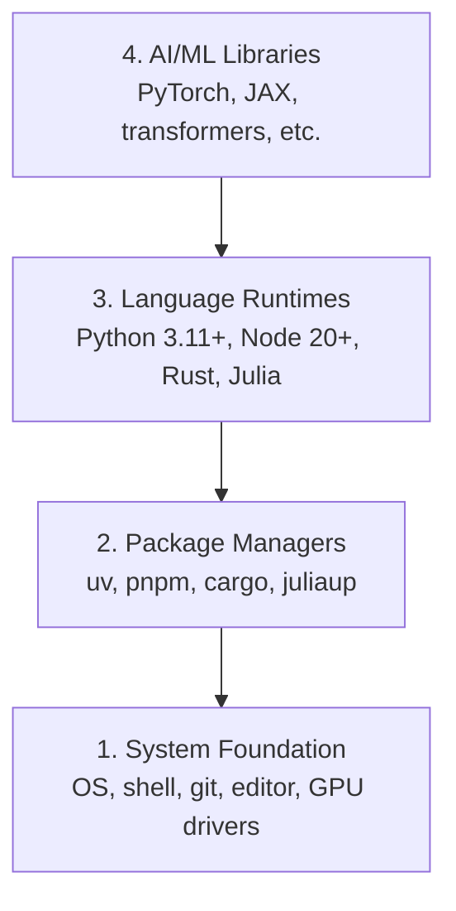

# Dev Environment

> Công cụ định hình tư duy của bạn. Hãy thiết lập chúng một lần và thiết lập cho đúng.

**Type:** Build
**Languages:** Python, Node.js, Rust
**Prerequisites:** None
**Time:** ~45 phút

## Mục tiêu học tập

- Thiết lập toolchain cho Python 3.11+, Node.js 20+ và Rust từ đầu
- Cấu hình môi trường ảo (virtual environments) và trình quản lý gói (package managers) để đảm bảo tính tái lập (reproducible builds)
- Xác thực quyền truy cập GPU với CUDA/MPS và chạy một phép toán tensor kiểm tra
- Hiểu về stack bốn lớp: hệ thống, gói, runtime, và các thư viện AI

## Vấn đề

Bạn sắp bắt đầu học AI engineering qua hơn 500 bài học sử dụng Python, TypeScript, Rust và Julia. Nếu môi trường của bạn bị lỗi, mỗi bài học sẽ trở thành một cuộc chiến với công cụ thay vì tập trung vào việc học.

Hầu hết mọi người bỏ qua bước thiết lập môi trường. Sau đó, họ mất hàng giờ để debug các lỗi import, xung đột phiên bản và thiếu driver CUDA. Chúng ta sẽ thực hiện việc này một lần, một cách bài bản.

## Khái niệm

Môi trường AI engineering có bốn lớp:



Chúng ta cài đặt từ dưới lên trên. Mỗi lớp phụ thuộc vào lớp bên dưới nó.

```figure
s0-env-stack
```

## Xây dựng

### Bước 1: Nền tảng hệ thống

Kiểm tra hệ thống của bạn và cài đặt các thành phần cơ bản.

```bash
# macOS
xcode-select --install
brew install git curl wget

# Ubuntu/Debian
sudo apt update && sudo apt install -y build-essential git curl wget

# Windows (use WSL2)
wsl --install -d Ubuntu-24.04
```

### Bước 2: Python với uv

Chúng ta sử dụng `uv` — nó nhanh hơn 10-100 lần so với pip và tự động xử lý các môi trường ảo.

```bash
curl -LsSf https://astral.sh/uv/install.sh | sh

uv python install 3.12

uv venv
source .venv/bin/activate  # or .venv\Scripts\activate on Windows

uv pip install numpy matplotlib jupyter
```

Xác thực:

```python
import sys
print(f"Python {sys.version}")

import numpy as np
print(f"NumPy {np.__version__}")
a = np.array([1, 2, 3])
print(f"Vector: {a}, dot product with itself: {np.dot(a, a)}")
```

### Bước 3: Node.js với pnpm

Dành cho các bài học về TypeScript (agents, MCP servers, web apps).

```bash
curl -fsSL https://fnm.vercel.app/install | bash
fnm install 22
fnm use 22

npm install -g pnpm

node -e "console.log('Node', process.version)"
```

**macOS / Apple Silicon (M1/M2/M3/M4):** Nếu trình cài đặt dừng lại với `Error: Cannot install under Rosetta 2 in ARM default prefix (/opt/homebrew)`, terminal của bạn đang chạy dưới Rosetta 2 (`arch` in ra `i386`) trong khi Homebrew là bản build arm64 native. Hãy cài đặt fnm với tùy chọn arm64, kết nối nó vào shell của bạn, sau đó chạy lại các lệnh trên từ `fnm install 22`:

```bash
arch -arm64 brew install fnm
echo 'eval "$(fnm env --use-on-cd)"' >> ~/.zshrc
source ~/.zshrc
```

### Bước 4: Rust

Dành cho các bài học yêu cầu hiệu năng cao (inference, systems).

```bash
curl --proto '=https' --tlsv1.2 -sSf https://sh.rustup.rs | sh

rustc --version
cargo --version
```

### Bước 5: Julia (Tùy chọn)

Dành cho các bài học chuyên sâu về toán học nơi Julia thể hiện thế mạnh.

```bash
curl -fsSL https://install.julialang.org | sh

julia -e 'println("Julia ", VERSION)'
```

### Bước 6: Thiết lập GPU (Nếu bạn có)

**NVIDIA (Linux / Windows):**

```bash
nvidia-smi

# Install PyTorch with CUDA
uv pip install torch torchvision torchaudio --index-url https://download.pytorch.org/whl/cu124
```

**macOS / Apple Silicon (M1/M2/M3/M4):** Không có CUDA trên Mac — điều này là bình thường, không phải lỗi. Đừng cài đặt `--index-url .../cuXXX` (các wheel đó chỉ dành cho Linux/Windows, nên việc cài đặt sẽ thất bại). Hãy cài đặt bản build thông thường, bao gồm backend GPU MPS (Metal) của Apple:

```bash
uv pip install torch torchvision torchaudio
```

Xác thực (hoạt động trên mọi nền tảng):

```python
import torch
print(f"CUDA available: {torch.cuda.is_available()}")           # False on macOS — expected
print(f"MPS available:  {torch.backends.mps.is_available()}")   # True on Apple Silicon
if torch.cuda.is_available():
    print(f"GPU: {torch.cuda.get_device_name(0)}")
```

Không có GPU? Không vấn đề gì. Hầu hết các bài học đều chạy được trên CPU. Đối với các bài học cần huấn luyện nặng, hãy sử dụng Google Colab hoặc GPU trên cloud.

### Bước 7: Xác thực lộ trình bạn muốn bắt đầu

Chạy mọi lệnh trong bài học này từ thư mục gốc của repository, thư mục chứa `README.md` và `phases/`. Các bước kiểm tra sơ bộ (preflight) chỉ kiểm tra những gì bạn cần để bắt đầu lộ trình đã chọn. Nó mặc định bỏ qua các công cụ nâng cao để người mới bắt đầu thấy một câu trả lời rõ ràng thay vì một loạt cảnh báo.

Bắt đầu chuỗi bài học cho người mới bắt đầu:

```bash
python3 phases/00-setup-and-tooling/01-dev-environment/code/verify.py --route beginner
```

Hoặc chỉ kiểm tra lộ trình bạn muốn:

```bash
python3 phases/00-setup-and-tooling/01-dev-environment/code/verify.py --route ml-foundations
python3 phases/00-setup-and-tooling/01-dev-environment/code/verify.py --route llm-engineering
python3 phases/00-setup-and-tooling/01-dev-environment/code/verify.py --route agents
python3 phases/00-setup-and-tooling/01-dev-environment/code/verify.py --route mcp
python3 phases/00-setup-and-tooling/01-dev-environment/code/verify.py --route agent-skills
python3 phases/00-setup-and-tooling/01-dev-environment/code/verify.py --route certification
```

Thêm `--show-later` khi bạn muốn quá trình kiểm tra sơ bộ kiểm tra cả các công cụ và phụ thuộc tùy chọn được sử dụng trong các bài học sau này. Việc thiếu một công cụ ở giai đoạn sau sẽ không bao giờ chặn lộ trình bạn đã chọn.

Mỗi bước kiểm tra thất bại đều bao gồm đường dẫn hoặc lỗi import được phát hiện và một lệnh sửa lỗi chính xác. Các lộ trình Agent Skills và chứng chỉ cũng hiển thị các bước kiểm tra thủ công trên host vì một script Python không thể chứng minh rằng một AI host đã phát hiện ra một kỹ năng hoặc phạm vi kỹ năng bạn chọn có thể ghi được hay không.

Khi quá trình kiểm tra sơ bộ cho người mới bắt đầu vượt qua, nó sẽ in ra bài học đầu tiên có thể chạy được:

```text
Ready to start Beginner course.
Next: python3 phases/01-math-foundations/01-linear-algebra-intuition/code/vectors.py
```

## Sử dụng

Môi trường của bạn đã sẵn sàng để bắt đầu lộ trình bạn đã chọn. Hãy cài đặt các công cụ sau này khi bài học yêu cầu thay vì chặn bài học đầu tiên của bạn bởi toàn bộ stack. Đây là những gì bạn sẽ sử dụng trong suốt chương trình học:

| Ngôn ngữ | Sử dụng trong | Trình quản lý gói |
|----------|---------|-----------------|
| Python | Các giai đoạn 1-12 (ML, DL, NLP, Vision, Audio, LLMs) | uv |
| TypeScript | Các giai đoạn 13-17 (Tools, Agents, Swarms, Infra) | pnpm |
| Rust | Các giai đoạn 12, 15-17 (Hệ thống yêu cầu hiệu năng cao) | cargo |
| Julia | Giai đoạn 1 (Nền tảng toán học) | Pkg |

## Triển khai

Bài học này tạo ra một script xác thực mà bất kỳ ai cũng có thể chạy để kiểm tra thiết lập của họ.

Xem `outputs/prompt-env-check.md` để biết prompt giúp các trợ lý AI chẩn đoán các vấn đề về môi trường.

## Bài tập

1. Chạy script xác thực và sửa mọi lỗi thất bại
2. Tạo một môi trường ảo Python cho khóa học này và cài đặt PyTorch
3. Viết một chương trình "hello world" bằng cả bốn ngôn ngữ và chạy từng chương trình một