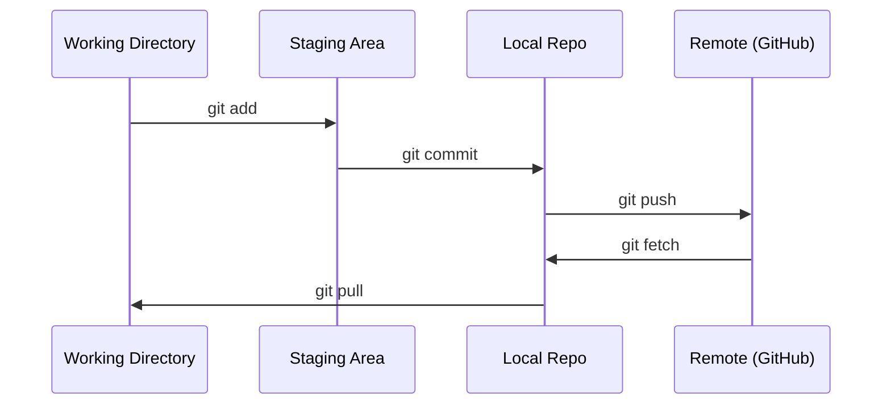

# Git & Collaboration

> Version control là bắt buộc. Mọi thí nghiệm, mọi mô hình, mọi bài học bạn xây dựng tại đây đều được theo dõi.

**Type:** Learn
**Languages:** --
**Prerequisites:** Phase 0, Lesson 01
**Time:** ~30 minutes

## Mục tiêu học tập

- Cấu hình danh tính git và sử dụng quy trình làm việc hàng ngày gồm add, commit và push
- Tạo và merge các branch để thực hiện các thí nghiệm cô lập mà không làm hỏng nhánh main
- Viết một `.gitignore` để loại trừ các model checkpoint và các tệp nhị phân lớn
- Điều hướng lịch sử commit với `git log` để hiểu quá trình phát triển của dự án

## Vấn đề

Bạn sắp viết hàng trăm tệp mã nguồn qua 20 giai đoạn. Nếu không có version control, bạn sẽ mất công sức, làm hỏng những thứ không thể hoàn tác và không có cách nào để cộng tác với người khác.

Git là công cụ. GitHub là nơi lưu trữ mã nguồn. Bài học này bao gồm những gì bạn cần cho khóa học này và không gì hơn thế.

## Khái niệm



Ba điều cần ghi nhớ:
1. Lưu thường xuyên (`git commit`)
2. Đẩy lên remote (`git push`)
3. Tạo branch cho các thí nghiệm (`git checkout -b experiment`)

```figure
s0-commit-dag
```

## Xây dựng

### Bước 1: Cấu hình git

```bash
git config --global user.name "Your Name"
git config --global user.email "you@example.com"
```

### Bước 2: Quy trình làm việc hàng ngày

```bash
git status
git add file.py
git commit -m "Add perceptron implementation"
git push origin main
```

### Bước 3: Tạo branch cho các thí nghiệm

```bash
git checkout -b experiment/new-optimizer

# ... make changes, commit ...

git checkout main
git merge experiment/new-optimizer
```

### Bước 4: Làm việc với repo của khóa học

Bạn không thể push trực tiếp vào repo của khóa học — chỉ những người quản trị mới có quyền ghi. Hãy Fork nó trên GitHub trước (nút Fork ở góc trên bên phải) để `origin` trỏ đến bản sao của riêng bạn:

```bash
git clone https://github.com/YOUR-USERNAME/ai-engineering-from-scratch.git
cd ai-engineering-from-scratch

git checkout -b my-progress
# work through lessons, commit your code
git push origin my-progress
```

## Sử dụng

Đối với khóa học này, bạn chỉ cần chính xác các lệnh sau:

| Lệnh | Khi nào |
|---------|------|
| `git clone` | Lấy repo của khóa học |
| `git add` + `git commit` | Lưu công việc của bạn |
| `git push` | Sao lưu lên GitHub |
| `git checkout -b` | Thử nghiệm điều gì đó mà không làm hỏng nhánh main |
| `git log --oneline` | Xem lại những gì bạn đã làm |

Chỉ vậy thôi. Bạn không cần dùng rebase, cherry-pick hay submodules cho khóa học này.

## Bài tập

1. Fork repo này, clone bản fork của bạn, tạo một branch tên là `my-progress`, tạo một tệp, commit và push nó lên
2. Tạo một `.gitignore` để loại trừ các tệp model checkpoint (`.pt`, `.pth`, `.safetensors`)
3. Xem lịch sử commit của repo này với `git log --oneline` và đọc cách các bài học được thêm vào

## Thuật ngữ chính

| Thuật ngữ | Mọi người thường nói | Ý nghĩa thực sự |
|------|----------------|----------------------|
| Commit | "Đang lưu" | Một bản chụp (snapshot) toàn bộ dự án của bạn tại một thời điểm |
| Branch | "Một bản sao" | Một con trỏ trỏ đến một commit và di chuyển về phía trước khi bạn làm việc |
| Merge | "Kết hợp mã" | Lấy các thay đổi từ một branch và áp dụng chúng vào một branch khác |
| Remote | "Trên đám mây" | Một bản sao repo của bạn được lưu trữ ở nơi khác (GitHub, GitLab) |