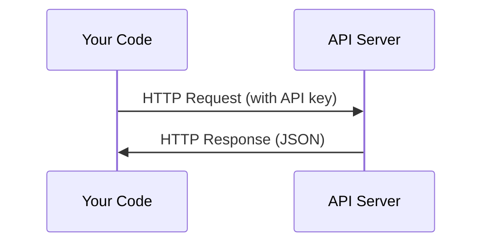

# APIs & Keys

> Mọi AI API đều hoạt động theo cùng một cách: gửi yêu cầu, nhận phản hồi. Chi tiết có thể thay đổi, nhưng mô hình thì không.

**Type:** Build
**Languages:** Python, TypeScript
**Prerequisites:** Phase 0, Lesson 01
**Time:** ~30 phút

## Mục tiêu học tập

- Lưu trữ API key một cách an toàn bằng cách sử dụng biến môi trường và tệp `.env`
- Thực hiện gọi LLM API bằng cả Anthropic Python SDK và HTTP thô (raw HTTP)
- So sánh định dạng request/response giữa SDK và HTTP thô để phục vụ việc debug
- Nhận diện và xử lý các lỗi API phổ biến bao gồm xác thực và giới hạn tốc độ (rate limit)

## Vấn đề

Bắt đầu từ Phase 11, bạn sẽ gọi các LLM API (Anthropic, OpenAI, Google). Trong Phase 13-16, bạn sẽ xây dựng các agent sử dụng những API này trong các vòng lặp. Bạn cần biết cách API key hoạt động, cách lưu trữ chúng an toàn và cách thực hiện lệnh gọi API đầu tiên của mình.

## Khái niệm



Mọi lệnh gọi API đều có:
1. Một endpoint (URL)
2. Một API key (xác thực)
3. Một request body (những gì bạn muốn)
4. Một response body (những gì bạn nhận lại)

```figure
s0-secret-inject
```

## Xây dựng

### Bước 1: Lưu trữ API key an toàn

Không bao giờ đặt API key trực tiếp trong code. Hãy sử dụng biến môi trường.

```bash
export ANTHROPIC_API_KEY="sk-ant-..."
export OPENAI_API_KEY="sk-..."
```

Hoặc sử dụng tệp `.env` (hãy thêm nó vào `.gitignore`):

```
ANTHROPIC_API_KEY=sk-ant-...
OPENAI_API_KEY=sk-...
```

### Bước 2: Lệnh gọi API đầu tiên (Python)

```python
import os

import anthropic

client = anthropic.Anthropic()

MODEL = os.environ.get("LLM_MODEL", "claude-sonnet-5")

response = client.messages.create(
    model=MODEL,
    max_tokens=256,
    messages=[{"role": "user", "content": "What is a neural network in one sentence?"}]
)

print(response.content[0].text)
```

`LLM_MODEL` chọn model id của Anthropic, và mặc định là alias Sonnet không kèm ngày tháng. Các nhà cung cấp khác (OpenAI, Google, và những bên khác) tuân theo cùng một mô hình gồm một key cộng với một model id, nhưng mỗi bên lại có SDK, endpoint và schema request/response riêng.

### Bước 3: Lệnh gọi API đầu tiên (TypeScript)

```typescript
import Anthropic from "@anthropic-ai/sdk";

const client = new Anthropic();

const MODEL = process.env.LLM_MODEL ?? "claude-sonnet-5";

const response = await client.messages.create({
  model: MODEL,
  max_tokens: 256,
  messages: [{ role: "user", content: "What is a neural network in one sentence?" }],
});

console.log(response.content[0].text);
```

### Bước 4: HTTP thô (không dùng SDK)

```python
import os
import urllib.request
import json

url = "https://api.anthropic.com/v1/messages"
headers = {
    "Content-Type": "application/json",
    "x-api-key": os.environ["ANTHROPIC_API_KEY"],
    "anthropic-version": "2023-06-01",
}
body = json.dumps({
    "model": os.environ.get("LLM_MODEL", "claude-sonnet-5"),
    "max_tokens": 256,
    "messages": [{"role": "user", "content": "What is a neural network in one sentence?"}],
}).encode()

req = urllib.request.Request(url, data=body, headers=headers, method="POST")
with urllib.request.urlopen(req) as resp:
    result = json.loads(resp.read())
    print(result["content"][0]["text"])
```

Đây là những gì các SDK thực hiện bên dưới. Hiểu về lệnh gọi HTTP thô sẽ giúp ích khi bạn cần debug.

## Sử dụng

Đối với khóa học này:

| API | Khi nào bạn cần | Gói miễn phí |
|-----|-----------------|-----------|
| Anthropic (Claude) | Phases 11-16 (agents, tools) | $5 credit khi đăng ký |
| OpenAI | Phase 11 (so sánh) | $5 credit khi đăng ký |
| Hugging Face | Phases 4-10 (models, datasets) | Miễn phí |

Bạn chưa cần tất cả chúng ngay bây giờ. Hãy thiết lập khi bài học yêu cầu.

## Triển khai

Bài học này tạo ra:
- `outputs/prompt-api-troubleshooter.md` - chẩn đoán các lỗi API phổ biến

## Bài tập

1. Lấy một Anthropic API key và thực hiện lệnh gọi API đầu tiên của bạn
2. Thử phiên bản HTTP thô và so sánh định dạng phản hồi với phiên bản SDK
3. Cố tình sử dụng sai API key và đọc thông báo lỗi

## Thuật ngữ chính

| Thuật ngữ | Cách gọi thông thường | Ý nghĩa thực tế |
|------|----------------|----------------------|
| API key | "Mật khẩu cho API" | Một chuỗi duy nhất định danh tài khoản của bạn và ủy quyền cho các yêu cầu |
| Rate limit | "Họ đang giới hạn tôi" | Số lượng yêu cầu tối đa mỗi phút/giờ để ngăn chặn lạm dụng và đảm bảo sử dụng công bằng |
| Token | "Một từ" (trong ngữ cảnh API) | Đơn vị tính phí: token đầu vào và đầu ra được đếm và tính phí riêng biệt |
| Streaming | "Phản hồi thời gian thực" | Nhận phản hồi từng từ một thay vì chờ đợi toàn bộ phản hồi |