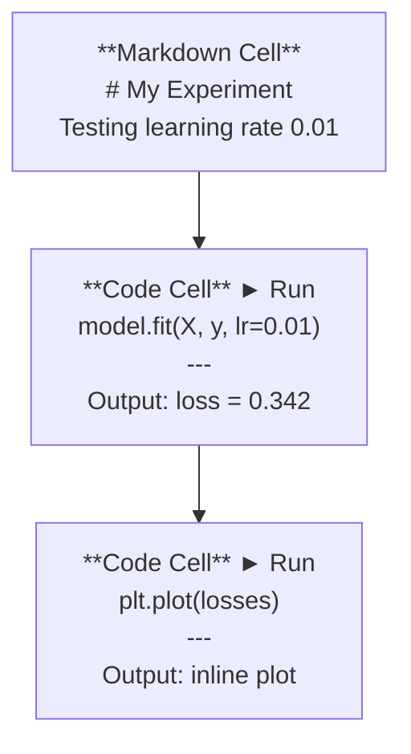
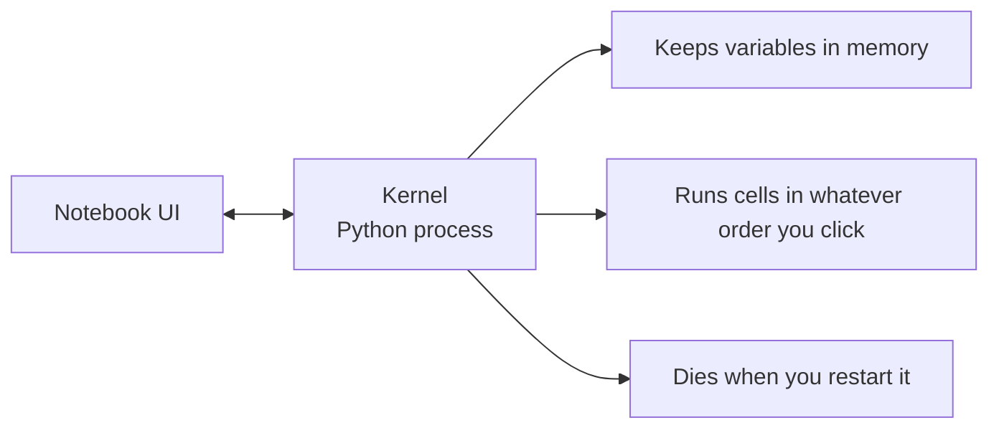

# Jupyter Notebooks

> Notebooks là bàn thí nghiệm của kỹ sư AI. Bạn tạo mẫu (prototype) tại đây, sau đó chuyển những gì hiệu quả vào môi trường production.

**Type:** Build
**Languages:** Python
**Prerequisites:** Phase 0, Lesson 01
**Time:** ~30 phút

## Mục tiêu học tập

- Cài đặt và khởi chạy JupyterLab, Jupyter Notebook, hoặc VS Code với extension Jupyter
- Sử dụng các magic command (`%timeit`, `%%time`, `%matplotlib inline`) để benchmark và trực quan hóa dữ liệu ngay trong notebook
- Phân biệt khi nào nên dùng notebook so với script và áp dụng quy trình "khám phá trong notebook, triển khai trong script"
- Nhận diện và tránh các lỗi thường gặp trong notebook: thực thi không theo thứ tự, trạng thái ẩn (hidden state), và rò rỉ bộ nhớ (memory leaks)

## Vấn đề

Mọi bài báo nghiên cứu AI, hướng dẫn và các cuộc thi Kaggle đều sử dụng Jupyter notebooks. Chúng cho phép bạn chạy code theo từng phần, xem kết quả ngay lập tức, kết hợp code với giải thích và lặp lại nhanh chóng. Nếu bạn cố gắng học AI mà không dùng notebook, giống như làm bài tập toán mà không có giấy nháp vậy.

Tuy nhiên, notebook cũng có những cái bẫy thực sự. Mọi người dùng chúng cho mọi thứ, kể cả những việc mà chúng không hề phù hợp. Biết khi nào nên dùng notebook và khi nào nên dùng script sẽ giúp bạn tránh được những cơn ác mộng khi debug sau này.

## Khái niệm

Một notebook là một danh sách các ô (cells). Mỗi ô có thể là code hoặc văn bản.



Kernel là một tiến trình Python chạy ở chế độ nền. Khi bạn chạy một ô, nó gửi code đến kernel, kernel thực thi và gửi lại kết quả. Tất cả các ô đều chia sẻ chung một kernel, vì vậy các biến sẽ tồn tại xuyên suốt giữa các ô.



Việc "bạn click theo bất kỳ thứ tự nào" vừa là siêu năng lực, vừa là con dao hai lưỡi.

```figure
s0-cell-order
```

## Xây dựng

### Bước 1: Chọn giao diện của bạn

Ba lựa chọn, một định dạng:

| Giao diện | Cài đặt | Phù hợp nhất cho |
|-----------|---------|----------|
| JupyterLab | `pip install jupyterlab` sau đó `jupyter lab` | Trải nghiệm IDE đầy đủ, nhiều tab, trình duyệt file, terminal |
| Jupyter Notebook | `pip install notebook` sau đó `jupyter notebook` | Đơn giản, nhẹ, mỗi lần một notebook |
| VS Code | Cài đặt extension "Jupyter" | Đã tích hợp sẵn trong editor, hỗ trợ git, debug |

Cả ba đều đọc và ghi cùng một file `.ipynb`. Hãy chọn bất cứ thứ gì bạn thích. JupyterLab là công cụ phổ biến nhất trong công việc AI.

```bash
pip install jupyterlab
jupyter lab
```

### Bước 2: Các phím tắt quan trọng

Bạn hoạt động ở hai chế độ. Nhấn `Escape` để vào chế độ lệnh (thanh màu xanh bên trái), `Enter` để vào chế độ chỉnh sửa (thanh màu xanh lá).

**Chế độ lệnh (thường dùng nhất):**

| Phím | Hành động |
|-----|--------|
| `Shift+Enter` | Chạy ô, chuyển sang ô tiếp theo |
| `A` | Chèn ô phía trên |
| `B` | Chèn ô phía dưới |
| `DD` | Xóa ô |
| `M` | Chuyển sang markdown |
| `Y` | Chuyển sang code |
| `Z` | Hoàn tác thao tác trên ô |
| `Ctrl+Shift+H` | Hiển thị tất cả phím tắt |

**Chế độ chỉnh sửa:**

| Phím | Hành động |
|-----|--------|
| `Tab` | Tự động hoàn thành (Autocomplete) |
| `Shift+Tab` | Hiển thị chữ ký hàm |
| `Ctrl+/` | Bật/tắt comment |

`Shift+Enter` là phím bạn sẽ dùng hàng nghìn lần mỗi ngày. Hãy học nó đầu tiên.

### Bước 3: Các loại ô

**Code cells** chạy Python và hiển thị kết quả:

```python
import numpy as np
data = np.random.randn(1000)
data.mean(), data.std()
```

Kết quả: `(0.0032, 0.9987)`

**Markdown cells** hiển thị văn bản đã định dạng. Sử dụng chúng để ghi chú những gì bạn đang làm và tại sao. Hỗ trợ tiêu đề, in đậm, in nghiêng, công thức toán LaTeX (`$E = mc^2$`), bảng và hình ảnh.

### Bước 4: Magic commands

Đây không phải là Python. Đây là các lệnh đặc thù của Jupyter bắt đầu bằng `%` (line magic) hoặc `%%` (cell magic).

**Đo thời gian chạy code:**

```python
%timeit np.random.randn(10000)
```

Kết quả: `45.2 us +/- 1.3 us per loop`

```python
%%time
model.fit(X_train, y_train, epochs=10)
```

Kết quả: `Wall time: 2.34 s`

`%timeit` chạy code nhiều lần và lấy trung bình. `%%time` chạy một lần. Sử dụng `%timeit` cho các microbenchmark, `%%time` cho các lần training.

**Bật hiển thị biểu đồ inline:**

```python
%matplotlib inline
```

Mọi `plt.plot()` hoặc `plt.show()` giờ đây sẽ hiển thị trực tiếp trong notebook.

**Cài đặt các gói mà không cần rời khỏi notebook:**

```python
!pip install scikit-learn
```

Tiền tố `!` chạy bất kỳ lệnh shell nào.

**Kiểm tra các biến môi trường:**

```python
%env CUDA_VISIBLE_DEVICES
```

### Bước 5: Hiển thị kết quả phong phú (Rich output)

Notebook tự động hiển thị biểu thức cuối cùng trong một ô. Nhưng bạn có thể kiểm soát nó:

```python
import pandas as pd

df = pd.DataFrame({
    "model": ["Linear", "Random Forest", "Neural Net"],
    "accuracy": [0.72, 0.89, 0.94],
    "training_time": [0.1, 2.3, 45.6]
})
df
```

Lệnh này hiển thị một bảng HTML đã định dạng, thay vì chỉ là văn bản thô. Tương tự với các biểu đồ:

```python
import matplotlib.pyplot as plt

plt.figure(figsize=(8, 4))
plt.plot([1, 2, 3, 4], [1, 4, 2, 3])
plt.title("Inline Plot")
plt.show()
```

Biểu đồ xuất hiện ngay bên dưới ô. Đây là lý do tại sao notebook thống trị công việc AI. Bạn thấy dữ liệu, biểu đồ và code cùng nhau.

Đối với hình ảnh:

```python
from IPython.display import Image, display
display(Image(filename="architecture.png"))
```

### Bước 6: Google Colab

Colab là một Jupyter notebook miễn phí trên đám mây. Nó cung cấp cho bạn GPU, các thư viện cài sẵn và tích hợp Google Drive. Không cần thiết lập.

1. Truy cập [colab.research.google.com](https://colab.research.google.com)
2. Tải lên bất kỳ file `.ipynb` nào từ khóa học này
3. Runtime > Change runtime type > T4 GPU (miễn phí)

Sự khác biệt của Colab so với Jupyter cục bộ:
- File không tồn tại vĩnh viễn giữa các phiên (hãy lưu vào Drive hoặc tải xuống)
- Cài sẵn: numpy, pandas, matplotlib, torch, tensorflow, sklearn
- `from google.colab import files` để tải lên/tải xuống file
- `from google.colab import drive; drive.mount('/content/drive')` cho lưu trữ bền vững
- Phiên làm việc sẽ hết hạn sau 90 phút không hoạt động (gói miễn phí)

## Sử dụng

### Notebooks vs Scripts: Khi nào dùng cái nào

| Dùng notebooks cho | Dùng scripts cho |
|-------------------|-----------------|
| Khám phá tập dữ liệu | Pipeline huấn luyện |
| Tạo mẫu mô hình | Các tiện ích có thể tái sử dụng |
| Trực quan hóa kết quả | Bất cứ thứ gì có `if __name__` |
| Giải thích công việc của bạn | Code chạy theo lịch trình |
| Thử nghiệm nhanh | Code production |
| Bài tập khóa học | Các gói và thư viện |

Quy tắc: **khám phá trong notebooks, triển khai trong scripts**.

Quy trình phổ biến trong AI:
1. Khám phá dữ liệu trong notebook
2. Tạo mẫu mô hình trong notebook
3. Khi đã hiệu quả, chuyển code sang các file `.py`
4. Import các file `.py` đó ngược lại vào notebook để thử nghiệm thêm

### Các lỗi thường gặp

**Thực thi không theo thứ tự.** Bạn chạy ô 5, sau đó ô 2, rồi ô 7. Notebook hoạt động trên máy bạn nhưng bị lỗi khi người khác chạy từ trên xuống dưới. Cách sửa: Kernel > Restart & Run All trước khi chia sẻ.

**Trạng thái ẩn (Hidden state).** Bạn xóa một ô nhưng biến nó tạo ra vẫn còn trong bộ nhớ. Notebook trông có vẻ sạch sẽ nhưng lại phụ thuộc vào một ô "ma". Cách sửa: Khởi động lại kernel thường xuyên.

**Rò rỉ bộ nhớ.** Tải tập dữ liệu 4GB, huấn luyện mô hình, tải tập dữ liệu khác. Không có gì được giải phóng. Cách sửa: `del variable_name` và `gc.collect()`, hoặc khởi động lại kernel.

## Triển khai

Bài học này tạo ra:
- `outputs/prompt-notebook-helper.md` để debug các vấn đề trong notebook

## Bài tập

1. Mở JupyterLab, tạo một notebook và sử dụng `%timeit` để so sánh list comprehension với numpy khi tạo một mảng gồm 100.000 số ngẫu nhiên
2. Tạo một notebook với cả ô markdown và code để tải một file CSV, hiển thị dataframe và vẽ biểu đồ. Sau đó chạy Kernel > Restart & Run All để xác nhận nó hoạt động từ trên xuống dưới
3. Lấy code từ `code/notebook_tips.py`, dán vào một Colab notebook và chạy nó với GPU miễn phí

## Thuật ngữ chính

| Thuật ngữ | Cách gọi thông thường | Ý nghĩa thực tế |
|------|----------------|----------------------|
| Kernel | "Thứ chạy code của tôi" | Một tiến trình Python riêng biệt thực thi các ô và giữ các biến trong bộ nhớ |
| Cell | "Một khối code" | Một đơn vị có thể chạy độc lập trong notebook, là code hoặc markdown |
| Magic command | "Mẹo Jupyter" | Các lệnh đặc biệt có tiền tố `%` hoặc `%%` để kiểm soát môi trường notebook |
| `.ipynb` | "File notebook" | Một file JSON chứa các ô, kết quả đầu ra và metadata. Viết tắt của IPython Notebook |

## Đọc thêm

- [JupyterLab Docs](https://jupyterlab.readthedocs.io/) cho bộ tính năng đầy đủ
- [Google Colab FAQ](https://research.google.com/colaboratory/faq.html) cho các giới hạn và tính năng riêng của Colab
- [28 Jupyter Notebook Tips](https://www.dataquest.io/blog/jupyter-notebook-tips-tricks-shortcuts/) cho các phím tắt nâng cao