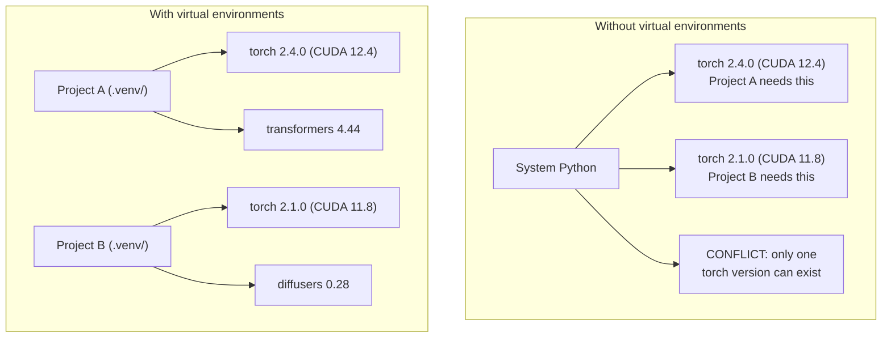

# Python Environments

> Dependency hell là có thật. Virtual environments chính là liều thuốc chữa trị.

**Type:** Build
**Languages:** Shell
**Prerequisites:** Phase 0, Lesson 01
**Time:** ~30 minutes

## Learning Objectives

- Tạo các virtual environment cô lập bằng `uv`, `venv`, hoặc `conda`
- Viết một `pyproject.toml` với các nhóm dependency tùy chọn và tạo lockfile để đảm bảo tính tái lập (reproducibility)
- Chẩn đoán và sửa các lỗi phổ biến: cài đặt global, trộn lẫn pip/conda, không khớp phiên bản CUDA
- Triển khai chiến lược môi trường theo từng phase cho các dự án có các dependency xung đột nhau

## The Problem

Bạn cài đặt PyTorch 2.4 cho một dự án fine-tuning. Tuần sau, một dự án khác lại cần PyTorch 2.1 vì bản build CUDA của nó bị khóa (pinned). Bạn nâng cấp global, dự án đầu tiên bị lỗi. Bạn hạ cấp, dự án thứ hai lại bị lỗi.

Đây chính là dependency hell. Nó xảy ra liên tục trong công việc AI/ML vì:

- PyTorch, JAX, và TensorFlow đều đi kèm với các CUDA binding riêng
- Các thư viện model khóa các phiên bản framework cụ thể
- Một lệnh `pip install` global sẽ ghi đè lên bất cứ thứ gì có trước đó
- Các bản build CUDA 11.8 không hoạt động với driver CUDA 12.x (và ngược lại)

Giải pháp: mỗi dự án cần một môi trường cô lập riêng với các gói (package) riêng của nó.

## The Concept



```figure
s0-env-isolation
```

## Build It

### Option 1: uv venv (Khuyên dùng)

`uv` là trình quản lý gói Python nhanh nhất (nhanh hơn 10-100 lần so với pip). Nó xử lý các virtual environment, phiên bản Python và giải quyết dependency trong một công cụ duy nhất.

```bash
curl -LsSf https://astral.sh/uv/install.sh | sh

uv python install 3.12

cd your-project
uv venv
source .venv/bin/activate
```

Cài đặt các gói:

```bash
uv pip install torch numpy
```

Tạo một dự án với `pyproject.toml` trong một bước:

```bash
uv init my-ai-project
cd my-ai-project
uv add torch numpy matplotlib
```

### Option 2: venv (Tích hợp sẵn)

Nếu bạn không thể cài đặt `uv`, Python có sẵn `venv`:

```bash
python3 -m venv .venv
source .venv/bin/activate  # Linux/macOS
.venv\Scripts\activate     # Windows

pip install torch numpy
```

Chậm hơn `uv`, nhưng hoạt động ở mọi nơi có cài đặt Python.

### Option 3: conda (Khi bạn cần)

Conda quản lý các dependency không phải Python như CUDA toolkit, cuDNN và các thư viện C. Hãy sử dụng nó khi:

- Bạn cần một phiên bản CUDA toolkit cụ thể mà không muốn cài đặt trên toàn hệ thống
- Bạn đang ở trên một cụm (cluster) dùng chung nơi bạn không thể cài đặt các gói hệ thống
- Hướng dẫn cài đặt của một thư viện yêu cầu "use conda"

```bash
# Install miniconda (not the full Anaconda)
curl -LsSf https://repo.anaconda.com/miniconda/Miniconda3-latest-Linux-x86_64.sh -o miniconda.sh
bash miniconda.sh -b

conda create -n myproject python=3.12
conda activate myproject

conda install pytorch torchvision torchaudio pytorch-cuda=12.4 -c pytorch -c nvidia
```

Một quy tắc: nếu bạn dùng conda cho một môi trường, hãy dùng conda cho tất cả các gói trong môi trường đó. Việc trộn lẫn `pip install` vào một conda env gây ra các xung đột dependency rất khó để debug.

### For This Course: Per-Phase Strategy

Bạn có thể tạo một môi trường cho toàn bộ khóa học. Đừng làm vậy. Các phase khác nhau cần các dependency khác nhau (đôi khi xung đột).

Chiến lược:

```
ai-engineering-from-scratch/
├── .venv/                    <-- shared lightweight env for phases 0-3
├── phases/
│   ├── 04-neural-networks/
│   │   └── .venv/            <-- PyTorch env
│   ├── 05-cnns/
│   │   └── .venv/            <-- same PyTorch env (symlink or shared)
│   ├── 08-transformers/
│   │   └── .venv/            <-- might need different transformer versions
│   └── 11-llm-apis/
│       └── .venv/            <-- API SDKs, no torch needed
```

Script trong `code/env_setup.sh` tạo môi trường cơ sở cho khóa học này.

## pyproject.toml Basics

Mỗi dự án Python nên có một `pyproject.toml`. Nó thay thế `setup.py`, `setup.cfg`, và `requirements.txt` trong một file duy nhất.

```toml
[project]
name = "ai-engineering-from-scratch"
version = "0.1.0"
requires-python = ">=3.11"
dependencies = [
    "numpy>=1.26",
    "matplotlib>=3.8",
    "jupyter>=1.0",
    "scikit-learn>=1.4",
]

[project.optional-dependencies]
torch = ["torch>=2.3", "torchvision>=0.18"]
llm = ["anthropic>=0.39", "openai>=1.50"]
```

Sau đó cài đặt:

```bash
uv pip install -e ".[torch]"    # base + PyTorch
uv pip install -e ".[llm]"     # base + LLM SDKs
uv pip install -e ".[torch,llm]" # everything
```

## Lockfiles

Lockfile khóa mọi dependency (bao gồm cả các dependency gián tiếp - transitive) vào các phiên bản chính xác. Điều này đảm bảo tính tái lập: bất kỳ ai cài đặt từ lockfile đều nhận được chính xác các gói giống hệt nhau.

```bash
# uv generates uv.lock automatically when using uv add
uv add numpy

# pip-tools approach
uv pip compile pyproject.toml -o requirements.lock
uv pip install -r requirements.lock
```

Hãy commit lockfile của bạn vào git. Khi ai đó clone repo, họ cài đặt từ lockfile và nhận được các phiên bản giống hệt.

## Common Mistakes

### 1. Cài đặt global

```bash
pip install torch  # BAD: installs to system Python

source .venv/bin/activate
pip install torch  # GOOD: installs to virtual environment
```

Kiểm tra xem các gói của bạn đi đâu:

```bash
which python       # should show .venv/bin/python, not /usr/bin/python
which pip           # should show .venv/bin/pip
```

### 2. Trộn lẫn pip và conda

```bash
conda create -n myenv python=3.12
conda activate myenv
conda install pytorch -c pytorch
pip install some-other-package   # BAD: can break conda's dependency tracking
conda install some-other-package # GOOD: let conda manage everything
```

Nếu bạn bắt buộc phải dùng pip bên trong conda (một số gói chỉ có trên pip), hãy cài đặt tất cả các gói conda trước, sau đó mới đến các gói pip.

### 3. Quên kích hoạt (activate)

```bash
python train.py           # uses system Python, missing packages
source .venv/bin/activate
python train.py           # uses project Python, packages found
```

Dòng lệnh (shell prompt) của bạn nên hiển thị tên môi trường:

```
(.venv) $ python train.py
```

### 4. Commit .venv vào git

```bash
echo ".venv/" >> .gitignore
```

Các virtual environment có dung lượng từ 200MB-2GB. Chúng là cục bộ, không thể di chuyển giữa các máy. Hãy commit `pyproject.toml` và lockfile thay vì commit thư mục môi trường.

### 5. Không khớp phiên bản CUDA

```bash
nvidia-smi                # shows driver CUDA version (e.g., 12.4)
python -c "import torch; print(torch.version.cuda)"  # shows PyTorch CUDA version

# These must be compatible.
# PyTorch CUDA version must be <= driver CUDA version.
```

## Use It

Chạy script setup để tạo môi trường khóa học của bạn:

```bash
bash phases/00-setup-and-tooling/06-python-environments/code/env_setup.sh
```

Thao tác này tạo ra một `.venv` tại thư mục gốc của repo với các dependency cốt lõi đã được cài đặt và xác minh.

## Exercises

1. Chạy `env_setup.sh` và xác minh tất cả các kiểm tra đều vượt qua
2. Tạo một virtual environment thứ hai, cài đặt một phiên bản numpy khác trong đó và xác nhận hai môi trường được cô lập với nhau
3. Viết một `pyproject.toml` cho một dự án cần cả PyTorch và Anthropic SDK
4. Cố tình cài đặt một gói global (không kích hoạt venv), quan sát xem nó đi đâu, sau đó gỡ cài đặt nó

## Key Terms

| Thuật ngữ | Cách gọi thông thường | Ý nghĩa thực tế |
|------|----------------|----------------------|
| Virtual environment | "A venv" | Một thư mục cô lập chứa trình thông dịch Python và các gói, tách biệt với Python hệ thống |
| Lockfile | "Pinned dependencies" | Một file liệt kê mọi gói và phiên bản chính xác của chúng, đảm bảo cài đặt giống hệt nhau trên các máy |
| pyproject.toml | "The new setup.py" | File cấu hình dự án Python tiêu chuẩn, thay thế cho setup.py/setup.cfg/requirements.txt |
| Transitive dependency | "A dependency of a dependency" | Gói B phụ thuộc vào C; nếu bạn cài đặt A (A phụ thuộc vào B), thì C là một dependency gián tiếp của A |
| CUDA mismatch | "My GPU isn't working" | PyTorch được biên dịch cho một phiên bản CUDA khác với phiên bản mà driver GPU của bạn hỗ trợ |