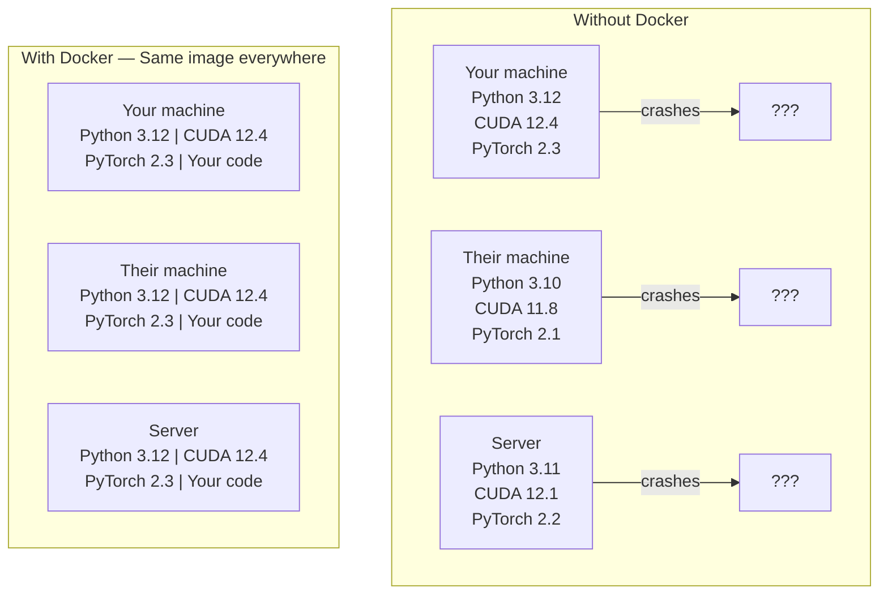

# Docker cho AI

> Container giúp loại bỏ tình trạng "chạy được trên máy tôi nhưng không chạy được trên máy bạn".

**Type:** Build
**Languages:** Docker
**Prerequisites:** Phase 0, Lessons 01 và 03
**Time:** ~60 phút

## Mục tiêu học tập

- Xây dựng Docker image hỗ trợ GPU với CUDA, PyTorch và các thư viện AI từ Dockerfile
- Mount các thư mục trên máy chủ (host) làm volume để lưu trữ model, tập dữ liệu và mã nguồn sau khi container được xây dựng lại
- Cấu hình NVIDIA Container Toolkit để truy cập GPU bên trong container
- Điều phối các ứng dụng AI đa dịch vụ (inference server + vector database) bằng Docker Compose

## Vấn đề

Bạn đã huấn luyện một model trên laptop của mình với PyTorch 2.3, CUDA 12.4 và Python 3.12. Đồng nghiệp của bạn sử dụng PyTorch 2.1, CUDA 11.8 và Python 3.10. Model của bạn bị lỗi trên máy của họ. Dockerfile của bạn thì chạy được trên cả hai.

Các dự án AI là cơn ác mộng về phụ thuộc (dependency). Một stack điển hình bao gồm Python, PyTorch, driver CUDA, cuDNN, các thư viện C cấp hệ thống và các gói chuyên biệt như flash-attn vốn yêu cầu phiên bản trình biên dịch chính xác. Docker đóng gói tất cả những thứ này vào một image duy nhất chạy giống hệt nhau ở mọi nơi.

## Khái niệm

Docker bao bọc mã nguồn, runtime, thư viện và các công cụ hệ thống của bạn vào một đơn vị cô lập gọi là container. Hãy coi nó như một máy ảo nhẹ, ngoại trừ việc nó chia sẻ kernel của hệ điều hành máy chủ thay vì chạy kernel riêng, vì vậy nó khởi động trong vài giây thay vì vài phút.



### Tại sao các dự án AI cần Docker hơn hầu hết các dự án khác

1. **Driver GPU rất nhạy cảm.** Mã nguồn CUDA 12.4 không chạy được trên CUDA 11.8. Docker cô lập bộ công cụ CUDA bên trong container trong khi vẫn chia sẻ driver GPU của máy chủ thông qua NVIDIA Container Toolkit.

2. **Trọng số model rất lớn.** Một model 7B tham số có dung lượng 14 GB ở định dạng fp16. Bạn không muốn tải lại nó mỗi khi xây dựng lại container. Docker volume cho phép bạn mount thư mục chứa model từ máy chủ vào.

3. **Kiến trúc đa dịch vụ rất phổ biến.** Một ứng dụng AI thực tế không chỉ là một script Python. Nó là một inference server, một vector database cho RAG, có thể là một web frontend. Docker Compose điều phối tất cả những thứ này bằng một lệnh duy nhất.

### Từ vựng chính

| Thuật ngữ | Ý nghĩa |
|------|---------------|
| Image | Một template chỉ đọc. Công thức của bạn. Được xây dựng từ Dockerfile. |
| Container | Một instance đang chạy của image. Nhà bếp của bạn. |
| Dockerfile | Các hướng dẫn để xây dựng image. Từng lớp một. |
| Volume | Bộ nhớ lưu trữ bền vững, không bị mất khi container khởi động lại. |
| docker-compose | Công cụ để định nghĩa các ứng dụng đa container bằng YAML. |

### Các mô hình container phổ biến trong AI

```
Dev Container
  Full toolkit. Editor support. Jupyter. Debugging tools.
  Used during development and experimentation.

Training Container
  Minimal. Just the training script and dependencies.
  Runs on GPU clusters. No editor, no Jupyter.

Inference Container
  Optimized for serving. Small image. Fast cold start.
  Runs behind a load balancer in production.
```

```figure
s0-image-layers
```

## Thực hành

### Bước 1: Cài đặt Docker

```bash
# macOS
brew install --cask docker
open /Applications/Docker.app

# Ubuntu
curl -fsSL https://get.docker.com | sh
sudo usermod -aG docker $USER
# Log out and back in for group change to take effect
```

Xác minh:

```bash
docker --version
docker run hello-world
```

### Bước 2: Cài đặt NVIDIA Container Toolkit (Linux với GPU NVIDIA)

Điều này cho phép các Docker container truy cập GPU của bạn. Người dùng macOS và Windows (WSL2) có thể bỏ qua bước này; Docker Desktop xử lý GPU passthrough khác biệt trên các nền tảng đó.

```bash
distribution=$(. /etc/os-release;echo $ID$VERSION_ID)
curl -fsSL https://nvidia.github.io/libnvidia-container/gpgkey | sudo gpg --dearmor -o /usr/share/keyrings/nvidia-container-toolkit-keyring.gpg
curl -s -L https://nvidia.github.io/libnvidia-container/$distribution/libnvidia-container.list | \
    sed 's#deb https://#deb [signed-by=/usr/share/keyrings/nvidia-container-toolkit-keyring.gpg] https://#g' | \
    sudo tee /etc/apt/sources.list.d/nvidia-container-toolkit.list

sudo apt-get update
sudo apt-get install -y nvidia-container-toolkit
sudo nvidia-ctk runtime configure --runtime=docker
sudo systemctl restart docker
```

Kiểm tra quyền truy cập GPU bên trong container:

```bash
docker run --rm --gpus all nvidia/cuda:12.4.1-base-ubuntu22.04 nvidia-smi
```

Nếu bạn thấy thông tin GPU của mình, toolkit đang hoạt động.

### Bước 3: Hiểu về base image

Chọn đúng base image giúp tiết kiệm hàng giờ gỡ lỗi.

```
nvidia/cuda:12.4.1-devel-ubuntu22.04
  Full CUDA toolkit. Compilers included.
  Use for: building packages that need nvcc (flash-attn, bitsandbytes)
  Size: ~4 GB

nvidia/cuda:12.4.1-runtime-ubuntu22.04
  CUDA runtime only. No compilers.
  Use for: running pre-built code
  Size: ~1.5 GB

pytorch/pytorch:2.6.0-cuda12.4-cudnn9-runtime
  PyTorch pre-installed on top of CUDA.
  Use for: skipping the PyTorch install step
  Size: ~6 GB

python:3.12-slim
  No CUDA. CPU only.
  Use for: inference on CPU, lightweight tools
  Size: ~150 MB
```

### Bước 4: Viết Dockerfile cho phát triển AI

Đây là Dockerfile trong `code/Dockerfile`. Hãy xem qua nó:

```dockerfile
FROM nvidia/cuda:12.4.1-devel-ubuntu22.04

ENV DEBIAN_FRONTEND=noninteractive
ENV PYTHONUNBUFFERED=1

RUN apt-get update && apt-get install -y --no-install-recommends \
    software-properties-common \
    git \
    curl \
    build-essential \
    && add-apt-repository -y ppa:deadsnakes/ppa \
    && apt-get update && apt-get install -y --no-install-recommends \
    python3.12 \
    python3.12-venv \
    python3.12-dev \
    && rm -rf /var/lib/apt/lists/*

RUN update-alternatives --install /usr/bin/python python /usr/bin/python3.12 1

RUN curl -sSL https://raw.githubusercontent.com/pypa/get-pip/3b73145063be545b649ad9ca83ea8da5fc915a4f/public/get-pip.py -o /tmp/get-pip.py \
    && echo "a341e1a43e38001c551a1508a73ff23636a11970b61d901d9a1cad2a18f57055  /tmp/get-pip.py" | sha256sum -c - \
    && python /tmp/get-pip.py \
    && rm /tmp/get-pip.py \
    && update-alternatives --install /usr/bin/pip pip /usr/local/bin/pip3.12 1

RUN python -m pip install --no-cache-dir --upgrade pip setuptools wheel

RUN python -m pip install --no-cache-dir \
    torch==2.6.0+cu124 \
    torchvision==0.21.0+cu124 \
    torchaudio==2.6.0+cu124 \
    --index-url https://download.pytorch.org/whl/cu124

RUN python -m pip install --no-cache-dir \
    numpy \
    pandas \
    scikit-learn \
    matplotlib \
    jupyter \
    transformers \
    datasets \
    accelerate \
    safetensors

WORKDIR /workspace

VOLUME ["/workspace", "/models"]

EXPOSE 8888

CMD ["python"]
```

Xây dựng nó:

```bash
docker build -t ai-dev -f phases/00-setup-and-tooling/07-docker-for-ai/code/Dockerfile .
```

Việc này mất một chút thời gian trong lần đầu tiên (tải xuống base image CUDA + PyTorch). Các lần xây dựng sau sẽ sử dụng các lớp đã được cache.

Chạy nó:

```bash
docker run --rm -it --gpus all \
    -v $(pwd):/workspace \
    -v ~/models:/models \
    ai-dev python -c "import torch; print(f'PyTorch {torch.__version__}, CUDA: {torch.cuda.is_available()}')"
```

Chạy Jupyter bên trong container:

```bash
docker run --rm -it --gpus all \
    -v $(pwd):/workspace \
    -v ~/models:/models \
    -p 8888:8888 \
    ai-dev jupyter notebook --ip=0.0.0.0 --port=8888 --no-browser --allow-root
```

### Bước 5: Volume mounts cho dữ liệu và model

Volume mounts rất quan trọng đối với công việc AI. Nếu không có chúng, model 14 GB của bạn sẽ biến mất khi container dừng lại.

```bash
# Mount your code
-v $(pwd):/workspace

# Mount a shared models directory
-v ~/models:/models

# Mount datasets
-v ~/datasets:/data
```

Bên trong script huấn luyện, hãy load từ đường dẫn đã mount:

```python
from transformers import AutoModel

model = AutoModel.from_pretrained("/models/llama-7b")
```

Model nằm trên hệ thống tệp của máy chủ. Bạn có thể xây dựng lại container bao nhiêu lần tùy thích mà không cần tải lại.

### Bước 6: Docker Compose cho ứng dụng AI đa dịch vụ

Một ứng dụng RAG thực tế cần một inference server và một vector database. Docker Compose chạy cả hai bằng một lệnh.

Xem `code/docker-compose.yml`:

```yaml
services:
  ai-dev:
    build:
      context: .
      dockerfile: Dockerfile
    deploy:
      resources:
        reservations:
          devices:
            - driver: nvidia
              count: all
              capabilities: [gpu]
    volumes:
      - ../../../:/workspace
      - ~/models:/models
      - ~/datasets:/data
    ports:
      - "8888:8888"
    stdin_open: true
    tty: true
    command: jupyter notebook --ip=0.0.0.0 --port=8888 --no-browser --allow-root

  qdrant:
    image: qdrant/qdrant:v1.12.5
    ports:
      - "6333:6333"
      - "6334:6334"
    volumes:
      - qdrant_data:/qdrant/storage

volumes:
  qdrant_data:
```

Khởi động mọi thứ:

```bash
cd phases/00-setup-and-tooling/07-docker-for-ai/code
docker compose up -d
```

Bây giờ container phát triển AI của bạn có thể truy cập vector database tại `http://qdrant:6333` bằng tên dịch vụ. Docker Compose tự động tạo một mạng chia sẻ.

Kiểm tra kết nối từ bên trong container AI:

```python
from qdrant_client import QdrantClient

client = QdrantClient(host="qdrant", port=6333)
print(client.get_collections())
```

Dừng mọi thứ:

```bash
docker compose down
```

Thêm `-v` để xóa cả volume của qdrant:

```bash
docker compose down -v
```

### Bước 7: Các lệnh Docker hữu ích cho công việc AI

```bash
# List running containers
docker ps

# List all images and their sizes
docker images

# Remove unused images (reclaim disk space)
docker system prune -a

# Check GPU usage inside a running container
docker exec -it <container_id> nvidia-smi

# Copy a file from container to host
docker cp <container_id>:/workspace/results.csv ./results.csv

# View container logs
docker logs -f <container_id>
```

## Sử dụng

Bạn hiện đã có một môi trường phát triển AI có thể tái lập. Trong phần còn lại của khóa học này:

- Sử dụng `docker compose up` để khởi động môi trường phát triển và vector database cùng nhau
- Mount mã nguồn, model và dữ liệu dưới dạng volume để không bị mất dữ liệu giữa các lần xây dựng lại
- Khi một bài học yêu cầu gói Python mới, hãy thêm nó vào Dockerfile và xây dựng lại
- Chia sẻ Dockerfile với đồng đội. Họ sẽ có môi trường chính xác như bạn.

### Không có GPU?

Xóa cờ `--gpus all` và khối triển khai NVIDIA. Container vẫn hoạt động cho các bài học dựa trên CPU. PyTorch tự động phát hiện sự vắng mặt của CUDA và chuyển sang sử dụng CPU.

## Bài tập

1. Xây dựng Dockerfile và chạy `python -c "import torch; print(torch.__version__)"` bên trong container
2. Khởi động stack docker-compose và xác minh Qdrant có thể truy cập được từ container AI tại `http://qdrant:6333/collections`
3. Thêm `flask` vào Dockerfile, xây dựng lại và chạy một API server đơn giản trên cổng 5000. Map cổng với `-p 5000:5000`
4. Đo kích thước image với `docker images`. Thử chuyển base image từ `devel` sang `runtime` và so sánh kích thước

## Thuật ngữ chính

| Thuật ngữ | Cách gọi thông thường | Ý nghĩa thực tế |
|------|----------------|----------------------|
| Container | "Máy ảo nhẹ" | Một tiến trình cô lập sử dụng kernel của máy chủ, với hệ thống tệp và mạng riêng |
| Image layer | "Bước đã cache" | Mỗi hướng dẫn trong Dockerfile tạo ra một lớp. Các lớp không thay đổi sẽ được cache, giúp xây dựng lại nhanh chóng. |
| NVIDIA Container Toolkit | "GPU trong Docker" | Một hook runtime cho phép container truy cập GPU máy chủ thông qua cờ `--gpus` |
| Volume mount | "Thư mục chia sẻ" | Một thư mục trên máy chủ được map vào container. Các thay đổi vẫn tồn tại sau khi container dừng. |
| Base image | "Điểm bắt đầu" | Image `FROM` mà Dockerfile của bạn xây dựng dựa trên đó. Quyết định những gì được cài đặt sẵn. |