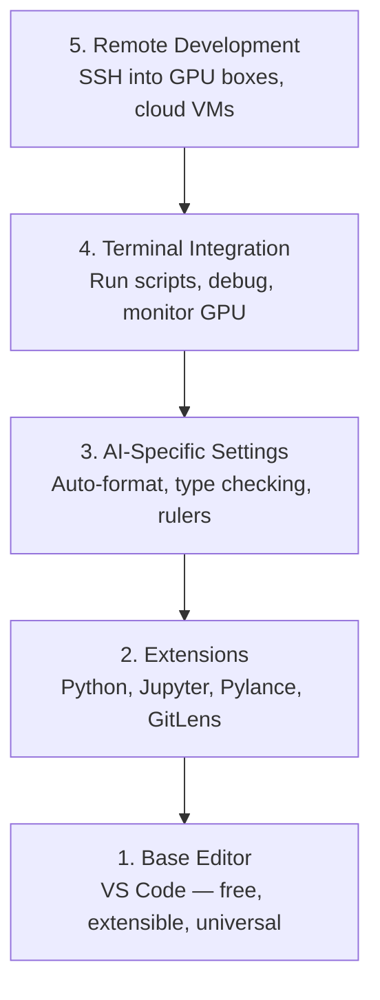

# Editor Setup

> Trình soạn thảo (editor) chính là người đồng hành của bạn. Hãy cấu hình nó một lần để nó không gây cản trở và bắt đầu hỗ trợ công việc của bạn một cách hiệu quả.

**Type:** Build
**Languages:** --
**Prerequisites:** Phase 0, Lesson 01
**Time:** ~20 phút

## Mục tiêu học tập

- Cài đặt VS Code với các extension thiết yếu cho Python, Jupyter, linting và Remote SSH
- Cấu hình format-on-save, kiểm tra kiểu dữ liệu (type checking) và cuộn đầu ra (output scrolling) cho các workflow AI
- Thiết lập Remote SSH để chỉnh sửa và debug code trên các máy GPU từ xa như thể đang làm việc cục bộ
- Đánh giá các trình soạn thảo thay thế (Cursor, Windsurf, Neovim) và ưu nhược điểm của chúng đối với công việc AI

## Vấn đề

Bạn sẽ dành hàng ngàn giờ trong trình soạn thảo để viết Python, chạy các notebook, debug các vòng lặp huấn luyện (training loops) và SSH vào các máy GPU. Một trình soạn thảo được cấu hình sai sẽ biến mỗi phiên làm việc thành một sự khó chịu: không có tự động hoàn thiện (autocomplete), không có gợi ý kiểu dữ liệu (type hints), không có lỗi inline, phải định dạng thủ công và workflow terminal cồng kềnh.

Thiết lập đúng chỉ mất 20 phút. Bỏ qua nó sẽ khiến bạn mất 20 phút mỗi ngày.

## Khái niệm

Một thiết lập trình soạn thảo cho kỹ sư AI cần năm yếu tố:



```figure
s0-lsp-roundtrip
```

## Xây dựng

### Bước 1: Cài đặt VS Code

VS Code là trình soạn thảo được khuyến nghị. Nó miễn phí, chạy trên mọi hệ điều hành, hỗ trợ Jupyter notebook hạng nhất và hệ sinh thái extension bao phủ mọi thứ bạn cần cho công việc AI.

Tải xuống tại [code.visualstudio.com](https://code.visualstudio.com/).

Xác minh từ terminal:

```bash
code --version
```

Nếu `code` không được tìm thấy trên macOS, hãy mở VS Code, nhấn `Cmd+Shift+P`, gõ "Shell Command" và chọn "Install 'code' command in PATH".

### Bước 2: Cài đặt các Extension thiết yếu

Mở terminal tích hợp trong VS Code (`` Ctrl+` `` trên mọi nền tảng) và cài đặt các extension quan trọng cho công việc AI:

```bash
code --install-extension ms-python.python
code --install-extension ms-python.vscode-pylance
code --install-extension ms-toolsai.jupyter
code --install-extension eamodio.gitlens
code --install-extension ms-vscode-remote.remote-ssh
code --install-extension ms-python.debugpy
code --install-extension ms-python.black-formatter
code --install-extension charliermarsh.ruff
```

Chức năng của từng extension:

| Extension | Tại sao cần |
|-----------|-----|
| Python | Hỗ trợ ngôn ngữ, phát hiện virtual env, chạy/debug |
| Pylance | Kiểm tra kiểu dữ liệu nhanh, autocomplete, phân giải import |
| Jupyter | Chạy notebook bên trong VS Code, trình khám phá biến (variable explorer) |
| GitLens | Xem ai đã thay đổi cái gì, git blame inline |
| Remote SSH | Mở thư mục trên máy GPU từ xa như thể đang ở máy cục bộ |
| Debugpy | Debug từng bước cho Python |
| Black Formatter | Tự động định dạng khi lưu, phong cách nhất quán |
| Ruff | Linting nhanh, bắt các lỗi phổ biến |

Tệp `code/.vscode/extensions.json` trong bài học này chứa danh sách khuyến nghị đầy đủ. Khi bạn mở thư mục dự án, VS Code sẽ nhắc bạn cài đặt chúng.

### Bước 3: Cấu hình cài đặt

Sao chép các cài đặt từ `code/.vscode/settings.json` trong bài học này hoặc áp dụng thủ công thông qua `Settings > Open Settings (JSON)`.

Các cài đặt quan trọng cho công việc AI:

```jsonc
{
    "python.analysis.typeCheckingMode": "basic",
    "editor.formatOnSave": true,
    "editor.rulers": [88, 120],
    "notebook.output.scrolling": true,
    "files.autoSave": "afterDelay"
}
```

Tại sao chúng quan trọng:

- **Type checking on basic**: Bắt lỗi sai kiểu đối số trước khi bạn chạy. Tiết kiệm thời gian debug khi bị lệch shape tensor hoặc sai tham số API.
- **Format on save**: Không bao giờ phải bận tâm về định dạng nữa. Black sẽ xử lý việc đó.
- **Rulers at 88 and 120**: Black ngắt dòng ở 88. Dấu mốc 120 cho thấy khi nào docstring và comment trở nên quá dài.
- **Notebook output scrolling**: Các vòng lặp huấn luyện in ra hàng ngàn dòng. Nếu không có cuộn, bảng điều khiển đầu ra sẽ bị tràn.
- **Auto-save**: Bạn sẽ quên lưu. Script huấn luyện của bạn sẽ chạy code cũ. Auto-save ngăn chặn điều này.

### Bước 4: Tích hợp Terminal

Terminal tích hợp của VS Code là nơi bạn chạy các script huấn luyện, giám sát GPU và quản lý môi trường.

Thiết lập nó đúng cách:

```jsonc
{
    "terminal.integrated.defaultProfile.osx": "zsh",
    "terminal.integrated.defaultProfile.linux": "bash",
    "terminal.integrated.fontSize": 13,
    "terminal.integrated.scrollback": 10000
}
```

Các phím tắt hữu ích:

| Hành động | macOS | Linux/Windows |
|--------|-------|---------------|
| Bật/tắt terminal | `` Ctrl+` `` | `` Ctrl+` `` |
| Terminal mới | `` Ctrl+Shift+` `` | `` Ctrl+Shift+` `` |
| Chia terminal | `Cmd+\` | `Ctrl+Shift+5` |

Chia terminal rất hữu ích: một cái để chạy script, một cái để giám sát GPU bằng `nvidia-smi -l 1` hoặc `watch -n 1 nvidia-smi`.

### Bước 5: Phát triển từ xa (SSH vào các máy GPU)

Đây là extension quan trọng nhất cho công việc AI. Bạn sẽ chạy huấn luyện trên các máy từ xa (cloud VM, server phòng lab, Lambda, Vast.ai). Remote SSH cho phép bạn mở hệ thống tệp từ xa, chỉnh sửa tệp, chạy terminal và debug như thể mọi thứ đều là cục bộ.

Thiết lập:

1. Cài đặt extension Remote SSH (đã thực hiện ở Bước 2).
2. Nhấn `Ctrl+Shift+P` (hoặc `Cmd+Shift+P`), gõ "Remote-SSH: Connect to Host".
3. Nhập `user@your-gpu-box-ip`.
4. VS Code sẽ tự động cài đặt thành phần server của nó trên máy từ xa.

Để truy cập không cần mật khẩu, hãy thiết lập SSH keys:

```bash
ssh-keygen -t ed25519 -C "your-email@example.com"
ssh-copy-id user@your-gpu-box-ip
```

Thêm host vào `~/.ssh/config` để thuận tiện:

```
Host gpu-box
    HostName 203.0.113.50
    User ubuntu
    IdentityFile ~/.ssh/id_ed25519
    ForwardAgent yes
```

Bây giờ `Remote-SSH: Connect to Host > gpu-box` sẽ kết nối ngay lập tức.

## Các lựa chọn thay thế

### Cursor

[cursor.com](https://cursor.com) là một bản fork của VS Code với tính năng tạo code bằng AI tích hợp. Nó sử dụng cùng hệ sinh thái extension và định dạng cài đặt. Nếu bạn sử dụng Cursor, mọi thứ trong bài học này vẫn áp dụng được. Hãy import cùng `settings.json` và `extensions.json`.

### Windsurf

[windsurf.com](https://windsurf.com) là một bản fork VS Code ưu tiên AI khác. Tương tự: cùng extension, cùng định dạng cài đặt, cùng hỗ trợ Remote SSH.

### Vim/Neovim

Nếu bạn đã sử dụng Vim hoặc Neovim và làm việc hiệu quả với nó, hãy tiếp tục sử dụng. Thiết lập tối thiểu cho công việc Python AI:

- **pyright** hoặc **pylsp** để kiểm tra kiểu dữ liệu (thông qua Mason hoặc cài đặt thủ công)
- **nvim-lspconfig** để tích hợp language server
- **jupyter-vim** hoặc **molten-nvim** để thực thi như notebook
- **telescope.nvim** để tìm kiếm tệp/ký hiệu
- **none-ls.nvim** với black và ruff để định dạng/linting

Nếu bạn chưa sử dụng Vim, đừng bắt đầu bây giờ. Đường cong học tập sẽ cạnh tranh với việc học kỹ thuật AI. Hãy sử dụng VS Code.

## Sử dụng

Với thiết lập này, workflow hàng ngày của bạn sẽ trông như sau:

1. Mở thư mục dự án trong VS Code (hoặc kết nối qua Remote SSH tới máy GPU).
2. Viết Python trong trình soạn thảo với autocomplete, type hints và lỗi inline.
3. Chạy Jupyter notebook inline với extension Jupyter.
4. Sử dụng terminal tích hợp cho các script huấn luyện, `uv pip install` và giám sát GPU.
5. Xem lại các thay đổi với GitLens trước khi commit.

## Bài tập

1. Cài đặt VS Code và tất cả các extension được liệt kê ở Bước 2
2. Sao chép `settings.json` từ bài học này vào cấu hình VS Code của bạn
3. Mở một tệp Python và xác minh rằng Pylance hiển thị type hints và Black định dạng khi lưu
4. Nếu bạn có quyền truy cập vào máy từ xa, hãy thiết lập Remote SSH và mở một thư mục trên đó

## Thuật ngữ chính

| Thuật ngữ | Cách gọi thông thường | Ý nghĩa thực tế |
|------|----------------|----------------------|
| LSP | "Công cụ autocomplete" | Language Server Protocol: một tiêu chuẩn để các trình soạn thảo nhận thông tin kiểu dữ liệu, gợi ý và chẩn đoán từ một server chuyên biệt cho ngôn ngữ |
| Pylance | "Plugin Python" | Language server Python của Microsoft sử dụng Pyright để kiểm tra kiểu dữ liệu và IntelliSense |
| Remote SSH | "Làm việc trên server" | Extension VS Code chạy một server nhẹ trên máy từ xa và truyền giao diện tới trình soạn thảo cục bộ của bạn |
| Format on save | "Auto-prettier" | Trình soạn thảo chạy một bộ định dạng (Black, Ruff) mỗi khi bạn lưu, giúp phong cách code luôn nhất quán |