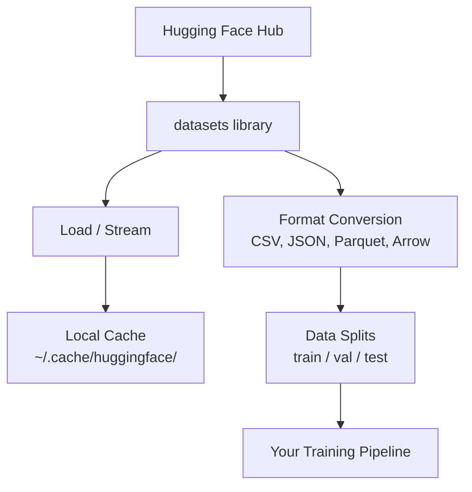

# Quản lý dữ liệu

> Dữ liệu là nhiên liệu. Cách bạn quản lý nó quyết định tốc độ bạn đạt được.

**Type:** Build
**Language:** Python
**Prerequisites:** Phase 0, Lesson 01
**Time:** ~45 phút

## Mục tiêu học tập

- Tải, stream và cache các tập dữ liệu bằng thư viện Hugging Face `datasets`
- Chuyển đổi giữa các định dạng CSV, JSON, Parquet và Arrow, đồng thời giải thích các ưu nhược điểm của chúng
- Tạo các tập train/validation/test có thể tái lập với các random seed cố định
- Quản lý các tệp mô hình và tập dữ liệu lớn bằng `.gitignore`, Git LFS hoặc DVC

## Vấn đề

Mọi dự án AI đều bắt đầu bằng dữ liệu. Bạn cần tìm kiếm tập dữ liệu, tải xuống, chuyển đổi định dạng, chia tách để huấn luyện và đánh giá, cũng như quản lý phiên bản để các thí nghiệm có thể tái lập. Việc thực hiện thủ công mỗi lần sẽ rất chậm và dễ xảy ra sai sót. Bạn cần một quy trình làm việc có thể lặp lại.

## Khái niệm



Thư viện Hugging Face `datasets` là tiêu chuẩn để tải dữ liệu cho các công việc AI. Nó xử lý việc tải xuống, cache, chuyển đổi định dạng và streaming một cách mặc định.

```figure
s0-data-pipeline
```

## Xây dựng

### Bước 1: Cài đặt thư viện datasets

```bash
pip install datasets huggingface_hub
```

### Bước 2: Tải tập dữ liệu

```python
from datasets import load_dataset

dataset = load_dataset("stanfordnlp/imdb")
print(dataset)
print(dataset["train"][0])
```

Lệnh này tải xuống tập dữ liệu đánh giá phim IMDB. Sau lần tải đầu tiên, nó sẽ được tải từ cache tại `~/.cache/huggingface/datasets/`.

### Bước 3: Stream các tập dữ liệu lớn

Một số tập dữ liệu quá lớn để lưu trữ trên ổ đĩa. Streaming cho phép tải chúng theo từng dòng mà không cần tải toàn bộ dữ liệu.

```python
dataset = load_dataset("wikimedia/wikipedia", "20220301.en", split="train", streaming=True)

for i, example in enumerate(dataset):
    print(example["title"])
    if i >= 4:
        break
```

Streaming cung cấp cho bạn một `IterableDataset`. Bạn xử lý các dòng dữ liệu ngay khi chúng được nhận. Mức sử dụng bộ nhớ vẫn ổn định bất kể kích thước tập dữ liệu.

### Bước 4: Các định dạng tập dữ liệu

Thư viện `datasets` sử dụng Apache Arrow ở bên dưới. Bạn có thể chuyển đổi sang các định dạng khác tùy thuộc vào nhu cầu của pipeline.

```python
dataset = load_dataset("stanfordnlp/imdb", split="train")

dataset.to_csv("imdb_train.csv")
dataset.to_json("imdb_train.json")
dataset.to_parquet("imdb_train.parquet")
```

So sánh định dạng:

| Định dạng | Kích thước | Tốc độ đọc | Tốt nhất cho |
|-----------|------------|------------|--------------|
| CSV | Lớn | Chậm | Con người đọc, bảng tính |
| JSON | Lớn | Chậm | API, dữ liệu lồng nhau |
| Parquet | Nhỏ | Nhanh | Phân tích, truy vấn theo cột |
| Arrow | Nhỏ | Nhanh nhất | Xử lý trong bộ nhớ (thứ mà `datasets` sử dụng nội bộ) |

Đối với công việc AI, Parquet là định dạng lưu trữ tốt nhất. Arrow là định dạng bạn làm việc trong bộ nhớ. CSV và JSON dùng để trao đổi dữ liệu.

### Bước 5: Chia tách dữ liệu (Data splits)

Mọi dự án ML đều cần ba phần:

- **Train**: Mô hình học từ đây (thường là 80%)
- **Validation**: Bạn kiểm tra tiến độ trong quá trình huấn luyện (thường là 10%)
- **Test**: Đánh giá cuối cùng sau khi huấn luyện xong (thường là 10%)

Một số tập dữ liệu đã được chia sẵn. Khi chưa có, hãy tự chia chúng:

```python
dataset = load_dataset("stanfordnlp/imdb", split="train")

split = dataset.train_test_split(test_size=0.2, seed=42)
train_val = split["train"].train_test_split(test_size=0.125, seed=42)

train_ds = train_val["train"]
val_ds = train_val["test"]
test_ds = split["test"]

print(f"Train: {len(train_ds)}, Val: {len(val_ds)}, Test: {len(test_ds)}")
```

Luôn đặt một seed để đảm bảo tính tái lập. Cùng một seed sẽ tạo ra cùng một cách chia tách mỗi lần.

### Bước 6: Tải xuống và cache mô hình

Các mô hình là những tệp lớn. Thư viện `huggingface_hub` xử lý việc tải xuống và cache.

```python
from huggingface_hub import hf_hub_download, snapshot_download

model_path = hf_hub_download(
    repo_id="sentence-transformers/all-MiniLM-L6-v2",
    filename="config.json"
)
print(f"Cached at: {model_path}")

model_dir = snapshot_download("sentence-transformers/all-MiniLM-L6-v2")
print(f"Full model at: {model_dir}")
```

Các mô hình được cache tại `~/.cache/huggingface/hub/`. Sau khi tải xuống, chúng sẽ được tải ngay lập tức trong các lần chạy tiếp theo.

### Bước 7: Xử lý các tệp lớn

Trọng số mô hình và các tập dữ liệu lớn không nên đưa vào git. Có ba lựa chọn:

**Lựa chọn A: .gitignore (đơn giản nhất)**

```
*.bin
*.safetensors
*.pt
*.onnx
data/*.parquet
data/*.csv
models/
```

**Lựa chọn B: Git LFS (theo dõi các tệp lớn trong git)**

```bash
git lfs install
git lfs track "*.bin"
git lfs track "*.safetensors"
git add .gitattributes
```

Git LFS lưu trữ các con trỏ (pointers) trong repo của bạn và các tệp thực tế trên một máy chủ riêng. GitHub cung cấp cho bạn 1 GB miễn phí.

**Lựa chọn C: DVC (data version control)**

```bash
pip install dvc
dvc init
dvc add data/training_set.parquet
git add data/training_set.parquet.dvc data/.gitignore
git commit -m "Track training data with DVC"
```

DVC tạo ra các tệp `.dvc` nhỏ trỏ đến dữ liệu của bạn. Bản thân dữ liệu nằm trong S3, GCS hoặc một backend lưu trữ từ xa khác.

| Cách tiếp cận | Độ phức tạp | Tốt nhất cho |
|--------------|-------------|--------------|
| .gitignore | Thấp | Dự án cá nhân, dữ liệu tải xuống có thể lấy lại được |
| Git LFS | Trung bình | Các nhóm chia sẻ trọng số mô hình qua git |
| DVC | Cao | Thí nghiệm có thể tái lập, tập dữ liệu lớn, làm việc nhóm |

Đối với khóa học này, `.gitignore` là đủ. Hãy sử dụng DVC khi bạn cần tái lập chính xác các thí nghiệm trên nhiều máy khác nhau.

### Bước 8: Các mô hình lưu trữ

**Lưu trữ cục bộ (Local storage)** hoạt động tốt cho các tập dữ liệu dưới ~10 GB. Cache của HF xử lý việc này một cách tự động.

**Lưu trữ đám mây (Cloud storage)** dành cho bất kỳ thứ gì lớn hơn hoặc cần chia sẻ giữa các máy:

```python
import os

local_path = os.path.expanduser("~/.cache/huggingface/datasets/")

# s3_path = "s3://my-bucket/datasets/"
# gcs_path = "gs://my-bucket/datasets/"
```

DVC tích hợp trực tiếp với S3 và GCS:

```bash
dvc remote add -d myremote s3://my-bucket/dvc-store
dvc push
```

Đối với khóa học này, lưu trữ cục bộ là đủ. Lưu trữ đám mây sẽ trở nên cần thiết khi bạn fine-tune trên các instance GPU từ xa.

## Các tập dữ liệu được sử dụng trong khóa học này

| Tập dữ liệu | Bài học | Kích thước | Nội dung giảng dạy |
|-------------|---------|------------|--------------------|
| IMDB | Tokenization, classification | 84 MB | Cơ bản về phân loại văn bản |
| WikiText | Language modeling | 181 MB | Dự đoán từ tiếp theo |
| SQuAD | QA systems | 35 MB | Trả lời câu hỏi, spans |
| Common Crawl (subset) | Embeddings | Thay đổi | Xử lý văn bản quy mô lớn |
| MNIST | Vision basics | 21 MB | Cơ bản về phân loại hình ảnh |
| COCO (subset) | Multimodal | Thay đổi | Cặp hình ảnh-văn bản |

Bạn không cần tải xuống tất cả ngay bây giờ. Mỗi bài học sẽ chỉ định những gì cần thiết.

## Sử dụng

Chạy tập lệnh tiện ích để xác minh mọi thứ hoạt động:

```bash
python code/data_utils.py
```

Lệnh này tải xuống một tập dữ liệu nhỏ, chuyển đổi, chia tách và in ra bản tóm tắt.

## Triển khai

Bài học này tạo ra:
- `code/data_utils.py` - tiện ích tải và cache dữ liệu có thể tái sử dụng
- `outputs/prompt-data-helper.md` - prompt để tìm tập dữ liệu phù hợp cho một tác vụ

## Bài tập

1. Tải tập dữ liệu `glue` với cấu hình `mrpc` và kiểm tra 5 ví dụ đầu tiên
2. Stream tập dữ liệu `c4` và đếm xem bạn có thể xử lý bao nhiêu ví dụ trong 10 giây
3. Chuyển đổi một tập dữ liệu sang Parquet và so sánh kích thước tệp với CSV
4. Tạo một tập chia tách 70/15/15 train/val/test với một seed cố định và xác minh kích thước của chúng

## Thuật ngữ chính

| Thuật ngữ | Cách gọi thông thường | Ý nghĩa thực tế |
|-----------|----------------------|------------------|
| Dataset split | "Dữ liệu huấn luyện" | Một tập con được đặt tên (train/val/test) dùng ở các giai đoạn khác nhau của vòng đời ML |
| Streaming | "Tải lười biếng" | Xử lý dữ liệu theo từng dòng từ nguồn từ xa mà không cần tải toàn bộ tập dữ liệu |
| Parquet | "CSV nén" | Định dạng tệp theo cột được tối ưu hóa cho các truy vấn phân tích và hiệu quả lưu trữ |
| Arrow | "Dataframe nhanh" | Định dạng cột trong bộ nhớ được thư viện datasets sử dụng nội bộ để đọc không cần sao chép (zero-copy) |
| Git LFS | "Git cho tệp lớn" | Một phần mở rộng lưu trữ các tệp lớn bên ngoài git repo trong khi vẫn giữ các con trỏ trong quản lý phiên bản |
| DVC | "Git cho dữ liệu" | Hệ thống quản lý phiên bản cho tập dữ liệu và mô hình tích hợp với lưu trữ đám mây |
| Cache | "Đã tải xuống" | Bản sao cục bộ của dữ liệu đã được lấy trước đó, mặc định lưu tại ~/.cache/huggingface/ |