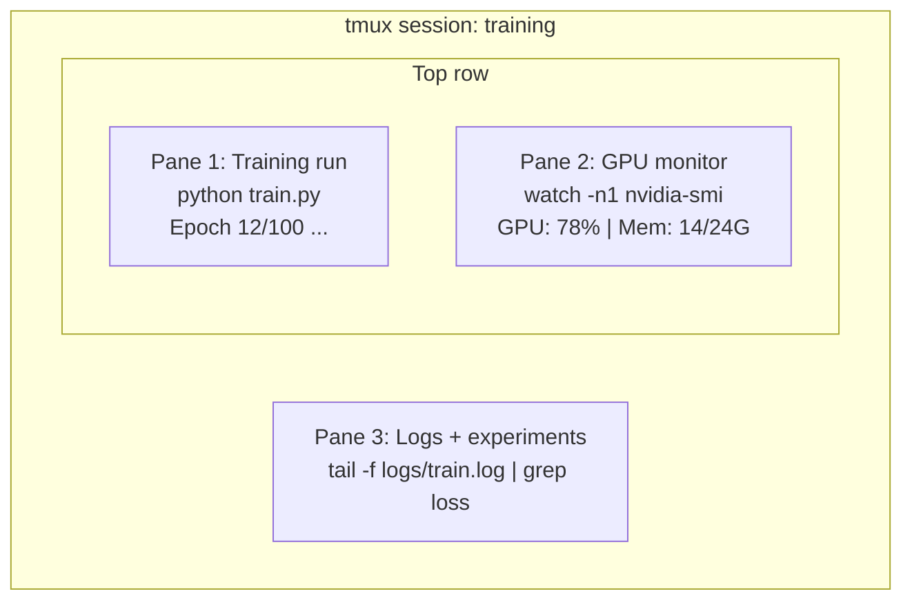

# Terminal & Shell

> Terminal là nơi làm việc chính của các AI engineer. Hãy làm quen với nó.

**Type:** Learn
**Languages:** --
**Prerequisites:** Phase 0, Lesson 01
**Time:** ~35 minutes

## Mục tiêu học tập

- Sử dụng piping, redirects và `grep` để lọc và xử lý các log huấn luyện từ dòng lệnh
- Tạo các phiên tmux bền vững với nhiều ngăn (panes) để huấn luyện đồng thời và giám sát GPU
- Giám sát tài nguyên hệ thống và GPU với `htop`, `nvtop` và `nvidia-smi`
- Truyền tệp giữa máy cục bộ và máy từ xa bằng SSH, `scp` và `rsync`

## Vấn đề

Bạn sẽ dành nhiều thời gian trong terminal hơn bất kỳ trình soạn thảo nào. Các tiến trình huấn luyện, giám sát GPU, theo dõi log, phiên SSH từ xa, quản lý môi trường. Mọi quy trình làm việc AI đều liên quan đến shell. Nếu bạn chậm chạp ở đây, bạn sẽ chậm chạp ở mọi nơi.

Bài học này bao gồm các kỹ năng terminal quan trọng cho công việc AI. Không có lịch sử Unix. Không đi sâu vào Bash scripting. Chỉ những gì bạn cần.

## Khái niệm



Ba thứ chạy cùng một lúc. Một terminal. Bạn có thể detach, đi về nhà, SSH lại và reattach. Quá trình huấn luyện vẫn tiếp tục chạy.

```figure
s0-shell-pipeline
```

## Xây dựng

### Bước 1: Biết về shell của bạn

Kiểm tra shell bạn đang chạy:

```bash
echo $SHELL
```

Hầu hết các hệ thống sử dụng `bash` hoặc `zsh`. Cả hai đều hoạt động tốt. Các lệnh trong khóa học này hoạt động trên cả hai.

Những điều quan trọng cần biết:

```bash
# Move around
cd ~/projects/ai-engineering-from-scratch
pwd
ls -la

# History search (most useful shortcut you'll learn)
# Ctrl+R then type part of a previous command
# Press Ctrl+R again to cycle through matches

# Clear terminal
clear   # or Ctrl+L

# Cancel a running command
# Ctrl+C

# Suspend a running command (resume with fg)
# Ctrl+Z
```

### Bước 2: Piping và redirects

Piping kết nối các lệnh với nhau. Đây là cách bạn xử lý log, lọc đầu ra và kết nối các công cụ. Bạn sẽ sử dụng điều này liên tục.

```bash
# Count how many times "loss" appears in a log
cat train.log | grep "loss" | wc -l

# Extract just the loss values from training output
grep "loss:" train.log | awk '{print $NF}' > losses.txt

# Watch a log file update in real time, filtering for errors
tail -f train.log | grep --line-buffered "ERROR"

# Sort experiments by final accuracy
grep "final_accuracy" results/*.log | sort -t= -k2 -n -r

# Redirect stdout and stderr to separate files
python train.py > output.log 2> errors.log

# Redirect both to the same file
python train.py > train_full.log 2>&1
```

Ba lệnh redirect bạn cần:

| Ký hiệu | Chức năng |
|--------|-------------|
| `>` | Ghi stdout vào tệp (ghi đè) |
| `>>` | Ghi thêm stdout vào tệp |
| `2>` | Ghi stderr vào tệp |
| `2>&1` | Gửi stderr đến cùng nơi với stdout |
| `\|` | Gửi stdout của một lệnh làm stdin cho lệnh tiếp theo |

### Bước 3: Các tiến trình nền (Background processes)

Các tiến trình huấn luyện mất hàng giờ. Bạn không muốn giữ terminal mở suốt thời gian đó.

```bash
# Run in background (output still goes to terminal)
python train.py &

# Run in background, immune to hangup (closing terminal won't kill it)
nohup python train.py > train.log 2>&1 &

# Check what's running in background
jobs
ps aux | grep train.py

# Bring a background job to foreground
fg %1

# Kill a background process
kill %1
# or find its PID and kill that
kill $(pgrep -f "train.py")
```

Sự khác biệt giữa `&`, `nohup` và `screen`/`tmux`:

| Phương pháp | Có tồn tại khi đóng terminal? | Có thể reattach? |
|--------|-------------------------|---------------|
| `command &` | Không | Không |
| `nohup command &` | Có | Không (kiểm tra tệp log) |
| `screen` / `tmux` | Có | Có |

Đối với bất kỳ việc gì kéo dài hơn vài phút, hãy sử dụng tmux.

### Bước 4: tmux

tmux cho phép bạn tạo các phiên terminal bền vững với nhiều ngăn. Đây là công cụ hữu ích nhất để quản lý các tiến trình huấn luyện.

```bash
# Install
# macOS
brew install tmux
# Ubuntu
sudo apt install tmux

# Start a named session
tmux new -s training

# Split horizontally
# Ctrl+B then "

# Split vertically
# Ctrl+B then %

# Navigate between panes
# Ctrl+B then arrow keys

# Detach (session keeps running)
# Ctrl+B then d

# Reattach
tmux attach -t training

# List sessions
tmux ls

# Kill a session
tmux kill-session -t training
```

Một phiên làm việc AI điển hình:

```bash
tmux new -s train

# Pane 1: start training
python train.py --epochs 100 --lr 1e-4

# Ctrl+B, " to split, then run GPU monitor
watch -n1 nvidia-smi

# Ctrl+B, % to split vertically, tail the logs
tail -f logs/experiment.log

# Now detach with Ctrl+B, d
# SSH out, go get coffee, come back
# tmux attach -t train
```

### Bước 5: Giám sát với htop và nvtop

```bash
# System processes (better than top)
htop

# GPU processes (if you have NVIDIA GPU)
# Install: sudo apt install nvtop (Ubuntu) or brew install nvtop (macOS)
nvtop

# Quick GPU check without nvtop
nvidia-smi

# Watch GPU usage update every second
watch -n1 nvidia-smi

# See which processes are using the GPU
nvidia-smi --query-compute-apps=pid,name,used_memory --format=csv
```

Các phím tắt `htop` bạn sẽ sử dụng:
- `F6` hoặc `>` để sắp xếp theo cột (sắp xếp theo bộ nhớ để tìm rò rỉ bộ nhớ)
- `F5` để chuyển đổi chế độ xem cây (xem các tiến trình con)
- `F9` để kill một tiến trình
- `/` để tìm kiếm tên tiến trình

### Bước 6: SSH cho các máy GPU từ xa

Khi bạn thuê GPU đám mây (Lambda, RunPod, Vast.ai), bạn kết nối qua SSH.

```bash
# Basic connection
ssh user@gpu-box-ip

# With a specific key
ssh -i ~/.ssh/my_gpu_key user@gpu-box-ip

# Copy files to remote
scp model.pt user@gpu-box-ip:~/models/

# Copy files from remote
scp user@gpu-box-ip:~/results/metrics.json ./

# Sync a whole directory (faster for many files)
rsync -avz ./data/ user@gpu-box-ip:~/data/

# Port forward (access remote Jupyter/TensorBoard locally)
ssh -L 8888:localhost:8888 user@gpu-box-ip
# Now open localhost:8888 in your browser

# SSH config for convenience
# Add to ~/.ssh/config:
# Host gpu
#     HostName 192.168.1.100
#     User ubuntu
#     IdentityFile ~/.ssh/gpu_key
#
# Then just:
# ssh gpu
```

### Bước 7: Các alias hữu ích cho công việc AI

Thêm các alias này vào `~/.bashrc` hoặc `~/.zshrc` của bạn:

```bash
source phases/00-setup-and-tooling/10-terminal-and-shell/code/shell_aliases.sh
```

Hoặc sao chép những cái bạn muốn. Các alias chính:

```bash
# GPU status at a glance
alias gpu='nvidia-smi --query-gpu=index,name,utilization.gpu,memory.used,memory.total,temperature.gpu --format=csv,noheader'

# Kill all Python training processes
alias killtraining='pkill -f "python.*train"'

# Quick virtual environment activate
alias ae='source .venv/bin/activate'

# Watch training loss
alias watchloss='tail -f logs/*.log | grep --line-buffered "loss"'
```

Xem `code/shell_aliases.sh` để biết toàn bộ danh sách.

### Bước 8: Các mẫu terminal AI phổ biến

Những điều này xuất hiện lặp đi lặp lại trong thực tế:

```bash
# Run training, log everything, notify when done
python train.py 2>&1 | tee train.log; echo "DONE" | mail -s "Training complete" you@email.com

# Compare two experiment logs side by side
diff <(grep "accuracy" exp1.log) <(grep "accuracy" exp2.log)

# Find the largest model files (clean up disk space)
find . -name "*.pt" -o -name "*.safetensors" | xargs du -h | sort -rh | head -20

# Download a model from Hugging Face
wget https://huggingface.co/model/resolve/main/model.safetensors

# Untar a dataset
tar xzf dataset.tar.gz -C ./data/

# Count lines in all Python files (see how big your project is)
find . -name "*.py" | xargs wc -l | tail -1

# Check disk space (training data fills disks fast)
df -h
du -sh ./data/*

# Environment variable check before training
env | grep -i cuda
env | grep -i torch
```

## Sử dụng

Đây là thời điểm mỗi công cụ phát huy tác dụng trong khóa học này:

| Công cụ | Khi nào bạn sử dụng |
|------|----------------|
| tmux | Mọi tiến trình huấn luyện (Phases 3+) |
| `tail -f` + `grep` | Giám sát log huấn luyện |
| `nohup` / `&` | Các tác vụ nền nhanh |
| `htop` / `nvtop` | Gỡ lỗi huấn luyện chậm, lỗi OOM |
| SSH + `rsync` | Làm việc trên GPU đám mây |
| Piping + redirects | Xử lý kết quả thí nghiệm |
| Aliases | Tiết kiệm thời gian cho các lệnh lặp đi lặp lại |

## Bài tập

1. Cài đặt tmux, tạo một phiên với ba ngăn, và chạy `htop` trong một ngăn, `watch -n1 date` trong ngăn khác, và một tập lệnh Python trong ngăn thứ ba. Detach và reattach.
2. Thêm các alias từ `code/shell_aliases.sh` vào cấu hình shell của bạn và tải lại với `source ~/.zshrc` (hoặc `~/.bashrc`).
3. Tạo một log huấn luyện giả với `for i in $(seq 1 100); do echo "epoch $i loss: $(echo "scale=4; 1/$i" | bc)"; sleep 0.1; done > fake_train.log` và sau đó sử dụng `grep`, `tail` và `awk` để chỉ trích xuất các giá trị loss.
4. Thiết lập một mục cấu hình SSH cho máy chủ mà bạn có quyền truy cập (hoặc sử dụng `localhost` để thực hành cú pháp).

## Thuật ngữ chính

| Thuật ngữ | Cách gọi thông thường | Ý nghĩa thực tế |
|------|----------------|----------------------|
| Shell | "Terminal" | Chương trình thông dịch các lệnh của bạn (bash, zsh, fish) |
| tmux | "Terminal multiplexer" | Chương trình cho phép chạy nhiều phiên terminal trong một cửa sổ, và detach/reattach |
| Pipe | "Dấu gạch đứng" | Toán tử `\|` gửi đầu ra của một lệnh làm đầu vào cho lệnh khác |
| PID | "Process ID" | Một số duy nhất được gán cho mỗi tiến trình đang chạy, dùng để giám sát hoặc kill nó |
| nohup | "No hangup" | Chạy một lệnh miễn nhiễm với tín hiệu ngắt kết nối, vì vậy đóng terminal sẽ không kill nó |
| SSH | "Kết nối tới server" | Secure Shell, một giao thức mã hóa để chạy các lệnh trên máy từ xa |