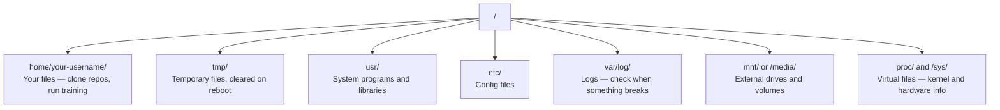

# Linux cho AI

> Hầu hết các hệ thống AI đều chạy trên Linux. Bạn cần nắm đủ kiến thức để không bị bế tắc.

**Type:** Learn
**Languages:** --
**Prerequisites:** Phase 0, Lesson 01
**Time:** ~30 phút

## Mục tiêu học tập

- Điều hướng hệ thống tệp Linux và thực hiện các thao tác tệp cơ bản từ dòng lệnh (command line)
- Quản lý quyền truy cập tệp với `chmod` và `chown` để giải quyết các lỗi "Permission denied"
- Cài đặt các gói hệ thống với `apt` và thiết lập một máy GPU mới cho công việc AI
- Xác định các khác biệt giữa macOS và Linux thường gây khó khăn cho các lập trình viên làm việc trên máy từ xa

## Vấn đề

Bạn phát triển trên macOS hoặc Windows. Nhưng ngay khi bạn SSH vào một máy GPU trên cloud, thuê một instance Lambda, hoặc khởi tạo một máy EC2, bạn sẽ ở trong môi trường Ubuntu. Terminal là giao diện duy nhất của bạn. Không có Finder, không có Explorer, không có GUI. Nếu bạn không thể điều hướng hệ thống tệp, cài đặt gói và quản lý tiến trình từ dòng lệnh, bạn sẽ lãng phí tiền cho thời gian GPU nhàn rỗi trong khi phải Google "cách giải nén tệp trong Linux".

Đây là hướng dẫn sinh tồn. Nó bao gồm chính xác những gì bạn cần để vận hành trên một máy Linux từ xa cho công việc AI. Không hơn không kém.

## Cấu trúc hệ thống tệp

Linux tổ chức mọi thứ dưới một thư mục gốc duy nhất `/`. Không có `C:\` hay `/Volumes`. Các thư mục bạn sẽ thực sự thao tác:



Thư mục chính (home directory) của bạn là `~` hoặc `/home/your-username`. Hầu hết mọi việc bạn làm đều diễn ra ở đây.

## Các lệnh thiết yếu

Đây là 15 lệnh bao phủ 95% những gì bạn sẽ làm trên một máy GPU từ xa.

### Di chuyển

```bash
pwd                         # Where am I?
ls                          # What's here?
ls -la                      # What's here, including hidden files with details?
cd /path/to/dir             # Go there
cd ~                        # Go home
cd ..                       # Go up one level
```

### Tệp và Thư mục

```bash
mkdir my-project            # Create a directory
mkdir -p a/b/c              # Create nested directories in one shot

cp file.txt backup.txt      # Copy a file
cp -r src/ src-backup/      # Copy a directory (recursive)

mv old.txt new.txt          # Rename a file
mv file.txt /tmp/           # Move a file

rm file.txt                 # Delete a file (no trash, it's gone)
rm -rf my-dir/              # Delete a directory and everything inside
```

`rm -rf` là vĩnh viễn. Không có lệnh hoàn tác (undo). Hãy kiểm tra kỹ đường dẫn trước khi nhấn enter.

### Đọc tệp

```bash
cat file.txt                # Print entire file
head -20 file.txt           # First 20 lines
tail -20 file.txt           # Last 20 lines
tail -f log.txt             # Follow a log file in real time (Ctrl+C to stop)
less file.txt               # Scroll through a file (q to quit)
```

### Tìm kiếm

```bash
grep "error" training.log           # Find lines containing "error"
grep -r "learning_rate" .           # Search all files in current directory
grep -i "cuda" config.yaml          # Case-insensitive search

find . -name "*.py"                 # Find all Python files under current dir
find . -name "*.ckpt" -size +1G     # Find checkpoint files larger than 1GB
```

## Quyền truy cập (Permissions)

Mỗi tệp trong Linux đều có chủ sở hữu và các bit quyền. Bạn sẽ gặp vấn đề này khi các script không thực thi được hoặc bạn không thể ghi vào một thư mục.

```bash
ls -l train.py
# -rwxr-xr-- 1 user group 2048 Mar 19 10:00 train.py
#  ^^^             owner permissions: read, write, execute
#     ^^^          group permissions: read, execute
#        ^^        everyone else: read only
```

Các cách sửa lỗi phổ biến:

```bash
chmod +x train.sh           # Make a script executable
chmod 755 deploy.sh         # Owner: full, others: read+execute
chmod 644 config.yaml       # Owner: read+write, others: read only

chown user:group file.txt   # Change who owns a file (needs sudo)
```

Khi có thông báo "Permission denied", hầu như luôn luôn là vấn đề về quyền. `chmod +x` hoặc `sudo` sẽ giải quyết hầu hết các trường hợp.

## Quản lý gói (apt)

Ubuntu sử dụng `apt`. Đây là cách bạn cài đặt phần mềm ở cấp độ hệ thống.

```bash
sudo apt update             # Refresh the package list (always do this first)
sudo apt install -y htop    # Install a package (-y skips confirmation)
sudo apt install -y build-essential  # C compiler, make, etc. Needed by many Python packages
sudo apt install -y tmux    # Terminal multiplexer (keep sessions alive after disconnect)

apt list --installed        # What's installed?
sudo apt remove htop        # Uninstall
```

Các gói phổ biến bạn sẽ cài đặt trên một máy GPU mới:

```bash
sudo apt update && sudo apt install -y \
    build-essential \
    git \
    curl \
    wget \
    tmux \
    htop \
    unzip \
    python3-venv
```

## Người dùng và sudo

Bạn thường đăng nhập với tư cách là người dùng thông thường. Một số thao tác cần quyền root (quản trị viên).

```bash
whoami                      # What user am I?
sudo command                # Run a single command as root
sudo su                     # Become root (exit to go back, use sparingly)
```

Trên các instance GPU cloud, bạn thường là người dùng duy nhất và đã có quyền sudo. Đừng chạy mọi thứ với quyền root. Chỉ sử dụng sudo khi cần thiết.

## Tiến trình và systemd

Khi quá trình huấn luyện bị treo, hoặc bạn cần kiểm tra những gì đang chạy:

```bash
htop                        # Interactive process viewer (q to quit)
ps aux | grep python        # Find running Python processes
kill 12345                  # Gracefully stop process with PID 12345
kill -9 12345               # Force kill (use when graceful doesn't work)
nvidia-smi                  # GPU processes and memory usage
```

systemd quản lý các dịch vụ (background daemons). Bạn sẽ sử dụng nó nếu bạn chạy các server suy luận (inference servers):

```bash
sudo systemctl start nginx          # Start a service
sudo systemctl stop nginx           # Stop it
sudo systemctl restart nginx        # Restart it
sudo systemctl status nginx         # Check if it's running
sudo systemctl enable nginx         # Start automatically on boot
```

## Dung lượng đĩa

Các máy GPU thường có dung lượng đĩa hạn chế. Các mô hình và tập dữ liệu sẽ làm đầy nó rất nhanh.

```bash
df -h                       # Disk usage for all mounted drives
df -h /home                 # Disk usage for /home specifically

du -sh *                    # Size of each item in current directory
du -sh ~/.cache             # Size of your cache (pip, huggingface models land here)
du -sh /data/checkpoints/   # Check how big your checkpoints are

# Find the biggest space hogs
du -h --max-depth=1 / 2>/dev/null | sort -hr | head -20
```

Các cách tiết kiệm không gian phổ biến:

```bash
# Clear pip cache
pip cache purge

# Clear apt cache
sudo apt clean

# Remove old checkpoints you don't need
rm -rf checkpoints/epoch_01/ checkpoints/epoch_02/
```

## Mạng

Bạn sẽ tải xuống các mô hình, chuyển tệp và gọi các API từ dòng lệnh.

```bash
# Download files
wget https://example.com/model.bin                   # Download a file
curl -O https://example.com/data.tar.gz              # Same thing with curl
curl -s https://api.example.com/health | python3 -m json.tool  # Hit an API, pretty-print JSON

# Transfer files between machines
scp model.bin user@remote:/data/                     # Copy file to remote machine
scp user@remote:/data/results.csv .                  # Copy file from remote to local
scp -r user@remote:/data/checkpoints/ ./local-dir/   # Copy directory

# Sync directories (faster than scp for large transfers, resumes on failure)
rsync -avz --progress ./data/ user@remote:/data/
rsync -avz --progress user@remote:/results/ ./results/
```

Hãy sử dụng `rsync` thay vì `scp` cho bất kỳ tệp lớn nào. Nó chỉ chuyển các byte đã thay đổi và xử lý các kết nối bị gián đoạn.

## tmux: Giữ các phiên làm việc hoạt động

Khi bạn SSH vào một máy từ xa, việc đóng laptop sẽ làm dừng quá trình huấn luyện của bạn. tmux ngăn chặn điều này.

```bash
tmux new -s train           # Start a new session named "train"
# ... start your training, then:
# Ctrl+B, then D            # Detach (training keeps running)

tmux ls                     # List sessions
tmux attach -t train        # Reattach to session

# Inside tmux:
# Ctrl+B, then %            # Split pane vertically
# Ctrl+B, then "            # Split pane horizontally
# Ctrl+B, then arrow keys   # Switch between panes
```

Luôn chạy các công việc huấn luyện dài hạn bên trong tmux. Luôn luôn như vậy.

## WSL2 cho người dùng Windows

Nếu bạn đang dùng Windows, WSL2 cung cấp cho bạn một môi trường Linux thực thụ mà không cần dual-boot.

```bash
# In PowerShell (admin)
wsl --install -d Ubuntu-24.04

# After restart, open Ubuntu from Start menu
sudo apt update && sudo apt upgrade -y
```

WSL2 chạy một nhân Linux thực sự. Mọi thứ trong bài học này đều hoạt động bên trong nó. Các tệp Windows của bạn nằm tại `/mnt/c/Users/YourName/` từ bên trong WSL.

GPU passthrough hoạt động với driver NVIDIA được cài đặt trên phía Windows. Hãy cài đặt driver NVIDIA cho Windows (không phải bản Linux), và CUDA sẽ khả dụng bên trong WSL2.

## Những điểm cần lưu ý: macOS sang Linux

Những điều sẽ gây khó khăn cho bạn nếu bạn chuyển từ macOS:

| macOS | Linux | Ghi chú |
|-------|-------|-------|
| `brew install` | `sudo apt install` | Đôi khi tên gói khác nhau. `brew install htop` so với `sudo apt install htop` hoạt động giống nhau, nhưng `brew install readline` so với `sudo apt install libreadline-dev` thì không. |
| `open file.txt` | `xdg-open file.txt` | Nhưng bạn sẽ không có GUI trên máy từ xa. Hãy dùng `cat` hoặc `less`. |
| `pbcopy` / `pbpaste` | Không khả dụng | Pipe vào/ra clipboard không tồn tại qua SSH. |
| `~/.zshrc` | `~/.bashrc` | macOS mặc định là zsh. Hầu hết các server Linux dùng bash. |
| `/opt/homebrew/` | `/usr/bin/`, `/usr/local/bin/` | Các tệp nhị phân nằm ở các vị trí khác nhau. |
| `sed -i '' 's/a/b/' file` | `sed -i 's/a/b/' file` | sed trên macOS cần một chuỗi rỗng sau `-i`. Linux thì không. |
| Hệ thống tệp không phân biệt hoa thường | Hệ thống tệp phân biệt hoa thường | `Model.py` và `model.py` là hai tệp khác nhau trên Linux. |
| Kết thúc dòng `\n` | Kết thúc dòng `\n` | Giống nhau. Nhưng Windows dùng `\r\n`, làm hỏng các bash script. Chạy `dos2unix` để sửa. |

## Thẻ tham khảo nhanh

```
Navigation:     pwd, ls, cd, find
Files:          cp, mv, rm, mkdir, cat, head, tail, less
Search:         grep, find
Permissions:    chmod, chown, sudo
Packages:       apt update, apt install
Processes:      htop, ps, kill, nvidia-smi
Services:       systemctl start/stop/restart/status
Disk:           df -h, du -sh
Network:        curl, wget, scp, rsync
Sessions:       tmux new/attach/detach
```

```figure
s0-process-fork
```

## Bài tập

1. SSH vào bất kỳ máy Linux nào (hoặc mở WSL2) và điều hướng đến thư mục home của bạn. Tạo một thư mục dự án, tạo ba tệp trống bên trong nó với `touch`, sau đó liệt kê chúng với `ls -la`.
2. Cài đặt `htop` bằng apt, chạy nó và xác định tiến trình nào đang sử dụng nhiều bộ nhớ nhất.
3. Bắt đầu một phiên tmux, chạy `sleep 300` bên trong đó, detach, liệt kê các phiên và reattach lại.
4. Sử dụng `df -h` để kiểm tra dung lượng đĩa khả dụng, sau đó sử dụng `du -sh ~/.cache/*` để tìm xem cái gì đang chiếm dung lượng trong bộ nhớ cache của bạn.
5. Chuyển một tệp từ máy cục bộ của bạn sang máy từ xa bằng `scp`, sau đó thực hiện chuyển tương tự với `rsync` và so sánh trải nghiệm.