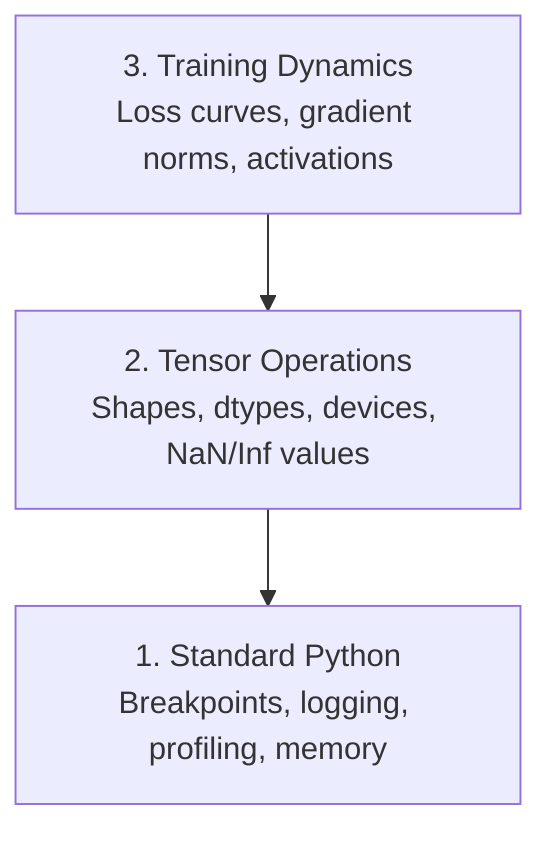

# Debugging và Profiling

> Những lỗi AI tồi tệ nhất không gây crash. Chúng âm thầm huấn luyện trên dữ liệu rác và báo cáo một đường cong loss tuyệt đẹp.

**Type:** Build
**Language:** Python
**Prerequisites:** Bài 1 (Môi trường phát triển), kiến thức cơ bản về PyTorch
**Time:** ~60 phút

## Mục tiêu học tập

- Sử dụng `breakpoint()` và `debug_print` có điều kiện để kiểm tra shape, dtype và các giá trị NaN của tensor ngay trong quá trình huấn luyện
- Profile các vòng lặp huấn luyện với `cProfile`, `line_profiler` và `tracemalloc` để tìm các điểm nghẽn (bottlenecks)
- Phát hiện các lỗi AI phổ biến: sai lệch shape, loss NaN, rò rỉ dữ liệu (data leakage) và tensor nằm sai thiết bị
- Thiết lập TensorBoard để trực quan hóa đường cong loss, biểu đồ histogram trọng số và phân phối gradient

## Vấn đề

Code AI thất bại theo cách khác với code thông thường. Một ứng dụng web sẽ crash kèm theo stack trace. Một vòng lặp huấn luyện được cấu hình sai sẽ chạy trong 8 giờ, đốt cháy $200 tiền GPU và tạo ra một mô hình chỉ dự đoán giá trị trung bình của mọi đầu vào. Code không hề báo lỗi. Lỗi nằm ở việc tensor đặt sai thiết bị, quên `.detach()`, hoặc nhãn (labels) bị rò rỉ vào tập đặc trưng (features).

Bạn cần các công cụ gỡ lỗi để bắt được những lỗi âm thầm này trước khi chúng lãng phí thời gian và tài nguyên tính toán của bạn.

## Khái niệm

Gỡ lỗi AI hoạt động ở ba cấp độ:



Hầu hết mọi người nhảy thẳng vào cấp độ 3 (nhìn chằm chằm vào TensorBoard). Nhưng 80% lỗi AI nằm ở cấp độ 1 và 2.

```figure
s0-flame-hot
```

## Build It

### Phần 1: Print Debugging (Vâng, nó thực sự hiệu quả)

Print debugging thường bị coi thường. Đừng làm vậy. Đối với code tensor, một câu lệnh print có mục tiêu hiệu quả hơn nhiều so với việc bước qua từng dòng trong debugger vì bạn cần xem shape, dtype và phạm vi giá trị cùng một lúc.

```python
def debug_print(name, tensor):
    print(f"{name}: shape={tensor.shape}, dtype={tensor.dtype}, "
          f"device={tensor.device}, "
          f"min={tensor.min().item():.4f}, max={tensor.max().item():.4f}, "
          f"mean={tensor.mean().item():.4f}, "
          f"has_nan={tensor.isnan().any().item()}")
```

Hãy gọi lệnh này sau mỗi thao tác đáng ngờ. Khi đã tìm thấy lỗi, hãy xóa các lệnh print đó đi. Đơn giản vậy thôi.

### Phần 2: Python Debugger (pdb và breakpoint)

Debugger tích hợp sẵn là công cụ bị đánh giá thấp trong công việc AI. Hãy đặt `breakpoint()` vào vòng lặp huấn luyện của bạn và kiểm tra các tensor một cách tương tác.

```python
def training_step(model, batch, criterion, optimizer):
    inputs, labels = batch
    outputs = model(inputs)
    loss = criterion(outputs, labels)

    if loss.item() > 100 or torch.isnan(loss):
        breakpoint()

    loss.backward()
    optimizer.step()
```

Khi debugger dừng lại, các lệnh hữu ích bao gồm:

- `p outputs.shape` để kiểm tra shape
- `p loss.item()` để xem giá trị loss
- `p torch.isnan(outputs).sum()` để đếm số lượng NaN
- `p model.fc1.weight.grad` để kiểm tra gradient
- `c` để tiếp tục, `q` để thoát

Đây là gỡ lỗi có điều kiện. Bạn chỉ dừng lại khi có điều gì đó trông không ổn. Đối với một quá trình huấn luyện 10.000 bước, điều này rất quan trọng.

### Phần 3: Python Logging

Hãy thay thế các câu lệnh print bằng logging khi việc gỡ lỗi của bạn vượt quá mức kiểm tra nhanh.

```python
import logging

logging.basicConfig(
    level=logging.INFO,
    format="%(asctime)s [%(levelname)s] %(message)s",
    handlers=[
        logging.FileHandler("training.log"),
        logging.StreamHandler()
    ]
)
logger = logging.getLogger(__name__)

logger.info("Starting training: lr=%.4f, batch_size=%d", lr, batch_size)
logger.warning("Loss spike detected: %.4f at step %d", loss.item(), step)
logger.error("NaN loss at step %d, stopping", step)
```

Logging cung cấp cho bạn dấu thời gian (timestamps), mức độ nghiêm trọng và xuất ra file. Khi một quá trình huấn luyện thất bại lúc 3 giờ sáng, bạn sẽ muốn có một file log thay vì kết quả terminal đã bị trôi mất.

### Phần 4: Đo thời gian các đoạn code

Biết được thời gian tiêu tốn ở đâu là bước đầu tiên để tối ưu hóa.

```python
import time

class Timer:
    def __init__(self, name=""):
        self.name = name

    def __enter__(self):
        self.start = time.perf_counter()
        return self

    def __exit__(self, *args):
        elapsed = time.perf_counter() - self.start
        print(f"[{self.name}] {elapsed:.4f}s")

with Timer("data loading"):
    batch = next(dataloader_iter)

with Timer("forward pass"):
    outputs = model(batch)

with Timer("backward pass"):
    loss.backward()
```

Phát hiện phổ biến: việc tải dữ liệu chiếm 60% thời gian huấn luyện. Giải pháp là `num_workers > 0` trong DataLoader của bạn, chứ không phải là một GPU nhanh hơn.

### Phần 5: cProfile và line_profiler

Khi bạn cần nhiều hơn là các bộ đếm thời gian thủ công:

```bash
python -m cProfile -s cumtime train.py
```

Công cụ này hiển thị mọi lệnh gọi hàm được sắp xếp theo thời gian tích lũy. Để profile từng dòng:

```bash
pip install line_profiler
```

```python
@profile
def train_step(model, data, target):
    output = model(data)
    loss = F.cross_entropy(output, target)
    loss.backward()
    return loss

# Run with: kernprof -l -v train.py
```

### Phần 6: Memory Profiling

#### Bộ nhớ CPU với tracemalloc

```python
import tracemalloc

tracemalloc.start()

# your code here
model = build_model()
data = load_dataset()

snapshot = tracemalloc.take_snapshot()
top_stats = snapshot.statistics("lineno")
for stat in top_stats[:10]:
    print(stat)
```

#### Bộ nhớ CPU với memory_profiler

```bash
pip install memory_profiler
```

```python
from memory_profiler import profile

@profile
def load_data():
    raw = read_csv("data.csv")       # watch memory jump here
    processed = preprocess(raw)       # and here
    return processed
```

Chạy với `python -m memory_profiler your_script.py` để xem mức sử dụng bộ nhớ theo từng dòng.

#### Bộ nhớ GPU với PyTorch

```python
import torch

if torch.cuda.is_available():
    print(torch.cuda.memory_summary())

    print(f"Allocated: {torch.cuda.memory_allocated() / 1e9:.2f} GB")
    print(f"Cached: {torch.cuda.memory_reserved() / 1e9:.2f} GB")
```

Khi bạn gặp lỗi OOM (Out of Memory):

1. Giảm batch size (điều đầu tiên cần thử, luôn luôn)
2. Sử dụng `torch.cuda.empty_cache()` để giải phóng bộ nhớ đã cache
3. Sử dụng `del tensor` theo sau là `torch.cuda.empty_cache()` cho các biến trung gian lớn
4. Sử dụng mixed precision (`torch.cuda.amp`) để giảm một nửa mức sử dụng bộ nhớ
5. Sử dụng gradient checkpointing cho các mô hình rất sâu

### Phần 7: Các lỗi AI phổ biến và cách bắt lỗi

#### Sai lệch Shape (Shape Mismatch)

Lỗi thường gặp nhất. Một tensor có shape `[batch, features]` trong khi mô hình mong đợi `[batch, channels, height, width]`.

```python
def check_shapes(model, sample_input):
    print(f"Input: {sample_input.shape}")
    hooks = []

    def make_hook(name):
        def hook(module, inp, out):
            in_shape = inp[0].shape if isinstance(inp, tuple) else inp.shape
            out_shape = out.shape if hasattr(out, "shape") else type(out)
            print(f"  {name}: {in_shape} -> {out_shape}")
        return hook

    for name, module in model.named_modules():
        hooks.append(module.register_forward_hook(make_hook(name)))

    with torch.no_grad():
        model(sample_input)

    for h in hooks:
        h.remove()
```

Hãy chạy lệnh này một lần với một batch mẫu. Nó sẽ ánh xạ mọi biến đổi shape trong mô hình của bạn.

#### Loss NaN

Loss NaN có nghĩa là có thứ gì đó đã bùng nổ. Nguyên nhân phổ biến:

- Learning rate quá cao
- Chia cho 0 trong hàm loss tùy chỉnh
- Log của số 0 hoặc số âm
- Gradient bùng nổ (exploding gradients) trong RNN

```python
def detect_nan(model, loss, step):
    if torch.isnan(loss):
        print(f"NaN loss at step {step}")
        for name, param in model.named_parameters():
            if param.grad is not None:
                if torch.isnan(param.grad).any():
                    print(f"  NaN gradient in {name}")
                if torch.isinf(param.grad).any():
                    print(f"  Inf gradient in {name}")
        return True
    return False
```

#### Rò rỉ dữ liệu (Data Leakage)

Mô hình của bạn đạt độ chính xác 99% trên tập test. Nghe có vẻ tuyệt vời. Nhưng đó là một lỗi.

```python
def check_data_leakage(train_set, test_set, id_column="id"):
    train_ids = set(train_set[id_column].tolist())
    test_ids = set(test_set[id_column].tolist())
    overlap = train_ids & test_ids
    if overlap:
        print(f"DATA LEAKAGE: {len(overlap)} samples in both train and test")
        return True
    return False
```

Cũng cần kiểm tra rò rỉ theo thời gian (temporal leakage): sử dụng dữ liệu tương lai để dự đoán quá khứ. Hãy sắp xếp theo dấu thời gian trước khi chia tập dữ liệu.

#### Sai thiết bị (Wrong Device)

Các tensor nằm trên các thiết bị khác nhau (CPU vs GPU) gây ra lỗi runtime. Nhưng đôi khi một tensor âm thầm nằm trên CPU trong khi mọi thứ khác nằm trên GPU, khiến quá trình huấn luyện chạy chậm một cách khó hiểu.

```python
def check_devices(model, *tensors):
    model_device = next(model.parameters()).device
    print(f"Model device: {model_device}")
    for i, t in enumerate(tensors):
        if t.device != model_device:
            print(f"  WARNING: tensor {i} on {t.device}, model on {model_device}")
```

### Phần 8: TensorBoard Basics

TensorBoard cho bạn thấy những gì đang xảy ra bên trong quá trình huấn luyện theo thời gian.

```bash
pip install tensorboard
```

```python
from torch.utils.tensorboard import SummaryWriter

writer = SummaryWriter("runs/experiment_1")

for step in range(num_steps):
    loss = train_step(model, batch)

    writer.add_scalar("loss/train", loss.item(), step)
    writer.add_scalar("lr", optimizer.param_groups[0]["lr"], step)

    if step % 100 == 0:
        for name, param in model.named_parameters():
            writer.add_histogram(f"weights/{name}", param, step)
            if param.grad is not None:
                writer.add_histogram(f"grads/{name}", param.grad, step)

writer.close()
```

Khởi chạy nó:

```bash
tensorboard --logdir=runs
```

Những điều cần quan sát:

- **Loss không giảm**: Learning rate quá thấp, hoặc vấn đề về kiến trúc mô hình
- **Loss dao động mạnh**: Learning rate quá cao
- **Loss trở thành NaN**: Mất ổn định số học (xem phần NaN ở trên)
- **Train loss giảm, val loss tăng**: Overfitting
- **Histogram trọng số co cụm về 0**: Vanishing gradients
- **Histogram gradient bùng nổ**: Cần gradient clipping

### Phần 9: VS Code Debugger

Để gỡ lỗi tương tác, hãy cấu hình VS Code với một `launch.json`:

```json
{
    "version": "0.2.0",
    "configurations": [
        {
            "name": "Debug Training",
            "type": "debugpy",
            "request": "launch",
            "program": "${file}",
            "console": "integratedTerminal",
            "justMyCode": false
        }
    ]
}
```

Đặt breakpoint bằng cách nhấp vào lề trái. Sử dụng bảng Variables để kiểm tra các thuộc tính của tensor. Debug Console cho phép bạn chạy các biểu thức Python tùy ý ngay trong quá trình thực thi.

Hữu ích cho việc bước qua các pipeline tiền xử lý dữ liệu nơi bạn muốn xem từng biến đổi.

## Use It

Đây là quy trình gỡ lỗi giúp bắt được hầu hết các lỗi AI:

1. **Trước khi huấn luyện**: Chạy `check_shapes` với một batch mẫu. Xác minh kích thước đầu vào và đầu ra khớp với mong đợi.
2. **10 bước đầu tiên**: Sử dụng `debug_print` trên loss, đầu ra và gradient. Xác nhận không có giá trị nào là NaN và các giá trị nằm trong phạm vi hợp lý.
3. **Trong khi huấn luyện**: Log loss, learning rate và gradient norms. Sử dụng TensorBoard để trực quan hóa.
4. **Khi có lỗi xảy ra**: Đặt `breakpoint()` tại điểm thất bại. Kiểm tra các tensor một cách tương tác.
5. **Về hiệu năng**: Đo thời gian tải dữ liệu so với forward pass và backward pass. Profile bộ nhớ nếu bạn gần chạm ngưỡng OOM.

## Ship It

Chạy script bộ công cụ gỡ lỗi:

```bash
python phases/00-setup-and-tooling/12-debugging-and-profiling/code/debug_tools.py
```

Xem `outputs/prompt-debug-ai-code.md` để biết prompt giúp chẩn đoán các lỗi đặc thù của AI.

## Bài tập

1. Chạy `debug_tools.py` và đọc qua kết quả của từng phần. Sửa đổi mô hình mẫu để tạo ra một giá trị NaN (gợi ý: chia cho 0 trong forward pass) và quan sát trình phát hiện bắt được nó.
2. Profile một vòng lặp huấn luyện với `cProfile` và xác định hàm chậm nhất.
3. Sử dụng `tracemalloc` để tìm dòng nào trong pipeline tải dữ liệu của bạn chiếm nhiều bộ nhớ nhất.
4. Thiết lập TensorBoard cho một quá trình huấn luyện đơn giản và xác định xem mô hình có đang bị overfitting hay không.
5. Sử dụng `breakpoint()` bên trong vòng lặp huấn luyện. Thực hành kiểm tra shape, thiết bị và giá trị gradient của tensor từ prompt của debugger.