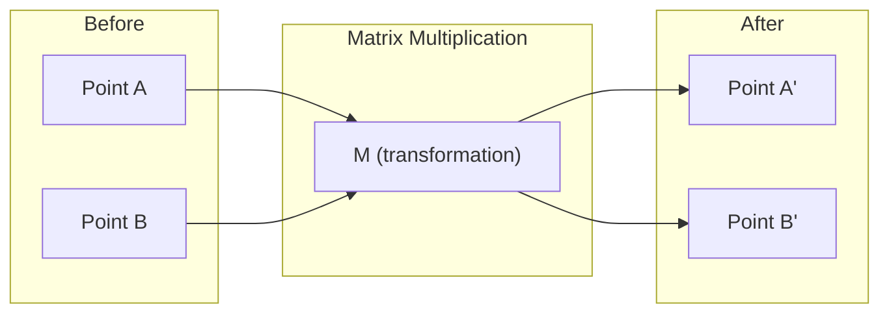
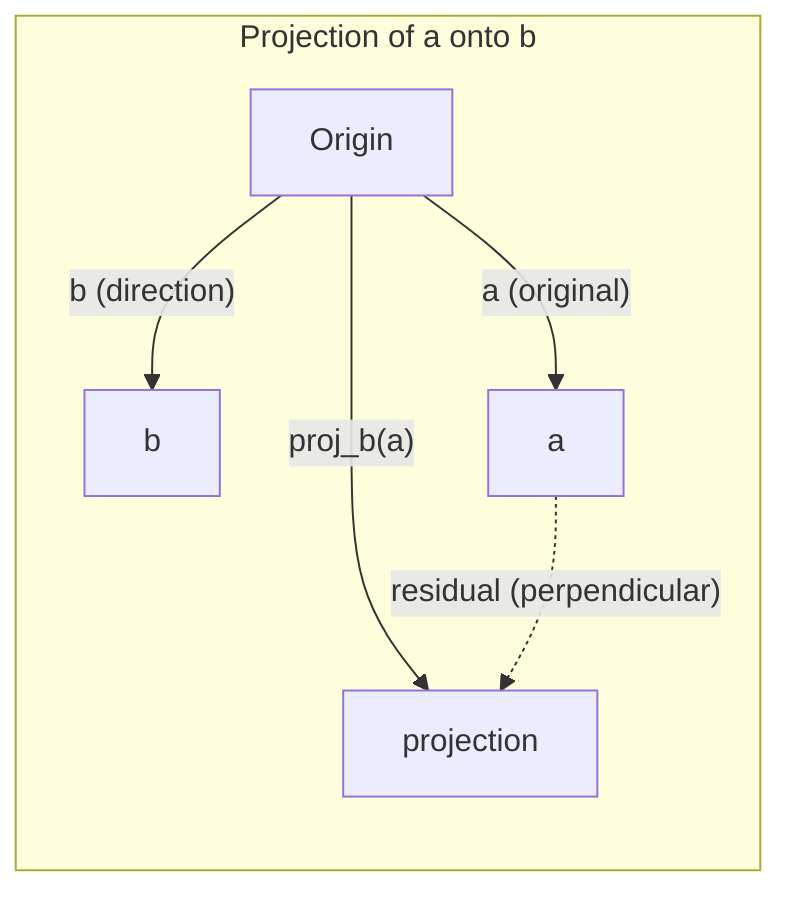

# Trực giác Đại số Tuyến tính

> Mọi mô hình AI thực chất chỉ là các phép toán ma trận được khoác lên mình một lớp vỏ hào nhoáng.

**Type:** Learn
**Languages:** Python, Julia
**Prerequisites:** Phase 0
**Time:** ~60 phút

## Mục tiêu học tập

- Triển khai các phép toán vector và ma trận (cộng, tích vô hướng, nhân ma trận) từ đầu bằng Python
- Giải thích về mặt hình học ý nghĩa của tích vô hướng (dot product), phép chiếu (projection) và quá trình Gram-Schmidt
- Xác định tính độc lập tuyến tính, hạng (rank) và cơ sở (basis) của một tập hợp các vector bằng phương pháp khử hàng (row reduction)
- Kết nối các khái niệm đại số tuyến tính với các ứng dụng AI: embeddings, attention scores và LoRA

## Vấn đề

Mở bất kỳ bài báo ML nào. Ngay trang đầu tiên, bạn sẽ thấy các vector, ma trận, tích vô hướng và các phép biến đổi. Nếu không có trực giác về đại số tuyến tính, chúng chỉ là những ký hiệu vô hồn. Với nó, bạn có thể thấy những gì một mạng thần kinh thực sự đang làm -- di chuyển các điểm trong không gian.

Bạn không cần phải là một nhà toán học. Bạn cần thấy được ý nghĩa hình học của các phép toán này, sau đó tự mình lập trình chúng.

## Khái niệm

### Vector là các điểm (và hướng)

Một vector chỉ là một danh sách các con số. Nhưng những con số đó có ý nghĩa -- chúng là tọa độ trong không gian.

**Vector 2D [3, 2]:**

| x | y | Điểm |
|---|---|-------|
| 3 | 2 | Vector trỏ từ gốc tọa độ (0,0) đến (3, 2) trên mặt phẳng |

Vector có độ lớn sqrt(3^2 + 2^2) = sqrt(13) và hướng lên trên về phía bên phải.

Trong AI, vector đại diện cho mọi thứ:
- Một từ → một vector gồm 768 con số (ý nghĩa của nó trong không gian embedding)
- Một hình ảnh → một vector gồm hàng triệu giá trị pixel
- Một người dùng → một vector chứa các sở thích

### Ma trận là các phép biến đổi

Một ma trận biến đổi một vector này thành một vector khác. Nó có thể xoay, co giãn, kéo căng hoặc chiếu.



Trong AI, ma trận CHÍNH LÀ mô hình:
- Trọng số mạng thần kinh → các ma trận biến đổi đầu vào thành đầu ra
- Điểm số attention → các ma trận quyết định cần tập trung vào điều gì
- Embeddings → các ma trận ánh xạ từ từ ngữ sang vector

### Tích vô hướng đo lường sự tương đồng

Tích vô hướng của hai vector cho bạn biết chúng giống nhau đến mức nào.

```
a · b = a₁×b₁ + a₂×b₂ + ... + aₙ×bₙ

Same direction:      a · b > 0  (similar)
Perpendicular:       a · b = 0  (unrelated)
Opposite direction:  a · b < 0  (dissimilar)
```

Đây chính xác là cách các công cụ tìm kiếm, hệ thống gợi ý và RAG hoạt động -- tìm các vector có tích vô hướng cao.

### Tính độc lập tuyến tính

Các vector độc lập tuyến tính nếu không có vector nào trong tập hợp có thể được viết dưới dạng tổ hợp của các vector còn lại. Nếu v1, v2, v3 độc lập, chúng tạo ra (span) một không gian 3D. Nếu một vector là tổ hợp của các vector khác, chúng chỉ tạo ra một mặt phẳng.

Tại sao nó quan trọng đối với AI: ma trận đặc trưng (feature matrix) của bạn nên có các cột độc lập tuyến tính. Nếu hai đặc trưng tương quan hoàn hảo (phụ thuộc tuyến tính), mô hình không thể phân biệt được tác động của chúng. Điều này gây ra hiện tượng đa cộng tuyến (multicollinearity) trong hồi quy -- ma trận trọng số trở nên không ổn định, và những thay đổi nhỏ ở đầu vào sẽ tạo ra những biến động lớn ở đầu ra.

**Ví dụ cụ thể:**

```
v1 = [1, 0, 0]
v2 = [0, 1, 0]
v3 = [2, 1, 0]   # v3 = 2*v1 + v2
```

v1 và v2 độc lập -- không có vector nào là bội số hoặc tổ hợp của vector kia. Nhưng v3 = 2*v1 + v2, vì vậy {v1, v2, v3} là một tập phụ thuộc. Cả ba vector này đều nằm trong mặt phẳng xy. Dù bạn kết hợp chúng như thế nào, bạn cũng không thể chạm tới [0, 0, 1]. Bạn có ba vector nhưng chỉ có hai chiều tự do.

Trong một tập dữ liệu: nếu feature_3 = 2*feature_1 + feature_2, việc thêm feature_3 không cung cấp thêm thông tin mới cho mô hình. Tệ hơn, nó làm cho các phương trình chuẩn tắc (normal equations) trở nên suy biến (singular) -- không có nghiệm duy nhất cho các trọng số.

### Cơ sở và Hạng

Một cơ sở (basis) là một tập hợp tối thiểu các vector độc lập tuyến tính bao phủ toàn bộ không gian. Số lượng vector cơ sở chính là số chiều của không gian đó.

Cơ sở chuẩn cho không gian 3D là {[1,0,0], [0,1,0], [0,0,1]}. Nhưng bất kỳ ba vector độc lập nào trong không gian 3D đều tạo thành một cơ sở hợp lệ. Việc chọn cơ sở chính là việc chọn hệ tọa độ.

Hạng (Rank) của một ma trận = số lượng cột độc lập tuyến tính = số lượng hàng độc lập tuyến tính. Nếu rank < min(rows, cols), ma trận bị thiếu hạng (rank-deficient). Điều này có nghĩa là:
- Hệ thống có vô số nghiệm (hoặc không có nghiệm)
- Thông tin bị mất trong quá trình biến đổi
- Ma trận không thể nghịch đảo

| Tình huống | Hạng | Ý nghĩa đối với ML |
|-----------|------|---------------------|
| Hạng đầy đủ (rank = min(m, n)) | Tối đa | Tồn tại nghiệm bình phương tối thiểu duy nhất. Mô hình có điều kiện tốt. |
| Thiếu hạng (rank < min(m, n)) | Dưới mức tối đa | Các đặc trưng bị dư thừa. Vô số nghiệm trọng số. Cần sử dụng regularization. |
| Hạng 1 | 1 | Mọi cột đều là một bản sao tỷ lệ của một vector. Tất cả dữ liệu nằm trên một đường thẳng. |
| Gần thiếu hạng (các giá trị suy biến nhỏ) | Thấp về mặt số học | Ma trận có điều kiện xấu. Nhiễu nhỏ ở đầu vào gây ra thay đổi lớn ở đầu ra. Sử dụng SVD truncation hoặc ridge regression. |

### Phép chiếu

Chiếu vector **a** lên vector **b** cho ta thành phần của **a** theo hướng của **b**:

```
proj_b(a) = (a dot b / b dot b) * b
```

Phần dư (a - proj_b(a)) vuông góc với b. Sự phân rã trực giao này là nền tảng của phương pháp bình phương tối thiểu (least-squares fitting).

Phép chiếu có mặt ở khắp mọi nơi trong ML:
- Hồi quy tuyến tính cực tiểu hóa khoảng cách từ các quan sát đến không gian cột -- nghiệm CHÍNH LÀ một phép chiếu
- PCA chiếu dữ liệu lên các hướng có phương sai tối đa
- Attention trong transformers tính toán các phép chiếu của queries lên keys



**Ví dụ:** a = [3, 4], b = [1, 0]

proj_b(a) = (3*1 + 4*0) / (1*1 + 0*0) * [1, 0] = 3 * [1, 0] = [3, 0]

Phép chiếu loại bỏ thành phần y. Đây là dạng đơn giản nhất của giảm chiều dữ liệu (dimensionality reduction) -- loại bỏ những hướng mà bạn không quan tâm.

### Quá trình Gram-Schmidt

Chuyển đổi bất kỳ tập hợp vector độc lập nào thành một cơ sở trực chuẩn (orthonormal basis). Trực chuẩn có nghĩa là mọi vector đều có độ dài bằng 1 và mọi cặp vector đều vuông góc với nhau.

Thuật toán:
1. Lấy vector đầu tiên, chuẩn hóa nó
2. Lấy vector thứ hai, trừ đi hình chiếu của nó lên vector thứ nhất, sau đó chuẩn hóa
3. Lấy vector thứ ba, trừ đi hình chiếu của nó lên tất cả các vector trước đó, sau đó chuẩn hóa
4. Lặp lại cho các vector còn lại

```
Input:  v1, v2, v3, ... (linearly independent)

u1 = v1 / |v1|

w2 = v2 - (v2 dot u1) * u1
u2 = w2 / |w2|

w3 = v3 - (v3 dot u1) * u1 - (v3 dot u2) * u2
u3 = w3 / |w3|

Output: u1, u2, u3, ... (orthonormal basis)
```

Đây là cách phân rã QR hoạt động bên trong. Q là cơ sở trực chuẩn, R chứa các hệ số chiếu. Phân rã QR được sử dụng trong:
- Giải các hệ phương trình tuyến tính (ổn định hơn khử Gauss)
- Tính toán trị riêng (thuật toán QR)
- Hồi quy bình phương tối thiểu (phương pháp số học tiêu chuẩn)

```figure
eigen-directions
```

## Xây dựng nó

### Bước 1: Vector từ con số không (Python)

```python
class Vector:
    def __init__(self, components):
        self.components = list(components)
        self.dim = len(self.components)

    def __add__(self, other):
        return Vector([a + b for a, b in zip(self.components, other.components)])

    def __sub__(self, other):
        return Vector([a - b for a, b in zip(self.components, other.components)])

    def dot(self, other):
        return sum(a * b for a, b in zip(self.components, other.components))

    def magnitude(self):
        return sum(x**2 for x in self.components) ** 0.5

    def normalize(self):
        mag = self.magnitude()
        return Vector([x / mag for x in self.components])

    def cosine_similarity(self, other):
        return self.dot(other) / (self.magnitude() * other.magnitude())

    def __repr__(self):
        return f"Vector({self.components})"


a = Vector([1, 2, 3])
b = Vector([4, 5, 6])

print(f"a + b = {a + b}")
print(f"a · b = {a.dot(b)}")
print(f"|a| = {a.magnitude():.4f}")
print(f"cosine similarity = {a.cosine_similarity(b):.4f}")
```

### Bước 2: Ma trận từ con số không (Python)

```python
class Matrix:
    def __init__(self, rows):
        self.rows = [list(row) for row in rows]
        self.shape = (len(self.rows), len(self.rows[0]))

    def __matmul__(self, other):
        if isinstance(other, Vector):
            return Vector([
                sum(self.rows[i][j] * other.components[j] for j in range(self.shape[1]))
                for i in range(self.shape[0])
            ])
        rows = []
        for i in range(self.shape[0]):
            row = []
            for j in range(other.shape[1]):
                row.append(sum(
                    self.rows[i][k] * other.rows[k][j]
                    for k in range(self.shape[1])
                ))
            rows.append(row)
        return Matrix(rows)

    def transpose(self):
        return Matrix([
            [self.rows[j][i] for j in range(self.shape[0])]
            for i in range(self.shape[1])
        ])

    def __repr__(self):
        return f"Matrix({self.rows})"


rotation_90 = Matrix([[0, -1], [1, 0]])
point = Vector([3, 1])

rotated = rotation_90 @ point
print(f"Original: {point}")
print(f"Rotated 90°: {rotated}")
```

### Bước 3: Tại sao điều này quan trọng đối với AI

```python
import random

random.seed(42)
weights = Matrix([[random.gauss(0, 0.1) for _ in range(3)] for _ in range(2)])
input_vector = Vector([1.0, 0.5, -0.3])

output = weights @ input_vector
print(f"Input (3D): {input_vector}")
print(f"Output (2D): {output}")
print("This is what a neural network layer does -- matrix multiplication.")
```

### Bước 4: Phiên bản Julia

```julia
a = [1.0, 2.0, 3.0]
b = [4.0, 5.0, 6.0]

println("a + b = ", a + b)
println("a · b = ", a ⋅ b)       # Julia supports unicode operators
println("|a| = ", √(a ⋅ a))
println("cosine = ", (a ⋅ b) / (√(a ⋅ a) * √(b ⋅ b)))

# Matrix-vector multiplication
W = [0.1 -0.2 0.3; 0.4 0.5 -0.1]
x = [1.0, 0.5, -0.3]
println("Wx = ", W * x)
println("This is a neural network layer.")
```

### Bước 5: Tính độc lập tuyến tính và phép chiếu từ con số không (Python)

```python
def is_linearly_independent(vectors):
    n = len(vectors)
    dim = len(vectors[0].components)
    mat = Matrix([v.components[:] for v in vectors])
    rows = [row[:] for row in mat.rows]
    rank = 0
    for col in range(dim):
        pivot = None
        for row in range(rank, len(rows)):
            if abs(rows[row][col]) > 1e-10:
                pivot = row
                break
        if pivot is None:
            continue
        rows[rank], rows[pivot] = rows[pivot], rows[rank]
        scale = rows[rank][col]
        rows[rank] = [x / scale for x in rows[rank]]
        for row in range(len(rows)):
            if row != rank and abs(rows[row][col]) > 1e-10:
                factor = rows[row][col]
                rows[row] = [rows[row][j] - factor * rows[rank][j] for j in range(dim)]
        rank += 1
    return rank == n


def project(a, b):
    scalar = a.dot(b) / b.dot(b)
    return Vector([scalar * x for x in b.components])


def gram_schmidt(vectors):
    orthonormal = []
    for v in vectors:
        w = v
        for u in orthonormal:
            proj = project(w, u)
            w = w - proj
        if w.magnitude() < 1e-10:
            continue
        orthonormal.append(w.normalize())
    return orthonormal


v1 = Vector([1, 0, 0])
v2 = Vector([1, 1, 0])
v3 = Vector([1, 1, 1])
basis = gram_schmidt([v1, v2, v3])
for i, u in enumerate(basis):
    print(f"u{i+1} = {u}")
    print(f"  |u{i+1}| = {u.magnitude():.6f}")

print(f"u1 · u2 = {basis[0].dot(basis[1]):.6f}")
print(f"u1 · u3 = {basis[0].dot(basis[2]):.6f}")
print(f"u2 · u3 = {basis[1].dot(basis[2]):.6f}")
```

## Sử dụng nó

Bây giờ thực hiện tương tự với NumPy -- thứ mà bạn sẽ thực sự sử dụng trong thực tế:

```python
import numpy as np

a = np.array([1, 2, 3], dtype=float)
b = np.array([4, 5, 6], dtype=float)

print(f"a + b = {a + b}")
print(f"a · b = {np.dot(a, b)}")
print(f"|a| = {np.linalg.norm(a):.4f}")
print(f"cosine = {np.dot(a, b) / (np.linalg.norm(a) * np.linalg.norm(b)):.4f}")

W = np.random.randn(2, 3) * 0.1
x = np.array([1.0, 0.5, -0.3])
print(f"Wx = {W @ x}")
```

### Hạng, Phép chiếu và QR với NumPy

```python
import numpy as np

A = np.array([[1, 2], [2, 4]])
print(f"Rank: {np.linalg.matrix_rank(A)}")

a = np.array([3, 4])
b = np.array([1, 0])
proj = (np.dot(a, b) / np.dot(b, b)) * b
print(f"Projection of {a} onto {b}: {proj}")

Q, R = np.linalg.qr(np.random.randn(3, 3))
print(f"Q is orthogonal: {np.allclose(Q @ Q.T, np.eye(3))}")
print(f"R is upper triangular: {np.allclose(R, np.triu(R))}")
```

### PyTorch -- Tensors là các Vector với Autodiff

```python
import torch

x = torch.randn(3, requires_grad=True)
y = torch.tensor([1.0, 0.0, 0.0])

similarity = torch.dot(x, y)
similarity.backward()

print(f"x = {x.data}")
print(f"y = {y.data}")
print(f"dot product = {similarity.item():.4f}")
print(f"d(dot)/dx = {x.grad}")
```

Đạo hàm của tích vô hướng đối với x chính là y. PyTorch đã tính toán điều này một cách tự động. Mọi phép toán trong một mạng thần kinh đều được xây dựng từ các phép toán như thế này -- nhân ma trận, tích vô hướng, phép chiếu -- và autodiff theo dõi các đạo hàm thông qua tất cả chúng.

Bạn vừa xây dựng từ đầu những gì NumPy thực hiện trong một dòng lệnh. Bây giờ bạn đã biết điều gì đang diễn ra bên dưới hệ thống.

## Bàn giao

Bài học này tạo ra:
- `outputs/prompt-linear-algebra-tutor.md` -- một prompt cho các trợ lý AI để dạy đại số tuyến tính thông qua trực giác hình học

## Các mối liên kết

Mọi thứ trong bài học này đều kết nối với các phần cụ thể của AI hiện đại:

| Khái niệm | Nơi nó xuất hiện |
|---------|------------------|
| Tích vô hướng | Attention scores trong transformers, cosine similarity trong RAG |
| Nhân ma trận | Mọi lớp mạng thần kinh, mọi phép biến đổi tuyến tính |
| Độc lập tuyến tính | Lựa chọn đặc trưng, tránh đa cộng tuyến |
| Hạng | Xác định xem một hệ thống có thể giải được hay không, LoRA (low-rank adaptation) |
| Phép chiếu | Hồi quy tuyến tính (chiếu lên không gian cột), PCA |
| Gram-Schmidt / QR | Các bộ giải số học, tính toán trị riêng |
| Cơ sở trực chuẩn | Tính toán số học ổn định, whitening transforms |

LoRA xứng đáng được nhắc đến đặc biệt. Nó tinh chỉnh (fine-tune) các mô hình ngôn ngữ lớn bằng cách phân rã các cập nhật trọng số thành các ma trận hạng thấp (low-rank matrices). Thay vì cập nhật một ma trận trọng số 4096x4096 (16 triệu tham số), LoRA cập nhật hai ma trận kích thước 4096x16 và 16x4096 (131 nghìn tham số). Ràng buộc hạng 16 (rank-16) có nghĩa là LoRA giả định rằng việc cập nhật trọng số nằm trong một không gian con 16 chiều của không gian 4096 chiều đầy đủ. Đó chính là đại số tuyến tính đang thực sự làm việc.

## Bài tập

1. Triển khai `Vector.angle_between(other)` để trả về góc tính bằng độ giữa hai vector
2. Tạo một ma trận co giãn 2D gấp đôi tọa độ x và gấp ba tọa độ y, sau đó áp dụng nó cho vector [1, 1]
3. Cho 5 vector ngẫu nhiên dạng từ ngữ (số chiều 50), hãy tìm hai vector giống nhau nhất bằng cosine similarity
4. Xác minh rằng đầu ra của Gram-Schmidt thực sự trực chuẩn: kiểm tra xem mọi cặp vector có tích vô hướng bằng 0 và mọi vector có độ lớn bằng 1 hay không
5. Tạo một ma trận 3x3 có hạng bằng 2. Xác minh bằng phương pháp `rank()`. Sau đó giải thích đối tượng hình học mà các cột của nó bao phủ (span).
6. Chiếu vector [1, 2, 3] lên [1, 1, 1]. Kết quả đại diện cho điều gì về mặt hình học?

## Các thuật ngữ chính

| Thuật ngữ | Mọi người thường nói | Ý nghĩa thực sự |
|------|----------------|----------------------|
| Vector | "Một mũi tên" | Một danh sách các con số đại diện cho một điểm hoặc hướng trong không gian n-chiều |
| Ma trận | "Một bảng số" | Một phép biến đổi ánh xạ các vector từ không gian này sang không gian khác |
| Tích vô hướng | "Nhân và cộng" | Một thước đo mức độ cùng hướng của hai vector -- cốt lõi của tìm kiếm sự tương đồng |
| Embedding | "Một loại phép thuật AI nào đó" | Một vector đại diện cho ý nghĩa của một thứ gì đó (từ, hình ảnh, người dùng) |
| Độc lập tuyến tính | "Chúng không chồng lấp" | Không có vector nào trong tập hợp có thể được viết dưới dạng tổ hợp của các vector còn lại |
| Hạng (Rank) | "Có bao nhiêu chiều" | Số lượng cột (hoặc hàng) độc lập tuyến tính trong một ma trận |
| Phép chiếu | "Cái bóng" | Thành phần của một vector theo hướng của một vector khác |
| Cơ sở (Basis) | "Các trục tọa độ" | Một tập hợp tối thiểu các vector độc lập bao phủ không gian |
| Trực chuẩn (Orthonormal) | "Các vector đơn vị vuông góc" | Các vector vuông góc với nhau và mỗi vector đều có độ dài bằng 1 |