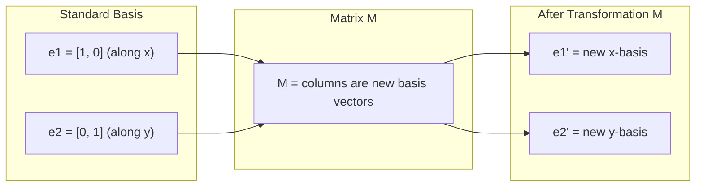
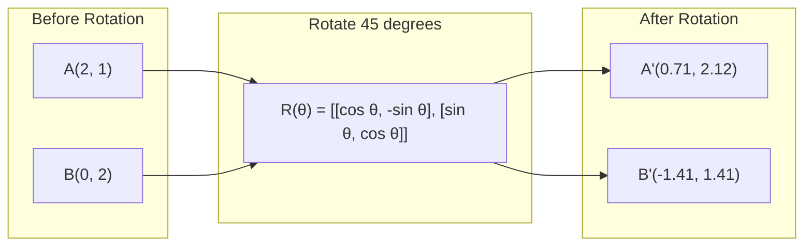
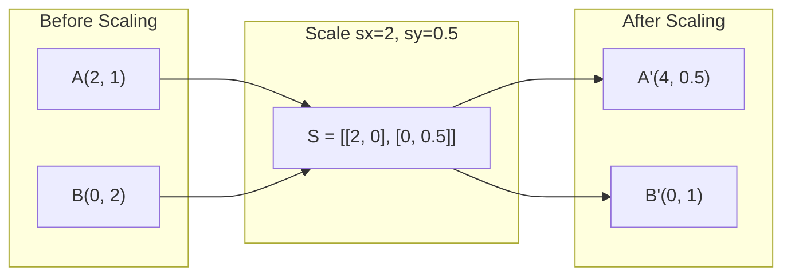
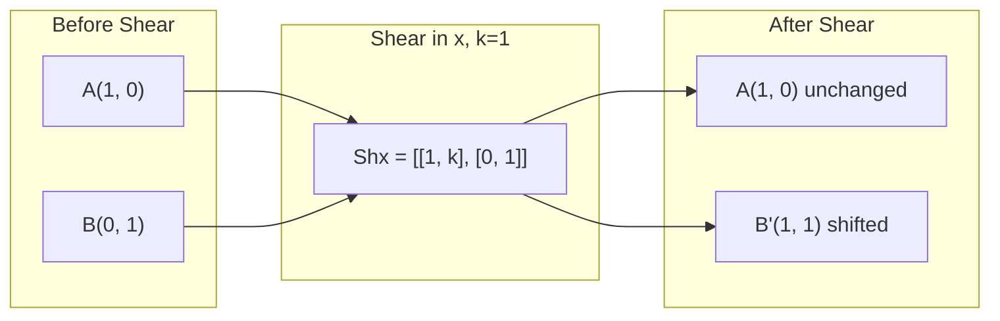
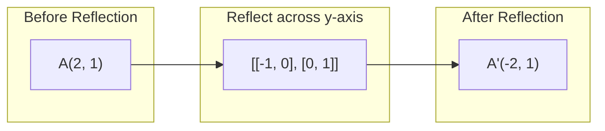
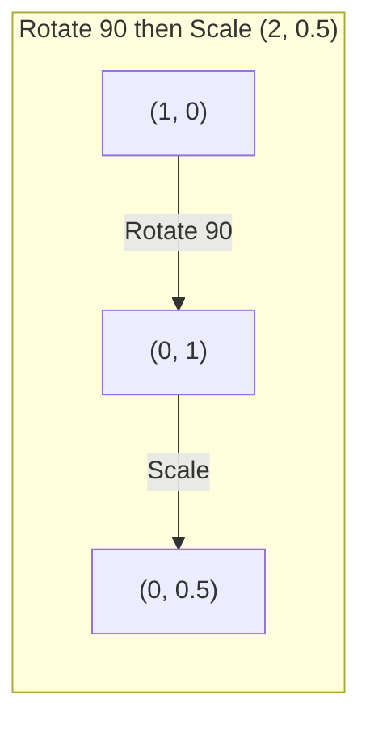
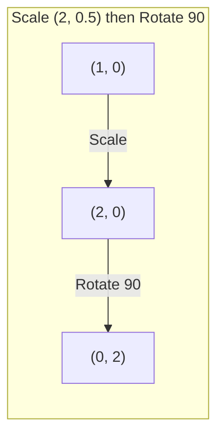

# Phép biến đổi ma trận

> Một ma trận là một cỗ máy định hình lại không gian. Hãy tìm hiểu xem nó làm gì với mọi điểm, và bạn sẽ hiểu được toàn bộ phép biến đổi.

**Type:** Build
**Languages:** Python, Julia
**Prerequisites:** Phase 1, Lessons 01-02 (Linear Algebra Intuition, Vectors & Matrices Operations)
**Time:** ~75 phút

## Learning Objectives

- Xây dựng các ma trận rotation, scaling, shearing, và reflection và áp dụng chúng cho các điểm 2D và 3D
- Kết hợp nhiều phép biến đổi bằng phép nhân ma trận và xác minh rằng thứ tự thực hiện là quan trọng
- Tính toán eigenvalues và eigenvectors của ma trận 2x2 từ phương trình đặc trưng (characteristic equation)
- Giải thích tại sao eigenvalues quyết định các hướng PCA, tính ổn định của RNN, và hành vi của spectral clustering

## The Problem

Bạn đọc về PCA và thấy "tìm eigenvectors của ma trận hiệp phương sai (covariance matrix)." Bạn đọc về tính ổn định của mô hình và thấy "kiểm tra xem tất cả eigenvalues có độ lớn nhỏ hơn 1 hay không." Bạn đọc về tăng cường dữ liệu (data augmentation) và thấy "áp dụng một rotation ngẫu nhiên." Không điều nào trong số này có ý nghĩa cho đến khi bạn hiểu ma trận làm gì với không gian về mặt hình học.

Ma trận không chỉ là những lưới số. Chúng là những cỗ máy không gian. Một ma trận rotation xoay các điểm. Một ma trận scaling kéo giãn chúng. Một ma trận shearing làm nghiêng chúng. Mọi phép biến đổi mà một mạng thần kinh áp dụng cho dữ liệu đều là một trong những thao tác này hoặc là sự kết hợp của chúng. Bài học này làm cho những thao tác đó trở nên cụ thể.

## The Concept

### Transformations as matrices

Mọi phép biến đổi tuyến tính trong 2D đều có thể được viết dưới dạng ma trận 2x2. Ma trận cho bạn biết chính xác vị trí các basis vectors [1, 0] và [0, 1] kết thúc. Mọi thứ khác đều tuân theo.



### Rotation

Một phép rotation 2D theo góc theta giữ nguyên khoảng cách và góc. Nó di chuyển mọi điểm dọc theo một cung tròn.



Trong 3D, bạn rotate quanh một trục. Mỗi trục có ma trận rotation riêng:

```
Rz(theta) = | cos  -sin  0 |     Rotate around z-axis
            | sin   cos  0 |     (x-y plane spins, z stays)
            |  0     0   1 |

Rx(theta) = | 1   0     0    |   Rotate around x-axis
            | 0  cos  -sin   |   (y-z plane spins, x stays)
            | 0  sin   cos   |

Ry(theta) = |  cos  0  sin |     Rotate around y-axis
            |   0   1   0  |     (x-z plane spins, y stays)
            | -sin  0  cos |
```

### Scaling

Scaling kéo giãn hoặc nén dọc theo từng trục một cách độc lập.



### Shearing

Shearing làm nghiêng một trục trong khi giữ cố định trục kia. Nó biến hình chữ nhật thành hình bình hành.



Các ma trận shear:
- `Shx = [[1, k], [0, 1]]` dịch chuyển x một khoảng k * y
- `Shy = [[1, 0], [k, 1]]` dịch chuyển y một khoảng k * x

### Reflection

Reflection phản chiếu các điểm qua một trục hoặc đường thẳng.



Các ma trận reflection:
- Phản chiếu qua trục y: `[[-1, 0], [0, 1]]`
- Phản chiếu qua trục x: `[[1, 0], [0, -1]]`

### Composition: chaining transformations

Áp dụng phép biến đổi A sau đó đến B tương đương với việc nhân các ma trận của chúng: `result = B @ A @ point`. Thứ tự là quan trọng. Rotate sau đó scale cho kết quả khác với scale sau đó rotate.



Kết hợp: `S @ R = [[0, -2], [0.5, 0]]`



Kết hợp: `R @ S = [[0, -0.5], [2, 0]]`

Kết quả khác nhau. Phép nhân ma trận không có tính giao hoán.

### Eigenvalues and eigenvectors

Hầu hết các vector đều thay đổi hướng khi một ma trận tác động lên chúng. Eigenvectors rất đặc biệt: ma trận chỉ scale chúng, không bao giờ rotate chúng. Hệ số scale chính là eigenvalue.

```
A @ v = lambda * v

v is the eigenvector (direction that survives)
lambda is the eigenvalue (how much it stretches)

Example: A = | 2  1 |
             | 1  2 |

Eigenvector [1, 1] with eigenvalue 3:
  A @ [1,1] = [3, 3] = 3 * [1, 1]     (same direction, scaled by 3)

Eigenvector [1, -1] with eigenvalue 1:
  A @ [1,-1] = [1, -1] = 1 * [1, -1]  (same direction, unchanged)
```

Ma trận kéo giãn không gian 3 lần dọc theo [1, 1] và giữ nguyên [1, -1]. Mọi hướng khác là sự kết hợp của hai hướng này.

### Eigendecomposition

Nếu một ma trận có n eigenvectors độc lập tuyến tính, nó có thể được phân rã:

```
A = V @ D @ V^(-1)

V = matrix whose columns are eigenvectors
D = diagonal matrix of eigenvalues
V^(-1) = inverse of V

This says: rotate into eigenvector coordinates, scale along each axis, rotate back.
```

### Why eigenvalues matter

**PCA.** Các eigenvectors của ma trận hiệp phương sai là các thành phần chính (principal components). Các eigenvalues cho bạn biết mỗi thành phần nắm bắt được bao nhiêu phương sai (variance). Sắp xếp theo eigenvalue, giữ lại k giá trị hàng đầu, và bạn có giảm chiều dữ liệu (dimensionality reduction).

**Stability.** Trong các mạng hồi quy (recurrent networks) và các hệ thống động lực, các eigenvalues có độ lớn > 1 khiến đầu ra bị bùng nổ (explode). Độ lớn < 1 khiến chúng biến mất (vanish). Đây chính là vấn đề vanishing/exploding gradient được phát biểu trong một câu.

**Spectral methods.** Graph neural networks sử dụng eigenvalues của ma trận kề (adjacency matrix). Spectral clustering sử dụng eigenvalues của Laplacian. Các eigenvectors tiết lộ cấu trúc của đồ thị.

### Determinant as volume scaling factor

Định thức (determinant) của một ma trận biến đổi cho bạn biết nó scale diện tích (2D) hoặc thể tích (3D) bao nhiêu lần.

```
det = 1:   area preserved (rotation)
det = 2:   area doubled
det = 0:   space crushed to lower dimension (singular)
det = -1:  area preserved but orientation flipped (reflection)

| det(Rotation) | = 1        (always)
| det(Scale sx, sy) | = sx * sy
| det(Shear) | = 1           (area preserved)
| det(Reflection) | = -1     (orientation flipped)
```

```figure
matrix-transform
```

## Build It

### Step 1: Transformation matrices from scratch (Python)

```python
import math

def rotation_2d(theta):
    c, s = math.cos(theta), math.sin(theta)
    return [[c, -s], [s, c]]

def scaling_2d(sx, sy):
    return [[sx, 0], [0, sy]]

def shearing_2d(kx, ky):
    return [[1, kx], [ky, 1]]

def reflection_x():
    return [[1, 0], [0, -1]]

def reflection_y():
    return [[-1, 0], [0, 1]]

def mat_vec_mul(matrix, vector):
    return [
        sum(matrix[i][j] * vector[j] for j in range(len(vector)))
        for i in range(len(matrix))
    ]

def mat_mul(a, b):
    rows_a, cols_b = len(a), len(b[0])
    cols_a = len(a[0])
    return [
        [sum(a[i][k] * b[k][j] for k in range(cols_a)) for j in range(cols_b)]
        for i in range(rows_a)
    ]

point = [1.0, 0.0]
angle = math.pi / 4

rotated = mat_vec_mul(rotation_2d(angle), point)
print(f"Rotate (1,0) by 45 deg: ({rotated[0]:.4f}, {rotated[1]:.4f})")

scaled = mat_vec_mul(scaling_2d(2, 3), [1.0, 1.0])
print(f"Scale (1,1) by (2,3): ({scaled[0]:.1f}, {scaled[1]:.1f})")

sheared = mat_vec_mul(shearing_2d(1, 0), [1.0, 1.0])
print(f"Shear (1,1) kx=1: ({sheared[0]:.1f}, {sheared[1]:.1f})")

reflected = mat_vec_mul(reflection_y(), [2.0, 1.0])
print(f"Reflect (2,1) across y: ({reflected[0]:.1f}, {reflected[1]:.1f})")
```

### Step 2: Composition of transformations

```python
R = rotation_2d(math.pi / 2)
S = scaling_2d(2, 0.5)

rotate_then_scale = mat_mul(S, R)
scale_then_rotate = mat_mul(R, S)

point = [1.0, 0.0]
result1 = mat_vec_mul(rotate_then_scale, point)
result2 = mat_vec_mul(scale_then_rotate, point)

print(f"Rotate 90 then scale: ({result1[0]:.2f}, {result1[1]:.2f})")
print(f"Scale then rotate 90: ({result2[0]:.2f}, {result2[1]:.2f})")
print(f"Same? {result1 == result2}")
```

### Step 3: Eigenvalues from scratch (2x2)

Đối với ma trận 2x2 `[[a, b], [c, d]]`, các eigenvalues là nghiệm của phương trình đặc trưng: `lambda^2 - (a+d)*lambda + (ad - bc) = 0`.

```python
def eigenvalues_2x2(matrix):
    a, b = matrix[0]
    c, d = matrix[1]
    trace = a + d
    det = a * d - b * c
    discriminant = trace ** 2 - 4 * det
    if discriminant < 0:
        real = trace / 2
        imag = (-discriminant) ** 0.5 / 2
        return (complex(real, imag), complex(real, -imag))
    sqrt_disc = discriminant ** 0.5
    return ((trace + sqrt_disc) / 2, (trace - sqrt_disc) / 2)

def eigenvector_2x2(matrix, eigenvalue):
    a, b = matrix[0]
    c, d = matrix[1]
    if abs(b) > 1e-10:
        v = [b, eigenvalue - a]
    elif abs(c) > 1e-10:
        v = [eigenvalue - d, c]
    else:
        if abs(a - eigenvalue) < 1e-10:
            v = [1, 0]
        else:
            v = [0, 1]
    mag = (v[0] ** 2 + v[1] ** 2) ** 0.5
    return [v[0] / mag, v[1] / mag]

A = [[2, 1], [1, 2]]
vals = eigenvalues_2x2(A)
print(f"Matrix: {A}")
print(f"Eigenvalues: {vals[0]:.4f}, {vals[1]:.4f}")

for val in vals:
    vec = eigenvector_2x2(A, val)
    result = mat_vec_mul(A, vec)
    scaled = [val * vec[0], val * vec[1]]
    print(f"  lambda={val:.1f}, v={[round(x,4) for x in vec]}")
    print(f"    A@v = {[round(x,4) for x in result]}")
    print(f"    l*v = {[round(x,4) for x in scaled]}")
```

### Step 4: Determinant as volume scaling factor

```python
def det_2x2(matrix):
    return matrix[0][0] * matrix[1][1] - matrix[0][1] * matrix[1][0]

print(f"det(rotation 45) = {det_2x2(rotation_2d(math.pi/4)):.4f}")
print(f"det(scale 2,3)   = {det_2x2(scaling_2d(2, 3)):.1f}")
print(f"det(shear kx=1)  = {det_2x2(shearing_2d(1, 0)):.1f}")
print(f"det(reflect y)   = {det_2x2(reflection_y()):.1f}")

singular = [[1, 2], [2, 4]]
print(f"det(singular)     = {det_2x2(singular):.1f}")
print("Singular: columns are proportional, space collapses to a line.")
```

## Use It

NumPy xử lý tất cả những việc này bằng các quy trình đã được tối ưu hóa.

```python
import numpy as np

theta = np.pi / 4
R = np.array([[np.cos(theta), -np.sin(theta)],
              [np.sin(theta),  np.cos(theta)]])

point = np.array([1.0, 0.0])
print(f"Rotate (1,0) by 45 deg: {R @ point}")

S = np.diag([2.0, 3.0])
composed = S @ R
print(f"Scale(2,3) after Rotate(45): {composed @ point}")

A = np.array([[2, 1], [1, 2]], dtype=float)
eigenvalues, eigenvectors = np.linalg.eig(A)
print(f"\nEigenvalues: {eigenvalues}")
print(f"Eigenvectors (columns):\n{eigenvectors}")

for i in range(len(eigenvalues)):
    v = eigenvectors[:, i]
    lam = eigenvalues[i]
    print(f"  A @ v{i} = {A @ v}, lambda * v{i} = {lam * v}")

print(f"\ndet(R) = {np.linalg.det(R):.4f}")
print(f"det(S) = {np.linalg.det(S):.1f}")

B = np.array([[3, 1], [0, 2]], dtype=float)
vals, vecs = np.linalg.eig(B)
D = np.diag(vals)
V = vecs
reconstructed = V @ D @ np.linalg.inv(V)
print(f"\nEigendecomposition A = V @ D @ V^-1:")
print(f"Original:\n{B}")
print(f"Reconstructed:\n{reconstructed}")
```

### 3D rotations with NumPy

```python
def rotation_3d_z(theta):
    c, s = np.cos(theta), np.sin(theta)
    return np.array([[c, -s, 0], [s, c, 0], [0, 0, 1]])

def rotation_3d_x(theta):
    c, s = np.cos(theta), np.sin(theta)
    return np.array([[1, 0, 0], [0, c, -s], [0, s, c]])

point_3d = np.array([1.0, 0.0, 0.0])
rotated_z = rotation_3d_z(np.pi / 2) @ point_3d
rotated_x = rotation_3d_x(np.pi / 2) @ point_3d

print(f"\n3D point: {point_3d}")
print(f"Rotate 90 around z: {np.round(rotated_z, 4)}")
print(f"Rotate 90 around x: {np.round(rotated_x, 4)}")
```

## Ship It

Bài học này xây dựng nền tảng hình học cho PCA (Phase 2) và phân tích trọng số mạng thần kinh. Mã nguồn eigenvalue/eigenvector được xây dựng ở đây chính là thuật toán cung cấp sức mạnh cho giảm chiều dữ liệu, spectral clustering và phân tích tính ổn định trong các hệ thống ML thực tế.

## Exercises

1. Áp dụng rotation, scaling, và shearing cho một hình vuông đơn vị (các góc tại [0,0], [1,0], [1,1], [0,1]). In ra các góc đã biến đổi cho mỗi phép toán. Xác minh rằng rotation bảo toàn khoảng cách giữa các góc.

2. Tìm các eigenvalues của ma trận [[4, 2], [1, 3]] bằng tay bằng phương trình đặc trưng. Sau đó xác minh bằng hàm tự viết của bạn và với NumPy.

3. Tạo một tổ hợp gồm ba phép biến đổi (rotate 30 độ, scale theo [1.5, 0.8], shear với kx=0.3) và áp dụng nó cho 8 điểm được sắp xếp theo hình tròn. In ra tọa độ trước và sau. Tính định thức của ma trận tổng hợp và xác minh nó bằng tích của các định thức riêng lẻ.

## Key Terms

| Term | What people say | What it actually means |
|------|----------------|----------------------|
| Rotation matrix | "Xoay mọi thứ" | Một ma trận trực giao di chuyển các điểm dọc theo các cung tròn trong khi bảo toàn khoảng cách và góc. Định thức luôn bằng 1. |
| Scaling matrix | "Làm mọi thứ lớn hơn" | Một ma trận đường chéo kéo giãn hoặc nén độc lập dọc theo mỗi trục. Định thức là tích của các hệ số scale. |
| Shearing matrix | "Làm nghiêng mọi thứ" | Một ma trận dịch chuyển một tọa độ tỷ lệ thuận với tọa độ khác, biến hình chữ nhật thành hình bình hành. Định thức bằng 1. |
| Reflection | "Phản chiếu mọi thứ" | Một ma trận lật ngược không gian qua một trục hoặc mặt phẳng. Định thức bằng -1. |
| Composition | "Làm hai việc" | Nhân các ma trận biến đổi để chuỗi các thao tác. Thứ tự quan trọng: B @ A nghĩa là áp dụng A trước, sau đó đến B. |
| Eigenvector | "Hướng đặc biệt" | Một hướng mà ma trận chỉ scale, không bao giờ rotate. "Dấu vân tay" của phép biến đổi. |
| Eigenvalue | "Nó kéo giãn bao nhiêu" | Hệ số vô hướng mà ma trận dùng để scale eigenvector của nó. Có thể là số âm (lật) hoặc số phức (xoay). |
| Eigendecomposition | "Phân rã ma trận" | Viết một ma trận dưới dạng V @ D @ V^(-1), tách nó thành các hướng và độ lớn scale cơ bản. |
| Determinant | "Một con số duy nhất từ ma trận" | Hệ số mà phép biến đổi dùng để scale diện tích (2D) hoặc thể tích (3D). Bằng không nghĩa là phép biến đổi không thể đảo ngược. |
| Characteristic equation | "Nơi eigenvalues sinh ra" | det(A - lambda * I) = 0. Đa thức có các nghiệm là các eigenvalues. |

## Further Reading

- [3Blue1Brown: Linear Transformations](https://www.3blue1brown.com/lessons/linear-transformations) -- trực giác hình học về cách ma trận định hình lại không gian
- [3Blue1Brown: Eigenvectors and Eigenvalues](https://www.3blue1brown.com/lessons/eigenvalues) -- giải thích trực quan tốt nhất về ý nghĩa hình học của eigenvectors
- [MIT 18.06 Lecture 21: Eigenvalues and Eigenvectors](https://ocw.mit.edu/courses/18-06-linear-algebra-spring-2010/) -- bài giảng kinh điển của Gilbert Strang