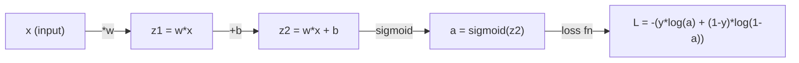
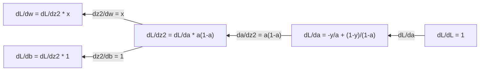
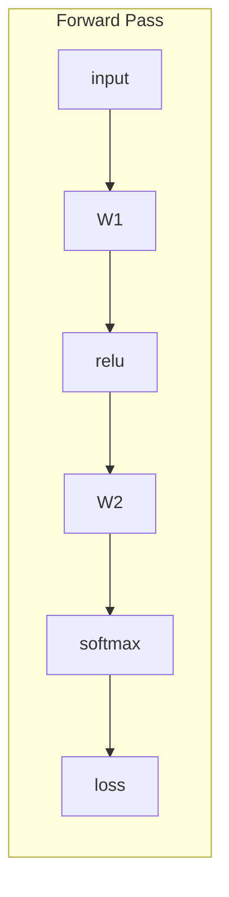
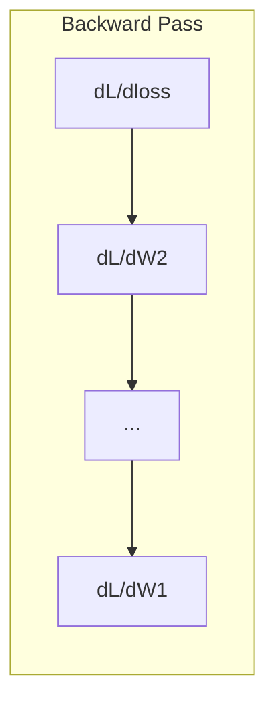

# Giải tích cho Machine Learning

> Đạo hàm cho bạn biết hướng nào là xuống dốc. Đó là tất cả những gì một neural network cần để học.

**Type:** Learn
**Language:** Python
**Prerequisites:** Phase 1, Lessons 01-03
**Time:** ~60 minutes

## Learning Objectives

- Tính toán đạo hàm số học (numerical) và giải tích (analytical) cho các hàm ML phổ biến (x^2, sigmoid, cross-entropy)
- Triển khai gradient descent từ đầu để tối thiểu hóa một hàm mất mát (loss function) trong không gian 1D và 2D
- Tính toán gradient của mô hình linear regression và huấn luyện nó thông qua việc cập nhật trọng số thủ công
- Giải thích ma trận Hessian, xấp xỉ chuỗi Taylor và mối liên hệ của chúng với các phương pháp tối ưu hóa

## The Problem

Bạn có một neural network với hàng triệu trọng số (weights). Mỗi trọng số giống như một núm vặn. Bạn cần tìm ra hướng xoay cho từng núm vặn đó để làm cho mô hình bớt sai sót hơn một chút. Giải tích cung cấp cho bạn hướng đi đó.

Không có giải tích, việc huấn luyện một neural network sẽ đồng nghĩa với việc thử các thay đổi ngẫu nhiên và hy vọng điều tốt nhất sẽ đến. Với đạo hàm, bạn biết chính xác mỗi trọng số ảnh hưởng đến sai số như thế nào. Bạn xoay mọi núm vặn đúng hướng, mọi lúc.

## The Concept

### Đạo hàm là gì?

Đạo hàm đo lường tốc độ thay đổi. Đối với một hàm y = f(x), đạo hàm f'(x) cho bạn biết: nếu bạn nhích x đi một lượng cực nhỏ, y sẽ thay đổi bao nhiêu?

Về mặt hình học, đạo hàm là độ dốc của đường tiếp tuyến tại một điểm.

**f(x) = x^2:**

| x | f(x) | f'(x) (độ dốc) |
|---|------|---------------|
| 0 | 0    | 0 (phẳng, ở đáy) |
| 1 | 1    | 2 |
| 2 | 4    | 4 (độ dốc tiếp tuyến tại điểm này) |
| 3 | 9    | 6 |

Tại x=2, độ dốc là 4. Nếu bạn di chuyển x một chút sang phải, y sẽ tăng khoảng 4 lần lượng đó. Tại x=0, độ dốc là 0. Bạn đang ở đáy của lòng chảo.

Định nghĩa chính thức:

```
f'(x) = lim   f(x + h) - f(x)
        h->0  -----------------
                     h
```

Trong code, bạn bỏ qua giới hạn (limit) và chỉ sử dụng một giá trị h rất nhỏ. Đó chính là đạo hàm số học (numerical derivative).

### Đạo hàm riêng: từng biến một

Các hàm số thực tế có nhiều đầu vào. Một hàm mất mát của neural network phụ thuộc vào hàng ngàn trọng số. Đạo hàm riêng (partial derivative) giữ tất cả các biến cố định ngoại trừ một biến, sau đó lấy đạo hàm theo biến đó.

```
f(x, y) = x^2 + 3xy + y^2

df/dx = 2x + 3y     (treat y as a constant)
df/dy = 3x + 2y     (treat x as a constant)
```

Mỗi đạo hàm riêng trả lời câu hỏi: nếu tôi chỉ nhích một trọng số này, hàm mất mát sẽ thay đổi như thế nào?

### Gradient: vector của tất cả các đạo hàm riêng

Gradient tập hợp mọi đạo hàm riêng vào một vector. Đối với hàm f(x, y, z), gradient là:

```
grad f = [ df/dx, df/dy, df/dz ]
```

Gradient chỉ theo hướng tăng nhanh nhất (steepest ascent). Để tối thiểu hóa một hàm, hãy đi theo hướng ngược lại.

**Biểu đồ đường đồng mức (contour plot) của f(x,y) = x^2 + y^2:**

Hàm số tạo thành hình lòng chảo với các vòng tròn đồng tâm là các đường đồng mức. Điểm cực tiểu nằm tại (0, 0).

| Điểm | grad f | -grad f (hướng đi xuống) |
|-------|--------|----------------------------|
| (1, 1) | [2, 2] (chỉ lên dốc, rời xa cực tiểu) | [-2, -2] (chỉ xuống dốc, hướng về cực tiểu) |
| (0, 0) | [0, 0] (phẳng, tại cực tiểu) | [0, 0] |

Đây chính là hình ảnh của gradient descent. Tính gradient, đổi dấu nó, và thực hiện một bước đi.

### Mối liên hệ với tối ưu hóa

Huấn luyện một neural network là một bài toán tối ưu hóa. Bạn có một hàm mất mát L(w1, w2, ..., wn) đo lường mức độ sai lệch của mô hình. Bạn muốn tối thiểu hóa nó.

```
Gradient descent update rule:

  w_new = w_old - learning_rate * dL/dw

For every weight:
  1. Compute the partial derivative of loss with respect to that weight
  2. Subtract a small multiple of it from the weight
  3. Repeat
```

Learning rate kiểm soát kích thước bước đi. Nếu quá lớn, bạn sẽ nhảy vọt qua mục tiêu (overshoot). Nếu quá nhỏ, bạn sẽ bò rất chậm.

**Cảnh quan hàm mất mát (lát cắt 1D):**

Hàm mất mát L(w) tạo thành một đường cong với các đỉnh và thung lũng khi trọng số w thay đổi.

| Đặc điểm | Mô tả |
|---------|-------------|
| Cực tiểu toàn cục (Global minimum) | Điểm thấp nhất trên toàn bộ đường cong -- giải pháp tốt nhất |
| Cực tiểu cục bộ (Local minimum) | Một thung lũng thấp hơn các điểm lân cận nhưng không phải thấp nhất tổng thể |
| Độ dốc (Slope) | Gradient descent đi theo độ dốc xuống dưới từ bất kỳ điểm bắt đầu nào |

Gradient descent đi theo độ dốc xuống dưới. Nó có thể bị kẹt ở các cực tiểu cục bộ, nhưng trong không gian nhiều chiều (hàng triệu trọng số), đây hiếm khi là vấn đề thực tế.

### Đạo hàm số học so với đạo hàm giải tích

Có hai cách để tính đạo hàm.

Giải tích (Analytical): áp dụng các quy tắc giải tích bằng tay. Với f(x) = x^2, đạo hàm là f'(x) = 2x. Chính xác. Nhanh.

Số học (Numerical): xấp xỉ bằng định nghĩa. Tính f(x+h) và f(x-h) với h cực nhỏ, sau đó tính sự chênh lệch.

```
Numerical (central difference):

f'(x) ~= f(x + h) - f(x - h)
          -----------------------
                  2h

h = 0.0001 works well in practice
```

Đạo hàm số học chậm hơn nhưng hoạt động với bất kỳ hàm số nào. Đạo hàm giải tích nhanh nhưng yêu cầu bạn phải tự tìm ra công thức. Các framework neural network sử dụng cách tiếp cận thứ ba: vi phân tự động (automatic differentiation), giúp tính toán đạo hàm chính xác một cách máy móc. Bạn sẽ thấy điều này trong Phase 3.

### Tính đạo hàm bằng tay cho các hàm đơn giản

Đây là những đạo hàm bạn sẽ gặp đi gặp lại trong ML.

```
Function        Derivative       Used in
--------        ----------       -------
f(x) = x^2     f'(x) = 2x      Loss functions (MSE)
f(x) = wx + b  f'(w) = x        Linear layer (gradient w.r.t. weight)
                f'(b) = 1        Linear layer (gradient w.r.t. bias)
                f'(x) = w        Linear layer (gradient w.r.t. input)
f(x) = e^x     f'(x) = e^x     Softmax, attention
f(x) = ln(x)   f'(x) = 1/x     Cross-entropy loss
f(x) = 1/(1+e^-x)  f'(x) = f(x)(1-f(x))   Sigmoid activation
```

Với f(x) = x^2:

```
f(x) = x^2    f'(x) = 2x

  x    f(x)   f'(x)   meaning
  -2    4      -4      slope tilts left (decreasing)
  -1    1      -2      slope tilts left (decreasing)
   0    0       0      flat (minimum!)
   1    1       2      slope tilts right (increasing)
   2    4       4      slope tilts right (increasing)
```

Với f(w) = wx + b với x=3, b=1:

```
f(w) = 3w + 1    f'(w) = 3

The derivative with respect to w is just x.
If x is big, a small change in w causes a big change in output.
```

### Quy tắc chuỗi (Chain rule)

Khi các hàm số được lồng nhau, quy tắc chuỗi cho bạn biết cách lấy đạo hàm.

```
If y = f(g(x)), then dy/dx = f'(g(x)) * g'(x)

Example: y = (3x + 1)^2
  outer: f(u) = u^2       f'(u) = 2u
  inner: g(x) = 3x + 1    g'(x) = 3
  dy/dx = 2(3x + 1) * 3 = 6(3x + 1)
```

Neural networks là các chuỗi hàm số: input -> linear -> activation -> linear -> activation -> loss. Backpropagation chính là quy tắc chuỗi được áp dụng lặp đi lặp lại từ đầu ra đến đầu vào. Đó là toàn bộ thuật toán.

### Ma trận Hessian

Gradient cho bạn biết độ dốc. Hessian cho bạn biết độ cong (curvature).

Hessian là ma trận của các đạo hàm riêng bậc hai. Đối với hàm f(x1, x2, ..., n), phần tử (i, j) của Hessian là:

```
H[i][j] = d^2f / (dx_i * dx_j)
```

Đối với hàm 2 biến f(x, y):

```
H = | d^2f/dx^2    d^2f/dxdy |
    | d^2f/dydx    d^2f/dy^2 |
```

**Hessian cho bạn biết điều gì tại một điểm tới hạn (nơi gradient = 0):**

| Tính chất Hessian | Ý nghĩa | Ví dụ bề mặt |
|-----------------|---------|-----------------|
| Xác định dương (tất cả trị riêng > 0) | Cực tiểu cục bộ | Lòng chảo hướng lên |
| Xác định âm (tất cả trị riêng < 0) | Cực đại cục bộ | Lòng chảo hướng xuống |
| Không xác định (trị riêng hỗn hợp) | Điểm yên ngựa | Hình yên ngựa |

**Ví dụ:** f(x, y) = x^2 - y^2 (một hàm yên ngựa)

```
df/dx = 2x       df/dy = -2y
d^2f/dx^2 = 2    d^2f/dy^2 = -2    d^2f/dxdy = 0

H = | 2   0 |
    | 0  -2 |

Eigenvalues: 2 and -2 (one positive, one negative)
--> Saddle point at (0, 0)
```

So sánh với f(x, y) = x^2 + y^2 (một lòng chảo):

```
H = | 2  0 |
    | 0  2 |

Eigenvalues: 2 and 2 (both positive)
--> Local minimum at (0, 0)
```

**Tại sao Hessian quan trọng trong ML:**

Phương pháp Newton sử dụng Hessian để thực hiện các bước tối ưu hóa tốt hơn gradient descent. Thay vì chỉ đi theo độ dốc, nó tính đến cả độ cong:

```
Newton's update:    w_new = w_old - H^(-1) * gradient
Gradient descent:   w_new = w_old - lr * gradient
```

Phương pháp Newton hội tụ nhanh hơn vì Hessian "thay đổi tỷ lệ" (rescales) gradient -- các hướng dốc sẽ có bước đi nhỏ hơn, các hướng phẳng sẽ có bước đi lớn hơn.

Trở ngại: đối với một neural network có N tham số, Hessian là N x N. Một mô hình với 1 triệu tham số sẽ cần một ma trận 1 nghìn tỷ phần tử. Đó là lý do tại sao chúng ta sử dụng các phương pháp xấp xỉ.

| Phương pháp | Sử dụng gì | Chi phí | Hội tụ |
|--------|-------------|------|-------------|
| Gradient descent | Chỉ đạo hàm bậc nhất | O(N) mỗi bước | Chậm (tuyến tính) |
| Phương pháp Newton | Toàn bộ Hessian | O(N^3) mỗi bước | Nhanh (bậc hai) |
| L-BFGS | Xấp xỉ Hessian từ lịch sử gradient | O(N) mỗi bước | Trung bình (siêu tuyến tính) |
| Adam | Tốc độ thích ứng theo từng tham số (xấp xỉ Hessian đường chéo) | O(N) mỗi bước | Trung bình |
| Natural gradient | Ma trận thông tin Fisher (Hessian thống kê) | O(N^2) mỗi bước | Nhanh |

Trong thực tế, Adam là trình tối ưu hóa mặc định cho deep learning. Nó xấp xỉ thông tin bậc hai một cách rẻ tiền bằng cách theo dõi giá trị trung bình và phương sai của gradient cho mỗi tham số.

### Xấp xỉ chuỗi Taylor

Bất kỳ hàm trơn nào cũng có thể được xấp xỉ cục bộ bằng một đa thức:

```
f(x + h) = f(x) + f'(x)*h + (1/2)*f''(x)*h^2 + (1/6)*f'''(x)*h^3 + ...
```

Bạn càng bao gồm nhiều số hạng, xấp xỉ càng tốt -- nhưng chỉ ở gần điểm x.

**Tại sao chuỗi Taylor quan trọng đối với ML:**

- **Taylor bậc nhất = gradient descent.** Khi bạn sử dụng f(x + h) ~ f(x) + f'(x)*h, bạn đang thực hiện một xấp xỉ tuyến tính. Gradient descent tối thiểu hóa mô hình tuyến tính này để chọn h = -lr * f'(x).

- **Taylor bậc hai = phương pháp Newton.** Sử dụng f(x + h) ~ f(x) + f'(x)*h + (1/2)*f''(x)*h^2, bạn có một mô hình bậc hai. Tối thiểu hóa nó sẽ cho h = -f'(x)/f''(x) -- bước nhảy Newton.

- **Thiết kế hàm mất mát.** MSE và cross-entropy là các hàm trơn, có nghĩa là khai triển Taylor của chúng hoạt động tốt. Đây không phải là ngẫu nhiên. Các hàm mất mát trơn giúp việc tối ưu hóa có thể dự đoán được.

```
Approximation order    What it captures    Optimization method
-------------------    -----------------   -------------------
0th order (constant)   Just the value      Random search
1st order (linear)     Slope               Gradient descent
2nd order (quadratic)  Curvature           Newton's method
Higher orders          Finer structure     Rarely used in ML
```

Thông tin then chốt: tất cả các phương pháp tối ưu hóa dựa trên gradient thực chất là việc xấp xỉ hàm mất mát cục bộ và thực hiện bước đi tới điểm cực tiểu của xấp xỉ đó.

### Tích phân trong ML

Đạo hàm cho biết tốc độ thay đổi. Tích phân tính toán sự tích lũy -- diện tích dưới một đường cong.

Trong ML, bạn hiếm khi tính tích phân bằng tay, nhưng khái niệm này có mặt ở khắp mọi nơi:

**Xác suất.** Đối với một biến ngẫu nhiên liên tục với hàm mật độ p(x):
```
P(a < X < b) = integral from a to b of p(x) dx
```
Diện tích dưới đường cong mật độ xác suất giữa a và b là xác suất rơi vào khoảng đó.

**Giá trị kỳ vọng.** Kết quả trung bình được trọng số bởi xác suất:
```
E[f(X)] = integral of f(x) * p(x) dx
```
Hàm mất mát kỳ vọng trên một phân phối dữ liệu là một tích phân. Việc huấn luyện sẽ tối thiểu hóa một xấp xỉ thực nghiệm của giá trị này.

**KL divergence.** Đo lường sự khác biệt giữa hai phân phối:
```
KL(p || q) = integral of p(x) * log(p(x) / q(x)) dx
```
Được sử dụng trong VAEs, knowledge distillation, và suy diễn Bayesian.

**Hằng số chuẩn hóa.** Trong suy diễn Bayesian:
```
p(w | data) = p(data | w) * p(w) / integral of p(data | w) * p(w) dw
```
Mẫu số là một tích phân trên tất cả các giá trị tham số có thể có. Nó thường là không thể tính toán trực tiếp (intractable), đó là lý do tại sao chúng ta sử dụng các phương pháp xấp xỉ như MCMC và variational inference.

| Khái niệm tích phân | Xuất hiện ở đâu trong ML |
|-----------------|----------------------|
| Diện tích dưới đường cong | Xác suất từ hàm mật độ |
| Giá trị kỳ vọng | Hàm mất mát, tối thiểu hóa rủi ro |
| KL divergence | VAEs, tối ưu hóa chính sách, distillation |
| Chuẩn hóa | Phân phối hậu nghiệm Bayesian, mẫu số softmax |
| Marginal likelihood | So sánh mô hình, bằng chứng cận dưới (ELBO) |

### Quy tắc chuỗi đa biến trong đồ thị tính toán

Quy tắc chuỗi không chỉ áp dụng cho các hàm vô hướng trên một đường thẳng. Trong một neural network, các biến phân nhánh và hợp nhất. Đây là cách các đạo hàm lan truyền qua một lượt truyền xuôi (forward pass) đơn giản:



Lượt truyền ngược (backward pass) tính toán gradient từ phải sang trái:



Mỗi mũi tên nhân với đạo hàm cục bộ. Gradient cho bất kỳ tham số nào là tích của tất cả các đạo hàm cục bộ dọc theo con đường từ hàm mất mát đến tham số đó. Khi các con đường phân nhánh và hợp nhất, bạn cộng các đóng góp lại (quy tắc chuỗi đa biến).

Đây là tất cả những gì backpropagation thực hiện: quy tắc chuỗi được áp dụng một cách hệ thống thông qua một đồ thị tính toán, từ đầu ra đến đầu vào.

### Ma trận Jacobian

Khi một hàm ánh xạ một vector sang một vector (như một lớp trong neural network), đạo hàm của nó là một ma trận. Jacobian chứa mọi đạo hàm riêng của mọi đầu ra đối với mọi đầu vào.

Đối với f: R^n -> R^m, Jacobian J là một ma trận m x n:

| | x1 | x2 | ... | xn |
|---|---|---|---|---|
| f1 | df1/dx1 | df1/dx2 | ... | df1/dxn |
| f2 | df2/dx1 | df2/dx2 | ... | df2/dxn |
| ... | ... | ... | ... | ... |
| fm | dfm/dx1 | dfm/dx2 | ... | dfm/dxn |

Bạn sẽ không tính Jacobian bằng tay cho các neural network. PyTorch sẽ xử lý việc đó. Nhưng biết về sự tồn tại của nó giúp bạn hiểu về hình dạng (shape) trong backpropagation: nếu một lớp ánh xạ R^n sang R^m, Jacobian của nó là m x n. Gradient lan truyền ngược thông qua ma trận chuyển vị của ma trận này.

### Tại sao điều này quan trọng đối với neural network

Mỗi trọng số trong một neural network đều nhận được một gradient. Gradient cho bạn biết cách điều chỉnh trọng số đó để giảm thiểu hàm mất mát.





Mỗi lần cập nhật trọng số:
- `W1 = W1 - lr * dL/dW1`
- `W2 = W2 - lr * dL/dW2`

Lượt truyền xuôi tính toán dự đoán và hàm mất mát. Lượt truyền ngược tính toán gradient của hàm mất mát đối với mọi trọng số. Sau đó, mỗi trọng số thực hiện một bước nhỏ xuống dốc. Lặp lại hàng triệu bước. Đó chính là deep learning.

```figure
derivative-tangent
```

## Build It

### Bước 1: Đạo hàm số học từ đầu

```python
def numerical_derivative(f, x, h=1e-7):
    return (f(x + h) - f(x - h)) / (2 * h)

def f(x):
    return x ** 2

for x in [-2, -1, 0, 1, 2]:
    numerical = numerical_derivative(f, x)
    analytical = 2 * x
    print(f"x={x:2d}  f'(x) numerical={numerical:.6f}  analytical={analytical:.1f}")
```

Đạo hàm số học khớp với đạo hàm giải tích đến nhiều chữ số thập phân.

### Bước 2: Đạo hàm riêng và gradient

```python
def numerical_gradient(f, point, h=1e-7):
    gradient = []
    for i in range(len(point)):
        point_plus = list(point)
        point_minus = list(point)
        point_plus[i] += h
        point_minus[i] -= h
        partial = (f(point_plus) - f(point_minus)) / (2 * h)
        gradient.append(partial)
    return gradient

def f_multi(point):
    x, y = point
    return x**2 + 3*x*y + y**2

grad = numerical_gradient(f_multi, [1.0, 2.0])
print(f"Numerical gradient at (1,2): {[f'{g:.4f}' for g in grad]}")
print(f"Analytical gradient at (1,2): [2*1+3*2, 3*1+2*2] = [{2*1+3*2}, {3*1+2*2}]")
```

### Bước 3: Gradient descent để tìm cực tiểu của f(x) = x^2

```python
x = 5.0
lr = 0.1
for step in range(20):
    grad = 2 * x
    x = x - lr * grad
    print(f"step {step:2d}  x={x:8.4f}  f(x)={x**2:10.6f}")
```

Bắt đầu tại x=5, mỗi bước di chuyển gần hơn về x=0 (điểm cực tiểu).

### Bước 4: Gradient descent trên hàm 2D

```python
def f_2d(point):
    x, y = point
    return x**2 + y**2

point = [4.0, 3.0]
lr = 0.1
for step in range(30):
    grad = numerical_gradient(f_2d, point)
    point = [p - lr * g for p, g in zip(point, grad)]
    loss = f_2d(point)
    if step % 5 == 0 or step == 29:
        print(f"step {step:2d}  point=({point[0]:7.4f}, {point[1]:7.4f})  f={loss:.6f}")
```

### Bước 5: So sánh đạo hàm số học và giải tích

```python
import math

test_functions = [
    ("x^2",      lambda x: x**2,          lambda x: 2*x),
    ("x^3",      lambda x: x**3,          lambda x: 3*x**2),
    ("sin(x)",   lambda x: math.sin(x),   lambda x: math.cos(x)),
    ("e^x",      lambda x: math.exp(x),   lambda x: math.exp(x)),
    ("1/x",      lambda x: 1/x,           lambda x: -1/x**2),
]

x = 2.0
print(f"{'Function':<12} {'Numerical':>12} {'Analytical':>12} {'Error':>12}")
print("-" * 50)
for name, f, df in test_functions:
    num = numerical_derivative(f, x)
    ana = df(x)
    err = abs(num - ana)
    print(f"{name:<12} {num:12.6f} {ana:12.6f} {err:12.2e}")
```

### Bước 6: Tính ma trận Hessian bằng phương pháp số học

```python
def hessian_2d(f, x, y, h=1e-5):
    fxx = (f(x + h, y) - 2 * f(x, y) + f(x - h, y)) / (h ** 2)
    fyy = (f(x, y + h) - 2 * f(x, y) + f(x, y - h)) / (h ** 2)
    fxy = (f(x + h, y + h) - f(x + h, y - h) - f(x - h, y + h) + f(x - h, y - h)) / (4 * h ** 2)
    return [[fxx, fxy], [fxy, fyy]]

def saddle(x, y):
    return x ** 2 - y ** 2

def bowl(x, y):
    return x ** 2 + y ** 2

H_saddle = hessian_2d(saddle, 0.0, 0.0)
H_bowl = hessian_2d(bowl, 0.0, 0.0)
print(f"Saddle Hessian: {H_saddle}")  # [[2, 0], [0, -2]] -- mixed signs
print(f"Bowl Hessian:   {H_bowl}")    # [[2, 0], [0, 2]]  -- both positive
```

Hessian của hàm yên ngựa có các trị riêng là 2 và -2 (dấu hỗn hợp, xác nhận là điểm yên ngựa). Hàm lòng chảo có các trị riêng là 2 và 2 (cả hai đều dương, xác nhận là điểm cực tiểu).

### Bước 7: Xấp xỉ Taylor trong thực tế

```python
import math

def taylor_approx(f, f_prime, f_double_prime, x0, h, order=2):
    result = f(x0)
    if order >= 1:
        result += f_prime(x0) * h
    if order >= 2:
        result += 0.5 * f_double_prime(x0) * h ** 2
    return result

x0 = 0.0
for h in [0.1, 0.5, 1.0, 2.0]:
    true_val = math.sin(h)
    t1 = taylor_approx(math.sin, math.cos, lambda x: -math.sin(x), x0, h, order=1)
    t2 = taylor_approx(math.sin, math.cos, lambda x: -math.sin(x), x0, h, order=2)
    print(f"h={h:.1f}  sin(h)={true_val:.4f}  order1={t1:.4f}  order2={t2:.4f}")
```

Gần x0=0, sin(x) ~ x (Taylor bậc nhất). Xấp xỉ này rất tốt cho h nhỏ nhưng không còn đúng khi h lớn. Đây là lý do tại sao gradient descent hoạt động tốt nhất với learning rate nhỏ -- mỗi bước đi giả định rằng xấp xỉ tuyến tính là chính xác.

### Bước 8: Tại sao điều này quan trọng đối với một neural network

```python
import random

random.seed(42)

w = random.gauss(0, 1)
b = random.gauss(0, 1)
lr = 0.01

xs = [1.0, 2.0, 3.0, 4.0, 5.0]
ys = [3.0, 5.0, 7.0, 9.0, 11.0]

for epoch in range(200):
    total_loss = 0
    dw = 0
    db = 0
    for x, y in zip(xs, ys):
        pred = w * x + b
        error = pred - y
        total_loss += error ** 2
        dw += 2 * error * x
        db += 2 * error
    dw /= len(xs)
    db /= len(xs)
    total_loss /= len(xs)
    w -= lr * dw
    b -= lr * db
    if epoch % 40 == 0 or epoch == 199:
        print(f"epoch {epoch:3d}  w={w:.4f}  b={b:.4f}  loss={total_loss:.6f}")

print(f"\nLearned: y = {w:.2f}x + {b:.2f}")
print(f"Actual:  y = 2x + 1")
```

Mọi vòng lặp huấn luyện dựa trên gradient đều tuân theo mô hình này: dự đoán, tính hàm mất mát, tính gradient, cập nhật trọng số.

## Use It

Với NumPy, các thao tác tương tự sẽ nhanh hơn và súc tích hơn:

```python
import numpy as np

x = np.array([1, 2, 3, 4, 5], dtype=float)
y = np.array([3, 5, 7, 9, 11], dtype=float)

w, b = np.random.randn(), np.random.randn()
lr = 0.01

for epoch in range(200):
    pred = w * x + b
    error = pred - y
    loss = np.mean(error ** 2)
    dw = np.mean(2 * error * x)
    db = np.mean(2 * error)
    w -= lr * dw
    b -= lr * db

print(f"Learned: y = {w:.2f}x + {b:.2f}")
```

Bạn vừa xây dựng gradient descent từ đầu. PyTorch tự động hóa việc tính toán gradient, nhưng vòng lặp cập nhật là hoàn toàn giống hệt.

## Exercises

1. Triển khai `numerical_second_derivative(f, x)` bằng cách sử dụng `numerical_derivative` được gọi hai lần. Xác minh rằng đạo hàm bậc hai của x^3 tại x=2 là 12.
2. Sử dụng gradient descent để tìm cực tiểu của f(x, y) = (x - 3)^2 + (y + 1)^2. Bắt đầu từ (0, 0). Kết quả sẽ hội tụ về (3, -1).
3. Thêm momentum vào vòng lặp gradient descent: duy trì một vector vận tốc (velocity vector) tích lũy các gradient trong quá khứ. So sánh tốc độ hội tụ khi có và không có momentum trên hàm f(x) = x^4 - 3x^2.

## Key Terms

| Thuật ngữ | Mọi người thường nói | Ý nghĩa thực sự |
|------|----------------|----------------------|
| Derivative (Đạo hàm) | "Độ dốc" | Tốc độ thay đổi của một hàm số tại một điểm. Cho bạn biết đầu ra thay đổi bao nhiêu trên mỗi đơn vị thay đổi của đầu vào. |
| Partial derivative (Đạo hàm riêng) | "Đạo hàm của một biến" | Đạo hàm đối với một biến trong khi tất cả các biến khác được giữ cố định. |
| Gradient | "Hướng tăng nhanh nhất" | Một vector chứa tất cả các đạo hàm riêng. Chỉ theo hướng làm hàm số tăng nhanh nhất. |
| Gradient descent | "Đi xuống dốc" | Trừ gradient (nhân với learning rate) khỏi các tham số để giảm hàm mất mát. Cốt lõi của việc huấn luyện neural network. |
| Learning rate | "Kích thước bước đi" | Một đại lượng vô hướng kiểm soát độ lớn của mỗi bước gradient descent. Quá lớn: phân kỳ. Quá nhỏ: hội tụ chậm. |
| Chain rule (Quy tắc chuỗi) | "Nhân các đạo hàm" | Quy tắc để lấy đạo hàm của các hàm hợp: df/dx = df/dg * dg/dx. Cơ sở toán học của backpropagation. |
| Jacobian | "Ma trận đạo hàm" | Khi một hàm ánh xạ các vector sang các vector, Jacobian là ma trận của tất cả các đạo hàm riêng của các đầu ra đối với các đầu vào. |
| Numerical derivative (Đạo hàm số học) | "Sai phân hữu hạn" | Xấp xỉ đạo hàm bằng cách tính giá trị hàm số tại hai điểm gần nhau và tính độ dốc giữa chúng. |
| Backpropagation | "Lan truyền ngược" | Tính toán gradient theo từng lớp từ đầu ra đến đầu vào bằng quy tắc chuỗi. Cách neural network học. |
| Hessian | "Ma trận đạo hàm bậc hai" | Ma trận của tất cả các đạo hàm riêng bậc hai. Mô tả độ cong của một hàm số. Hessian xác định dương tại một điểm tới hạn nghĩa là cực tiểu cục bộ. |
| Taylor series (Chuỗi Taylor) | "Xấp xỉ đa thức" | Xấp xỉ một hàm số gần một điểm bằng các đạo hàm của nó: f(x+h) ~ f(x) + f'(x)h + (1/2)f''(x)h^2 + ... Cơ sở để hiểu tại sao gradient descent và phương pháp Newton hoạt động. |
| Integral (Tích phân) | "Diện tích dưới đường cong" | Sự tích lũy của một đại lượng trên một phạm vi. Trong ML, tích phân định nghĩa xác suất, giá trị kỳ vọng và KL divergence. |

## Further Reading

- [3Blue1Brown: Essence of Calculus](https://www.3blue1brown.com/topics/calculus) - trực quan hóa về đạo hàm, tích phân và quy tắc chuỗi
- [Stanford CS231n: Backpropagation](https://cs231n.github.io/optimization-2/) - cách gradient lan truyền qua các lớp neural network