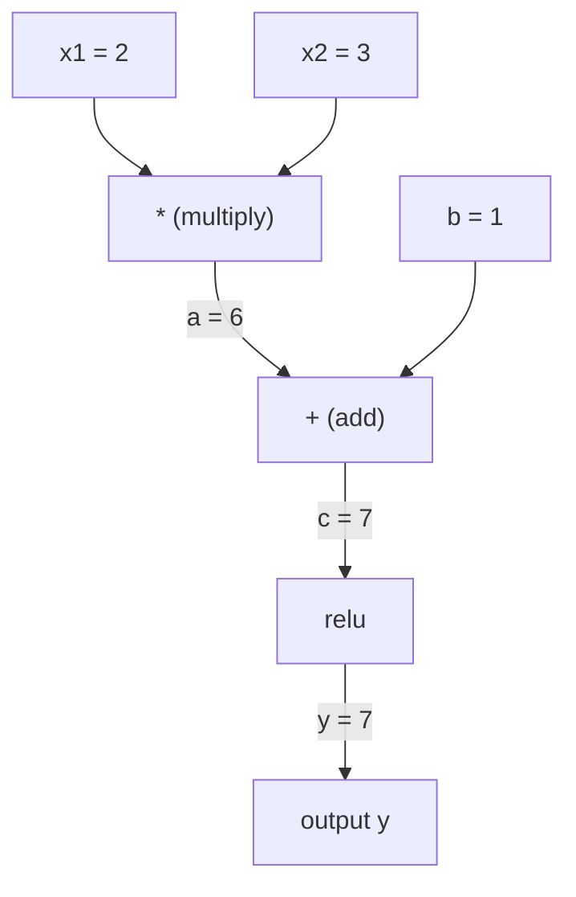
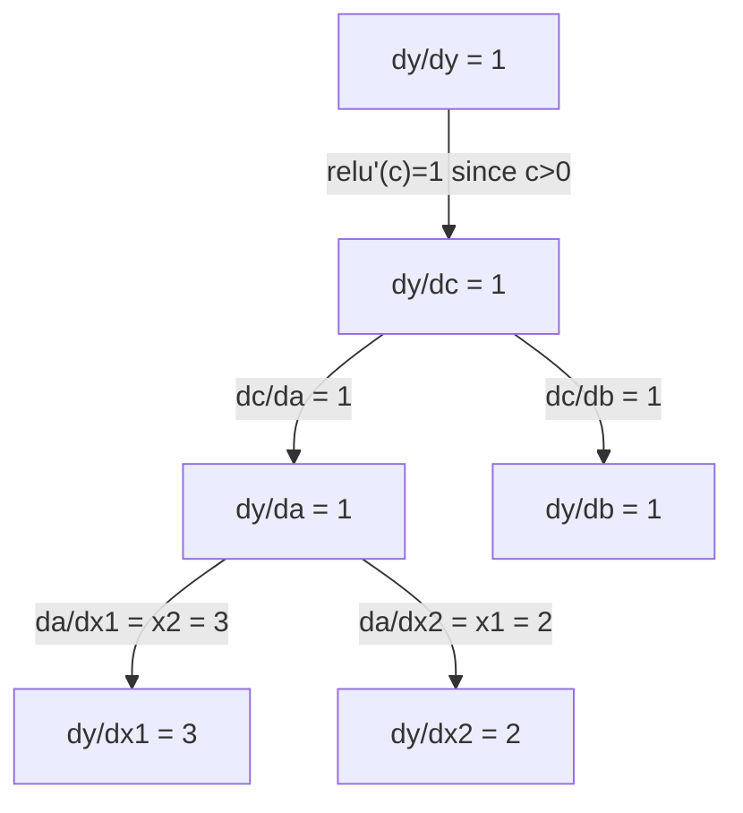

# Chain Rule & Automatic Differentiation

> Chain rule là động cơ đằng sau mọi mạng neural có khả năng học tập.

**Type:** Build
**Language:** Python
**Prerequisites:** Phase 1, Lesson 04 (Derivatives & Gradients)
**Time:** ~90 minutes

## Learning Objectives

- Xây dựng một autograd engine tối giản (Value class) ghi lại các phép toán và tính toán gradient thông qua reverse-mode autodiff
- Triển khai forward và backward pass thông qua một computation graph sử dụng topological sort
- Xây dựng và huấn luyện một multi-layer perceptron trên bài toán XOR chỉ sử dụng autograd engine tự viết
- Xác minh tính chính xác của autodiff bằng cách kiểm tra gradient (gradient checking) so với numerical finite differences

## The Problem

Bạn có thể tính đạo hàm của các hàm số đơn giản. Nhưng một mạng neural không phải là một hàm số đơn giản. Nó là hàng trăm hàm số được hợp thành (composed): nhân ma trận, cộng bias, áp dụng activation, lại nhân ma trận, softmax, cross-entropy loss. Đầu ra là một hàm của một hàm của một hàm.

Để huấn luyện mạng, bạn cần gradient của loss đối với từng trọng số (weight). Làm việc này bằng tay là bất khả thi với hàng triệu tham số. Làm theo cách số học (numerical - finite differences) thì quá chậm.

Chain rule cung cấp toán học. Automatic differentiation cung cấp thuật toán. Cùng với nhau, chúng cho phép bạn tính toán gradient chính xác thông qua các tổ hợp hàm tùy ý trong thời gian tỷ lệ thuận với một lượt forward pass duy nhất.

Đây là cách PyTorch, TensorFlow, và JAX hoạt động. Bạn sẽ xây dựng một phiên bản thu nhỏ từ đầu.

## The Concept

### The Chain Rule

Nếu `y = f(g(x))`, đạo hàm của `y` đối với `x` là:

```
dy/dx = dy/dg * dg/dx = f'(g(x)) * g'(x)
```

Nhân các đạo hàm dọc theo chuỗi. Mỗi mắt xích đóng góp đạo hàm cục bộ (local derivative) của nó.

Ví dụ: `y = sin(x^2)`

```
g(x) = x^2       g'(x) = 2x
f(g) = sin(g)     f'(g) = cos(g)

dy/dx = cos(x^2) * 2x
```

Đối với các tổ hợp sâu hơn, chuỗi sẽ kéo dài:

```
y = f(g(h(x)))

dy/dx = f'(g(h(x))) * g'(h(x)) * h'(x)
```

Mỗi lớp trong một mạng neural là một mắt xích trong chuỗi này.

### Computational Graphs

Một computation graph giúp trực quan hóa chain rule. Mỗi phép toán trở thành một node. Dữ liệu chảy xuôi (forward) qua đồ thị. Gradient chảy ngược (backward).

**Forward pass (tính toán giá trị):**



**Backward pass (tính toán gradient):**



Lượt backward pass áp dụng chain rule tại mỗi node, lan truyền gradient từ đầu ra đến các đầu vào.

### Forward Mode vs Reverse Mode

Có hai cách để áp dụng chain rule thông qua một đồ thị.

**Forward mode** bắt đầu tại đầu vào và đẩy các đạo hàm về phía trước. Nó tính toán `dx/dx = 1` và lan truyền qua từng phép toán. Tốt khi bạn có ít đầu vào và nhiều đầu ra.

```
Forward mode: seed dx/dx = 1, propagate forward

  x = 2       (dx/dx = 1)
  a = x^2     (da/dx = 2x = 4)
  y = sin(a)  (dy/dx = cos(a) * da/dx = cos(4) * 4 = -2.615)
```

**Reverse mode** bắt đầu tại đầu ra và kéo các gradient ngược trở lại. Nó tính toán `dy/dy = 1` và lan truyền ngược qua từng phép toán. Tốt khi bạn có nhiều đầu vào và ít đầu ra.

```
Reverse mode: seed dy/dy = 1, propagate backward

  y = sin(a)  (dy/dy = 1)
  a = x^2     (dy/da = cos(a) = cos(4) = -0.654)
  x = 2       (dy/dx = dy/da * da/dx = -0.654 * 4 = -2.615)
```

Các mạng neural có hàng triệu đầu vào (weights) và một đầu ra (loss). Reverse mode tính toán tất cả các gradient trong một lượt backward pass duy nhất. Đây là lý do tại sao backpropagation sử dụng reverse mode.

| Mode | Seed | Direction | Best when |
|------|------|-----------|-----------|
| Forward | `dx_i/dx_i = 1` | Input to output | Ít đầu vào, nhiều đầu ra |
| Reverse | `dy/dy = 1` | Output to input | Nhiều đầu vào, ít đầu ra (mạng neural) |

### Dual Numbers cho Forward Mode

Forward mode có thể được triển khai một cách tinh tế bằng dual numbers. Một dual number có dạng `a + b*epsilon` trong đó `epsilon^2 = 0`.

```
Dual number: (value, derivative)

(2, 1) means: value is 2, derivative w.r.t. x is 1

Arithmetic rules:
  (a, a') + (b, b') = (a+b, a'+b')
  (a, a') * (b, b') = (a*b, a'*b + a*b')
  sin(a, a')         = (sin(a), cos(a)*a')
```

Khởi tạo biến đầu vào với đạo hàm bằng 1. Đạo hàm sẽ tự động lan truyền qua mọi phép toán.

### Xây dựng một Autograd Engine

Một autograd engine cần ba thứ:

1. **Value wrapping.** Bao bọc mỗi con số trong một đối tượng lưu trữ giá trị và gradient của nó.
2. **Graph recording.** Mỗi phép toán ghi lại các đầu vào của nó và hàm gradient cục bộ.
3. **Backward pass.** Sắp xếp topo (Topological sort) đồ thị, sau đó duyệt ngược lại, áp dụng chain rule tại mỗi node.

Đây chính xác là những gì `autograd` của PyTorch thực hiện. Lớp `torch.Tensor` bao bọc các giá trị, ghi lại các phép toán khi `requires_grad=True`, và tính toán gradient khi bạn gọi `.backward()`.

### Cách PyTorch Autograd hoạt động bên dưới

Khi bạn viết mã PyTorch:

```python
x = torch.tensor(2.0, requires_grad=True)
y = x ** 2 + 3 * x + 1
y.backward()
print(x.grad)  # 7.0 = 2*x + 3 = 2*2 + 3
```

Bên trong PyTorch:

1. Tạo một node `Tensor` cho `x` với `requires_grad=True`
2. Mỗi phép toán (`**`, `*`, `+`) tạo ra một node mới và ghi lại hàm backward
3. `y.backward()` kích hoạt reverse-mode autodiff thông qua đồ thị đã ghi lại
4. Hàm `grad_fn` của mỗi node tính toán gradient cục bộ và chuyển chúng cho các node cha
5. Gradient tích lũy trong các thuộc tính `.grad` thông qua phép cộng (không phải thay thế)

Đồ thị là động (dynamic - define-by-run). Một đồ thị mới được xây dựng trên mỗi lượt forward pass. Đây là lý do tại sao PyTorch hỗ trợ luồng điều khiển (if/else, loops) bên trong các mô hình.

```figure
chain-rule
```

## Build It

### Bước 1: Lớp Value

```python
class Value:
    def __init__(self, data, children=(), op=''):
        self.data = data
        self.grad = 0.0
        self._backward = lambda: None
        self._prev = set(children)
        self._op = op

    def __repr__(self):
        return f"Value(data={self.data:.4f}, grad={self.grad:.4f})"
```

Mỗi `Value` lưu trữ dữ liệu số, gradient của nó (ban đầu bằng 0), một hàm backward, và các con trỏ tới các node con đã tạo ra nó.

### Bước 2: Các phép toán số học với việc theo dõi gradient

```python
    def __add__(self, other):
        other = other if isinstance(other, Value) else Value(other)
        out = Value(self.data + other.data, (self, other), '+')
        def _backward():
            self.grad += out.grad
            other.grad += out.grad
        out._backward = _backward
        return out

    def __mul__(self, other):
        other = other if isinstance(other, Value) else Value(other)
        out = Value(self.data * other.data, (self, other), '*')
        def _backward():
            self.grad += other.data * out.grad
            other.grad += self.data * out.grad
        out._backward = _backward
        return out

    def relu(self):
        out = Value(max(0, self.data), (self,), 'relu')
        def _backward():
            self.grad += (1.0 if out.data > 0 else 0.0) * out.grad
        out._backward = _backward
        return out
```

Mỗi phép toán tạo ra một closure biết cách tính toán gradient cục bộ và nhân với gradient ngược dòng (`out.grad`). Phép `+=` xử lý trường hợp một giá trị được sử dụng trong nhiều phép toán.

### Bước 3: Lượt truyền ngược (backward pass)

```python
    def backward(self):
        topo = []
        visited = set()
        def build_topo(v):
            if v not in visited:
                visited.add(v)
                for child in v._prev:
                    build_topo(child)
                topo.append(v)
        build_topo(self)

        self.grad = 1.0
        for v in reversed(topo):
            v._backward()
```

Topological sort đảm bảo gradient của mọi node được tính toán đầy đủ trước khi nó lan truyền đến các node con. Gradient khởi tạo (seed gradient) là 1.0 (dy/dy = 1).

### Bước 4: Thêm các phép toán cho một engine hoàn chỉnh

Lớp Value cơ bản xử lý phép cộng, phép nhân và relu. Một autograd engine thực thụ cần nhiều hơn thế. Dưới đây là các phép toán bạn cần để xây dựng mạng neural:

```python
    def __neg__(self):
        return self * -1

    def __sub__(self, other):
        return self + (-other)

    def __radd__(self, other):
        return self + other

    def __rmul__(self, other):
        return self * other

    def __rsub__(self, other):
        return other + (-self)

    def __pow__(self, n):
        out = Value(self.data ** n, (self,), f'**{n}')
        def _backward():
            self.grad += n * (self.data ** (n - 1)) * out.grad
        out._backward = _backward
        return out

    def __truediv__(self, other):
        return self * (other ** -1) if isinstance(other, Value) else self * (Value(other) ** -1)

    def exp(self):
        import math
        e = math.exp(self.data)
        out = Value(e, (self,), 'exp')
        def _backward():
            self.grad += e * out.grad
        out._backward = _backward
        return out

    def log(self):
        import math
        out = Value(math.log(self.data), (self,), 'log')
        def _backward():
            self.grad += (1.0 / self.data) * out.grad
        out._backward = _backward
        return out

    def tanh(self):
        import math
        t = math.tanh(self.data)
        out = Value(t, (self,), 'tanh')
        def _backward():
            self.grad += (1 - t ** 2) * out.grad
        out._backward = _backward
        return out
```

**Tại sao mỗi phép toán lại quan trọng:**

| Phép toán | Quy tắc backward | Sử dụng trong |
|-----------|--------------|---------|
| `__sub__` | Tái sử dụng add + neg | Tính toán loss (pred - target) |
| `__pow__` | n * x^(n-1) | Activation đa thức, MSE (error^2) |
| `__truediv__` | Tái sử dụng mul + pow(-1) | Chuẩn hóa (normalization), điều chỉnh learning rate |
| `exp` | exp(x) * upstream | Softmax, log-likelihood |
| `log` | (1/x) * upstream | Cross-entropy loss, log probabilities |
| `tanh` | (1 - tanh^2) * upstream | Hàm kích hoạt cổ điển |

Điểm thông minh: `__sub__` và `__truediv__` được định nghĩa dựa trên các phép toán hiện có. Chúng nhận được gradient chính xác một cách tự nhiên vì chain rule được hợp thành thông qua các phép toán add/mul/pow bên dưới.

### Bước 5: Mini MLP từ con số không

Với một lớp Value hoàn chỉnh, bạn có thể xây dựng một mạng neural. Không PyTorch. Không NumPy. Chỉ có các Value và chain rule.

```python
import random

class Neuron:
    def __init__(self, n_inputs):
        self.w = [Value(random.uniform(-1, 1)) for _ in range(n_inputs)]
        self.b = Value(0.0)

    def __call__(self, x):
        act = sum((wi * xi for wi, xi in zip(self.w, x)), self.b)
        return act.tanh()

    def parameters(self):
        return self.w + [self.b]

class Layer:
    def __init__(self, n_inputs, n_outputs):
        self.neurons = [Neuron(n_inputs) for _ in range(n_outputs)]

    def __call__(self, x):
        return [n(x) for n in self.neurons]

    def parameters(self):
        return [p for n in self.neurons for p in n.parameters()]

class MLP:
    def __init__(self, sizes):
        self.layers = [Layer(sizes[i], sizes[i+1]) for i in range(len(sizes)-1)]

    def __call__(self, x):
        for layer in self.layers:
            x = layer(x)
        return x[0] if len(x) == 1 else x

    def parameters(self):
        return [p for layer in self.layers for p in layer.parameters()]
```

Một `Neuron` tính toán `tanh(w1*x1 + w2*x2 + ... + b)`. Một `Layer` là một danh sách các neuron. Một `MLP` xếp chồng các lớp. Mỗi trọng số là một `Value`, vì vậy việc gọi `loss.backward()` sẽ lan truyền gradient đến mọi tham số.

**Huấn luyện trên XOR:**

```python
random.seed(42)
model = MLP([2, 4, 1])  # 2 inputs, 4 hidden neurons, 1 output

xs = [[0, 0], [0, 1], [1, 0], [1, 1]]
ys = [-1, 1, 1, -1]  # XOR pattern (using -1/1 for tanh)

for step in range(100):
    preds = [model(x) for x in xs]
    loss = sum((p - y) ** 2 for p, y in zip(preds, ys))

    for p in model.parameters():
        p.grad = 0.0
    loss.backward()

    lr = 0.05
    for p in model.parameters():
        p.data -= lr * p.grad

    if step % 20 == 0:
        print(f"step {step:3d}  loss = {loss.data:.4f}")

print("\nPredictions after training:")
for x, y in zip(xs, ys):
    print(f"  input={x}  target={y:2d}  pred={model(x).data:6.3f}")
```

Đây là micrograd. Một vòng lặp huấn luyện mạng neural hoàn chỉnh bằng Python thuần túy với automatic differentiation. Mọi framework deep learning thương mại đều thực hiện điều tương tự ở quy mô khổng lồ.

### Bước 6: Kiểm tra gradient (Gradient checking)

Làm thế nào để bạn biết autodiff của mình là chính xác? Hãy so sánh nó với đạo hàm số học. Đây gọi là gradient checking.

```python
def gradient_check(build_expr, x_val, h=1e-7):
    x = Value(x_val)
    y = build_expr(x)
    y.backward()
    autodiff_grad = x.grad

    y_plus = build_expr(Value(x_val + h)).data
    y_minus = build_expr(Value(x_val - h)).data
    numerical_grad = (y_plus - y_minus) / (2 * h)

    diff = abs(autodiff_grad - numerical_grad)
    return autodiff_grad, numerical_grad, diff
```

Kiểm tra nó trên một biểu thức phức tạp:

```python
def expr(x):
    return (x ** 3 + x * 2 + 1).tanh()

ad, num, diff = gradient_check(expr, 0.5)
print(f"Autodiff:  {ad:.8f}")
print(f"Numerical: {num:.8f}")
print(f"Difference: {diff:.2e}")
# Difference should be < 1e-5
```

Gradient checking là thiết yếu khi triển khai các phép toán mới. Nếu lượt backward pass của bạn có lỗi, việc kiểm tra số học sẽ phát hiện ra nó. Mọi triển khai deep learning nghiêm túc đều chạy gradient checks trong quá trình phát triển.

**Khi nào nên sử dụng gradient checking:**

| Tình huống | Có thực hiện gradient check? |
|-----------|-------------------|
| Thêm một phép toán mới vào autograd của bạn | Có, luôn luôn |
| Debug một vòng lặp huấn luyện không hội tụ | Có, kiểm tra gradient trước tiên |
| Huấn luyện thực tế (Production) | Không, quá chậm (2 lượt forward pass cho mỗi tham số) |
| Unit tests cho mã nguồn autograd | Có, hãy tự động hóa nó |

### Bước 7: Xác minh so với tính toán thủ công

```python
x1 = Value(2.0)
x2 = Value(3.0)
a = x1 * x2          # a = 6.0
b = a + Value(1.0)    # b = 7.0
y = b.relu()          # y = 7.0

y.backward()

print(f"y = {y.data}")          # 7.0
print(f"dy/dx1 = {x1.grad}")   # 3.0 (= x2)
print(f"dy/dx2 = {x2.grad}")   # 2.0 (= x1)
```

Kiểm tra thủ công: `y = relu(x1*x2 + 1)`. Vì `x1*x2 + 1 = 7 > 0`, relu là hàm đồng nhất.
`dy/dx1 = x2 = 3`. `dy/dx2 = x1 = 2`. Engine cho kết quả khớp.

## Use It

### Xác minh so với PyTorch

```python
import torch

x1 = torch.tensor(2.0, requires_grad=True)
x2 = torch.tensor(3.0, requires_grad=True)
a = x1 * x2
b = a + 1.0
y = torch.relu(b)
y.backward()

print(f"PyTorch dy/dx1 = {x1.grad.item()}")  # 3.0
print(f"PyTorch dy/dx2 = {x2.grad.item()}")  # 2.0
```

Cùng một kết quả gradient. Engine của bạn tính toán cùng một kết quả như PyTorch vì toán học là giống nhau: reverse-mode autodiff thông qua chain rule.

### Một biểu thức phức tạp hơn

```python
a = Value(2.0)
b = Value(-3.0)
c = Value(10.0)
f = (a * b + c).relu()  # relu(2*(-3) + 10) = relu(4) = 4

f.backward()
print(f"df/da = {a.grad}")  # -3.0 (= b)
print(f"df/db = {b.grad}")  #  2.0 (= a)
print(f"df/dc = {c.grad}")  #  1.0
```

## Ship It

Bài học này tạo ra:
- `outputs/skill-autodiff.md` -- một kỹ năng để xây dựng và debug các hệ thống autograd
- `code/autodiff.py` -- một autograd engine tối giản mà bạn có thể mở rộng

Lớp Value được xây dựng ở đây là nền tảng cho vòng lặp huấn luyện mạng neural trong Phase 3.

## Exercises

1. Thêm `__pow__` vào lớp Value để bạn có thể tính `x ** n`. Xác minh rằng `d/dx(x^3)` tại `x=2` bằng `12.0`.

2. Thêm `tanh` làm một hàm kích hoạt. Xác minh rằng `tanh'(0) = 1` và `tanh'(2) = 0.0707` (xấp xỉ).

3. Xây dựng một computation graph cho một neuron đơn lẻ: `y = relu(w1*x1 + w2*x2 + b)`. Tính toán tất cả năm gradient và xác minh so với PyTorch.

4. Triển khai forward-mode autodiff sử dụng dual numbers. Tạo một lớp `Dual` và xác minh nó đưa ra các đạo hàm giống như reverse-mode engine của bạn.

## Key Terms

| Thuật ngữ | Mọi người thường nói | Ý nghĩa thực sự |
|------|----------------|----------------------|
| Chain rule | "Nhân các đạo hàm" | Đạo hàm của các hàm hợp bằng tích đạo hàm của từng hàm cục bộ, được tính tại điểm tương ứng |
| Computational graph | "Sơ đồ mạng" | Một đồ thị có hướng không chu trình (DAG) trong đó các node là các phép toán và các cạnh mang giá trị (forward) hoặc gradient (backward) |
| Forward mode | "Đẩy đạo hàm về phía trước" | Autodiff lan truyền đạo hàm từ đầu vào đến đầu ra. Một lượt cho mỗi biến đầu vào. |
| Reverse mode | "Backpropagation" | Autodiff lan truyền gradient từ đầu ra đến đầu vào. Một lượt cho mỗi biến đầu ra. |
| Autograd | "Gradient tự động" | Một hệ thống ghi lại các phép toán trên các giá trị, xây dựng đồ thị và tính toán gradient chính xác thông qua chain rule |
| Dual numbers | "Giá trị cộng đạo hàm" | Các số có dạng a + b*epsilon (epsilon^2 = 0) mang thông tin đạo hàm thông qua các phép tính số học |
| Topological sort | "Thứ tự phụ thuộc" | Sắp xếp các node trong đồ thị sao cho mọi node đều đứng sau tất cả các phụ thuộc của nó. Cần thiết để lan truyền gradient chính xác. |
| Gradient accumulation | "Cộng dồn, không thay thế" | Khi một giá trị nạp vào nhiều phép toán, gradient của nó là tổng của tất cả các đóng góp gradient đi vào |
| Dynamic graph | "Define by run" | Một computation graph được xây dựng lại trên mỗi lượt forward pass, cho phép sử dụng luồng điều khiển của Python bên trong mô hình (kiểu PyTorch) |
| Gradient checking | "Xác minh số học" | So sánh gradient của autodiff với gradient số học (finite-difference) để xác minh tính chính xác. Thiết yếu để debug. |
| MLP | "Multi-layer perceptron" | Một mạng neural với một hoặc nhiều lớp ẩn gồm các neuron. Mỗi neuron tính tổng có trọng số cộng bias, sau đó áp dụng hàm kích hoạt. |
| Neuron | "Tổng trọng số + kích hoạt" | Đơn vị cơ bản: output = activation(w1*x1 + w2*x2 + ... + b). Các trọng số (weights) và bias là các tham số có thể học được. |

## Further Reading

- [3Blue1Brown: Backpropagation calculus](https://www.youtube.com/watch?v=tIeHLnjs5U8) -- giải thích trực quan về chain rule trong mạng neural
- [PyTorch Autograd mechanics](https://pytorch.org/docs/stable/notes/autograd.html) -- cách hệ thống thực tế hoạt động
- [Baydin et al., Automatic Differentiation in Machine Learning: a Survey](https://arxiv.org/abs/1502.05767) -- tài liệu tham khảo toàn diện