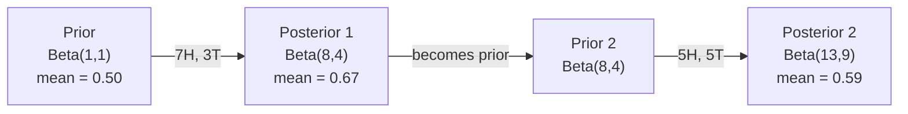

# Định lý Bayes

> Xác suất là về những gì bạn kỳ vọng. Định lý Bayes là về những gì bạn học được.

**Type:** Build
**Language:** Python
**Prerequisites:** Phase 1, Lesson 06 (Probability Fundamentals)
**Time:** ~75 phút

## Mục tiêu học tập

- Áp dụng định lý Bayes để tính xác suất hậu nghiệm (posterior) từ xác suất tiên nghiệm (prior), hàm hợp lý (likelihood) và bằng chứng (evidence)
- Xây dựng bộ phân loại văn bản Naive Bayes từ đầu với Laplace smoothing và tính toán trong không gian log
- So sánh ước lượng MLE và MAP, giải thích cách MAP tương ứng với L2 regularization
- Triển khai cập nhật Bayes tuần tự sử dụng Beta-Binomial conjugate priors cho A/B testing

## Vấn đề

Một xét nghiệm y tế có độ chính xác 99%. Bạn nhận kết quả dương tính. Khả năng bạn thực sự mắc bệnh là bao nhiêu?

Hầu hết mọi người nói 99%. Câu trả lời thực sự phụ thuộc vào độ hiếm của căn bệnh. Nếu 1 trong 10.000 người mắc bệnh, kết quả dương tính chỉ mang lại cho bạn khoảng 1% khả năng bị bệnh. 99% kết quả dương tính còn lại là báo động giả từ những người khỏe mạnh.

Đây không phải là một câu hỏi mẹo. Đây là định lý Bayes. Mọi bộ lọc thư rác, mọi chẩn đoán y tế, mọi mô hình machine learning định lượng sự không chắc chắn đều sử dụng lập luận chính xác này. Bạn bắt đầu với một niềm tin. Bạn thấy bằng chứng. Bạn cập nhật.

Nếu bạn xây dựng các hệ thống ML mà không hiểu điều này, bạn sẽ diễn giải sai kết quả đầu ra của mô hình, thiết lập ngưỡng sai và đưa ra các dự đoán quá tự tin.

## Khái niệm

### Từ xác suất đồng thời đến Bayes

Bạn đã biết từ Bài 06 rằng xác suất có điều kiện là:

```
P(A|B) = P(A and B) / P(B)
```

Và đối xứng:

```
P(B|A) = P(A and B) / P(A)
```

Cả hai biểu thức đều chia sẻ cùng một tử số: P(A và B). Đặt chúng bằng nhau và sắp xếp lại:

```
P(A and B) = P(A|B) * P(B) = P(B|A) * P(A)

Therefore:

P(A|B) = P(B|A) * P(A) / P(B)
```

Đó là định lý Bayes. Bốn đại lượng, một phương trình.

### Bốn thành phần

| Thành phần | Tên gọi | Ý nghĩa |
|------------|---------|---------|
| P(A\|B) | Posterior | Niềm tin cập nhật của bạn về A sau khi thấy bằng chứng B |
| P(B\|A) | Likelihood | Xác suất của bằng chứng B nếu A là đúng |
| P(A) | Prior | Niềm tin của bạn về A trước khi thấy bất kỳ bằng chứng nào |
| P(B) | Evidence | Tổng xác suất thấy B dưới mọi khả năng |

Thành phần bằng chứng P(B) đóng vai trò là bộ chuẩn hóa. Bạn có thể mở rộng nó bằng định luật xác suất tổng quát:

```
P(B) = P(B|A) * P(A) + P(B|not A) * P(not A)
```

### Ví dụ về xét nghiệm y tế

Một căn bệnh ảnh hưởng đến 1 trong 10.000 người. Xét nghiệm chính xác 99% (phát hiện 99% người bệnh, dương tính giả 1% thời gian).

```
P(sick)          = 0.0001     (prior: disease is rare)
P(positive|sick) = 0.99       (likelihood: test catches it)
P(positive|healthy) = 0.01    (false positive rate)

P(positive) = P(positive|sick) * P(sick) + P(positive|healthy) * P(healthy)
            = 0.99 * 0.0001 + 0.01 * 0.9999
            = 0.000099 + 0.009999
            = 0.010098

P(sick|positive) = P(positive|sick) * P(sick) / P(positive)
                 = 0.99 * 0.0001 / 0.010098
                 = 0.0098
                 = 0.98%
```

Dưới 1%. Prior chiếm ưu thế. Khi một tình trạng hiếm gặp, ngay cả các xét nghiệm chính xác cũng tạo ra hầu hết là dương tính giả. Đây là lý do tại sao các bác sĩ yêu cầu xét nghiệm xác nhận.

### Ví dụ về bộ lọc thư rác

Bạn nhận được một email chứa từ "lottery". Đó có phải là thư rác?

```
P(spam)                = 0.3      (30% of email is spam)
P("lottery"|spam)      = 0.05     (5% of spam emails contain "lottery")
P("lottery"|not spam)  = 0.001    (0.1% of legitimate emails contain "lottery")

P("lottery") = 0.05 * 0.3 + 0.001 * 0.7
             = 0.015 + 0.0007
             = 0.0157

P(spam|"lottery") = 0.05 * 0.3 / 0.0157
                  = 0.955
                  = 95.5%
```

Một từ làm thay đổi xác suất từ 30% lên 95,5%. Một bộ lọc thư rác thực tế áp dụng Bayes trên hàng trăm từ cùng một lúc.

### Naive Bayes: giả định độc lập

Naive Bayes mở rộng điều này cho nhiều đặc trưng bằng cách giả định tất cả các đặc trưng là độc lập có điều kiện với lớp:

```
P(class | feature_1, feature_2, ..., feature_n)
  = P(class) * P(feature_1|class) * P(feature_2|class) * ... * P(feature_n|class)
    / P(feature_1, feature_2, ..., feature_n)
```

Phần "naive" (ngây thơ) chính là giả định độc lập. Trong văn bản, sự xuất hiện của các từ không độc lập ("New" và "York" có tương quan). Nhưng giả định này hoạt động hiệu quả một cách đáng ngạc nhiên trong thực tế vì bộ phân loại chỉ cần xếp hạng các lớp, không cần tạo ra các xác suất đã hiệu chuẩn.

Vì mẫu số giống nhau cho tất cả các lớp, bạn có thể bỏ qua nó và chỉ so sánh các tử số:

```
score(class) = P(class) * product of P(feature_i | class)
```

Chọn lớp có điểm số cao nhất.

### Ước lượng hợp lý cực đại (MLE)

Làm thế nào để có được P(đặc trưng|lớp) từ dữ liệu huấn luyện? Đếm.

```
P("free"|spam) = (number of spam emails containing "free") / (total spam emails)
```

Đây là MLE: chọn các giá trị tham số làm cho dữ liệu quan sát được có khả năng xảy ra cao nhất. Bạn đang tối đa hóa hàm hợp lý, đối với các biến đếm rời rạc, nó rút gọn thành tần suất tương đối.

Vấn đề: nếu một từ không bao giờ xuất hiện trong thư rác trong quá trình huấn luyện, MLE cho nó xác suất bằng 0. Một từ chưa từng thấy sẽ làm hỏng toàn bộ sản phẩm. Khắc phục điều này bằng Laplace smoothing:

```
P(word|class) = (count(word, class) + 1) / (total_words_in_class + vocabulary_size)
```

Cộng 1 vào mỗi biến đếm đảm bảo không có xác suất nào bằng 0.

### Maximum a posteriori (MAP)

MLE hỏi: tham số nào tối đa hóa P(dữ liệu|tham số)?

MAP hỏi: tham số nào tối đa hóa P(tham số|dữ liệu)?

Theo định lý Bayes:

```
P(parameters|data) proportional to P(data|parameters) * P(parameters)
```

MAP thêm một prior lên chính các tham số. Nếu bạn tin rằng các tham số nên nhỏ, bạn mã hóa điều đó dưới dạng một prior phạt các giá trị lớn. Điều này giống hệt với L2 regularization trong ML. Hình phạt "ridge" trong hồi quy ridge thực sự là một Gaussian prior trên các trọng số.

| Ước lượng | Tối ưu hóa | Tương đương trong ML |
|-----------|-----------|----------------------|
| MLE | P(dữ liệu\|tham số) | Huấn luyện không điều chuẩn |
| MAP | P(dữ liệu\|tham số) * P(tham số) | L2 / L1 regularization |

### Bayesian vs Frequentist: sự khác biệt thực tế

Frequentist coi các tham số là những ẩn số cố định. Họ hỏi: "Nếu tôi lặp lại thí nghiệm này nhiều lần, điều gì sẽ xảy ra?"

Bayesian coi các tham số là các phân phối. Họ hỏi: "Dựa trên những gì tôi đã quan sát, tôi tin gì về các tham số?"

Để xây dựng hệ thống ML, sự khác biệt thực tế là:

| Khía cạnh | Frequentist | Bayesian |
|-----------|-------------|----------|
| Đầu ra | Ước lượng điểm | Phân phối trên các giá trị |
| Không chắc chắn | Khoảng tin cậy (về quy trình) | Khoảng tin cậy (về tham số) |
| Dữ liệu nhỏ | Có thể quá khớp (overfit) | Prior đóng vai trò điều chuẩn |
| Tính toán | Thường nhanh hơn | Thường yêu cầu lấy mẫu (MCMC) |

Hầu hết ML trong sản xuất là frequentist (SGD, ước lượng điểm). Các phương pháp Bayesian tỏa sáng khi bạn cần sự không chắc chắn đã hiệu chuẩn (quyết định y tế, hệ thống an toàn quan trọng) hoặc khi dữ liệu khan hiếm (few-shot learning, cold start).

### Tại sao tư duy Bayesian quan trọng đối với ML

Mối liên hệ sâu sắc hơn là sự tương tự:

**Priors là regularization.** Một Gaussian prior trên trọng số là L2 regularization. Một Laplace prior là L1. Mỗi khi bạn thêm một thuật ngữ điều chuẩn, bạn đang đưa ra một tuyên bố Bayesian về các giá trị tham số mà bạn kỳ vọng.

**Posteriors là sự không chắc chắn.** Một xác suất dự đoán duy nhất không cho bạn biết gì về mức độ tự tin của mô hình trong ước tính đó. Các phương pháp Bayesian cung cấp cho bạn một phân phối: "Tôi nghĩ P(spam) nằm trong khoảng 0.8 và 0.95."

**Cập nhật Bayes là học trực tuyến (online learning).** Posterior của hôm nay trở thành prior của ngày mai. Khi mô hình của bạn thấy dữ liệu mới, nó cập nhật niềm tin của mình một cách tăng dần thay vì huấn luyện lại từ đầu.

**So sánh mô hình là Bayesian.** Tiêu chí thông tin Bayesian (BIC), marginal likelihood và Bayes factors đều sử dụng lập luận Bayesian để chọn giữa các mô hình mà không bị quá khớp.

```figure
bayes-update
```

## Xây dựng

### Bước 1: Hàm định lý Bayes

```python
def bayes(prior, likelihood, false_positive_rate):
    evidence = likelihood * prior + false_positive_rate * (1 - prior)
    posterior = likelihood * prior / evidence
    return posterior

result = bayes(prior=0.0001, likelihood=0.99, false_positive_rate=0.01)
print(f"P(sick|positive) = {result:.4f}")
```

### Bước 2: Bộ phân loại Naive Bayes

```python
import math
from collections import defaultdict

class NaiveBayes:
    def __init__(self, smoothing=1.0):
        self.smoothing = smoothing
        self.class_counts = defaultdict(int)
        self.word_counts = defaultdict(lambda: defaultdict(int))
        self.class_word_totals = defaultdict(int)
        self.vocab = set()

    def train(self, documents, labels):
        for doc, label in zip(documents, labels):
            self.class_counts[label] += 1
            words = doc.lower().split()
            for word in words:
                self.word_counts[label][word] += 1
                self.class_word_totals[label] += 1
                self.vocab.add(word)

    def predict(self, document):
        words = document.lower().split()
        total_docs = sum(self.class_counts.values())
        vocab_size = len(self.vocab)
        best_class = None
        best_score = float("-inf")
        for cls in self.class_counts:
            score = math.log(self.class_counts[cls] / total_docs)
            for word in words:
                count = self.word_counts[cls].get(word, 0)
                total = self.class_word_totals[cls]
                score += math.log((count + self.smoothing) / (total + self.smoothing * vocab_size))
            if score > best_score:
                best_score = score
                best_class = cls
        return best_class
```

Xác suất log ngăn chặn hiện tượng underflow. Việc nhân nhiều xác suất nhỏ tạo ra các số quá nhỏ đối với dấu phẩy động. Cộng các xác suất log là ổn định về mặt số học và tương đương về mặt toán học.

### Bước 3: Huấn luyện trên dữ liệu thư rác

```python
train_docs = [
    "win free money now",
    "free lottery ticket winner",
    "claim your prize today free",
    "urgent offer free cash",
    "congratulations you won free",
    "meeting tomorrow at noon",
    "project update attached",
    "can we schedule a call",
    "quarterly report review",
    "lunch on thursday sounds good",
    "team standup notes attached",
    "please review the pull request",
]

train_labels = [
    "spam", "spam", "spam", "spam", "spam",
    "ham", "ham", "ham", "ham", "ham", "ham", "ham",
]

classifier = NaiveBayes()
classifier.train(train_docs, train_labels)

test_messages = [
    "free money waiting for you",
    "meeting rescheduled to friday",
    "you won a free prize",
    "please review the attached report",
]

for msg in test_messages:
    print(f"  '{msg}' -> {classifier.predict(msg)}")
```

### Bước 4: Kiểm tra các xác suất đã học

```python
def show_top_words(classifier, cls, n=5):
    vocab_size = len(classifier.vocab)
    total = classifier.class_word_totals[cls]
    probs = {}
    for word in classifier.vocab:
        count = classifier.word_counts[cls].get(word, 0)
        probs[word] = (count + classifier.smoothing) / (total + classifier.smoothing * vocab_size)
    sorted_words = sorted(probs.items(), key=lambda x: x[1], reverse=True)
    for word, prob in sorted_words[:n]:
        print(f"    {word}: {prob:.4f}")

print("\nTop spam words:")
show_top_words(classifier, "spam")
print("\nTop ham words:")
show_top_words(classifier, "ham")
```

## Sử dụng

Scikit-learn cung cấp các triển khai naive Bayes sẵn sàng cho sản xuất:

```python
from sklearn.feature_extraction.text import CountVectorizer
from sklearn.naive_bayes import MultinomialNB
from sklearn.metrics import classification_report

vectorizer = CountVectorizer()
X_train = vectorizer.fit_transform(train_docs)
clf = MultinomialNB()
clf.fit(X_train, train_labels)

X_test = vectorizer.transform(test_messages)
predictions = clf.predict(X_test)
for msg, pred in zip(test_messages, predictions):
    print(f"  '{msg}' -> {pred}")
```

Cùng một thuật toán. CountVectorizer xử lý việc tách từ và xây dựng từ vựng. MultinomialNB xử lý smoothing và xác suất log nội bộ. Phiên bản tự viết của bạn thực hiện điều tương tự trong 40 dòng.

## Triển khai

Lớp NaiveBayes được xây dựng ở đây thể hiện toàn bộ quy trình: tách từ, ước lượng xác suất với Laplace smoothing, dự đoán trong không gian log. Mã trong `code/bayes.py` chạy từ đầu đến cuối mà không có phụ thuộc nào ngoài thư viện tiêu chuẩn của Python.

### Conjugate Priors

Khi prior và posterior thuộc cùng một họ phân phối, prior được gọi là "conjugate". Điều này làm cho việc cập nhật Bayesian trở nên sạch sẽ về mặt đại số -- bạn có được một posterior dạng đóng mà không cần tích phân số.

| Likelihood | Conjugate Prior | Posterior | Ví dụ |
|------------|-----------------|-----------|---------|
| Bernoulli | Beta(a, b) | Beta(a + thành công, b + thất bại) | Ước lượng độ lệch tung đồng xu |
| Normal (biết phương sai) | Normal(mu_0, sigma_0) | Normal(trung bình trọng số, phương sai nhỏ hơn) | Hiệu chuẩn cảm biến |
| Poisson | Gamma(a, b) | Gamma(a + tổng biến đếm, b + n) | Mô hình hóa tỷ lệ đến |
| Multinomial | Dirichlet(alpha) | Dirichlet(alpha + biến đếm) | Mô hình hóa chủ đề, mô hình ngôn ngữ |

Tại sao điều này quan trọng: nếu không có conjugate priors, bạn cần lấy mẫu Monte Carlo hoặc suy luận biến phân để xấp xỉ posterior. Với conjugate priors, bạn chỉ cần cập nhật hai con số.

Phân phối Beta là conjugate prior phổ biến nhất trong thực tế. Beta(a, b) đại diện cho niềm tin của bạn về một tham số xác suất. Trung bình là a/(a+b). a+b càng lớn, phân phối càng tập trung (tự tin).

Các trường hợp đặc biệt của Beta prior:
- Beta(1, 1) = đồng nhất. Bạn không có ý kiến về tham số.
- Beta(10, 10) = đỉnh tại 0.5. Bạn tin mạnh mẽ rằng tham số gần 0.5.
- Beta(1, 10) = lệch về 0. Bạn tin rằng tham số nhỏ.

Quy tắc cập nhật rất đơn giản:

```
Prior:     Beta(a, b)
Data:      s successes, f failures
Posterior: Beta(a + s, b + f)
```

Không tích phân. Không lấy mẫu. Chỉ là phép cộng.

### Cập nhật Bayes tuần tự

Suy luận Bayesian mang tính tuần tự tự nhiên. Posterior của hôm nay trở thành prior của ngày mai. Đây là cách các hệ thống thực tế học tăng dần mà không cần xử lý lại tất cả dữ liệu lịch sử.

Ví dụ cụ thể: ước tính xem một đồng xu có công bằng không.

**Ngày 1: Chưa có dữ liệu.**
Bắt đầu với Beta(1, 1) -- một prior đồng nhất. Bạn không có ý kiến.
- Trung bình prior: 0.5
- Prior phẳng trên [0, 1]

**Ngày 2: Quan sát 7 mặt ngửa, 3 mặt sấp.**
Posterior = Beta(1 + 7, 1 + 3) = Beta(8, 4)
- Trung bình posterior: 8/12 = 0.667
- Bằng chứng cho thấy đồng xu bị lệch về phía mặt ngửa

**Ngày 3: Quan sát thêm 5 mặt ngửa, 5 mặt sấp.**
Sử dụng posterior của ngày hôm qua làm prior của ngày hôm nay.
Posterior = Beta(8 + 5, 4 + 5) = Beta(13, 9)
- Trung bình posterior: 13/22 = 0.591
- Dữ liệu mới cân bằng đã kéo ước tính trở lại gần 0.5



Thứ tự quan sát không quan trọng. Beta(1,1) cập nhật với tất cả 12 mặt ngửa và 8 mặt sấp cùng một lúc cho ra Beta(13, 9) -- kết quả tương tự. Cập nhật tuần tự và cập nhật theo lô tương đương về mặt toán học. Nhưng cập nhật tuần tự cho phép bạn đưa ra quyết định ở mỗi bước mà không cần lưu trữ dữ liệu thô.

Đây là nền tảng của học trực tuyến trong các hệ thống ML sản xuất. Thompson sampling cho bandits, hệ thống gợi ý tăng dần và máy dò bất thường trực tuyến đều sử dụng mô hình này.

### Kết nối với A/B Testing

A/B testing là suy luận Bayesian được ngụy trang.

Thiết lập: bạn đang thử nghiệm hai màu nút. Biến thể A (xanh dương) và biến thể B (xanh lá). Bạn muốn biết cái nào nhận được nhiều lượt nhấp hơn.

Kiểm tra A/B Bayesian:

1. **Prior.** Bắt đầu với Beta(1, 1) cho cả hai biến thể. Không có ưu tiên trước.
2. **Dữ liệu.** Biến thể A: 50 nhấp trên 1000 lượt xem. Biến thể B: 65 nhấp trên 1000 lượt xem.
3. **Posteriors.**
   - A: Beta(1 + 50, 1 + 950) = Beta(51, 951). Trung bình = 0.051
   - B: Beta(1 + 65, 1 + 935) = Beta(66, 936). Trung bình = 0.066
4. **Quyết định.** Tính P(B > A) -- xác suất tỷ lệ chuyển đổi thực sự của B cao hơn của A.

Tính toán P(B > A) theo giải tích rất khó. Nhưng Monte Carlo làm cho nó trở nên tầm thường:

```
1. Draw 100,000 samples from Beta(51, 951)  -> samples_A
2. Draw 100,000 samples from Beta(66, 936)  -> samples_B
3. P(B > A) = fraction of samples where B > A
```

Nếu P(B > A) > 0.95, bạn triển khai biến thể B. Nếu nó nằm trong khoảng 0.05 và 0.95, bạn tiếp tục thu thập dữ liệu. Nếu P(B > A) < 0.05, bạn triển khai biến thể A.

Ưu điểm so với A/B testing frequentist:
- Bạn nhận được một tuyên bố xác suất trực tiếp: "có 97% khả năng B tốt hơn"
- Không gây nhầm lẫn p-value. Không có sự rào đón "không bác bỏ được giả thuyết không".
- Bạn có thể kiểm tra kết quả bất cứ lúc nào mà không làm tăng tỷ lệ dương tính giả (không có "vấn đề nhìn trộm")
- Bạn có thể kết hợp kiến thức trước đó (ví dụ: các thử nghiệm trước cho thấy tỷ lệ chuyển đổi thường là 3-8%)

| Khía cạnh | Frequentist A/B | Bayesian A/B |
|-----------|-----------------|--------------|
| Đầu ra | p-value | P(B > A) |
| Diễn giải | "Dữ liệu này đáng ngạc nhiên đến mức nào nếu A=B?" | "Khả năng B tốt hơn A là bao nhiêu?" |
| Dừng sớm | Làm tăng dương tính giả | An toàn tại bất kỳ thời điểm nào |
| Kiến thức trước | Không được sử dụng | Được mã hóa dưới dạng Beta prior |
| Quy tắc quyết định | p < 0.05 | P(B > A) > ngưỡng |

## Bài tập

1. **Nhiều xét nghiệm.** Một bệnh nhân xét nghiệm dương tính hai lần trên các xét nghiệm độc lập (cả hai chính xác 99%, tỷ lệ mắc bệnh 1 trong 10.000). P(bệnh) sau cả hai xét nghiệm là bao nhiêu? Sử dụng posterior từ xét nghiệm đầu tiên làm prior cho xét nghiệm thứ hai.

2. **Tác động của smoothing.** Chạy bộ phân loại thư rác với các giá trị smoothing là 0.01, 0.1, 1.0 và 10.0. Các xác suất từ hàng đầu thay đổi như thế nào? Điều gì xảy ra với smoothing=0 và một từ chỉ xuất hiện trong thư thường (ham)?

3. **Thêm đặc trưng.** Mở rộng lớp NaiveBayes để sử dụng thêm độ dài tin nhắn (ngắn/dài) làm đặc trưng bên cạnh số lượng từ. Ước tính P(ngắn|spam) và P(ngắn|ham) từ dữ liệu huấn luyện và đưa nó vào điểm dự đoán.

4. **MAP bằng tay.** Với dữ liệu quan sát được (7 mặt ngửa trong 10 lần tung đồng xu), hãy tính ước lượng MAP của độ lệch sử dụng Beta(2,2) prior. So sánh nó với ước lượng MLE (7/10).

## Thuật ngữ chính

| Thuật ngữ | Mọi người nói | Ý nghĩa thực sự |
|-----------|---------------|-----------------|
| Prior | "Dự đoán ban đầu của tôi" | P(giả thuyết) trước khi quan sát bằng chứng. Trong ML: thuật ngữ điều chuẩn. |
| Likelihood | "Dữ liệu khớp tốt đến mức nào" | P(bằng chứng\|giả thuyết). Xác suất của dữ liệu quan sát được dưới một giả thuyết cụ thể. |
| Posterior | "Niềm tin cập nhật của tôi" | P(giả thuyết\|bằng chứng). Prior nhân với likelihood, sau đó được chuẩn hóa. |
| Evidence | "Hằng số chuẩn hóa" | P(dữ liệu) trên tất cả các giả thuyết. Đảm bảo posterior tổng bằng 1. |
| Naive Bayes | "Bộ phân loại văn bản đơn giản đó" | Một bộ phân loại giả định các đặc trưng là độc lập với lớp. Hoạt động tốt bất chấp giả định sai. |
| Laplace smoothing | "Add-one smoothing" | Thêm một biến đếm nhỏ vào mỗi đặc trưng để ngăn xác suất bằng 0 từ dữ liệu chưa thấy. |
| MLE | "Chỉ cần sử dụng tần suất" | Chọn các tham số tối đa hóa P(dữ liệu\|tham số). Không có prior. Có thể quá khớp với dữ liệu nhỏ. |
| MAP | "MLE với một prior" | Chọn các tham số tối đa hóa P(dữ liệu\|tham số) * P(tham số). Tương đương với MLE có điều chuẩn. |
| Log-probability | "Làm việc trong không gian log" | Sử dụng log(P) thay vì P để tránh underflow dấu phẩy động khi nhân nhiều số nhỏ. |
| False positive | "Một báo động sai" | Xét nghiệm cho kết quả dương tính, nhưng trạng thái thực sự là âm tính. Dẫn đến ngụy biện tỷ lệ cơ bản. |

## Đọc thêm

- [3Blue1Brown: Định lý Bayes](https://www.youtube.com/watch?v=HZGCoVF3YvM) - giải thích trực quan với ví dụ xét nghiệm y tế
- [Stanford CS229: Thuật toán học tạo sinh](https://cs229.stanford.edu/notes2022fall/cs229-notes2.pdf) - naive Bayes và mối liên hệ của nó với các mô hình phân biệt
- [Think Bayes](https://greenteapress.com/wp/think-bayes/) - sách miễn phí, thống kê Bayesian với mã Python
- [scikit-learn Naive Bayes](https://scikit-learn.org/stable/modules/naive_bayes.html) - các triển khai sản xuất và khi nào nên sử dụng từng biến thể