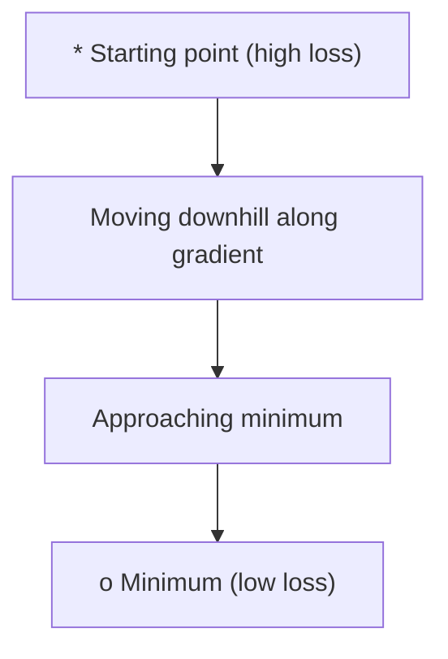
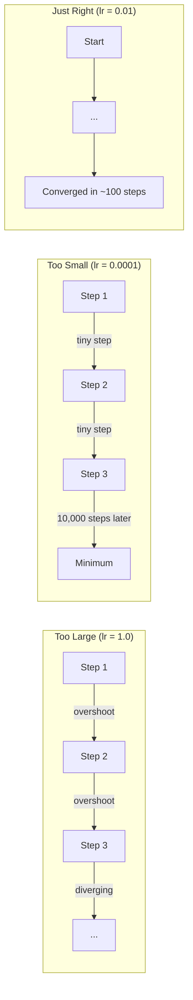
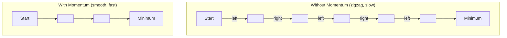
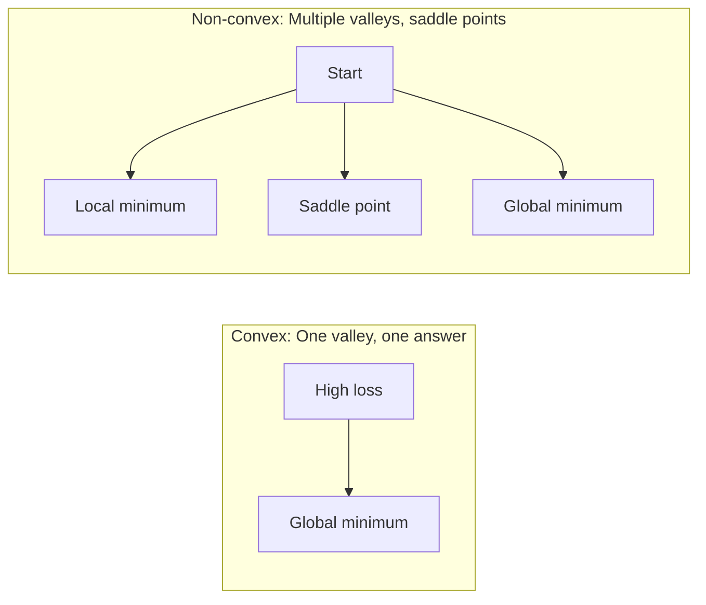
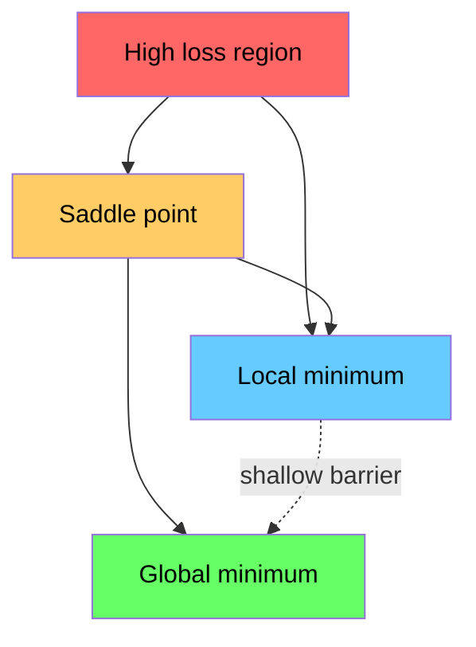

# Optimization

> Huấn luyện một mạng nơ-ron không gì khác hơn là việc tìm ra đáy của một thung lũng.

**Type:** Build
**Language:** Python
**Prerequisites:** Phase 1, Lessons 04-05 (Derivatives, Gradients)
**Time:** ~75 minutes

## Learning Objectives

- Triển khai vanilla gradient descent, SGD với momentum, và Adam từ đầu
- So sánh sự hội tụ của các bộ tối ưu hóa trên hàm Rosenbrock và giải thích tại sao Adam điều chỉnh learning rate cho từng trọng số
- Phân biệt loss landscape lồi (convex) và không lồi (non-convex) và giải thích vai trò của các điểm yên ngựa (saddle points) trong không gian nhiều chiều
- Cấu hình các learning rate schedule (step decay, cosine annealing, warmup) để ổn định quá trình huấn luyện

## The Problem

Bạn có một hàm loss. Nó cho bạn biết mô hình của bạn sai lệch bao nhiêu. Bạn có các gradient. Chúng cho bạn biết hướng nào làm cho loss tệ hơn. Bây giờ bạn cần một chiến lược để đi xuống dốc.

Cách tiếp cận ngây thơ rất đơn giản: di chuyển ngược hướng gradient. Thay đổi kích thước bước đi bằng một con số gọi là learning rate. Lặp lại. Đây là gradient descent, và nó hoạt động. Nhưng "hoạt động" đi kèm với những lưu ý. Learning rate quá lớn và bạn sẽ nhảy vọt qua thung lũng hoàn toàn, va đập giữa các vách tường. Quá nhỏ và bạn sẽ bò về phía đáp án qua hàng ngàn bước không cần thiết. Gặp một điểm yên ngựa (saddle point) và bạn sẽ ngừng di chuyển ngay cả khi chưa tìm thấy cực tiểu.

Mọi bộ tối ưu hóa (optimizer) trong deep learning đều là câu trả lời cho cùng một câu hỏi: làm thế nào để xuống đáy thung lũng nhanh hơn và đáng tin cậy hơn?

## The Concept

### What optimization means

Tối ưu hóa là tìm các giá trị đầu vào giúp cực tiểu hóa (hoặc cực đại hóa) một hàm số. Trong machine learning, hàm đó là loss. Đầu vào là các trọng số (weights) của mô hình. Huấn luyện chính là tối ưu hóa.

```
minimize L(w) where:
  L = loss function
  w = model weights (could be millions of parameters)
```

### Gradient descent (vanilla)

Bộ tối ưu hóa đơn giản nhất. Tính gradient của loss đối với mọi trọng số. Di chuyển mỗi trọng số theo hướng ngược lại với gradient của nó. Tỉ lệ hóa bước đi bằng learning rate.

```
w = w - lr * gradient
```

Đó là toàn bộ thuật toán. Chỉ một dòng duy nhất.



### Learning rate: the most important hyperparameter

Learning rate kiểm soát kích thước bước đi (step size). Nó quyết định mọi thứ về sự hội tụ.



Không có công thức nào cho learning rate đúng. Bạn tìm thấy nó bằng thực nghiệm. Các điểm bắt đầu phổ biến: 0.001 cho Adam, 0.01 cho SGD với momentum.

### SGD vs batch vs mini-batch

Vanilla gradient descent tính gradient trên toàn bộ tập dữ liệu trước khi thực hiện một bước. Đây gọi là batch gradient descent. Nó ổn định nhưng chậm.

Stochastic gradient descent (SGD) tính gradient trên một mẫu ngẫu nhiên duy nhất và thực hiện bước đi ngay lập tức. Nó nhiễu nhưng nhanh.

Mini-batch gradient descent dung hòa cả hai. Tính gradient trên một batch nhỏ (32, 64, 128, 256 mẫu), sau đó thực hiện bước đi. Đây là thứ mà mọi người thực sự sử dụng.

| Biến thể | Kích thước batch | Chất lượng gradient | Tốc độ mỗi bước | Nhiễu |
|---------|-----------|-----------------|---------------|-------|
| Batch GD | Toàn bộ tập dữ liệu | Chính xác | Chậm | Không |
| SGD | 1 mẫu | Rất nhiễu | Nhanh | Cao |
| Mini-batch | 32-256 | Ước lượng tốt | Cân bằng | Trung bình |

Nhiễu trong SGD và mini-batch không phải là một lỗi. Nó giúp thoát khỏi các cực tiểu địa phương nông và các điểm yên ngựa.

### Momentum: the ball rolling downhill

Vanilla gradient descent chỉ nhìn vào gradient hiện tại. Nếu gradient ngoằn ngoèo (thường thấy trong các thung lũng hẹp), tiến độ sẽ chậm. Momentum khắc phục điều này bằng cách tích lũy các gradient trong quá khứ vào một số hạng vận tốc (velocity).

```
v = beta * v + gradient
w = w - lr * v
```

Phép ẩn dụ: một quả bóng lăn xuống dốc. Nó không dừng lại và bắt đầu lại ở mỗi chỗ xóc. Nó tích lũy tốc độ theo các hướng nhất quán và làm giảm các dao động.



`beta` (thường là 0.9) kiểm soát lượng lịch sử cần giữ lại. Beta cao hơn nghĩa là momentum nhiều hơn, đường đi mượt hơn, nhưng phản ứng chậm hơn với các thay đổi hướng.

### Adam: adaptive learning rates

Các trọng số khác nhau cần các learning rate khác nhau. Một trọng số hiếm khi nhận được gradient lớn nên thực hiện các bước lớn hơn khi cuối cùng nó nhận được. Một trọng số liên tục nhận được gradient khổng lồ nên thực hiện các bước nhỏ hơn.

Adam (Adaptive Moment Estimation) theo dõi hai thứ cho mỗi trọng số:

1. Moment thứ nhất (m): trung bình trượt của các gradient (giống momentum)
2. Moment thứ hai (v): trung bình trượt của bình phương các gradient (độ lớn gradient)

```
m = beta1 * m + (1 - beta1) * gradient
v = beta2 * v + (1 - beta2) * gradient^2

m_hat = m / (1 - beta1^t)    bias correction
v_hat = v / (1 - beta2^t)    bias correction

w = w - lr * m_hat / (sqrt(v_hat) + epsilon)
```

Việc chia cho `sqrt(v_hat)` là điểm mấu chốt. Các trọng số có gradient lớn sẽ bị chia cho một số lớn (bước đi hiệu dụng nhỏ). Các trọng số có gradient nhỏ sẽ bị chia cho một số nhỏ (bước đi hiệu dụng lớn). Mỗi trọng số có learning rate thích ứng riêng.

Các siêu tham số mặc định: `lr=0.001, beta1=0.9, beta2=0.999, epsilon=1e-8`. Các giá trị mặc định này hoạt động tốt cho hầu hết các bài toán.

### Learning rate schedules

Một learning rate cố định là một sự thỏa hiệp. Giai đoạn đầu huấn luyện, bạn muốn các bước lớn để tiến triển nhanh. Giai đoạn cuối huấn luyện, bạn muốn các bước nhỏ để tinh chỉnh gần điểm cực tiểu.

Các lịch trình phổ biến:

| Lịch trình | Công thức | Trường hợp sử dụng |
|----------|---------|----------|
| Step decay | lr = lr * factor sau mỗi N epoch | Đơn giản, kiểm soát thủ công |
| Exponential decay | lr = lr_0 * decay^t | Giảm mượt mà |
| Cosine annealing | lr = lr_min + 0.5 * (lr_max - lr_min) * (1 + cos(pi * t / T)) | Transformers, huấn luyện hiện đại |
| Warmup + decay | Tăng tuyến tính, sau đó giảm dần | Các mô hình lớn, ngăn chặn sự mất ổn định ban đầu |

### Convex vs non-convex

Một hàm lồi (convex) có một điểm cực tiểu. Gradient descent luôn tìm thấy nó. Một hàm bậc hai như `f(x) = x^2` là hàm lồi.

Các hàm loss của mạng nơ-ron là không lồi (non-convex). Chúng có nhiều cực tiểu địa phương (local minima), điểm yên ngựa (saddle points), và các vùng phẳng.



Trong thực tế, các cực tiểu địa phương trong mạng nơ-ron nhiều chiều hiếm khi là vấn đề. Hầu hết các cực tiểu địa phương có giá trị loss gần với cực tiểu toàn cục. Các điểm yên ngựa (phẳng theo một số hướng, cong theo các hướng khác) mới là trở ngại thực sự. Momentum và nhiễu từ mini-batch giúp thoát khỏi chúng.

### Loss landscape visualization

Loss là một hàm của tất cả các trọng số. Đối với một mô hình có 1 triệu trọng số, loss landscape nằm trong không gian 1.000.001 chiều. Chúng ta hình dung nó bằng cách chọn hai hướng ngẫu nhiên trong không gian trọng số và vẽ biểu đồ loss dọc theo các hướng đó, tạo ra một bề mặt 2D.



Các cực tiểu nhọn (sharp minima) tổng quát hóa kém. Các cực tiểu phẳng (flat minima) tổng quát hóa tốt. Đây là một lý do tại sao SGD với momentum thường vượt trội hơn Adam về độ chính xác cuối cùng trên tập test: nhiễu của nó ngăn việc rơi vào các cực tiểu nhọn.

```figure
gradient-descent
```

## Build It

### Step 1: Define a test function

Hàm Rosenbrock là một benchmark tối ưu hóa kinh điển. Cực tiểu của nó nằm tại (1, 1) bên trong một thung lũng cong hẹp, dễ tìm thấy nhưng khó đi theo.

```
f(x, y) = (1 - x)^2 + 100 * (y - x^2)^2
```

```python
def rosenbrock(params):
    x, y = params
    return (1 - x) ** 2 + 100 * (y - x ** 2) ** 2

def rosenbrock_gradient(params):
    x, y = params
    df_dx = -2 * (1 - x) + 200 * (y - x ** 2) * (-2 * x)
    df_dy = 200 * (y - x ** 2)
    return [df_dx, df_dy]
```

### Step 2: Vanilla gradient descent

```python
class GradientDescent:
    def __init__(self, lr=0.001):
        self.lr = lr

    def step(self, params, grads):
        return [p - self.lr * g for p, g in zip(params, grads)]
```

### Step 3: SGD with momentum

```python
class SGDMomentum:
    def __init__(self, lr=0.001, momentum=0.9):
        self.lr = lr
        self.momentum = momentum
        self.velocity = None

    def step(self, params, grads):
        if self.velocity is None:
            self.velocity = [0.0] * len(params)
        self.velocity = [
            self.momentum * v + g
            for v, g in zip(self.velocity, grads)
        ]
        return [p - self.lr * v for p, v in zip(params, self.velocity)]
```

### Step 4: Adam

```python
class Adam:
    def __init__(self, lr=0.001, beta1=0.9, beta2=0.999, epsilon=1e-8):
        self.lr = lr
        self.beta1 = beta1
        self.beta2 = beta2
        self.epsilon = epsilon
        self.m = None
        self.v = None
        self.t = 0

    def step(self, params, grads):
        if self.m is None:
            self.m = [0.0] * len(params)
            self.v = [0.0] * len(params)

        self.t += 1

        self.m = [
            self.beta1 * m + (1 - self.beta1) * g
            for m, g in zip(self.m, grads)
        ]
        self.v = [
            self.beta2 * v + (1 - self.beta2) * g ** 2
            for v, g in zip(self.v, grads)
        ]

        m_hat = [m / (1 - self.beta1 ** self.t) for m in self.m]
        v_hat = [v / (1 - self.beta2 ** self.t) for v in self.v]

        return [
            p - self.lr * mh / (vh ** 0.5 + self.epsilon)
            for p, mh, vh in zip(params, m_hat, v_hat)
        ]
```

### Step 5: Run and compare

```python
def optimize(optimizer, func, grad_func, start, steps=5000):
    params = list(start)
    history = [params[:]]
    for _ in range(steps):
        grads = grad_func(params)
        params = optimizer.step(params, grads)
        history.append(params[:])
    return history

start = [-1.0, 1.0]

gd_history = optimize(GradientDescent(lr=0.0005), rosenbrock, rosenbrock_gradient, start)
sgd_history = optimize(SGDMomentum(lr=0.0001, momentum=0.9), rosenbrock, rosenbrock_gradient, start)
adam_history = optimize(Adam(lr=0.01), rosenbrock, rosenbrock_gradient, start)

for name, history in [("GD", gd_history), ("SGD+M", sgd_history), ("Adam", adam_history)]:
    final = history[-1]
    loss = rosenbrock(final)
    print(f"{name:6s} -> x={final[0]:.6f}, y={final[1]:.6f}, loss={loss:.8f}")
```

Kết quả mong đợi: Adam hội tụ nhanh nhất. SGD với momentum đi theo một lộ trình mượt mà hơn. Vanilla GD tiến triển chậm dọc theo thung lũng hẹp.

## Use It

Trong thực tế, hãy sử dụng các bộ tối ưu hóa của PyTorch hoặc JAX. Chúng xử lý các nhóm tham số (parameter groups), weight decay, gradient clipping, và tăng tốc GPU.

```python
import torch

model = torch.nn.Linear(784, 10)

sgd = torch.optim.SGD(model.parameters(), lr=0.01, momentum=0.9)
adam = torch.optim.Adam(model.parameters(), lr=0.001)
adamw = torch.optim.AdamW(model.parameters(), lr=0.001, weight_decay=0.01)

scheduler = torch.optim.lr_scheduler.CosineAnnealingLR(adam, T_max=100)
```

Quy tắc ngón tay cái:

- Bắt đầu với Adam (lr=0.001). Nó hoạt động cho hầu hết các bài toán mà không cần tinh chỉnh.
- Chuyển sang SGD với momentum (lr=0.01, momentum=0.9) khi bạn cần độ chính xác cuối cùng tốt nhất và có thể dành thời gian tinh chỉnh nhiều hơn.
- Sử dụng AdamW (Adam với weight decay tách biệt) cho các transformer.
- Luôn sử dụng learning rate schedule cho các lượt huấn luyện dài hơn vài epoch.
- Nếu huấn luyện không ổn định, hãy giảm learning rate. Nếu huấn luyện quá chậm, hãy tăng nó.

## Ship It

Bài học này tạo ra một gợi ý (prompt) để chọn bộ tối ưu hóa phù hợp. Xem `outputs/prompt-optimizer-guide.md`.

Các lớp optimizer được xây dựng ở đây sẽ xuất hiện lại trong Phase 3 khi chúng ta huấn luyện một mạng nơ-ron từ đầu.

## Exercises

1. **Learning rate sweep.** Chạy vanilla gradient descent trên hàm Rosenbrock với các learning rate [0.0001, 0.0005, 0.001, 0.005, 0.01]. Vẽ biểu đồ hoặc in ra loss cuối cùng sau 5000 bước cho mỗi loại. Tìm learning rate lớn nhất mà vẫn hội tụ.

2. **Momentum comparison.** Chạy SGD với các giá trị momentum [0.0, 0.5, 0.9, 0.99] trên hàm Rosenbrock. Theo dõi loss tại mỗi bước. Giá trị momentum nào hội tụ nhanh nhất? Giá trị nào bị vọt quá (overshoot)?

3. **Saddle point escape.** Định nghĩa hàm `f(x, y) = x^2 - y^2` (một điểm yên ngựa tại gốc tọa độ). Bắt đầu tại (0.01, 0.01). So sánh hành vi của vanilla GD, SGD với momentum, và Adam. Cái nào thoát khỏi điểm yên ngựa?

4. **Implement learning rate decay.** Thêm một lịch trình giảm theo hàm mũ (exponential decay schedule) vào lớp GradientDescent: `lr = lr_0 * 0.999^step`. So sánh sự hội tụ khi có và không có decay trên hàm Rosenbrock.

## Key Terms

| Thuật ngữ | Mọi người thường nói | Ý nghĩa thực sự |
|------|----------------|----------------------|
| Gradient descent | "Đi xuống dốc" | Cập nhật trọng số bằng cách trừ đi gradient đã được tỉ lệ hóa bởi learning rate. Bộ tối ưu hóa cơ bản nhất. |
| Learning rate | "Kích thước bước đi" | Một đại lượng vô hướng kiểm soát khoảng cách mỗi lần cập nhật di chuyển các trọng số. Quá lớn gây ra phân kỳ. Quá nhỏ gây lãng phí tính toán. |
| Momentum | "Giữ đà lăn" | Tích lũy các gradient trong quá khứ vào một vector vận tốc. Làm giảm dao động và tăng tốc di chuyển theo các hướng nhất quán. |
| SGD | "Lấy mẫu ngẫu nhiên" | Stochastic gradient descent. Tính gradient trên một tập con ngẫu nhiên thay vì toàn bộ tập dữ liệu. Trong thực tế hầu như luôn có nghĩa là mini-batch SGD. |
| Mini-batch | "Một mẩu dữ liệu" | Một tập con nhỏ của dữ liệu huấn luyện (32-256 mẫu) được sử dụng để ước lượng gradient. Cân bằng giữa tốc độ và độ chính xác của gradient. |
| Adam | "Bộ tối ưu hóa mặc định" | Adaptive Moment Estimation. Theo dõi trung bình trượt của gradient và bình phương gradient cho từng trọng số để cung cấp cho mỗi trọng số một learning rate riêng. |
| Bias correction | "Sửa lỗi khởi động lạnh" | Các moment thứ nhất và thứ hai của Adam được khởi tạo bằng không. Bias correction chia cho (1 - beta^t) để bù đắp trong các bước đầu tiên. |
| Learning rate schedule | "Thay đổi lr theo thời gian" | Một hàm điều chỉnh learning rate trong quá trình huấn luyện. Bước lớn lúc đầu, bước nhỏ lúc sau. |
| Convex function | "Một thung lũng" | Một hàm số mà bất kỳ cực tiểu địa phương nào cũng là cực tiểu toàn cục. Gradient descent luôn tìm thấy nó. Loss của mạng nơ-ron không phải là hàm lồi. |
| Saddle point | "Phẳng nhưng không phải cực tiểu" | Một điểm mà gradient bằng không nhưng nó là cực tiểu theo một số hướng và là cực đại theo các hướng khác. Phổ biến trong không gian nhiều chiều. |
| Loss landscape | "Địa hình" | Hàm loss được vẽ trên không gian trọng số. Được hình dung bằng cách cắt dọc theo hai hướng ngẫu nhiên. |
| Convergence | "Đến nơi" | Bộ tối ưu hóa đã đạt đến điểm mà các bước tiếp theo không làm giảm loss một cách đáng kể. |

## Further Reading

- [Sebastian Ruder: An overview of gradient descent optimization algorithms](https://ruder.io/optimizing-gradient-descent/) - khảo sát toàn diện về tất cả các bộ tối ưu hóa chính
- [Why Momentum Really Works (Distill)](https://distill.pub/2017/momentum/) - hình ảnh hóa tương tác về động lực học của momentum
- [Adam: A Method for Stochastic Optimization (Kingma & Ba, 2014)](https://arxiv.org/abs/1412.6980) - bài báo gốc về Adam, dễ đọc và ngắn gọn
- [Visualizing the Loss Landscape of Neural Nets (Li et al., 2018)](https://arxiv.org/abs/1712.09913) - bài báo chỉ ra sự khác biệt giữa cực tiểu nhọn và cực tiểu phẳng