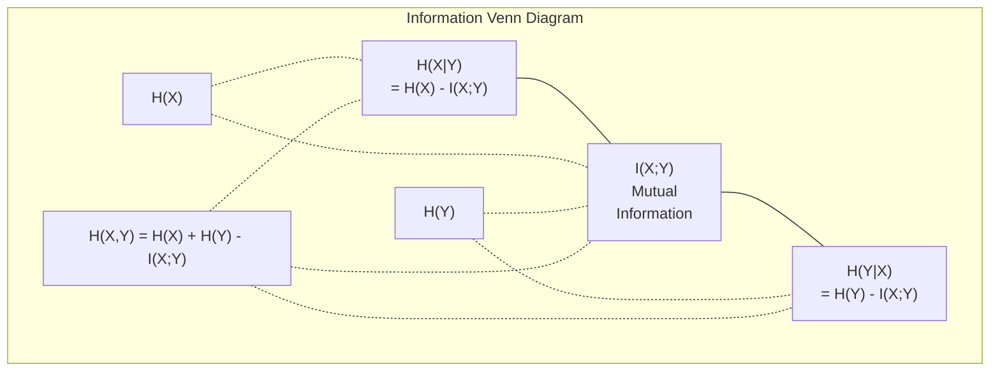

# Lý thuyết Thông tin

> Lý thuyết thông tin đo lường sự bất ngờ. Các hàm mất mát được xây dựng dựa trên nó.

**Type:** Learn
**Language:** Python
**Prerequisites:** Phase 1, Lesson 06 (Probability)
**Time:** ~60 phút

## Mục tiêu học tập

- Tính toán entropy, cross-entropy, và KL divergence từ đầu và giải thích mối quan hệ giữa chúng
- Suy luận tại sao việc tối thiểu hóa hàm mất mát cross-entropy tương đương với việc tối đa hóa log-likelihood
- Tính toán mutual information giữa các đặc trưng (features) và mục tiêu (target) để xếp hạng tầm quan trọng của đặc trưng
- Giải thích perplexity như là kích thước từ vựng hiệu dụng mà một mô hình ngôn ngữ lựa chọn

## Vấn đề

Bạn gọi `CrossEntropyLoss()` trong mọi mô hình phân loại mà bạn huấn luyện. Bạn thấy "perplexity" trong mọi bài báo về mô hình ngôn ngữ. Bạn đọc về KL divergence trong VAEs, distillation, và RLHF. Đây không phải là những khái niệm rời rạc. Chúng đều là cùng một ý tưởng nhưng dưới những hình thức khác nhau.

Lý thuyết thông tin cung cấp cho bạn ngôn ngữ để lập luận về sự không chắc chắn (uncertainty), nén dữ liệu (compression), và dự đoán. Claude Shannon đã phát minh ra nó vào năm 1948 để giải quyết các vấn đề truyền thông. Hóa ra, huấn luyện một mạng thần kinh cũng là một bài toán truyền thông: mô hình đang cố gắng truyền tải nhãn đúng thông qua một kênh nhiễu của các trọng số đã học.

Bài học này xây dựng mọi công thức từ đầu để bạn thấy chúng đến từ đâu và tại sao chúng hoạt động.

## Khái niệm

### Nội dung thông tin (Sự bất ngờ)

Khi một điều gì đó ít có khả năng xảy ra, nó mang lại nhiều thông tin hơn. Một đồng xu rơi vào mặt ngửa? Không bất ngờ. Trúng số? Rất bất ngờ.

Nội dung thông tin của một sự kiện với xác suất p là:

```
I(x) = -log(p(x))
```

Sử dụng log cơ số 2 cho bạn đơn vị bits. Sử dụng log tự nhiên cho bạn nats. Cùng một ý tưởng, chỉ khác đơn vị.

```
Event              Probability    Surprise (bits)
Fair coin heads    0.5            1.0
Rolling a 6        0.167          2.58
1-in-1000 event    0.001          9.97
Certain event      1.0            0.0
```

Các sự kiện chắc chắn xảy ra mang nội dung thông tin bằng không. Bạn đã biết trước là chúng sẽ xảy ra rồi.

### Entropy (Sự bất ngờ trung bình)

Entropy là giá trị kỳ vọng của sự bất ngờ trên tất cả các kết quả có thể xảy ra của một phân phối.

```
H(P) = -sum( p(x) * log(p(x)) )  for all x
```

Một đồng xu đồng chất có entropy tối đa cho một biến nhị phân: 1 bit. Một đồng xu bị lệch (99% mặt ngửa) có entropy thấp: 0.08 bits. Bạn đã biết điều gì sẽ xảy ra, vì vậy mỗi lần tung hầu như không cho bạn biết thêm điều gì.

```
Fair coin:    H = -(0.5 * log2(0.5) + 0.5 * log2(0.5)) = 1.0 bit
Biased coin:  H = -(0.99 * log2(0.99) + 0.01 * log2(0.01)) = 0.08 bits
```

Entropy đo lường sự không chắc chắn không thể giảm bớt (irreducible uncertainty) trong một phân phối. Bạn không thể nén dữ liệu xuống dưới mức này.

### Cross-Entropy (Hàm mất mát bạn sử dụng hàng ngày)

Cross-entropy đo lường sự bất ngờ trung bình khi bạn sử dụng phân phối Q để mã hóa các sự kiện thực tế đến từ phân phối P.

```
H(P, Q) = -sum( p(x) * log(q(x)) )  for all x
```

P là phân phối thực (các nhãn). Q là dự đoán của mô hình. Nếu Q khớp hoàn hảo với P, cross-entropy bằng entropy. Bất kỳ sự sai lệch nào cũng làm nó lớn hơn.

Trong bài toán phân loại, P là một vector one-hot (lớp đúng có xác suất là 1, các lớp khác là 0). Điều này đơn giản hóa cross-entropy thành:

```
H(P, Q) = -log(q(true_class))
```

Đó là toàn bộ công thức hàm mất mát cross-entropy cho bài toán phân loại. Tối đa hóa xác suất dự đoán của lớp đúng.

### KL Divergence (Khoảng cách giữa các phân phối)

KL divergence đo lường lượng bất ngờ dư thừa mà bạn nhận được khi sử dụng Q thay vì P.

```
D_KL(P || Q) = sum( p(x) * log(p(x) / q(x)) )  for all x
             = H(P, Q) - H(P)
```

Cross-entropy bằng entropy cộng với KL divergence. Vì entropy của phân phối thực là hằng số trong quá trình huấn luyện, việc tối thiểu hóa cross-entropy cũng giống như tối thiểu hóa KL divergence. Bạn đang đẩy phân phối của mô hình về phía phân phối thực.

KL divergence không có tính đối xứng: D_KL(P || Q) != D_KL(Q || P). Nó không phải là một thước đo khoảng cách (distance metric) thực thụ.

### Mutual Information (Thông tin tương hỗ)

Mutual information đo lường việc biết một biến sẽ cho bạn biết bao nhiêu về biến kia.

```
I(X; Y) = H(X) - H(X|Y)
        = H(X) + H(Y) - H(X, Y)
```

Nếu X and Y độc lập, mutual information bằng không. Biết biến này không cho bạn biết gì về biến kia. Nếu chúng tương quan hoàn hảo, mutual information bằng entropy của một trong hai biến.

Trong việc lựa chọn đặc trưng (feature selection), mutual information cao giữa một đặc trưng và mục tiêu có nghĩa là đặc trưng đó hữu ích. Mutual information thấp có nghĩa là nó chỉ là nhiễu.

### Conditional Entropy (Entropy có điều kiện)

H(Y|X) đo lường lượng không chắc chắn còn lại về Y sau khi bạn quan sát X.

```
H(Y|X) = H(X,Y) - H(X)
```

Hai thái cực:
- Nếu X xác định hoàn toàn Y, thì H(Y|X) = 0. Biết X loại bỏ tất cả sự không chắc chắn về Y. Ví dụ: X = nhiệt độ tính theo độ Celsius, Y = nhiệt độ tính theo độ Fahrenheit.
- Nếu X không cho bạn biết gì về Y, thì H(Y|X) = H(Y). Biết X không làm giảm sự không chắc chắn của bạn chút nào. Ví dụ: X = tung đồng xu, Y = thời tiết ngày mai.

Entropy có điều kiện luôn không âm và không bao giờ vượt quá H(Y):

```
0 <= H(Y|X) <= H(Y)
```

Trong machine learning, entropy có điều kiện xuất hiện trong cây quyết định (decision trees). Tại mỗi điểm chia, thuật toán chọn đặc trưng X giúp tối thiểu hóa H(Y|X) -- đặc trưng loại bỏ nhiều sự không chắc chắn nhất về nhãn Y.

### Joint Entropy (Entropy liên hiệp)

H(X,Y) là entropy của phân phối liên hiệp của X và Y cùng nhau.

```
H(X,Y) = -sum sum p(x,y) * log(p(x,y))   for all x, y
```

Thuộc tính chính:

```
H(X,Y) <= H(X) + H(Y)
```

Dấu bằng xảy ra khi X và Y độc lập. Nếu chúng chia sẻ thông tin, entropy liên hiệp sẽ nhỏ hơn tổng các entropy riêng lẻ. Phần entropy "thiếu hụt" chính là mutual information.



Các mối quan hệ:
- H(X,Y) = H(X) + H(Y|X) = H(Y) + H(X|Y)
- I(X;Y) = H(X) - H(X|Y) = H(Y) - H(Y|X)
- H(X,Y) = H(X) + H(Y) - I(X;Y)

### Mutual Information (Đi sâu chi tiết)

Mutual information I(X;Y) định lượng việc biết một biến làm giảm bao nhiêu sự không chắc chắn về biến kia.

```
I(X;Y) = H(X) - H(X|Y)
       = H(Y) - H(Y|X)
       = H(X) + H(Y) - H(X,Y)
       = sum sum p(x,y) * log(p(x,y) / (p(x) * p(y)))
```

Thuộc tính:
- I(X;Y) >= 0 luôn đúng. Bạn không bao giờ mất thông tin khi quan sát một điều gì đó.
- I(X;Y) = 0 khi và chỉ khi X và Y độc lập.
- I(X;Y) = I(Y;X). Nó có tính đối xứng, không giống như KL divergence.
- I(X;X) = H(X). Một biến chia sẻ tất cả thông tin của nó với chính nó.

**Mutual information cho việc lựa chọn đặc trưng.** Trong ML, bạn muốn các đặc trưng có nhiều thông tin về mục tiêu. Mutual information cung cấp cho bạn một cách có nguyên tắc để xếp hạng các đặc trưng:

1. Với mỗi đặc trưng X_i, tính I(X_i; Y) với Y là biến mục tiêu.
2. Xếp hạng các đặc trưng theo điểm MI.
3. Giữ lại k đặc trưng hàng đầu.

Cách này hoạt động cho bất kỳ mối quan hệ nào giữa đặc trưng và mục tiêu -- tuyến tính, phi tuyến, đơn điệu hay không. Tương quan (correlation) chỉ bắt được các mối quan hệ tuyến tính. MI bắt được mọi thứ.

| Phương pháp | Phát hiện | Chi phí tính toán | Xử lý dữ liệu phân loại? |
|-------------|-----------|-------------------|-------------------------|
| Tương quan Pearson | Mối quan hệ tuyến tính | O(n) | Không |
| Tương quan Spearman | Mối quan hệ đơn điệu | O(n log n) | Không |
| Mutual information | Bất kỳ sự phụ thuộc thống kê nào | O(n log n) với binning | Có |

### Label Smoothing và Cross-Entropy

Phân loại tiêu chuẩn sử dụng các mục tiêu cứng (hard targets): [0, 0, 1, 0]. Lớp đúng nhận xác suất 1, các lớp khác nhận 0. Label smoothing thay thế chúng bằng các mục tiêu mềm (soft targets):

```
soft_target = (1 - epsilon) * hard_target + epsilon / num_classes
```

Với epsilon = 0.1 và 4 lớp:
- Hard target: [0, 0, 1, 0]
- Soft target: [0.025, 0.025, 0.925, 0.025]

Từ góc độ lý thuyết thông tin, label smoothing làm tăng entropy của phân phối mục tiêu. Các mục tiêu one-hot cứng có entropy bằng 0 -- không có sự không chắc chắn. Các mục tiêu mềm có entropy dương.

Tại sao điều này có ích:
- Ngăn mô hình đẩy logits đến các giá trị cực đoan (cần logits vô hạn để khớp hoàn hảo với mục tiêu one-hot dưới hàm cross-entropy)
- Đóng vai trò như một phương pháp điều chuẩn (regularization): mô hình không thể tự tin 100%
- Cải thiện độ hiệu chuẩn (calibration): các xác suất dự đoán phản ánh tốt hơn sự không chắc chắn thực tế
- Giảm khoảng cách giữa hành vi huấn luyện và suy luận (inference)

Hàm mất mát cross-entropy với label smoothing trở thành:

```
L = (1 - epsilon) * CE(hard_target, prediction) + epsilon * H_uniform(prediction)
```

Thành phần thứ hai phạt các dự đoán cách xa phân phối đều (uniform) -- một sự điều chuẩn trực tiếp lên độ tự tin.

### Tại sao Cross-Entropy là hàm mất mát "quốc dân" cho phân loại

Ba góc nhìn, cùng một kết luận.

**Góc nhìn lý thuyết thông tin.** Cross-entropy đo lường số bit bạn lãng phí khi sử dụng phân phối của mô hình thay vì phân phối thực. Tối thiểu hóa nó làm cho mô hình của bạn trở thành bộ mã hóa thực tế hiệu quả nhất.

**Góc nhìn Maximum likelihood.** Cho N mẫu huấn luyện với các lớp thực y_i:

```
Likelihood     = product( q(y_i) )
Log-likelihood = sum( log(q(y_i)) )
Negative log-likelihood = -sum( log(q(y_i)) )
```

Dòng cuối cùng chính là hàm mất mát cross-entropy. Tối thiểu hóa cross-entropy = tối đa hóa khả năng (likelihood) của dữ liệu huấn luyện dưới mô hình của bạn.

**Góc nhìn Gradient.** Gradient của cross-entropy đối với logits đơn giản là (dự đoán - thực tế). Sạch sẽ, ổn định và tính toán nhanh. Đây là lý do tại sao nó kết hợp hoàn hảo với softmax.

### Bits đối với Nats

Sự khác biệt duy nhất là cơ số của log.

```
log base 2   -> bits      (information theory tradition)
log base e   -> nats      (machine learning convention)
log base 10  -> hartleys  (rarely used)
```

1 nat = 1/ln(2) bits = 1.4427 bits. PyTorch và TensorFlow sử dụng log tự nhiên (nats) theo mặc định.

### Perplexity

Perplexity là hàm mũ của cross-entropy. Nó cho bạn biết số lượng lựa chọn có khả năng ngang nhau một cách hiệu dụng mà mô hình đang phân vân.

```
Perplexity = 2^H(P,Q)   (if using bits)
Perplexity = e^H(P,Q)   (if using nats)
```

Một mô hình ngôn ngữ có perplexity là 50, trung bình, sẽ "bối rối" tương đương với việc nó phải chọn ngẫu nhiên từ 50 token kế tiếp có khả năng như nhau. Thấp hơn thì tốt hơn.

GPT-2 đạt được perplexity ~30 trên các bộ dữ liệu chuẩn phổ biến. Các mô hình hiện đại đạt mức một chữ số cho các lĩnh vực có nhiều dữ liệu đại diện.

```figure
entropy-kl
```

## Xây dựng nó

### Bước 1: Nội dung thông tin và entropy

```python
import math

def information_content(p, base=2):
    if p <= 0 or p > 1:
        return float('inf') if p <= 0 else 0.0
    return -math.log(p) / math.log(base)

def entropy(probs, base=2):
    return sum(
        p * information_content(p, base)
        for p in probs if p > 0
    )

fair_coin = [0.5, 0.5]
biased_coin = [0.99, 0.01]
fair_die = [1/6] * 6

print(f"Fair coin entropy:   {entropy(fair_coin):.4f} bits")
print(f"Biased coin entropy: {entropy(biased_coin):.4f} bits")
print(f"Fair die entropy:    {entropy(fair_die):.4f} bits")
```

### Bước 2: Cross-entropy và KL divergence

```python
def cross_entropy(p, q, base=2):
    total = 0.0
    for pi, qi in zip(p, q):
        if pi > 0:
            if qi <= 0:
                return float('inf')
            total += pi * (-math.log(qi) / math.log(base))
    return total

def kl_divergence(p, q, base=2):
    return cross_entropy(p, q, base) - entropy(p, base)

true_dist = [0.7, 0.2, 0.1]
good_model = [0.6, 0.25, 0.15]
bad_model = [0.1, 0.1, 0.8]

print(f"Entropy of true dist:     {entropy(true_dist):.4f} bits")
print(f"CE (good model):          {cross_entropy(true_dist, good_model):.4f} bits")
print(f"CE (bad model):           {cross_entropy(true_dist, bad_model):.4f} bits")
print(f"KL divergence (good):     {kl_divergence(true_dist, good_model):.4f} bits")
print(f"KL divergence (bad):      {kl_divergence(true_dist, bad_model):.4f} bits")
```

### Bước 3: Cross-entropy như một hàm mất mát phân loại

```python
def softmax(logits):
    max_logit = max(logits)
    exps = [math.exp(z - max_logit) for z in logits]
    total = sum(exps)
    return [e / total for e in exps]

def cross_entropy_loss(true_class, logits):
    probs = softmax(logits)
    return -math.log(probs[true_class])

logits = [2.0, 1.0, 0.1]
true_class = 0

probs = softmax(logits)
loss = cross_entropy_loss(true_class, logits)

print(f"Logits:      {logits}")
print(f"Softmax:     {[f'{p:.4f}' for p in probs]}")
print(f"True class:  {true_class}")
print(f"Loss:        {loss:.4f} nats")
print(f"Perplexity:  {math.exp(loss):.2f}")
```

### Bước 4: Cross-entropy bằng negative log-likelihood

```python
import random

random.seed(42)

n_samples = 1000
n_classes = 3
true_labels = [random.randint(0, n_classes - 1) for _ in range(n_samples)]
model_logits = [[random.gauss(0, 1) for _ in range(n_classes)] for _ in range(n_samples)]

ce_loss = sum(
    cross_entropy_loss(label, logits)
    for label, logits in zip(true_labels, model_logits)
) / n_samples

nll = -sum(
    math.log(softmax(logits)[label])
    for label, logits in zip(true_labels, model_logits)
) / n_samples

print(f"Cross-entropy loss:      {ce_loss:.6f}")
print(f"Negative log-likelihood: {nll:.6f}")
print(f"Difference:              {abs(ce_loss - nll):.2e}")
```

### Bước 5: Mutual information

```python
def mutual_information(joint_probs, base=2):
    rows = len(joint_probs)
    cols = len(joint_probs[0])

    margin_x = [sum(joint_probs[i][j] for j in range(cols)) for i in range(rows)]
    margin_y = [sum(joint_probs[i][j] for i in range(rows)) for j in range(cols)]

    mi = 0.0
    for i in range(rows):
        for j in range(cols):
            pxy = joint_probs[i][j]
            if pxy > 0:
                mi += pxy * math.log(pxy / (margin_x[i] * margin_y[j])) / math.log(base)
    return mi

independent = [[0.25, 0.25], [0.25, 0.25]]
dependent = [[0.45, 0.05], [0.05, 0.45]]

print(f"MI (independent): {mutual_information(independent):.4f} bits")
print(f"MI (dependent):   {mutual_information(dependent):.4f} bits")
```

## Sử dụng nó

Các khái niệm tương tự sử dụng NumPy, cách bạn sẽ sử dụng chúng trong thực tế:

```python
import numpy as np

def np_entropy(p):
    p = np.asarray(p, dtype=float)
    mask = p > 0
    result = np.zeros_like(p)
    result[mask] = p[mask] * np.log(p[mask])
    return -result.sum()

def np_cross_entropy(p, q):
    p, q = np.asarray(p, dtype=float), np.asarray(q, dtype=float)
    mask = p > 0
    return -(p[mask] * np.log(q[mask])).sum()

def np_kl_divergence(p, q):
    return np_cross_entropy(p, q) - np_entropy(p)

true = np.array([0.7, 0.2, 0.1])
pred = np.array([0.6, 0.25, 0.15])
print(f"Entropy:    {np_entropy(true):.4f} nats")
print(f"Cross-ent:  {np_cross_entropy(true, pred):.4f} nats")
print(f"KL div:     {np_kl_divergence(true, pred):.4f} nats")
```

Bạn đã xây dựng từ đầu những gì `torch.nn.CrossEntropyLoss()` thực hiện bên trong. Bây giờ bạn đã biết tại sao hàm mất mát giảm xuống trong quá trình huấn luyện: phân phối dự đoán của mô hình đang tiến gần hơn đến phân phối thực, được đo bằng nats thông tin bị lãng phí.

## Bài tập

1. Tính entropy của bảng chữ cái tiếng Anh giả sử phân phối đều (26 chữ cái). Sau đó ước tính nó bằng tần suất xuất hiện thực tế của các chữ cái. Cái nào cao hơn và tại sao?

2. Một mô hình đưa ra logits [5.0, 2.0, 0.5] cho một mẫu có lớp thực là 1. Tính toán hàm mất mát cross-entropy bằng tay, sau đó xác minh bằng hàm `cross_entropy_loss` của bạn. Logits nào sẽ cho hàm mất mát bằng không?

3. Chứng minh rằng KL divergence không có tính đối xứng. Chọn hai phân phối P và Q và tính D_KL(P || Q) và D_KL(Q || P). Giải thích tại sao chúng khác nhau.

4. Xây dựng một hàm tính toán perplexity cho một chuỗi các dự đoán token. Cho một danh sách các cặp (true_token_index, predicted_logits), trả về perplexity của chuỗi đó.

## Các thuật ngữ chính

| Thuật ngữ | Mọi người thường nói | Ý nghĩa thực sự |
|-----------|----------------------|-----------------|
| Information content | "Sự bất ngờ" | Số lượng bits (hoặc nats) cần thiết để mã hóa một sự kiện: -log(p) |
| Entropy | "Sự ngẫu nhiên" | Sự bất ngờ trung bình trên tất cả các kết quả của một phân phối. Đo lường sự không chắc chắn không thể giảm bớt. |
| Cross-entropy | "Hàm mất mát" | Sự bất ngờ trung bình khi sử dụng phân phối mô hình Q để mã hóa các sự kiện từ phân phối thực P. |
| KL divergence | "Khoảng cách giữa các phân phối" | Các bit dư thừa bị lãng phí khi sử dụng Q thay vì P. Bằng cross-entropy trừ đi entropy. Không đối xứng. |
| Mutual information | "X và Y liên quan thế nào" | Sự giảm bớt độ không chắc chắn về X khi biết Y. Bằng không nghĩa là độc lập. |
| Softmax | "Chuyển logits thành xác suất" | Hàm mũ và chuẩn hóa. Ánh xạ bất kỳ vector số thực nào thành một phân phối xác suất hợp lệ. |
| Perplexity | "Mô hình bối rối thế nào" | Hàm mũ của cross-entropy. Kích thước từ vựng hiệu dụng mà mô hình đang lựa chọn tại mỗi bước. |
| Bits | "Đơn vị của Shannon" | Thông tin được đo với log cơ số 2. Một bit giải quyết một lần tung đồng xu đồng chất. |
| Nats | "Đơn vị của ML" | Thông tin được đo với log tự nhiên. Được sử dụng bởi PyTorch và TensorFlow theo mặc định. |
| Negative log-likelihood | "Hàm mất mát NLL" | Giống hệt với hàm mất mát cross-entropy cho các nhãn one-hot. Tối thiểu hóa nó sẽ tối đa hóa xác suất của các dự đoán đúng. |

## Đọc thêm

- [Shannon 1948: A Mathematical Theory of Communication](https://people.math.harvard.edu/~ctm/home/text/others/shannon/entropy/entropy.pdf) - bài báo gốc, vẫn rất đáng đọc
- [Visual Information Theory (Chris Olah)](https://colah.github.io/posts/2015-09-Visual-Information/) - giải thích trực quan tốt nhất về entropy và KL divergence
- [Tài liệu PyTorch CrossEntropyLoss](https://pytorch.org/docs/stable/generated/torch.nn.CrossEntropyLoss.html) - cách framework triển khai những gì bạn vừa xây dựng