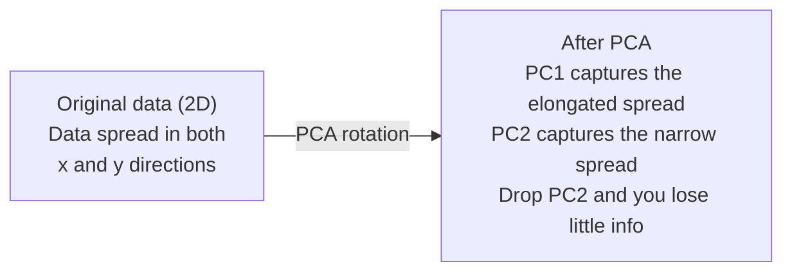

# Giảm chiều dữ liệu (Dimensionality Reduction)

> Dữ liệu đa chiều luôn có cấu trúc. Bạn sẽ tìm thấy nó khi nhìn từ góc độ phù hợp.

**Type:** Build
**Language:** Python
**Prerequisites:** Phase 1, Lessons 01 (Linear Algebra Intuition), 02 (Vectors, Matrices & Operations), 03 (Eigenvalues & Eigenvectors), 06 (Probability & Distributions)
**Time:** ~90 phút

## Learning Objectives

- Triển khai PCA từ đầu: chuẩn hóa dữ liệu (center data), tính toán ma trận hiệp biến (covariance matrix), phân rã trị riêng (eigendecompose) và chiếu dữ liệu (project)
- Sử dụng tỷ lệ phương sai giải thích (explained variance ratio) và phương pháp khuỷu tay (elbow method) để chọn số lượng thành phần chính
- So sánh PCA, t-SNE và UMAP để trực quan hóa các chữ số MNIST trong không gian 2D và giải thích sự đánh đổi giữa chúng
- Áp dụng kernel PCA với RBF kernel để phân tách các cấu trúc dữ liệu phi tuyến tính mà PCA tiêu chuẩn không thể xử lý

## The Problem

Bạn có một bộ dữ liệu với 784 đặc trưng trên mỗi mẫu. Có thể đó là giá trị pixel của các chữ số viết tay. Có thể là mức độ biểu hiện gen. Hoặc có thể là các tín hiệu hành vi người dùng. Bạn không thể trực quan hóa 784 chiều. Bạn không thể vẽ đồ thị cho chúng. Bạn thậm chí không thể hình dung về chúng.

Nhưng hầu hết trong số 784 đặc trưng đó là dư thừa. Thông tin thực sự nằm trên một bề mặt nhỏ hơn nhiều. Một chữ số "7" viết tay không cần đến 784 con số độc lập để mô tả. Nó chỉ cần một vài thông số: góc của nét vẽ, độ dài của thanh ngang, độ nghiêng của nó. Phần còn lại là nhiễu.

Giảm chiều dữ liệu giúp tìm ra bề mặt nhỏ hơn đó. Nó lấy dữ liệu 784 chiều của bạn và nén xuống còn 2, 10 hoặc 50 chiều trong khi vẫn giữ lại cấu trúc quan trọng.

## The Concept

### Lời nguyền đa chiều (The curse of dimensionality)

Không gian đa chiều rất khó hình dung. Có ba thứ sẽ bị phá vỡ khi số chiều tăng lên.

**Khoảng cách trở nên vô nghĩa.** Trong không gian nhiều chiều, khoảng cách giữa hai điểm ngẫu nhiên bất kỳ sẽ hội tụ về cùng một giá trị. Nếu mọi điểm đều có khoảng cách xấp xỉ nhau, việc tìm kiếm lân cận gần nhất (nearest-neighbor search) sẽ không còn hiệu quả.

```
Dimension    Avg distance ratio (max/min between random points)
2            ~5.0
10           ~1.8
100          ~1.2
1000         ~1.02
```

**Thể tích tập trung ở các góc.** Một siêu khối đơn vị (unit hypercube) trong d chiều có 2^d góc. Trong 100 chiều, gần như toàn bộ thể tích nằm ở các góc, cách xa tâm. Các điểm dữ liệu lan ra các cạnh và mô hình của bạn sẽ bị "đói" dữ liệu ở phần lõi bên trong.

**Bạn cần lượng dữ liệu lớn theo hàm mũ.** Để duy trì cùng một mật độ mẫu trong không gian, việc đi từ 2D lên 20D có nghĩa là bạn cần lượng dữ liệu gấp 10^18 lần. Bạn không bao giờ có đủ dữ liệu. Giảm chiều dữ liệu giúp đưa mật độ dữ liệu trở lại mức có thể xử lý được.

### PCA: tìm kiếm các hướng quan trọng

Phân tích thành phần chính (PCA) tìm kiếm các trục mà tại đó dữ liệu của bạn biến thiên nhiều nhất. Nó xoay hệ tọa độ của bạn sao cho trục đầu tiên nắm giữ nhiều phương sai nhất, trục thứ hai nắm giữ lượng phương sai nhiều tiếp theo, và cứ tiếp tục như vậy.

Thuật toán:

```
1. Center the data        (subtract the mean from each feature)
2. Compute covariance     (how features move together)
3. Eigendecomposition     (find the principal directions)
4. Sort by eigenvalue     (biggest variance first)
5. Project               (keep top k eigenvectors, drop the rest)
```

Tại sao lại dùng phân rã trị riêng (eigendecomposition)? Ma trận hiệp biến là ma trận đối xứng và xác định bán dương. Các vector riêng (eigenvectors) của nó là các hướng trực giao trong không gian đặc trưng. Các trị riêng (eigenvalues) cho biết lượng phương sai mà mỗi hướng nắm giữ. Vector riêng có trị riêng lớn nhất sẽ chỉ theo hướng có phương sai cực đại.



- **Trước PCA:** Đám mây dữ liệu trải rộng theo đường chéo trên cả trục x và y.
- **Sau PCA:** Hệ tọa độ được xoay sao cho PC1 khớp với hướng có phương sai tối đa (trải dài) và PC2 khớp với hướng có phương sai tối thiểu (trải hẹp).
- **Giảm chiều dữ liệu:** Loại bỏ PC2 sẽ chiếu dữ liệu lên PC1, làm mất rất ít thông tin.

### Tỷ lệ phương sai giải thích (Explained variance ratio)

Mỗi thành phần chính nắm giữ một phần của tổng phương sai. Tỷ lệ phương sai giải thích cho bạn biết phần đó là bao nhiêu.

```
Component    Eigenvalue    Explained ratio    Cumulative
PC1          4.73          0.473              0.473
PC2          2.51          0.251              0.724
PC3          1.12          0.112              0.836
PC4          0.89          0.089              0.925
...
```

Khi phương sai giải thích tích lũy đạt đến 0.95, bạn biết rằng các thành phần đó đã nắm giữ 95% thông tin. Mọi thứ sau đó chủ yếu là nhiễu.

### Chọn số lượng thành phần

Ba chiến lược:

1. **Ngưỡng (Threshold).** Giữ đủ số lượng thành phần để giải thích 90-95% phương sai.
2. **Phương pháp khuỷu tay (Elbow method).** Vẽ biểu đồ phương sai giải thích trên mỗi thành phần. Tìm điểm mà biểu đồ bắt đầu giảm chậm lại đột ngột.
3. **Hiệu suất hạ nguồn (Downstream performance).** Sử dụng PCA như một bước tiền xử lý. Thử nghiệm các giá trị k khác nhau và đo độ chính xác của mô hình. Giá trị k tốt nhất là nơi độ chính xác bắt đầu đi ngang (plateaus).

### t-SNE: bảo tồn các lân cận

t-Distributed Stochastic Neighbor Embedding (t-SNE) được thiết kế để trực quan hóa. Nó ánh xạ dữ liệu đa chiều sang 2D (hoặc 3D) trong khi vẫn bảo tồn các điểm gần nhau.

Trực giác: trong không gian gốc, tính toán một phân phối xác suất trên các cặp điểm dựa trên khoảng cách của chúng. Các điểm gần nhau có xác suất cao. Các điểm xa nhau có xác suất thấp. Sau đó, tìm một cách sắp xếp trong 2D sao cho phân phối xác suất tương tự được duy trì. Các điểm là lân cận trong 784 chiều sẽ vẫn là lân cận trong 2D.

Các đặc điểm chính của t-SNE:
- Phi tuyến tính. Nó có thể mở ra các đa tạp (manifolds) phức tạp mà PCA không thể.
- Ngẫu nhiên (Stochastic). Các lần chạy khác nhau tạo ra các bố cục khác nhau.
- Tham số Perplexity kiểm soát số lượng lân cận cần xem xét (phạm vi điển hình: 5-50).
- Khoảng cách giữa các cụm trong kết quả đầu ra không có ý nghĩa. Chỉ bản thân các cụm mới có ý nghĩa.
- Chậm trên các bộ dữ liệu lớn. Mặc định là O(n^2).

### UMAP: nhanh hơn, cấu trúc toàn cục tốt hơn

Uniform Manifold Approximation and Projection (UMAP) hoạt động tương tự như t-SNE nhưng có hai ưu điểm:
- Nhanh hơn. Nó sử dụng đồ thị lân cận gần nhất xấp xỉ thay vì tính toán tất cả các khoảng cách cặp một.
- Cấu trúc toàn cục tốt hơn. Vị trí tương đối của các cụm trong kết quả đầu ra có xu hướng mang nhiều ý nghĩa hơn so với t-SNE.

UMAP xây dựng một đồ thị có trọng số trong không gian đa chiều (gọi là "biểu diễn topo mờ" - fuzzy topological representation) và sau đó tìm một bố cục chiều thấp bảo tồn đồ thị này tốt nhất có thể.

Các tham số chính:
- `n_neighbors`: số lượng lân cận xác định cấu trúc địa phương (tương tự như perplexity). Giá trị cao hơn sẽ bảo tồn nhiều cấu trúc toàn cục hơn.
- `min_dist`: độ chặt chẽ khi các điểm đóng gói lại với nhau trong kết quả đầu ra. Giá trị thấp hơn tạo ra các cụm dày đặc hơn.

### Khi nào nên sử dụng phương pháp nào

| Phương pháp | Trường hợp sử dụng | Bảo tồn | Tốc độ |
|-------------|-------------------|---------|--------|
| PCA | Tiền xử lý trước khi huấn luyện | Phương sai toàn cục | Nhanh (chính xác), hoạt động trên hàng triệu mẫu |
| PCA | Trực quan hóa thăm dò nhanh | Cấu trúc tuyến tính | Nhanh |
| t-SNE | Biểu đồ 2D chất lượng cao | Lân cận địa phương | Chậm (lý tưởng cho < 10k mẫu) |
| UMAP | Trực quan hóa 2D ở quy mô lớn | Địa phương + một phần toàn cục | Trung bình (xử lý được hàng triệu mẫu) |
| PCA | Giảm đặc trưng cho mô hình | Đặc trưng xếp hạng theo phương sai | Nhanh |
| t-SNE / UMAP | Hiểu cấu trúc cụm | Sự phân tách cụm | Trung bình đến chậm |

Quy tắc chung: sử dụng PCA để tiền xử lý và nén dữ liệu. Sử dụng t-SNE hoặc UMAP khi bạn cần trực quan hóa cấu trúc trong 2D.

### Kernel PCA

PCA tiêu chuẩn tìm kiếm các không gian con tuyến tính. Nó xoay hệ tọa độ và loại bỏ các trục. Nhưng nếu dữ liệu nằm trên một đa tạp phi tuyến thì sao? Một vòng tròn trong 2D không thể bị phân tách bởi bất kỳ đường thẳng nào. PCA tiêu chuẩn sẽ không giúp ích gì.

Kernel PCA áp dụng PCA trong một không gian đặc trưng đa chiều được tạo ra bởi một hàm kernel, mà không cần tính toán trực tiếp các tọa độ trong không gian đó. Đây chính là "mẹo kernel" (kernel trick) -- cùng một ý tưởng đằng sau SVM.

Thuật toán:
1. Tính toán ma trận kernel K trong đó K_ij = k(x_i, x_j)
2. Chuẩn hóa ma trận kernel trong không gian đặc trưng
3. Phân rã trị riêng ma trận kernel đã chuẩn hóa
4. Các vector riêng hàng đầu (được tỷ lệ bởi 1/sqrt(trị riêng)) chính là các phép chiếu

Các hàm kernel phổ biến:

| Kernel | Công thức | Phù hợp cho |
|--------|-----------|-------------|
| RBF (Gaussian) | exp(-gamma * \|\|x - y\|\|^2) | Hầu hết dữ liệu phi tuyến, đa tạp trơn |
| Polynomial | (x . y + c)^d | Các mối quan hệ đa thức |
| Sigmoid | tanh(alpha * x . y + c) | Các ánh xạ kiểu mạng thần kinh |

Khi nào sử dụng kernel PCA so với PCA tiêu chuẩn:

| Tiêu chí | PCA tiêu chuẩn | Kernel PCA |
|----------|----------------|------------|
| Cấu trúc dữ liệu | Không gian con tuyến tính | Đa tạp phi tuyến |
| Tốc độ | O(min(n^2 d, d^2 n)) | O(n^2 d + n^3) |
| Khả năng diễn giải | Thành phần là tổ hợp tuyến tính của đặc trưng | Thành phần thiếu diễn giải đặc trưng trực tiếp |
| Khả năng mở rộng | Hoạt động trên hàng triệu mẫu | Ma trận kernel là n x n, giới hạn bộ nhớ |
| Tái tạo | Phép biến đổi ngược trực tiếp | Yêu cầu xấp xỉ pre-image |

Ví dụ điển hình: các vòng tròn đồng tâm trong 2D. Hai vòng tròn điểm, cái này nằm trong cái kia. PCA tiêu chuẩn chiếu cả hai lên cùng một đường thẳng -- vô dụng cho việc phân loại. Kernel PCA với RBF kernel ánh xạ vòng tròn trong và vòng tròn ngoài vào các vùng khác nhau, giúp chúng có thể phân tách tuyến tính.

### Sai số tái tạo (Reconstruction Error)

Việc giảm chiều dữ liệu của bạn tốt đến mức nào? Bạn đã nén 784 chiều xuống còn 50. Bạn đã mất đi những gì?

Đo lường sai số tái tạo:
1. Chiếu dữ liệu xuống k chiều: X_reduced = X @ W_k
2. Tái tạo: X_hat = X_reduced @ W_k^T
3. Tính MSE: mean((X - X_hat)^2)

Đối với PCA, sai số tái tạo có mối quan hệ rõ ràng với phương sai giải thích:

```
Reconstruction error = sum of eigenvalues NOT included
Total variance = sum of ALL eigenvalues
Fraction lost = (sum of dropped eigenvalues) / (sum of all eigenvalues)
```

Tỷ lệ phương sai giải thích cho mỗi thành phần là:

```
explained_ratio_k = eigenvalue_k / sum(all eigenvalues)
```

Vẽ biểu đồ phương sai giải thích tích lũy theo số lượng thành phần sẽ cho bạn đường cong "khuỷu tay". Số lượng thành phần phù hợp là nơi:
- Đường cong bắt đầu đi ngang (lợi ích giảm dần)
- Phương sai tích lũy vượt qua ngưỡng của bạn (thường là 0.90 hoặc 0.95)
- Hiệu suất tác vụ hạ nguồn đạt đến ngưỡng bão hòa

Sai số tái tạo không chỉ hữu ích để chọn k. Bạn có thể sử dụng nó để phát hiện bất thường (anomaly detection): các mẫu có sai số tái tạo cao là các điểm ngoại lai không khớp với không gian con đã học. Đây là cơ sở của việc phát hiện bất thường dựa trên PCA trong các hệ thống thực tế.

```figure
pca-axes
```

## Build It

### Bước 1: PCA từ đầu

```python
import numpy as np

class PCA:
    def __init__(self, n_components):
        self.n_components = n_components
        self.components = None
        self.mean = None
        self.eigenvalues = None
        self.explained_variance_ratio_ = None

    def fit(self, X):
        self.mean = np.mean(X, axis=0)
        X_centered = X - self.mean

        cov_matrix = np.cov(X_centered, rowvar=False)

        eigenvalues, eigenvectors = np.linalg.eigh(cov_matrix)

        sorted_idx = np.argsort(eigenvalues)[::-1]
        eigenvalues = eigenvalues[sorted_idx]
        eigenvectors = eigenvectors[:, sorted_idx]

        self.components = eigenvectors[:, :self.n_components].T
        self.eigenvalues = eigenvalues[:self.n_components]
        total_var = np.sum(eigenvalues)
        self.explained_variance_ratio_ = self.eigenvalues / total_var

        return self

    def transform(self, X):
        X_centered = X - self.mean
        return X_centered @ self.components.T

    def fit_transform(self, X):
        self.fit(X)
        return self.transform(X)
```

### Bước 2: Kiểm tra trên dữ liệu tổng hợp

```python
np.random.seed(42)
n_samples = 500

t = np.random.uniform(0, 2 * np.pi, n_samples)
x1 = 3 * np.cos(t) + np.random.normal(0, 0.2, n_samples)
x2 = 3 * np.sin(t) + np.random.normal(0, 0.2, n_samples)
x3 = 0.5 * x1 + 0.3 * x2 + np.random.normal(0, 0.1, n_samples)

X_synthetic = np.column_stack([x1, x2, x3])

pca = PCA(n_components=2)
X_reduced = pca.fit_transform(X_synthetic)

print(f"Original shape: {X_synthetic.shape}")
print(f"Reduced shape:  {X_reduced.shape}")
print(f"Explained variance ratios: {pca.explained_variance_ratio_}")
print(f"Total variance captured: {sum(pca.explained_variance_ratio_):.4f}")
```

### Bước 3: Chữ số MNIST trong 2D

```python
from sklearn.datasets import fetch_openml

mnist = fetch_openml("mnist_784", version=1, as_frame=False, parser="auto")
X_mnist = mnist.data[:5000].astype(float)
y_mnist = mnist.target[:5000].astype(int)

pca_mnist = PCA(n_components=50)
X_pca50 = pca_mnist.fit_transform(X_mnist)
print(f"50 components capture {sum(pca_mnist.explained_variance_ratio_):.2%} of variance")

pca_2d = PCA(n_components=2)
X_pca2d = pca_2d.fit_transform(X_mnist)
print(f"2 components capture {sum(pca_2d.explained_variance_ratio_):.2%} of variance")
```

### Bước 4: So sánh với sklearn

```python
from sklearn.decomposition import PCA as SklearnPCA
from sklearn.manifold import TSNE

sklearn_pca = SklearnPCA(n_components=2)
X_sklearn_pca = sklearn_pca.fit_transform(X_mnist)

print(f"\nOur PCA explained variance:     {pca_2d.explained_variance_ratio_}")
print(f"Sklearn PCA explained variance: {sklearn_pca.explained_variance_ratio_}")

diff = np.abs(np.abs(X_pca2d) - np.abs(X_sklearn_pca))
print(f"Max absolute difference: {diff.max():.10f}")

tsne = TSNE(n_components=2, perplexity=30, random_state=42)
X_tsne = tsne.fit_transform(X_mnist)
print(f"\nt-SNE output shape: {X_tsne.shape}")
```

### Bước 5: So sánh với UMAP

```python
try:
    from umap import UMAP

    reducer = UMAP(n_components=2, n_neighbors=15, min_dist=0.1, random_state=42)
    X_umap = reducer.fit_transform(X_mnist)
    print(f"UMAP output shape: {X_umap.shape}")
except ImportError:
    print("Install umap-learn: pip install umap-learn")
```

## Use It

PCA như một bước tiền xử lý trước khi đưa vào bộ phân loại:

```python
from sklearn.decomposition import PCA as SklearnPCA
from sklearn.linear_model import LogisticRegression
from sklearn.model_selection import train_test_split
from sklearn.metrics import accuracy_score

X_train, X_test, y_train, y_test = train_test_split(
    X_mnist, y_mnist, test_size=0.2, random_state=42
)

results = {}
for k in [10, 30, 50, 100, 200]:
    pca_k = SklearnPCA(n_components=k)
    X_tr = pca_k.fit_transform(X_train)
    X_te = pca_k.transform(X_test)

    clf = LogisticRegression(max_iter=1000, random_state=42)
    clf.fit(X_tr, y_train)
    acc = accuracy_score(y_test, clf.predict(X_te))
    var_captured = sum(pca_k.explained_variance_ratio_)
    results[k] = (acc, var_captured)
    print(f"k={k:>3d}  accuracy={acc:.4f}  variance={var_captured:.4f}")
```

Hiệu suất sẽ đi ngang từ rất lâu trước khi đạt đến 784 chiều. Điểm bão hòa đó chính là điểm vận hành tối ưu của bạn.

## Ship It

Bài học này tạo ra:
- `outputs/skill-dimensionality-reduction.md` - kỹ năng chọn kỹ thuật giảm chiều dữ liệu phù hợp cho một tác vụ cụ thể

## Exercises

1. Chỉnh sửa lớp PCA để hỗ trợ `inverse_transform`. Tái tạo các chữ số MNIST từ 10, 50 và 200 thành phần. In sai số tái tạo (sai biệt bình phương trung bình so với bản gốc) cho mỗi trường hợp.

2. Chạy t-SNE trên cùng một tập con MNIST với các giá trị perplexity là 5, 30 và 100. Mô tả sự thay đổi của kết quả đầu ra. Tại sao perplexity lại ảnh hưởng đến độ chặt chẽ của cụm?

3. Lấy một bộ dữ liệu có 50 đặc trưng nhưng chỉ có 5 đặc trưng mang thông tin (tạo một bộ bằng `sklearn.datasets.make_classification`). Áp dụng PCA và kiểm tra xem đường cong phương sai giải thích có xác định chính xác rằng dữ liệu thực chất là 5 chiều hay không.

## Key Terms

| Thuật ngữ | Mọi người thường nói | Ý nghĩa thực sự |
|-----------|----------------------|-----------------|
| Curse of dimensionality | "Quá nhiều đặc trưng" | Khoảng cách, thể tích và mật độ dữ liệu đều hành xử trái với trực giác khi số chiều tăng lên. Các mô hình cần lượng dữ liệu lớn theo hàm mũ để bù đắp. |
| PCA | "Giảm chiều" | Xoay hệ tọa độ của bạn sao cho các trục khớp với các hướng có phương sai tối đa, sau đó loại bỏ các trục có phương sai thấp. |
| Principal component | "Một hướng quan trọng" | Một vector riêng của ma trận hiệp biến. Hướng trong không gian đặc trưng mà tại đó dữ liệu biến thiên nhiều nhất. |
| Explained variance ratio | "Thành phần này có bao nhiêu thông tin" | Tỷ lệ của tổng phương sai được nắm giữ bởi một thành phần chính. Cộng dồn k tỷ lệ đầu tiên để xem k thành phần bảo tồn được bao nhiêu thông tin. |
| Covariance matrix | "Các đặc trưng tương quan thế nào" | Một ma trận đối xứng trong đó phần tử (i,j) đo lường mức độ biến thiên cùng nhau của đặc trưng i và đặc trưng j. Các phần tử trên đường chéo chính là phương sai của từng đặc trưng. |
| t-SNE | "Biểu đồ cụm đó" | Một phương pháp phi tuyến tính ánh xạ dữ liệu đa chiều sang 2D bằng cách bảo tồn xác suất lân cận cặp một. Tốt cho trực quan hóa, không dùng cho tiền xử lý. |
| UMAP | "t-SNE nhanh hơn" | Một phương pháp phi tuyến tính dựa trên phân tích dữ liệu topo. Bảo tồn cả cấu trúc địa phương và một phần cấu trúc toàn cục. Mở rộng quy mô tốt hơn t-SNE. |
| Perplexity | "Một núm vặn của t-SNE" | Kiểm soát số lượng lân cận hiệu dụng mà mỗi điểm xem xét. Perplexity thấp tập trung vào cấu trúc rất cục bộ. Perplexity cao nắm bắt các mẫu rộng hơn. |
| Manifold | "Bề mặt dữ liệu nằm trên đó" | Một bề mặt có số chiều thấp hơn được nhúng trong một không gian có số chiều cao hơn. Một tờ giấy bị vò nát trong không gian 3D là một đa tạp 2D. |

## Further Reading

- [A Tutorial on Principal Component Analysis](https://arxiv.org/abs/1404.1100) (Shlens) - dẫn giải chi tiết về PCA từ những khái niệm cơ bản nhất
- [How to Use t-SNE Effectively](https://distill.pub/2016/misread-tsne/) (Wattenberg et al.) - hướng dẫn tương tác về các cạm bẫy và cách chọn tham số trong t-SNE
- [UMAP documentation](https://umap-learn.readthedocs.io/) - lý thuyết và hướng dẫn thực hành từ các tác giả của UMAP