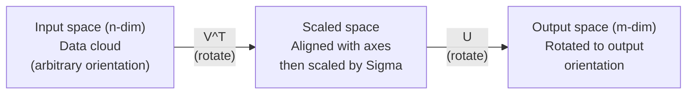
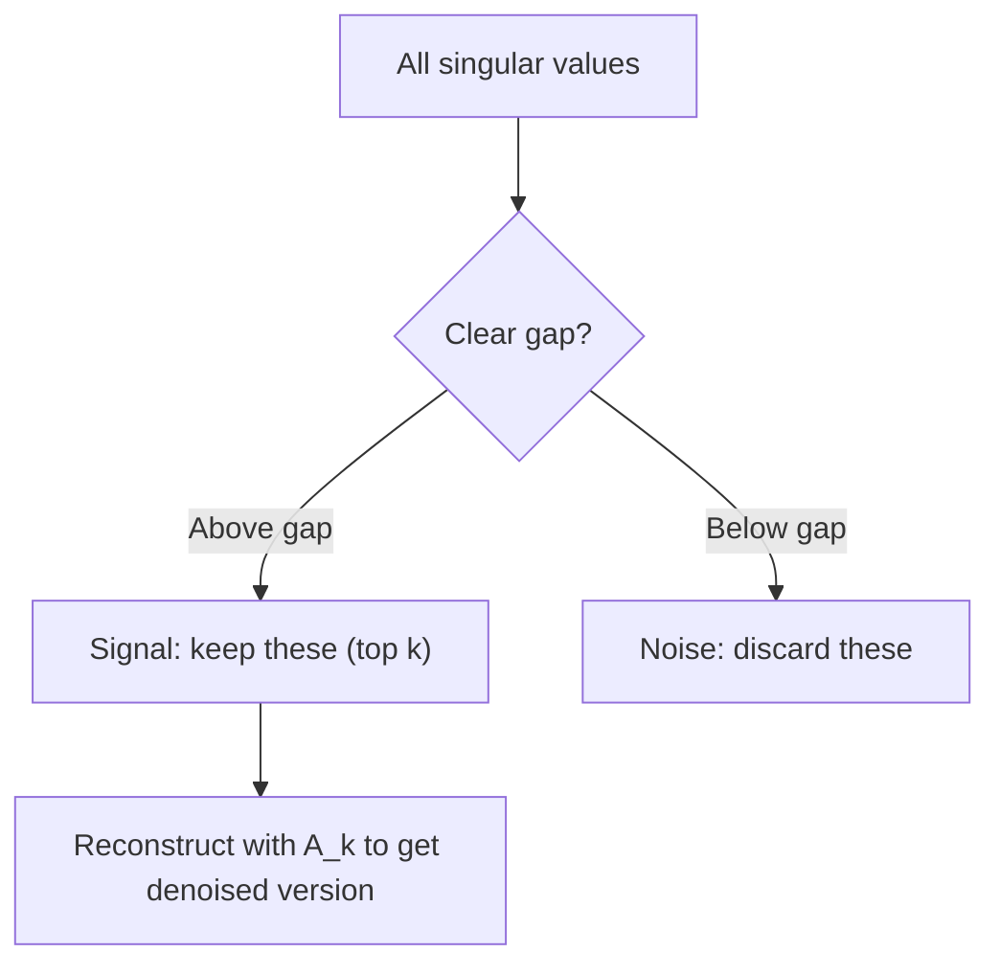

# Singular Value Decomposition

> SVD là "con dao đa năng" của đại số tuyến tính. Mọi ma trận đều có SVD. Mọi nhà khoa học dữ liệu đều cần đến nó.

**Type:** Build
**Languages:** Python, Julia
**Prerequisites:** Phase 1, Lessons 01 (Linear Algebra Intuition), 02 (Vectors & Matrices Operations), 03 (Matrix Transformations)
**Time:** ~120 minutes

## Learning Objectives

- Triển khai SVD thông qua power iteration và giải thích ý nghĩa hình học của U, Sigma, và V^T
- Áp dụng truncated SVD để nén ảnh và đo lường tỉ lệ nén so với sai số tái cấu trúc (reconstruction error)
- Tính toán Moore-Penrose pseudoinverse thông qua SVD để giải các hệ bình phương tối thiểu (least-squares) quá xác định
- Kết nối SVD với PCA, hệ thống gợi ý (latent factors), và Latent Semantic Analysis trong NLP

## The Problem

Bạn có một ma trận 1000x2000. Có thể đó là ma trận đánh giá phim của người dùng. Có thể là bảng tần suất từ-tài liệu. Hoặc có thể là các giá trị pixel của một bức ảnh. Bạn cần nén nó, khử nhiễu, tìm cấu trúc ẩn bên trong, hoặc giải một hệ bình phương tối thiểu với nó. Eigendecomposition chỉ hoạt động trên ma trận vuông. Ngay cả khi đó, nó yêu cầu ma trận phải có đầy đủ các vectơ riêng (eigenvectors) độc lập tuyến tính.

SVD hoạt động trên mọi ma trận. Mọi hình dạng. Mọi hạng (rank). Không cần điều kiện đi kèm. Nó phân rã ma trận thành ba nhân tố tiết lộ hình học của những gì ma trận đó thực hiện đối với không gian. Đây là phép phân rã tổng quát nhất và hữu ích nhất trong toàn bộ đại số tuyến tính.

## The Concept

### Ý nghĩa hình học của SVD

Mọi ma trận, bất kể hình dạng, đều thực hiện ba thao tác theo thứ tự: xoay, co giãn, xoay. SVD làm cho phép phân rã này trở nên rõ ràng.

```
A = U * Sigma * V^T

      m x n     m x m    m x n    n x n
     (any)    (rotate)  (scale)  (rotate)
```

Với bất kỳ ma trận A nào, SVD phân rã nó thành:
- V^T xoay các vectơ trong không gian đầu vào (n-chiều)
- Sigma co giãn dọc theo mỗi trục (kéo giãn hoặc nén)
- U xoay kết quả vào không gian đầu ra (m-chiều)



Hãy nghĩ theo cách này: Bạn đưa cho SVD một ma trận. Nó sẽ nói với bạn: "Ma trận này lấy một hình cầu các đầu vào, đầu tiên xoay nó bằng V^T, sau đó kéo giãn nó thành một hình ellipsoid bằng Sigma, rồi xoay hình ellipsoid đó bằng U." Các giá trị suy biến (singular values) chính là độ dài các trục của hình ellipsoid đó.

### Phép phân rã đầy đủ

Đối với một ma trận A có kích thước m x n:

```
A = U * Sigma * V^T

where:
  U     is m x m, orthogonal (U^T U = I)
  Sigma is m x n, diagonal (singular values on the diagonal)
  V     is n x n, orthogonal (V^T V = I)

The singular values sigma_1 >= sigma_2 >= ... >= sigma_r > 0
where r = rank(A)
```

Các cột của U được gọi là các vectơ suy biến trái (left singular vectors). Các cột của V được gọi là các vectơ suy biến phải (right singular vectors). Các phần tử trên đường chéo của Sigma được gọi là các giá trị suy biến (singular values). Chúng luôn không âm và theo quy ước được sắp xếp theo thứ tự giảm dần.

### Vectơ suy biến trái, giá trị suy biến, vectơ suy biến phải

Mỗi thành phần của SVD đều có một ý nghĩa hình học riêng biệt.

**Vectơ suy biến phải (các cột của V):** Những vectơ này tạo thành một cơ sở trực chuẩn (orthonormal basis) cho không gian đầu vào (R^n). Chúng là các hướng trong không gian đầu vào mà ma trận ánh xạ tới các hướng trực giao trong không gian đầu ra. Hãy coi chúng là hệ tọa độ tự nhiên cho miền xác định.

**Giá trị suy biến (đường chéo của Sigma):** Đây là các hệ số co giãn. Giá trị suy biến thứ i cho bạn biết ma trận kéo giãn các vectơ dọc theo vectơ suy biến phải thứ i bao nhiêu. Một giá trị suy biến bằng 0 có nghĩa là ma trận triệt tiêu hoàn toàn hướng đó.

**Vectơ suy biến trái (các cột của U):** Những vectơ này tạo thành một cơ sở trực chuẩn cho không gian đầu ra (R^m). Vectơ suy biến trái thứ i là hướng trong không gian đầu ra nơi vectơ suy biến phải thứ i rơi vào (sau khi đã co giãn).

Mối quan hệ giữa chúng:

```
A * v_i = sigma_i * u_i

The matrix A takes the i-th right singular vector v_i,
scales it by sigma_i, and maps it to the i-th left singular vector u_i.
```

Điều này cung cấp cho bạn một bức tranh chi tiết theo từng tọa độ về những gì bất kỳ ma trận nào thực hiện.

### Dạng tích ngoài (Outer product form)

SVD có thể được viết dưới dạng tổng của các ma trận hạng 1 (rank-1):

```
A = sigma_1 * u_1 * v_1^T + sigma_2 * u_2 * v_2^T + ... + sigma_r * u_r * v_r^T

Each term sigma_i * u_i * v_i^T is a rank-1 matrix (an outer product).
The full matrix is the sum of r such matrices, where r is the rank.
```

Dạng này là nền tảng của xấp xỉ hạng thấp (low-rank approximation). Mỗi số hạng thêm vào một lớp cấu trúc. Số hạng đầu tiên nắm bắt đặc điểm quan trọng nhất. Số hạng thứ hai nắm bắt đặc điểm quan trọng tiếp theo, và cứ thế tiếp tục. Việc cắt bỏ (truncating) tổng này sẽ cho bạn xấp xỉ tốt nhất có thể ở bất kỳ hạng nào cho trước.

```
Rank-1 approx:    A_1 = sigma_1 * u_1 * v_1^T
                  (captures the dominant pattern)

Rank-2 approx:    A_2 = sigma_1 * u_1 * v_1^T + sigma_2 * u_2 * v_2^T
                  (captures the two most important patterns)

Rank-k approx:    A_k = sum of top k terms
                  (optimal by the Eckart-Young theorem)
```

### Mối quan hệ với eigendecomposition

SVD và eigendecomposition có mối liên hệ sâu sắc. Các giá trị suy biến và vectơ suy biến của A đến trực tiếp từ các trị riêng (eigenvalues) và vectơ riêng (eigenvectors) của A^T A và A A^T.

```
A^T A = V * Sigma^T * U^T * U * Sigma * V^T
      = V * Sigma^T * Sigma * V^T
      = V * D * V^T

where D = Sigma^T * Sigma is a diagonal matrix with sigma_i^2 on the diagonal.

So:
- The right singular vectors (V) are eigenvectors of A^T A
- The singular values squared (sigma_i^2) are eigenvalues of A^T A

Similarly:
A A^T = U * Sigma * V^T * V * Sigma^T * U^T
      = U * Sigma * Sigma^T * U^T

So:
- The left singular vectors (U) are eigenvectors of A A^T
- The eigenvalues of A A^T are also sigma_i^2
```

Mối liên hệ này cho bạn biết ba điều:
1. Các giá trị suy biến luôn là số thực và không âm (chúng là căn bậc hai của các trị riêng của một ma trận xác định dương nửa định - positive semi-definite).
2. Bạn có thể tính SVD thông qua eigendecomposition của A^T A, nhưng điều này làm bình phương số điều kiện (condition number) và làm mất độ chính xác về mặt số học. Các thuật toán SVD chuyên dụng sẽ tránh điều này.
3. Khi A là ma trận vuông, đối xứng và xác định dương nửa định, SVD và eigendecomposition là một.

### Truncated SVD: xấp xỉ hạng thấp

Định lý Eckart-Young-Mirsky phát biểu rằng xấp xỉ hạng k tốt nhất cho A (trong cả chuẩn Frobenius và chuẩn phổ) có được bằng cách chỉ giữ lại k giá trị suy biến lớn nhất và các vectơ tương ứng của chúng:

```
A_k = U_k * Sigma_k * V_k^T

where:
  U_k     is m x k  (first k columns of U)
  Sigma_k is k x k  (top-left k x k block of Sigma)
  V_k     is n x k  (first k columns of V)

Approximation error = sigma_{k+1}  (in spectral norm)
                    = sqrt(sigma_{k+1}^2 + ... + sigma_r^2)  (in Frobenius norm)
```

Đây không chỉ là "một xấp xỉ tốt". Nó được chứng minh là xấp xỉ tốt nhất có thể ở hạng k. Không có ma trận hạng k nào khác gần với A hơn nó.

| Thành phần | Độ lớn tương đối | Giữ lại trong xấp xỉ hạng 3? |
|-----------|-------------------|------------------------|
| sigma_1 | Lớn nhất | Có |
| sigma_2 | Lớn | Có |
| sigma_3 | Trung bình lớn | Có |
| sigma_4 | Trung bình | Không (sai số) |
| sigma_5 | Trung bình nhỏ | Không (sai số) |
| sigma_6 | Nhỏ | Không (sai số) |
| sigma_7 | Rất nhỏ | Không (sai số) |
| sigma_8 | Rất bé | Không (sai số) |

Giữ lại top 3: A_3 nắm bắt ba giá trị suy biến lớn nhất. Sai số = các giá trị còn lại (từ sigma_4 đến sigma_8).

Nếu các giá trị suy biến giảm nhanh, một giá trị k nhỏ có thể nắm bắt được hầu hết ma trận. Nếu chúng giảm chậm, ma trận đó không có cấu trúc hạng thấp.

### Nén ảnh với SVD

Một bức ảnh xám là một ma trận các cường độ pixel. Một bức ảnh 800x600 có 480,000 giá trị. SVD cho phép bạn xấp xỉ nó với ít giá trị hơn nhiều.

```
Original image: 800 x 600 = 480,000 values

SVD with rank k:
  U_k:      800 x k values
  Sigma_k:  k values
  V_k:      600 x k values
  Total:    k * (800 + 600 + 1) = k * 1401 values

  k=10:   14,010 values   (2.9% of original)
  k=50:   70,050 values  (14.6% of original)
  k=100: 140,100 values  (29.2% of original)

  The compression ratio improves as k gets smaller,
  but visual quality degrades.
```

Điểm mấu chốt: các bức ảnh tự nhiên có các giá trị suy biến giảm rất nhanh. Một vài giá trị suy biến đầu tiên nắm bắt cấu trúc tổng thể (hình dạng, gradient). Các giá trị sau đó nắm bắt chi tiết nhỏ và nhiễu. Việc cắt bỏ ở hạng 50 thường tạo ra một bức ảnh trông gần như giống hệt bản gốc trong khi sử dụng ít hơn 85% dung lượng lưu trữ.

### SVD cho hệ thống gợi ý

Giải thưởng Netflix Prize đã làm cho phương pháp này trở nên nổi tiếng. Bạn có một ma trận đánh giá phim của người dùng, trong đó hầu hết các mục đều bị thiếu.

```
             Movie1  Movie2  Movie3  Movie4  Movie5
  User1      [  5      ?       3       ?       1  ]
  User2      [  ?      4       ?       2       ?  ]
  User3      [  3      ?       5       ?       ?  ]
  User4      [  ?      ?       ?       4       3  ]

  ? = unknown rating
```

Ý tưởng là: ma trận đánh giá này có hạng thấp. Người dùng không có sở thích hoàn toàn độc lập. Có một vài nhân tố ẩn (latent factors) (hành động vs. tâm lý, cũ vs. mới, trí tuệ vs. bản năng) giải thích cho hầu hết các sở thích.

SVD trên ma trận đánh giá (đã được điền đầy) phân rã nó thành:
- U: hồ sơ người dùng trong không gian nhân tố ẩn
- Sigma: tầm quan trọng của mỗi nhân tố ẩn
- V^T: hồ sơ phim trong không gian nhân tố ẩn

Đánh giá dự đoán của một người dùng cho một bộ phim là tích vô hướng của hồ sơ người dùng với hồ sơ bộ phim (được trọng số hóa bởi các giá trị suy biến). Xấp xỉ hạng thấp sẽ điền vào các mục còn thiếu.

Trong thực tế, bạn sẽ sử dụng các biến thể như incremental SVD của Simon Funk hoặc ALS (alternating least squares) để xử lý trực tiếp dữ liệu bị thiếu. Nhưng ý tưởng cốt lõi vẫn là: phân rã nhân tố ẩn thông qua SVD.

### SVD trong NLP: Latent Semantic Analysis

Latent Semantic Analysis (LSA), còn được gọi là Latent Semantic Indexing (LSI), áp dụng SVD vào ma trận thuật ngữ-tài liệu (term-document matrix).

```
             Doc1   Doc2   Doc3   Doc4
  "cat"      [  3      0      1      0  ]
  "dog"      [  2      0      0      1  ]
  "fish"     [  0      4      1      0  ]
  "pet"      [  1      1      1      1  ]
  "ocean"    [  0      3      0      0  ]

After SVD with rank k=2:

  Each document becomes a point in 2D "concept space."
  Each term becomes a point in the same 2D space.
  Documents about similar topics cluster together.
  Terms with similar meanings cluster together.

  "cat" and "dog" end up near each other (land pets).
  "fish" and "ocean" end up near each other (water concepts).
  Doc1 and Doc3 cluster if they share similar topics.
```

LSA là một trong những phương pháp thành công đầu tiên trong việc nắm bắt sự tương đồng về ngữ nghĩa từ văn bản thô. Nó hoạt động vì các thuật ngữ đồng nghĩa có xu hướng xuất hiện trong các tài liệu tương tự, vì vậy SVD nhóm chúng vào cùng các chiều ẩn (latent dimensions). Các word embeddings hiện đại (Word2Vec, GloVe) có thể được coi là hậu duệ của ý tưởng này.

### SVD để khử nhiễu

Dữ liệu nhiễu có tín hiệu tập trung ở các giá trị suy biến cao nhất và nhiễu trải rộng trên tất cả các giá trị suy biến. Việc cắt bỏ (truncating) sẽ loại bỏ nền nhiễu (noise floor).

**Giá trị suy biến của tín hiệu sạch:**

| Thành phần | Độ lớn | Loại |
|-----------|-----------|------|
| sigma_1 | Rất lớn | Tín hiệu |
| sigma_2 | Lớn | Tín hiệu |
| sigma_3 | Trung bình | Tín hiệu |
| sigma_4 | Gần bằng 0 | Không đáng kể |
| sigma_5 | Gần bằng 0 | Không đáng kể |

**Giá trị suy biến của tín hiệu nhiễu (nhiễu cộng thêm vào tất cả):**

| Thành phần | Độ lớn | Loại |
|-----------|-----------|------|
| sigma_1 | Rất lớn | Tín hiệu |
| sigma_2 | Lớn | Tín hiệu |
| sigma_3 | Trung bình | Tín hiệu |
| sigma_4 | Nhỏ | Nhiễu |
| sigma_5 | Nhỏ | Nhiễu |
| sigma_6 | Nhỏ | Nhiễu |
| sigma_7 | Nhỏ | Nhiễu |



Điều này được sử dụng trong xử lý tín hiệu, đo lường khoa học và làm sạch dữ liệu. Bất cứ khi nào bạn có một ma trận bị hỏng bởi nhiễu cộng (additive noise), truncated SVD là một cách có hệ thống để tách tín hiệu khỏi nhiễu.

### Pseudoinverse thông qua SVD

Nghịch đảo giả Moore-Penrose A+ tổng quát hóa phép nghịch đảo ma trận cho các ma trận không vuông và ma trận suy biến. SVD giúp việc tính toán nó trở nên đơn giản.

```
If A = U * Sigma * V^T, then:

A+ = V * Sigma+ * U^T

where Sigma+ is formed by:
  1. Transpose Sigma (swap rows and columns)
  2. Replace each non-zero diagonal entry sigma_i with 1/sigma_i
  3. Leave zeros as zeros

For A (m x n):      A+ is (n x m)
For Sigma (m x n):  Sigma+ is (n x m)
```

Pseudoinverse giải các bài toán bình phương tối thiểu. Nếu Ax = b không có nghiệm chính xác (hệ quá xác định), thì x = A+ b là nghiệm bình phương tối thiểu (tối thiểu hóa ||Ax - b||).

```
Overdetermined system (more equations than unknowns):

  [1  1]         [3]
  [2  1] x   =   [5]       No exact solution exists.
  [3  1]         [6]

  x_ls = A+ b = V * Sigma+ * U^T * b

  This gives the x that minimizes the sum of squared residuals.
  Same result as the normal equations (A^T A)^(-1) A^T b,
  but numerically more stable.
```

### Ưu điểm về ổn định số học

Việc tính toán eigendecomposition của A^T A làm bình phương các giá trị suy biến (các trị riêng của A^T A là sigma_i^2). Điều này làm bình phương số điều kiện, khuếch đại các lỗi số học.

```
Example:
  A has singular values [1000, 1, 0.001]
  Condition number of A: 1000 / 0.001 = 10^6

  A^T A has eigenvalues [10^6, 1, 10^{-6}]
  Condition number of A^T A: 10^6 / 10^{-6} = 10^{12}

  Computing SVD directly: works with condition number 10^6
  Computing via A^T A:     works with condition number 10^{12}
                           (6 extra digits of precision lost)
```

Các thuật toán SVD hiện đại (như Golub-Kahan bidiagonalization) làm việc trực tiếp trên A, không bao giờ tạo ra A^T A. Đây là lý do tại sao bạn nên luôn ưu tiên `np.linalg.svd(A)` hơn là `np.linalg.eig(A.T @ A)`.

### Kết nối với PCA

PCA CHÍNH LÀ SVD trên dữ liệu đã được chuẩn hóa tâm (centered data). Đây không phải là một sự tương đồng. Nó thực sự là cùng một phép toán.

```
Given data matrix X (n_samples x n_features), centered (mean subtracted):

Covariance matrix: C = (1/(n-1)) * X^T X

PCA finds eigenvectors of C. But:

  X = U * Sigma * V^T    (SVD of X)

  X^T X = V * Sigma^2 * V^T

  C = (1/(n-1)) * V * Sigma^2 * V^T

So the principal components are exactly the right singular vectors V.
The explained variance for each component is sigma_i^2 / (n-1).

In sklearn, PCA is implemented using SVD, not eigendecomposition.
It is faster and more numerically stable.
```

Điều này có nghĩa là mọi thứ bạn đã học về giảm chiều dữ liệu trong Bài 10 thực chất là SVD ở bên dưới. PCA là ứng dụng phổ biến nhất của SVD trong machine learning.

```figure
svd-rank-reconstruction
```

## Build It

### Bước 1: SVD từ đầu bằng power iteration

Ý tưởng: để tìm giá trị suy biến lớn nhất và các vectơ của nó, hãy sử dụng power iteration trên A^T A (hoặc A A^T). Sau đó khử (deflate) ma trận và lặp lại cho giá trị suy biến tiếp theo.

```python
import numpy as np

def power_iteration(M, num_iters=100):
    n = M.shape[1]
    v = np.random.randn(n)
    v = v / np.linalg.norm(v)

    for _ in range(num_iters):
        Mv = M @ v
        v = Mv / np.linalg.norm(Mv)

    eigenvalue = v @ M @ v
    return eigenvalue, v

def svd_from_scratch(A, k=None):
    m, n = A.shape
    if k is None:
        k = min(m, n)

    sigmas = []
    us = []
    vs = []

    A_residual = A.copy().astype(float)

    for _ in range(k):
        AtA = A_residual.T @ A_residual
        eigenvalue, v = power_iteration(AtA, num_iters=200)

        if eigenvalue < 1e-10:
            break

        sigma = np.sqrt(eigenvalue)
        u = A_residual @ v / sigma

        sigmas.append(sigma)
        us.append(u)
        vs.append(v)

        A_residual = A_residual - sigma * np.outer(u, v)

    U = np.column_stack(us) if us else np.empty((m, 0))
    S = np.array(sigmas)
    V = np.column_stack(vs) if vs else np.empty((n, 0))

    return U, S, V
```

### Bước 2: Kiểm tra và so sánh với NumPy

```python
np.random.seed(42)
A = np.random.randn(5, 4)

U_ours, S_ours, V_ours = svd_from_scratch(A)
U_np, S_np, Vt_np = np.linalg.svd(A, full_matrices=False)

print("Our singular values:", np.round(S_ours, 4))
print("NumPy singular values:", np.round(S_np, 4))

A_reconstructed = U_ours @ np.diag(S_ours) @ V_ours.T
print(f"Reconstruction error: {np.linalg.norm(A - A_reconstructed):.8f}")
```

### Bước 3: Demo nén ảnh

```python
def compress_image_svd(image_matrix, k):
    U, S, Vt = np.linalg.svd(image_matrix, full_matrices=False)
    compressed = U[:, :k] @ np.diag(S[:k]) @ Vt[:k, :]
    return compressed

image = np.random.seed(42)
rows, cols = 200, 300
image = np.random.randn(rows, cols)

for k in [1, 5, 10, 20, 50]:
    compressed = compress_image_svd(image, k)
    error = np.linalg.norm(image - compressed) / np.linalg.norm(image)
    original_size = rows * cols
    compressed_size = k * (rows + cols + 1)
    ratio = compressed_size / original_size
    print(f"k={k:>3d}  error={error:.4f}  storage={ratio:.1%}")
```

### Bước 4: Khử nhiễu

```python
np.random.seed(42)
clean = np.outer(np.sin(np.linspace(0, 4*np.pi, 100)),
                 np.cos(np.linspace(0, 2*np.pi, 80)))
noise = 0.3 * np.random.randn(100, 80)
noisy = clean + noise

U, S, Vt = np.linalg.svd(noisy, full_matrices=False)
denoised = U[:, :5] @ np.diag(S[:5]) @ Vt[:5, :]

print(f"Noisy error:    {np.linalg.norm(noisy - clean):.4f}")
print(f"Denoised error: {np.linalg.norm(denoised - clean):.4f}")
print(f"Improvement:    {(1 - np.linalg.norm(denoised - clean) / np.linalg.norm(noisy - clean)):.1%}")
```

### Bước 5: Pseudoinverse

```python
A = np.array([[1, 1], [2, 1], [3, 1]], dtype=float)
b = np.array([3, 5, 6], dtype=float)

U, S, Vt = np.linalg.svd(A, full_matrices=False)
S_inv = np.diag(1.0 / S)
A_pinv = Vt.T @ S_inv @ U.T

x_svd = A_pinv @ b
x_lstsq = np.linalg.lstsq(A, b, rcond=None)[0]
x_pinv = np.linalg.pinv(A) @ b

print(f"SVD pseudoinverse solution:  {x_svd}")
print(f"np.linalg.lstsq solution:   {x_lstsq}")
print(f"np.linalg.pinv solution:    {x_pinv}")
```

## Use It

Các bản demo hoạt động đầy đủ có trong `code/svd.py`. Hãy chạy nó để thấy SVD được áp dụng vào nén ảnh, hệ thống gợi ý, latent semantic analysis và khử nhiễu.

```bash
python svd.py
```

Phiên bản Julia trong `code/svd.jl` trình bày các khái niệm tương tự bằng cách sử dụng hàm `svd()` có sẵn của Julia và gói `LinearAlgebra`.

```bash
julia svd.jl
```

## Ship It

Bài học này tạo ra:
- `outputs/skill-svd.md` - một kỹ năng để biết khi nào và làm thế nào để áp dụng SVD trong các dự án thực tế

## Exercises

1. Triển khai SVD đầy đủ từ đầu mà không sử dụng power iteration. Thay vào đó, hãy tính eigendecomposition của A^T A để lấy V và các giá trị suy biến, sau đó tính U = A V Sigma^{-1}. So sánh độ chính xác số học với phiên bản power iteration của bạn và với NumPy.

2. Tải một bức ảnh xám thực tế (hoặc chuyển đổi một bức ảnh sang ảnh xám). Nén nó ở các hạng 1, 5, 10, 25, 50, 100. Với mỗi hạng, hãy tính tỉ lệ nén và sai số tương đối. Tìm hạng mà tại đó bức ảnh trở nên có thể chấp nhận được về mặt thị giác.

3. Xây dựng một hệ thống gợi ý nhỏ. Tạo một ma trận đánh giá người dùng-phim 10x8 với một số mục đã biết. Điền các mục còn thiếu bằng giá trị trung bình của hàng. Tính SVD và tái cấu trúc một xấp xỉ hạng 3. Sử dụng ma trận đã tái cấu trúc để dự đoán các đánh giá còn thiếu. Xác minh rằng các dự đoán là hợp lý.

4. Tạo một ma trận thuật ngữ-tài liệu 100x50 với 3 chủ đề tổng hợp. Mỗi chủ đề có 5 thuật ngữ liên quan. Thêm nhiễu. Áp dụng SVD và xác minh rằng 3 giá trị suy biến đầu tiên lớn hơn nhiều so với các giá trị còn lại. Chiếu các tài liệu vào không gian ẩn 3D và kiểm tra xem các tài liệu từ cùng một chủ đề có cụm lại với nhau không.

5. Tạo một ma trận hạng thấp sạch (hạng 3, kích thước 50x40) và thêm nhiễu Gaussian ở các mức độ khác nhau (sigma = 0.1, 0.5, 1.0, 2.0). Với mỗi mức nhiễu, hãy tìm hạng cắt bỏ tối ưu bằng cách quét k từ 1 đến 40 và đo sai số tái cấu trúc so với ma trận sạch. Vẽ biểu đồ cho thấy k tối ưu thay đổi như thế nào theo mức nhiễu.

## Key Terms

| Thuật ngữ | Mọi người thường nói | Ý nghĩa thực sự |
|------|----------------|----------------------|
| SVD | "Phân rã mọi ma trận" | Phân rã A thành U Sigma V^T trong đó U và V trực giao và Sigma là ma trận đường chéo với các phần tử không âm. Hoạt động cho mọi ma trận với mọi hình dạng. |
| Singular value | "Thành phần này quan trọng thế nào" | Phần tử đường chéo thứ i của Sigma. Đo lường mức độ ma trận kéo giãn dọc theo hướng chính thứ i. Luôn không âm, được sắp xếp giảm dần. |
| Left singular vector | "Hướng đầu ra" | Một cột của U. Hướng trong không gian đầu ra mà vectơ suy biến phải thứ i ánh xạ tới (sau khi co giãn bởi sigma_i). |
| Right singular vector | "Hướng đầu vào" | Một cột của V. Hướng trong không gian đầu vào mà ma trận ánh xạ tới vectơ suy biến trái thứ i (sau khi co giãn bởi sigma_i). |
| Truncated SVD | "Xấp xỉ hạng thấp" | Chỉ giữ lại top k giá trị suy biến và các vectơ của chúng. Tạo ra xấp xỉ hạng k tốt nhất có thể cho ma trận gốc (định lý Eckart-Young). |
| Rank | "Số chiều thực sự" | Số lượng các giá trị suy biến khác không. Cho bạn biết ma trận thực sự sử dụng bao nhiêu hướng độc lập. |
| Pseudoinverse | "Nghịch đảo tổng quát" | V Sigma+ U^T. Nghịch đảo các giá trị suy biến khác không, giữ nguyên các giá trị không. Giải các bài toán bình phương tối thiểu cho ma trận không vuông hoặc ma trận suy biến. |
| Condition number | "Nhạy cảm với lỗi thế nào" | sigma_max / sigma_min. Số điều kiện lớn có nghĩa là những thay đổi nhỏ ở đầu vào gây ra thay đổi lớn ở đầu ra. SVD tiết lộ điều này trực tiếp. |
| Latent factor | "Biến ẩn" | Một chiều trong không gian hạng thấp được tìm thấy bởi SVD. Trong gợi ý, một nhân tố ẩn có thể tương ứng với sở thích thể loại. Trong NLP, nó có thể tương ứng với một chủ đề. |
| Frobenius norm | "Kích thước tổng thể ma trận" | Căn bậc hai của tổng bình phương các phần tử. Bằng căn bậc hai của tổng bình phương các giá trị suy biến. Được dùng để đo sai số xấp xỉ. |
| Eckart-Young theorem | "SVD cho phép nén tốt nhất" | Với bất kỳ hạng mục tiêu k nào, truncated SVD tối thiểu hóa sai số xấp xỉ trên tất cả các ma trận hạng k có thể có. |
| Power iteration | "Tìm vectơ riêng lớn nhất" | Nhân liên tiếp một vectơ ngẫu nhiên với ma trận và chuẩn hóa. Hội tụ về vectơ riêng có trị riêng lớn nhất. Là khối xây dựng của nhiều thuật toán SVD. |

## Further Reading

- [Gilbert Strang: Linear Algebra and Its Applications, Chapter 7](https://math.mit.edu/~gs/linearalgebra/) - trình bày kỹ lưỡng về SVD với các ứng dụng
- [3Blue1Brown: But what is the SVD?](https://www.youtube.com/watch?v=vSczTbgc8Rc) - trực quan hình học cho SVD
- [We Recommend a Singular Value Decomposition](https://www.ams.org/publicoutreach/feature-column/fcarc-svd) - tổng quan dễ tiếp cận từ Hiệp hội Toán học Hoa Kỳ
- [Netflix Prize and Matrix Factorization](https://sifter.org/~simon/journal/20061211.html) - bài đăng blog gốc của Simon Funk về SVD cho hệ thống gợi ý
- [Latent Semantic Analysis](https://en.wikipedia.org/wiki/Latent_semantic_analysis) - ứng dụng NLP ban đầu của SVD
- [Numerical Linear Algebra by Trefethen and Bau](https://people.maths.ox.ac.uk/trefethen/text.html) - tiêu chuẩn vàng để hiểu các thuật toán SVD và các tính chất số học của chúng