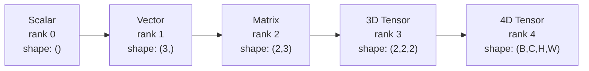
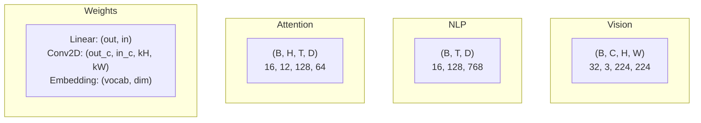
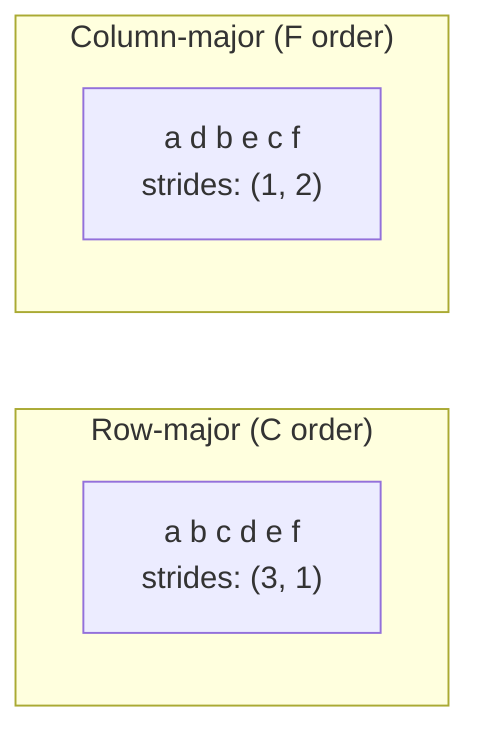
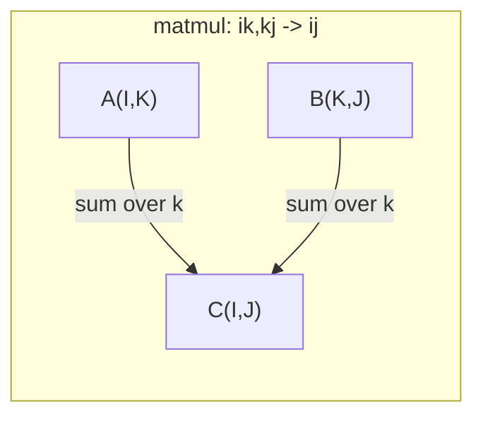

# Các thao tác trên Tensor

> Tensor là ngôn ngữ chung giữa dữ liệu và deep learning. Mọi hình ảnh, mọi câu văn, mọi gradient đều chảy qua chúng.

**Type:** Build
**Language:** Python
**Prerequisites:** Phase 1, Lessons 01 (Linear Algebra Intuition), 02 (Vectors, Matrices & Operations)
**Time:** ~90 minutes

## Learning Objectives

- Triển khai một lớp tensor với shape, strides, reshape, transpose, và các phép toán element-wise từ đầu
- Áp dụng các quy tắc broadcasting để thao tác trên các tensor có shape khác nhau mà không cần sao chép dữ liệu
- Viết các biểu thức einsum cho dot product, nhân ma trận, outer product, và các thao tác theo batch
- Theo dõi chính xác shape của tensor qua từng bước của multi-head attention

## The Problem

Bạn xây dựng một transformer. Forward pass trông có vẻ ổn. Bạn chạy nó và nhận được: `RuntimeError: mat1 and mat2 shapes cannot be multiplied (32x768 and 512x768)`. Bạn nhìn chằm chằm vào các shape. Bạn thử dùng transpose. Bây giờ nó báo `Expected 4D input (got 3D input)`. Bạn thêm một unsqueeze. Một thứ khác lại hỏng.

Lỗi shape là loại bug phổ biến nhất trong code deep learning. Chúng không khó về mặt khái niệm -- mỗi phép toán đều có một "hợp đồng" về shape -- nhưng chúng nhân lên rất nhanh. Một transformer có hàng tá các thao tác reshape, transpose, và broadcast chuỗi lại với nhau. Chỉ cần một trục (axis) sai là lỗi sẽ lan truyền (cascade). Tệ hơn, một số lỗi shape không hề báo lỗi. Chúng âm thầm tạo ra kết quả rác bằng cách broadcasting sai chiều hoặc tính tổng (sum) sai trục.

Ma trận xử lý các mối quan hệ cặp giữa hai tập hợp thực thể. Dữ liệu thực tế không gói gọn trong hai chiều. Một batch gồm 32 ảnh RGB kích thước 224x224 là một tensor 4D: `(32, 3, 224, 224)`. Self-attention với 12 head cũng là 4D: `(batch, heads, seq_len, head_dim)`. Bạn cần một cấu trúc dữ liệu tổng quát hóa cho bất kỳ số chiều nào, với các phép toán kết hợp mượt mà trên tất cả các chiều đó. Cấu trúc đó chính là tensor. Làm chủ các thao tác trên nó, và các lỗi shape sẽ trở nên cực kỳ dễ debug.

## The Concept

### Tensor là gì

Một tensor là một mảng đa chiều chứa các con số với kiểu dữ liệu đồng nhất. Số chiều được gọi là **rank** (hoặc **order**). Mỗi chiều là một **axis**. **Shape** là một tuple liệt kê kích thước dọc theo mỗi trục.



Tổng số phần tử = tích của tất cả các kích thước. Một shape `(2, 3, 4)` chứa `2 * 3 * 4 = 24` phần tử.

### Shape của tensor trong deep learning

Các loại dữ liệu khác nhau được ánh xạ tới các shape tensor cụ thể theo quy ước.



PyTorch sử dụng NCHW (channels-first). TensorFlow mặc định dùng NHWC (channels-last). Việc sai lệch layout gây ra tình trạng chậm chạp hoặc lỗi ngầm.

### Cách bố trí bộ nhớ hoạt động

Một mảng 2D trong bộ nhớ là một chuỗi byte 1D. **Strides** cho bạn biết cần nhảy qua bao nhiêu phần tử để di chuyển một bước dọc theo mỗi trục.



Transpose không di chuyển dữ liệu. Nó hoán đổi các strides, làm cho tensor trở nên **non-contiguous** (không liên tục) -- các phần tử của một hàng không còn nằm cạnh nhau trong bộ nhớ.

### Quy tắc Broadcasting

Broadcasting cho phép bạn thao tác trên các tensor có shape khác nhau mà không cần sao chép dữ liệu. Căn chỉnh các shape từ bên phải. Hai chiều là tương thích khi chúng bằng nhau hoặc một trong hai bằng 1. Các chiều ít hơn sẽ được đệm bằng số 1 ở bên trái.

```
Tensor A:     (8, 1, 6, 1)
Tensor B:        (7, 1, 5)
Padded B:     (1, 7, 1, 5)
Result:       (8, 7, 6, 5)
```

### Einsum: phép toán tensor vạn năng

Einstein summation gán nhãn cho mỗi trục bằng một chữ cái. Các trục xuất hiện ở đầu vào nhưng không có ở đầu ra sẽ được tính tổng (summed). Các trục xuất hiện ở cả hai sẽ được giữ lại.



Các pattern chính: `i,i->` (dot product), `i,j->ij` (outer product), `ii->` (trace), `ij->ji` (transpose), `bij,bjk->bik` (batch matmul), `bhtd,bhsd->bhts` (attention scores).

```figure
tensor-broadcast
```

## Build It

Code nằm trong `code/tensors.py`. Mỗi bước đều tham chiếu đến phần triển khai ở đó.

### Bước 1: Lưu trữ tensor và strides

Một tensor lưu trữ một danh sách phẳng các con số cùng với metadata về shape. Strides cho logic lập chỉ mục (indexing) biết cách ánh xạ các chỉ số đa chiều sang các vị trí phẳng.

```python
class Tensor:
    def __init__(self, data, shape=None):
        if isinstance(data, (list, tuple)):
            self._data, self._shape = self._flatten_nested(data)
        elif isinstance(data, np.ndarray):
            self._data = data.flatten().tolist()
            self._shape = tuple(data.shape)
        else:
            self._data = [data]
            self._shape = ()

        if shape is not None:
            total = reduce(lambda a, b: a * b, shape, 1)
            if total != len(self._data):
                raise ValueError(
                    f"Cannot reshape {len(self._data)} elements into shape {shape}"
                )
            self._shape = tuple(shape)

        self._strides = self._compute_strides(self._shape)

    @staticmethod
    def _compute_strides(shape):
        if len(shape) == 0:
            return ()
        strides = [1] * len(shape)
        for i in range(len(shape) - 2, -1, -1):
            strides[i] = strides[i + 1] * shape[i + 1]
        return tuple(strides)
```

Với shape `(3, 4)`, strides là `(4, 1)` -- nhảy qua 4 phần tử để tiến tới hàng tiếp theo, nhảy qua 1 phần tử để tiến tới cột tiếp theo.

### Bước 2: Reshape, squeeze, unsqueeze

Reshape thay đổi shape mà không thay đổi thứ tự phần tử. Tổng số phần tử phải giữ nguyên. Sử dụng `-1` cho một chiều để tự động suy luận kích thước của nó.

```python
t = Tensor(list(range(12)), shape=(2, 6))
r = t.reshape((3, 4))
r = t.reshape((-1, 3))
```

Squeeze loại bỏ các trục có kích thước bằng 1. Unsqueeze chèn thêm một trục. Unsqueezing rất quan trọng cho broadcasting -- một bias vector `(D,)` cộng vào một batch `(B, T, D)` cần được unsqueeze thành `(1, 1, D)`.

```python
t = Tensor(list(range(6)), shape=(1, 3, 1, 2))
s = t.squeeze()
v = Tensor([1, 2, 3])
u = v.unsqueeze(0)
```

### Bước 3: Transpose và permute

Transpose hoán đổi hai trục. Permute sắp xếp lại tất cả các trục. Đây là cách bạn chuyển đổi giữa NCHW và NHWC.

```python
mat = Tensor(list(range(6)), shape=(2, 3))
tr = mat.transpose(0, 1)

t4d = Tensor(list(range(24)), shape=(1, 2, 3, 4))
perm = t4d.permute((0, 2, 3, 1))
```

Sau khi transpose hoặc permute, tensor sẽ không liên tục (non-contiguous) trong bộ nhớ. Trong PyTorch, `view` sẽ thất bại trên các tensor không liên tục -- hãy sử dụng `reshape` hoặc gọi `.contiguous()` trước.

### Bước 4: Các phép toán element-wise và reduction

Các phép toán element-wise (add, multiply, subtract) áp dụng độc lập cho từng phần tử và bảo toàn shape. Các phép toán reduction (sum, mean, max) làm xẹp (collapse) một hoặc nhiều trục.

```python
a = Tensor([[1, 2], [3, 4]])
b = Tensor([[10, 20], [30, 40]])
c = a + b
d = a * 2
s = a.sum(axis=0)
```

Global average pooling trong một CNN: `(B, C, H, W).mean(axis=[2, 3])` tạo ra `(B, C)`. Sequence mean pooling trong NLP: `(B, T, D).mean(axis=1)` tạo ra `(B, D)`.

### Bước 5: Broadcasting với NumPy

Hàm `demo_broadcasting_numpy()` trong `tensors.py` trình bày các pattern cốt lõi.

```python
activations = np.random.randn(4, 3)
bias = np.array([0.1, 0.2, 0.3])
result = activations + bias

images = np.random.randn(2, 3, 4, 4)
scale = np.array([0.5, 1.0, 1.5]).reshape(1, 3, 1, 1)
result = images * scale

a = np.array([1, 2, 3]).reshape(-1, 1)
b = np.array([10, 20, 30, 40]).reshape(1, -1)
outer = a * b
```

Khoảng cách từng cặp (pairwise distance) thông qua broadcasting: reshape `(M, 2)` thành `(M, 1, 2)` và `(N, 2)` thành `(1, N, 2)`, trừ, bình phương, tính tổng dọc theo trục cuối cùng, lấy căn bậc hai. Kết quả: `(M, N)`.

### Bước 6: Các phép toán Einsum

Các hàm `demo_einsum()` và `demo_einsum_gallery()` đi qua mọi pattern phổ biến.

```python
a = np.array([1.0, 2.0, 3.0])
b = np.array([4.0, 5.0, 6.0])
dot = np.einsum("i,i->", a, b)

A = np.array([[1, 2], [3, 4], [5, 6]], dtype=float)
B = np.array([[7, 8, 9], [10, 11, 12]], dtype=float)
matmul = np.einsum("ik,kj->ij", A, B)

batch_A = np.random.randn(4, 3, 5)
batch_B = np.random.randn(4, 5, 2)
batch_mm = np.einsum("bij,bjk->bik", batch_A, batch_B)
```

Chi phí tính toán của một phép contraction là tích của tất cả các kích thước chỉ số (cả phần giữ lại và phần tính tổng). Đối với `bij,bjk->bik` với B=32, I=128, J=64, K=128: `32 * 128 * 64 * 128 = 33,554,432` phép nhân-cộng (multiply-adds).

### Bước 7: Cơ chế Attention qua einsum

Hàm `demo_attention_einsum()` triển khai multi-head attention từ đầu đến cuối.

```python
B, H, T, D = 2, 4, 8, 16
E = H * D

X = np.random.randn(B, T, E)
W_q = np.random.randn(E, E) * 0.02

Q = np.einsum("bte,ek->btk", X, W_q)
Q = Q.reshape(B, T, H, D).transpose(0, 2, 1, 3)

scores = np.einsum("bhtd,bhsd->bhts", Q, K) / np.sqrt(D)
weights = softmax(scores, axis=-1)
attn_output = np.einsum("bhts,bhsd->bhtd", weights, V)

concat = attn_output.transpose(0, 2, 1, 3).reshape(B, T, E)
output = np.einsum("bte,ek->btk", concat, W_o)
```

Mỗi bước là một thao tác tensor: projection (matmul qua einsum), head splitting (reshape + transpose), attention scores (batch matmul qua einsum), weighted sum (batch matmul qua einsum), head merging (transpose + reshape), output projection (matmul qua einsum).

## Use It

### Scratch vs NumPy

| Phép toán | Scratch (Lớp Tensor) | NumPy |
|---|---|---|
| Tạo | `Tensor([[1,2],[3,4]])` | `np.array([[1,2],[3,4]])` |
| Reshape | `t.reshape((3,4))` | `a.reshape(3,4)` |
| Transpose | `t.transpose(0,1)` | `a.T` hoặc `a.transpose(0,1)` |
| Squeeze | `t.squeeze(0)` | `np.squeeze(a, 0)` |
| Tổng (Sum) | `t.sum(axis=0)` | `a.sum(axis=0)` |
| Einsum | N/A | `np.einsum("ij,jk->ik", a, b)` |

### Scratch vs PyTorch

```python
import torch

t = torch.tensor([[1, 2, 3], [4, 5, 6]], dtype=torch.float32)
t.shape
t.stride()
t.is_contiguous()

t.reshape(3, 2)
t.unsqueeze(0)
t.transpose(0, 1)
t.transpose(0, 1).contiguous()

torch.einsum("ik,kj->ij", A, B)
```

PyTorch bổ sung thêm autograd, hỗ trợ GPU, và các kernel BLAS đã được tối ưu hóa. Các ngữ nghĩa về shape là giống hệt nhau. Nếu bạn hiểu phiên bản tự viết (scratch), các lỗi shape trong PyTorch sẽ trở nên dễ đọc.

### Mọi lớp mạng thần kinh dưới dạng thao tác tensor

| Phép toán | Dạng Tensor | Einsum |
|---|---|---|
| Lớp Linear | `Y = X @ W.T + b` | `"bd,od->bo"` + bias |
| Attention QKV | `Q = X @ W_q` | `"btd,dh->bth"` |
| Điểm Attention | `Q @ K.T / sqrt(d)` | `"bhtd,bhsd->bhts"` |
| Đầu ra Attention | `softmax(scores) @ V` | `"bhts,bhsd->bhtd"` |
| Batch norm | `(X - mu) / sigma * gamma` | element-wise + broadcast |
| Softmax | `exp(x) / sum(exp(x))` | element-wise + reduction |

## Ship It

Bài học này tạo ra hai prompt có thể tái sử dụng:

1. **`outputs/prompt-tensor-shapes.md`** -- Một prompt hệ thống để debug lỗi không khớp shape tensor. Bao gồm các bảng quyết định cho mọi phép toán phổ biến (matmul, broadcast, cat, Linear, Conv2d, BatchNorm, softmax) và một bảng tra cứu cách sửa.

2. **`outputs/prompt-tensor-debugger.md`** -- Một prompt debug từng bước mà bạn có thể dán vào bất kỳ trợ lý AI nào khi bị kẹt bởi lỗi shape. Cung cấp cho nó thông báo lỗi và shape tensor của bạn, nó sẽ trả về cách sửa chính xác.

## Exercises

1. **Dễ -- Vòng lặp Reshape.** Lấy một tensor có shape `(2, 3, 4)`. Reshape nó thành `(6, 4)`, sau đó thành `(24,)`, rồi quay lại `(2, 3, 4)`. Kiểm tra xem thứ tự phần tử có được bảo toàn ở mỗi bước hay không bằng cách in dữ liệu phẳng.

2. **Trung bình -- Triển khai broadcasting.** Mở rộng lớp `Tensor` với phương thức `broadcast_to(shape)` để mở rộng các chiều có kích thước bằng 1 cho khớp với shape mục tiêu. Sau đó sửa đổi `_elementwise_op` để tự động broadcast trước khi thực hiện phép toán. Kiểm tra với các shape `(3, 1)` và `(1, 4)` để tạo ra `(3, 4)`.

3. **Khó -- Xây dựng einsum từ đầu.** Triển khai một hàm `einsum(subscripts, *tensors)` cơ bản xử lý ít nhất: dot product (`i,i->`), nhân ma trận (`ij,jk->ik`), outer product (`i,j->ij`), và transpose (`ij->ji`). Phân tích chuỗi subscript, xác định các chỉ số bị co (contracted indices), và lặp qua tất cả các tổ hợp chỉ số. So sánh kết quả của bạn với `np.einsum`.

4. **Khó -- Trình theo dõi shape của Attention.** Viết một hàm nhận `batch_size`, `seq_len`, `embed_dim`, và `num_heads` làm đầu vào và in ra shape chính xác tại mỗi bước của multi-head attention: input, Q/K/V projection, head split, attention scores, softmax weights, weighted sum, head merge, output projection. Kiểm tra đối chiếu với đầu ra của `demo_attention_einsum()`.

## Key Terms

| Thuật ngữ | Mọi người thường nói | Ý nghĩa thực sự |
|---|---|---|
| Tensor | "Một ma trận nhưng nhiều chiều hơn" | Một mảng đa chiều với kiểu dữ liệu đồng nhất và shape, strides, các phép toán được xác định rõ ràng |
| Rank | "Số chiều" | Số lượng trục (axes). Một ma trận có rank 2, không phải rank bằng với hạng ma trận (matrix rank) của nó |
| Shape | "Kích thước của tensor" | Một tuple liệt kê kích thước dọc theo mỗi trục. `(2, 3)` nghĩa là 2 hàng, 3 cột |
| Stride | "Cách bộ nhớ được bố trí" | Số lượng phần tử cần bỏ qua để tiến tới một vị trí dọc theo mỗi trục |
| Broadcasting | "Nó tự hoạt động khi shape khác nhau" | Một tập hợp các quy tắc nghiêm ngặt: căn chỉnh từ bên phải, các chiều phải bằng nhau hoặc một trong hai phải bằng 1 |
| Contiguous | "Tensor bình thường" | Các phần tử được lưu trữ tuần tự trong bộ nhớ, không có khoảng trống hoặc bị thay đổi thứ tự so với layout logic |
| Einsum | "Một cách viết matmul kiểu cách" | Một ký hiệu tổng quát biểu diễn bất kỳ phép tensor contraction, outer product, trace, hoặc transpose nào chỉ trong một dòng |
| View | "Giống như reshape" | Một tensor chia sẻ cùng một bộ đệm bộ nhớ (memory buffer) nhưng với metadata về shape/stride khác nhau. Thất bại trên dữ liệu không liên tục (non-contiguous) |
| Contraction | "Tính tổng trên một chỉ số" | Phép toán tổng quát trong đó một chỉ số chung giữa các tensor được nhân và tính tổng, tạo ra kết quả có rank thấp hơn |
| NCHW / NHWC | "Định dạng PyTorch vs TensorFlow" | Các quy ước bố trí bộ nhớ cho tensor hình ảnh. NCHW đặt channels trước các chiều không gian, NHWC đặt chúng ở sau |

## Further Reading

- [NumPy Broadcasting](https://numpy.org/doc/stable/user/basics.broadcasting.html) -- Các quy tắc chuẩn với ví dụ trực quan
- [PyTorch Tensor Views](https://pytorch.org/docs/stable/tensor_view.html) -- Khi nào view hoạt động và khi nào nó thực hiện copy
- [einops](https://github.com/arogozhnikov/einops) -- Một thư viện giúp việc reshape tensor trở nên dễ đọc và an toàn
- [The Illustrated Transformer](https://jalammar.github.io/illustrated-transformer/) -- Trực quan hóa các shape tensor chảy qua attention
- [Einstein Summation in NumPy](https://numpy.org/doc/stable/reference/generated/numpy.einsum.html) -- Tài liệu einsum đầy đủ kèm ví dụ