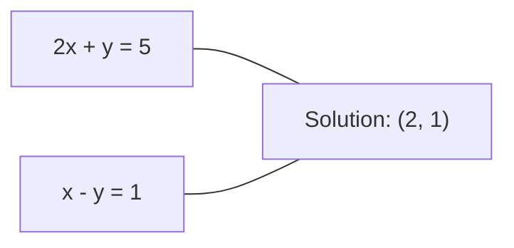
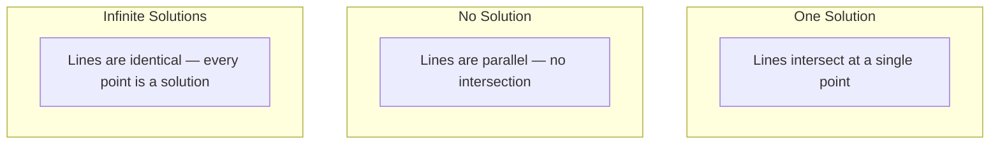

# Hệ thống tuyến tính

> Giải Ax = b là bài toán cổ xưa nhất trong toán học vẫn đang vận hành mạng thần kinh của bạn.

**Type:** Build
**Language:** Python
**Prerequisites:** Giai đoạn 1, Bài 01 (Trực giác về Đại số tuyến tính), 02 (Vector & Ma trận), 03 (Biến đổi ma trận)
**Time:** ~120 phút

## Mục tiêu học tập

- Giải Ax = b bằng phương pháp khử Gaussian với kỹ thuật partial pivoting và thế ngược (back substitution)
- Phân rã ma trận bằng các phương pháp LU, QR, và Cholesky, đồng thời giải thích khi nào nên sử dụng từng phương pháp
- Suy luận các phương trình chuẩn (normal equations) cho bình phương tối thiểu (least squares) và kết nối chúng với hồi quy tuyến tính và ridge regression
- Chẩn đoán các hệ thống bị bệnh (ill-conditioned) bằng số điều kiện (condition number) và áp dụng chính quy hóa (regularization) để ổn định chúng

## Vấn đề

Mỗi khi bạn huấn luyện một mô hình hồi quy tuyến tính, bạn đang giải một hệ thống tuyến tính. Mỗi khi bạn tính toán một khớp bình phương tối thiểu, bạn đang giải một hệ thống tuyến tính. Mỗi khi một lớp mạng thần kinh tính toán `y = Wx + b`, nó đang đánh giá một vế của hệ thống tuyến tính. Khi bạn thêm chính quy hóa, bạn sửa đổi hệ thống đó. Khi bạn sử dụng Gaussian processes, bạn phân rã một ma trận. Khi bạn nghịch đảo một ma trận hiệp phương sai cho khoảng cách Mahalanobis, bạn đang giải một hệ thống tuyến tính.

Phương trình Ax = b xuất hiện ở khắp mọi nơi. A là ma trận các hệ số đã biết. b là vector các đầu ra đã biết. x là vector các ẩn số bạn cần tìm. Trong hồi quy tuyến tính, A là ma trận dữ liệu, b là vector mục tiêu, và x là vector trọng số. Toàn bộ mô hình quy về: tìm x sao cho Ax gần với b nhất có thể.

Bài học này xây dựng mọi phương pháp chính để giải phương trình đó từ đầu. Bạn sẽ hiểu tại sao một số phương pháp nhanh và một số khác ổn định, tại sao một số chỉ hoạt động với hệ thống vuông còn số khác xử lý được hệ thống thừa biến (overdetermined), và tại sao số điều kiện của ma trận lại quyết định liệu câu trả lời của bạn có ý nghĩa hay không.

## Khái niệm

### Ý nghĩa hình học của Ax = b

Một hệ phương trình tuyến tính có cách giải thích hình học. Mỗi phương trình xác định một siêu phẳng (hyperplane). Nghiệm là điểm (hoặc tập hợp các điểm) nơi tất cả các siêu phẳng giao nhau.

```
2x + y = 5          Two lines in 2D.
x - y  = 1          They intersect at x=2, y=1.
```



Ba trường hợp có thể xảy ra:



Ở dạng ma trận, "một nghiệm" nghĩa là A khả nghịch. "Không có nghiệm" nghĩa là hệ thống không nhất quán. "Vô số nghiệm" nghĩa là A có không gian rỗng (null space). Hầu hết các bài toán ML rơi vào loại "không có nghiệm chính xác" vì bạn có nhiều phương trình (điểm dữ liệu) hơn ẩn số (tham số). Đó là lúc phương pháp bình phương tối thiểu xuất hiện.

### Góc nhìn cột so với góc nhìn hàng

Có hai cách để đọc Ax = b.

**Góc nhìn hàng.** Mỗi hàng của A xác định một phương trình. Mỗi phương trình là một siêu phẳng. Nghiệm là nơi tất cả chúng giao nhau.

**Góc nhìn cột.** Mỗi cột của A là một vector. Câu hỏi trở thành: tổ hợp tuyến tính nào của các cột trong A tạo ra b?

```
A = | 2  1 |    b = | 5 |
    | 1 -1 |        | 1 |

Row picture: solve 2x + y = 5 and x - y = 1 simultaneously.

Column picture: find x1, x2 such that:
  x1 * [2, 1] + x2 * [1, -1] = [5, 1]
  2 * [2, 1] + 1 * [1, -1] = [4+1, 2-1] = [5, 1]   check.
```

Góc nhìn cột mang tính nền tảng hơn. Nếu b nằm trong không gian cột của A, hệ thống có nghiệm. Nếu không, bạn tìm điểm gần nhất trong không gian cột. Điểm gần nhất đó chính là nghiệm bình phương tối thiểu.

### Khử Gaussian

Khử Gaussian biến đổi Ax = b thành một hệ tam giác trên Ux = c mà bạn có thể giải bằng cách thế ngược. Đây là phương pháp trực tiếp nhất.

Thuật toán:

```
1. For each column k (the pivot column):
   a. Find the largest entry in column k at or below row k (partial pivoting).
   b. Swap that row with row k.
   c. For each row i below k:
      - Compute multiplier m = A[i][k] / A[k][k]
      - Subtract m times row k from row i.
2. Back substitute: solve from the last equation upward.
```

Ví dụ:

```
Original:
| 2  1  1 | 8 |       R2 = R2 - (2)R1     | 2  1   1 |  8 |
| 4  3  3 |20 |  -->  R3 = R3 - (1)R1 --> | 0  1   1 |  4 |
| 2  3  1 |12 |                            | 0  2   0 |  4 |

                       R3 = R3 - (2)R2     | 2  1   1 |  8 |
                                       --> | 0  1   1 |  4 |
                                           | 0  0  -2 | -4 |

Back substitute:
  -2 * x3 = -4    -->  x3 = 2
  x2 + 2  = 4     -->  x2 = 2
  2*x1 + 2 + 2 = 8 --> x1 = 2
```

Khử Gaussian tốn O(n^3) phép tính. Với hệ 1000x1000, đó là khoảng một tỷ phép tính dấu phẩy động. Nhanh, nhưng bạn có thể làm tốt hơn nếu cần giải nhiều hệ thống với cùng một ma trận A.

### Partial pivoting: tại sao nó quan trọng

Nếu không có pivoting, khử Gaussian có thể thất bại hoặc tạo ra kết quả sai lệch. Nếu phần tử trục (pivot) bằng 0, bạn sẽ chia cho 0. Nếu nó quá nhỏ, bạn sẽ khuếch đại sai số làm tròn.

```
Bad pivot:                       With partial pivoting:
| 0.001  1 | 1.001 |            Swap rows first:
| 1      1 | 2     |            | 1      1 | 2     |
                                 | 0.001  1 | 1.001 |
m = 1/0.001 = 1000              m = 0.001/1 = 0.001
R2 = R2 - 1000*R1               R2 = R2 - 0.001*R1
| 0.001  1     | 1.001   |      | 1      1     | 2     |
| 0     -999   | -999.0  |      | 0      0.999 | 0.999 |

x2 = 1.000 (correct)            x2 = 1.000 (correct)
x1 = (1.001 - 1)/0.001          x1 = (2 - 1)/1 = 1.000 (correct)
   = 0.001/0.001 = 1.000        Stable because the multiplier is small.
```

Trong số học dấu phẩy động với độ chính xác giới hạn, phiên bản không có pivoting có thể làm mất các chữ số quan trọng. Partial pivoting luôn chọn phần tử trục lớn nhất hiện có để giảm thiểu việc khuếch đại sai số.

### Phân rã LU

Phân rã LU tách A thành một ma trận tam giác dưới L và một ma trận tam giác trên U: A = LU. Ma trận L lưu trữ các hệ số nhân từ quá trình khử Gaussian. Ma trận U là kết quả của quá trình khử.

```
A = L @ U

| 2  1  1 |   | 1  0  0 |   | 2  1   1 |
| 4  3  3 | = | 2  1  0 | @ | 0  1   1 |
| 2  3  1 |   | 1  2  1 |   | 0  0  -2 |
```

Tại sao phải phân rã thay vì chỉ khử? Vì một khi bạn có L và U, việc giải Ax = b cho bất kỳ vector b mới nào chỉ tốn O(n^2):

```
Ax = b
LUx = b
Let y = Ux:
  Ly = b    (forward substitution, O(n^2))
  Ux = y    (back substitution, O(n^2))
```

Chi phí O(n^3) chỉ trả một lần trong quá trình phân rã. Mọi lần giải tiếp theo đều là O(n^2). Nếu bạn cần giải 1000 hệ thống với cùng ma trận A nhưng các vector b khác nhau, LU giúp tiết kiệm một hệ số 1000/3 tổng khối lượng công việc.

Với partial pivoting, bạn nhận được PA = LU, trong đó P là ma trận hoán vị ghi lại các lần đổi hàng.

### Phân rã QR

Phân rã QR tách A thành một ma trận trực giao Q và một ma trận tam giác trên R: A = QR.

Một ma trận trực giao có tính chất Q^T Q = I. Các cột của nó là các vector trực chuẩn. Nhân với Q giúp bảo toàn độ dài và góc.

```
A = Q @ R

Q has orthonormal columns: Q^T Q = I
R is upper triangular

To solve Ax = b:
  QRx = b
  Rx = Q^T b    (just multiply by Q^T, no inversion needed)
  Back substitute to get x.
```

QR ổn định về mặt số học hơn LU khi giải các bài toán bình phương tối thiểu. Quá trình Gram-Schmidt xây dựng Q theo từng cột:

```
Given columns a1, a2, ... of A:

q1 = a1 / ||a1||

q2 = a2 - (a2 . q1) * q1        (subtract projection onto q1)
q2 = q2 / ||q2||                (normalize)

q3 = a3 - (a3 . q1) * q1 - (a3 . q2) * q2
q3 = q3 / ||q3||

R[i][j] = qi . aj    for i <= j
```

Mỗi bước loại bỏ thành phần dọc theo tất cả các vector q trước đó, chỉ để lại hướng trực giao mới.

### Phân rã Cholesky

Khi A đối xứng (A = A^T) và xác định dương (tất cả các trị riêng đều dương), bạn có thể phân rã nó thành A = L L^T, trong đó L là ma trận tam giác dưới. Đây là phân rã Cholesky.

```
A = L @ L^T

| 4  2 |   | 2  0 |   | 2  1 |
| 2  5 | = | 1  2 | @ | 0  2 |

L[i][i] = sqrt(A[i][i] - sum(L[i][k]^2 for k < i))
L[i][j] = (A[i][j] - sum(L[i][k]*L[j][k] for k < j)) / L[j][j]    for i > j
```

Cholesky nhanh gấp đôi LU và chỉ tốn một nửa bộ nhớ. Nó chỉ hoạt động với các ma trận đối xứng xác định dương, nhưng chúng xuất hiện liên tục:

- Ma trận hiệp phương sai là đối xứng xác định không âm (xác định dương khi có chính quy hóa).
- Ma trận nhân (kernel matrix) trong Gaussian processes là đối xứng xác định dương.
- Hessian của một hàm lồi tại điểm cực tiểu là đối xứng xác định dương.
- A^T A luôn là đối xứng xác định không âm.

Trong Gaussian processes, bạn phân rã ma trận nhân K bằng Cholesky, sau đó giải K alpha = y để có giá trị dự đoán trung bình. Nhân tử Cholesky cũng cho bạn log-định thức cho marginal likelihood: log det(K) = 2 * sum(log(diag(L))).

### Bình phương tối thiểu: khi Ax = b không có nghiệm chính xác

Nếu A có kích thước m x n với m > n (nhiều phương trình hơn ẩn số), hệ thống bị thừa biến. Không có nghiệm chính xác. Thay vào đó, bạn tối thiểu hóa sai số bình phương:

```
minimize ||Ax - b||^2

This is the sum of squared residuals:
  sum((A[i,:] @ x - b[i])^2 for i in range(m))
```

Nghiệm tối ưu thỏa mãn các phương trình chuẩn:

```
A^T A x = A^T b
```

Suy luận: khai triển ||Ax - b||^2 = (Ax - b)^T (Ax - b) = x^T A^T A x - 2 x^T A^T b + b^T b. Lấy gradient theo x và đặt bằng 0: 2 A^T A x - 2 A^T b = 0.

```
Original system (overdetermined, 4 equations, 2 unknowns):
| 1  1 |         | 3 |
| 1  2 | x     = | 5 |       No exact x satisfies all 4 equations.
| 1  3 |         | 6 |
| 1  4 |         | 8 |

Normal equations:
A^T A = | 4  10 |    A^T b = | 22 |
        | 10 30 |            | 63 |

Solve: x = [1.5, 1.7]

This is linear regression. x[0] is the intercept, x[1] is the slope.
```

### Phương trình chuẩn = hồi quy tuyến tính

Mối liên hệ là chính xác. Trong hồi quy tuyến tính, ma trận dữ liệu X của bạn có một hàng cho mỗi mẫu và một cột cho mỗi đặc trưng. Vector mục tiêu y có một phần tử cho mỗi mẫu. Vector trọng số w thỏa mãn:

```
X^T X w = X^T y
w = (X^T X)^(-1) X^T y
```

Đây là nghiệm dạng đóng (closed-form) của hồi quy tuyến tính. Mọi lệnh gọi `sklearn.linear_model.LinearRegression.fit()` đều tính toán điều này (hoặc một phương thức tương đương qua QR hoặc SVD).

Thêm một số hạng chính quy hóa lambda * I vào ma trận và bạn có ridge regression:

```
(X^T X + lambda * I) w = X^T y
w = (X^T X + lambda * I)^(-1) X^T y
```

Chính quy hóa làm cho ma trận có điều kiện tốt hơn (dễ nghịch đảo chính xác hơn) và ngăn chặn quá khớp (overfitting) bằng cách thu nhỏ các trọng số về phía 0. Ma trận X^T X + lambda * I luôn đối xứng xác định dương khi lambda > 0, vì vậy bạn có thể sử dụng Cholesky để giải nó.

### Nghịch đảo giả (Moore-Penrose)

Nghịch đảo giả A+ tổng quát hóa phép nghịch đảo ma trận cho các ma trận không vuông và suy biến. Với bất kỳ ma trận A nào:

```
x = A+ b

where A+ = V Sigma+ U^T    (computed via SVD)
```

Sigma+ được hình thành bằng cách lấy nghịch đảo của mỗi giá trị kỳ dị khác 0 và chuyển vị kết quả. Nếu A = U Sigma V^T, thì A+ = V Sigma+ U^T.

```
A = U Sigma V^T        (SVD)

Sigma = | 5  0 |       Sigma+ = | 1/5  0  0 |
        | 0  2 |                | 0  1/2  0 |
        | 0  0 |

A+ = V Sigma+ U^T
```

Nghịch đảo giả cung cấp nghiệm bình phương tối thiểu có chuẩn nhỏ nhất. Nếu hệ thống có:
- Một nghiệm: A+ b sẽ cho nghiệm đó.
- Không có nghiệm: A+ b cho nghiệm bình phương tối thiểu.
- Vô số nghiệm: A+ b cho nghiệm có ||x|| nhỏ nhất.

Cả `np.linalg.lstsq` và `np.linalg.pinv` của NumPy đều sử dụng SVD bên trong.

### Số điều kiện (Condition number)

Số điều kiện đo lường mức độ nhạy cảm của nghiệm đối với những thay đổi nhỏ trong đầu vào. Với ma trận A, số điều kiện là:

```
kappa(A) = ||A|| * ||A^(-1)|| = sigma_max / sigma_min
```

trong đó sigma_max và sigma_min là các giá trị kỳ dị lớn nhất và nhỏ nhất.

```
Well-conditioned (kappa ~ 1):        Ill-conditioned (kappa ~ 10^15):
Small change in b -->                Small change in b -->
small change in x                    huge change in x

| 2  0 |   kappa = 2/1 = 2          | 1   1          |   kappa ~ 10^15
| 0  1 |   safe to solve            | 1   1+10^(-15) |   solution is garbage
```

Quy tắc ngón tay cái:
- kappa < 100: an toàn, nghiệm chính xác.
- kappa ~ 10^k: bạn mất khoảng k chữ số độ chính xác từ số học dấu phẩy động.
- kappa ~ 10^16 (cho float64): nghiệm vô nghĩa. Ma trận thực tế là suy biến.

Trong ML, tình trạng bệnh (ill-conditioning) xảy ra khi các đặc trưng gần như cộng tuyến. Chính quy hóa (thêm lambda * I) cải thiện số điều kiện từ sigma_max / sigma_min thành (sigma_max + lambda) / (sigma_min + lambda).

### Các phương pháp lặp: conjugate gradient

Đối với các hệ thống thưa thớt rất lớn (hàng triệu ẩn số), các phương pháp trực tiếp như LU hoặc Cholesky quá đắt đỏ. Các phương pháp lặp xấp xỉ nghiệm bằng cách cải thiện dự đoán qua nhiều vòng lặp.

Conjugate gradient (CG) giải Ax = b khi A đối xứng xác định dương. Nó tìm nghiệm chính xác trong tối đa n vòng lặp (trong số học chính xác), nhưng thường hội tụ nhanh hơn nhiều nếu các trị riêng của A tập trung.

```
Algorithm sketch:
  x0 = initial guess (often zero)
  r0 = b - A x0           (residual)
  p0 = r0                 (search direction)

  For k = 0, 1, 2, ...:
    alpha = (rk . rk) / (pk . A pk)
    x_{k+1} = xk + alpha * pk
    r_{k+1} = rk - alpha * A pk
    beta = (r_{k+1} . r_{k+1}) / (rk . rk)
    p_{k+1} = r_{k+1} + beta * pk
    if ||r_{k+1}|| < tolerance: stop
```

CG được sử dụng trong:
- Tối ưu hóa quy mô lớn (phương pháp Newton-CG)
- Giải các phương trình đạo hàm riêng (PDE)
- Các phương pháp nhân (kernel methods) nơi ma trận nhân quá lớn để phân rã
- Tiền điều kiện (preconditioning) cho các bộ giải lặp khác

Tốc độ hội tụ phụ thuộc vào số điều kiện. Các hệ thống có điều kiện tốt hơn sẽ hội tụ nhanh hơn, đó là lý do tại sao chính quy hóa lại hữu ích.

### Bức tranh toàn cảnh: phương pháp nào khi nào

| Phương pháp | Yêu cầu | Chi phí | Trường hợp sử dụng |
|-------------|---------|---------|-------------------|
| Khử Gaussian | A vuông, không suy biến | O(n^3) | Giải một lần cho hệ vuông |
| Phân rã LU | A vuông, không suy biến | O(n^3) phân rã + O(n^2) giải | Giải nhiều lần với cùng A |
| Phân rã QR | Bất kỳ A (m >= n) | O(mn^2) | Bình phương tối thiểu, ổn định số học |
| Cholesky | A đối xứng xác định dương | O(n^3/3) | Ma trận hiệp phương sai, Gaussian processes, ridge regression |
| Phương trình chuẩn | Thừa biến (m > n) | O(mn^2 + n^3) | Hồi quy tuyến tính (n nhỏ) |
| SVD / Nghịch đảo giả | Bất kỳ A | O(mn^2) | Hệ thiếu hạng, nghiệm chuẩn nhỏ nhất |
| Conjugate gradient | A đối xứng xác định dương, thưa | O(n * k * nnz) | Hệ thưa lớn, k = số vòng lặp |

### Kết nối với ML

Mọi phương pháp trong bài học này đều xuất hiện trong ML thực tế:

**Hồi quy tuyến tính.** Nghiệm dạng đóng giải các phương trình chuẩn X^T X w = X^T y. Điều này được thực hiện qua Cholesky (nếu n nhỏ) hoặc QR (nếu độ ổn định số học quan trọng) hoặc SVD (nếu ma trận có thể thiếu hạng).

**Ridge regression.** Thêm lambda * I vào X^T X. Hệ thống đã chính quy hóa (X^T X + lambda * I) w = X^T y luôn có thể giải được qua Cholesky vì X^T X + lambda * I đối xứng xác định dương khi lambda > 0.

**Gaussian processes.** Giá trị dự đoán trung bình yêu cầu giải K alpha = y trong đó K là ma trận nhân. Phân rã Cholesky của K là cách tiếp cận tiêu chuẩn. Log marginal likelihood sử dụng log det(K) = 2 sum(log(diag(L))).

**Khởi tạo mạng thần kinh.** Khởi tạo trực giao sử dụng phân rã QR để tạo ra các ma trận trọng số có các cột trực chuẩn. Điều này ngăn chặn sự sụp đổ tín hiệu trong các mạng sâu.

**Tiền điều kiện.** Các bộ tối ưu hóa quy mô lớn sử dụng Cholesky không đầy đủ hoặc LU không đầy đủ làm bộ tiền điều kiện cho các bộ giải conjugate gradient.

**Kỹ thuật đặc trưng.** Số điều kiện của X^T X cho bạn biết liệu các đặc trưng của bạn có cộng tuyến hay không. Nếu kappa lớn, hãy loại bỏ đặc trưng hoặc thêm chính quy hóa.

```figure
linear-system-conditioning
```

## Xây dựng

### Bước 1: Khử Gaussian với partial pivoting

```python
import numpy as np

def gaussian_elimination(A, b):
    n = len(b)
    Ab = np.hstack([A.astype(float), b.reshape(-1, 1).astype(float)])

    for k in range(n):
        max_row = k + np.argmax(np.abs(Ab[k:, k]))
        Ab[[k, max_row]] = Ab[[max_row, k]]

        if abs(Ab[k, k]) < 1e-12:
            raise ValueError(f"Matrix is singular or nearly singular at pivot {k}")

        for i in range(k + 1, n):
            m = Ab[i, k] / Ab[k, k]
            Ab[i, k:] -= m * Ab[k, k:]

    x = np.zeros(n)
    for i in range(n - 1, -1, -1):
        x[i] = (Ab[i, -1] - Ab[i, i+1:n] @ x[i+1:n]) / Ab[i, i]

    return x
```

### Bước 2: Phân rã LU

```python
def lu_decompose(A):
    n = A.shape[0]
    L = np.eye(n)
    U = A.astype(float).copy()
    P = np.eye(n)

    for k in range(n):
        max_row = k + np.argmax(np.abs(U[k:, k]))
        if max_row != k:
            U[[k, max_row]] = U[[max_row, k]]
            P[[k, max_row]] = P[[max_row, k]]
            if k > 0:
                L[[k, max_row], :k] = L[[max_row, k], :k]

        for i in range(k + 1, n):
            L[i, k] = U[i, k] / U[k, k]
            U[i, k:] -= L[i, k] * U[k, k:]

    return P, L, U

def lu_solve(P, L, U, b):
    n = len(b)
    Pb = P @ b.astype(float)

    y = np.zeros(n)
    for i in range(n):
        y[i] = Pb[i] - L[i, :i] @ y[:i]

    x = np.zeros(n)
    for i in range(n - 1, -1, -1):
        x[i] = (y[i] - U[i, i+1:] @ x[i+1:]) / U[i, i]

    return x
```

### Bước 3: Phân rã Cholesky

```python
def cholesky(A):
    n = A.shape[0]
    L = np.zeros_like(A, dtype=float)

    for i in range(n):
        for j in range(i + 1):
            s = A[i, j] - L[i, :j] @ L[j, :j]
            if i == j:
                if s <= 0:
                    raise ValueError("Matrix is not positive definite")
                L[i, j] = np.sqrt(s)
            else:
                L[i, j] = s / L[j, j]

    return L
```

### Bước 4: Bình phương tối thiểu qua phương trình chuẩn

```python
def least_squares_normal(A, b):
    AtA = A.T @ A
    Atb = A.T @ b
    return gaussian_elimination(AtA, Atb)

def ridge_regression(A, b, lam):
    n = A.shape[1]
    AtA = A.T @ A + lam * np.eye(n)
    Atb = A.T @ b
    L = cholesky(AtA)
    y = np.zeros(n)
    for i in range(n):
        y[i] = (Atb[i] - L[i, :i] @ y[:i]) / L[i, i]
    x = np.zeros(n)
    for i in range(n - 1, -1, -1):
        x[i] = (y[i] - L.T[i, i+1:] @ x[i+1:]) / L.T[i, i]
    return x
```

### Bước 5: Số điều kiện

```python
def condition_number(A):
    U, S, Vt = np.linalg.svd(A)
    return S[0] / S[-1]
```

## Sử dụng

Kết hợp các mảnh ghép cho hồi quy tuyến tính và ridge regression trên dữ liệu thực tế:

```python
np.random.seed(42)
X_raw = np.random.randn(100, 3)
w_true = np.array([2.0, -1.0, 0.5])
y = X_raw @ w_true + np.random.randn(100) * 0.1

X = np.column_stack([np.ones(100), X_raw])

w_ols = least_squares_normal(X, y)
print(f"OLS weights (ours):    {w_ols}")

w_np = np.linalg.lstsq(X, y, rcond=None)[0]
print(f"OLS weights (numpy):   {w_np}")
print(f"Max difference: {np.max(np.abs(w_ols - w_np)):.2e}")

w_ridge = ridge_regression(X, y, lam=1.0)
print(f"Ridge weights (ours):  {w_ridge}")

from sklearn.linear_model import Ridge
ridge_sk = Ridge(alpha=1.0, fit_intercept=False)
ridge_sk.fit(X, y)
print(f"Ridge weights (sklearn): {ridge_sk.coef_}")
```

## Triển khai

Bài học này tạo ra:
- `code/linear_systems.py` chứa các triển khai từ đầu của khử Gaussian, phân rã LU, phân rã Cholesky, bình phương tối thiểu, và ridge regression
- Một bản demo hoạt động cho thấy các phương trình chuẩn và LinearRegression của sklearn tạo ra cùng các trọng số

## Bài tập

1. Giải hệ thống `[[1,2,3],[4,5,6],[7,8,10]] x = [6, 15, 27]` bằng khử Gaussian, bộ giải LU, và `np.linalg.solve` của bạn. Xác minh cả ba đều cho cùng một kết quả trong phạm vi sai số dấu phẩy động.

2. Tạo một ma trận ngẫu nhiên X kích thước 50x5 và mục tiêu y = X @ w_true + nhiễu. Giải w bằng phương trình chuẩn, QR (qua `np.linalg.qr`), SVD (qua `np.linalg.svd`), và `np.linalg.lstsq`. So sánh cả bốn nghiệm. Đo số điều kiện của X^T X và giải thích nó ảnh hưởng thế nào đến phương pháp bạn tin tưởng.

3. Tạo một ma trận gần như suy biến bằng cách làm cho hai cột gần như giống hệt nhau (ví dụ: cột 2 = cột 1 + 1e-10 * nhiễu). Tính số điều kiện của nó. Giải Ax = b với và không có chính quy hóa (thêm 0.01 * I). So sánh các nghiệm và phần dư. Giải thích tại sao chính quy hóa lại hữu ích.

4. Triển khai thuật toán conjugate gradient cho một ma trận ngẫu nhiên đối xứng xác định dương 100x100. Đếm số vòng lặp cần thiết để hội tụ với sai số 1e-8. So sánh với mức tối đa lý thuyết là n vòng lặp.

5. Đo thời gian bộ giải Cholesky của bạn so với bộ giải LU và `np.linalg.solve` trên các ma trận đối xứng xác định dương kích thước 10, 50, 200, 500. Vẽ biểu đồ kết quả. Xác minh Cholesky nhanh gấp khoảng 2 lần LU.

## Thuật ngữ chính

| Thuật ngữ | Cách gọi thông thường | Ý nghĩa thực tế |
|-----------|----------------------|------------------|
| Hệ tuyến tính | "Giải tìm x" | Một tập hợp các phương trình tuyến tính Ax = b. Tìm x nghĩa là tìm đầu vào tạo ra đầu ra b dưới biến đổi A. |
| Khử Gaussian | "Khử hàng" | Hệ thống hóa việc đưa các phần tử dưới đường chéo về 0 bằng các phép toán hàng, tạo ra hệ tam giác trên có thể giải bằng thế ngược. O(n^3). |
| Partial pivoting | "Đổi hàng để ổn định" | Trước khi khử ở cột k, đổi hàng có giá trị tuyệt đối lớn nhất trong cột đó vào vị trí trục. Ngăn chặn việc chia cho các số nhỏ. |
| Phân rã LU | "Phân rã thành tam giác" | Viết A = LU trong đó L là tam giác dưới (lưu các hệ số nhân) và U là tam giác trên (ma trận đã khử). Phân bổ chi phí O(n^3) cho nhiều lần giải. |
| Phân rã QR | "Phân rã trực giao" | Viết A = QR trong đó Q có các cột trực chuẩn và R là tam giác trên. Ổn định hơn LU cho bình phương tối thiểu. |
| Phân rã Cholesky | "Căn bậc hai của ma trận" | Với A đối xứng xác định dương, viết A = LL^T. Chi phí bằng một nửa LU. Dùng cho ma trận hiệp phương sai, ma trận nhân, và ridge regression. |
| Bình phương tối thiểu | "Khớp tốt nhất khi không thể chính xác" | Tối thiểu hóa tổng bình phương phần dư ||Ax - b||^2 khi hệ thống thừa biến. |
| Phương trình chuẩn | "Phím tắt giải tích" | A^T A x = A^T b. Đặt gradient của ||Ax - b||^2 bằng 0. Đây CHÍNH LÀ nghiệm dạng đóng của hồi quy tuyến tính. |
| Nghịch đảo giả | "Nghịch đảo cho ma trận không vuông" | A+ = V Sigma+ U^T qua SVD. Cho nghiệm bình phương tối thiểu có chuẩn nhỏ nhất cho bất kỳ ma trận nào. |
| Số điều kiện | "Độ tin cậy của câu trả lời" | kappa = sigma_max / sigma_min. Đo lường độ nhạy với nhiễu đầu vào. Mất khoảng log10(kappa) chữ số độ chính xác. |
| Ridge regression | "Bình phương tối thiểu chính quy hóa" | Giải (X^T X + lambda I) w = X^T y. Thêm lambda I cải thiện điều kiện và thu nhỏ trọng số về 0. Ngăn chặn quá khớp. |
| Conjugate gradient | "Ax=b lặp cho ma trận lớn" | Bộ giải lặp cho hệ đối xứng xác định dương. Hội tụ tối đa trong n bước. Thực tế cho các hệ thưa lớn nơi phân rã quá đắt. |
| Hệ thừa biến | "Nhiều dữ liệu hơn tham số" | m > n trong hệ m-by-n. Không có nghiệm chính xác. Bình phương tối thiểu tìm xấp xỉ tốt nhất. Đây là mọi bài toán hồi quy. |
| Thế ngược | "Giải từ dưới lên" | Với hệ tam giác trên, giải phương trình cuối trước, sau đó thế ngược lên. O(n^2). |
| Thế xuôi | "Giải từ trên xuống" | Với hệ tam giác dưới, giải phương trình đầu trước, sau đó thế xuôi xuống. O(n^2). Dùng trong bước L của giải LU. |

## Đọc thêm

- [MIT 18.06: Linear Algebra](https://ocw.mit.edu/courses/18-06-linear-algebra-spring-2010/) (Gilbert Strang) -- khóa học kinh điển về hệ thống tuyến tính và phân rã ma trận
- [Numerical Linear Algebra](https://people.maths.ox.ac.uk/trefethen/text.html) (Trefethen & Bau) -- tài liệu tham khảo tiêu chuẩn để hiểu về độ ổn định số học, điều kiện, và tại sao các thuật toán thất bại
- [Matrix Computations](https://www.cs.cornell.edu/cv/GolubVanLoan4/golubandvanloan.htm) (Golub & Van Loan) -- bách khoa toàn thư cho mọi thuật toán ma trận
- [3Blue1Brown: Inverse Matrices](https://www.3blue1brown.com/lessons/inverse-matrices) -- trực giác hình học về ý nghĩa của việc giải Ax = b