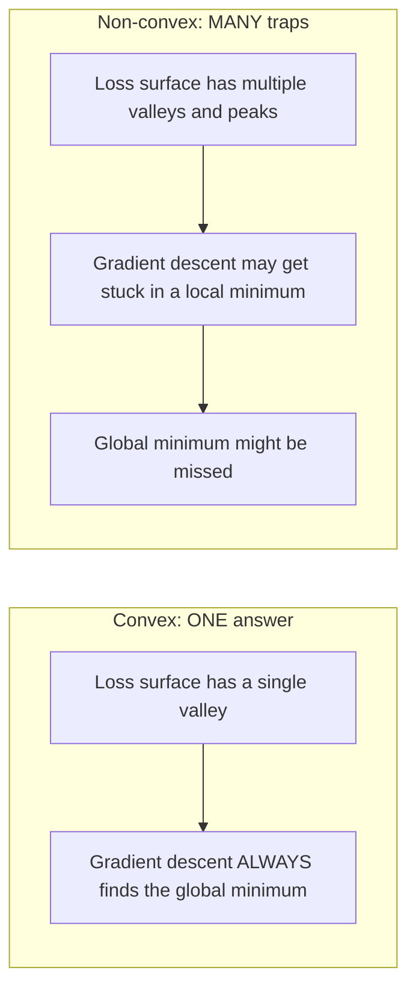
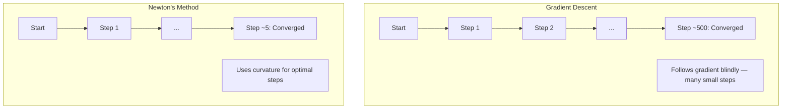
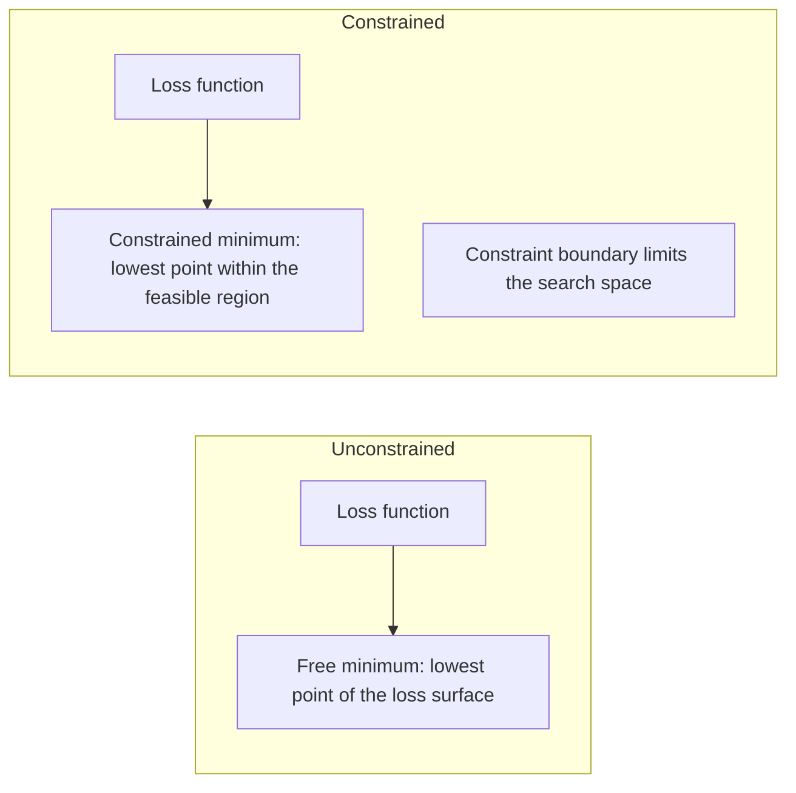
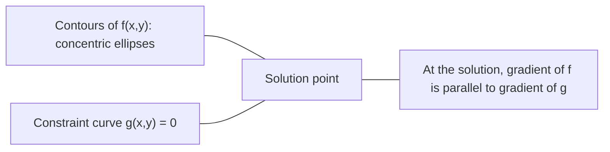

# Convex Optimization

> Các bài toán lồi chỉ có một thung lũng. Mạng nơ-ron có hàng triệu thung lũng. Việc hiểu rõ sự khác biệt này rất quan trọng.

**Type:** Build
**Language:** Python
**Prerequisites:** Phase 1, Lessons 04 (Calculus for ML), 08 (Optimization)
**Time:** ~90 minutes

## Learning Objectives

- Kiểm tra xem một hàm số có lồi hay không bằng cách sử dụng định nghĩa, đạo hàm bậc hai và tiêu chuẩn Hessian
- Triển khai phương pháp Newton và so sánh sự hội tụ bậc hai (quadratic convergence) của nó với gradient descent
- Giải các bài toán tối ưu hóa có ràng buộc bằng cách sử dụng nhân tử Lagrange và giải thích các điều kiện KKT
- Giải thích tại sao loss landscape của mạng nơ-ron là không lồi (non-convex) nhưng SGD vẫn tìm thấy các giải pháp tốt

## The Problem

Bài học 08 đã dạy bạn về gradient descent, momentum và Adam. Những bộ tối ưu hóa đó "đi xuống dốc" trên bất kỳ bề mặt nào. Nhưng chúng không đi kèm với sự đảm bảo nào cả. Gradient descent trên một địa hình không lồi có thể rơi vào một cực tiểu địa phương xấu, bị kẹt tại một điểm yên ngựa (saddle point), hoặc dao động mãi mãi. Bạn vẫn sử dụng nó vì các mạng nơ-ron là không lồi và không có giải pháp thay thế nào khác.

Nhưng nhiều bài toán trong machine learning là lồi. Linear regression, logistic regression, SVMs, LASSO, ridge regression. Đối với những bài toán này, tồn tại một thứ mạnh mẽ hơn: tối ưu hóa với các đảm bảo về mặt toán học. Một bài toán lồi có chính xác một thung lũng. Bất kỳ thuật toán nào đi xuống dốc cũng sẽ chạm tới cực tiểu toàn cục. Không cần khởi động lại (restart). Không cần lịch trình tốc độ học (learning rate schedules). Không cần cầu may.

Hiểu về tính lồi (convexity) mang lại ba lợi ích. Thứ nhất, nó cho bạn biết khi nào bài toán của bạn là dễ (lồi) so với khó (không lồi). Thứ hai, nó cung cấp cho bạn các công cụ nhanh hơn như phương pháp Newton cho các bài toán lồi. Thứ ba, nó giải thích các khái niệm xuất hiện xuyên suốt ML: regularization như một ràng buộc, tính đối ngẫu (duality) trong SVMs, và tại sao deep learning vẫn hoạt động hiệu quả mặc dù vi phạm mọi tính chất tốt đẹp mà tính lồi mang lại.

## The Concept

### Convex sets (Tập lồi)

Một tập hợp S là lồi nếu với bất kỳ hai điểm nào trong S, đoạn thẳng nối giữa chúng cũng nằm hoàn toàn trong S.

| Tập lồi | Không lồi |
|---|---|
| **Hình chữ nhật**: bất kỳ hai điểm nào bên trong đều có thể được nối bằng một đoạn thẳng nằm hoàn toàn bên trong | **Hình sao/hình lưỡi liềm**: một đoạn thẳng giữa hai điểm bên trong có thể đi ra ngoài tập hợp |
| **Hình tam giác**: tính chất tương tự giữ nguyên cho mọi điểm bên trong | **Hình xuyến (Donut)**: cái lỗ ở giữa khiến một số đoạn thẳng rời khỏi tập hợp |
| Đoạn thẳng giữa hai điểm bất kỳ luôn nằm trong tập hợp | Đoạn thẳng giữa một số cặp điểm đi ra ngoài tập hợp |

Kiểm tra chính thức: với bất kỳ điểm x, y nào trong S và bất kỳ t nào trong [0, 1], điểm tx + (1-t)y cũng nằm trong S.

Ví dụ về các tập lồi:
- Một đường thẳng, một mặt phẳng, toàn bộ không gian R^n
- Một khối cầu (hình tròn, hình cầu, siêu cầu)
- Một nửa không gian (halfspace): {x : a^T x <= b}
- Giao của bất kỳ số lượng tập lồi nào

Ví dụ về các tập không lồi:
- Hình xuyến (annulus)
- Hợp của hai hình tròn rời nhau
- Bất kỳ tập hợp nào có "vết lõm" hoặc "lỗ"

### Convex functions (Hàm lồi)

Một hàm số f là lồi nếu miền xác định của nó là một tập lồi và với bất kỳ hai điểm x, y trong miền xác định và bất kỳ t nào trong [0, 1]:

```
f(tx + (1-t)y) <= t*f(x) + (1-t)*f(y)
```

Về mặt hình học: đoạn thẳng nối giữa hai điểm bất kỳ trên đồ thị nằm phía trên hoặc nằm trên chính đồ thị đó.

| Đặc điểm | Hàm lồi | Hàm không lồi |
|---|---|---|
| **Kiểm tra đoạn thẳng** | Đoạn thẳng giữa hai điểm bất kỳ trên đồ thị nằm **phía trên hoặc trên** đường cong | Đoạn thẳng giữa một số điểm trên đồ thị nằm **phía dưới** đường cong |
| **Hình dạng** | Một lòng chảo/thung lũng duy nhất hướng lên trên | Nhiều đỉnh và thung lũng với độ cong hỗn hợp |
| **Cực tiểu địa phương** | Mọi cực tiểu địa phương đều là cực tiểu toàn cục | Có thể tồn tại nhiều cực tiểu địa phương ở các độ cao khác nhau |

Các hàm lồi phổ biến:
- f(x) = x^2 (parabol)
- f(x) = |x| (giá trị tuyệt đối)
- f(x) = e^x (hàm mũ)
- f(x) = max(0, x) (ReLU, mặc dù là tuyến tính từng đoạn)
- f(x) = -log(x) với x > 0 (logarit âm)
- Bất kỳ hàm tuyến tính nào f(x) = a^T x + b (vừa lồi vừa lõm)

### Testing for convexity (Kiểm tra tính lồi)

Ba cách kiểm tra thực tế, từ dễ nhất đến khắt khe nhất.

**Cách 1: Kiểm tra đạo hàm bậc hai (1D).** Nếu f''(x) >= 0 với mọi x, thì f là hàm lồi.

- f(x) = x^2: f''(x) = 2 >= 0. Lồi.
- f(x) = x^3: f''(x) = 6x. Âm khi x < 0. Không lồi.
- f(x) = e^x: f''(x) = e^x > 0. Lồi.

**Cách 2: Kiểm tra Hessian (đa biến).** Nếu ma trận Hessian H(x) là bán xác định dương (positive semidefinite) với mọi x, thì f là hàm lồi. Hessian là ma trận của các đạo hàm riêng bậc hai.

**Cách 3: Kiểm tra bằng định nghĩa.** Kiểm tra trực tiếp bất đẳng thức f(tx + (1-t)y) <= t*f(x) + (1-t)*f(y). Hữu ích cho các hàm mà đạo hàm khó tính toán.

### Why convexity matters (Tại sao tính lồi lại quan trọng)

Định lý trung tâm của tối ưu hóa lồi:

**Đối với một hàm lồi, mọi cực tiểu địa phương đều là cực tiểu toàn cục.**

Điều này có nghĩa là gradient descent không thể bị mắc kẹt. Bất kỳ con đường xuống dốc nào cũng dẫn đến cùng một câu trả lời. Thuật toán được đảm bảo sẽ hội tụ về giải pháp tối ưu.



Hệ quả:
- Không cần khởi động lại ngẫu nhiên (random restarts)
- Không cần các lịch trình tốc độ học phức tạp
- Có thể chứng minh sự hội tụ (tốc độ phụ thuộc vào tính chất của hàm số)
- Giải pháp là duy nhất (ngoại trừ các vùng phẳng)

### Convex vs non-convex in ML

| Bài toán | Lồi? | Tại sao |
|---------|---------|-----|
| Linear regression (MSE) | Có | Loss là hàm bậc hai theo trọng số |
| Logistic regression | Có | Log-loss là hàm lồi theo trọng số |
| SVM (hinge loss) | Có | Cực đại của các hàm tuyến tính |
| LASSO (L1 regression) | Có | Tổng của các hàm lồi là một hàm lồi |
| Ridge regression (L2) | Có | Bậc hai + bậc hai = lồi |
| Neural network (bất kỳ loss nào) | Không | Các kích hoạt phi tuyến tạo ra landscape không lồi |
| k-means clustering | Không | Bước gán nhãn rời rạc |
| Matrix factorization | Không | Tích của các biến chưa biết |

Các mô hình tuyến tính với hàm loss lồi là các bài toán lồi. Ngay khi bạn thêm các lớp ẩn với kích hoạt phi tuyến, tính lồi sẽ bị phá vỡ.

### The Hessian matrix (Ma trận Hessian)

Ma trận Hessian H của một hàm f: R^n -> R là ma trận n x n của các đạo hàm riêng bậc hai.

```
H[i][j] = d^2 f / (dx_i dx_j)
```

Đối với f(x, y) = x^2 + 3xy + y^2:

```
df/dx = 2x + 3y       d^2f/dx^2 = 2      d^2f/dxdy = 3
df/dy = 3x + 2y       d^2f/dydx = 3      d^2f/dy^2 = 2

H = [ 2  3 ]
    [ 3  2 ]
```

Hessian cho bạn biết về độ cong (curvature):
- Các trị riêng (eigenvalues) đều dương: hàm số cong lên trên theo mọi hướng (lồi tại điểm đó)
- Các trị riêng đều âm: cong xuống dưới theo mọi hướng (lõm, một cực đại địa phương)
- Dấu hỗn hợp: điểm yên ngựa (cong lên ở một số hướng, cong xuống ở các hướng khác)
- Trị riêng bằng không: phẳng theo hướng đó (suy biến)

Để có tính lồi, ma trận Hessian phải bán xác định dương (tất cả các trị riêng >= 0) ở mọi nơi, không chỉ tại một điểm.

### Newton's method (Phương pháp Newton)

Gradient descent sử dụng thông tin bậc nhất (gradient). Phương pháp Newton sử dụng thông tin bậc hai (Hessian). Nó khớp một xấp xỉ bậc hai tại điểm hiện tại và nhảy trực tiếp đến cực tiểu của xấp xỉ bậc hai đó.

```
Update rule:
  x_new = x - H^(-1) * gradient

Compare to gradient descent:
  x_new = x - lr * gradient
```

Phương pháp Newton thay thế tốc độ học vô hướng bằng nghịch đảo của ma trận Hessian. Điều này tự động điều chỉnh kích thước bước đi và hướng dựa trên độ cong cục bộ.



Ưu điểm:
- Hội tụ bậc hai (quadratic convergence) gần cực tiểu (sai số bình phương sau mỗi bước)
- Không cần tinh chỉnh tốc độ học
- Bất biến với quy mô (hoạt động tốt bất kể bạn tham số hóa bài toán như thế nào)

Nhược điểm:
- Tính toán Hessian tốn O(n^2) bộ nhớ và O(n^3) để nghịch đảo
- Đối với một mạng nơ-ron có 1 triệu trọng số, con số đó là 10^12 phần tử và 10^18 phép tính
- Không thực tế cho deep learning

### Constrained optimization (Tối ưu hóa có ràng buộc)

Tối ưu hóa không ràng buộc: cực tiểu hóa f(x) trên toàn bộ x.
Tối ưu hóa có ràng buộc: cực tiểu hóa f(x) thỏa mãn các ràng buộc.

Các bài toán thực tế luôn có ràng buộc. Bạn muốn giảm thiểu chi phí nhưng ngân sách có hạn. Bạn muốn giảm thiểu sai số nhưng độ phức tạp của mô hình bị giới hạn.



### Lagrange multipliers (Nhân tử Lagrange)

Phương pháp nhân tử Lagrange chuyển đổi một bài toán có ràng buộc thành một bài toán không ràng buộc.

Bài toán: cực tiểu hóa f(x) thỏa mãn g(x) = 0.

Giải pháp: giới thiệu một biến mới (nhân tử Lagrange lambda) và giải bài toán không ràng buộc:

```
L(x, lambda) = f(x) + lambda * g(x)
```

Tại điểm giải pháp, gradient của L bằng không:

```
dL/dx = df/dx + lambda * dg/dx = 0
dL/dlambda = g(x) = 0
```

Trực giác hình học: tại điểm cực tiểu có ràng buộc, gradient của f phải song song với gradient của ràng buộc g. Nếu chúng không song song, bạn có thể di chuyển dọc theo bề mặt ràng buộc và giảm f thêm nữa.



Ví dụ: cực tiểu hóa f(x,y) = x^2 + y^2 thỏa mãn x + y = 1.

```
L = x^2 + y^2 + lambda(x + y - 1)

dL/dx = 2x + lambda = 0  =>  x = -lambda/2
dL/dy = 2y + lambda = 0  =>  y = -lambda/2
dL/dlambda = x + y - 1 = 0

From first two: x = y
Substituting: 2x = 1, so x = y = 0.5, lambda = -1
```

Điểm trên đường thẳng x + y = 1 gần gốc tọa độ nhất là (0.5, 0.5).

### KKT conditions (Điều kiện KKT)

Các điều kiện Karush-Kuhn-Tucker mở rộng nhân tử Lagrange cho các ràng buộc bất đẳng thức.

Bài toán: cực tiểu hóa f(x) thỏa mãn g_i(x) <= 0 với i = 1, ..., m.

Các điều kiện KKT (cần thiết cho tính tối ưu):

```
1. Stationarity:    df/dx + sum(lambda_i * dg_i/dx) = 0
2. Primal feasibility:  g_i(x) <= 0  for all i
3. Dual feasibility:    lambda_i >= 0  for all i
4. Complementary slackness:  lambda_i * g_i(x) = 0  for all i
```

Tính bù trừ (complementary slackness) là điểm mấu chốt: hoặc là ràng buộc đang hoạt động (active) (g_i = 0, giải pháp nằm trên biên) hoặc nhân tử bằng không (ràng buộc không quan trọng). Một ràng buộc không ảnh hưởng đến giải pháp sẽ có lambda = 0.

Các điều kiện KKT là trọng tâm của SVMs. Các vector hỗ trợ (support vectors) là các điểm dữ liệu nơi ràng buộc đang hoạt động (lambda > 0). Tất cả các điểm dữ liệu khác có lambda = 0 và không ảnh hưởng đến ranh giới quyết định.

### Regularization as constrained optimization

L1 và L2 regularization không phải là những thủ thuật tùy tiện. Chúng thực chất là các bài toán tối ưu hóa có ràng buộc được ngụy trang.

**L2 regularization (Ridge):**

```
minimize  Loss(w)  subject to  ||w||^2 <= t

Equivalent unconstrained form:
minimize  Loss(w) + lambda * ||w||^2
```

Ràng buộc ||w||^2 <= t định nghĩa một hình cầu (hình tròn trong 2D, khối cầu trong 3D). Giải pháp là nơi các đường mức của hàm loss chạm vào hình cầu này lần đầu tiên.

**L1 regularization (LASSO):**

```
minimize  Loss(w)  subject to  ||w||_1 <= t

Equivalent unconstrained form:
minimize  Loss(w) + lambda * ||w||_1
```

Ràng buộc ||w||_1 <= t định nghĩa một hình kim cương (hình vuông xoay trong 2D).

| Đặc điểm | Ràng buộc L2 (hình tròn) | Ràng buộc L1 (hình kim cương) |
|---|---|---|
| **Hình dạng ràng buộc** | Hình tròn (hình cầu trong không gian cao hơn) | Hình kim cương (hình vuông xoay trong 2D) |
| **Nơi đường mức loss chạm vào** | Biên trơn — bất kỳ điểm nào trên hình tròn | Góc — thẳng hàng với một trục tọa độ |
| **Hành vi của giải pháp** | Các trọng số nhỏ nhưng khác không | Một số trọng số bằng chính xác không (thưa thớt) |
| **Kết quả** | Co rút trọng số (Weight shrinkage) | Lựa chọn đặc trưng (Feature selection) |

Điều này giải thích tại sao L1 tạo ra các mô hình thưa thớt (lựa chọn đặc trưng) trong khi L2 chỉ làm nhỏ các trọng số. Hình kim cương có các góc nằm trên các trục tọa độ. Các đường mức của hàm loss có nhiều khả năng chạm vào một góc, khiến một hoặc nhiều trọng số bằng chính xác không.

### Duality (Tính đối ngẫu)

Mọi bài toán tối ưu hóa có ràng buộc (bài toán gốc - primal) đều có một bài toán đồng hành (bài toán đối ngẫu - dual). Đối với các bài toán lồi, bài toán gốc và đối ngẫu có cùng giá trị tối ưu. Đây gọi là tính đối ngẫu mạnh (strong duality).

Hàm đối ngẫu Lagrangian:

```
Primal: minimize f(x) subject to g(x) <= 0
Lagrangian: L(x, lambda) = f(x) + lambda * g(x)
Dual function: d(lambda) = min_x L(x, lambda)
Dual problem: maximize d(lambda) subject to lambda >= 0
```

Tại sao tính đối ngẫu lại quan trọng:
- Bài toán đối ngẫu đôi khi dễ giải hơn bài toán gốc
- SVMs được giải ở dạng đối ngẫu, nơi bài toán phụ thuộc vào tích vô hướng giữa các điểm dữ liệu (cho phép sử dụng kernel trick)
- Bài toán đối ngẫu cung cấp một cận dưới cho giá trị tối ưu của bài toán gốc, hữu ích để kiểm tra chất lượng giải pháp

Cụ thể cho SVMs:

```
Primal: find w, b that maximize the margin 2/||w|| subject to
        y_i(w^T x_i + b) >= 1 for all i

Dual:   maximize sum(alpha_i) - 0.5 * sum_ij(alpha_i * alpha_j * y_i * y_j * x_i^T x_j)
        subject to alpha_i >= 0 and sum(alpha_i * y_i) = 0

The dual only involves dot products x_i^T x_j.
Replace x_i^T x_j with K(x_i, x_j) to get the kernel trick.
```

### Why deep learning works despite non-convexity

Các hàm loss của mạng nơ-ron cực kỳ không lồi. Theo mọi thước đo cổ điển, việc tối ưu hóa chúng lẽ ra phải thất bại. Tuy nhiên, stochastic gradient descent vẫn tìm thấy các giải pháp tốt một cách đáng tin cậy. Một vài yếu tố giải thích điều này:

**Hầu hết các cực tiểu địa phương đều đủ tốt.** Trong không gian nhiều chiều, các điểm tới hạn ngẫu nhiên (nơi gradient bằng không) phần lớn là các điểm yên ngựa, không phải cực tiểu địa phương. Một số ít cực tiểu địa phương tồn tại thường có giá trị loss gần với cực tiểu toàn cục. Việc bị kẹt trong một cực tiểu địa phương tồi tệ là cực kỳ khó xảy ra khi không gian tham số có hàng triệu chiều.

**Điểm yên ngựa, chứ không phải cực tiểu địa phương, mới là trở ngại thực sự.** Trong một hàm số có n tham số, một điểm yên ngựa có sự pha trộn giữa các hướng cong dương và âm. Đối với một điểm tới hạn ngẫu nhiên trong không gian cao chiều, xác suất để tất cả n trị riêng đều dương (cực tiểu địa phương) là khoảng 2^(-n). Hầu hết tất cả các điểm tới hạn là điểm yên ngựa. Nhiễu của SGD giúp thoát khỏi chúng.

**Overparameterization làm mượt landscape.** Các mạng có nhiều tham số hơn số lượng ví dụ huấn luyện có bề mặt loss mượt hơn và kết nối tốt hơn. Các mạng rộng hơn có ít cực tiểu địa phương xấu hơn. Điều này nghe có vẻ phi lý nhưng lại nhất quán về mặt thực nghiệm.

**Cấu trúc loss landscape:**

| Đặc điểm | Không gian ít chiều | Không gian nhiều chiều |
|---|---|---|
| **Landscape** | Nhiều đỉnh và thung lũng cô lập | Các thung lũng kết nối mượt mà |
| **Cực tiểu** | Nhiều cực tiểu địa phương cô lập | Ít cực tiểu địa phương xấu; hầu hết là gần tối ưu |
| **Điều hướng** | Khó tìm cực tiểu toàn cục | Nhiều con đường dẫn đến giải pháp tốt |
| **Điểm tới hạn** | Pha trộn giữa cực tiểu địa phương và điểm yên ngựa | Phần lớn là điểm yên ngựa, không phải cực tiểu địa phương |

**Nhiễu stochastic đóng vai trò như implicit regularization.** Mini-batch SGD thêm nhiễu giúp ngăn chặn việc rơi vào các cực tiểu nhọn (sharp minima). Các cực tiểu nhọn thường gây overfitting; các cực tiểu phẳng (flat minima) giúp tổng quát hóa tốt hơn. Nhiễu hướng việc tối ưu hóa về phía các vùng phẳng của loss landscape.

### Second-order methods in practice (Các phương pháp bậc hai trong thực tế)

Phương pháp Newton thuần túy là không thực tế cho các mô hình lớn. Một số xấp xỉ giúp thông tin bậc hai có thể sử dụng được.

**L-BFGS (Limited-memory BFGS):** Xấp xỉ nghịch đảo Hessian bằng cách sử dụng m sai lệch gradient gần nhất. Yêu cầu bộ nhớ O(mn) thay vì O(n^2). Hoạt động tốt cho các bài toán có tới ~10,000 tham số. Được sử dụng trong ML cổ điển (logistic regression, CRFs) nhưng không dùng trong deep learning.

**Natural gradient:** Sử dụng ma trận thông tin Fisher (Hessian kỳ vọng của log-likelihood) thay vì Hessian tiêu chuẩn. Điều này tính đến hình học của các phân phối xác suất. K-FAC (Kronecker-Factored Approximate Curvature) xấp xỉ ma trận Fisher dưới dạng tích Kronecker, giúp nó có thể áp dụng thực tế cho các mạng nơ-ron.

**Hessian-free optimization:** Sử dụng conjugate gradient để giải Hx = g mà không bao giờ cần tạo ra ma trận H. Chỉ yêu cầu các tích Hessian-vector, có thể được tính toán trong thời gian O(n) thông qua automatic differentiation.

**Diagonal approximations:** Khoảnh khắc thứ hai (second moment) của Adam là một xấp xỉ đường chéo cho đường chéo của Hessian. AdaHessian mở rộng điều này bằng cách sử dụng các phần tử đường chéo Hessian thực tế thông qua Hutchinson's estimator.

| Phương pháp | Bộ nhớ | Chi phí mỗi bước | Khi nào sử dụng |
|--------|--------|--------------|-------------|
| Gradient descent | O(n) | O(n) | Cơ bản, mô hình lớn |
| Newton's method | O(n^2) | O(n^3) | Bài toán lồi nhỏ |
| L-BFGS | O(mn) | O(mn) | Bài toán lồi trung bình |
| Adam | O(n) | O(n) | Mặc định cho deep learning |
| K-FAC | O(n) | O(n) mỗi lớp | Nghiên cứu, huấn luyện batch lớn |

```figure
convex-vs-nonconvex
```

## Build It

### Step 1: Convexity checker

Xây dựng một hàm kiểm tra tính lồi bằng thực nghiệm bằng cách lấy mẫu các điểm và kiểm tra định nghĩa.

```python
import random
import math

def check_convexity(f, dim, bounds=(-5, 5), samples=1000):
    violations = 0
    for _ in range(samples):
        x = [random.uniform(*bounds) for _ in range(dim)]
        y = [random.uniform(*bounds) for _ in range(dim)]
        t = random.uniform(0, 1)
        mid = [t * xi + (1 - t) * yi for xi, yi in zip(x, y)]
        lhs = f(mid)
        rhs = t * f(x) + (1 - t) * f(y)
        if lhs > rhs + 1e-10:
            violations += 1
    return violations == 0, violations
```

### Step 2: Newton's method for 2D

Triển khai phương pháp Newton sử dụng Hessian tường minh. So sánh tốc độ hội tụ với gradient descent.

```python
def newtons_method(f, grad_f, hessian_f, x0, steps=50, tol=1e-12):
    x = list(x0)
    history = [x[:]]
    for _ in range(steps):
        g = grad_f(x)
        H = hessian_f(x)
        det = H[0][0] * H[1][1] - H[0][1] * H[1][0]
        if abs(det) < 1e-15:
            break
        H_inv = [
            [H[1][1] / det, -H[0][1] / det],
            [-H[1][0] / det, H[0][0] / det],
        ]
        dx = [
            H_inv[0][0] * g[0] + H_inv[0][1] * g[1],
            H_inv[1][0] * g[0] + H_inv[1][1] * g[1],
        ]
        x = [x[0] - dx[0], x[1] - dx[1]]
        history.append(x[:])
        if sum(gi ** 2 for gi in g) < tol:
            break
    return history
```

### Step 3: Lagrange multiplier solver

Giải bài toán tối ưu hóa có ràng buộc bằng cách sử dụng gradient descent trên hàm Lagrangian.

```python
def lagrange_solve(f_grad, g_val, g_grad, x0, lr=0.01,
                   lr_lambda=0.01, steps=5000):
    x = list(x0)
    lam = 0.0
    history = []
    for _ in range(steps):
        fg = f_grad(x)
        gv = g_val(x)
        gg = g_grad(x)
        x = [
            xi - lr * (fgi + lam * ggi)
            for xi, fgi, ggi in zip(x, fg, gg)
        ]
        lam = lam + lr_lambda * gv
        history.append((x[:], lam, gv))
    return history
```

### Step 4: Compare first-order vs second-order

Chạy gradient descent và phương pháp Newton trên cùng một hàm bậc hai. Đếm số bước để hội tụ.

```python
def quadratic(x):
    return 5 * x[0] ** 2 + x[1] ** 2

def quadratic_grad(x):
    return [10 * x[0], 2 * x[1]]

def quadratic_hessian(x):
    return [[10, 0], [0, 2]]
```

Phương pháp Newton sẽ hội tụ trong 1 bước (nó chính xác cho các hàm bậc hai). Gradient descent sẽ mất hàng trăm bước vì các trị riêng của Hessian chênh lệch nhau gấp 5 lần, tạo ra một thung lũng kéo dài.

## Use It

Phân tích tính lồi được áp dụng trực tiếp khi chọn các mô hình ML và bộ giải (solvers).

Đối với các bài toán lồi (logistic regression, SVMs, LASSO):
- Sử dụng các bộ giải chuyên dụng (liblinear, CVXPY, scipy.optimize.minimize với method='L-BFGS-B')
- Kỳ vọng một giải pháp toàn cục duy nhất
- Các phương pháp bậc hai là thực tế và nhanh chóng

Đối với các bài toán không lồi (mạng nơ-ron):
- Sử dụng các phương pháp bậc nhất (SGD, Adam)
- Chấp nhận rằng giải pháp phụ thuộc vào việc khởi tạo và tính ngẫu nhiên
- Sử dụng overparameterization, nhiễu và lịch trình tốc độ học như một dạng implicit regularization
- Đừng lãng phí thời gian tìm kiếm cực tiểu toàn cục. Một cực tiểu địa phương tốt là đủ.

```python
from scipy.optimize import minimize

result = minimize(
    fun=lambda w: sum((y - X @ w) ** 2) + 0.1 * sum(w ** 2),
    x0=np.zeros(d),
    method='L-BFGS-B',
    jac=lambda w: -2 * X.T @ (y - X @ w) + 0.2 * w,
)
```

Đối với SVMs, dạng đối ngẫu cho phép bạn sử dụng kernel trick:

```python
from sklearn.svm import SVC

svm = SVC(kernel='rbf', C=1.0)
svm.fit(X_train, y_train)
print(f"Support vectors: {svm.n_support_}")
```

## Exercises

1. **Phòng trưng bày tính lồi.** Kiểm tra tính lồi của các hàm sau bằng bộ kiểm tra: f(x) = x^4, f(x) = sin(x), f(x,y) = x^2 + y^2, f(x,y) = x*y, f(x) = max(x, 0). Giải thích tại sao mỗi kết quả lại hợp lý.

2. **Cuộc đua Newton vs gradient descent.** Chạy cả hai phương pháp trên f(x,y) = 50*x^2 + y^2 từ điểm bắt đầu (10, 10). Mỗi phương pháp cần bao nhiêu bước để đạt được loss < 1e-10? Điều gì xảy ra với gradient descent khi số điều kiện (condition number - tỷ lệ giữa trị riêng Hessian lớn nhất và nhỏ nhất) tăng lên?

3. **Hình học nhân tử Lagrange.** Cực tiểu hóa f(x,y) = (x-3)^2 + (y-3)^2 thỏa mãn x + 2y = 4. Xác minh giải pháp bằng cách kiểm tra xem gradient của f có song song với gradient của g tại điểm giải pháp hay không.

4. **Ràng buộc Regularization.** Triển khai tối ưu hóa với ràng buộc L1: cực tiểu hóa (x-3)^2 + (y-2)^2 thỏa mãn |x| + |y| <= 1. Chỉ ra rằng giải pháp có một tọa độ bằng không (tính thưa thớt từ ràng buộc hình kim cương).

5. **Phân tích trị riêng Hessian.** Tính Hessian của hàm Rosenbrock tại (1,1) và tại (-1,1). Tính các trị riêng tại cả hai điểm. Các trị riêng cho bạn biết điều gì về độ cong tại điểm cực tiểu so với khi ở xa nó?

## Key Terms

| Thuật ngữ | Ý nghĩa |
|------|---------------|
| Convex set | Một tập hợp mà đoạn thẳng nối giữa hai điểm bất kỳ trong tập hợp luôn nằm bên trong tập hợp đó |
| Convex function | Một hàm số mà đoạn thẳng nối giữa hai điểm bất kỳ trên đồ thị của nó nằm phía trên hoặc trên đồ thị. Tương đương với việc Hessian bán xác định dương ở mọi nơi |
| Local minimum | Một điểm thấp hơn tất cả các điểm lân cận. Đối với hàm lồi, mọi cực tiểu địa phương đều là cực tiểu toàn cục |
| Global minimum | Điểm thấp nhất của một hàm số trên toàn bộ miền xác định của nó |
| Hessian matrix | Ma trận của tất cả các đạo hàm riêng bậc hai. Mã hóa thông tin về độ cong |
| Positive semidefinite | Một ma trận có tất cả các trị riêng không âm. Tương tự đa chiều của "đạo hàm bậc hai >= 0" |
| Condition number | Tỷ lệ giữa trị riêng lớn nhất và nhỏ nhất của Hessian. Số điều kiện cao nghĩa là thung lũng kéo dài và gradient descent chậm |
| Newton's method | Bộ tối ưu hóa bậc hai sử dụng nghịch đảo Hessian để xác định hướng và kích thước bước đi. Hội tụ bậc hai gần cực tiểu |
| Lagrange multiplier | Một biến được đưa vào để chuyển đổi bài toán tối ưu hóa có ràng buộc thành bài toán không ràng buộc |
| KKT conditions | Các điều kiện cần thiết cho tính tối ưu với các ràng buộc bất đẳng thức. Tổng quát hóa nhân tử Lagrange |
| Complementary slackness | Tại điểm giải pháp, hoặc là một ràng buộc đang hoạt động hoặc nhân tử của nó bằng không. Không bao giờ cả hai cùng khác không |
| Duality | Mọi bài toán có ràng buộc đều có một bài toán đối ngẫu đồng hành. Đối với các bài toán lồi, cả hai đều có cùng giá trị tối ưu |
| Strong duality | Giá trị tối ưu của bài toán gốc và đối ngẫu là bằng nhau. Giữ nguyên cho các bài toán lồi thỏa mãn điều kiện Slater |
| L-BFGS | Phương pháp bậc hai xấp xỉ lưu trữ m sai lệch gradient cuối cùng thay vì toàn bộ Hessian |
| Saddle point | Một điểm mà gradient bằng không nhưng nó là cực tiểu theo một số hướng và là cực đại theo các hướng khác |
| Overparameterization | Sử dụng nhiều tham số hơn số lượng ví dụ huấn luyện. Làm mượt loss landscape và giảm các cực tiểu địa phương xấu |

## Further Reading

- [Boyd & Vandenberghe: Convex Optimization](https://web.stanford.edu/~boyd/cvxbook/) - sách giáo khoa tiêu chuẩn, có sẵn trực tuyến miễn phí
- [Bottou, Curtis, Nocedal: Optimization Methods for Large-Scale Machine Learning (2018)](https://arxiv.org/abs/1606.04838) - cầu nối giữa lý thuyết tối ưu hóa lồi và thực hành deep learning
- [Choromanska et al.: The Loss Surfaces of Multilayer Networks (2015)](https://arxiv.org/abs/1412.0233) - tại sao landscape không lồi của mạng nơ-ron không tệ như chúng ta tưởng
- [Nocedal & Wright: Numerical Optimization](https://link.springer.com/book/10.1007/978-0-387-40065-5) - tài liệu tham khảo toàn diện về phương pháp Newton, L-BFGS và tối ưu hóa có ràng buộc