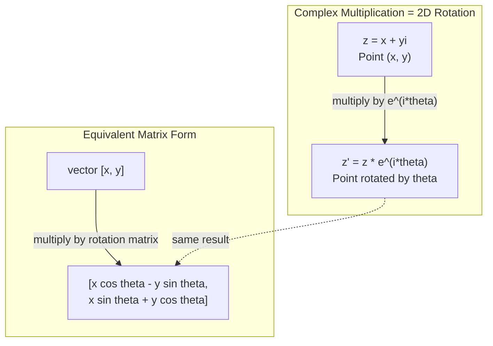
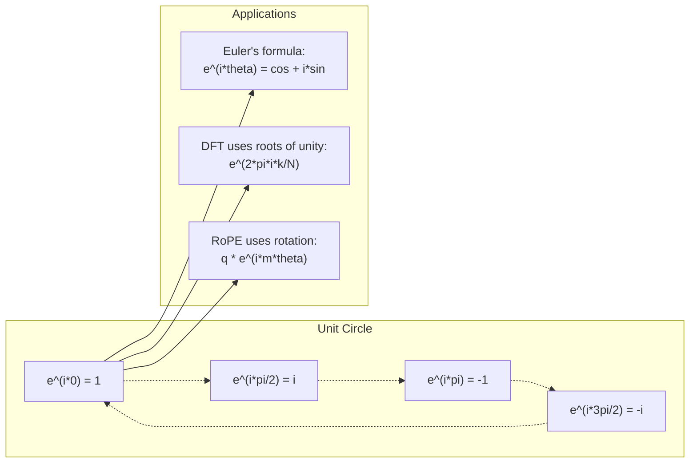

# Số phức trong AI

> Căn bậc hai của -1 không phải là số ảo. Nó là chìa khóa cho các phép quay, tần số và một nửa lĩnh vực xử lý tín hiệu.

**Type:** Learn
**Language:** Python
**Prerequisites:** Phase 1, Lessons 01-04 (đại số tuyến tính, giải tích)
**Time:** ~60 phút

## Mục tiêu học tập

- Thực hiện các phép tính số phức (cộng, nhân, chia, liên hợp) ở cả dạng chữ nhật và dạng cực
- Áp dụng công thức Euler để chuyển đổi giữa hàm mũ phức và hàm lượng giác
- Triển khai Discrete Fourier Transform (DFT) sử dụng các căn đơn vị (roots of unity)
- Giải thích cách các phép quay phức là nền tảng cho RoPE và mã hóa vị trí hình sin trong các Transformer

## Vấn đề

Bạn mở một bài báo về Fourier transform và thấy `i` ở khắp mọi nơi. Bạn nhìn vào các mã hóa vị trí (positional encodings) của Transformer và thấy `sin` và `cos` ở các tần số khác nhau -- phần thực và phần ảo của các hàm mũ phức. Bạn đọc về điện toán lượng tử và thấy mọi thứ được biểu diễn trong các không gian vectơ phức.

Số phức có vẻ trừu tượng. Một hệ thống số được xây dựng trên căn bậc hai của -1 nghe giống như một thủ thuật toán học. Nhưng đó không phải là thủ thuật. Đó là ngôn ngữ tự nhiên của các phép quay và dao động. Bất cứ khi nào có thứ gì đó xoay, rung hoặc dao động, số phức là công cụ phù hợp nhất.

Nếu không hiểu số phức, bạn không thể hiểu Discrete Fourier Transform. Bạn không thể hiểu FFT. Bạn không thể hiểu cách RoPE (Rotary Position Embedding) hoạt động trong các mô hình ngôn ngữ hiện đại. Bạn không thể hiểu tại sao các mã hóa vị trí hình sin trong bài báo Transformer gốc lại sử dụng các tần số đó.

Bài học này xây dựng các phép tính số phức từ đầu, kết nối chúng với hình học và chỉ cho bạn chính xác nơi số phức xuất hiện trong machine learning.

## Khái niệm

### Số phức là gì?

Một số phức có hai phần: phần thực và phần ảo.

```
z = a + bi

where:
  a is the real part
  b is the imaginary part
  i is the imaginary unit, defined by i^2 = -1
```

Chỉ đơn giản vậy thôi. Bạn mở rộng trục số thành một mặt phẳng. Các số thực nằm trên một trục. Các số ảo nằm trên trục còn lại. Mỗi số phức là một điểm trong mặt phẳng này.

### Phép tính số phức

**Phép cộng.** Cộng các phần thực với nhau, cộng các phần ảo với nhau.

```
(a + bi) + (c + di) = (a + c) + (b + d)i

Example: (3 + 2i) + (1 + 4i) = 4 + 6i
```

**Phép nhân.** Sử dụng luật phân phối và nhớ rằng i^2 = -1.

```
(a + bi)(c + di) = ac + adi + bci + bdi^2
                 = ac + adi + bci - bd
                 = (ac - bd) + (ad + bc)i

Example: (3 + 2i)(1 + 4i) = 3 + 12i + 2i + 8i^2
                            = 3 + 14i - 8
                            = -5 + 14i
```

**Số phức liên hợp.** Đảo dấu của phần ảo.

```
conjugate of (a + bi) = a - bi
```

Tích của một số phức và số phức liên hợp của nó luôn là một số thực:

```
(a + bi)(a - bi) = a^2 + b^2
```

**Phép chia.** Nhân cả tử số và mẫu số với số phức liên hợp của mẫu số.

```
(a + bi) / (c + di) = (a + bi)(c - di) / (c^2 + d^2)
```

Điều này loại bỏ phần ảo khỏi mẫu số, cho bạn một số phức gọn gàng.

### Mặt phẳng phức

Mặt phẳng phức ánh xạ mỗi số phức thành một điểm 2D. Trục ngang là trục thực, trục dọc là trục ảo.

```
z = 3 + 2i  corresponds to the point (3, 2)
z = -1 + 0i corresponds to the point (-1, 0) on the real axis
z = 0 + 4i  corresponds to the point (0, 4) on the imaginary axis
```

Một số phức đồng thời là một điểm và một vectơ từ gốc tọa độ. Cách diễn giải kép này là điều làm cho số phức trở nên hữu ích trong hình học.

### Dạng cực

Bất kỳ điểm nào trong mặt phẳng cũng có thể được mô tả bằng khoảng cách của nó từ gốc tọa độ và góc của nó so với trục thực dương.

```
z = r * (cos(theta) + i*sin(theta))

where:
  r = |z| = sqrt(a^2 + b^2)     (magnitude, or modulus)
  theta = atan2(b, a)             (phase, or argument)
```

Dạng chữ nhật (a + bi) tốt cho phép cộng. Dạng cực (r, theta) tốt cho phép nhân.

**Phép nhân ở dạng cực.** Nhân các độ lớn, cộng các góc.

```
z1 = r1 * e^(i*theta1)
z2 = r2 * e^(i*theta2)

z1 * z2 = (r1 * r2) * e^(i*(theta1 + theta2))
```

Đây là lý do tại sao số phức hoàn hảo cho các phép quay. Nhân với một số phức có độ lớn bằng 1 là một phép quay thuần túy.

### Công thức Euler

Cây cầu nối giữa hàm mũ phức và lượng giác:

```
e^(i*theta) = cos(theta) + i*sin(theta)
```

Đây là công thức quan trọng nhất trong bài học này. Khi theta = pi:

```
e^(i*pi) = cos(pi) + i*sin(pi) = -1 + 0i = -1

Therefore: e^(i*pi) + 1 = 0
```

Năm hằng số cơ bản (e, i, pi, 1, 0) được liên kết trong một phương trình.

### Tại sao công thức Euler quan trọng đối với ML

Công thức Euler cho biết `e^(i*theta)` vẽ nên đường tròn đơn vị khi theta thay đổi. Tại theta = 0, bạn ở (1, 0). Tại theta = pi/2, bạn ở (0, 1). Tại theta = pi, bạn ở (-1, 0). Tại theta = 3*pi/2, bạn ở (0, -1). Một vòng quay đầy đủ là theta = 2*pi.

Điều này có nghĩa là các hàm mũ phức CHÍNH LÀ các phép quay. Và các phép quay xuất hiện ở khắp mọi nơi trong xử lý tín hiệu và ML.

### Kết nối với các phép quay 2D

Nhân số phức (x + yi) với e^(i*theta) sẽ xoay điểm (x, y) một góc theta quanh gốc tọa độ.

```
Rotation via complex multiplication:
  (x + yi) * (cos(theta) + i*sin(theta))
  = (x*cos(theta) - y*sin(theta)) + (x*sin(theta) + y*cos(theta))i

Rotation via matrix multiplication:
  [cos(theta)  -sin(theta)] [x]   [x*cos(theta) - y*sin(theta)]
  [sin(theta)   cos(theta)] [y] = [x*sin(theta) + y*cos(theta)]
```

Chúng tạo ra kết quả giống hệt nhau. Phép nhân số phức CHÍNH LÀ phép quay 2D. Ma trận quay chỉ là phép nhân số phức được viết dưới dạng ma trận.



### Phasor và các tín hiệu quay

Một hàm mũ phức e^(i*omega*t) là một điểm quay quanh đường tròn đơn vị với tần số góc omega. Khi t tăng, điểm này vẽ nên đường tròn.

Phần thực của điểm đang quay này là cos(omega*t). Phần ảo là sin(omega*t). Một tín hiệu hình sin là cái bóng của một số phức đang quay.

```
e^(i*omega*t) = cos(omega*t) + i*sin(omega*t)

Real part:      cos(omega*t)    -- a cosine wave
Imaginary part: sin(omega*t)    -- a sine wave
```

Đây là biểu diễn phasor. Thay vì theo dõi một sóng sin ngoằn ngoèo, bạn theo dõi một mũi tên đang quay mượt mà. Các dịch chuyển pha trở thành các độ lệch góc. Thay đổi biên độ trở thành thay đổi độ lớn. Phép cộng các tín hiệu trở thành phép cộng vectơ.

### Các căn đơn vị (Roots of unity)

Các căn bậc N của đơn vị là N điểm cách đều nhau trên đường tròn đơn vị:

```
w_k = e^(2*pi*i*k/N)    for k = 0, 1, 2, ..., N-1
```

Với N = 4, các căn là: 1, i, -1, -i (bốn hướng trên la bàn).
Với N = 8, bạn có bốn hướng la bàn cộng với bốn đường chéo.

Các căn đơn vị là nền tảng của Discrete Fourier Transform. DFT phân tách một tín hiệu thành các thành phần tại N tần số cách đều nhau này.

### Kết nối với DFT

Discrete Fourier Transform của một tín hiệu x[0], x[1], ..., x[N-1] là:

```
X[k] = sum_{n=0}^{N-1} x[n] * e^(-2*pi*i*k*n/N)
```

Mỗi X[k] đo lường mức độ tương quan của tín hiệu với căn đơn vị thứ k -- một hàm sin phức tại tần số k. DFT phá vỡ một tín hiệu thành N phasor quay và cho bạn biết biên độ và pha của từng phasor.

### Tại sao i không phải là số ảo

Từ "ảo" là một tai nạn lịch sử. Descartes đã sử dụng nó với ý nghĩa coi thường. Nhưng i không "ảo" hơn các số âm khi mọi người lần đầu tiên từ chối chúng. Các số âm trả lời câu hỏi "lấy 3 trừ 5 thì được gì?". Đơn vị ảo trả lời câu hỏi "bình phương số nào thì được -1?".

Hữu ích hơn: i là một toán tử quay 90 độ. Nhân một số thực với i một lần, bạn xoay 90 độ sang trục ảo. Nhân với i lần nữa (i^2), bạn xoay thêm 90 độ nữa -- bây giờ bạn đang chỉ theo hướng thực âm. Đó là lý do tại sao i^2 = -1. Nó không hề bí ẩn. Đó là một nửa vòng quay được tạo thành từ hai phần tư vòng quay.

Đây là lý do tại sao số phức xuất hiện ở khắp mọi nơi trong kỹ thuật. Bất cứ thứ gì xoay -- sóng điện từ, trạng thái lượng tử, dao động tín hiệu, mã hóa vị trí -- đều được mô tả một cách tự nhiên bằng số phức.

### Hàm mũ phức so với hàm lượng giác

Trước công thức Euler, các kỹ sư viết tín hiệu dưới dạng A*cos(omega*t + phi) -- biên độ A, tần số omega, pha phi. Cách này hiệu quả nhưng làm cho các phép tính trở nên đau đầu. Cộng hai hàm cos với các pha khác nhau đòi hỏi các đẳng thức lượng giác.

Với hàm mũ phức, cùng một tín hiệu đó là A*e^(i*(omega*t + phi)). Cộng hai tín hiệu chỉ đơn giản là cộng hai số phức. Nhân (điều chế) chỉ là nhân các độ lớn và cộng các góc. Dịch chuyển pha trở thành cộng góc. Dịch chuyển tần số trở thành nhân với các phasor.

Toàn bộ lĩnh vực xử lý tín hiệu đã chuyển sang ký hiệu hàm mũ phức vì toán học gọn gàng hơn. "Tín hiệu thực" luôn chỉ là phần thực của biểu diễn phức. Phần ảo được giữ lại như một cách ghi chép, làm cho tất cả các phép đại số diễn ra một cách tự nhiên.

### Kết nối với Transformer

**Mã hóa vị trí hình sin** (bài báo Transformer gốc):

```
PE(pos, 2i) = sin(pos / 10000^(2i/d))
PE(pos, 2i+1) = cos(pos / 10000^(2i/d))
```

Các cặp sin và cos là phần thực và phần ảo của các hàm mũ phức ở các tần số khác nhau. Mỗi tần số cung cấp một "độ phân giải" khác nhau để mã hóa vị trí. Các tần số thấp thay đổi chậm (vị trí thô). Các tần số cao thay đổi nhanh (vị trí tinh). Cùng nhau, chúng cung cấp cho mỗi vị trí một dấu vân tay tần số duy nhất.

**RoPE (Rotary Position Embedding)** tiến xa hơn. Nó nhân rõ ràng các vectơ query và key với các ma trận quay phức. Vị trí tương đối giữa hai token trở thành một góc quay. Attention được tính toán bằng cách sử dụng các vectơ đã xoay này, làm cho mô hình nhạy cảm với vị trí tương đối thông qua phép nhân số phức.

| Phép toán | Dạng đại số | Ý nghĩa hình học |
|-----------|---------------|-------------------|
| Cộng | (a+c) + (b+d)i | Cộng vectơ trong mặt phẳng |
| Nhân | (ac-bd) + (ad+bc)i | Xoay và phóng đại |
| Liên hợp | a - bi | Phản chiếu qua trục thực |
| Độ lớn | sqrt(a^2 + b^2) | Khoảng cách từ gốc tọa độ |
| Pha | atan2(b, a) | Góc từ trục thực dương |
| Chia | nhân với liên hợp | Đảo ngược phép quay và thu phóng |
| Lũy thừa | r^n * e^(i*n*theta) | Xoay n lần, phóng đại r^n |



```figure
roots-of-unity
```

## Xây dựng

### Bước 1: Lớp Complex

Xây dựng một lớp số phức hỗ trợ các phép tính, độ lớn, pha và chuyển đổi giữa dạng chữ nhật và dạng cực.

```python
import math

class Complex:
    def __init__(self, real, imag=0.0):
        self.real = real
        self.imag = imag

    def __add__(self, other):
        return Complex(self.real + other.real, self.imag + other.imag)

    def __mul__(self, other):
        r = self.real * other.real - self.imag * other.imag
        i = self.real * other.imag + self.imag * other.real
        return Complex(r, i)

    def __truediv__(self, other):
        denom = other.real ** 2 + other.imag ** 2
        r = (self.real * other.real + self.imag * other.imag) / denom
        i = (self.imag * other.real - self.real * other.imag) / denom
        return Complex(r, i)

    def magnitude(self):
        return math.sqrt(self.real ** 2 + self.imag ** 2)

    def phase(self):
        return math.atan2(self.imag, self.real)

    def conjugate(self):
        return Complex(self.real, -self.imag)
```

### Bước 2: Chuyển đổi dạng cực và công thức Euler

```python
def to_polar(z):
    return z.magnitude(), z.phase()

def from_polar(r, theta):
    return Complex(r * math.cos(theta), r * math.sin(theta))

def euler(theta):
    return Complex(math.cos(theta), math.sin(theta))
```

Kiểm tra: `euler(theta).magnitude()` phải luôn là 1.0. `euler(0)` phải cho ra (1, 0). `euler(pi)` phải cho ra (-1, 0).

### Bước 3: Phép quay

Xoay một điểm (x, y) một góc theta là một phép nhân số phức:

```python
point = Complex(3, 4)
rotated = point * euler(math.pi / 4)
```

Độ lớn giữ nguyên. Chỉ có góc thay đổi.

### Bước 4: DFT từ phép tính số phức

```python
def dft(signal):
    N = len(signal)
    result = []
    for k in range(N):
        total = Complex(0, 0)
        for n in range(N):
            angle = -2 * math.pi * k * n / N
            total = total + Complex(signal[n], 0) * euler(angle)
        result.append(total)
    return result
```

Đây là DFT O(N^2). Mỗi đầu ra X[k] là tổng của các mẫu tín hiệu nhân với các căn đơn vị.

### Bước 5: Inverse DFT

Inverse DFT tái tạo tín hiệu gốc từ phổ của nó. Những thay đổi duy nhất so với DFT thuận: đảo dấu trong số mũ và chia cho N.

```python
def idft(spectrum):
    N = len(spectrum)
    result = []
    for n in range(N):
        total = Complex(0, 0)
        for k in range(N):
            angle = 2 * math.pi * k * n / N
            total = total + spectrum[k] * euler(angle)
        result.append(Complex(total.real / N, total.imag / N))
    return result
```

Điều này cho bạn sự tái tạo hoàn hảo. Áp dụng DFT, sau đó IDFT, và bạn nhận lại tín hiệu gốc với độ chính xác của máy tính. Không có thông tin nào bị mất.

### Bước 6: Các căn đơn vị

```python
def roots_of_unity(N):
    return [euler(2 * math.pi * k / N) for k in range(N)]
```

Kiểm tra hai tính chất:
- Mỗi căn có độ lớn chính xác bằng 1.
- Tổng của tất cả N căn bằng 0 (chúng triệt tiêu nhau do tính đối xứng).

Các tính chất này là điều làm cho DFT có thể đảo ngược. Các căn đơn vị tạo thành một cơ sở trực giao cho miền tần số.

## Sử dụng

Python có hỗ trợ số phức tích hợp sẵn. Ký tự `j` đại diện cho đơn vị ảo.

```python
z = 3 + 2j
w = 1 + 4j

print(z + w)
print(z * w)
print(abs(z))

import cmath
print(cmath.phase(z))
print(cmath.exp(1j * cmath.pi))
```

Đối với các mảng, numpy xử lý số phức một cách tự nhiên:

```python
import numpy as np

z = np.array([1+2j, 3+4j, 5+6j])
print(np.abs(z))
print(np.angle(z))
print(np.conj(z))
print(np.real(z))
print(np.imag(z))

signal = np.sin(2 * np.pi * 5 * np.linspace(0, 1, 128))
spectrum = np.fft.fft(signal)
freqs = np.fft.fftfreq(128, d=1/128)
```

## Triển khai

Chạy `code/complex_numbers.py` để tạo `outputs/skill-complex-arithmetic.md`.

## Bài tập

1. **Phép tính số phức bằng tay.** Tính (2 + 3i) * (4 - i) và kiểm tra bằng mã. Sau đó tính (5 + 2i) / (1 - 3i). Vẽ cả hai kết quả trên mặt phẳng phức và kiểm tra xem phép nhân đã xoay và phóng đại số đầu tiên như thế nào.

2. **Chuỗi phép quay.** Bắt đầu với điểm (1, 0). Nhân với e^(i*pi/6) mười hai lần. Kiểm tra xem bạn có quay lại (1, 0) sau 12 lần nhân hay không. In tọa độ tại mỗi bước và xác nhận chúng vẽ nên một hình 12 cạnh đều.

3. **DFT của một tín hiệu đã biết.** Tạo một tín hiệu là tổng của sin(2*pi*3*t) và 0.5*sin(2*pi*7*t) được lấy mẫu tại 32 điểm. Chạy DFT của bạn. Xác nhận rằng phổ độ lớn có các đỉnh tại tần số 3 và 7, với đỉnh tại 7 bằng một nửa chiều cao của đỉnh tại 3.

4. **Trực quan hóa các căn đơn vị.** Tính các căn bậc 8 của đơn vị. Xác nhận rằng tổng của chúng bằng 0. Xác nhận rằng nhân bất kỳ căn nào với căn nguyên thủy e^(2*pi*i/8) sẽ cho ra căn tiếp theo.

5. **Sự tương đương của ma trận quay.** Với 10 góc ngẫu nhiên và 10 điểm ngẫu nhiên, xác nhận rằng phép nhân số phức cho kết quả giống như phép nhân ma trận-vectơ với ma trận quay 2x2. In ra sự khác biệt số học tối đa.

## Thuật ngữ chính

| Thuật ngữ | Ý nghĩa |
|------|---------------|
| Số phức | Một số a + bi trong đó a là phần thực, b là phần ảo và i^2 = -1 |
| Đơn vị ảo | Số i, được định nghĩa bởi i^2 = -1. Không phải là ảo theo nghĩa triết học -- nó là một toán tử quay |
| Mặt phẳng phức | Mặt phẳng 2D nơi trục x là thực và trục y là ảo. Còn được gọi là mặt phẳng Argand |
| Độ lớn (modulus) | Khoảng cách từ gốc tọa độ: sqrt(a^2 + b^2). Viết là \|z\| |
| Pha (argument) | Góc từ trục thực dương: atan2(b, a). Viết là arg(z) |
| Liên hợp | Hình ảnh phản chiếu qua trục thực: liên hợp của a + bi là a - bi |
| Dạng cực | Biểu diễn z dưới dạng r * e^(i*theta) thay vì a + bi. Giúp phép nhân dễ dàng hơn |
| Công thức Euler | e^(i*theta) = cos(theta) + i*sin(theta). Kết nối hàm mũ với lượng giác |
| Phasor | Một số phức đang quay e^(i*omega*t) đại diện cho một tín hiệu hình sin |
| Các căn đơn vị | N số phức e^(2*pi*i*k/N) cho k = 0 đến N-1. N điểm cách đều nhau trên đường tròn đơn vị |
| DFT | Discrete Fourier Transform. Phân tách tín hiệu thành các thành phần hình sin phức sử dụng các căn đơn vị |
| RoPE | Rotary Position Embedding. Sử dụng phép nhân số phức để mã hóa vị trí tương đối trong attention của Transformer |

## Đọc thêm

- [Giới thiệu trực quan về công thức Euler](https://betterexplained.com/articles/intuitive-understanding-of-eulers-formula/) - xây dựng trực giác hình học mà không cần ký hiệu phức tạp
- [Su et al.: RoFormer (2021)](https://arxiv.org/abs/2104.09864) - bài báo giới thiệu Rotary Position Embedding sử dụng các phép quay phức
- [Vaswani et al.: Attention Is All You Need (2017)](https://arxiv.org/abs/1706.03762) - bài báo Transformer gốc với các mã hóa vị trí hình sin
- [3Blue1Brown: Công thức Euler với lý thuyết nhóm nhập môn](https://www.youtube.com/watch?v=mvmuCPvRoWQ) - giải thích trực quan tại sao e^(i*pi) = -1
- [Needham: Visual Complex Analysis](https://global.oup.com/academic/product/visual-complex-analysis-9780198534464) - tài liệu xử lý trực quan tốt nhất về số phức, đầy ắp các hiểu biết hình học
- [Strang: Introduction to Linear Algebra, Ch. 10](https://math.mit.edu/~gs/linearalgebra/) - số phức trong bối cảnh đại số tuyến tính và trị riêng