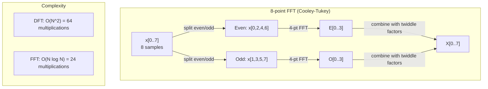
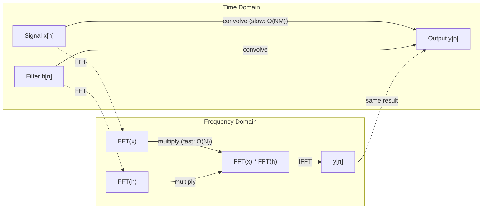

# Biến đổi Fourier (Fourier Transform)

> Mọi tín hiệu đều là tổng của các sóng sin. Biến đổi Fourier cho bạn biết đó là những sóng nào.

**Type:** Build
**Language:** Python
**Prerequisites:** Phase 1, Lessons 01-04, 19 (số phức)
**Time:** ~90 phút

## Mục tiêu học tập

- Triển khai DFT từ đầu và kiểm chứng với thuật toán Cooley-Tukey FFT có độ phức tạp O(N log N)
- Giải mã các hệ số tần số: trích xuất biên độ (amplitude), pha (phase) và phổ công suất (power spectrum) từ một tín hiệu
- Áp dụng định lý tích chập (convolution theorem) để thực hiện tích chập thông qua phép nhân FFT
- Kết nối sự phân rã tần số Fourier với các positional encoding trong Transformer và các lớp tích chập trong CNN

## Vấn đề

Một bản ghi âm là một chuỗi các phép đo áp suất theo thời gian. Giá cổ phiếu là một chuỗi các giá trị theo ngày. Một hình ảnh là một lưới các cường độ điểm ảnh theo không gian. Tất cả những thứ này đều là dữ liệu trong miền thời gian (hoặc miền không gian). Bạn thấy các giá trị thay đổi theo một chỉ số nào đó.

Nhưng nhiều quy luật lại vô hình trong miền thời gian. Tín hiệu âm thanh này là một nốt đơn hay một hợp âm? Giá cổ phiếu này có chu kỳ hàng tuần không? Hình ảnh này có kết cấu lặp lại không? Những câu hỏi này liên quan đến nội dung tần số, và miền thời gian che giấu điều đó.

Biến đổi Fourier chuyển đổi dữ liệu từ miền thời gian sang miền tần số. Nó lấy một tín hiệu và phân rã nó thành các sóng sin với các tần số khác nhau. Mỗi sóng sin có một biên độ (độ mạnh) và một pha (điểm bắt đầu). Biến đổi Fourier cho bạn biết cả hai điều đó.

Điều này quan trọng đối với ML vì tư duy miền tần số xuất hiện ở khắp mọi nơi. Các mạng thần kinh tích chập (CNN) thực hiện tích chập, vốn là phép nhân trong miền tần số. Các positional encoding của Transformer sử dụng phân rã tần số để biểu diễn vị trí. Các mô hình âm thanh (nhận dạng giọng nói, tạo nhạc) hoạt động trên các spectrogram -- biểu diễn tần số của âm thanh. Các mô hình chuỗi thời gian tìm kiếm các quy luật tuần hoàn. Hiểu về biến đổi Fourier cung cấp cho bạn vốn từ vựng để làm việc với tất cả những thứ này.

## Khái niệm

### Định nghĩa DFT

Với N mẫu x[0], x[1], ..., x[N-1], Discrete Fourier Transform tạo ra N hệ số tần số X[0], X[1], ..., X[N-1]:

```
X[k] = sum_{n=0}^{N-1} x[n] * e^(-2*pi*i*k*n/N)

for k = 0, 1, ..., N-1
```

Mỗi X[k] là một số phức. Độ lớn |X[k]| cho bạn biết biên độ của tần số k. Góc pha angle(X[k]) cho bạn biết độ lệch pha của tần số đó.

Thông tin cốt lõi: `e^(-2*pi*i*k*n/N)` là một phasor quay tại tần số k. DFT tính toán sự tương quan giữa tín hiệu và mỗi tần số trong N tần số cách đều nhau. Nếu tín hiệu chứa năng lượng tại tần số k, sự tương quan sẽ lớn. Nếu không, nó sẽ gần bằng 0.

### Ý nghĩa của từng hệ số

**X[0]: thành phần DC.** Đây là tổng của tất cả các mẫu -- tỷ lệ thuận với giá trị trung bình. Nó đại diện cho độ lệch hằng số (tần số bằng 0) của tín hiệu.

```
X[0] = sum_{n=0}^{N-1} x[n] * e^0 = sum of all samples
```

**X[k] với 1 <= k <= N/2: các tần số dương.** X[k] đại diện cho tần số k chu kỳ trên N mẫu. k càng lớn nghĩa là tần số càng cao (dao động càng nhanh).

**X[N/2]: tần số Nyquist.** Tần số cao nhất bạn có thể biểu diễn với N mẫu. Vượt quá mức này, bạn sẽ gặp hiện tượng aliasing -- các tần số cao bị nhầm lẫn thành tần số thấp.

**X[k] với N/2 < k < N: các tần số âm.** Đối với các tín hiệu giá trị thực, X[N-k] = conj(X[k]). Các tần số âm là hình ảnh phản chiếu của các tần số dương. Đây là lý do tại sao thông tin hữu ích nằm trong N/2 + 1 hệ số đầu tiên.

### Inverse DFT

Inverse DFT tái tạo tín hiệu gốc từ các hệ số tần số của nó:

```
x[n] = (1/N) * sum_{k=0}^{N-1} X[k] * e^(2*pi*i*k*n/N)

for n = 0, 1, ..., N-1
```

Sự khác biệt duy nhất so với DFT thuận: dấu trong số mũ là dương (không phải âm), và có một hệ số chuẩn hóa 1/N.

Inverse DFT là quá trình tái tạo hoàn hảo. Không có thông tin nào bị mất. Bạn có thể đi từ miền thời gian sang miền tần số và ngược lại mà không có bất kỳ sai số nào. DFT là một sự thay đổi cơ sở (change of basis) -- nó biểu diễn lại cùng một thông tin trong một hệ tọa độ khác.

### FFT: làm cho nó nhanh hơn

DFT như định nghĩa ở trên có độ phức tạp O(N^2): với mỗi hệ số đầu ra trong N hệ số, bạn phải tính tổng trên N mẫu đầu vào. Với N = 1 triệu, đó là 10^12 phép tính.

Fast Fourier Transform (FFT) tính toán kết quả tương tự trong O(N log N). Với N = 1 triệu, đó là khoảng 20 triệu phép tính thay vì một nghìn tỷ. Đây là điều làm cho phân tích tần số trở nên thực tế.

Thuật toán Cooley-Tukey (FFT phổ biến nhất) hoạt động theo phương pháp chia để trị:

1. Chia tín hiệu thành các mẫu có chỉ số chẵn và lẻ.
2. Tính DFT của mỗi nửa một cách đệ quy.
3. Kết hợp hai DFT nửa kích thước bằng cách sử dụng "twiddle factors" e^(-2*pi*i*k/N).

```
X[k] = E[k] + e^(-2*pi*i*k/N) * O[k]          for k = 0, ..., N/2 - 1
X[k + N/2] = E[k] - e^(-2*pi*i*k/N) * O[k]    for k = 0, ..., N/2 - 1

where E = DFT of even-indexed samples
      O = DFT of odd-indexed samples
```

Tính đối xứng có nghĩa là mỗi cấp độ đệ quy thực hiện O(N) công việc, và có log2(N) cấp độ. Tổng cộng: O(N log N).



FFT yêu cầu độ dài tín hiệu phải là lũy thừa của 2. Trong thực tế, các tín hiệu được thêm số 0 (zero-padded) để đạt đến lũy thừa tiếp theo của 2.

### Phân tích phổ (Spectral analysis)

**Phổ công suất (power spectrum)** là |X[k]|^2 -- bình phương độ lớn của mỗi hệ số tần số. Nó cho thấy bao nhiêu năng lượng nằm ở mỗi tần số.

**Phổ pha (phase spectrum)** là angle(X[k]) -- độ lệch pha của mỗi tần số. Đối với hầu hết các tác vụ phân tích, bạn quan tâm đến phổ công suất và bỏ qua pha.

```
Power at frequency k:  P[k] = |X[k]|^2 = X[k].real^2 + X[k].imag^2
Phase at frequency k:  phi[k] = atan2(X[k].imag, X[k].real)
```

### Độ phân giải tần số

Độ phân giải tần số của DFT phụ thuộc vào số lượng mẫu N và tốc độ lấy mẫu fs.

```
Frequency of bin k:      f_k = k * fs / N
Frequency resolution:    delta_f = fs / N
Maximum frequency:       f_max = fs / 2  (Nyquist)
```

Để phân biệt hai tần số gần nhau, bạn cần nhiều mẫu hơn. Để nắm bắt các tần số cao, bạn cần tốc độ lấy mẫu cao hơn.

### Định lý tích chập (Convolution theorem)

Đây là một trong những kết quả quan trọng nhất trong xử lý tín hiệu và liên quan trực tiếp đến CNN.

**Tích chập trong miền thời gian bằng phép nhân từng phần tử trong miền tần số.**

```
x * h = IFFT(FFT(x) . FFT(h))

where * is convolution and . is element-wise multiplication
```

Tại sao điều này quan trọng:

- Tích chập trực tiếp của hai tín hiệu có độ dài N và M mất O(N*M) phép tính.
- Tích chập dựa trên FFT mất O(N log N): biến đổi cả hai, nhân, biến đổi ngược lại.
- Đối với các kernel lớn, tích chập FFT nhanh hơn đáng kể.
- Đây chính xác là những gì xảy ra trong các lớp tích chập với trường tiếp nhận (receptive field) lớn.

Lưu ý: DFT tính toán tích chập vòng (circular convolution - tín hiệu bị cuộn lại). Đối với tích chập tuyến tính (không cuộn), hãy thêm số 0 vào cả hai tín hiệu đến độ dài N + M - 1 trước khi tính toán.



### Windowing

DFT giả định tín hiệu là tuần hoàn -- nó coi N mẫu là một chu kỳ của một tín hiệu lặp lại vô hạn. Nếu tín hiệu không bắt đầu và kết thúc tại cùng một giá trị, điều này tạo ra sự gián đoạn tại biên, xuất hiện dưới dạng nội dung tần số cao giả. Đây được gọi là rò rỉ phổ (spectral leakage).

Windowing làm giảm rò rỉ bằng cách thu hẹp tín hiệu về 0 ở cả hai đầu trước khi tính DFT.

Các cửa sổ phổ biến:

| Window | Hình dạng | Độ rộng thùy chính | Mức thùy phụ | Trường hợp sử dụng |
|--------|-------|----------------|-----------------|----------|
| Rectangular | Phẳng (không window) | Hẹp nhất | Cao nhất (-13 dB) | Khi tín hiệu tuần hoàn chính xác trong N mẫu |
| Hann | Cosine nâng | Trung bình | Thấp (-31 dB) | Phân tích phổ mục đích chung |
| Hamming | Cosine sửa đổi | Trung bình | Thấp hơn (-42 dB) | Xử lý âm thanh, phân tích giọng nói |
| Blackman | Triple cosine | Rộng | Rất thấp (-58 dB) | Khi việc triệt tiêu thùy phụ là tối quan trọng |

```
Hann window:    w[n] = 0.5 * (1 - cos(2*pi*n / (N-1)))
Hamming window: w[n] = 0.54 - 0.46 * cos(2*pi*n / (N-1))
```

Áp dụng window bằng cách nhân nó theo từng phần tử với tín hiệu trước khi thực hiện DFT: `X = DFT(x * w)`.

### Các tính chất của DFT

| Tính chất | Miền thời gian | Miền tần số |
|----------|-------------|-----------------|
| Tuyến tính | a*x + b*y | a*X + b*Y |
| Dịch thời gian | x[n - k] | X[f] * e^(-2*pi*i*f*k/N) |
| Dịch tần số | x[n] * e^(2*pi*i*f0*n/N) | X[f - f0] |
| Tích chập | x * h | X * H (từng phần tử) |
| Nhân | x * h (từng phần tử) | X * H (tích chập vòng, tỉ lệ 1/N) |
| Định lý Parseval | sum \|x[n]\|^2 | (1/N) * sum \|X[k]\|^2 |
| Đối xứng liên hợp (đầu vào thực) | x[n] thực | X[k] = conj(X[N-k]) |

Định lý Parseval nói rằng tổng năng lượng là như nhau trong cả hai miền. Năng lượng được bảo toàn qua phép biến đổi.

### Kết nối với positional encodings

Transformer gốc sử dụng sinusoidal positional encodings:

```
PE(pos, 2i)   = sin(pos / 10000^(2i/d_model))
PE(pos, 2i+1) = cos(pos / 10000^(2i/d_model))
```

Mỗi cặp chiều (2i, 2i+1) dao động ở một tần số khác nhau. Các tần số được sắp xếp theo hình học từ cao (chiều 0,1) đến thấp (các chiều cuối). Điều này mang lại cho mỗi vị trí một quy luật duy nhất trên tất cả các dải tần số -- tương tự như cách các hệ số Fourier xác định duy nhất một tín hiệu.

Các tính chất chính mà điều này cung cấp:

- **Tính duy nhất:** Không có hai vị trí nào có cùng encoding.
- **Giá trị bị chặn:** sin và cos luôn nằm trong khoảng [-1, 1].
- **Vị trí tương đối:** Encoding của vị trí p+k có thể được biểu diễn như một hàm tuyến tính của encoding tại vị trí p. Mô hình có thể học cách chú ý đến các vị trí tương đối.

### Kết nối với CNNs

Một lớp tích chập áp dụng một bộ lọc (kernel) đã học vào đầu vào bằng cách trượt nó qua tín hiệu hoặc hình ảnh. Về mặt toán học, đây là phép toán tích chập.

Theo định lý tích chập, điều này tương đương với:
1. FFT đầu vào
2. FFT kernel
3. Nhân trong miền tần số
4. IFFT kết quả

Các triển khai CNN tiêu chuẩn sử dụng tích chập trực tiếp (nhanh hơn cho các kernel 3x3 nhỏ). Nhưng đối với các kernel lớn hoặc tích chập toàn cục, các phương pháp dựa trên FFT nhanh hơn đáng kể. Một số kiến trúc (như FNet) thay thế hoàn toàn attention bằng FFT, đạt được độ chính xác cạnh tranh với độ phức tạp O(N log N) thay vì O(N^2).

### Spectrograms và Short-Time Fourier Transform

Một FFT đơn lẻ cho bạn nội dung tần số của toàn bộ tín hiệu, nhưng không cho biết khi nào các tần số đó xảy ra. Một tiếng chirp (tín hiệu có tần số tăng dần theo thời gian) và một hợp âm (tất cả các tần số hiện diện đồng thời) có thể có cùng phổ độ lớn.

Short-Time Fourier Transform (STFT) giải quyết vấn đề này bằng cách tính FFT trên các cửa sổ chồng lấp của tín hiệu. Kết quả là một spectrogram: một biểu diễn 2D với thời gian trên một trục và tần số trên trục kia. Cường độ tại mỗi điểm cho thấy năng lượng tại tần số đó vào thời điểm đó.

```
STFT procedure:
1. Choose a window size (e.g., 1024 samples)
2. Choose a hop size (e.g., 256 samples -- 75% overlap)
3. For each window position:
   a. Extract the windowed segment
   b. Apply a Hann/Hamming window
   c. Compute FFT
   d. Store the magnitude spectrum as one column of the spectrogram
```

Spectrograms là biểu diễn đầu vào tiêu chuẩn cho các mô hình ML âm thanh. Các mô hình nhận dạng giọng nói (Whisper, DeepSpeech) hoạt động trên mel-spectrograms -- spectrograms với các tần số được ánh xạ sang thang đo mel, phù hợp hơn với nhận thức cao độ của con người.

### Aliasing

Nếu một tín hiệu chứa các tần số trên fs/2 (tần số Nyquist), việc lấy mẫu ở tốc độ fs sẽ tạo ra các bản sao bị aliasing. Một tín hiệu 90 Hz được lấy mẫu ở 100 Hz trông giống hệt một tín hiệu 10 Hz. Không có cách nào để phân biệt chúng chỉ từ các mẫu.

```
Example:
  True signal: 90 Hz sine wave
  Sampling rate: 100 Hz
  Apparent frequency: 100 - 90 = 10 Hz

  The samples from the 90 Hz signal at 100 Hz sampling rate
  are identical to the samples from a 10 Hz signal.
  No amount of math can recover the original 90 Hz.
```

Đây là lý do tại sao các bộ chuyển đổi tương tự sang số (ADC) bao gồm các bộ lọc chống aliasing giúp loại bỏ các tần số trên Nyquist trước khi lấy mẫu. Trong ML, aliasing xuất hiện khi giảm mẫu (downsampling) các feature map mà không lọc thông thấp (low-pass filtering) đúng cách -- một số kiến trúc giải quyết vấn đề này bằng các lớp pooling chống aliasing.

### Zero-padding không làm tăng độ phân giải

Một quan niệm sai lầm phổ biến: thêm số 0 vào tín hiệu trước khi FFT giúp cải thiện độ phân giải tần số. Điều đó không đúng. Zero-padding nội suy giữa các bin tần số hiện có, mang lại cho bạn một phổ trông mượt mà hơn. Nhưng nó không thể tiết lộ chi tiết tần số không có trong các mẫu gốc.

Độ phân giải tần số thực sự chỉ phụ thuộc vào thời gian quan sát T = N / fs. Để phân biệt hai tần số cách nhau delta_f, bạn cần ít nhất T = 1 / delta_f giây dữ liệu. Không lượng zero-padding nào có thể thay đổi giới hạn cơ bản này.

```figure
fourier-synthesis
```

## Build It

### Bước 1: DFT từ đầu

DFT O(N^2) tuân theo trực tiếp từ định nghĩa.

```python
import math

class Complex:
    ...

def dft(x):
    N = len(x)
    result = []
    for k in range(N):
        total = Complex(0, 0)
        for n in range(N):
            angle = -2 * math.pi * k * n / N
            w = Complex(math.cos(angle), math.sin(angle))
            xn = x[n] if isinstance(x[n], Complex) else Complex(x[n])
            total = total + xn * w
        result.append(total)
    return result
```

### Bước 2: Inverse DFT

Cấu trúc tương tự, số mũ dương, chia cho N.

```python
def idft(X):
    N = len(X)
    result = []
    for n in range(N):
        total = Complex(0, 0)
        for k in range(N):
            angle = 2 * math.pi * k * n / N
            w = Complex(math.cos(angle), math.sin(angle))
            total = total + X[k] * w
        result.append(Complex(total.real / N, total.imag / N))
    return result
```

### Bước 3: FFT (Cooley-Tukey)

FFT đệ quy yêu cầu độ dài lũy thừa của 2. Chia thành chẵn và lẻ, đệ quy, kết hợp với twiddle factors.

```python
def fft(x):
    N = len(x)
    if N <= 1:
        return [x[0] if isinstance(x[0], Complex) else Complex(x[0])]
    if N % 2 != 0:
        return dft(x)

    even = fft([x[i] for i in range(0, N, 2)])
    odd = fft([x[i] for i in range(1, N, 2)])

    result = [Complex(0)] * N
    for k in range(N // 2):
        angle = -2 * math.pi * k / N
        twiddle = Complex(math.cos(angle), math.sin(angle))
        t = twiddle * odd[k]
        result[k] = even[k] + t
        result[k + N // 2] = even[k] - t
    return result
```

### Bước 4: Các hàm hỗ trợ phân tích phổ

```python
def power_spectrum(X):
    return [xk.real ** 2 + xk.imag ** 2 for xk in X]

def convolve_fft(x, h):
    N = len(x) + len(h) - 1
    padded_N = 1
    while padded_N < N:
        padded_N *= 2

    x_padded = x + [0.0] * (padded_N - len(x))
    h_padded = h + [0.0] * (padded_N - len(h))

    X = fft(x_padded)
    H = fft(h_padded)

    Y = [xk * hk for xk, hk in zip(X, H)]

    y = idft(Y)
    return [y[n].real for n in range(N)]
```

## Use It

Đối với công việc thực tế, hãy sử dụng FFT của numpy, vốn được hỗ trợ bởi các thư viện C được tối ưu hóa cao.

```python
import numpy as np

signal = np.sin(2 * np.pi * 5 * np.arange(256) / 256)
spectrum = np.fft.fft(signal)
freqs = np.fft.fftfreq(256, d=1/256)

power = np.abs(spectrum) ** 2

positive_freqs = freqs[:len(freqs)//2]
positive_power = power[:len(power)//2]
```

Đối với windowing và phân tích phổ nâng cao hơn:

```python
from scipy.signal import windows, stft

window = windows.hann(256)
windowed = signal * window
spectrum = np.fft.fft(windowed)
```

Đối với tích chập:

```python
from scipy.signal import fftconvolve

result = fftconvolve(signal, kernel, mode='full')
```

Đối với spectrograms:

```python
from scipy.signal import stft

frequencies, times, Zxx = stft(signal, fs=sample_rate, nperseg=256)
spectrogram = np.abs(Zxx) ** 2
```

Ma trận spectrogram có hình dạng (n_frequencies, n_time_frames). Mỗi cột là phổ công suất tại một cửa sổ thời gian. Đây là những gì các mô hình ML âm thanh tiêu thụ làm đầu vào.

## Ship It

Chạy `code/fourier.py` để tạo `outputs/prompt-spectral-analyzer.md`.

## Bài tập

1. **Nhận dạng nốt đơn.** Tạo một tín hiệu với một sóng sin duy nhất ở tần số không xác định (từ 1 đến 50 Hz), lấy mẫu ở 128 Hz trong 1 giây. Sử dụng DFT của bạn để xác định tần số. Kiểm tra xem câu trả lời có khớp không. Bây giờ thêm nhiễu Gaussian với độ lệch chuẩn 0.5 và lặp lại. Nhiễu ảnh hưởng đến phổ như thế nào?

2. **Kiểm chứng FFT vs DFT.** Tạo một tín hiệu ngẫu nhiên có độ dài 64. Tính cả DFT (O(N^2)) và FFT. Xác minh rằng tất cả các hệ số khớp nhau trong phạm vi 1e-10. Đo thời gian cả hai hàm trên các tín hiệu có độ dài 256, 512, 1024 và 2048. Vẽ biểu đồ tỷ lệ thời gian DFT trên thời gian FFT.

3. **Chứng minh định lý tích chập bằng ví dụ.** Tạo tín hiệu x = [1, 2, 3, 4, 0, 0, 0, 0] và bộ lọc h = [1, 1, 1, 0, 0, 0, 0, 0]. Tính tích chập vòng của chúng trực tiếp (vòng lặp lồng nhau). Sau đó tính nó thông qua FFT (biến đổi, nhân, biến đổi ngược). Xác minh kết quả khớp nhau. Bây giờ hãy thực hiện tích chập tuyến tính bằng cách thêm số 0 phù hợp.

4. **Hiệu ứng của Windowing.** Tạo một tín hiệu là tổng của hai sóng sin ở 10 Hz và 12 Hz (rất gần nhau). Lấy mẫu ở 128 Hz trong 1 giây. Tính phổ công suất không có window, với Hann window và Hamming window. Window nào giúp phân biệt hai đỉnh dễ dàng nhất? Tại sao?

5. **Phân tích positional encoding.** Tạo sinusoidal positional encodings cho d_model = 128 và max_pos = 512. Với mỗi cặp vị trí (p1, p2), tính tích vô hướng của các encoding của chúng. Chứng minh rằng tích vô hướng chỉ phụ thuộc vào |p1 - p2|, không phải vào các vị trí tuyệt đối. Điều gì xảy ra với tích vô hướng khi khoảng cách tăng lên?

## Thuật ngữ chính

| Thuật ngữ | Ý nghĩa |
|------|---------------|
| DFT (Discrete Fourier Transform) | Chuyển đổi N mẫu miền thời gian thành N hệ số miền tần số. Mỗi hệ số là sự tương quan với một sóng sin phức tại tần số đó |
| FFT (Fast Fourier Transform) | Thuật toán O(N log N) để tính DFT. Thuật toán Cooley-Tukey chia các chỉ số chẵn/lẻ một cách đệ quy |
| Inverse DFT | Tái tạo tín hiệu miền thời gian từ các hệ số tần số. Công thức tương tự DFT với dấu số mũ bị đảo ngược và tỉ lệ 1/N |
| Frequency bin | Mỗi chỉ số k trong đầu ra DFT đại diện cho tần số k*fs/N Hz. "Bin" là khe tần số rời rạc |
| DC component | X[0], hệ số tần số bằng 0. Tỷ lệ thuận với giá trị trung bình của tín hiệu |
| Nyquist frequency | fs/2, tần số tối đa có thể biểu diễn ở tốc độ lấy mẫu fs. Các tần số trên mức này bị aliasing |
| Power spectrum | \|X[k]|^2, bình phương độ lớn của mỗi hệ số tần số. Cho thấy sự phân bố năng lượng qua các tần số |
| Phase spectrum | angle(X[k]), độ lệch pha của mỗi thành phần tần số. Thường bị bỏ qua trong phân tích |
| Spectral leakage | Nội dung tần số giả do coi tín hiệu không tuần hoàn là tuần hoàn. Được giảm bớt bằng windowing |
| Window function | Hàm thu hẹp (Hann, Hamming, Blackman) được áp dụng trước DFT để giảm rò rỉ phổ |
| Twiddle factor | Số phức e^(-2*pi*i*k/N) được sử dụng để kết hợp các sub-DFT trong tính toán FFT butterfly |
| Convolution theorem | Tích chập trong miền thời gian bằng phép nhân từng phần tử trong miền tần số. Cơ bản cho xử lý tín hiệu và CNNs |
| Circular convolution | Tích chập trong đó tín hiệu bị cuộn lại. Đây là những gì DFT tính toán tự nhiên |
| Linear convolution | Tích chập tiêu chuẩn không bị cuộn. Đạt được bằng cách thêm số 0 trước DFT |
| Parseval's theorem | Tổng năng lượng được bảo toàn qua biến đổi Fourier. sum \|x[n]\|^2 = (1/N) sum \|X[k]\|^2 |
| Aliasing | Khi các tần số trên Nyquist xuất hiện dưới dạng các tần số thấp hơn do tốc độ lấy mẫu không đủ |

## Đọc thêm

- [Cooley & Tukey: An Algorithm for the Machine Calculation of Complex Fourier Series (1965)](https://www.ams.org/journals/mcom/1965-19-090/S0025-5718-1965-0178586-1/) - bài báo FFT gốc đã thay đổi ngành tính toán
- [3Blue1Brown: But what is the Fourier Transform?](https://www.youtube.com/watch?v=spUNpyF58BY) - giới thiệu trực quan nhất về biến đổi Fourier
- [Lee-Thorp et al.: FNet: Mixing Tokens with Fourier Transforms (2021)](https://arxiv.org/abs/2105.03824) - thay thế self-attention bằng FFT trong các transformer
- [Smith: The Scientist and Engineer's Guide to Digital Signal Processing](http://www.dspguide.com/) - sách giáo khoa trực tuyến miễn phí bao gồm FFT, windowing và phân tích phổ chuyên sâu
- [Vaswani et al.: Attention Is All You Need (2017)](https://arxiv.org/abs/1706.03762) - sinusoidal positional encodings bắt nguồn từ phân rã tần số Fourier
- [Radford et al.: Whisper (2022)](https://arxiv.org/abs/2212.04356) - nhận dạng giọng nói sử dụng mel-spectrograms làm biểu diễn đầu vào