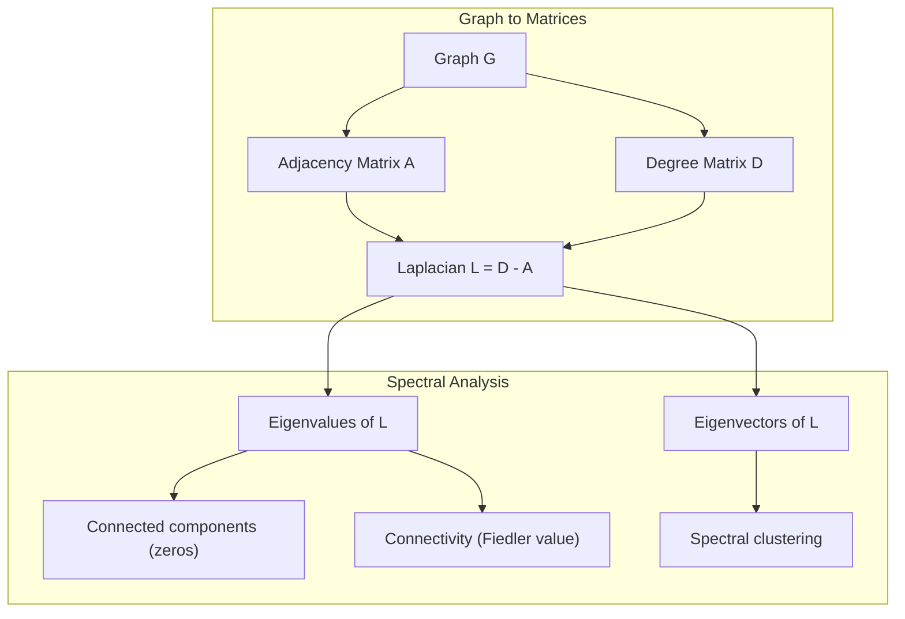
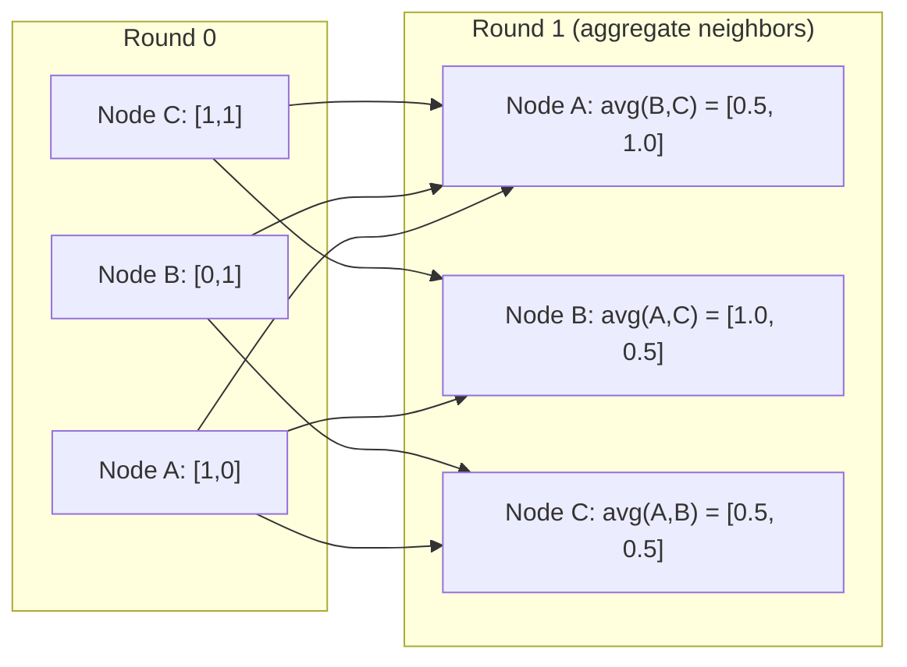

# Lý thuyết đồ thị cho Machine Learning

> Đồ thị là cấu trúc dữ liệu của các mối quan hệ. Nếu dữ liệu của bạn có các kết nối, bạn cần lý thuyết đồ thị.

**Type:** Build
**Language:** Python
**Prerequisites:** Giai đoạn 1, Bài 01-03 (đại số tuyến tính, ma trận)
**Time:** ~90 phút

## Mục tiêu học tập

- Xây dựng lớp đồ thị với biểu diễn ma trận kề/danh sách kề và triển khai duyệt BFS và DFS
- Tính toán Laplacian của đồ thị và sử dụng các trị riêng (eigenvalues) của nó để phát hiện các thành phần liên thông và phân cụm các nút
- Triển khai một vòng truyền tin (message passing) theo kiểu GNN dưới dạng phép nhân ma trận kề chuẩn hóa
- Áp dụng phân cụm phổ (spectral clustering) để phân vùng đồ thị bằng cách sử dụng vector Fiedler

## Vấn đề

Mạng xã hội, phân tử, cơ sở tri thức, mạng lưới trích dẫn, bản đồ đường bộ -- tất cả đều là đồ thị. ML truyền thống coi dữ liệu là các bảng phẳng. Mỗi hàng là độc lập. Mỗi đặc trưng là một cột. Nhưng khi cấu trúc của các kết nối quan trọng, các bảng sẽ thất bại.

Hãy xem xét một mạng xã hội. Bạn muốn dự đoán sản phẩm nào người dùng sẽ mua. Lịch sử mua hàng của họ rất quan trọng. Nhưng lịch sử mua hàng của bạn bè họ còn quan trọng hơn. Các kết nối mang theo tín hiệu.

Hoặc xem xét một phân tử. Bạn muốn dự đoán liệu nó có liên kết với một protein hay không. Các nguyên tử rất quan trọng, nhưng điều thực sự quan trọng là cách các nguyên tử liên kết với nhau. Cấu trúc chính là dữ liệu.

Graph Neural Networks (GNN) là lĩnh vực phát triển nhanh nhất trong deep learning. Chúng thúc đẩy việc khám phá thuốc, gợi ý xã hội, phát hiện gian lận và suy luận đồ thị tri thức. Mọi GNN đều được xây dựng trên cùng một nền tảng: lý thuyết đồ thị cơ bản.

Bạn cần bốn thứ:
1. Cách biểu diễn đồ thị dưới dạng ma trận (để bạn có thể nhân chúng)
2. Các thuật toán duyệt để khám phá cấu trúc đồ thị
3. Laplacian -- ma trận quan trọng nhất trong lý thuyết đồ thị phổ
4. Truyền tin (message passing) -- thao tác làm cho GNN hoạt động

## Khái niệm

### Đồ thị: Nút và Cạnh

Một đồ thị G = (V, E) bao gồm các đỉnh (nút) V và các cạnh E. Mỗi cạnh kết nối hai nút.

**Có hướng và vô hướng.** Trong đồ thị vô hướng, cạnh (u, v) có nghĩa là u kết nối với v VÀ v kết nối với u. Trong đồ thị có hướng (digraph), cạnh (u, v) có nghĩa là u trỏ đến v, nhưng không nhất thiết ngược lại.

**Có trọng số và không trọng số.** Trong đồ thị không trọng số, các cạnh tồn tại hoặc không tồn tại. Trong đồ thị có trọng số, mỗi cạnh có một trọng số số học -- khoảng cách, chi phí, cường độ.

| Loại đồ thị | Ví dụ |
|-----------|---------|
| Vô hướng, không trọng số | Mạng lưới bạn bè Facebook |
| Có hướng, không trọng số | Mạng lưới theo dõi Twitter |
| Vô hướng, có trọng số | Bản đồ đường bộ (khoảng cách) |
| Có hướng, có trọng số | Liên kết trang web (điểm PageRank) |

### Ma trận kề (Adjacency Matrix)

Ma trận kề A là biểu diễn cốt lõi. Đối với một đồ thị có n nút:

```
A[i][j] = 1    if there is an edge from node i to node j
A[i][j] = 0    otherwise
```

Đối với đồ thị vô hướng, A đối xứng: A[i][j] = A[j][i]. Đối với đồ thị có trọng số, A[i][j] = trọng số của cạnh (i, j).

**Ví dụ -- một hình tam giác:**

```
Nodes: 0, 1, 2
Edges: (0,1), (1,2), (0,2)

A = [[0, 1, 1],
     [1, 0, 1],
     [1, 1, 0]]
```

Ma trận kề là đầu vào cho mọi GNN. Các phép toán ma trận trên A tương ứng với các phép toán trên đồ thị.

### Bậc (Degree)

Bậc của một nút là số lượng cạnh kết nối với nó. Đối với đồ thị có hướng, bạn có bậc vào (in-degree) và bậc ra (out-degree).

Ma trận bậc D là ma trận đường chéo:

```
D[i][i] = degree of node i
D[i][j] = 0    for i != j
```

Đối với ví dụ hình tam giác: D = diag(2, 2, 2) vì mỗi nút kết nối với hai nút khác.

Bậc cho bạn biết về tầm quan trọng của nút. Bậc cao = nút trung tâm (hub). Phân phối bậc của một mạng lưới tiết lộ cấu trúc của nó. Các mạng xã hội tuân theo quy luật lũy thừa (ít nút trung tâm, nhiều nút lá). Các đồ thị ngẫu nhiên có bậc phân phối theo Poisson.

### BFS và DFS

Hai thuật toán duyệt đồ thị cơ bản. Bạn cần cả hai.

**Breadth-First Search (BFS):** Khám phá tất cả các nút láng giềng trước, sau đó đến láng giềng của láng giềng. Sử dụng hàng đợi (FIFO).

```
BFS from node 0:
  Visit 0
  Queue: [1, 2]        (neighbors of 0)
  Visit 1
  Queue: [2, 3]        (add neighbors of 1)
  Visit 2
  Queue: [3]           (neighbors of 2 already visited)
  Visit 3
  Queue: []            (done)
```

BFS tìm đường đi ngắn nhất trong đồ thị không trọng số. Khoảng cách từ điểm bắt đầu đến bất kỳ nút nào bằng với cấp độ BFS mà tại đó nút đó được phát hiện lần đầu tiên. Đây là lý do tại sao BFS được sử dụng cho khoảng cách hop-count trong mạng xã hội.

**Depth-First Search (DFS):** Đi sâu nhất có thể trước khi quay lui. Sử dụng ngăn xếp (LIFO) hoặc đệ quy.

```
DFS from node 0:
  Visit 0
  Stack: [1, 2]        (neighbors of 0)
  Visit 2               (pop from stack)
  Stack: [1, 3]         (add neighbors of 2)
  Visit 3               (pop from stack)
  Stack: [1]
  Visit 1               (pop from stack)
  Stack: []             (done)
```

DFS hữu ích cho:
- Tìm các thành phần liên thông (chạy DFS từ các nút chưa được thăm)
- Phát hiện chu trình (các cạnh ngược trong cây DFS)
- Sắp xếp topo (thứ tự kết thúc DFS đảo ngược)

| Thuật toán | Cấu trúc dữ liệu | Tìm kiếm | Trường hợp sử dụng |
|-----------|---------------|-------|----------|
| BFS | Hàng đợi | Đường đi ngắn nhất | Khoảng cách mạng xã hội, duyệt đồ thị tri thức |
| DFS | Ngăn xếp | Thành phần, chu trình | Tính liên thông, sắp xếp topo |

### Graph Laplacian

L = D - A. Ma trận quan trọng nhất trong lý thuyết đồ thị phổ.

Đối với hình tam giác:

```
D = [[2, 0, 0],    A = [[0, 1, 1],    L = [[2, -1, -1],
     [0, 2, 0],         [1, 0, 1],         [-1, 2, -1],
     [0, 0, 2]]         [1, 1, 0]]         [-1, -1,  2]]
```

Laplacian có các tính chất đáng chú ý:

1. **L là ma trận xác định dương bán phần.** Tất cả các trị riêng đều >= 0.

2. **Số lượng trị riêng bằng 0 bằng số lượng thành phần liên thông.** Một đồ thị liên thông có chính xác một trị riêng bằng 0. Một đồ thị có 3 thành phần không liên thông có ba trị riêng bằng 0.

3. **Trị riêng khác 0 nhỏ nhất (giá trị Fiedler) đo lường tính liên thông.** Giá trị Fiedler lớn có nghĩa là đồ thị được kết nối tốt. Giá trị Fiedler nhỏ có nghĩa là đồ thị có điểm yếu -- một nút thắt cổ chai.

4. **Vector riêng của giá trị Fiedler (vector Fiedler) tiết lộ cách phân chia tốt nhất.** Các nút có giá trị dương nằm trong một nhóm, các nút có giá trị âm nằm trong nhóm kia. Đây là phân cụm phổ.



### Tính chất phổ

Các trị riêng của ma trận kề và Laplacian tiết lộ các tính chất cấu trúc mà không cần bất kỳ phép duyệt nào.

**Phân cụm phổ (Spectral clustering)** hoạt động như sau:
1. Tính toán Laplacian L
2. Tìm k vector riêng nhỏ nhất của L (bỏ qua cái đầu tiên, là vector toàn số 1 đối với đồ thị liên thông)
3. Sử dụng các vector riêng đó làm tọa độ mới cho mỗi nút
4. Chạy k-means trên các tọa độ đó

Tại sao nó hoạt động? Các vector riêng của L mã hóa các hàm "mượt mà nhất" trên đồ thị. Các nút được kết nối tốt sẽ có các giá trị vector riêng tương tự nhau. Các nút bị ngăn cách bởi một nút thắt cổ chai sẽ có các giá trị khác nhau. Các vector riêng tự nhiên tách biệt các cụm.

**Kết nối với bước đi ngẫu nhiên (Random walk).** Laplacian chuẩn hóa liên quan đến các bước đi ngẫu nhiên trên đồ thị. Phân phối dừng của một bước đi ngẫu nhiên tỷ lệ thuận với bậc của nút. Thời gian trộn (tốc độ hội tụ của bước đi) phụ thuộc vào khoảng cách phổ (spectral gap).

### Truyền tin (Message Passing)

Thao tác cốt lõi của Graph Neural Networks. Mỗi nút thu thập tin nhắn từ các láng giềng của nó, tổng hợp chúng và cập nhật trạng thái của chính nó.

```
h_v^(k+1) = UPDATE(h_v^(k), AGGREGATE({h_u^(k) : u in neighbors(v)}))
```

Ở dạng đơn giản nhất, AGGREGATE = trung bình, và UPDATE = biến đổi tuyến tính + kích hoạt:

```
h_v^(k+1) = sigma(W * mean({h_u^(k) : u in neighbors(v)}))
```

Đây là phép nhân ma trận được ngụy trang. Nếu H là ma trận của tất cả các đặc trưng nút và A là ma trận kề:

```
H^(k+1) = sigma(A_norm * H^(k) * W)
```

trong đó A_norm là ma trận kề chuẩn hóa (mỗi hàng có tổng bằng 1).

Một vòng truyền tin cho phép mỗi nút "nhìn thấy" các láng giềng trực tiếp của nó. Hai vòng cho phép nó nhìn thấy láng giềng của láng giềng. K vòng cung cấp cho mỗi nút thông tin từ vùng lân cận K-hop của nó.



### Khái niệm và ứng dụng ML

| Khái niệm | Ứng dụng ML |
|---------|---------------|
| Ma trận kề | Biểu diễn đầu vào GNN |
| Graph Laplacian | Phân cụm phổ, phát hiện cộng đồng |
| BFS/DFS | Duyệt đồ thị tri thức, tìm đường đi |
| Phân phối bậc | Tầm quan trọng của nút, kỹ thuật đặc trưng |
| Truyền tin | Các lớp GNN (GCN, GAT, GraphSAGE) |
| Trị riêng của L | Phát hiện cộng đồng, phân vùng đồ thị |
| Phân cụm phổ | Nhóm nút không giám sát |
| PageRank | Tầm quan trọng của nút, tìm kiếm web |

```figure
graph-degree-distribution
```

## Xây dựng

### Bước 1: Lớp đồ thị từ đầu

```python
class Graph:
    def __init__(self, n_nodes, directed=False):
        self.n = n_nodes
        self.directed = directed
        self.adj = {i: {} for i in range(n_nodes)}

    def add_edge(self, u, v, weight=1.0):
        self.adj[u][v] = weight
        if not self.directed:
            self.adj[v][u] = weight

    def neighbors(self, node):
        return list(self.adj[node].keys())

    def degree(self, node):
        return len(self.adj[node])

    def adjacency_matrix(self):
        import numpy as np
        A = np.zeros((self.n, self.n))
        for u in range(self.n):
            for v, w in self.adj[u].items():
                A[u][v] = w
        return A

    def degree_matrix(self):
        import numpy as np
        D = np.zeros((self.n, self.n))
        for i in range(self.n):
            D[i][i] = self.degree(i)
        return D

    def laplacian(self):
        return self.degree_matrix() - self.adjacency_matrix()
```

Danh sách kề (`self.adj`) lưu trữ các láng giềng một cách hiệu quả. Việc chuyển đổi ma trận kề sử dụng numpy vì tất cả các phép toán phổ đều cần nó.

### Bước 2: BFS và DFS

```python
from collections import deque

def bfs(graph, start):
    visited = set()
    order = []
    distances = {}
    queue = deque([(start, 0)])
    visited.add(start)
    while queue:
        node, dist = queue.popleft()
        order.append(node)
        distances[node] = dist
        for neighbor in graph.neighbors(node):
            if neighbor not in visited:
                visited.add(neighbor)
                queue.append((neighbor, dist + 1))
    return order, distances


def dfs(graph, start):
    visited = set()
    order = []
    stack = [start]
    while stack:
        node = stack.pop()
        if node in visited:
            continue
        visited.add(node)
        order.append(node)
        for neighbor in reversed(graph.neighbors(node)):
            if neighbor not in visited:
                stack.append(neighbor)
    return order
```

BFS sử dụng deque (hàng đợi hai đầu) cho popleft O(1). DFS sử dụng danh sách làm ngăn xếp. Cả hai đều thăm mỗi nút chính xác một lần -- thời gian O(V + E).

### Bước 3: Các thành phần liên thông và trị riêng Laplacian

```python
def connected_components(graph):
    visited = set()
    components = []
    for node in range(graph.n):
        if node not in visited:
            order, _ = bfs(graph, node)
            visited.update(order)
            components.append(order)
    return components


def laplacian_eigenvalues(graph):
    import numpy as np
    L = graph.laplacian()
    eigenvalues = np.linalg.eigvalsh(L)
    return eigenvalues
```

`eigvalsh` dành cho các ma trận đối xứng -- Laplacian luôn đối xứng đối với đồ thị vô hướng. Nó trả về các trị riêng theo thứ tự tăng dần. Đếm các số 0 để tìm số lượng thành phần liên thông.

### Bước 4: Phân cụm phổ

```python
def spectral_clustering(graph, k=2):
    import numpy as np
    L = graph.laplacian()
    eigenvalues, eigenvectors = np.linalg.eigh(L)
    features = eigenvectors[:, 1:k+1]

    labels = np.zeros(graph.n, dtype=int)
    for i in range(graph.n):
        if features[i, 0] >= 0:
            labels[i] = 0
        else:
            labels[i] = 1
    return labels
```

Đối với k=2, dấu của vector Fiedler chia đồ thị thành hai cụm. Đối với k>2, bạn sẽ chạy k-means trên k vector riêng đầu tiên (loại trừ vector riêng toàn số 1 tầm thường).

### Bước 5: Truyền tin

```python
def message_passing(graph, features, weight_matrix):
    import numpy as np
    A = graph.adjacency_matrix()
    row_sums = A.sum(axis=1, keepdims=True)
    row_sums[row_sums == 0] = 1
    A_norm = A / row_sums
    aggregated = A_norm @ features
    output = aggregated @ weight_matrix
    return output
```

Đây là một vòng truyền tin GNN. Các đặc trưng mới của mỗi nút là trung bình có trọng số của các đặc trưng của láng giềng, được biến đổi bởi ma trận trọng số. Xếp chồng nhiều vòng để truyền thông tin xa hơn.

## Sử dụng

Với networkx và numpy, các thao tác tương tự chỉ là một dòng lệnh:

```python
import networkx as nx
import numpy as np

G = nx.karate_club_graph()

A = nx.adjacency_matrix(G).toarray()
L = nx.laplacian_matrix(G).toarray()

eigenvalues = np.linalg.eigvalsh(L.astype(float))
print(f"Smallest eigenvalues: {eigenvalues[:5]}")
print(f"Connected components: {nx.number_connected_components(G)}")

communities = nx.community.greedy_modularity_communities(G)
print(f"Communities found: {len(communities)}")

pr = nx.pagerank(G)
top_nodes = sorted(pr.items(), key=lambda x: x[1], reverse=True)[:5]
print(f"Top 5 PageRank nodes: {top_nodes}")
```

networkx xử lý các đồ thị ở mọi kích thước với các backend C được tối ưu hóa. Hãy sử dụng nó trong sản xuất. Sử dụng triển khai từ đầu của bạn để hiểu cách nó hoạt động.

### Phân tích phổ numpy

```python
import numpy as np

A = np.array([
    [0, 1, 1, 0, 0],
    [1, 0, 1, 0, 0],
    [1, 1, 0, 1, 0],
    [0, 0, 1, 0, 1],
    [0, 0, 0, 1, 0]
])

D = np.diag(A.sum(axis=1))
L = D - A

eigenvalues, eigenvectors = np.linalg.eigh(L)
print(f"Eigenvalues: {np.round(eigenvalues, 4)}")
print(f"Fiedler value: {eigenvalues[1]:.4f}")
print(f"Fiedler vector: {np.round(eigenvectors[:, 1], 4)}")

fiedler = eigenvectors[:, 1]
group_a = np.where(fiedler >= 0)[0]
group_b = np.where(fiedler < 0)[0]
print(f"Cluster A: {group_a}")
print(f"Cluster B: {group_b}")
```

Vector Fiedler thực hiện công việc nặng nhọc. Các mục dương nằm trong một cụm, các mục âm nằm trong cụm kia. Không cần tối ưu hóa lặp -- chỉ cần một phép phân tích eigendecomposition.

## Triển khai

Bài học này tạo ra:
- `outputs/skill-graph-analysis.md` -- tài liệu tham khảo kỹ năng để phân tích dữ liệu có cấu trúc đồ thị

## Kết nối

| Khái niệm | Nơi xuất hiện |
|---------|------------------|
| Ma trận kề | Đầu vào GCN, GAT, GraphSAGE |
| Laplacian | Phân cụm phổ, bộ lọc ChebNet |
| BFS | Duyệt đồ thị tri thức, truy vấn đường đi ngắn nhất |
| Truyền tin | Mọi lớp GNN, truyền tin thần kinh |
| Khoảng cách phổ | Tính liên thông đồ thị, thời gian trộn của bước đi ngẫu nhiên |
| Phân phối bậc | Mạng lưới quy luật lũy thừa, kỹ thuật đặc trưng nút |
| Thành phần liên thông | Tiền xử lý, xử lý các đồ thị không liên thông |
| PageRank | Xếp hạng tầm quan trọng của nút, khởi tạo attention |

GNN xứng đáng được nhắc đến đặc biệt. Phép toán tích chập đồ thị trong GCN (Kipf & Welling, 2017) sử dụng ma trận kề với các vòng lặp tự thân (self-loops) được thêm vào, A_hat = A + I:

```text
H^(l+1) = sigma(D_hat^(-1/2) * A_hat * D_hat^(-1/2) * H^(l) * W^(l))
```

trong đó A_hat = A + I (kề cộng với vòng lặp tự thân) và D_hat là ma trận bậc của A_hat. Các vòng lặp tự thân đảm bảo mỗi nút bao gồm các đặc trưng của chính nó trong quá trình tổng hợp. Đây chính xác là truyền tin với chuẩn hóa đối xứng. D_hat^(-1/2) * A_hat * D_hat^(-1/2) là ma trận kề chuẩn hóa. Laplacian xuất hiện vì sự chuẩn hóa này liên quan đến L_sym = I - D^(-1/2) * A * D^(-1/2). Hiểu về Laplacian nghĩa là hiểu tại sao GCN hoạt động.

## Bài tập

1. **Triển khai PageRank từ đầu.** Bắt đầu với các điểm số đồng nhất. Tại mỗi bước: score(v) = (1-d)/n + d * sum(score(u)/out_degree(u)) cho tất cả u trỏ đến v. Sử dụng d=0.85. Chạy cho đến khi hội tụ (thay đổi < 1e-6). Kiểm tra trên một đồ thị web nhỏ.

2. **Tìm các cộng đồng bằng phân cụm phổ.** Tạo một đồ thị với hai cụm tách biệt rõ ràng (ví dụ: hai clique được kết nối bởi một cạnh duy nhất). Chạy phân cụm phổ và xác minh nó tìm thấy sự phân chia đúng. Điều gì xảy ra khi bạn thêm nhiều cạnh liên cụm hơn?

3. **Triển khai thuật toán Dijkstra** cho các đường đi ngắn nhất trong đồ thị có trọng số. So sánh kết quả với BFS trên cùng một đồ thị với trọng số đồng nhất.

4. **Xây dựng mạng truyền tin 2 lớp.** Áp dụng truyền tin hai lần với các ma trận trọng số khác nhau. Chứng minh rằng sau 2 vòng, mỗi nút có thông tin từ vùng lân cận 2-hop của nó.

5. **Phân tích một đồ thị thực tế.** Sử dụng đồ thị Karate Club (34 nút, 78 cạnh). Tính phân phối bậc, các trị riêng Laplacian và phân cụm phổ. So sánh kết quả phân cụm phổ với sự phân chia thực tế đã biết.

## Thuật ngữ chính

| Thuật ngữ | Cách gọi thông thường | Ý nghĩa thực tế |
|------|----------------|----------------------|
| Đồ thị | "Nút và cạnh" | Cấu trúc toán học G=(V,E) mã hóa các mối quan hệ cặp đôi |
| Ma trận kề | "Bảng kết nối" | Ma trận n x n trong đó A[i][j] = 1 nếu nút i và j được kết nối |
| Bậc | "Nút kết nối thế nào" | Số lượng cạnh chạm vào một nút |
| Laplacian | "D trừ A" | L = D - A, ma trận có các trị riêng tiết lộ cấu trúc đồ thị |
| Giá trị Fiedler | "Tính liên thông đại số" | Trị riêng khác 0 nhỏ nhất của L, đo lường mức độ kết nối của đồ thị |
| BFS | "Tìm kiếm theo cấp độ" | Duyệt thăm tất cả láng giềng trước khi đi sâu hơn, tìm đường đi ngắn nhất |
| DFS | "Đi sâu trước" | Duyệt theo một đường dẫn đến cuối trước khi quay lui |
| Truyền tin | "Các nút nói chuyện với láng giềng" | Mỗi nút tổng hợp thông tin từ láng giềng, cốt lõi của GNN |
| Phân cụm phổ | "Phân cụm bằng vector riêng" | Phân vùng đồ thị bằng cách sử dụng các vector riêng của Laplacian |
| Thành phần liên thông | "Một mảnh riêng biệt" | Đồ thị con cực đại nơi mọi nút có thể đến mọi nút khác |

## Đọc thêm

- **Kipf & Welling (2017)** -- "Semi-Supervised Classification with Graph Convolutional Networks." Bài báo khởi đầu cho GNN hiện đại. Cho thấy các tích chập đồ thị phổ đơn giản hóa thành truyền tin.
- **Spielman (2012)** -- "Spectral Graph Theory" ghi chú bài giảng. Giới thiệu dứt khoát về Laplacians, khoảng cách phổ và phân vùng đồ thị.
- **Hamilton (2020)** -- "Graph Representation Learning." Cuốn sách bao gồm GNN từ cơ bản đến ứng dụng.
- **Bronstein et al. (2021)** -- "Geometric Deep Learning: Grids, Groups, Graphs, Geodesics, and Gauges." Bài báo khung thống nhất.
- **Veličković et al. (2018)** -- "Graph Attention Networks." Mở rộng truyền tin với các cơ chế attention.