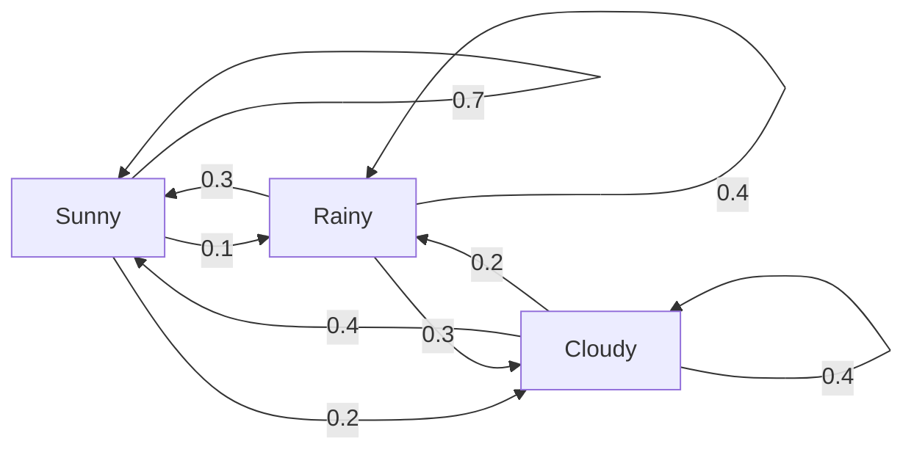
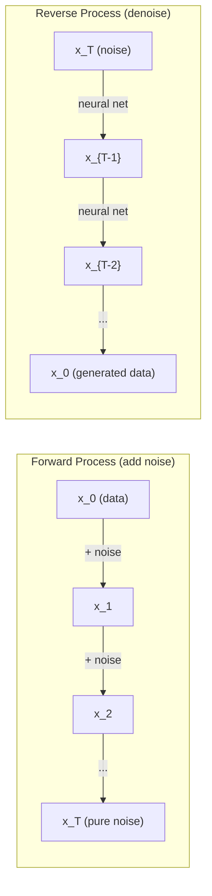

# Các quá trình ngẫu nhiên (Stochastic Processes)

> Tính ngẫu nhiên có cấu trúc. Toán học đằng sau các bước đi ngẫu nhiên (random walks), chuỗi Markov và các mô hình khuếch tán (diffusion models).

**Type:** Learn
**Language:** Python
**Prerequisites:** Phase 1, Lessons 06-07 (xác suất, Bayes)
**Time:** ~75 phút

## Mục tiêu học tập

- Mô phỏng các bước đi ngẫu nhiên 1D và 2D và kiểm chứng tỉ lệ co giãn sqrt(n) của độ dịch chuyển
- Xây dựng trình mô phỏng chuỗi Markov và tính toán phân phối dừng (stationary distribution) thông qua phân rã eigendecomposition
- Triển khai Metropolis-Hastings MCMC và động lực học Langevin để lấy mẫu từ các phân phối mục tiêu
- Kết nối quá trình khuếch tán thuận với chuyển động Brownian và giải thích cách quá trình ngược tạo ra dữ liệu

## Vấn đề

Nhiều hệ thống AI liên quan đến tính ngẫu nhiên phát triển theo thời gian. Không phải tính ngẫu nhiên tĩnh -- mà là tính ngẫu nhiên có cấu trúc, tuần tự, nơi mỗi bước phụ thuộc vào những gì đã xảy ra trước đó.

Các mô hình ngôn ngữ tạo ra các token từng cái một. Mỗi token phụ thuộc vào ngữ cảnh trước đó. Mô hình xuất ra một phân phối xác suất, lấy mẫu từ đó và tiếp tục. Đó là một quá trình ngẫu nhiên.

Các mô hình khuếch tán thêm nhiễu vào hình ảnh từng bước một cho đến khi nó trở thành nhiễu tĩnh thuần túy. Sau đó, chúng đảo ngược quá trình, khử nhiễu từng bước cho đến khi một hình ảnh mới xuất hiện. Quá trình thuận là một chuỗi Markov. Quá trình ngược là một chuỗi Markov đã học được chạy ngược lại.

Các tác nhân học tăng cường (reinforcement learning) thực hiện các hành động trong một môi trường. Mỗi hành động dẫn đến một trạng thái mới với một xác suất nhất định. Tác nhân tuân theo một chính sách ngẫu nhiên trong một thế giới ngẫu nhiên. Toàn bộ quá trình này là một quá trình quyết định Markov (Markov decision process).

Lấy mẫu MCMC -- xương sống của suy luận Bayes -- xây dựng một chuỗi Markov có phân phối dừng chính là phân phối hậu nghiệm (posterior) mà bạn muốn lấy mẫu.

Tất cả những điều này được xây dựng trên bốn ý tưởng nền tảng:
1. Random walks -- quá trình ngẫu nhiên đơn giản nhất
2. Chuỗi Markov -- tính ngẫu nhiên có cấu trúc với ma trận chuyển trạng thái
3. Động lực học Langevin -- hạ gradient với nhiễu
4. Metropolis-Hastings -- lấy mẫu từ bất kỳ phân phối nào

## Khái niệm

### Random Walks

Bắt đầu tại vị trí 0. Ở mỗi bước, tung một đồng xu công bằng. Ngửa: di chuyển sang phải (+1). Sấp: di chuyển sang trái (-1).

Sau n bước, vị trí của bạn là tổng của n giá trị +/-1 ngẫu nhiên. Vị trí kỳ vọng là 0 (bước đi không chệch). Nhưng khoảng cách kỳ vọng từ gốc tọa độ tăng theo sqrt(n).

Điều này đi ngược lại trực giác. Bước đi là công bằng -- không có độ lệch theo bất kỳ hướng nào. Nhưng theo thời gian, nó đi lang thang ngày càng xa nơi nó bắt đầu. Độ lệch chuẩn sau n bước là sqrt(n).

```
Step 0:  Position = 0
Step 1:  Position = +1 or -1
Step 2:  Position = +2, 0, or -2
...
Step 100: Expected distance from origin ~ 10 (sqrt(100))
Step 10000: Expected distance from origin ~ 100 (sqrt(10000))
```

**Trong 2D**, bước đi di chuyển lên, xuống, trái hoặc phải với xác suất bằng nhau. Tỉ lệ co giãn sqrt(n) tương tự áp dụng cho khoảng cách từ gốc tọa độ. Đường đi tạo ra một mô hình giống fractal.

**Tại sao lại là sqrt(n)?** Mỗi bước là +1 hoặc -1 với xác suất bằng nhau. Sau n bước, vị trí S_n = X_1 + X_2 + ... + X_n trong đó mỗi X_i là +/-1. Phương sai của mỗi bước là 1, và các bước là độc lập, vì vậy Var(S_n) = n. Độ lệch chuẩn = sqrt(n). Theo định lý giới hạn trung tâm, S_n / sqrt(n) hội tụ về phân phối chuẩn tắc.

Tỉ lệ co giãn sqrt(n) này xuất hiện ở khắp mọi nơi trong ML. Nhiễu SGD co giãn theo 1/sqrt(batch_size). Kích thước embedding co giãn theo sqrt(d). Căn bậc hai là dấu hiệu của các phép cộng ngẫu nhiên độc lập.

**Kết nối với chuyển động Brownian.** Lấy một bước đi ngẫu nhiên với kích thước bước 1/sqrt(n) và n bước trên mỗi đơn vị thời gian. Khi n tiến tới vô cùng, bước đi hội tụ về chuyển động Brownian B(t) -- một quá trình thời gian liên tục trong đó B(t) được phân phối chuẩn với trung bình 0 và phương sai t.

Chuyển động Brownian là nền tảng toán học của khuếch tán. Nó mô hình hóa sự rung động ngẫu nhiên của các hạt trong chất lỏng, sự biến động của giá cổ phiếu, và -- quan trọng nhất -- quá trình nhiễu trong các mô hình khuếch tán.

**Gambler's ruin.** Một người đi bộ ngẫu nhiên bắt đầu tại vị trí k, với các rào cản hấp thụ tại 0 và N. Xác suất đạt đến N trước 0 là bao nhiêu? Đối với một bước đi công bằng: P(đạt đến N) = k/N. Điều này đơn giản và thanh lịch một cách đáng ngạc nhiên. Nó kết nối với lý thuyết về martingale -- bước đi ngẫu nhiên công bằng là một martingale (giá trị tương lai kỳ vọng = giá trị hiện tại).

### Chuỗi Markov

Chuỗi Markov là một hệ thống chuyển đổi giữa các trạng thái theo các xác suất cố định. Thuộc tính chính: trạng thái tiếp theo chỉ phụ thuộc vào trạng thái hiện tại, không phụ thuộc vào lịch sử.

```
P(X_{t+1} = j | X_t = i, X_{t-1} = ...) = P(X_{t+1} = j | X_t = i)
```

Đây là thuộc tính Markov. Nó có nghĩa là bạn có thể mô tả toàn bộ động lực học bằng một ma trận chuyển trạng thái P:

```
P[i][j] = probability of going from state i to state j
```

Mỗi hàng của P có tổng bằng 1 (bạn phải đi đến một nơi nào đó).

**Ví dụ -- Thời tiết:**

```
States: Sunny (0), Rainy (1), Cloudy (2)

P = [[0.7, 0.1, 0.2],    (if sunny: 70% sunny, 10% rainy, 20% cloudy)
     [0.3, 0.4, 0.3],    (if rainy: 30% sunny, 40% rainy, 30% cloudy)
     [0.4, 0.2, 0.4]]    (if cloudy: 40% sunny, 20% rainy, 40% cloudy)
```

Bắt đầu ở bất kỳ trạng thái nào. Sau nhiều lần chuyển đổi, phân phối các trạng thái hội tụ về phân phối dừng pi, trong đó pi * P = pi. Đây là vector riêng bên trái của P với giá trị riêng bằng 1.

Đối với chuỗi thời tiết, phân phối dừng là [0.55, 0.18, 0.27] -- về lâu dài, trời nắng 55% thời gian bất kể trạng thái bắt đầu là gì.



**Tính toán phân phối dừng.** Có hai cách tiếp cận:

1. **Phương pháp lũy thừa (Power method)**: nhân bất kỳ phân phối ban đầu nào với P nhiều lần. Sau đủ số lần lặp, nó sẽ hội tụ.
2. **Phương pháp giá trị riêng (Eigenvalue method)**: tìm vector riêng bên trái của P với giá trị riêng bằng 1. Đây là vector riêng của P^T với giá trị riêng bằng 1.

Cả hai cách tiếp cận đều yêu cầu chuỗi phải thỏa mãn các điều kiện hội tụ.

**Điều kiện hội tụ.** Một chuỗi Markov hội tụ về một phân phối dừng duy nhất nếu nó:
- **Bất khả quy (Irreducible)**: mọi trạng thái đều có thể đạt được từ mọi trạng thái khác
- **Phi chu kỳ (Aperiodic)**: chuỗi không lặp lại theo một chu kỳ cố định

Hầu hết các chuỗi bạn gặp trong ML đều thỏa mãn cả hai điều kiện này.

**Trạng thái hấp thụ (Absorbing states).** Một trạng thái là hấp thụ nếu một khi bạn bước vào đó, bạn không bao giờ rời đi (P[i][i] = 1). Các chuỗi Markov hấp thụ mô hình hóa các quá trình có trạng thái kết thúc -- một trò chơi kết thúc, một khách hàng rời bỏ, một chuỗi token chạm đến token kết thúc văn bản.

**Thời gian trộn (Mixing time).** Cần bao nhiêu bước để chuỗi "gần" với phân phối dừng? Về mặt hình thức, số bước cho đến khi khoảng cách biến thiên tổng từ trạng thái dừng giảm xuống dưới một ngưỡng nào đó. Trộn nhanh = cần ít bước. Khe phổ (spectral gap) của P (1 trừ đi giá trị riêng lớn thứ hai) kiểm soát thời gian trộn. Khe càng lớn = trộn càng nhanh.

### Kết nối với các mô hình ngôn ngữ

Việc tạo token trong một mô hình ngôn ngữ xấp xỉ là một quá trình Markov. Với ngữ cảnh hiện tại, mô hình xuất ra một phân phối trên token tiếp theo. Nhiệt độ (temperature) kiểm soát độ sắc nét:

```
P(token_i) = exp(logit_i / temperature) / sum(exp(logit_j / temperature))
```

- Nhiệt độ = 1.0: phân phối chuẩn
- Nhiệt độ < 1.0: sắc nét hơn (mang tính quyết định hơn)
- Nhiệt độ > 1.0: phẳng hơn (ngẫu nhiên hơn)
- Nhiệt độ -> 0: argmax (tham lam)

Lấy mẫu Top-k cắt bớt các token có xác suất cao nhất. Lấy mẫu Top-p (nucleus) cắt bớt tập hợp nhỏ nhất các token có xác suất tích lũy vượt quá p. Cả hai đều sửa đổi các xác suất chuyển trạng thái Markov.

### Chuyển động Brownian

Giới hạn thời gian liên tục của bước đi ngẫu nhiên. Vị trí B(t) có ba thuộc tính:
1. B(0) = 0
2. B(t) - B(s) được phân phối chuẩn với trung bình 0 và phương sai t - s (với t > s)
3. Các gia số trên các khoảng không chồng lấp là độc lập

Chuyển động Brownian là liên tục nhưng không khả vi ở bất cứ đâu -- nó rung động ở mọi quy mô. Đường đi có chiều fractal là 2 trong mặt phẳng.

Trong mô phỏng rời rạc, bạn xấp xỉ chuyển động Brownian bằng:

```
B(t + dt) = B(t) + sqrt(dt) * z,    where z ~ N(0, 1)
```

Tỉ lệ co giãn sqrt(dt) là rất quan trọng. Nó đến từ định lý giới hạn trung tâm áp dụng cho các bước đi ngẫu nhiên.

### Động lực học Langevin

Hạ gradient tìm cực tiểu của một hàm số. Động lực học Langevin tìm phân phối xác suất tỉ lệ với exp(-U(x)/T), trong đó U là hàm năng lượng và T là nhiệt độ.

```
x_{t+1} = x_t - dt * gradient(U(x_t)) + sqrt(2 * T * dt) * z_t
```

Hai lực tác động lên hạt:
1. **Lực gradient** (-dt * gradient(U)): đẩy về phía năng lượng thấp (giống như hạ gradient)
2. **Lực ngẫu nhiên** (sqrt(2*T*dt) * z): đẩy theo các hướng ngẫu nhiên (khám phá)

Tại nhiệt độ T = 0, đây là hạ gradient thuần túy. Ở nhiệt độ cao, nó gần như là một bước đi ngẫu nhiên. Ở nhiệt độ phù hợp, hạt khám phá cảnh quan năng lượng và dành nhiều thời gian hơn ở các vùng năng lượng thấp.

**Kết nối với các mô hình khuếch tán.** Quá trình thuận của một mô hình khuếch tán là:

```
x_t = sqrt(alpha_t) * x_{t-1} + sqrt(1 - alpha_t) * noise
```

Đây là một chuỗi Markov dần dần trộn dữ liệu với nhiễu. Sau đủ số bước, x_T là nhiễu Gaussian thuần túy.

Quá trình ngược -- đi từ nhiễu trở lại dữ liệu -- cũng là một chuỗi Markov, nhưng các xác suất chuyển trạng thái của nó được học bởi một mạng thần kinh. Mạng học cách dự đoán nhiễu đã được thêm vào ở mỗi bước, sau đó trừ nó đi.



### MCMC: Markov Chain Monte Carlo

Đôi khi bạn cần lấy mẫu từ một phân phối p(x) mà bạn có thể đánh giá (đến một hằng số) nhưng không thể lấy mẫu trực tiếp. Các phân phối hậu nghiệm Bayes là ví dụ điển hình -- bạn biết tích của hàm khả năng (likelihood) và phân phối tiên nghiệm (prior), nhưng hằng số chuẩn hóa là không thể tính toán được.

**Metropolis-Hastings** xây dựng một chuỗi Markov có phân phối dừng là p(x):

1. Bắt đầu tại một vị trí x nào đó
2. Đề xuất một vị trí mới x' từ một phân phối đề xuất Q(x'|x)
3. Tính tỉ lệ chấp nhận: a = p(x') * Q(x|x') / (p(x) * Q(x'|x))
4. Chấp nhận x' với xác suất min(1, a). Nếu không, giữ nguyên tại x.
5. Lặp lại.

Nếu Q đối xứng (ví dụ: Q(x'|x) = Q(x|x') = N(x, sigma^2)), tỉ lệ đơn giản hóa thành a = p(x') / p(x). Bạn chỉ cần tỉ lệ xác suất -- hằng số chuẩn hóa bị triệt tiêu.

Chuỗi được đảm bảo hội tụ về p(x) trong các điều kiện nhẹ. Nhưng sự hội tụ có thể chậm nếu đề xuất quá nhỏ (bước đi ngẫu nhiên) hoặc quá lớn (từ chối cao). Điều chỉnh đề xuất là nghệ thuật của MCMC.

**Tại sao nó hoạt động.** Tỉ lệ chấp nhận đảm bảo cân bằng chi tiết (detailed balance): xác suất ở tại x và di chuyển đến x' bằng xác suất ở tại x' và di chuyển đến x. Cân bằng chi tiết ngụ ý rằng p(x) là phân phối dừng của chuỗi. Vì vậy, sau đủ số bước, các mẫu đến từ p(x).

**Các cân nhắc thực tế:**
- **Burn-in**: loại bỏ N mẫu đầu tiên. Chuỗi cần thời gian để đạt đến phân phối dừng từ điểm bắt đầu của nó.
- **Thinning**: giữ lại mỗi mẫu thứ k để giảm tự tương quan.
- **Nhiều chuỗi**: chạy một vài chuỗi từ các điểm bắt đầu khác nhau. Nếu chúng hội tụ về cùng một phân phối, bạn có bằng chứng về sự hội tụ.
- **Tỉ lệ chấp nhận**: đối với các đề xuất Gaussian trong d chiều, tỉ lệ chấp nhận tối ưu là khoảng 23% (Roberts & Rosenthal, 2001). Quá cao có nghĩa là chuỗi hầu như không di chuyển. Quá thấp có nghĩa là nó từ chối mọi thứ.

### Các quá trình ngẫu nhiên trong AI

| Quá trình | Ứng dụng AI |
|---------|---------------|
| Random walk | Khám phá trong RL, Node2Vec embeddings |
| Chuỗi Markov | Tạo văn bản, lấy mẫu MCMC |
| Chuyển động Brownian | Các mô hình khuếch tán (quá trình thuận) |
| Động lực học Langevin | Các mô hình tạo dựa trên điểm số (score-based), SGLD |
| Quá trình quyết định Markov | Học tăng cường |
| Metropolis-Hastings | Suy luận Bayes, lấy mẫu hậu nghiệm |

```figure
random-walk-diffusion
```

## Xây dựng

### Bước 1: Trình mô phỏng random walk

```python
import numpy as np

def random_walk_1d(n_steps, seed=None):
    rng = np.random.RandomState(seed)
    steps = rng.choice([-1, 1], size=n_steps)
    positions = np.concatenate([[0], np.cumsum(steps)])
    return positions


def random_walk_2d(n_steps, seed=None):
    rng = np.random.RandomState(seed)
    directions = rng.choice(4, size=n_steps)
    dx = np.zeros(n_steps)
    dy = np.zeros(n_steps)
    dx[directions == 0] = 1   # right
    dx[directions == 1] = -1  # left
    dy[directions == 2] = 1   # up
    dy[directions == 3] = -1  # down
    x = np.concatenate([[0], np.cumsum(dx)])
    y = np.concatenate([[0], np.cumsum(dy)])
    return x, y
```

Bước đi 1D lưu trữ các tổng tích lũy. Mỗi bước là +1 hoặc -1. Sau n bước, vị trí là tổng. Phương sai tăng tuyến tính với n, vì vậy độ lệch chuẩn tăng theo sqrt(n).

### Bước 2: Chuỗi Markov

```python
class MarkovChain:
    def __init__(self, transition_matrix, state_names=None):
        self.P = np.array(transition_matrix, dtype=float)
        self.n_states = len(self.P)
        self.state_names = state_names or [str(i) for i in range(self.n_states)]

    def step(self, current_state, rng=None):
        if rng is None:
            rng = np.random.RandomState()
        probs = self.P[current_state]
        return rng.choice(self.n_states, p=probs)

    def simulate(self, start_state, n_steps, seed=None):
        rng = np.random.RandomState(seed)
        states = [start_state]
        current = start_state
        for _ in range(n_steps):
            current = self.step(current, rng)
            states.append(current)
        return states

    def stationary_distribution(self):
        eigenvalues, eigenvectors = np.linalg.eig(self.P.T)
        idx = np.argmin(np.abs(eigenvalues - 1.0))
        stationary = np.real(eigenvectors[:, idx])
        stationary = stationary / stationary.sum()
        return np.abs(stationary)
```

Phân phối dừng là vector riêng bên trái của P với giá trị riêng bằng 1. Chúng ta tìm nó bằng cách tính các vector riêng của P^T (chuyển vị biến các vector riêng bên trái thành các vector riêng bên phải).

### Bước 3: Động lực học Langevin

```python
def langevin_dynamics(grad_U, x0, dt, temperature, n_steps, seed=None):
    rng = np.random.RandomState(seed)
    x = np.array(x0, dtype=float)
    trajectory = [x.copy()]
    for _ in range(n_steps):
        noise = rng.randn(*x.shape)
        x = x - dt * grad_U(x) + np.sqrt(2 * temperature * dt) * noise
        trajectory.append(x.copy())
    return np.array(trajectory)
```

Gradient đẩy x về phía năng lượng thấp. Nhiễu ngăn nó bị mắc kẹt. Tại trạng thái cân bằng, phân phối các mẫu tỉ lệ với exp(-U(x)/nhiệt độ).

### Bước 4: Metropolis-Hastings

```python
def metropolis_hastings(target_log_prob, proposal_std, x0, n_samples, seed=None):
    rng = np.random.RandomState(seed)
    x = np.array(x0, dtype=float)
    samples = [x.copy()]
    accepted = 0
    for _ in range(n_samples - 1):
        x_proposed = x + rng.randn(*x.shape) * proposal_std
        log_ratio = target_log_prob(x_proposed) - target_log_prob(x)
        if np.log(rng.rand()) < log_ratio:
            x = x_proposed
            accepted += 1
        samples.append(x.copy())
    acceptance_rate = accepted / (n_samples - 1)
    return np.array(samples), acceptance_rate
```

Thuật toán đề xuất một điểm mới, kiểm tra xem nó có xác suất cao hơn không (hoặc chấp nhận với xác suất tỉ lệ với tỉ lệ), và lặp lại. Tỉ lệ chấp nhận nên nằm trong khoảng 23-50% để trộn tốt.

## Sử dụng

Trong thực tế, bạn sử dụng các thư viện đã thiết lập cho các thuật toán này. Nhưng hiểu cơ chế là quan trọng để gỡ lỗi và tinh chỉnh.

```python
import numpy as np

rng = np.random.RandomState(42)
walk = np.cumsum(rng.choice([-1, 1], size=10000))
print(f"Final position: {walk[-1]}")
print(f"Expected distance: {np.sqrt(10000):.1f}")
print(f"Actual distance: {abs(walk[-1])}")
```

### numpy cho ma trận chuyển trạng thái

```python
import numpy as np

P = np.array([[0.7, 0.1, 0.2],
              [0.3, 0.4, 0.3],
              [0.4, 0.2, 0.4]])

distribution = np.array([1.0, 0.0, 0.0])
for _ in range(100):
    distribution = distribution @ P

print(f"Stationary distribution: {np.round(distribution, 4)}")
```

Nhân phân phối ban đầu với P nhiều lần. Sau đủ số lần lặp, nó hội tụ về phân phối dừng bất kể bạn bắt đầu từ đâu. Đây là phương pháp lũy thừa để tìm vector riêng bên trái chiếm ưu thế.

### Kết nối với các framework thực tế

- **PyTorch diffusion:** `DDPMScheduler` trong Hugging Face `diffusers` triển khai các chuỗi Markov thuận và ngược
- **NumPyro / PyMC:** Sử dụng MCMC (trình lấy mẫu NUTS, cải tiến từ Metropolis-Hastings) cho suy luận Bayes
- **Gymnasium (RL):** Hàm step của môi trường xác định một quá trình quyết định Markov

### Kiểm chứng sự hội tụ của chuỗi Markov

```python
import numpy as np

P = np.array([[0.9, 0.1], [0.3, 0.7]])

eigenvalues = np.linalg.eigvals(P)
spectral_gap = 1 - sorted(np.abs(eigenvalues))[-2]
print(f"Eigenvalues: {eigenvalues}")
print(f"Spectral gap: {spectral_gap:.4f}")
print(f"Approximate mixing time: {1/spectral_gap:.1f} steps")
```

Khe phổ cho bạn biết chuỗi quên trạng thái ban đầu nhanh như thế nào. Khe 0.2 có nghĩa là cần khoảng 5 bước để trộn. Khe 0.01 có nghĩa là cần khoảng 100 bước. Luôn kiểm tra điều này trước khi chạy các mô phỏng dài -- một chuỗi trộn chậm sẽ lãng phí tài nguyên tính toán.

## Ship It

Bài học này tạo ra:
- `outputs/prompt-stochastic-process-advisor.md` -- một prompt giúp xác định framework quá trình ngẫu nhiên nào áp dụng cho một vấn đề nhất định

## Kết nối

| Khái niệm | Nơi xuất hiện |
|---------|------------------|
| Random walk | Node2Vec graph embeddings, khám phá trong RL |
| Chuỗi Markov | Tạo token trong LLM, lấy mẫu MCMC |
| Chuyển động Brownian | Quá trình khuếch tán thuận trong DDPM, các mô hình dựa trên SDE |
| Động lực học Langevin | Các mô hình tạo dựa trên điểm số, stochastic gradient Langevin dynamics (SGLD) |
| Phân phối dừng | Mục tiêu hội tụ MCMC, PageRank |
| Metropolis-Hastings | Lấy mẫu hậu nghiệm Bayes, luyện kim mô phỏng (simulated annealing) |
| Nhiệt độ | Lấy mẫu LLM, khám phá Boltzmann trong RL, luyện kim mô phỏng |
| Thời gian trộn | Tốc độ hội tụ của MCMC, phân tích khe phổ |
| Trạng thái hấp thụ | Token kết thúc chuỗi, các trạng thái kết thúc trong RL |
| Cân bằng chi tiết | Đảm bảo tính đúng đắn cho các trình lấy mẫu MCMC |

Các mô hình khuếch tán xứng đáng được chú ý đặc biệt. DDPM (Ho et al., 2020) xác định một chuỗi Markov thuận:

```
q(x_t | x_{t-1}) = N(x_t; sqrt(1-beta_t) * x_{t-1}, beta_t * I)
```

trong đó beta_t là lịch trình nhiễu. Sau T bước, x_T xấp xỉ N(0, I). Quá trình ngược được tham số hóa bởi một mạng thần kinh dự đoán nhiễu:

```
p_theta(x_{t-1} | x_t) = N(x_{t-1}; mu_theta(x_t, t), sigma_t^2 * I)
```

Mỗi bước tạo là một bước trong một chuỗi Markov đã học. Hiểu chuỗi Markov có nghĩa là hiểu cách thức và lý do tại sao các mô hình khuếch tán tạo ra dữ liệu.

SGLD (Stochastic Gradient Langevin Dynamics) kết hợp hạ gradient mini-batch với nhiễu Langevin. Thay vì tính toán gradient đầy đủ, bạn sử dụng một ước tính ngẫu nhiên và thêm nhiễu đã hiệu chuẩn. Khi tốc độ học giảm dần, SGLD chuyển từ tối ưu hóa sang lấy mẫu -- bạn nhận được các mẫu hậu nghiệm Bayes xấp xỉ miễn phí. Đây là một trong những cách đơn giản nhất để có được ước tính độ không chắc chắn từ một mạng thần kinh.

Thông tin chính xuyên suốt tất cả các kết nối này: các quá trình ngẫu nhiên không chỉ là các công cụ lý thuyết. Chúng là các cơ chế tính toán bên trong các hệ thống AI hiện đại. Khi bạn điều chỉnh nhiệt độ của một LLM, bạn đang điều chỉnh một chuỗi Markov. Khi bạn huấn luyện một mô hình khuếch tán, bạn đang học cách đảo ngược một quá trình giống chuyển động Brownian. Khi bạn chạy suy luận Bayes, bạn đang xây dựng một chuỗi hội tụ về phân phối hậu nghiệm.

## Bài tập

1. **Mô phỏng 1000 random walks với 10000 bước.** Vẽ phân phối các vị trí cuối cùng. Kiểm chứng rằng nó xấp xỉ Gaussian với trung bình 0 và độ lệch chuẩn sqrt(10000) = 100.

2. **Xây dựng trình tạo văn bản sử dụng chuỗi Markov.** Huấn luyện trên một tập dữ liệu nhỏ: với mỗi từ, đếm các chuyển đổi sang từ tiếp theo. Xây dựng ma trận chuyển trạng thái. Tạo các câu mới bằng cách lấy mẫu từ chuỗi.

3. **Triển khai luyện kim mô phỏng (simulated annealing)** sử dụng Metropolis-Hastings. Bắt đầu ở nhiệt độ cao (chấp nhận hầu hết mọi thứ) và dần dần làm mát (chỉ chấp nhận các cải tiến). Sử dụng nó để tìm cực tiểu của một hàm có nhiều cực tiểu địa phương.

4. **So sánh động lực học Langevin ở các nhiệt độ khác nhau.** Lấy mẫu từ thế năng giếng kép U(x) = (x^2 - 1)^2. Ở nhiệt độ thấp, các mẫu tập trung trong một giếng. Ở nhiệt độ cao, chúng lan rộng ra cả hai. Tìm nhiệt độ tới hạn nơi chuỗi trộn giữa các giếng.

5. **Triển khai quá trình khuếch tán thuận.** Bắt đầu với một tín hiệu 1D (ví dụ: sóng sin). Thêm nhiễu dần dần qua 100 bước với lịch trình nhiễu tuyến tính. Cho thấy tín hiệu suy giảm thành nhiễu thuần túy như thế nào. Sau đó triển khai một bộ khử nhiễu đơn giản đảo ngược quá trình (thậm chí là một bộ đơn giản chỉ trừ đi nhiễu ước tính).

## Thuật ngữ chính

| Thuật ngữ | Mọi người nói | Ý nghĩa thực sự |
|------|----------------|----------------------|
| Random walk | "Chuyển động tung đồng xu" | Một quá trình trong đó vị trí thay đổi theo các gia số ngẫu nhiên ở mỗi bước |
| Thuộc tính Markov | "Không có bộ nhớ" | Tương lai chỉ phụ thuộc vào trạng thái hiện tại, không phụ thuộc vào lịch sử |
| Ma trận chuyển trạng thái | "Bảng xác suất" | P[i][j] = xác suất di chuyển từ trạng thái i sang trạng thái j |
| Phân phối dừng | "Trung bình dài hạn" | Phân phối pi trong đó pi*P = pi -- trạng thái cân bằng của chuỗi |
| Chuyển động Brownian | "Rung động ngẫu nhiên" | Giới hạn thời gian liên tục của một bước đi ngẫu nhiên, B(t) ~ N(0, t) |
| Động lực học Langevin | "Hạ gradient với nhiễu" | Quy tắc cập nhật kết hợp gradient tất định và nhiễu ngẫu nhiên |
| MCMC | "Đi bộ về phía mục tiêu" | Xây dựng một chuỗi Markov có phân phối dừng là phân phối bạn muốn |
| Metropolis-Hastings | "Đề xuất và chấp nhận/từ chối" | Thuật toán MCMC sử dụng tỉ lệ chấp nhận để đảm bảo hội tụ |
| Nhiệt độ | "Núm vặn ngẫu nhiên" | Tham số kiểm soát sự đánh đổi giữa khám phá và khai thác |
| Quá trình khuếch tán | "Nhiễu vào, nhiễu ra" | Thuận: dần dần thêm nhiễu. Ngược: dần dần loại bỏ nó. Tạo dữ liệu. |

## Đọc thêm

- **Ho, Jain, Abbeel (2020)** -- "Denoising Diffusion Probabilistic Models." Bài báo DDPM khởi đầu cuộc cách mạng mô hình khuếch tán. Suy luận rõ ràng về các chuỗi Markov thuận và ngược.
- **Song & Ermon (2019)** -- "Generative Modeling by Estimating Gradients of the Data Distribution." Cách tiếp cận dựa trên điểm số sử dụng động lực học Langevin để lấy mẫu.
- **Roberts & Rosenthal (2004)** -- "General state space Markov chains and MCMC algorithms." Lý thuyết đằng sau việc khi nào và tại sao MCMC hoạt động.
- **Norris (1997)** -- "Markov Chains." Sách giáo khoa tiêu chuẩn. Bao gồm sự hội tụ, phân phối dừng và thời gian chạm (hitting times).
- **Welling & Teh (2011)** -- "Bayesian Learning via Stochastic Gradient Langevin Dynamics." Kết hợp SGD với động lực học Langevin cho suy luận Bayes có thể mở rộng.