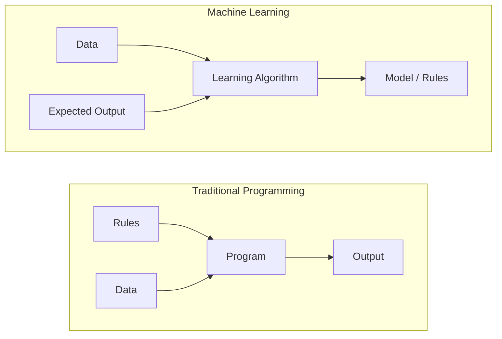
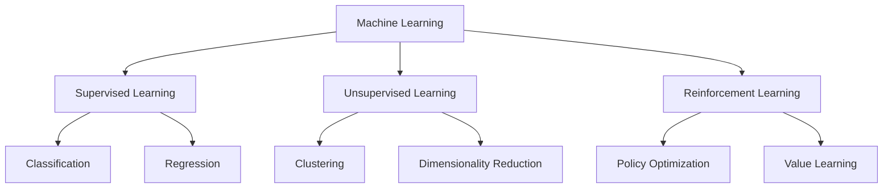
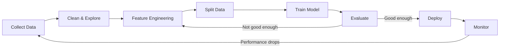
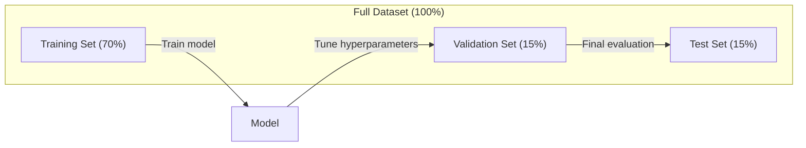
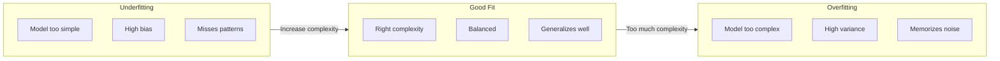
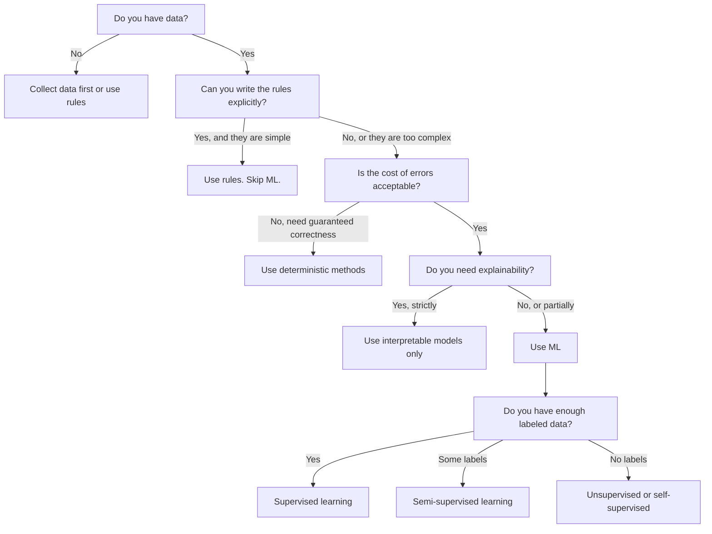

# Machine Learning là gì

> Machine learning là việc dạy máy tính tìm ra các quy luật trong dữ liệu thay vì viết các quy tắc bằng tay.

**Type:** Learn
**Languages:** Python
**Prerequisites:** Phase 1 (Math Foundations)
**Time:** ~45 phút

## Learning Objectives

- Giải thích sự khác biệt giữa supervised, unsupervised, và reinforcement learning và xác định loại nào áp dụng cho một bài toán cụ thể
- Triển khai một nearest centroid classifier từ đầu và đánh giá nó so với một random baseline
- Phân biệt giữa các tác vụ classification và regression và chọn loss function phù hợp cho mỗi loại
- Đánh giá liệu một bài toán kinh doanh cụ thể có phù hợp với ML hay tốt hơn là giải quyết bằng các quy tắc deterministic

## Vấn đề

Bạn muốn xây dựng một bộ lọc spam. Cách tiếp cận truyền thống: ngồi xuống và viết hàng trăm quy tắc. "Nếu email chứa 'FREE MONEY', đánh dấu là spam. Nếu nó có nhiều hơn 3 dấu chấm than, đánh dấu là spam." Bạn dành hàng tuần để viết các quy tắc. Sau đó, những kẻ gửi spam thay đổi cách dùng từ. Các quy tắc của bạn bị hỏng. Bạn viết thêm nhiều quy tắc hơn. Cái vòng lẩn quẩn này không bao giờ kết thúc.

Machine learning đảo ngược điều này. Thay vì viết các quy tắc, bạn đưa cho máy tính hàng nghìn email đã được dán nhãn ("spam" hoặc "không phải spam") và để nó tự tìm ra các quy tắc. Máy tính tìm thấy những quy luật mà bạn chưa bao giờ nghĩ tới. Khi những kẻ gửi spam thay đổi chiến thuật, bạn huấn luyện lại (retrain) trên dữ liệu mới thay vì viết lại mã nguồn.

Sự chuyển dịch từ "lập trình các quy tắc" sang "học từ dữ liệu" là cốt lõi của machine learning. Mọi hệ thống gợi ý, trợ lý giọng nói, xe tự lái và model ngôn ngữ đều hoạt động theo cách này.

## Khái niệm

### Học từ dữ liệu, không phải từ quy tắc

Lập trình truyền thống và machine learning giải quyết vấn đề theo hai hướng ngược nhau.



Lập trình truyền thống: bạn viết các quy tắc. Chương trình áp dụng chúng vào dữ liệu để tạo ra output.

Machine learning: bạn cung cấp dữ liệu và output mong đợi. Thuật toán sẽ khám phá ra các quy tắc.

"Model" thu được từ quá trình training CHÍNH LÀ các quy tắc, được mã hóa dưới dạng các con số (weights, parameters). Nó tổng quát hóa từ các ví dụ đã thấy để đưa ra dự đoán trên dữ liệu mà nó chưa từng thấy trước đây.

### Ba loại Machine Learning chính



**Supervised Learning**: Bạn có các cặp input-output. Model học cách ánh xạ từ input sang output.
- "Đây là 10.000 bức ảnh được dán nhãn mèo hoặc chó. Hãy học cách phân biệt chúng."
- "Đây là các đặc điểm của ngôi nhà và giá cả. Hãy học cách dự đoán giá."

**Unsupervised Learning**: Bạn chỉ có input. Không có label. Model tự tìm ra cấu trúc trong dữ liệu.
- "Đây là lịch sử mua hàng của 10.000 khách hàng. Hãy tìm các nhóm khách hàng tự nhiên."
- "Đây là các điểm dữ liệu 1.000 chiều. Hãy giảm xuống còn 2 chiều trong khi vẫn giữ nguyên cấu trúc."

**Reinforcement Learning**: Một agent thực hiện các hành động trong một môi trường và nhận được phần thưởng (rewards) hoặc hình phạt. Nó học một chiến lược (policy) để tối đa hóa tổng phần thưởng.
- "Chơi trò chơi này. +1 nếu thắng, -1 nếu thua. Hãy tìm ra một chiến lược."
- "Điều khiển cánh tay robot này. +1 nếu nhặt được vật thể, -0.01 cho mỗi giây lãng phí."

Hầu hết những gì bạn sẽ xây dựng trong thực tế đều sử dụng supervised learning. Unsupervised learning thường được dùng để tiền xử lý và khám phá dữ liệu. Reinforcement learning cung cấp sức mạnh cho AI trong trò chơi, robot và RLHF cho các model ngôn ngữ.

### Bên ngoài ba loại chính

Ba danh mục trên rất rõ ràng, nhưng trong thực tế ML thường làm mờ các ranh giới này.

**Semi-supervised learning** sử dụng một tập nhỏ dữ liệu có nhãn (labeled data) và một tập lớn dữ liệu không có nhãn (unlabeled data). Bạn có thể có 100 ảnh y tế có nhãn và 100.000 ảnh không có nhãn. Các kỹ thuật bao gồm:

- **Label propagation:** Xây dựng một đồ thị kết nối các điểm dữ liệu tương tự nhau. Nhãn sẽ lan truyền từ các node có nhãn sang các node lân cận không có nhãn thông qua đồ thị.
- **Pseudo-labeling:** Huấn luyện một model trên dữ liệu có nhãn, sử dụng nó để dự đoán nhãn cho dữ liệu không có nhãn, sau đó huấn luyện lại trên tất cả mọi thứ. Model tự "bootstraps" tập huấn luyện của chính nó.
- **Consistency regularization:** Model nên đưa ra cùng một dự đoán cho một input và một phiên bản bị biến đổi nhẹ (perturbed) của input đó. Điều này hoạt động ngay cả khi không có nhãn.

**Self-supervised learning** tạo ra sự giám sát từ chính dữ liệu. Không cần nhãn do con người tạo ra. Model tự tạo ra tác vụ dự đoán từ cấu trúc của dữ liệu.

- **Masked language modeling (BERT):** Ẩn 15% các từ trong một câu, huấn luyện model để dự đoán các từ còn thiếu. Các "nhãn" đến từ văn bản gốc.
- **Contrastive learning (SimCLR):** Lấy một hình ảnh, tạo ra hai phiên bản tăng cường (augmented). Huấn luyện model để nhận diện chúng đến từ cùng một ảnh trong khi phân biệt chúng với các phiên bản tăng cường của các ảnh khác.
- **Next-token prediction (GPT):** Dự đoán từ tiếp theo dựa trên tất cả các từ trước đó. Mỗi tài liệu văn bản đều trở thành một ví dụ huấn luyện.

Đây không phải là các danh mục tách biệt với ba loại lớn. Chúng là các chiến lược kết hợp các ý tưởng của supervised và unsupervised. Self-supervised learning về mặt kỹ thuật là supervised (model dự đoán một cái gì đó), nhưng các nhãn được tạo tự động, không phải bởi con người.

### Classification vs Regression

Đây là hai tác vụ supervised learning chính.

| Khía cạnh | Classification | Regression |
|-----------|---------------|------------|
| Output | Các danh mục rời rạc | Các con số liên tục |
| Ví dụ | "Email này có phải là spam không?" | "Giá nhà sẽ là bao nhiêu?" |
| Không gian output | {mèo, chó, chim} | Bất kỳ số thực nào |
| Loss function | Cross-entropy, accuracy | Mean squared error, MAE |
| Quyết định | Ranh giới giữa các class | Một đường cong khớp với dữ liệu |

Classification trả lời câu hỏi "thuộc danh mục nào?". Regression trả lời câu hỏi "bao nhiêu?".

Một số bài toán có thể được đóng khung theo cả hai cách. Dự đoán một cổ phiếu tăng hay giảm là classification. Dự đoán giá chính xác là regression.

### Quy trình ML (ML Workflow)

Mọi dự án machine learning đều tuân theo cùng một pipeline, bất kể thuật toán là gì.



**Collect Data**: Thu thập dữ liệu thô. Càng nhiều dữ liệu hầu như luôn tốt hơn, nhưng chất lượng quan trọng hơn số lượng.

**Clean & Explore**: Xử lý các giá trị thiếu, loại bỏ các bản ghi trùng lặp, trực quan hóa phân phối, phát hiện các điểm bất thường. Bước này thường chiếm 60-80% tổng thời gian dự án.

**Feature Engineering**: Chuyển đổi dữ liệu thô thành các feature mà model có thể sử dụng. Chuyển đổi ngày tháng thành thứ trong tuần. Chuẩn hóa các cột số. Mã hóa các biến phân loại. Các feature tốt quan trọng hơn các thuật toán phức tạp.

**Split Data**: Chia thành các tập training, validation, và test. Model học trên dữ liệu training, bạn tinh chỉnh hyperparameters trên dữ liệu validation, và bạn báo cáo hiệu suất cuối cùng trên dữ liệu test.

**Train Model**: Đưa dữ liệu training vào một thuật toán. Thuật toán điều chỉnh các tham số nội bộ để tối thiểu hóa một loss function.

**Evaluate**: Đo lường hiệu suất trên dữ liệu validation/test. Nếu hiệu suất không thể chấp nhận được, hãy quay lại và thử các feature, thuật toán hoặc hyperparameters khác nhau.

**Deploy**: Đưa model vào môi trường production nơi nó đưa ra dự đoán trên dữ liệu mới.

**Monitor**: Theo dõi hiệu suất theo thời gian. Phân phối dữ liệu thay đổi (data drift), và các model bị xuống cấp. Khi hiệu suất giảm, hãy huấn luyện lại.

### Chia tập Training, Validation, và Test

Đây là khái niệm quan trọng nhất mà những người mới bắt đầu thường làm sai. Bạn phải đánh giá model của mình trên dữ liệu mà nó chưa từng thấy trong quá trình training. Nếu không, bạn đang đo lường khả năng ghi nhớ chứ không phải khả năng học hỏi.



| Phân tách | Mục đích | Khi nào sử dụng | Kích thước điển hình |
|-----------|---------|-----------------|----------------------|
| Training | Model học từ dữ liệu này | Trong khi training | 60-80% |
| Validation | Tinh chỉnh hyperparameters, so sánh các model | Sau mỗi lần chạy training | 10-20% |
| Test | Ước tính hiệu suất khách quan cuối cùng | Một lần duy nhất, ở bước cuối cùng | 10-20% |

Tập test là bất khả xâm phạm. Bạn chỉ nhìn vào nó đúng một lần. Nếu bạn liên tục điều chỉnh model của mình dựa trên hiệu suất của tập test, bạn đang thực sự huấn luyện trên tập test và các con số bạn báo cáo sẽ trở nên vô nghĩa.

Đối với các tập dữ liệu nhỏ, hãy sử dụng k-fold cross-validation: chia dữ liệu thành k phần, huấn luyện trên k-1 phần, validate trên phần còn lại, xoay vòng và tính trung bình kết quả.

### Overfitting vs Underfitting



**Underfitting**: Model quá đơn giản để nắm bắt các quy luật trong dữ liệu. Giống như một đường thẳng cố gắng khớp với một mối quan hệ đường cong. Sai số training cao. Sai số test cao.

**Overfitting**: Model quá phức tạp và ghi nhớ luôn cả dữ liệu huấn luyện, bao gồm cả nhiễu (noise) của nó. Một đường cong ngoằn ngoèo đi qua mọi điểm huấn luyện nhưng thất bại trên dữ liệu mới. Sai số training thấp. Sai số test cao.

**Good fit**: Model nắm bắt được các quy luật thực sự mà không ghi nhớ nhiễu. Sai số training và sai số test đều thấp ở mức hợp lý.

Dấu hiệu của overfitting:
- Độ chính xác training cao hơn nhiều so với độ chính xác validation
- Model hoạt động tốt trên dữ liệu training nhưng kém trên dữ liệu mới
- Thêm nhiều dữ liệu huấn luyện giúp cải thiện hiệu suất (model đã ghi nhớ chứ không phải học)

Cách khắc phục overfitting:
- Lấy thêm dữ liệu huấn luyện
- Giảm độ phức tạp của model (ít tham số hơn, kiến trúc đơn giản hơn)
- Regularization (thêm hình phạt cho các trọng số lớn)
- Dropout (ngẫu nhiên loại bỏ các neuron trong quá trình training)
- Early stopping (dừng training khi sai số validation bắt đầu tăng)

Cách khắc phục underfitting:
- Sử dụng một model phức tạp hơn
- Thêm nhiều feature hơn
- Giảm regularization
- Huấn luyện lâu hơn

### Bias-Variance Tradeoff

Đây là khung toán học đằng sau overfitting và underfitting.

**Bias**: Sai số từ các giả định sai trong model. Một model tuyến tính có bias cao khi mối quan hệ thực sự là phi tuyến tính. Bias cao dẫn đến underfitting.

**Variance**: Sai số từ sự nhạy cảm với các biến động nhỏ trong dữ liệu huấn luyện. Một model có variance cao sẽ đưa ra các dự đoán rất khác nhau khi được huấn luyện trên các tập con dữ liệu khác nhau. Variance cao dẫn đến overfitting.

| Độ phức tạp của model | Bias | Variance | Kết quả |
|-----------------------|------|----------|---------|
| Quá thấp (model tuyến tính cho dữ liệu cong) | Cao | Thấp | Underfitting |
| Vừa đủ | Trung bình | Trung bình | Khả năng tổng quát hóa tốt |
| Quá cao (đa thức bậc 20 cho 10 điểm) | Thấp | Cao | Overfitting |

Tổng sai số (Total error) = Bias^2 + Variance + Irreducible noise

Bạn không thể giảm irreducible noise (đó là sự ngẫu nhiên trong chính dữ liệu). Bạn muốn tìm điểm cân bằng nơi bias^2 + variance được tối thiểu hóa.

### Định lý No Free Lunch

Không có một thuật toán duy nhất nào hoạt động tốt nhất cho mọi bài toán. Một thuật toán hoạt động tốt trên một lớp bài toán này sẽ hoạt động kém trên một lớp bài toán khác. Đây là lý do tại sao các nhà khoa học dữ liệu thường thử nhiều thuật toán và so sánh kết quả.

Trong thực tế, sự lựa chọn phụ thuộc vào:
- Bạn có bao nhiêu dữ liệu
- Có bao nhiêu feature
- Mối quan hệ là tuyến tính hay phi tuyến tính
- Bạn có cần khả năng giải thích (interpretability) không
- Bạn có thể chi trả bao nhiêu tài nguyên tính toán (compute)

### Khi nào KHÔNG nên sử dụng Machine Learning

ML rất mạnh mẽ nhưng không phải lúc nào cũng là công cụ phù hợp. Trước khi tìm đến một model, hãy tự hỏi liệu bạn có thực sự cần nó hay không.

**Không sử dụng ML khi:**

- **Các quy tắc đơn giản và được xác định rõ ràng.** Tính thuế, thuật toán sắp xếp, chuyển đổi đơn vị. Nếu bạn có thể viết logic trong một vài câu lệnh if, một model chỉ làm tăng thêm sự phức tạp mà không mang lại lợi ích gì.
- **Bạn không có dữ liệu hoặc có rất ít dữ liệu.** ML cần các ví dụ để học hỏi. Với 10 điểm dữ liệu, bạn không thể huấn luyện bất cứ điều gì có ý nghĩa. Hãy thu thập dữ liệu trước.
- **Cái giá của việc sai lầm là thảm khốc và bạn cần sự chính xác tuyệt đối.** Tính toán liều lượng thuốc, điều khiển lò phản ứng hạt nhân, xác minh mật mã. Các model ML mang tính xác suất. Đôi khi chúng sẽ sai. Nếu "đôi khi sai" là không thể chấp nhận được, hãy sử dụng các phương pháp deterministic.
- **Một bảng tra cứu (lookup table) hoặc heuristic có thể giải quyết vấn đề.** Nếu một ngưỡng đơn giản hoặc một bảng có thể bao quát 99% các trường hợp, việc thêm ML sẽ làm tăng chi phí bảo trì mà không cải thiện đáng kể.
- **Bạn không thể giải thích quyết định và yêu cầu tính giải thích là bắt buộc.** Các ngành được quản lý chặt chẽ (cho vay, bảo hiểm, tư pháp hình sự) đôi khi yêu cầu mọi quyết định phải được giải thích đầy đủ. Một số model ML có thể giải thích được (linear regression, cây quyết định nhỏ). Hầu hết thì không.
- **Vấn đề thay đổi nhanh hơn mức bạn có thể huấn luyện lại.** Nếu các quy tắc thay đổi hàng ngày và việc huấn luyện lại mất một tuần, model sẽ luôn bị lỗi thời.

Sử dụng lưu đồ quyết định này:



```figure
f3-learning-boundary
```

## Thực hành (Build It)

Mã nguồn trong `code/ml_intro.py` triển khai một nearest centroid classifier từ đầu, thuật toán ML đơn giản nhất có thể. Nó minh họa ý tưởng cốt lõi: học từ dữ liệu, sau đó dự đoán trên dữ liệu mới.

### Bước 1: Nearest Centroid Classifier từ đầu

Nearest centroid classifier tính toán tâm (trung bình) của mỗi class trong dữ liệu huấn luyện. Để dự đoán, nó gán mỗi điểm mới vào class có tâm gần nhất.

```python
class NearestCentroid:
    def fit(self, X, y):
        self.classes = np.unique(y)
        self.centroids = np.array([
            X[y == c].mean(axis=0) for c in self.classes
        ])

    def predict(self, X):
        distances = np.array([
            np.sqrt(((X - c) ** 2).sum(axis=1))
            for c in self.centroids
        ])
        return self.classes[distances.argmin(axis=0)]
```

Đó là toàn bộ thuật toán. Hàm Fit tính toán hai giá trị trung bình. Hàm Predict tính toán các khoảng cách. Không có gradient descent, không có vòng lặp, không có hyperparameters.

### Bước 2: Huấn luyện trên dữ liệu tổng hợp

Chúng ta tạo một tập dữ liệu classification 2D với hai class chồng lấn nhẹ lên nhau. Centroid classifier vẽ một ranh giới quyết định tuyến tính giữa các tâm của các class.

```python
rng = np.random.RandomState(42)
X_class0 = rng.randn(100, 2) + np.array([1.0, 1.0])
X_class1 = rng.randn(100, 2) + np.array([-1.0, -1.0])
X = np.vstack([X_class0, X_class1])
y = np.array([0] * 100 + [1] * 100)
```

### Bước 3: So sánh với Baseline

Mọi model ML nên được so sánh với một baseline tầm thường. Ở đây, baseline dự đoán một class ngẫu nhiên. Nếu model ML của bạn không đánh bại được việc đoán ngẫu nhiên, có điều gì đó không ổn.

```python
baseline_preds = rng.choice([0, 1], size=len(y_test))
baseline_acc = np.mean(baseline_preds == y_test)
```

Centroid classifier nên đạt độ chính xác khoảng 90%+ trên tập dữ liệu sạch này. Random baseline đạt khoảng 50%.

### Tại sao điều này quan trọng

Nearest centroid classifier cực kỳ đơn giản. Nó không có hyperparameters, không có vòng lặp, không có gradient descent. Tuy nhiên, nó nắm bắt được mô hình ML cơ bản:

1. **Học (Learn)** một biểu diễn từ dữ liệu huấn luyện (các centroids)
2. **Dự đoán (Predict)** trên dữ liệu mới bằng cách sử dụng biểu diễn đó (khoảng cách gần nhất)
3. **Đánh giá (Evaluate)** so với một baseline (đoán ngẫu nhiên)

Mọi thuật toán ML, từ logistic regression đến transformers, đều tuân theo mô hình ba bước này. Biểu diễn trở nên phức tạp hơn, nhưng quy trình làm việc vẫn giữ nguyên.

### Bước 4: Những gì Centroid Classifier không thể làm

Nearest centroid classifier giả định mỗi class tạo thành một khối (blob) duy nhất. Nó vẽ các ranh giới quyết định tuyến tính. Nó thất bại khi:

- Các class có nhiều cụm (ví dụ: chữ số "1" có thể được viết theo nhiều cách khác nhau)
- Ranh giới quyết định là phi tuyến tính (ví dụ: một class bao quanh một class khác)
- Các feature có thang đo (scale) rất khác nhau (khoảng cách bị chi phối bởi feature có thang đo lớn nhất)

Những hạn chế này là động lực cho mọi thuật toán khác mà bạn sẽ học. K-nearest neighbors xử lý nhiều cụm. Cây quyết định xử lý các ranh giới phi tuyến tính. Feature scaling khắc phục vấn đề về thang đo. Mỗi bài học đều được xây dựng dựa trên những hạn chế của bài học trước đó.

## Sử dụng (Use It)

sklearn cung cấp `NearestCentroid` và các trình tạo dữ liệu tổng hợp:

```python
from sklearn.neighbors import NearestCentroid
from sklearn.datasets import make_classification
from sklearn.model_selection import train_test_split

X, y = make_classification(
    n_samples=500, n_features=2, n_redundant=0,
    n_clusters_per_class=1, random_state=42
)
X_train, X_test, y_train, y_test = train_test_split(X, y, test_size=0.3)

clf = NearestCentroid()
clf.fit(X_train, y_train)
print(f"Accuracy: {clf.score(X_test, y_test):.3f}")
```

## Triển khai (Ship It)

Bài học này tạo ra `outputs/prompt-ml-problem-framer.md` -- một prompt giúp biến các bài toán kinh doanh mơ hồ thành các tác vụ ML cụ thể. Hãy đưa cho nó một mô tả vấn đề ("chúng tôi muốn giảm tỷ lệ rời bỏ khách hàng" hoặc "dự đoán nhu cầu cho quý tới") và nó sẽ xác định loại hình học tập, xác định mục tiêu dự đoán, liệt kê các feature tiềm năng, chọn metric thành công, thiết lập baseline và gắn cờ các rủi ro như data leakage hoặc mất cân bằng class. Hãy sử dụng nó khi bắt đầu bất kỳ dự án ML nào để tránh xây dựng sai thứ.

## Thuật ngữ chính

| Thuật ngữ | Mọi người thường nói | Ý nghĩa thực sự |
|-----------|----------------------|-----------------|
| Model | "AI" | Một hàm toán học với các tham số có thể học được để ánh xạ input thành output |
| Training | "Dạy AI" | Chạy một thuật toán tối ưu hóa để điều chỉnh các tham số của model sao cho các dự đoán khớp với output đã biết |
| Feature | "Một cột đầu vào" | Một thuộc tính có thể đo lường được của dữ liệu mà model sử dụng để đưa ra dự đoán |
| Label | "Câu trả lời" | Output đã biết cho một ví dụ huấn luyện, được sử dụng để tính toán tín hiệu sai số |
| Hyperparameter | "Một cài đặt bạn tinh chỉnh" | Một tham số được thiết lập trước khi huấn luyện để kiểm soát quá trình học (learning rate, số lượng lớp) |
| Loss function | "Model sai bao nhiêu" | Một hàm đo lường khoảng cách giữa output dự đoán và thực tế, mà quá trình training cố gắng tối thiểu hóa |
| Overfitting | "Nó học thuộc lòng bài kiểm tra" | Model đã học các nhiễu đặc thù của dữ liệu huấn luyện thay vì các quy luật chung, vì vậy nó thất bại trên dữ liệu mới |
| Underfitting | "Nó không học được gì cả" | Model quá đơn giản để nắm bắt các quy luật thực sự trong dữ liệu |
| Generalization | "Nó hoạt động trên dữ liệu mới" | Khả năng của model trong việc đưa ra các dự đoán chính xác trên dữ liệu mà nó không được huấn luyện |
| Cross-validation | "Kiểm tra trên các phần khác nhau" | Việc chia dữ liệu thành các phần train/test lặp đi lặp lại và tính trung bình kết quả, đưa ra ước tính hiệu suất mạnh mẽ hơn |
| Regularization | "Giữ cho trọng số nhỏ" | Thêm một số hạng hình phạt vào loss function để ngăn cản các model quá phức tạp |
| Data drift | "Thế giới đã thay đổi" | Phân phối thống kê của dữ liệu đầu vào thay đổi theo thời gian, làm giảm hiệu suất của model |

## Bài tập

1. Lấy bất kỳ tập dữ liệu nào (ví dụ: Iris, Titanic). Chia nó theo tỷ lệ 70/15/15 thành train/validation/test. Giải thích tại sao bạn không nên tinh chỉnh hyperparameters trên tập test.
2. Liệt kê ba vấn đề trong thế giới thực. Đối với mỗi vấn đề, hãy xác định xem đó là classification, regression, hay clustering, và đó là supervised hay unsupervised.
3. Một model đạt độ chính xác 99% trên dữ liệu training nhưng chỉ 60% trên dữ liệu test. Hãy chẩn đoán vấn đề và liệt kê ba điều bạn sẽ thử để khắc phục nó.

## Đọc thêm

- [An Introduction to Statistical Learning](https://www.statlearning.com/) - sách giáo khoa miễn phí bao gồm tất cả các phương pháp ML cổ điển với các ví dụ thực tế
- [Google's Machine Learning Crash Course](https://developers.google.com/machine-learning/crash-course) - phần giới thiệu trực quan ngắn gọn về các khái niệm ML
- [Scikit-learn User Guide](https://scikit-learn.org/stable/user_guide.html) - tài liệu tham khảo thực tế để triển khai ML trong Python