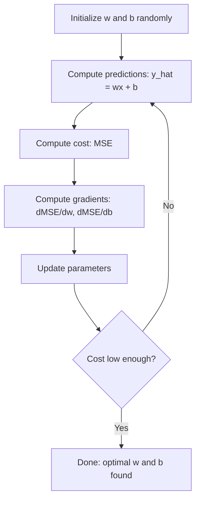

# Hồi quy tuyến tính (Linear Regression)

> Hồi quy tuyến tính vẽ đường thẳng phù hợp nhất qua dữ liệu của bạn. Đây chính là bài toán "hello world" của học máy.

**Type:** Build
**Languages:** Python
**Prerequisites:** Giai đoạn 1 (Đại số tuyến tính, Giải tích, Tối ưu hóa), Giai đoạn 2 Bài 1
**Time:** ~90 phút

## Mục tiêu học tập

- Xây dựng các quy tắc cập nhật gradient descent cho hàm sai số bình phương trung bình (MSE) và triển khai hồi quy tuyến tính từ đầu (from scratch)
- So sánh gradient descent và phương trình chuẩn (normal equation) về độ phức tạp tính toán và thời điểm sử dụng từng phương pháp
- Xây dựng mô hình hồi quy tuyến tính đa biến với chuẩn hóa đặc trưng (feature standardization) và giải thích các trọng số đã học
- Giải thích cách Ridge regression (điều chuẩn L2) ngăn chặn quá khớp (overfitting) bằng cách phạt các trọng số lớn

## Bài toán

Bạn có dữ liệu: diện tích nhà và giá bán tương ứng. Bạn muốn dự đoán giá của một ngôi nhà mới dựa trên diện tích của nó. Bạn có thể ước lượng bằng mắt trên biểu đồ phân tán, nhưng bạn cần một công thức. Bạn cần một đường thẳng khớp nhất với dữ liệu để có thể nhập bất kỳ diện tích nào và nhận được dự đoán giá.

Hồi quy tuyến tính cung cấp cho bạn đường thẳng đó. Quan trọng hơn, nó giới thiệu toàn bộ vòng lặp huấn luyện ML: định nghĩa mô hình, định nghĩa hàm chi phí, tối ưu hóa các tham số. Mọi thuật toán ML đều tuân theo mô hình này. Hãy nắm vững nó ở đây với trường hợp đơn giản nhất, và bạn sẽ nhận ra nó ở khắp mọi nơi.

Đây không chỉ dành cho các bài toán đơn giản. Hồi quy tuyến tính được sử dụng trong các hệ thống thực tế để dự báo nhu cầu, phân tích thử nghiệm A/B, mô hình hóa tài chính và làm cơ sở (baseline) cho mọi tác vụ hồi quy.

## Khái niệm

### Mô hình

Hồi quy tuyến tính giả định mối quan hệ tuyến tính giữa đầu vào (x) và đầu ra (y):

```
y = wx + b
```

- `w` (trọng số/độ dốc): mức độ thay đổi của y khi x tăng thêm 1 đơn vị
- `b` (bias/hệ số chặn): giá trị của y khi x = 0

Đối với nhiều đầu vào (đặc trưng), công thức mở rộng thành:

```
y = w1*x1 + w2*x2 + ... + wn*xn + b
```

Hoặc ở dạng vector: `y = w^T * x + b`

Mục tiêu: tìm các giá trị w và b sao cho y dự đoán gần nhất có thể với y thực tế trên tất cả các ví dụ huấn luyện.

### Hàm chi phí (Sai số bình phương trung bình - MSE)

Làm thế nào để đo lường "gần nhất có thể"? Bạn cần một con số duy nhất thể hiện mức độ sai lệch của các dự đoán. Lựa chọn phổ biến nhất là Sai số bình phương trung bình (MSE):

```
MSE = (1/n) * sum((y_predicted - y_actual)^2)
```

Tại sao lại bình phương? Có hai lý do. Thứ nhất, nó phạt các lỗi lớn nặng hơn lỗi nhỏ (lỗi 10 tệ hơn lỗi 1 gấp 100 lần, không phải 10 lần). Thứ hai, hàm bình phương trơn và có đạo hàm ở mọi nơi, giúp việc tối ưu hóa trở nên đơn giản.

Hàm chi phí tạo ra một bề mặt. Đối với một trọng số w và bias b, bề mặt MSE trông giống như một cái bát (paraboloid lồi). Đáy bát là nơi MSE đạt giá trị tối thiểu. Huấn luyện chính là quá trình tìm ra đáy đó.

### Gradient Descent

Gradient descent tìm đáy bát bằng cách thực hiện các bước xuống dốc.



Các gradient cho bạn biết hai điều: hướng di chuyển của mỗi tham số và khoảng cách cần di chuyển.

Đối với MSE với y_hat = wx + b:

```
dMSE/dw = (2/n) * sum((y_hat - y) * x)
dMSE/db = (2/n) * sum(y_hat - y)
```

Quy tắc cập nhật:

```
w = w - learning_rate * dMSE/dw
b = b - learning_rate * dMSE/db
```

Tốc độ học (learning rate) kiểm soát kích thước bước. Nếu quá lớn: bạn sẽ vượt quá điểm tối thiểu và phân kỳ. Nếu quá nhỏ: quá trình huấn luyện sẽ mất rất nhiều thời gian. Các giá trị khởi đầu điển hình: 0.01, 0.001, hoặc 0.0001.

### Phương trình chuẩn (Giải pháp dạng đóng)

Đối với hồi quy tuyến tính, có một công thức trực tiếp cho ra các trọng số tối ưu mà không cần lặp:

```
w = (X^T * X)^(-1) * X^T * y
```

Công thức này nghịch đảo ma trận để giải w trong một bước. Nó hoạt động hoàn hảo cho các tập dữ liệu nhỏ. Đối với tập dữ liệu lớn (hàng triệu hàng hoặc hàng nghìn đặc trưng), gradient descent được ưu tiên hơn vì nghịch đảo ma trận có độ phức tạp O(n^3) theo số lượng đặc trưng.

### Hồi quy tuyến tính đa biến

Với nhiều đặc trưng, mô hình trở thành:

```
y = w1*x1 + w2*x2 + ... + wn*xn + b
```

Mọi thứ hoạt động tương tự: MSE là hàm chi phí, gradient descent cập nhật tất cả các trọng số đồng thời. Sự khác biệt duy nhất là bạn đang khớp một siêu phẳng (hyperplane) thay vì một đường thẳng.

Việc chuẩn hóa đặc trưng (feature scaling) rất quan trọng ở đây. Nếu một đặc trưng nằm trong khoảng 0 đến 1 và đặc trưng khác nằm trong khoảng 0 đến 1.000.000, gradient descent sẽ gặp khó khăn vì bề mặt chi phí trở nên kéo dài. Hãy chuẩn hóa các đặc trưng (trừ đi giá trị trung bình, chia cho độ lệch chuẩn) trước khi huấn luyện.

### Hồi quy đa thức (Polynomial Regression)

Nếu mối quan hệ không tuyến tính thì sao? Bạn vẫn có thể sử dụng hồi quy tuyến tính bằng cách tạo ra các đặc trưng đa thức:

```
y = w1*x + w2*x^2 + w3*x^3 + b
```

Đây vẫn là hồi quy "tuyến tính" vì mô hình tuyến tính đối với các trọng số (w1, w2, w3). Bạn chỉ đang sử dụng các đặc trưng phi tuyến tính của x.

Các đa thức bậc cao có thể khớp với các đường cong phức tạp hơn nhưng có nguy cơ quá khớp (overfitting). Một đa thức bậc 10 sẽ đi qua mọi điểm trong tập dữ liệu 10 điểm nhưng dự đoán kém trên dữ liệu mới.

### Điểm R-Squared

MSE cho bạn biết mức độ sai lệch, nhưng con số này phụ thuộc vào thang đo của y. R-squared (R^2) cung cấp một thước đo độc lập với thang đo:

```
R^2 = 1 - (sum of squared residuals) / (sum of squared deviations from mean)
    = 1 - SS_res / SS_tot
```

- R^2 = 1.0: dự đoán hoàn hảo
- R^2 = 0.0: mô hình không tốt hơn việc dự đoán giá trị trung bình
- R^2 < 0.0: mô hình tệ hơn việc dự đoán giá trị trung bình

### Giới thiệu về điều chuẩn (Ridge Regression)

Khi bạn có nhiều đặc trưng, mô hình có thể quá khớp bằng cách gán các trọng số lớn. Ridge regression (điều chuẩn L2) thêm một hình phạt:

```
Cost = MSE + lambda * sum(w_i^2)
```

Số hạng phạt ngăn cản các trọng số lớn. Siêu tham số lambda kiểm soát sự đánh đổi: lambda càng lớn thì trọng số càng nhỏ và mức độ điều chuẩn càng cao. Điều này sẽ được đề cập chi tiết trong bài học sau. Hiện tại, hãy biết rằng nó tồn tại và lý do tại sao nó hữu ích.

```figure
linear-regression-fit
```

## Xây dựng

### Bước 1: Tạo dữ liệu mẫu

```python
import random
import math

random.seed(42)

TRUE_W = 3.0
TRUE_B = 7.0
N_SAMPLES = 100

X = [random.uniform(0, 10) for _ in range(N_SAMPLES)]
y = [TRUE_W * x + TRUE_B + random.gauss(0, 2.0) for x in X]

print(f"Generated {N_SAMPLES} samples")
print(f"True relationship: y = {TRUE_W}x + {TRUE_B} (+ noise)")
print(f"First 5 points: {[(round(X[i], 2), round(y[i], 2)) for i in range(5)]}")
```

### Bước 2: Hồi quy tuyến tính từ đầu với gradient descent

```python
class LinearRegression:
    def __init__(self, learning_rate=0.01):
        self.w = 0.0
        self.b = 0.0
        self.lr = learning_rate
        self.cost_history = []

    def predict(self, X):
        return [self.w * x + self.b for x in X]

    def compute_cost(self, X, y):
        predictions = self.predict(X)
        n = len(y)
        cost = sum((pred - actual) ** 2 for pred, actual in zip(predictions, y)) / n
        return cost

    def compute_gradients(self, X, y):
        predictions = self.predict(X)
        n = len(y)
        dw = (2 / n) * sum((pred - actual) * x for pred, actual, x in zip(predictions, y, X))
        db = (2 / n) * sum(pred - actual for pred, actual in zip(predictions, y))
        return dw, db

    def fit(self, X, y, epochs=1000, print_every=200):
        for epoch in range(epochs):
            dw, db = self.compute_gradients(X, y)
            self.w -= self.lr * dw
            self.b -= self.lr * db
            cost = self.compute_cost(X, y)
            self.cost_history.append(cost)
            if epoch % print_every == 0:
                print(f"  Epoch {epoch:4d} | Cost: {cost:.4f} | w: {self.w:.4f} | b: {self.b:.4f}")
        return self

    def r_squared(self, X, y):
        predictions = self.predict(X)
        y_mean = sum(y) / len(y)
        ss_res = sum((actual - pred) ** 2 for actual, pred in zip(y, predictions))
        ss_tot = sum((actual - y_mean) ** 2 for actual in y)
        return 1 - (ss_res / ss_tot)


print("=== Training Linear Regression (Gradient Descent) ===")
model = LinearRegression(learning_rate=0.005)
model.fit(X, y, epochs=1000, print_every=200)
print(f"\nLearned: y = {model.w:.4f}x + {model.b:.4f}")
print(f"True:    y = {TRUE_W}x + {TRUE_B}")
print(f"R-squared: {model.r_squared(X, y):.4f}")
```

### Bước 3: Phương trình chuẩn (giải pháp dạng đóng)

```python
class LinearRegressionNormal:
    def __init__(self):
        self.w = 0.0
        self.b = 0.0

    def fit(self, X, y):
        n = len(X)
        x_mean = sum(X) / n
        y_mean = sum(y) / n
        numerator = sum((X[i] - x_mean) * (y[i] - y_mean) for i in range(n))
        denominator = sum((X[i] - x_mean) ** 2 for i in range(n))
        self.w = numerator / denominator
        self.b = y_mean - self.w * x_mean
        return self

    def predict(self, X):
        return [self.w * x + self.b for x in X]

    def r_squared(self, X, y):
        predictions = self.predict(X)
        y_mean = sum(y) / len(y)
        ss_res = sum((actual - pred) ** 2 for actual, pred in zip(y, predictions))
        ss_tot = sum((actual - y_mean) ** 2 for actual in y)
        return 1 - (ss_res / ss_tot)


print("\n=== Normal Equation (Closed-Form) ===")
model_normal = LinearRegressionNormal()
model_normal.fit(X, y)
print(f"Learned: y = {model_normal.w:.4f}x + {model_normal.b:.4f}")
print(f"R-squared: {model_normal.r_squared(X, y):.4f}")
```

### Bước 4: Hồi quy tuyến tính đa biến

```python
class MultipleLinearRegression:
    def __init__(self, n_features, learning_rate=0.01):
        self.weights = [0.0] * n_features
        self.bias = 0.0
        self.lr = learning_rate
        self.cost_history = []

    def predict_single(self, x):
        return sum(w * xi for w, xi in zip(self.weights, x)) + self.bias

    def predict(self, X):
        return [self.predict_single(x) for x in X]

    def compute_cost(self, X, y):
        predictions = self.predict(X)
        n = len(y)
        return sum((pred - actual) ** 2 for pred, actual in zip(predictions, y)) / n

    def fit(self, X, y, epochs=1000, print_every=200):
        n = len(y)
        n_features = len(X[0])
        for epoch in range(epochs):
            predictions = self.predict(X)
            errors = [pred - actual for pred, actual in zip(predictions, y)]
            for j in range(n_features):
                grad = (2 / n) * sum(errors[i] * X[i][j] for i in range(n))
                self.weights[j] -= self.lr * grad
            grad_b = (2 / n) * sum(errors)
            self.bias -= self.lr * grad_b
            cost = self.compute_cost(X, y)
            self.cost_history.append(cost)
            if epoch % print_every == 0:
                print(f"  Epoch {epoch:4d} | Cost: {cost:.4f}")
        return self

    def r_squared(self, X, y):
        predictions = self.predict(X)
        y_mean = sum(y) / len(y)
        ss_res = sum((actual - pred) ** 2 for actual, pred in zip(y, predictions))
        ss_tot = sum((actual - y_mean) ** 2 for actual in y)
        return 1 - (ss_res / ss_tot)


random.seed(42)
N = 100
X_multi = []
y_multi = []
for _ in range(N):
    size = random.uniform(500, 3000)
    bedrooms = random.randint(1, 5)
    age = random.uniform(0, 50)
    price = 50 * size + 10000 * bedrooms - 1000 * age + 50000 + random.gauss(0, 20000)
    X_multi.append([size, bedrooms, age])
    y_multi.append(price)


def standardize(X):
    n_features = len(X[0])
    means = [sum(X[i][j] for i in range(len(X))) / len(X) for j in range(n_features)]
    stds = []
    for j in range(n_features):
        variance = sum((X[i][j] - means[j]) ** 2 for i in range(len(X))) / len(X)
        stds.append(variance ** 0.5)
    X_scaled = []
    for i in range(len(X)):
        row = [(X[i][j] - means[j]) / stds[j] if stds[j] > 0 else 0 for j in range(n_features)]
        X_scaled.append(row)
    return X_scaled, means, stds


y_mean_val = sum(y_multi) / len(y_multi)
y_std_val = (sum((yi - y_mean_val) ** 2 for yi in y_multi) / len(y_multi)) ** 0.5
y_scaled = [(yi - y_mean_val) / y_std_val for yi in y_multi]

X_scaled, x_means, x_stds = standardize(X_multi)

print("\n=== Multiple Linear Regression (3 features) ===")
print("Features: house size, bedrooms, age")
multi_model = MultipleLinearRegression(n_features=3, learning_rate=0.01)
multi_model.fit(X_scaled, y_scaled, epochs=1000, print_every=200)

print(f"\nWeights (standardized): {[round(w, 4) for w in multi_model.weights]}")
print(f"Bias (standardized): {multi_model.bias:.4f}")
print(f"R-squared: {multi_model.r_squared(X_scaled, y_scaled):.4f}")
```

### Bước 5: Hồi quy đa thức

```python
class PolynomialRegression:
    def __init__(self, degree, learning_rate=0.01):
        self.degree = degree
        self.weights = [0.0] * degree
        self.bias = 0.0
        self.lr = learning_rate

    def make_features(self, X):
        return [[x ** (d + 1) for d in range(self.degree)] for x in X]

    def predict(self, X):
        features = self.make_features(X)
        return [sum(w * f for w, f in zip(self.weights, row)) + self.bias for row in features]

    def fit(self, X, y, epochs=1000, print_every=200):
        features = self.make_features(X)
        n = len(y)
        for epoch in range(epochs):
            predictions = [sum(w * f for w, f in zip(self.weights, row)) + self.bias for row in features]
            errors = [pred - actual for pred, actual in zip(predictions, y)]
            for j in range(self.degree):
                grad = (2 / n) * sum(errors[i] * features[i][j] for i in range(n))
                self.weights[j] -= self.lr * grad
            grad_b = (2 / n) * sum(errors)
            self.bias -= self.lr * grad_b
            if epoch % print_every == 0:
                cost = sum(e ** 2 for e in errors) / n
                print(f"  Epoch {epoch:4d} | Cost: {cost:.6f}")
        return self

    def r_squared(self, X, y):
        predictions = self.predict(X)
        y_mean = sum(y) / len(y)
        ss_res = sum((actual - pred) ** 2 for actual, pred in zip(y, predictions))
        ss_tot = sum((actual - y_mean) ** 2 for actual in y)
        return 1 - (ss_res / ss_tot)


random.seed(42)
X_poly = [x / 10.0 for x in range(0, 50)]
y_poly = [0.5 * x ** 2 - 2 * x + 3 + random.gauss(0, 1.0) for x in X_poly]

x_max = max(abs(x) for x in X_poly)
X_poly_norm = [x / x_max for x in X_poly]
y_poly_mean = sum(y_poly) / len(y_poly)
y_poly_std = (sum((yi - y_poly_mean) ** 2 for yi in y_poly) / len(y_poly)) ** 0.5
y_poly_norm = [(yi - y_poly_mean) / y_poly_std for yi in y_poly]

print("\n=== Polynomial Regression (degree 2 vs degree 5) ===")
print("True relationship: y = 0.5x^2 - 2x + 3")

print("\nDegree 2:")
poly2 = PolynomialRegression(degree=2, learning_rate=0.1)
poly2.fit(X_poly_norm, y_poly_norm, epochs=2000, print_every=500)
print(f"  R-squared: {poly2.r_squared(X_poly_norm, y_poly_norm):.4f}")

print("\nDegree 5:")
poly5 = PolynomialRegression(degree=5, learning_rate=0.1)
poly5.fit(X_poly_norm, y_poly_norm, epochs=2000, print_every=500)
print(f"  R-squared: {poly5.r_squared(X_poly_norm, y_poly_norm):.4f}")

print("\nDegree 2 fits the true curve well. Degree 5 fits training data slightly better")
print("but risks overfitting on new data.")
```

### Bước 6: Ridge regression (điều chuẩn L2)

```python
class RidgeRegression:
    def __init__(self, n_features, learning_rate=0.01, alpha=1.0):
        self.weights = [0.0] * n_features
        self.bias = 0.0
        self.lr = learning_rate
        self.alpha = alpha

    def predict_single(self, x):
        return sum(w * xi for w, xi in zip(self.weights, x)) + self.bias

    def predict(self, X):
        return [self.predict_single(x) for x in X]

    def fit(self, X, y, epochs=1000, print_every=200):
        n = len(y)
        n_features = len(X[0])
        for epoch in range(epochs):
            predictions = self.predict(X)
            errors = [pred - actual for pred, actual in zip(predictions, y)]
            mse = sum(e ** 2 for e in errors) / n
            reg_term = self.alpha * sum(w ** 2 for w in self.weights)
            cost = mse + reg_term
            for j in range(n_features):
                grad = (2 / n) * sum(errors[i] * X[i][j] for i in range(n))
                grad += 2 * self.alpha * self.weights[j]
                self.weights[j] -= self.lr * grad
            grad_b = (2 / n) * sum(errors)
            self.bias -= self.lr * grad_b
            if epoch % print_every == 0:
                print(f"  Epoch {epoch:4d} | Cost: {cost:.4f} | L2 penalty: {reg_term:.4f}")
        return self


print("\n=== Ridge Regression (L2 Regularization) ===")
print("Same data as multiple regression, with alpha=0.1")
ridge = RidgeRegression(n_features=3, learning_rate=0.01, alpha=0.1)
ridge.fit(X_scaled, y_scaled, epochs=1000, print_every=200)
print(f"\nRidge weights: {[round(w, 4) for w in ridge.weights]}")
print(f"Plain weights: {[round(w, 4) for w in multi_model.weights]}")
print("Ridge weights are smaller (shrunk toward zero) due to the L2 penalty.")
```

## Sử dụng

Bây giờ hãy thực hiện tương tự với scikit-learn, công cụ bạn sẽ thực sự sử dụng trong môi trường sản xuất.

```python
from sklearn.linear_model import LinearRegression as SklearnLR
from sklearn.linear_model import Ridge
from sklearn.preprocessing import PolynomialFeatures, StandardScaler
from sklearn.model_selection import train_test_split
from sklearn.metrics import mean_squared_error, r2_score
import numpy as np

np.random.seed(42)
X_sk = np.random.uniform(0, 10, (100, 1))
y_sk = 3.0 * X_sk.squeeze() + 7.0 + np.random.normal(0, 2.0, 100)

X_train, X_test, y_train, y_test = train_test_split(X_sk, y_sk, test_size=0.2, random_state=42)

lr = SklearnLR()
lr.fit(X_train, y_train)
y_pred = lr.predict(X_test)

print("=== Scikit-learn Linear Regression ===")
print(f"Coefficient (w): {lr.coef_[0]:.4f}")
print(f"Intercept (b): {lr.intercept_:.4f}")
print(f"R-squared (test): {r2_score(y_test, y_pred):.4f}")
print(f"MSE (test): {mean_squared_error(y_test, y_pred):.4f}")

poly = PolynomialFeatures(degree=2, include_bias=False)
X_poly_sk = poly.fit_transform(X_train)
X_poly_test = poly.transform(X_test)

lr_poly = SklearnLR()
lr_poly.fit(X_poly_sk, y_train)
print(f"\nPolynomial degree 2 R-squared: {r2_score(y_test, lr_poly.predict(X_poly_test)):.4f}")

scaler = StandardScaler()
X_train_scaled = scaler.fit_transform(X_train)
X_test_scaled = scaler.transform(X_test)

ridge = Ridge(alpha=1.0)
ridge.fit(X_train_scaled, y_train)
print(f"Ridge R-squared: {r2_score(y_test, ridge.predict(X_test_scaled)):.4f}")
print(f"Ridge coefficient: {ridge.coef_[0]:.4f}")
```

Triển khai từ đầu của bạn và scikit-learn cho ra kết quả giống nhau. Sự khác biệt: scikit-learn xử lý các trường hợp biên, độ ổn định số học và tối ưu hóa hiệu suất. Hãy sử dụng thư viện cho môi trường sản xuất. Sử dụng phiên bản từ đầu để hiểu rõ bản chất vấn đề.

## Triển khai

Bài học này mang lại:
- `outputs/skill-regression.md` - kỹ năng lựa chọn phương pháp hồi quy phù hợp dựa trên bài toán

## Bài tập

1. Triển khai batch gradient descent, stochastic gradient descent (SGD) và mini-batch gradient descent. So sánh tốc độ hội tụ trên cùng một tập dữ liệu. Phương pháp nào hội tụ nhanh nhất? Phương pháp nào có đường cong chi phí mượt mà nhất?
2. Tạo dữ liệu từ một hàm bậc ba (y = ax^3 + bx^2 + cx + d + nhiễu). Khớp các đa thức bậc 1, 3 và 10. So sánh R^2 trên tập huấn luyện và tập kiểm tra. Ở bậc nào thì hiện tượng quá khớp trở nên rõ ràng?
3. Triển khai Lasso regression (điều chuẩn L1: penalty = alpha * sum(|w_i|)). Huấn luyện trên dữ liệu nhà ở đa đặc trưng. So sánh trọng số nào tiến về 0 so với Ridge. Tại sao L1 tạo ra các giải pháp thưa (sparse) trong khi L2 thì không?

## Thuật ngữ chính

| Thuật ngữ | Cách gọi thông thường | Ý nghĩa thực tế |
|------|----------------|----------------------|
| Hồi quy tuyến tính | "Vẽ đường thẳng qua dữ liệu" | Tìm trọng số w và bias b để tối thiểu hóa tổng bình phương sai lệch giữa wx+b và giá trị y thực tế |
| Hàm chi phí | "Mô hình tệ đến mức nào" | Hàm ánh xạ các tham số mô hình thành một con số duy nhất đo lường sai số dự đoán, được tối ưu hóa để đạt giá trị nhỏ nhất |
| Sai số bình phương trung bình | "Trung bình của các sai số bình phương" | (1/n) * tổng của (dự đoán - thực tế)^2, phạt các lỗi lớn một cách không cân xứng |
| Gradient descent | "Đi xuống dốc" | Điều chỉnh lặp đi lặp lại các tham số theo hướng làm giảm hàm chi phí, sử dụng đạo hàm riêng |
| Tốc độ học | "Kích thước bước" | Một đại lượng vô hướng kiểm soát mức độ thay đổi của các tham số sau mỗi bước gradient descent |
| Phương trình chuẩn | "Giải trực tiếp" | Giải pháp dạng đóng w = (X^T X)^-1 X^T y cho ra trọng số tối ưu mà không cần lặp |
| R-squared | "Độ khớp tốt đến mức nào" | Tỷ lệ phương sai trong y được giải thích bởi mô hình, dao động từ âm vô cùng đến 1.0 |
| Chuẩn hóa đặc trưng | "Làm cho các đặc trưng có thể so sánh" | Chuyển đổi các đặc trưng về các thang đo tương tự (ví dụ: trung bình bằng 0, phương sai đơn vị) để gradient descent hội tụ nhanh hơn |
| Điều chuẩn | "Phạt sự phức tạp" | Thêm một số hạng vào hàm chi phí để thu nhỏ các trọng số, ngăn chặn quá khớp |
| Ridge regression | "Điều chuẩn L2" | Hồi quy tuyến tính với hình phạt lambda * sum(w_i^2) thêm vào MSE |
| Hồi quy đa thức | "Khớp đường cong bằng toán tuyến tính" | Hồi quy tuyến tính trên các đặc trưng đa thức (x, x^2, x^3, ...), vẫn là tuyến tính đối với các trọng số |
| Quá khớp | "Học vẹt dữ liệu huấn luyện" | Sử dụng mô hình quá phức tạp khiến nó khớp cả nhiễu trong dữ liệu huấn luyện và thất bại trên dữ liệu mới |

## Đọc thêm

- [An Introduction to Statistical Learning (ISLR)](https://www.statlearning.com/) -- PDF miễn phí, chương 3 và 6 bao gồm hồi quy tuyến tính và điều chuẩn với các ví dụ thực tế bằng R
- [The Elements of Statistical Learning (ESL)](https://hastie.su.domains/ElemStatLearn/) -- PDF miễn phí, tài liệu bổ trợ toán học chuyên sâu hơn cho ISLR với cách tiếp cận sâu hơn về ridge và lasso
- [Stanford CS229 Lecture Notes on Linear Regression](https://cs229.stanford.edu/main_notes.pdf) -- Ghi chú bài giảng của Andrew Ng về việc suy luận phương trình chuẩn và gradient descent từ các nguyên lý cơ bản
- [scikit-learn LinearRegression documentation](https://scikit-learn.org/stable/modules/linear_model.html) -- Tài liệu tham khảo thực tế cho LinearRegression, Ridge, Lasso và ElasticNet với các ví dụ mã nguồn