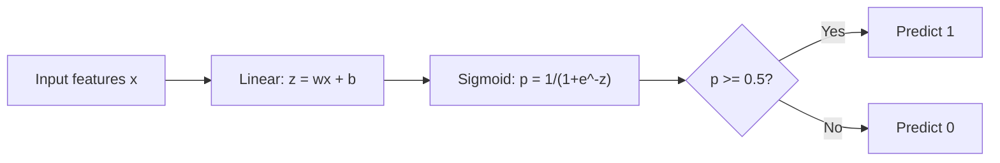
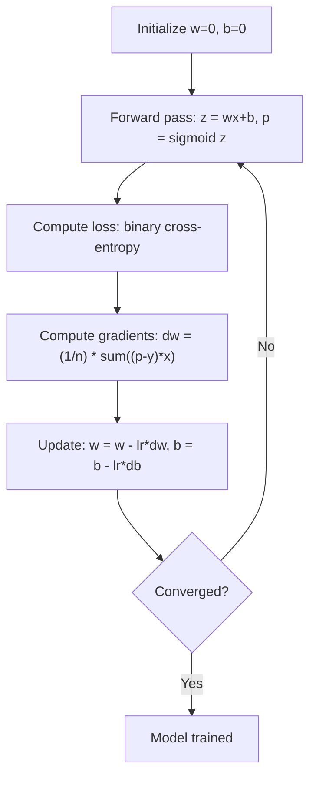

# Logistic Regression

> Logistic regression bẻ cong một đường thẳng thành đường cong hình chữ S để trả lời các câu hỏi có/không bằng xác suất.

**Type:** Build
**Languages:** Python
**Prerequisites:** Phase 2 Lesson 1-2 (What Is ML, Linear Regression)
**Time:** ~90 minutes

## Learning Objectives

- Triển khai logistic regression từ đầu (from scratch) sử dụng hàm sigmoid và binary cross-entropy loss
- Tính toán và diễn giải precision, recall, F1 score và confusion matrix cho bài toán phân loại nhị phân
- Giải thích tại sao MSE thất bại trong phân loại và tại sao binary cross-entropy tạo ra bề mặt chi phí (cost surface) lồi
- Xây dựng mô hình softmax regression cho phân loại đa lớp và đánh giá các đánh đổi khi điều chỉnh ngưỡng (threshold tuning)

## The Problem

Bạn muốn dự đoán một khối u là ác tính hay lành tính dựa trên kích thước của nó. Bạn thử dùng linear regression. Nó xuất ra các con số như 0.3, 1.7 hoặc -0.5. Những con số đó có nghĩa là gì? 1.7 có phải là "rất ác tính"? -0.5 có phải là "rất lành tính"? Linear regression xuất ra các con số không bị chặn. Phân loại cần các xác suất bị chặn trong khoảng từ 0 đến 1, và một quyết định rõ ràng: có hoặc không.

Logistic regression giải quyết vấn đề này. Nó lấy cùng một tổ hợp tuyến tính (wx + b) và truyền qua hàm sigmoid, hàm này nén bất kỳ con số nào vào khoảng (0, 1). Đầu ra là một xác suất. Bạn đặt một ngưỡng (thường là 0.5) và đưa ra quyết định.

Đây là một trong những thuật toán được sử dụng rộng rãi nhất trong thực tế. Mặc dù có tên là logistic regression, nó là một thuật toán phân loại, không phải thuật toán hồi quy. Tên gọi này xuất phát từ hàm logistic (sigmoid) mà nó sử dụng.

## The Concept

### Why Linear Regression Fails for Classification

Hãy tưởng tượng việc dự đoán đỗ/trượt (1/0) dựa trên số giờ học. Linear regression khớp một đường thẳng qua dữ liệu:

```
hours:  1   2   3   4   5   6   7   8   9   10
actual: 0   0   0   0   1   1   1   1   1   1
```

Một đường khớp tuyến tính có thể tạo ra các dự đoán như -0.2 ở giờ thứ 1 và 1.3 ở giờ thứ 10. Những giá trị này không phải là xác suất. Chúng nhỏ hơn 0 và lớn hơn 1. Tệ hơn nữa, một điểm ngoại lai (outlier) duy nhất (ai đó học 50 giờ) sẽ kéo toàn bộ đường thẳng, làm thay đổi dự đoán của tất cả mọi người.

Phân loại cần một hàm:
- Xuất ra các giá trị từ 0 đến 1 (xác suất)
- Tạo ra một sự chuyển đổi sắc nét (đường biên quyết định - decision boundary)
- Không bị biến dạng bởi các điểm ngoại lai nằm xa đường biên

### The Sigmoid Function

Hàm sigmoid thực hiện chính xác điều này:

```
sigmoid(z) = 1 / (1 + e^(-z))
```

Các tính chất:
- Khi z lớn và dương, sigmoid(z) tiến dần đến 1
- Khi z lớn và âm, sigmoid(z) tiến dần đến 0
- Khi z = 0, sigmoid(z) = 0.5
- Đầu ra luôn nằm trong khoảng từ 0 đến 1
- Hàm này trơn và có đạo hàm tại mọi điểm

Đạo hàm có một dạng thuận tiện: sigmoid'(z) = sigmoid(z) * (1 - sigmoid(z)). Điều này giúp việc tính toán gradient trở nên hiệu quả.

### Logistic Regression = Linear Model + Sigmoid

Mô hình tính toán z = wx + b (giống như linear regression), sau đó áp dụng sigmoid:



Đầu ra p được hiểu là P(y=1 | x), xác suất mà đầu vào thuộc về lớp 1. Đường biên quyết định là nơi wx + b = 0, làm cho đầu ra của sigmoid chính xác bằng 0.5.

### Binary Cross-Entropy Loss

Bạn không thể sử dụng MSE cho logistic regression. MSE với sigmoid tạo ra một bề mặt chi phí không lồi với nhiều cực tiểu địa phương. Thay vào đó, hãy sử dụng binary cross-entropy (log loss):

```
Loss = -(1/n) * sum(y * log(p) + (1-y) * log(1-p))
```

Tại sao nó hiệu quả:
- Khi y=1 và p gần bằng 1: log(1) = 0, nên loss gần bằng 0 (đúng, chi phí thấp)
- Khi y=1 và p gần bằng 0: log(0) tiến tới âm vô cùng, nên loss rất lớn (sai, chi phí cao)
- Khi y=0 và p gần bằng 0: log(1) = 0, nên loss gần bằng 0 (đúng, chi phí thấp)
- Khi y=0 và p gần bằng 1: log(0) tiến tới âm vô cùng, nên loss rất lớn (sai, chi phí cao)

Hàm loss này là hàm lồi đối với logistic regression, đảm bảo chỉ có một cực tiểu toàn cục duy nhất.

### Gradient Descent for Logistic Regression

Các gradient cho binary cross-entropy với sigmoid có dạng rất gọn:

```
dL/dw = (1/n) * sum((p - y) * x)
dL/db = (1/n) * sum(p - y)
```

Chúng trông giống hệt các gradient của linear regression. Sự khác biệt là p = sigmoid(wx + b) thay vì p = wx + b. Sigmoid giới thiệu tính phi tuyến tính, nhưng quy tắc cập nhật gradient vẫn giữ nguyên.



### The Decision Boundary

Đối với đầu vào 2D (hai đặc trưng), đường biên quyết định là đường thẳng nơi:

```
w1*x1 + w2*x2 + b = 0
```

Các điểm ở một bên được phân loại là 1, các điểm ở bên kia là 0. Logistic regression luôn tạo ra một đường biên quyết định tuyến tính. Nếu bạn cần một đường biên cong, bạn phải thêm các đặc trưng đa thức (polynomial features) hoặc sử dụng một mô hình phi tuyến tính.

### Multi-Class Classification with Softmax

Binary logistic regression xử lý hai lớp. Đối với k lớp, hãy sử dụng hàm softmax:

```
softmax(z_i) = e^(z_i) / sum(e^(z_j) for all j)
```

Mỗi lớp có một vector trọng số riêng. Mô hình tính toán một điểm số z_i cho mỗi lớp, sau đó softmax chuyển đổi các điểm số thành xác suất có tổng bằng 1. Lớp được dự đoán là lớp có xác suất cao nhất.

Hàm loss trở thành categorical cross-entropy:

```
Loss = -(1/n) * sum(sum(y_k * log(p_k)))
```

trong đó y_k bằng 1 cho lớp đúng và 0 cho tất cả các lớp khác (one-hot encoding).

### Evaluation Metrics

Chỉ độ chính xác (accuracy) là không đủ. Đối với một tập dữ liệu có 95% tiêu cực và 5% tích cực, một mô hình luôn dự đoán tiêu cực sẽ đạt độ chính xác 95% nhưng hoàn toàn vô dụng.

**Confusion Matrix**:

| | Dự đoán Tích cực | Dự đoán Tiêu cực |
|---|---|---|
| Thực tế Tích cực | True Positive (TP) | False Negative (FN) |
| Thực tế Tiêu cực | False Positive (FP) | True Negative (TN) |

**Precision**: Trong tất cả các dự đoán tích cực, bao nhiêu là thực sự tích cực?
```
Precision = TP / (TP + FP)
```

**Recall** (Độ nhạy): Trong tất cả các trường hợp thực tế tích cực, chúng ta đã bắt được bao nhiêu?
```
Recall = TP / (TP + FN)
```

**F1 Score**: Trung bình điều hòa của precision và recall. Cân bằng cả hai chỉ số.
```
F1 = 2 * (Precision * Recall) / (Precision + Recall)
```

Khi nào cần ưu tiên:
- **Precision**: khi false positive gây tốn kém (bộ lọc spam, bạn không muốn chặn email hợp lệ)
- **Recall**: khi false negative gây tốn kém (tầm soát ung thư, bạn không muốn bỏ sót khối u)
- **F1**: khi bạn cần một chỉ số cân bằng duy nhất

```figure
logistic-sigmoid
```

## Build It

### Step 1: Sigmoid function and data generation

```python
import random
import math

def sigmoid(z):
    z = max(-500, min(500, z))
    return 1.0 / (1.0 + math.exp(-z))


random.seed(42)
N = 200
X = []
y = []

for _ in range(N // 2):
    X.append([random.gauss(2, 1), random.gauss(2, 1)])
    y.append(0)

for _ in range(N // 2):
    X.append([random.gauss(5, 1), random.gauss(5, 1)])
    y.append(1)

combined = list(zip(X, y))
random.shuffle(combined)
X, y = zip(*combined)
X = list(X)
y = list(y)

print(f"Generated {N} samples (2 classes, 2 features)")
print(f"Class 0 center: (2, 2), Class 1 center: (5, 5)")
print(f"First 5 samples:")
for i in range(5):
    print(f"  Features: [{X[i][0]:.2f}, {X[i][1]:.2f}], Label: {y[i]}")
```

### Step 2: Logistic regression from scratch

```python
class LogisticRegression:
    def __init__(self, n_features, learning_rate=0.01):
        self.weights = [0.0] * n_features
        self.bias = 0.0
        self.lr = learning_rate
        self.loss_history = []

    def predict_proba(self, x):
        z = sum(w * xi for w, xi in zip(self.weights, x)) + self.bias
        return sigmoid(z)

    def predict(self, x, threshold=0.5):
        return 1 if self.predict_proba(x) >= threshold else 0

    def compute_loss(self, X, y):
        n = len(y)
        total = 0.0
        for i in range(n):
            p = self.predict_proba(X[i])
            p = max(1e-15, min(1 - 1e-15, p))
            total += y[i] * math.log(p) + (1 - y[i]) * math.log(1 - p)
        return -total / n

    def fit(self, X, y, epochs=1000, print_every=200):
        n = len(y)
        n_features = len(X[0])
        for epoch in range(epochs):
            dw = [0.0] * n_features
            db = 0.0
            for i in range(n):
                p = self.predict_proba(X[i])
                error = p - y[i]
                for j in range(n_features):
                    dw[j] += error * X[i][j]
                db += error
            for j in range(n_features):
                self.weights[j] -= self.lr * (dw[j] / n)
            self.bias -= self.lr * (db / n)
            loss = self.compute_loss(X, y)
            self.loss_history.append(loss)
            if epoch % print_every == 0:
                print(f"  Epoch {epoch:4d} | Loss: {loss:.4f} | w: [{self.weights[0]:.3f}, {self.weights[1]:.3f}] | b: {self.bias:.3f}")
        return self

    def accuracy(self, X, y):
        correct = sum(1 for i in range(len(y)) if self.predict(X[i]) == y[i])
        return correct / len(y)


split = int(0.8 * N)
X_train, X_test = X[:split], X[split:]
y_train, y_test = y[:split], y[split:]

print("\n=== Training Logistic Regression ===")
model = LogisticRegression(n_features=2, learning_rate=0.1)
model.fit(X_train, y_train, epochs=1000, print_every=200)

print(f"\nTrain accuracy: {model.accuracy(X_train, y_train):.4f}")
print(f"Test accuracy:  {model.accuracy(X_test, y_test):.4f}")
print(f"Weights: [{model.weights[0]:.4f}, {model.weights[1]:.4f}]")
print(f"Bias: {model.bias:.4f}")
```

### Step 3: Confusion matrix and metrics from scratch

```python
class ClassificationMetrics:
    def __init__(self, y_true, y_pred):
        self.tp = sum(1 for t, p in zip(y_true, y_pred) if t == 1 and p == 1)
        self.tn = sum(1 for t, p in zip(y_true, y_pred) if t == 0 and p == 0)
        self.fp = sum(1 for t, p in zip(y_true, y_pred) if t == 0 and p == 1)
        self.fn = sum(1 for t, p in zip(y_true, y_pred) if t == 1 and p == 0)

    def accuracy(self):
        total = self.tp + self.tn + self.fp + self.fn
        return (self.tp + self.tn) / total if total > 0 else 0

    def precision(self):
        denom = self.tp + self.fp
        return self.tp / denom if denom > 0 else 0

    def recall(self):
        denom = self.tp + self.fn
        return self.tp / denom if denom > 0 else 0

    def f1(self):
        p = self.precision()
        r = self.recall()
        return 2 * p * r / (p + r) if (p + r) > 0 else 0

    def print_confusion_matrix(self):
        print(f"\n  Confusion Matrix:")
        print(f"                  Predicted")
        print(f"                  Pos   Neg")
        print(f"  Actual Pos     {self.tp:4d}  {self.fn:4d}")
        print(f"  Actual Neg     {self.fp:4d}  {self.tn:4d}")

    def print_report(self):
        self.print_confusion_matrix()
        print(f"\n  Accuracy:  {self.accuracy():.4f}")
        print(f"  Precision: {self.precision():.4f}")
        print(f"  Recall:    {self.recall():.4f}")
        print(f"  F1 Score:  {self.f1():.4f}")


y_pred_test = [model.predict(x) for x in X_test]
print("\n=== Classification Report (Test Set) ===")
metrics = ClassificationMetrics(y_test, y_pred_test)
metrics.print_report()
```

### Step 4: Decision boundary analysis

```python
print("\n=== Decision Boundary ===")
w1, w2 = model.weights
b = model.bias
print(f"Decision boundary: {w1:.4f}*x1 + {w2:.4f}*x2 + {b:.4f} = 0")
if abs(w2) > 1e-10:
    print(f"Solved for x2:     x2 = {-w1/w2:.4f}*x1 + {-b/w2:.4f}")

print("\nSample predictions near the boundary:")
test_points = [
    [3.0, 3.0],
    [3.5, 3.5],
    [4.0, 4.0],
    [2.5, 2.5],
    [5.0, 5.0],
]
for point in test_points:
    prob = model.predict_proba(point)
    pred = model.predict(point)
    print(f"  [{point[0]}, {point[1]}] -> prob={prob:.4f}, class={pred}")
```

### Step 5: Multi-class with softmax

```python
class SoftmaxRegression:
    def __init__(self, n_features, n_classes, learning_rate=0.01):
        self.n_features = n_features
        self.n_classes = n_classes
        self.lr = learning_rate
        self.weights = [[0.0] * n_features for _ in range(n_classes)]
        self.biases = [0.0] * n_classes

    def softmax(self, scores):
        max_score = max(scores)
        exp_scores = [math.exp(s - max_score) for s in scores]
        total = sum(exp_scores)
        return [e / total for e in exp_scores]

    def predict_proba(self, x):
        scores = [
            sum(self.weights[k][j] * x[j] for j in range(self.n_features)) + self.biases[k]
            for k in range(self.n_classes)
        ]
        return self.softmax(scores)

    def predict(self, x):
        probs = self.predict_proba(x)
        return probs.index(max(probs))

    def fit(self, X, y, epochs=1000, print_every=200):
        n = len(y)
        for epoch in range(epochs):
            grad_w = [[0.0] * self.n_features for _ in range(self.n_classes)]
            grad_b = [0.0] * self.n_classes
            total_loss = 0.0
            for i in range(n):
                probs = self.predict_proba(X[i])
                for k in range(self.n_classes):
                    target = 1.0 if y[i] == k else 0.0
                    error = probs[k] - target
                    for j in range(self.n_features):
                        grad_w[k][j] += error * X[i][j]
                    grad_b[k] += error
                true_prob = max(probs[y[i]], 1e-15)
                total_loss -= math.log(true_prob)
            for k in range(self.n_classes):
                for j in range(self.n_features):
                    self.weights[k][j] -= self.lr * (grad_w[k][j] / n)
                self.biases[k] -= self.lr * (grad_b[k] / n)
            if epoch % print_every == 0:
                print(f"  Epoch {epoch:4d} | Loss: {total_loss / n:.4f}")
        return self

    def accuracy(self, X, y):
        correct = sum(1 for i in range(len(y)) if self.predict(X[i]) == y[i])
        return correct / len(y)


random.seed(42)
X_3class = []
y_3class = []

centers = [(1, 1), (5, 1), (3, 5)]
for label, (cx, cy) in enumerate(centers):
    for _ in range(50):
        X_3class.append([random.gauss(cx, 0.8), random.gauss(cy, 0.8)])
        y_3class.append(label)

combined = list(zip(X_3class, y_3class))
random.shuffle(combined)
X_3class, y_3class = zip(*combined)
X_3class = list(X_3class)
y_3class = list(y_3class)

split_3 = int(0.8 * len(X_3class))
X_train_3 = X_3class[:split_3]
y_train_3 = y_3class[:split_3]
X_test_3 = X_3class[split_3:]
y_test_3 = y_3class[split_3:]

print("\n=== Multi-class Softmax Regression (3 classes) ===")
softmax_model = SoftmaxRegression(n_features=2, n_classes=3, learning_rate=0.1)
softmax_model.fit(X_train_3, y_train_3, epochs=1000, print_every=200)
print(f"\nTrain accuracy: {softmax_model.accuracy(X_train_3, y_train_3):.4f}")
print(f"Test accuracy:  {softmax_model.accuracy(X_test_3, y_test_3):.4f}")

print("\nSample predictions:")
for i in range(5):
    probs = softmax_model.predict_proba(X_test_3[i])
    pred = softmax_model.predict(X_test_3[i])
    print(f"  True: {y_test_3[i]}, Predicted: {pred}, Probs: [{', '.join(f'{p:.3f}' for p in probs)}]")
```

### Step 6: Threshold tuning

```python
print("\n=== Threshold Tuning ===")
print("Default threshold: 0.5. Adjusting the threshold trades precision for recall.\n")

thresholds = [0.3, 0.4, 0.5, 0.6, 0.7]
print(f"{'Threshold':>10} {'Accuracy':>10} {'Precision':>10} {'Recall':>10} {'F1':>10}")
print("-" * 52)

for t in thresholds:
    y_pred_t = [1 if model.predict_proba(x) >= t else 0 for x in X_test]
    m = ClassificationMetrics(y_test, y_pred_t)
    print(f"{t:>10.1f} {m.accuracy():>10.4f} {m.precision():>10.4f} {m.recall():>10.4f} {m.f1():>10.4f}")
```

## Use It

Bây giờ hãy thực hiện tương tự với scikit-learn.

```python
from sklearn.linear_model import LogisticRegression as SklearnLR
from sklearn.metrics import accuracy_score, precision_score, recall_score, f1_score
from sklearn.metrics import confusion_matrix, classification_report
from sklearn.model_selection import train_test_split
from sklearn.preprocessing import StandardScaler
import numpy as np

np.random.seed(42)
X_0 = np.random.randn(100, 2) + [2, 2]
X_1 = np.random.randn(100, 2) + [5, 5]
X_sk = np.vstack([X_0, X_1])
y_sk = np.array([0] * 100 + [1] * 100)

X_tr, X_te, y_tr, y_te = train_test_split(X_sk, y_sk, test_size=0.2, random_state=42)

scaler = StandardScaler()
X_tr_sc = scaler.fit_transform(X_tr)
X_te_sc = scaler.transform(X_te)

lr = SklearnLR()
lr.fit(X_tr_sc, y_tr)
y_pred = lr.predict(X_te_sc)

print("=== Scikit-learn Logistic Regression ===")
print(f"Accuracy:  {accuracy_score(y_te, y_pred):.4f}")
print(f"Precision: {precision_score(y_te, y_pred):.4f}")
print(f"Recall:    {recall_score(y_te, y_pred):.4f}")
print(f"F1:        {f1_score(y_te, y_pred):.4f}")
print(f"\nConfusion Matrix:\n{confusion_matrix(y_te, y_pred)}")
print(f"\nClassification Report:\n{classification_report(y_te, y_pred)}")
```

Triển khai từ đầu của bạn tạo ra cùng một đường biên quyết định và các chỉ số. Scikit-learn bổ sung các tùy chọn solver (liblinear, lbfgs, saga), chính quy hóa (regularization) tự động, các chiến lược đa lớp (one-vs-rest, multinomial) và các tối ưu hóa ổn định số học.

## Ship It

Bài học này tạo ra:
- `code/logistic_regression.py` - logistic regression từ đầu với các chỉ số đánh giá

## Exercises

1. Tạo một tập dữ liệu KHÔNG thể phân tách tuyến tính (ví dụ: hai vòng tròn đồng tâm). Huấn luyện logistic regression và quan sát sự thất bại của nó. Sau đó thêm các đặc trưng đa thức (x1^2, x2^2, x1*x2) và huấn luyện lại. Chứng minh rằng độ chính xác được cải thiện.
2. Triển khai confusion matrix đa lớp cho mô hình softmax 3 lớp. Tính precision và recall cho từng lớp. Lớp nào khó phân loại nhất?
3. Xây dựng đường cong ROC từ đầu. Với 100 giá trị ngưỡng từ 0 đến 1, tính tỷ lệ true positive và false positive. Tính AUC (diện tích dưới đường cong) sử dụng quy tắc hình thang.

## Key Terms

| Thuật ngữ | Cách gọi thông thường | Ý nghĩa thực tế |
|------|----------------|----------------------|
| Logistic regression | "Hồi quy cho phân loại" | Một mô hình tuyến tính theo sau bởi hàm sigmoid xuất ra xác suất lớp |
| Sigmoid function | "Đường cong chữ S" | Hàm 1/(1+e^(-z)) ánh xạ bất kỳ số thực nào vào khoảng (0, 1) |
| Binary cross-entropy | "Log loss" | Hàm loss -[y*log(p) + (1-y)*log(1-p)] phạt nặng các dự đoán sai mà tự tin |
| Decision boundary | "Đường phân chia" | Bề mặt nơi xác suất đầu ra của mô hình bằng 0.5, phân tách các lớp được dự đoán |
| Softmax | "Sigmoid đa lớp" | Hàm chuyển đổi vector điểm số thành xác suất có tổng bằng 1 |
| Precision | "Độ chính xác của dự đoán" | TP / (TP + FP), tỷ lệ các dự đoán tích cực thực sự là tích cực |
| Recall | "Độ bao phủ" | TP / (TP + FN), tỷ lệ các trường hợp tích cực thực tế được mô hình xác định đúng |
| F1 score | "Độ chính xác cân bằng" | Trung bình điều hòa của precision và recall: 2*P*R / (P+R) |
| Confusion matrix | "Bảng phân tích lỗi" | Bảng hiển thị số lượng TP, TN, FP, FN cho mỗi cặp lớp |
| Threshold | "Ngưỡng cắt" | Giá trị xác suất mà trên đó mô hình dự đoán lớp 1 (mặc định 0.5, có thể điều chỉnh) |
| One-hot encoding | "Cột nhị phân cho danh mục" | Biểu diễn lớp k dưới dạng vector toàn số 0 với số 1 tại vị trí k |
| Categorical cross-entropy | "Log loss đa lớp" | Mở rộng của binary cross-entropy cho k lớp sử dụng nhãn one-hot encoded |