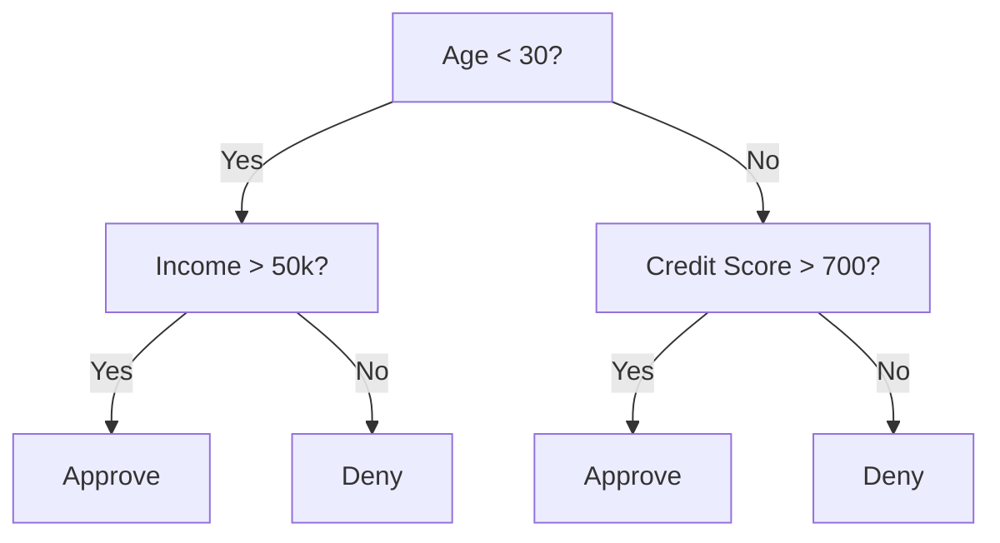
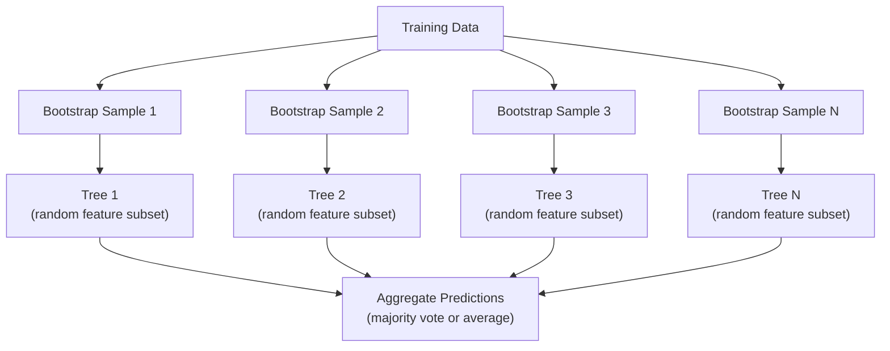

# Decision Trees và Random Forests

> Một decision tree chỉ đơn giản là một lưu đồ (flowchart). Nhưng một "khu rừng" gồm nhiều cây như vậy lại là một trong những công cụ mạnh mẽ nhất trong ML.

**Type:** Build
**Language:** Python
**Prerequisites:** Phase 1 (Lessons 09 Information Theory, 06 Probability)
**Time:** ~90 phút

## Mục tiêu học tập

- Triển khai các phép tính Gini impurity, entropy và information gain để tìm các điểm chia (split) tối ưu cho decision tree
- Xây dựng một decision tree classifier từ đầu với các cơ chế kiểm soát pre-pruning (max depth, min samples)
- Xây dựng một random forest sử dụng bootstrap sampling và feature randomization, đồng thời giải thích lý do tại sao nó giúp giảm phương sai (variance)
- So sánh MDI feature importance với permutation importance và xác định khi nào MDI bị thiên lệch (biased)

## Vấn đề

Bạn có dữ liệu dạng bảng. Các hàng là mẫu, các cột là đặc trưng (feature), và có một cột mục tiêu (target) mà bạn muốn dự đoán. Bạn có thể áp dụng neural network cho nó. Tuy nhiên, đối với dữ liệu dạng bảng, các mô hình dựa trên cây (decision trees, random forests, gradient boosted trees) luôn vượt trội hơn deep learning. Các cuộc thi Kaggle về dữ liệu có cấu trúc thường bị thống trị bởi XGBoost và LightGBM, chứ không phải transformers.

Tại sao? Các cây xử lý được các loại đặc trưng hỗn hợp (số và phân loại) mà không cần tiền xử lý. Chúng xử lý được các mối quan hệ phi tuyến tính mà không cần feature engineering. Chúng có tính diễn giải cao: bạn có thể nhìn vào cây và thấy chính xác lý do tại sao một dự đoán được đưa ra. Và random forests, vốn lấy trung bình từ nhiều cây, có khả năng chống overfitting rất tốt trên các tập dữ liệu có quy mô vừa phải.

Bài học này xây dựng các decision tree từ đầu bằng cách sử dụng đệ quy, sau đó xây dựng random forest dựa trên đó. Bạn sẽ triển khai toán học đằng sau các tiêu chí chia (Gini impurity, entropy, information gain) và hiểu tại sao một tập hợp các mô hình yếu (weak learners) lại trở thành một mô hình mạnh.

## Khái niệm

### Decision tree làm gì

Một decision tree phân vùng không gian đặc trưng thành các vùng hình chữ nhật bằng cách đặt ra một chuỗi các câu hỏi có/không.



Mỗi nút nội bộ (internal node) kiểm tra một đặc trưng dựa trên một ngưỡng (threshold). Mỗi nút lá (leaf node) đưa ra một dự đoán. Để phân loại một điểm dữ liệu mới, bạn bắt đầu từ nút gốc và đi theo các nhánh cho đến khi chạm tới một nút lá.

Cây được xây dựng từ trên xuống dưới bằng cách chọn, tại mỗi nút, đặc trưng và ngưỡng giúp phân tách dữ liệu tốt nhất. "Tốt nhất" được định nghĩa bởi một tiêu chí chia (split criterion).

### Tiêu chí chia: đo lường độ tạp chất (impurity)

Tại mỗi nút, chúng ta có một tập hợp các mẫu. Chúng ta muốn chia chúng sao cho các nút con thu được "tinh khiết" nhất có thể, nghĩa là mỗi nút con chủ yếu chứa một lớp.

**Gini impurity** đo lường xác suất một mẫu được chọn ngẫu nhiên sẽ bị phân loại sai nếu nó được gán nhãn theo phân phối lớp tại nút đó.

```
Gini(S) = 1 - sum(p_k^2)

where p_k is the proportion of class k in set S.
```

Đối với một nút tinh khiết (chỉ có một lớp), Gini = 0. Đối với một phép chia nhị phân với tỷ lệ 50/50, Gini = 0.5. Giá trị càng thấp càng tốt.

```
Example: 6 cats, 4 dogs

Gini = 1 - (0.6^2 + 0.4^2) = 1 - (0.36 + 0.16) = 0.48
```

**Entropy** đo lường nội dung thông tin (sự hỗn loạn) trong một nút. Đã được đề cập trong Phase 1 Lesson 09.

```
Entropy(S) = -sum(p_k * log2(p_k))
```

Đối với một nút tinh khiết, entropy = 0. Đối với phép chia nhị phân 50/50, entropy = 1.0. Giá trị càng thấp càng tốt.

```
Example: 6 cats, 4 dogs

Entropy = -(0.6 * log2(0.6) + 0.4 * log2(0.4))
        = -(0.6 * -0.737 + 0.4 * -1.322)
        = 0.442 + 0.529
        = 0.971 bits
```

**Information gain** là mức giảm độ tạp chất (entropy hoặc Gini) sau khi chia.

```
IG(S, feature, threshold) = Impurity(S) - weighted_avg(Impurity(S_left), Impurity(S_right))

where the weights are the proportions of samples in each child.
```

Thuật toán tham lam (greedy algorithm) tại mỗi nút: thử mọi đặc trưng và mọi ngưỡng có thể. Chọn cặp (đặc trưng, ngưỡng) giúp tối đa hóa information gain.

### Cách thức hoạt động của việc chia

Đối với một tập dữ liệu có n đặc trưng và m mẫu tại nút hiện tại:

1. Với mỗi đặc trưng j (j = 1 đến n):
   - Sắp xếp các mẫu theo đặc trưng j
   - Thử mọi điểm giữa các giá trị phân biệt liên tiếp làm ngưỡng
   - Tính information gain cho mỗi ngưỡng
2. Chọn đặc trưng và ngưỡng có information gain cao nhất
3. Chia dữ liệu thành bên trái (đặc trưng <= ngưỡng) và bên phải (đặc trưng > ngưỡng)
4. Đệ quy trên mỗi nút con

Cách tiếp cận tham lam này không đảm bảo một cây tối ưu toàn cục. Việc tìm cây tối ưu là bài toán NP-hard. Nhưng chia theo kiểu tham lam hoạt động rất tốt trong thực tế.

### Các điều kiện dừng

Nếu không có điều kiện dừng, cây sẽ phát triển cho đến khi mọi nút lá đều tinh khiết (một mẫu mỗi lá). Điều này dẫn đến việc ghi nhớ hoàn hảo dữ liệu huấn luyện và khả năng tổng quát hóa cực kỳ kém.

**Pre-pruning** dừng cây trước khi nó phát triển hoàn toàn:
- Maximum depth: dừng chia khi cây đạt đến độ sâu nhất định
- Minimum samples per leaf: dừng nếu một nút có ít hơn k mẫu
- Minimum information gain: dừng nếu phép chia tốt nhất cải thiện độ tạp chất ít hơn một ngưỡng
- Maximum leaf nodes: giới hạn tổng số nút lá

**Post-pruning** phát triển cây đầy đủ, sau đó cắt tỉa bớt:
- Cost-complexity pruning (được scikit-learn sử dụng): thêm một hình phạt tỷ lệ thuận với số lượng lá. Tăng hình phạt để có các cây nhỏ hơn
- Reduced error pruning: loại bỏ một cây con nếu lỗi trên tập validation không tăng

Pre-pruning đơn giản và nhanh hơn. Post-pruning thường tạo ra các cây tốt hơn vì nó không dừng sớm các phép chia có thể dẫn đến các phân tách hữu ích hơn ở phía sau.

### Decision trees cho hồi quy (regression)

Đối với hồi quy, dự đoán tại nút lá là giá trị trung bình của các giá trị mục tiêu trong lá đó. Tiêu chí chia cũng thay đổi:

**Variance reduction** thay thế cho information gain:

```
VR(S, feature, threshold) = Var(S) - weighted_avg(Var(S_left), Var(S_right))
```

Chọn phép chia giúp giảm phương sai nhiều nhất. Cây phân vùng không gian đầu vào thành các vùng và dự đoán một hằng số (giá trị trung bình) trong mỗi vùng.

### Random forests: sức mạnh của các tập hợp (ensembles)

Một decision tree đơn lẻ có phương sai cao. Những thay đổi nhỏ trong dữ liệu có thể tạo ra các cây hoàn toàn khác nhau. Random forests khắc phục điều này bằng cách lấy trung bình từ nhiều cây.



Hai nguồn ngẫu nhiên tạo nên sự đa dạng cho các cây:

**Bagging (bootstrap aggregating):** Mỗi cây được huấn luyện trên một mẫu bootstrap, một mẫu ngẫu nhiên có hoàn lại từ dữ liệu huấn luyện. Khoảng 63% các mẫu gốc xuất hiện trong mỗi bootstrap (phần còn lại là các mẫu out-of-bag có thể dùng để validation).

**Feature randomization:** Tại mỗi lần chia, chỉ một tập con ngẫu nhiên các đặc trưng được xem xét. Đối với phân loại, mặc định là sqrt(n_features). Đối với hồi quy, là n_features/3. Điều này ngăn cản tất cả các cây cùng chia dựa trên một đặc trưng thống trị duy nhất.

Điểm mấu chốt: lấy trung bình nhiều cây không tương quan giúp giảm phương sai mà không làm tăng độ chệch (bias). Mỗi cây riêng lẻ có thể chỉ ở mức trung bình, nhưng tập hợp lại sẽ rất mạnh.

### Feature importance

Random forests cung cấp điểm số tầm quan trọng của đặc trưng một cách tự nhiên. Phương pháp phổ biến nhất:

**Mean Decrease in Impurity (MDI):** Với mỗi đặc trưng, tính tổng mức giảm độ tạp chất trên tất cả các cây và tất cả các nút mà đặc trưng đó được sử dụng. Các đặc trưng tạo ra mức giảm độ tạp chất lớn hơn ở các lần chia sớm hơn sẽ quan trọng hơn.

```
importance(feature_j) = sum over all nodes where feature_j is used:
    (n_samples_at_node / n_total_samples) * impurity_decrease
```

Cách này nhanh (được tính trong quá trình huấn luyện) nhưng bị thiên lệch đối với các đặc trưng có độ đa dạng cao (high-cardinality) và các đặc trưng có nhiều điểm chia tiềm năng.

**Permutation importance** là phương án thay thế: xáo trộn giá trị của một đặc trưng và đo lường mức độ giảm độ chính xác của mô hình. Đáng tin cậy hơn nhưng chậm hơn.

### Khi nào cây đánh bại neural networks

Cây và rừng chiếm ưu thế hơn neural networks trên dữ liệu dạng bảng. Một số lý do:

| Yếu tố | Trees | Neural networks |
|--------|-------|----------------|
| Loại hỗn hợp (số + phân loại) | Hỗ trợ gốc | Cần mã hóa |
| Tập dữ liệu nhỏ (< 10k hàng) | Hoạt động tốt | Overfit |
| Tương tác đặc trưng | Tìm thấy bằng cách chia | Cần thiết kế kiến trúc |
| Tính diễn giải | Minh bạch hoàn toàn | Hộp đen |
| Thời gian huấn luyện | Vài phút | Vài giờ |
| Độ nhạy siêu tham số | Thấp | Cao |

Neural networks thắng khi dữ liệu có cấu trúc không gian hoặc tuần tự (hình ảnh, văn bản, âm thanh). Đối với các bảng đặc trưng phẳng, cây là lựa chọn mặc định.

```figure
decision-tree-depth
```

## Xây dựng

### Bước 1: Gini impurity và entropy

Xây dựng cả hai tiêu chí chia từ đầu và xác minh xem chúng có đồng ý với nhau về việc đâu là các phép chia tốt hay không.

```python
import math

def gini_impurity(labels):
    n = len(labels)
    if n == 0:
        return 0.0
    counts = {}
    for label in labels:
        counts[label] = counts.get(label, 0) + 1
    return 1.0 - sum((c / n) ** 2 for c in counts.values())

def entropy(labels):
    n = len(labels)
    if n == 0:
        return 0.0
    counts = {}
    for label in labels:
        counts[label] = counts.get(label, 0) + 1
    return -sum(
        (c / n) * math.log2(c / n) for c in counts.values() if c > 0
    )
```

### Bước 2: Tìm phép chia tốt nhất

Thử mọi đặc trưng và mọi ngưỡng. Trả về cái có information gain cao nhất.

```python
def information_gain(parent_labels, left_labels, right_labels, criterion="gini"):
    measure = gini_impurity if criterion == "gini" else entropy
    n = len(parent_labels)
    n_left = len(left_labels)
    n_right = len(right_labels)
    if n_left == 0 or n_right == 0:
        return 0.0
    parent_impurity = measure(parent_labels)
    child_impurity = (
        (n_left / n) * measure(left_labels) +
        (n_right / n) * measure(right_labels)
    )
    return parent_impurity - child_impurity
```

### Bước 3: Xây dựng lớp DecisionTree

Chia đệ quy, dự đoán và theo dõi tầm quan trọng của đặc trưng. `_build` là trái tim của cây: nó dừng lại khi một nút tinh khiết hoặc đạt giới hạn pre-pruning, nếu không nó sẽ thực hiện phép chia tốt nhất và đệ quy vào cả hai nút con.

```python
import random

class DecisionTree:
    def __init__(self, max_depth=None, min_samples_split=2,
                 min_samples_leaf=1, criterion="gini",
                 max_features=None):
        self.max_depth = max_depth
        self.min_samples_split = min_samples_split
        self.min_samples_leaf = min_samples_leaf
        self.criterion = criterion
        self.max_features = max_features
        self.tree = None
        self.feature_importances_ = None

    def fit(self, X, y):
        self.n_features = len(X[0])
        self.feature_importances_ = [0.0] * self.n_features
        self.n_samples = len(X)
        self.tree = self._build(X, y, depth=0)
        total = sum(self.feature_importances_)
        if total > 0:
            self.feature_importances_ = [
                fi / total for fi in self.feature_importances_
            ]

    def predict(self, X):
        return [self._predict_one(x, self.tree) for x in X]

    def _build(self, X, y, depth):
        if len(set(y)) == 1:
            return {"leaf": True, "value": y[0]}

        if self.max_depth is not None and depth >= self.max_depth:
            return self._make_leaf(y)

        if len(y) < self.min_samples_split:
            return self._make_leaf(y)

        best_feature, best_threshold, best_gain = self._best_split(X, y)

        if best_feature is None or best_gain <= 0:
            return self._make_leaf(y)

        left_X, left_y, right_X, right_y = self._split_data(
            X, y, best_feature, best_threshold
        )

        if len(left_y) < self.min_samples_leaf or len(right_y) < self.min_samples_leaf:
            return self._make_leaf(y)

        weight = len(y) / self.n_samples
        self.feature_importances_[best_feature] += weight * best_gain

        return {
            "leaf": False,
            "feature": best_feature,
            "threshold": best_threshold,
            "left": self._build(left_X, left_y, depth + 1),
            "right": self._build(right_X, right_y, depth + 1),
        }

    def _make_leaf(self, y):
        counts = {}
        for label in y:
            counts[label] = counts.get(label, 0) + 1
        return {"leaf": True, "value": max(counts, key=counts.get)}

    def _best_split(self, X, y):
        best_feature = None
        best_threshold = None
        best_gain = -1.0

        if self.max_features == "sqrt":
            k = max(1, int(math.sqrt(self.n_features)))
            feature_indices = random.sample(range(self.n_features), k)
        elif isinstance(self.max_features, int):
            if self.max_features < 1:
                raise ValueError("max_features must be at least 1 when given as an integer")
            k = min(self.max_features, self.n_features)
            feature_indices = random.sample(range(self.n_features), k)
        else:
            feature_indices = list(range(self.n_features))

        for feature_idx in feature_indices:
            values = sorted(set(X[i][feature_idx] for i in range(len(X))))
            if len(values) <= 1:
                continue

            for i in range(len(values) - 1):
                threshold = (values[i] + values[i + 1]) / 2.0
                left_y = [y[j] for j in range(len(X)) if X[j][feature_idx] <= threshold]
                right_y = [y[j] for j in range(len(X)) if X[j][feature_idx] > threshold]

                if len(left_y) < self.min_samples_leaf or len(right_y) < self.min_samples_leaf:
                    continue

                gain = information_gain(y, left_y, right_y, self.criterion)
                if gain > best_gain:
                    best_gain = gain
                    best_feature = feature_idx
                    best_threshold = threshold

        return best_feature, best_threshold, best_gain

    def _split_data(self, X, y, feature, threshold):
        left_X, left_y, right_X, right_y = [], [], [], []
        for i in range(len(X)):
            if X[i][feature] <= threshold:
                left_X.append(X[i])
                left_y.append(y[i])
            else:
                right_X.append(X[i])
                right_y.append(y[i])
        return left_X, left_y, right_X, right_y

    def _predict_one(self, x, node):
        if node["leaf"]:
            return node["value"]
        if x[node["feature"]] <= node["threshold"]:
            return self._predict_one(x, node["left"])
        return self._predict_one(x, node["right"])
```

### Bước 4: Xây dựng lớp RandomForest

Bootstrap sampling, feature randomization và bỏ phiếu đa số (majority voting).

```python
class RandomForest:
    def __init__(self, n_trees=100, max_depth=None,
                 min_samples_split=2, max_features="sqrt",
                 criterion="gini"):
        self.n_trees = n_trees
        self.max_depth = max_depth
        self.min_samples_split = min_samples_split
        self.max_features = max_features
        self.criterion = criterion
        self.trees = []

    def fit(self, X, y):
        n = len(X)
        for _ in range(self.n_trees):
            indices = [random.randint(0, n - 1) for _ in range(n)]
            X_boot = [X[i] for i in indices]
            y_boot = [y[i] for i in indices]
            tree = DecisionTree(
                max_depth=self.max_depth,
                min_samples_split=self.min_samples_split,
                max_features=self.max_features,
                criterion=self.criterion,
            )
            tree.fit(X_boot, y_boot)
            self.trees.append(tree)

    def predict(self, X):
        all_preds = [tree.predict(X) for tree in self.trees]
        predictions = []
        for i in range(len(X)):
            votes = {}
            for preds in all_preds:
                v = preds[i]
                votes[v] = votes.get(v, 0) + 1
            predictions.append(max(votes, key=votes.get))
        return predictions
```

Xem `code/trees.py` để biết cách triển khai hoàn chỉnh với tất cả các phương thức hỗ trợ.

## Sử dụng

Với scikit-learn, việc huấn luyện một random forest chỉ mất ba dòng:

```python
from sklearn.ensemble import RandomForestClassifier
from sklearn.datasets import load_iris
from sklearn.model_selection import train_test_split

X, y = load_iris(return_X_y=True)
X_train, X_test, y_train, y_test = train_test_split(X, y, random_state=42)

rf = RandomForestClassifier(n_estimators=100, random_state=42)
rf.fit(X_train, y_train)
print(f"Accuracy: {rf.score(X_test, y_test):.4f}")
print(f"Feature importances: {rf.feature_importances_}")
```

Trong thực tế, gradient boosted trees (XGBoost, LightGBM, CatBoost) thường mạnh hơn random forests vì chúng xây dựng các cây một cách tuần tự, với mỗi cây sửa lỗi cho các cây trước đó. Tuy nhiên, random forests khó cấu hình sai hơn và hầu như không cần điều chỉnh siêu tham số.

## Triển khai

Bài học này tạo ra `outputs/prompt-tree-interpreter.md` -- một prompt giúp diễn giải các phép chia của decision tree cho các bên liên quan trong kinh doanh. Cung cấp cho nó cấu trúc của một cây đã huấn luyện (độ sâu, đặc trưng, ngưỡng chia, độ chính xác) và nó sẽ dịch mô hình thành các quy tắc ngôn ngữ tự nhiên, xếp hạng tầm quan trọng của đặc trưng, gắn cờ overfitting hoặc rò rỉ dữ liệu (leakage), và đề xuất các bước tiếp theo. Hãy sử dụng nó bất cứ khi nào bạn cần giải thích một mô hình dựa trên cây cho những người không đọc được mã nguồn.

## Bài tập

1. Huấn luyện một decision tree đơn lẻ trên tập dữ liệu 2D với 3 lớp. Theo dõi thủ công các phép chia và vẽ các ranh giới quyết định hình chữ nhật. So sánh ranh giới tại max_depth=2 và max_depth=10.

2. Triển khai chia theo phương pháp giảm phương sai (variance reduction) cho regression trees. Tạo y = sin(x) + nhiễu cho 200 điểm và fit regression tree của bạn. Vẽ các dự đoán hằng số từng đoạn của cây so với đường cong thực tế.

3. Xây dựng một random forest với 1, 5, 10, 50 và 200 cây. Vẽ độ chính xác huấn luyện và độ chính xác kiểm tra so với số lượng cây. Quan sát thấy độ chính xác kiểm tra đạt mức ổn định nhưng không giảm (rừng chống lại overfitting).

4. So sánh Gini impurity và entropy làm tiêu chí chia trên 5 tập dữ liệu khác nhau. Đo lường độ chính xác và độ sâu của cây. Trong hầu hết các trường hợp, chúng tạo ra kết quả gần như giống hệt nhau. Giải thích tại sao.

5. Triển khai permutation importance. So sánh nó với MDI importance trên một tập dữ liệu nơi một đặc trưng là nhiễu ngẫu nhiên nhưng có độ đa dạng cao. MDI sẽ xếp hạng đặc trưng nhiễu này rất cao. Permutation importance thì không.

## Thuật ngữ chính

| Thuật ngữ | Cách gọi thông thường | Ý nghĩa thực tế |
|------|----------------|----------------------|
| Decision tree | "Lưu đồ cho dự đoán" | Mô hình phân vùng không gian đặc trưng thành các vùng hình chữ nhật bằng cách học chuỗi các phép chia if/else |
| Gini impurity | "Độ hỗn hợp của nút" | Xác suất phân loại sai một mẫu ngẫu nhiên tại một nút. 0 = tinh khiết, 0.5 = tạp chất tối đa cho nhị phân |
| Entropy | "Sự hỗn loạn trong nút" | Nội dung thông tin tại một nút. 0 = tinh khiết, 1.0 = không chắc chắn tối đa cho nhị phân. Từ lý thuyết thông tin |
| Information gain | "Độ tốt của phép chia" | Mức giảm độ tạp chất sau khi chia. Tiêu chí tham lam để chọn các phép chia |
| Pre-pruning | "Dừng cây sớm" | Dừng sự phát triển của cây sớm bằng cách đặt ngưỡng max depth, min samples hoặc min gain |
| Post-pruning | "Cắt tỉa cây sau đó" | Phát triển cây đầy đủ, sau đó loại bỏ các cây con không cải thiện hiệu suất validation |
| Bagging | "Huấn luyện trên tập con ngẫu nhiên" | Bootstrap aggregating. Huấn luyện mỗi mô hình trên một mẫu ngẫu nhiên khác nhau có hoàn lại |
| Random forest | "Một nhóm các cây" | Tập hợp các decision trees, mỗi cây được huấn luyện trên một mẫu bootstrap với các tập con đặc trưng ngẫu nhiên tại mỗi lần chia |
| Feature importance (MDI) | "Đặc trưng nào quan trọng" | Tổng mức giảm độ tạp chất đóng góp bởi mỗi đặc trưng, cộng dồn trên tất cả các cây và nút |
| Permutation importance | "Xáo trộn và kiểm tra" | Mức giảm độ chính xác khi giá trị của một đặc trưng bị xáo trộn ngẫu nhiên. Đáng tin cậy hơn MDI cho các đặc trưng nhiễu |
| Variance reduction | "Phiên bản hồi quy của info gain" | Tương đương với information gain cho regression tree. Chọn phép chia làm giảm phương sai mục tiêu nhiều nhất |
| Bootstrap sample | "Mẫu ngẫu nhiên có lặp lại" | Một mẫu ngẫu nhiên được rút ra có hoàn lại từ tập dữ liệu gốc. Cùng kích thước, nhưng có các bản sao |

## Đọc thêm

- [Breiman: Random Forests (2001)](https://link.springer.com/article/10.1023/A:1010933404324) - bài báo gốc về random forest
- [Grinsztajn et al.: Why do tree-based models still outperform deep learning on tabular data? (2022)](https://arxiv.org/abs/2207.08815) - so sánh nghiêm ngặt giữa cây và neural networks trên các tác vụ dạng bảng
- [scikit-learn Decision Trees documentation](https://scikit-learn.org/stable/modules/tree.html) - hướng dẫn thực hành với các công cụ trực quan hóa
- [XGBoost: A Scalable Tree Boosting System (Chen & Guestrin, 2016)](https://arxiv.org/abs/1603.02754) - bài báo về gradient boosting thống trị Kaggle