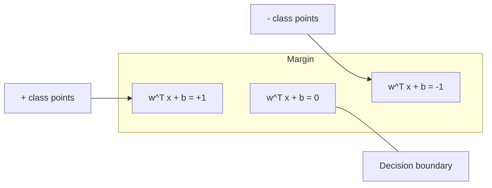
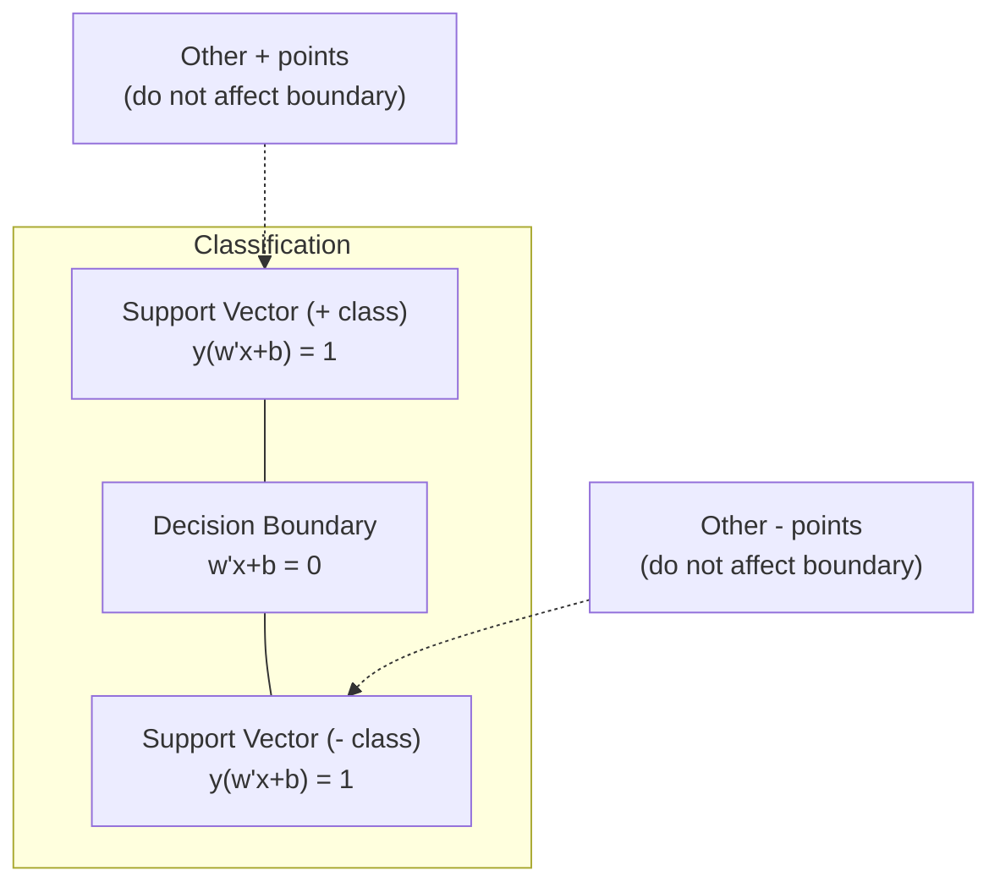
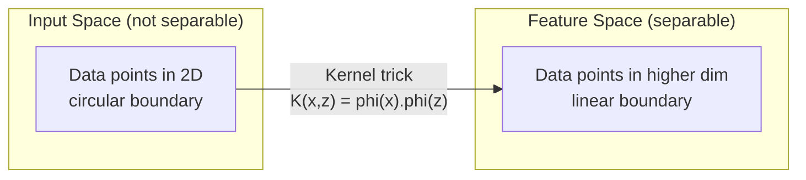

# Support Vector Machines

> Tìm con đường rộng nhất giữa hai lớp. Đó chính là toàn bộ ý tưởng.

**Type:** Build
**Languages:** Python
**Prerequisites:** Phase 1 (Lessons 08 Optimization, 14 Norms and Distances, 18 Convex Optimization)
**Time:** ~90 phút

## Mục tiêu học tập

- Triển khai một linear SVM từ đầu bằng cách sử dụng hinge loss và gradient descent trên công thức primal.
- Giải thích nguyên lý maximum margin và xác định các support vector từ một mô hình đã huấn luyện.
- So sánh các kernel linear, polynomial và RBF, đồng thời giải thích cách kernel trick tránh việc ánh xạ tường minh sang không gian chiều cao.
- Đánh giá sự đánh đổi (tradeoff) được kiểm soát bởi tham số C giữa độ rộng lề (margin) và các lỗi phân loại.

## Vấn đề

Bạn có hai lớp dữ liệu và cần vẽ một đường thẳng (hoặc siêu phẳng) để phân tách chúng. Có vô số đường thẳng có thể thực hiện được việc này. Bạn nên chọn đường nào?

Đường có lề (margin) lớn nhất. Margin là khoảng cách giữa ranh giới quyết định và các điểm dữ liệu gần nhất ở mỗi bên. Margin rộng hơn có nghĩa là bộ phân loại tự tin hơn và có khả năng tổng quát hóa tốt hơn với dữ liệu chưa từng thấy.

Trực giác này dẫn đến Support Vector Machines, một trong những thuật toán thanh lịch nhất về mặt toán học trong ML. SVM từng là phương pháp phân loại thống trị trước khi deep learning xuất hiện và vẫn là lựa chọn tốt nhất cho các tập dữ liệu nhỏ, dữ liệu nhiều chiều và các bài toán cần một mô hình có nguyên lý, dễ hiểu với các đảm bảo về mặt lý thuyết.

SVM kết nối trực tiếp với Phase 1: tối ưu hóa là lồi (Lesson 18), margin được đo bằng các chuẩn (Lesson 14), và kernel trick khai thác các tích vô hướng để xử lý các ranh giới phi tuyến tính mà không cần tính toán trong không gian nhiều chiều.

## Khái niệm

### Bộ phân loại maximum margin

Với dữ liệu có thể phân tách tuyến tính với nhãn y_i trong {-1, +1} và các vector đặc trưng x_i, chúng ta muốn một siêu phẳng w^T x + b = 0 phân tách các lớp.

Khoảng cách từ một điểm x_i đến siêu phẳng là:

```
distance = |w^T x_i + b| / ||w||
```

Đối với một điểm được phân loại đúng: y_i * (w^T x_i + b) > 0. Margin là gấp đôi khoảng cách từ siêu phẳng đến điểm gần nhất ở mỗi bên.



Bài toán tối ưu hóa:

```
maximize    2 / ||w||     (the margin width)
subject to  y_i * (w^T x_i + b) >= 1  for all i
```

Tương đương (tối thiểu hóa ||w||^2 dễ tối ưu hơn):

```
minimize    (1/2) ||w||^2
subject to  y_i * (w^T x_i + b) >= 1  for all i
```

Đây là một bài toán lập trình bậc hai lồi (convex quadratic program). Nó có một nghiệm toàn cục duy nhất. Các điểm dữ liệu nằm chính xác trên ranh giới của margin (nơi y_i * (w^T x_i + b) = 1) là các support vector. Chúng là những điểm duy nhất xác định ranh giới quyết định. Di chuyển hoặc loại bỏ bất kỳ điểm nào không phải là support vector, ranh giới sẽ không thay đổi.

### Support vectors: những điểm quan trọng



Hầu hết các điểm huấn luyện đều không liên quan. Chỉ có các support vector là quan trọng. Đây là lý do tại sao SVM hiệu quả về bộ nhớ tại thời điểm dự đoán: bạn chỉ cần lưu trữ các support vector, không phải toàn bộ tập huấn luyện.

Số lượng support vector cũng đưa ra một giới hạn về sai số tổng quát hóa. Ít support vector hơn so với kích thước tập dữ liệu có nghĩa là khả năng tổng quát hóa tốt hơn.

### Soft margin: xử lý nhiễu với tham số C

Dữ liệu thực tế hiếm khi có thể phân tách hoàn hảo. Một số điểm có thể nằm sai phía của ranh giới hoặc nằm bên trong margin. Công thức soft margin cho phép các vi phạm bằng cách giới thiệu các biến bù (slack variables).

```
minimize    (1/2) ||w||^2 + C * sum(xi_i)
subject to  y_i * (w^T x_i + b) >= 1 - xi_i
            xi_i >= 0  for all i
```

Biến bù xi_i đo lường mức độ điểm i vi phạm margin. C kiểm soát sự đánh đổi:

| Giá trị C | Hành vi |
|---------|----------|
| C lớn | Phạt nặng các vi phạm. Margin hẹp, ít lỗi phân loại hơn. Dễ bị Overfit |
| C nhỏ | Cho phép nhiều vi phạm hơn. Margin rộng, nhiều lỗi phân loại hơn. Dễ bị Underfit |

C là cường độ chính quy hóa (regularization strength), nhưng theo chiều ngược lại. C lớn = ít chính quy hóa hơn. C nhỏ = nhiều chính quy hóa hơn.

### Hinge loss: hàm mất mát của SVM

Soft margin SVM có thể được viết lại dưới dạng tối ưu hóa không ràng buộc:

```
minimize    (1/2) ||w||^2 + C * sum(max(0, 1 - y_i * (w^T x_i + b)))
```

Thuật ngữ max(0, 1 - y_i * f(x_i)) là hinge loss. Nó bằng 0 khi điểm được phân loại đúng và nằm ngoài margin. Nó là hàm tuyến tính khi điểm nằm trong margin hoặc bị phân loại sai.

```
Hinge loss for a single point:

loss
  |
  | \
  |  \
  |   \
  |    \
  |     \_______________
  |
  +-----|-----|-------->  y * f(x)
       0     1

Zero loss when y*f(x) >= 1 (correctly classified, outside margin).
Linear penalty when y*f(x) < 1.
```

So sánh với logistic loss (logistic regression):

```
Hinge:     max(0, 1 - y*f(x))          Hard cutoff at margin
Logistic:  log(1 + exp(-y*f(x)))        Smooth, never exactly zero
```

Hinge loss tạo ra các nghiệm thưa (chỉ các support vector mới có đóng góp khác 0). Logistic loss sử dụng tất cả các điểm dữ liệu. Điều này làm cho SVM hiệu quả hơn về bộ nhớ tại thời điểm dự đoán.

### Huấn luyện linear SVM với gradient descent

Bạn có thể huấn luyện một linear SVM bằng cách sử dụng gradient descent trên hinge loss cộng với L2 regularization, mà không cần giải bài toán QP có ràng buộc:

```
L(w, b) = (lambda/2) * ||w||^2 + (1/n) * sum(max(0, 1 - y_i * (w^T x_i + b)))

Gradient with respect to w:
  If y_i * (w^T x_i + b) >= 1:  dL/dw = lambda * w
  If y_i * (w^T x_i + b) < 1:   dL/dw = lambda * w - y_i * x_i

Gradient with respect to b:
  If y_i * (w^T x_i + b) >= 1:  dL/db = 0
  If y_i * (w^T x_i + b) < 1:   dL/db = -y_i
```

Đây được gọi là công thức primal. Nó chạy trong O(n * d) mỗi epoch, trong đó n là số lượng mẫu và d là số lượng đặc trưng. Đối với dữ liệu lớn, thưa và nhiều chiều (phân loại văn bản), cách này rất nhanh.

### Công thức dual và kernel trick

Lagrangian dual của bài toán SVM (từ Phase 1 Lesson 18, các điều kiện KKT) là:

```
maximize    sum(alpha_i) - (1/2) * sum_ij(alpha_i * alpha_j * y_i * y_j * (x_i . x_j))
subject to  0 <= alpha_i <= C
            sum(alpha_i * y_i) = 0
```

Công thức dual chỉ liên quan đến các tích vô hướng x_i . x_j giữa các điểm dữ liệu. Đây là chìa khóa quan trọng. Thay thế mọi tích vô hướng bằng một hàm kernel K(x_i, x_j) và SVM có thể học các ranh giới phi tuyến tính mà không bao giờ cần tính toán phép biến đổi một cách tường minh.

```
Linear kernel:      K(x, z) = x . z
Polynomial kernel:  K(x, z) = (x . z + c)^d
RBF (Gaussian):     K(x, z) = exp(-gamma * ||x - z||^2)
```

RBF kernel ánh xạ dữ liệu vào một không gian vô hạn chiều. Các điểm gần nhau trong không gian đầu vào có giá trị kernel gần bằng 1. Các điểm cách xa nhau có giá trị kernel gần bằng 0. Nó có thể học bất kỳ ranh giới quyết định trơn tru nào.



Kernel trick tính toán tích vô hướng trong không gian nhiều chiều mà không bao giờ thực sự đi đến đó. Đối với polynomial kernel bậc d trong D chiều, không gian đặc trưng tường minh có O(D^d) chiều. Nhưng K(x, z) được tính trong thời gian O(D).

### SVM cho hồi quy (SVR)

Support Vector Regression khớp một "ống" có độ rộng epsilon xung quanh dữ liệu. Các điểm bên trong ống có mất mát bằng 0. Các điểm bên ngoài ống bị phạt theo hàm tuyến tính.

```
minimize    (1/2) ||w||^2 + C * sum(xi_i + xi_i*)
subject to  y_i - (w^T x_i + b) <= epsilon + xi_i
            (w^T x_i + b) - y_i <= epsilon + xi_i*
            xi_i, xi_i* >= 0
```

Tham số epsilon kiểm soát độ rộng của ống. Ống rộng hơn = ít support vector hơn = khớp trơn tru hơn. Ống hẹp hơn = nhiều support vector hơn = khớp chặt chẽ hơn.

### Tại sao SVM thua deep learning (và khi nào chúng vẫn thắng)

SVM thống trị ML từ cuối những năm 1990 đến đầu những năm 2010. Deep learning đã vượt qua chúng vì một số lý do:

| Yếu tố | SVM | Deep learning |
|--------|------|---------------|
| Kỹ thuật đặc trưng | Cần thiết | Tự học đặc trưng |
| Khả năng mở rộng | O(n^2) đến O(n^3) cho kernel | O(n) mỗi epoch với SGD |
| Hình ảnh/văn bản/âm thanh | Cần đặc trưng thủ công | Học từ dữ liệu thô |
| Tập dữ liệu lớn (>100k) | Chậm | Mở rộng tốt |
| Tăng tốc GPU | Lợi ích hạn chế | Tăng tốc cực lớn |

SVM vẫn thắng trong các tình huống sau:
- Tập dữ liệu nhỏ (vài trăm đến vài nghìn mẫu)
- Dữ liệu thưa nhiều chiều (văn bản với đặc trưng TF-IDF)
- Khi bạn cần các đảm bảo toán học (margin bounds)
- Khi thời gian huấn luyện phải tối thiểu (linear SVM rất nhanh)
- Phân loại nhị phân với cấu trúc margin rõ ràng
- Phát hiện bất thường (one-class SVM)

```figure
svm-margin
```

## Build It

### Bước 1: Hinge loss và gradient

Nền tảng. Tính hinge loss cho một batch và gradient của nó.

```python
def hinge_loss(X, y, w, b):
    n = len(X)
    total_loss = 0.0
    for i in range(n):
        margin = y[i] * (dot(w, X[i]) + b)
        total_loss += max(0.0, 1.0 - margin)
    return total_loss / n
```

### Bước 2: Linear SVM qua gradient descent

Huấn luyện bằng cách tối thiểu hóa hinge loss có chính quy hóa. Không cần bộ giải QP.

```python
class LinearSVM:
    def __init__(self, lr=0.001, lambda_param=0.01, n_epochs=1000):
        self.lr = lr
        self.lambda_param = lambda_param
        self.n_epochs = n_epochs
        self.w = None
        self.b = 0.0

    def fit(self, X, y):
        n_features = len(X[0])
        self.w = [0.0] * n_features
        self.b = 0.0

        for epoch in range(self.n_epochs):
            for i in range(len(X)):
                margin = y[i] * (dot(self.w, X[i]) + self.b)
                if margin >= 1:
                    self.w = [wj - self.lr * self.lambda_param * wj
                              for wj in self.w]
                else:
                    self.w = [wj - self.lr * (self.lambda_param * wj - y[i] * X[i][j])
                              for j, wj in enumerate(self.w)]
                    self.b -= self.lr * (-y[i])

    def predict(self, X):
        return [1 if dot(self.w, x) + self.b >= 0 else -1 for x in X]
```

### Bước 3: Các hàm kernel

Triển khai các kernel linear, polynomial và RBF.

```python
def linear_kernel(x, z):
    return dot(x, z)

def polynomial_kernel(x, z, degree=3, c=1.0):
    return (dot(x, z) + c) ** degree

def rbf_kernel(x, z, gamma=0.5):
    diff = [xi - zi for xi, zi in zip(x, z)]
    return math.exp(-gamma * dot(diff, diff))
```

### Bước 4: Xác định margin và support vector

Sau khi huấn luyện, xác định điểm nào là support vector và tính độ rộng margin.

```python
def find_support_vectors(X, y, w, b, tol=1e-3):
    support_vectors = []
    for i in range(len(X)):
        margin = y[i] * (dot(w, X[i]) + b)
        if abs(margin - 1.0) < tol:
            support_vectors.append(i)
    return support_vectors
```

Xem `code/svm.py` để biết triển khai đầy đủ với tất cả các bản demo.

## Use It

Với scikit-learn:

```python
from sklearn.svm import SVC, LinearSVC, SVR
from sklearn.preprocessing import StandardScaler
from sklearn.pipeline import Pipeline

clf = Pipeline([
    ("scaler", StandardScaler()),
    ("svm", SVC(kernel="rbf", C=1.0, gamma="scale")),
])
clf.fit(X_train, y_train)
print(f"Accuracy: {clf.score(X_test, y_test):.4f}")
print(f"Support vectors: {clf['svm'].n_support_}")
```

Quan trọng: luôn chuẩn hóa (scale) các đặc trưng của bạn trước khi huấn luyện SVM. SVM nhạy cảm với độ lớn của đặc trưng vì margin phụ thuộc vào ||w||, và các đặc trưng chưa được chuẩn hóa sẽ làm biến dạng hình học.

Đối với các tập dữ liệu lớn, hãy sử dụng `LinearSVC` (công thức primal, O(n) mỗi epoch) thay vì `SVC` (công thức dual, O(n^2) đến O(n^3)):

```python
from sklearn.svm import LinearSVC

clf = Pipeline([
    ("scaler", StandardScaler()),
    ("svm", LinearSVC(C=1.0, max_iter=10000)),
])
```

## Bài tập

1. Tạo một tập dữ liệu 2D có thể phân tách tuyến tính. Huấn luyện LinearSVM của bạn và xác định các support vector. Xác minh rằng các support vector là những điểm gần ranh giới quyết định nhất.

2. Thay đổi C từ 0.001 đến 1000 trên một tập dữ liệu nhiễu. Vẽ ranh giới quyết định cho mỗi giá trị C. Quan sát sự chuyển đổi từ margin rộng (underfitting) sang margin hẹp (overfitting).

3. Tạo một tập dữ liệu nơi các ranh giới lớp là hình tròn (không tuyến tính). Chứng minh rằng linear SVM thất bại. Tính ma trận RBF kernel và chỉ ra rằng các lớp trở nên có thể phân tách trong không gian đặc trưng do kernel tạo ra.

4. So sánh hinge loss và logistic loss trên cùng một tập dữ liệu. Huấn luyện một linear SVM và logistic regression. Đếm xem có bao nhiêu điểm huấn luyện đóng góp vào ranh giới quyết định của mỗi mô hình (support vectors so với tất cả các điểm).

5. Triển khai SVR (epsilon-insensitive loss). Khớp nó với y = sin(x) + nhiễu. Vẽ ống epsilon xung quanh các dự đoán và làm nổi bật các support vector (các điểm nằm ngoài ống).

## Thuật ngữ chính

| Thuật ngữ | Ý nghĩa thực tế |
|------|----------------------|
| Support vectors | Các điểm huấn luyện gần ranh giới quyết định nhất. Những điểm duy nhất xác định siêu phẳng |
| Margin | Khoảng cách giữa ranh giới quyết định và các support vector gần nhất. SVM tối đa hóa khoảng cách này |
| Hinge loss | max(0, 1 - y*f(x)). Bằng 0 khi phân loại đúng và nằm ngoài margin. Phạt tuyến tính nếu ngược lại |
| Tham số C | Sự đánh đổi giữa độ rộng margin và lỗi phân loại. C lớn = margin hẹp, C nhỏ = margin rộng |
| Soft margin | Công thức SVM cho phép vi phạm margin thông qua các biến bù. Xử lý dữ liệu không thể phân tách hoàn hảo |
| Kernel trick | Tính toán tích vô hướng trong không gian đặc trưng nhiều chiều mà không cần ánh xạ tường minh sang không gian đó |
| Linear kernel | K(x, z) = x . z. Tương đương với tích vô hướng tiêu chuẩn. Dùng cho dữ liệu có thể phân tách tuyến tính |
| RBF kernel | K(x, z) = exp(-gamma * \|\|x-z\|\|^2). Ánh xạ sang không gian vô hạn chiều. Học mọi ranh giới trơn tru |
| Polynomial kernel | K(x, z) = (x . z + c)^d. Ánh xạ sang không gian đặc trưng của các tổ hợp đa thức |
| Công thức Dual | Sự cải biên bài toán SVM chỉ phụ thuộc vào tích vô hướng giữa các điểm dữ liệu. Cho phép sử dụng kernel |
| SVR | Support Vector Regression. Khớp một ống epsilon xung quanh dữ liệu. Các điểm trong ống có mất mát bằng 0 |
| Biến bù (Slack variables) | xi_i: đo lường mức độ một điểm vi phạm margin. Bằng 0 cho các điểm phân loại đúng nằm ngoài margin |
| Maximum margin | Nguyên lý chọn siêu phẳng tối đa hóa khoảng cách đến các điểm gần nhất của mỗi lớp |

## Đọc thêm

- [Vapnik: The Nature of Statistical Learning Theory (1995)](https://link.springer.com/book/10.1007/978-1-4757-3264-1) - văn bản nền tảng về SVM và học thống kê
- [Cortes & Vapnik: Support-vector networks (1995)](https://link.springer.com/article/10.1007/BF00994018) - bài báo gốc về SVM
- [Platt: Sequential Minimal Optimization (1998)](https://www.microsoft.com/en-us/research/publication/sequential-minimal-optimization-a-fast-algorithm-for-training-support-vector-machines/) - thuật toán SMO giúp việc huấn luyện SVM trở nên thực tế
- [Tài liệu scikit-learn SVM](https://scikit-learn.org/stable/modules/svm.html) - hướng dẫn thực hành với các chi tiết triển khai
- [LIBSVM: Thư viện cho Support Vector Machines](https://www.csie.ntu.edu.tw/~cjlin/libsvm/) - thư viện C++ đứng sau hầu hết các triển khai SVM