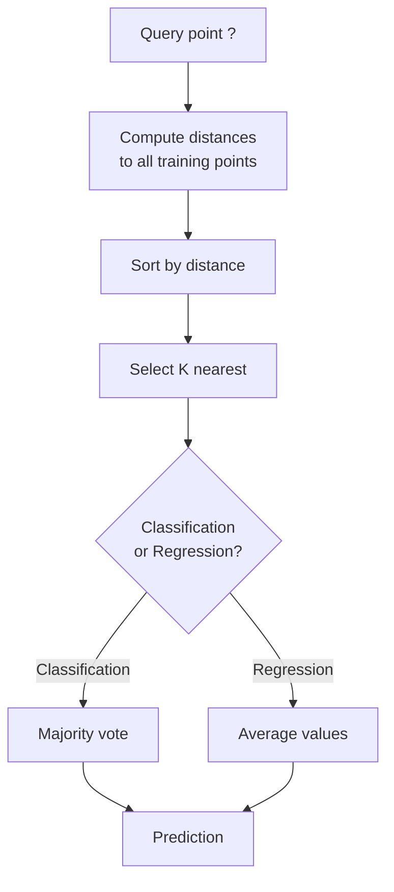
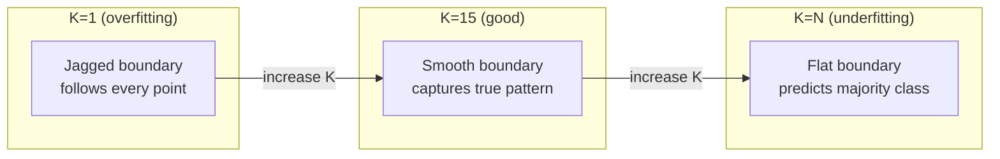
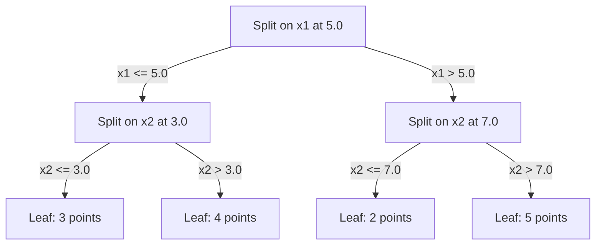

# K-Nearest Neighbors và các khoảng cách

> Lưu trữ mọi thứ. Dự đoán bằng cách nhìn vào những người hàng xóm. Thuật toán đơn giản nhất thực sự hiệu quả.

**Type:** Build
**Language:** Python
**Prerequisites:** Phase 1 (Lesson 14 Norms and Distances)
**Time:** ~90 phút

## Mục tiêu học tập

- Triển khai phân loại (classification) và hồi quy (regression) KNN từ đầu với K có thể cấu hình và cơ chế bình chọn theo trọng số khoảng cách.
- So sánh các metric khoảng cách L1, L2, cosine và Minkowski, đồng thời chọn metric phù hợp cho từng loại dữ liệu.
- Giải thích "lời nguyền đa chiều" (curse of dimensionality) và chứng minh tại sao KNN bị suy giảm hiệu năng trong không gian nhiều chiều.
- Xây dựng KD-tree để tìm kiếm láng giềng gần nhất hiệu quả và phân tích khi nào nó vượt trội hơn so với brute-force.

## Vấn đề

Bạn có một tập dữ liệu. Một điểm dữ liệu mới xuất hiện. Bạn cần phân loại nó hoặc dự đoán giá trị của nó. Thay vì học các tham số từ dữ liệu (như hồi quy tuyến tính hoặc SVM), bạn chỉ cần tìm K điểm huấn luyện gần nhất với điểm mới và để chúng bình chọn.

Đây chính là K-nearest neighbors. Không có giai đoạn huấn luyện. Không có tham số nào để học. Không có hàm mất mát nào để tối thiểu hóa. Bạn lưu trữ toàn bộ tập huấn luyện và tính toán khoảng cách tại thời điểm dự đoán.

Nghe có vẻ quá đơn giản để có thể hoạt động. Nhưng KNN lại cạnh tranh một cách đáng ngạc nhiên trong nhiều bài toán, đặc biệt là với các tập dữ liệu nhỏ đến trung bình. Việc hiểu sâu về nó sẽ làm sáng tỏ các khái niệm cơ bản: lựa chọn metric khoảng cách (kết nối với Phase 1 Lesson 14), lời nguyền đa chiều, và sự khác biệt giữa lazy learning và eager learning.

KNN cũng xuất hiện ở khắp mọi nơi trong AI hiện đại, chỉ là dưới những cái tên khác nhau. Các vector database thực hiện tìm kiếm KNN trên các embedding. Retrieval-augmented generation (RAG) tìm K đoạn văn bản gần nhất. Các hệ thống gợi ý tìm người dùng hoặc mục tương tự. Thuật toán là như nhau, chỉ có quy mô và cấu trúc dữ liệu là khác biệt.

## Khái niệm

### Cách KNN hoạt động

Với một tập dữ liệu gồm các điểm đã được gán nhãn và một điểm truy vấn mới:

1. Tính khoảng cách từ điểm truy vấn đến mọi điểm trong tập dữ liệu.
2. Sắp xếp theo khoảng cách.
3. Lấy K điểm gần nhất.
4. Đối với phân loại: bình chọn đa số trong K láng giềng.
5. Đối với hồi quy: lấy trung bình (hoặc trung bình có trọng số) giá trị của K láng giềng.



Đó là toàn bộ thuật toán. Không fitting. Không gradient descent. Không epochs.

### Lựa chọn K

K là siêu tham số duy nhất. Nó kiểm soát sự đánh đổi giữa bias và variance:

| K | Hành vi |
|---|----------|
| K = 1 | Biên quyết định đi theo mọi điểm. Sai số huấn luyện bằng 0. Variance cao. Overfit |
| K nhỏ (3-5) | Nhạy cảm với cấu trúc cục bộ. Có thể nắm bắt các biên phức tạp |
| K lớn | Biên mượt mà hơn. Mạnh mẽ hơn với nhiễu. Có thể underfit |
| K = N | Dự đoán lớp đa số cho mọi điểm. Bias tối đa |

Một điểm bắt đầu phổ biến là K = sqrt(N) cho tập dữ liệu có N điểm. Hãy sử dụng K lẻ cho phân loại nhị phân để tránh trường hợp hòa.



### Các metric khoảng cách

Hàm khoảng cách định nghĩa thế nào là "gần". Các metric khác nhau tạo ra các láng giềng khác nhau, dẫn đến các dự đoán khác nhau.

**L2 (Euclidean)** là mặc định. Khoảng cách đường thẳng.

```
d(a, b) = sqrt(sum((a_i - b_i)^2))
```

Nhạy cảm với quy mô đặc trưng (feature scale). Luôn chuẩn hóa các đặc trưng trước khi sử dụng L2 với KNN.

**L1 (Manhattan)** tính tổng các chênh lệch tuyệt đối. Mạnh mẽ hơn với các giá trị ngoại lai (outliers) so với L2 vì nó không bình phương các chênh lệch.

```
d(a, b) = sum(|a_i - b_i|)
```

**Cosine distance** đo góc giữa các vector, bỏ qua độ lớn. Rất cần thiết cho dữ liệu văn bản và embedding.

```
d(a, b) = 1 - (a . b) / (||a|| * ||b||)
```

**Minkowski** tổng quát hóa L1 và L2 với tham số p.

```
d(a, b) = (sum(|a_i - b_i|^p))^(1/p)

p=1: Manhattan
p=2: Euclidean
p->inf: Chebyshev (max absolute difference)
```

Việc sử dụng metric nào phụ thuộc vào dữ liệu:

| Loại dữ liệu | Metric tốt nhất | Tại sao |
|-----------|------------|-----|
| Đặc trưng số, quy mô tương đương | L2 (Euclidean) | Mặc định, hoạt động tốt cho dữ liệu không gian |
| Đặc trưng số, có outliers | L1 (Manhattan) | Mạnh mẽ, không khuếch đại các chênh lệch lớn |
| Text embeddings | Cosine | Độ lớn là nhiễu, hướng mới là ý nghĩa |
| Đa chiều thưa (sparse) | Cosine hoặc L1 | L2 chịu ảnh hưởng bởi lời nguyền đa chiều |
| Loại hỗn hợp | Custom distance | Kết hợp các metric theo từng loại đặc trưng |

### Weighted KNN

KNN tiêu chuẩn gán trọng số bằng nhau cho tất cả K láng giềng. Nhưng một láng giềng ở khoảng cách 0.1 nên quan trọng hơn một láng giềng ở khoảng cách 5.0.

**Distance-weighted KNN** gán trọng số cho mỗi láng giềng tỉ lệ nghịch với khoảng cách:

```
weight_i = 1 / (distance_i + epsilon)

For classification: weighted vote
For regression:     weighted average = sum(w_i * y_i) / sum(w_i)
```

Epsilon ngăn chặn việc chia cho 0 khi điểm truy vấn trùng khớp hoàn toàn với một điểm huấn luyện.

Weighted KNN ít nhạy cảm hơn với việc lựa chọn K vì các láng giềng ở xa đóng góp rất ít bất kể K là bao nhiêu.

### Lời nguyền đa chiều (Curse of dimensionality)

Hiệu năng của KNN suy giảm trong không gian nhiều chiều. Đây không phải là một mối lo ngại mơ hồ, mà là một sự thật toán học.

**Vấn đề 1: các khoảng cách hội tụ.** Khi số chiều tăng lên, tỉ lệ giữa khoảng cách lớn nhất và khoảng cách nhỏ nhất tiến dần về 1. Mọi điểm đều trở nên "xa" như nhau so với điểm truy vấn.

```
In d dimensions, for random uniform points:

d=2:    max_dist / min_dist = varies widely
d=100:  max_dist / min_dist ~ 1.01
d=1000: max_dist / min_dist ~ 1.001

When all distances are nearly equal, "nearest" is meaningless.
```

**Vấn đề 2: thể tích bùng nổ.** Để thu thập K láng giềng trong một phần cố định của dữ liệu, bạn cần mở rộng bán kính tìm kiếm để bao phủ một phần lớn hơn nhiều của không gian đặc trưng. "Vùng lân cận" trong không gian nhiều chiều bao trùm hầu hết không gian.

**Vấn đề 3: các góc chiếm ưu thế.** Trong một siêu khối đơn vị (unit hypercube) ở d chiều, hầu hết thể tích tập trung gần các góc, không phải ở tâm. Một hình cầu nội tiếp trong khối lập phương chứa một phần thể tích cực nhỏ khi d tăng lên.

Hệ quả thực tế: KNN hoạt động tốt với khoảng 20-50 đặc trưng. Ngoài con số đó, bạn cần giảm chiều dữ liệu (PCA, UMAP, t-SNE) trước khi áp dụng KNN, hoặc sử dụng các cấu trúc tìm kiếm dựa trên cây để khai thác tính chất đa chiều thấp nội tại của dữ liệu.

### KD-trees: tìm kiếm láng giềng gần nhất nhanh chóng

Brute-force KNN tính toán khoảng cách từ truy vấn đến mọi điểm huấn luyện. Đó là O(n * d) cho mỗi truy vấn. Với tập dữ liệu lớn, cách này quá chậm.

KD-tree phân vùng không gian một cách đệ quy dọc theo các trục đặc trưng. Tại mỗi cấp, nó chia dọc theo một chiều tại giá trị trung vị.



Để tìm láng giềng gần nhất, hãy duyệt cây đến lá chứa điểm truy vấn, sau đó quay lui (backtrack) và kiểm tra các phân vùng lân cận chỉ khi chúng có khả năng chứa các điểm gần hơn.

Thời gian truy vấn trung bình: O(log n) cho không gian ít chiều. Nhưng KD-trees suy giảm về O(n) trong không gian nhiều chiều (d > 20) vì việc quay lui loại bỏ ngày càng ít các nhánh.

### Ball trees: tốt hơn cho không gian chiều trung bình

Ball trees phân vùng dữ liệu thành các siêu cầu lồng nhau thay vì các hộp căn chỉnh theo trục. Mỗi nút định nghĩa một quả cầu (tâm + bán kính) chứa tất cả các điểm trong cây con đó.

Ưu điểm so với KD-trees:
- Hoạt động tốt hơn trong không gian chiều trung bình (lên đến ~50)
- Xử lý được cấu trúc không căn chỉnh theo trục
- Thể tích bao quanh chặt chẽ hơn nghĩa là nhiều nhánh được cắt tỉa hơn trong quá trình tìm kiếm

Cả KD-trees và ball trees đều là các thuật toán chính xác. Đối với tìm kiếm quy mô thực sự lớn (hàng triệu điểm, hàng trăm chiều), các phương pháp tìm kiếm láng giềng gần nhất xấp xỉ (HNSW, IVF, product quantization) được sử dụng thay thế. Những phương pháp này được đề cập trong Phase 1 Lesson 14.

### Lazy learning vs Eager learning

KNN là một lazy learner: nó không làm gì tại thời điểm huấn luyện và thực hiện mọi công việc tại thời điểm dự đoán. Hầu hết các thuật toán khác (hồi quy tuyến tính, SVM, mạng thần kinh) là eager learners: chúng thực hiện tính toán nặng nề tại thời điểm huấn luyện để xây dựng một mô hình nhỏ gọn, sau đó việc dự đoán sẽ rất nhanh.

| Khía cạnh | Lazy (KNN) | Eager (SVM, neural net) |
|--------|------------|------------------------|
| Thời gian huấn luyện | O(1) chỉ lưu trữ dữ liệu | O(n * epochs) |
| Thời gian dự đoán | O(n * d) mỗi truy vấn | O(d) hoặc O(tham số) |
| Bộ nhớ khi dự đoán | Lưu trữ toàn bộ tập huấn luyện | Chỉ lưu trữ tham số mô hình |
| Thích nghi với dữ liệu mới | Thêm điểm ngay lập tức | Huấn luyện lại mô hình |
| Biên quyết định | Ngầm định, tính toán tức thời | Tường minh, cố định sau huấn luyện |

Lazy learning là lý tưởng khi:
- Tập dữ liệu thay đổi thường xuyên (thêm/xóa điểm mà không cần huấn luyện lại)
- Bạn cần dự đoán cho rất ít truy vấn
- Bạn muốn thời gian huấn luyện bằng 0
- Tập dữ liệu đủ nhỏ để tìm kiếm brute-force diễn ra nhanh chóng

### KNN cho hồi quy

Thay vì bình chọn đa số, KNN cho hồi quy lấy trung bình các giá trị mục tiêu của K láng giềng.

```
prediction = (1/K) * sum(y_i for i in K nearest neighbors)

Or with distance weighting:
prediction = sum(w_i * y_i) / sum(w_i)
where w_i = 1 / distance_i
```

Hồi quy KNN tạo ra các dự đoán hằng số từng đoạn (hoặc mượt mà từng đoạn nếu có trọng số). Nó không thể ngoại suy (extrapolate) ngoài phạm vi của dữ liệu huấn luyện. Nếu các mục tiêu huấn luyện đều nằm trong khoảng từ 0 đến 100, KNN sẽ không bao giờ dự đoán ra 200.

```figure
knn-smoothness
```

## Xây dựng

### Bước 1: Các hàm khoảng cách

Triển khai khoảng cách L1, L2, cosine và Minkowski. Những hàm này kết nối trực tiếp với Phase 1 Lesson 14.

```python
import math

def l2_distance(a, b):
    return math.sqrt(sum((ai - bi) ** 2 for ai, bi in zip(a, b)))

def l1_distance(a, b):
    return sum(abs(ai - bi) for ai, bi in zip(a, b))

def cosine_distance(a, b):
    dot_val = sum(ai * bi for ai, bi in zip(a, b))
    norm_a = math.sqrt(sum(ai ** 2 for ai in a))
    norm_b = math.sqrt(sum(bi ** 2 for bi in b))
    if norm_a == 0 or norm_b == 0:
        return 1.0
    return 1.0 - dot_val / (norm_a * norm_b)

def minkowski_distance(a, b, p=2):
    if p == float('inf'):
        return max(abs(ai - bi) for ai, bi in zip(a, b))
    return sum(abs(ai - bi) ** p for ai, bi in zip(a, b)) ** (1 / p)
```

### Bước 2: KNN classifier và regressor

Xây dựng KNN hoàn chỉnh với K, metric khoảng cách có thể cấu hình và tùy chọn trọng số khoảng cách.

```python
class KNN:
    def __init__(self, k=5, distance_fn=l2_distance, weighted=False,
                 task="classification"):
        self.k = k
        self.distance_fn = distance_fn
        self.weighted = weighted
        self.task = task
        self.X_train = None
        self.y_train = None

    def fit(self, X, y):
        self.X_train = X
        self.y_train = y

    def predict(self, X):
        return [self._predict_one(x) for x in X]
```

### Bước 3: KD-tree để tìm kiếm hiệu quả

Xây dựng KD-tree từ đầu, chia đệ quy trên trung vị của mỗi chiều.

```python
class KDTree:
    def __init__(self, X, indices=None, depth=0):
        # Recursively partition the data
        self.axis = depth % len(X[0])
        # Split on median of the current axis
        ...

    def query(self, point, k=1):
        # Traverse to leaf, then backtrack
        ...
```

Xem `code/knn.py` để biết cách triển khai hoàn chỉnh với tất cả các phương thức hỗ trợ và bản demo.

### Bước 4: Chuẩn hóa đặc trưng (Feature scaling)

KNN yêu cầu chuẩn hóa đặc trưng vì các khoảng cách rất nhạy cảm với độ lớn của đặc trưng. Một đặc trưng dao động từ 0 đến 1000 sẽ lấn át một đặc trưng dao động từ 0 đến 1.

```python
def standardize(X):
    n = len(X)
    d = len(X[0])
    means = [sum(X[i][j] for i in range(n)) / n for j in range(d)]
    stds = [
        max(1e-10, (sum((X[i][j] - means[j]) ** 2 for i in range(n)) / n) ** 0.5)
        for j in range(d)
    ]
    return [[((X[i][j] - means[j]) / stds[j]) for j in range(d)] for i in range(n)], means, stds
```

## Sử dụng

Với scikit-learn:

```python
from sklearn.neighbors import KNeighborsClassifier
from sklearn.preprocessing import StandardScaler
from sklearn.pipeline import Pipeline

clf = Pipeline([
    ("scaler", StandardScaler()),
    ("knn", KNeighborsClassifier(n_neighbors=5, metric="euclidean")),
])
clf.fit(X_train, y_train)
print(f"Accuracy: {clf.score(X_test, y_test):.4f}")
```

Scikit-learn tự động sử dụng KD-trees hoặc ball trees khi tập dữ liệu đủ lớn và số chiều đủ thấp. Đối với dữ liệu nhiều chiều, nó quay lại sử dụng brute force. Bạn có thể kiểm soát điều này bằng tham số `algorithm`.

Đối với tìm kiếm láng giềng gần nhất quy mô lớn (hàng triệu vector), hãy sử dụng FAISS, Annoy hoặc một vector database:

```python
import faiss

index = faiss.IndexFlatL2(dimension)
index.add(embeddings)
distances, indices = index.search(query_vectors, k=5)
```

## Bài tập

1. Triển khai phân loại KNN trên tập dữ liệu 2D với 3 lớp. Vẽ biên quyết định cho K=1, K=5, K=15 và K=N. Quan sát sự chuyển đổi từ overfitting sang underfitting.

2. Tạo 1000 điểm ngẫu nhiên trong 2, 5, 10, 50, 100 và 500 chiều. Với mỗi số chiều, tính tỉ lệ giữa khoảng cách cặp lớn nhất và khoảng cách cặp nhỏ nhất. Vẽ biểu đồ tỉ lệ so với số chiều để hình dung về lời nguyền đa chiều.

3. So sánh khoảng cách L1, L2 và cosine cho KNN trên bài toán phân loại văn bản (sử dụng vector TF-IDF). Metric nào cho độ chính xác tốt nhất? Tại sao cosine thường thắng thế đối với văn bản?

4. Triển khai KD-tree và đo thời gian truy vấn so với brute force cho các tập dữ liệu 1k, 10k và 100k điểm trong 2D, 10D và 50D. Tại số chiều nào thì KD-tree không còn nhanh hơn brute force nữa?

5. Xây dựng một bộ hồi quy KNN có trọng số cho y = sin(x) + nhiễu. So sánh nó với KNN không trọng số cho K=3, 10, 30. Chứng minh rằng việc gán trọng số tạo ra các dự đoán mượt mà hơn, đặc biệt là với K lớn.

## Thuật ngữ chính

| Thuật ngữ | Ý nghĩa thực tế |
|------|----------------------|
| K-nearest neighbors | Thuật toán phi tham số dự đoán bằng cách tìm K điểm huấn luyện gần nhất với truy vấn |
| Lazy learning | Không tính toán tại thời điểm huấn luyện. Mọi công việc diễn ra tại thời điểm dự đoán. KNN là ví dụ điển hình |
| Eager learning | Tính toán nặng nề tại thời điểm huấn luyện để xây dựng mô hình nhỏ gọn. Hầu hết các thuật toán ML là eager |
| Lời nguyền đa chiều | Trong không gian nhiều chiều, các khoảng cách hội tụ và vùng lân cận mở rộng bao trùm hầu hết không gian, làm KNN kém hiệu quả |
| KD-tree | Cây nhị phân phân vùng không gian đệ quy dọc theo các trục đặc trưng. Truy vấn O(log n) trong không gian ít chiều |
| Ball tree | Cây của các siêu cầu lồng nhau. Hoạt động tốt hơn KD-trees trong không gian chiều trung bình (lên đến ~50) |
| Weighted KNN | Các láng giềng được gán trọng số tỉ lệ nghịch với khoảng cách. Láng giềng gần hơn có ảnh hưởng lớn hơn đến dự đoán |
| Feature scaling | Chuẩn hóa các đặc trưng về các phạm vi có thể so sánh. Bắt buộc cho các phương pháp dựa trên khoảng cách như KNN |
| Majority vote | Phân loại bằng cách đếm lớp nào phổ biến nhất trong K láng giềng |
| Brute force search | Tính toán khoảng cách đến mọi điểm huấn luyện. O(n*d) mỗi truy vấn. Chính xác nhưng chậm với n lớn |
| Approximate nearest neighbor | Các thuật toán (HNSW, LSH, IVF) tìm các điểm gần nhất một cách xấp xỉ nhanh hơn nhiều so với tìm kiếm chính xác |
| Voronoi diagram | Sự phân vùng không gian nơi mỗi vùng chứa tất cả các điểm gần một điểm huấn luyện nhất định hơn bất kỳ điểm nào khác. K=1 KNN tạo ra các biên Voronoi |

## Đọc thêm

- [Cover & Hart: Nearest Neighbor Pattern Classification (1967)](https://ieeexplore.ieee.org/document/1053964) - bài báo nền tảng về KNN chứng minh nó có tỉ lệ lỗi tối đa gấp đôi so với tối ưu Bayes
- [Friedman, Bentley, Finkel: An Algorithm for Finding Best Matches in Logarithmic Expected Time (1977)](https://dl.acm.org/doi/10.1145/355744.355745) - bài báo gốc về KD-tree
- [Beyer et al.: When Is "Nearest Neighbor" Meaningful? (1999)](https://link.springer.com/chapter/10.1007/3-540-49257-7_15) - phân tích chính thức về lời nguyền đa chiều cho láng giềng gần nhất
- [scikit-learn Nearest Neighbors documentation](https://scikit-learn.org/stable/modules/neighbors.html) - hướng dẫn thực tế với việc lựa chọn thuật toán
- [FAISS: A Library for Efficient Similarity Search](https://github.com/facebookresearch/faiss) - thư viện của Meta cho tìm kiếm láng giềng gần nhất xấp xỉ quy mô hàng tỷ điểm