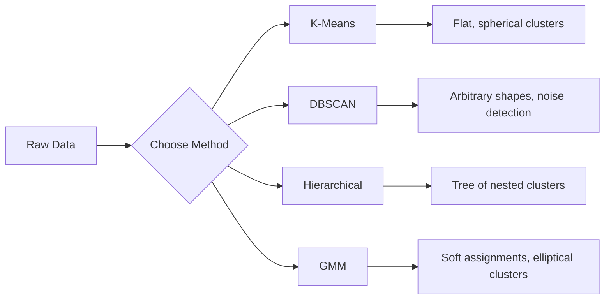

# Unsupervised Learning

> Không nhãn, không giáo viên. Thuật toán tự tìm ra cấu trúc.

**Type:** Build
**Languages:** Python
**Prerequisites:** Phase 1 (Norms & Distances, Probability & Distributions), Phase 2 Lessons 1-6
**Time:** ~90 phút

## Mục tiêu học tập

- Triển khai K-Means, DBSCAN và Gaussian Mixture Models từ đầu và so sánh hành vi phân cụm của chúng
- Đánh giá chất lượng cụm bằng silhouette score và phương pháp elbow để chọn K tối ưu
- Giải thích khi nào DBSCAN vượt trội hơn K-Means và xác định thuật toán nào xử lý được các cụm không có hình cầu và các điểm ngoại lai (outliers)
- Xây dựng pipeline phát hiện bất thường (anomaly detection) sử dụng các phương pháp phân cụm để gắn cờ các điểm lệch khỏi các mô hình bình thường

## Vấn đề

Mọi bài học ML cho đến nay đều giả định dữ liệu có nhãn: "đây là đầu vào, đây là đầu ra đúng." Trong thế giới thực, nhãn rất đắt đỏ. Một bệnh viện có hàng triệu hồ sơ bệnh nhân nhưng không ai gắn nhãn thủ công từng hồ sơ với một danh mục bệnh. Một trang web thương mại điện tử có hàng triệu phiên người dùng nhưng không ai gắn nhãn thủ công các phân khúc khách hàng. Một đội ngũ bảo mật có nhật ký mạng nhưng không ai gắn cờ mọi bất thường.

Unsupervised learning tìm ra các mẫu mà không cần được cho biết phải tìm gì. Nó nhóm các điểm dữ liệu tương tự, khám phá các cấu trúc ẩn và làm nổi bật các bất thường. Nếu supervised learning là học từ sách giáo khoa có đáp án, thì unsupervised learning là nhìn chằm chằm vào dữ liệu thô cho đến khi các mẫu tự bộc lộ.

Điểm khó: không có nhãn, bạn không thể đo lường trực tiếp "đúng" hay "sai". Bạn cần các công cụ khác nhau để đánh giá xem cấu trúc mà thuật toán của bạn tìm thấy có ý nghĩa hay không.

## Khái niệm

### Phân cụm (Clustering): Nhóm các thứ tương tự lại với nhau

Phân cụm gán mỗi điểm dữ liệu vào một nhóm (cụm) sao cho các điểm trong cùng một nhóm tương tự nhau hơn so với các điểm ở nhóm khác. Câu hỏi luôn là: "tương tự" nghĩa là gì?



### K-Means: "Con ngựa thồ"

K-Means phân chia dữ liệu thành chính xác K cụm. Mỗi cụm có một centroid (trọng tâm), và mọi điểm đều thuộc về centroid gần nhất.

Thuật toán Lloyd:

1. Chọn K điểm ngẫu nhiên làm centroid ban đầu
2. Gán mỗi điểm dữ liệu vào centroid gần nhất
3. Tính lại mỗi centroid bằng giá trị trung bình của các điểm được gán cho nó
4. Lặp lại bước 2-3 cho đến khi việc gán không còn thay đổi

Hàm mục tiêu (inertia) đo lường tổng bình phương khoảng cách từ mỗi điểm đến centroid được gán của nó. K-Means tối thiểu hóa giá trị này, nhưng chỉ tìm thấy cực tiểu địa phương. Các khởi tạo khác nhau có thể cho kết quả khác nhau.

### Chọn K

Hai phương pháp tiêu chuẩn:

**Phương pháp Elbow:** Chạy K-Means cho K = 1, 2, 3, ..., n. Vẽ biểu đồ inertia so với K. Tìm "khuỷu tay" (elbow) nơi việc thêm nhiều cụm không còn làm giảm inertia đáng kể.

**Silhouette score:** Đối với mỗi điểm, đo lường mức độ tương tự của nó với cụm của chính nó (a) so với cụm gần nhất khác (b). Hệ số silhouette là (b - a) / max(a, b), dao động từ -1 (sai cụm) đến +1 (phân cụm tốt). Lấy trung bình trên tất cả các điểm để có điểm số tổng thể.

### DBSCAN: Phân cụm dựa trên mật độ

K-Means giả định các cụm có hình cầu và yêu cầu bạn chọn K trước. DBSCAN không giả định điều đó. Nó tìm các cụm là các vùng mật độ cao được ngăn cách bởi các vùng thưa thớt.

Hai tham số:
- **eps**: bán kính của một vùng lân cận
- **min_samples**: số lượng điểm tối thiểu cần thiết để tạo thành một vùng mật độ cao

Ba loại điểm:
- **Core point**: có ít nhất min_samples điểm trong khoảng cách eps
- **Border point**: nằm trong khoảng cách eps của một core point nhưng bản thân không phải là core point
- **Noise point**: không phải core cũng không phải border. Đây là các điểm ngoại lai.

DBSCAN kết nối các core point nằm trong khoảng cách eps của nhau vào cùng một cụm. Các border point tham gia vào cụm của một core point gần đó. Các noise point không thuộc về cụm nào.

Điểm mạnh: tìm được các cụm có hình dạng bất kỳ, tự động xác định số lượng cụm, xác định được điểm ngoại lai. Điểm yếu: gặp khó khăn với các cụm có mật độ thay đổi.

### Phân cụm phân cấp (Hierarchical Clustering)

Xây dựng một cây (dendrogram) các cụm lồng nhau.

Agglomerative (từ dưới lên):
1. Bắt đầu với mỗi điểm là một cụm riêng
2. Hợp nhất hai cụm gần nhất
3. Lặp lại cho đến khi chỉ còn một cụm
4. Cắt dendrogram ở cấp độ mong muốn để có K cụm

"Độ gần" giữa các cụm có thể được đo bằng:
- **Single linkage**: khoảng cách tối thiểu giữa bất kỳ hai điểm nào trong hai cụm
- **Complete linkage**: khoảng cách tối đa giữa bất kỳ hai điểm nào
- **Average linkage**: khoảng cách trung bình giữa tất cả các cặp
- **Ward's method**: phép hợp nhất gây ra sự gia tăng nhỏ nhất trong tổng phương sai trong cụm

### Gaussian Mixture Models (GMM)

K-Means đưa ra các gán cứng (hard assignments): mỗi điểm thuộc chính xác một cụm. GMM đưa ra các gán mềm (soft assignments): mỗi điểm có xác suất thuộc về mỗi cụm.

GMM giả định dữ liệu được tạo ra từ hỗn hợp của K phân phối Gaussian, mỗi phân phối có trung bình và hiệp phương sai riêng. Thuật toán Expectation-Maximization (EM) luân phiên giữa:

- **E-step**: tính xác suất mỗi điểm thuộc về mỗi Gaussian
- **M-step**: cập nhật trung bình, hiệp phương sai và trọng số hỗn hợp của mỗi Gaussian để tối đa hóa khả năng xảy ra của dữ liệu

GMM có thể mô hình hóa các cụm hình elip (không chỉ hình cầu như K-Means) và xử lý tự nhiên các cụm chồng lấp.

### Khi nào sử dụng phương pháp nào

| Phương pháp | Tốt nhất cho | Tránh khi |
|--------|----------|------------|
| K-Means | Tập dữ liệu lớn, cụm hình cầu, đã biết K | Hình dạng bất thường, có điểm ngoại lai |
| DBSCAN | Chưa biết K, hình dạng tùy ý, phát hiện ngoại lai | Mật độ thay đổi, số chiều rất cao |
| Hierarchical | Tập dữ liệu nhỏ, cần dendrogram, chưa biết K | Tập dữ liệu lớn (bộ nhớ O(n^2)) |
| GMM | Cụm chồng lấp, cần gán mềm | Tập dữ liệu rất lớn, quá nhiều chiều |

### Phát hiện bất thường với phân cụm

Phân cụm hỗ trợ tự nhiên việc phát hiện bất thường:
- **K-Means**: các điểm xa mọi centroid là bất thường
- **DBSCAN**: các noise point là bất thường theo định nghĩa
- **GMM**: các điểm có xác suất thấp dưới tất cả các Gaussian là bất thường

```figure
kmeans-step
```

## Xây dựng

### Bước 1: K-Means từ đầu

```python
import math
import random


def euclidean_distance(a, b):
    return math.sqrt(sum((ai - bi) ** 2 for ai, bi in zip(a, b)))


def kmeans(data, k, max_iterations=100, seed=42):
    random.seed(seed)
    n_features = len(data[0])

    centroids = random.sample(data, k)

    for iteration in range(max_iterations):
        clusters = [[] for _ in range(k)]
        assignments = []

        for point in data:
            distances = [euclidean_distance(point, c) for c in centroids]
            nearest = distances.index(min(distances))
            clusters[nearest].append(point)
            assignments.append(nearest)

        new_centroids = []
        for cluster in clusters:
            if len(cluster) == 0:
                new_centroids.append(random.choice(data))
                continue
            centroid = [
                sum(point[j] for point in cluster) / len(cluster)
                for j in range(n_features)
            ]
            new_centroids.append(centroid)

        if all(
            euclidean_distance(old, new) < 1e-6
            for old, new in zip(centroids, new_centroids)
        ):
            print(f"  Converged at iteration {iteration + 1}")
            break

        centroids = new_centroids

    return assignments, centroids
```

### Bước 2: Phương pháp Elbow và silhouette score

```python
def compute_inertia(data, assignments, centroids):
    total = 0.0
    for point, cluster_id in zip(data, assignments):
        total += euclidean_distance(point, centroids[cluster_id]) ** 2
    return total


def silhouette_score(data, assignments):
    n = len(data)
    if n < 2:
        return 0.0

    clusters = {}
    for i, c in enumerate(assignments):
        clusters.setdefault(c, []).append(i)

    if len(clusters) < 2:
        return 0.0

    scores = []
    for i in range(n):
        own_cluster = assignments[i]
        own_members = [j for j in clusters[own_cluster] if j != i]

        if len(own_members) == 0:
            scores.append(0.0)
            continue

        a = sum(euclidean_distance(data[i], data[j]) for j in own_members) / len(own_members)

        b = float("inf")
        for cluster_id, members in clusters.items():
            if cluster_id == own_cluster:
                continue
            avg_dist = sum(euclidean_distance(data[i], data[j]) for j in members) / len(members)
            b = min(b, avg_dist)

        if max(a, b) == 0:
            scores.append(0.0)
        else:
            scores.append((b - a) / max(a, b))

    return sum(scores) / len(scores)


def find_best_k(data, max_k=10):
    print("Elbow method:")
    inertias = []
    for k in range(1, max_k + 1):
        assignments, centroids = kmeans(data, k)
        inertia = compute_inertia(data, assignments, centroids)
        inertias.append(inertia)
        print(f"  K={k}: inertia={inertia:.2f}")

    print("\nSilhouette scores:")
    for k in range(2, max_k + 1):
        assignments, centroids = kmeans(data, k)
        score = silhouette_score(data, assignments)
        print(f"  K={k}: silhouette={score:.4f}")

    return inertias
```

### Bước 3: DBSCAN từ đầu

```python
def dbscan(data, eps, min_samples):
    n = len(data)
    labels = [-1] * n
    cluster_id = 0

    def region_query(point_idx):
        neighbors = []
        for i in range(n):
            if euclidean_distance(data[point_idx], data[i]) <= eps:
                neighbors.append(i)
        return neighbors

    visited = [False] * n

    for i in range(n):
        if visited[i]:
            continue
        visited[i] = True

        neighbors = region_query(i)

        if len(neighbors) < min_samples:
            labels[i] = -1
            continue

        labels[i] = cluster_id
        seed_set = list(neighbors)
        seed_set.remove(i)

        j = 0
        while j < len(seed_set):
            q = seed_set[j]

            if not visited[q]:
                visited[q] = True
                q_neighbors = region_query(q)
                if len(q_neighbors) >= min_samples:
                    for nb in q_neighbors:
                        if nb not in seed_set:
                            seed_set.append(nb)

            if labels[q] == -1:
                labels[q] = cluster_id

            j += 1

        cluster_id += 1

    return labels
```

### Bước 4: Gaussian Mixture Model (thuật toán EM)

```python
def gmm(data, k, max_iterations=100, seed=42):
    random.seed(seed)
    n = len(data)
    d = len(data[0])

    indices = random.sample(range(n), k)
    means = [list(data[i]) for i in indices]
    variances = [1.0] * k
    weights = [1.0 / k] * k

    def gaussian_pdf(x, mean, variance):
        d = len(x)
        coeff = 1.0 / ((2 * math.pi * variance) ** (d / 2))
        exponent = -sum((xi - mi) ** 2 for xi, mi in zip(x, mean)) / (2 * variance)
        return coeff * math.exp(max(exponent, -500))

    for iteration in range(max_iterations):
        responsibilities = []
        for i in range(n):
            probs = []
            for j in range(k):
                probs.append(weights[j] * gaussian_pdf(data[i], means[j], variances[j]))
            total = sum(probs)
            if total == 0:
                total = 1e-300
            responsibilities.append([p / total for p in probs])

        old_means = [list(m) for m in means]

        for j in range(k):
            r_sum = sum(responsibilities[i][j] for i in range(n))
            if r_sum < 1e-10:
                continue

            weights[j] = r_sum / n

            for dim in range(d):
                means[j][dim] = sum(
                    responsibilities[i][j] * data[i][dim] for i in range(n)
                ) / r_sum

            variances[j] = sum(
                responsibilities[i][j]
                * sum((data[i][dim] - means[j][dim]) ** 2 for dim in range(d))
                for i in range(n)
            ) / (r_sum * d)
            variances[j] = max(variances[j], 1e-6)

        shift = sum(
            euclidean_distance(old_means[j], means[j]) for j in range(k)
        )
        if shift < 1e-6:
            print(f"  GMM converged at iteration {iteration + 1}")
            break

    assignments = []
    for i in range(n):
        assignments.append(responsibilities[i].index(max(responsibilities[i])))

    return assignments, means, weights, responsibilities
```

### Bước 5: Tạo dữ liệu kiểm tra và chạy mọi thứ

```python
def make_blobs(centers, n_per_cluster=50, spread=0.5, seed=42):
    random.seed(seed)
    data = []
    true_labels = []
    for label, (cx, cy) in enumerate(centers):
        for _ in range(n_per_cluster):
            x = cx + random.gauss(0, spread)
            y = cy + random.gauss(0, spread)
            data.append([x, y])
            true_labels.append(label)
    return data, true_labels


def make_moons(n_samples=200, noise=0.1, seed=42):
    random.seed(seed)
    data = []
    labels = []
    n_half = n_samples // 2
    for i in range(n_half):
        angle = math.pi * i / n_half
        x = math.cos(angle) + random.gauss(0, noise)
        y = math.sin(angle) + random.gauss(0, noise)
        data.append([x, y])
        labels.append(0)
    for i in range(n_half):
        angle = math.pi * i / n_half
        x = 1 - math.cos(angle) + random.gauss(0, noise)
        y = 1 - math.sin(angle) - 0.5 + random.gauss(0, noise)
        data.append([x, y])
        labels.append(1)
    return data, labels


if __name__ == "__main__":
    centers = [[2, 2], [8, 3], [5, 8]]
    data, true_labels = make_blobs(centers, n_per_cluster=50, spread=0.8)

    print("=== K-Means on 3 blobs ===")
    assignments, centroids = kmeans(data, k=3)
    print(f"  Centroids: {[[round(c, 2) for c in cent] for cent in centroids]}")
    sil = silhouette_score(data, assignments)
    print(f"  Silhouette score: {sil:.4f}")

    print("\n=== Elbow Method ===")
    find_best_k(data, max_k=6)

    print("\n=== DBSCAN on 3 blobs ===")
    db_labels = dbscan(data, eps=1.5, min_samples=5)
    n_clusters = len(set(db_labels) - {-1})
    n_noise = db_labels.count(-1)
    print(f"  Found {n_clusters} clusters, {n_noise} noise points")

    print("\n=== GMM on 3 blobs ===")
    gmm_assignments, gmm_means, gmm_weights, _ = gmm(data, k=3)
    print(f"  Means: {[[round(m, 2) for m in mean] for mean in gmm_means]}")
    print(f"  Weights: {[round(w, 3) for w in gmm_weights]}")
    gmm_sil = silhouette_score(data, gmm_assignments)
    print(f"  Silhouette score: {gmm_sil:.4f}")

    print("\n=== DBSCAN on moons (non-spherical clusters) ===")
    moon_data, moon_labels = make_moons(n_samples=200, noise=0.1)
    moon_db = dbscan(moon_data, eps=0.3, min_samples=5)
    n_moon_clusters = len(set(moon_db) - {-1})
    n_moon_noise = moon_db.count(-1)
    print(f"  Found {n_moon_clusters} clusters, {n_moon_noise} noise points")

    print("\n=== K-Means on moons (will fail to separate) ===")
    moon_km, moon_centroids = kmeans(moon_data, k=2)
    moon_sil = silhouette_score(moon_data, moon_km)
    print(f"  Silhouette score: {moon_sil:.4f}")
    print("  K-Means splits moons poorly because they are not spherical")

    print("\n=== Anomaly detection with DBSCAN ===")
    anomaly_data = list(data)
    anomaly_data.append([20.0, 20.0])
    anomaly_data.append([-5.0, -5.0])
    anomaly_data.append([15.0, 0.0])
    anomaly_labels = dbscan(anomaly_data, eps=1.5, min_samples=5)
    anomalies = [
        anomaly_data[i]
        for i in range(len(anomaly_labels))
        if anomaly_labels[i] == -1
    ]
    print(f"  Detected {len(anomalies)} anomalies")
    for a in anomalies[-3:]:
        print(f"    Point {[round(v, 2) for v in a]}")
```

## Sử dụng

Với scikit-learn, các thuật toán tương tự chỉ cần một dòng lệnh:

```python
from sklearn.cluster import KMeans, DBSCAN, AgglomerativeClustering
from sklearn.mixture import GaussianMixture
from sklearn.metrics import silhouette_score as sklearn_silhouette

km = KMeans(n_clusters=3, random_state=42).fit(data)
db = DBSCAN(eps=1.5, min_samples=5).fit(data)
agg = AgglomerativeClustering(n_clusters=3).fit(data)
gmm_model = GaussianMixture(n_components=3, random_state=42).fit(data)
```

Các phiên bản tự viết từ đầu cho bạn thấy chính xác những gì các thư viện này tính toán. K-Means lặp lại giữa việc gán và tính toán lại. DBSCAN phát triển các cụm từ các hạt giống mật độ cao. GMM luân phiên giữa kỳ vọng và tối đa hóa. Các phiên bản thư viện bổ sung tính ổn định số học, khởi tạo thông minh hơn (K-Means++) và tăng tốc GPU, nhưng logic cốt lõi vẫn giống nhau.

## Triển khai

Bài học này tạo ra các triển khai hoạt động của K-Means, DBSCAN và GMM từ đầu. Mã phân cụm có thể được tái sử dụng làm nền tảng cho các phương pháp unsupervised nâng cao hơn.

## Bài tập

1. Triển khai khởi tạo K-Means++: thay vì chọn các centroid ngẫu nhiên, hãy chọn cái đầu tiên ngẫu nhiên và mỗi centroid tiếp theo với xác suất tỷ lệ thuận với bình phương khoảng cách của nó đến centroid gần nhất hiện có. So sánh tốc độ hội tụ với khởi tạo ngẫu nhiên.
2. Thêm phân cụm phân cấp agglomerative vào mã. Triển khai Ward's linkage và tạo dendrogram (dưới dạng danh sách lồng nhau của các phép hợp nhất). Cắt nó ở các cấp độ khác nhau và so sánh với kết quả K-Means.
3. Xây dựng một pipeline phát hiện bất thường đơn giản: chạy DBSCAN và GMM trên cùng một dữ liệu, gắn cờ các điểm mà cả hai phương pháp đều đồng ý là ngoại lai (noise trong DBSCAN, xác suất thấp trong GMM). Đo lường sự chồng lấp và thảo luận khi nào các phương pháp không đồng ý.

## Thuật ngữ chính

| Thuật ngữ | Cách gọi thông thường | Ý nghĩa thực tế |
|------|----------------|----------------------|
| Clustering | "Nhóm các thứ tương tự" | Phân chia dữ liệu thành các tập con nơi độ tương tự trong nhóm vượt quá độ tương tự giữa các nhóm, được đo bằng một metric khoảng cách cụ thể |
| Centroid | "Tâm của một cụm" | Trung bình của tất cả các điểm được gán cho một cụm; được K-Means sử dụng làm đại diện cụm |
| Inertia | "Độ chặt của các cụm" | Tổng bình phương khoảng cách từ mỗi điểm đến centroid được gán; thấp hơn nghĩa là chặt hơn |
| Silhouette score | "Độ tách biệt của các cụm" | Đối với mỗi điểm, (b - a) / max(a, b) trong đó a là khoảng cách trung bình trong cụm và b là khoảng cách trung bình đến cụm gần nhất |
| Core point | "Điểm trong vùng mật độ cao" | Một điểm có ít nhất min_samples lân cận trong khoảng cách eps, trong DBSCAN |
| EM algorithm | "Soft K-Means" | Expectation-Maximization: tính toán xác suất thành viên (E-step) và cập nhật tham số phân phối (M-step) một cách lặp đi lặp lại |
| Dendrogram | "Cây phân cụm" | Biểu đồ cây hiển thị thứ tự và khoảng cách mà tại đó các cụm được hợp nhất trong phân cụm phân cấp |
| Anomaly | "Điểm ngoại lai" | Một điểm dữ liệu không tuân theo mẫu dự kiến, được DBSCAN xác định là noise hoặc GMM xác định là xác suất thấp |

## Đọc thêm

- [Stanford CS229 - Unsupervised Learning](https://cs229.stanford.edu/notes2022fall/main_notes.pdf) - Ghi chú bài giảng của Andrew Ng về phân cụm và EM
- [scikit-learn Clustering Guide](https://scikit-learn.org/stable/modules/clustering.html) - so sánh thực tế tất cả các thuật toán phân cụm với các ví dụ trực quan
- [DBSCAN original paper (Ester et al., 1996)](https://www.aaai.org/Papers/KDD/1996/KDD96-037.pdf) - bài báo giới thiệu phân cụm dựa trên mật độ