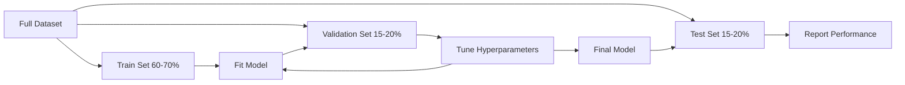

# Đánh giá mô hình

> Một mô hình chỉ tốt khi cách bạn đo lường nó đủ tốt.

**Type:** Build
**Languages:** Python
**Prerequisites:** Phase 1 (Probability & Distributions, Statistics for ML), Phase 2 Lessons 1-8
**Time:** ~90 phút

## Mục tiêu học tập

- Triển khai K-fold và stratified K-fold cross-validation từ đầu và giải thích tại sao phân lớp (stratification) lại quan trọng đối với dữ liệu mất cân bằng.
- Tính toán precision, recall, F1, AUC-ROC và các chỉ số hồi quy (MSE, RMSE, MAE, R-squared) từ đầu.
- Diễn giải các đường cong học tập (learning curves) để chẩn đoán xem mô hình có bị high bias (thiên kiến cao) hay high variance (phương sai cao) hay không.
- Nhận diện các lỗi đánh giá phổ biến bao gồm data leakage, chọn sai chỉ số và nhiễm dữ liệu tập kiểm thử (test set contamination).

## Vấn đề

Bạn đã huấn luyện một mô hình. Nó đạt độ chính xác 95% trên dữ liệu của bạn. Liệu nó có tốt không?

Có thể. Cũng có thể không. Nếu 95% dữ liệu của bạn thuộc về một lớp, một mô hình luôn dự đoán lớp đó sẽ đạt độ chính xác 95% trong khi hoàn toàn vô dụng. Nếu bạn đánh giá trên chính dữ liệu bạn đã dùng để huấn luyện, con số 95% là vô nghĩa vì mô hình chỉ đơn giản là ghi nhớ các câu trả lời. Nếu tập dữ liệu của bạn có thành phần thời gian và bạn xáo trộn ngẫu nhiên trước khi chia, mô hình của bạn có thể đang sử dụng dữ liệu tương lai để dự đoán quá khứ.

Đánh giá mô hình là nơi hầu hết các dự án ML đi chệch hướng. Chỉ số sai khiến một mô hình tồi trông có vẻ tốt. Cách chia sai khiến mô hình "gian lận". So sánh sai khiến bạn chọn mô hình tệ hơn. Đánh giá đúng không phải là tùy chọn. Đó là sự khác biệt giữa một mô hình hoạt động trong môi trường production và một mô hình thất bại ngay khi nhìn thấy dữ liệu thực tế.

## Khái niệm

### Train, Validation, Test



Ba tập dữ liệu, ba mục đích:

- **Training set**: mô hình học từ dữ liệu này. Nó nhìn thấy các ví dụ này trong quá trình huấn luyện.
- **Validation set**: được sử dụng để tinh chỉnh các siêu tham số (hyperparameters) và lựa chọn giữa các mô hình. Mô hình không bao giờ huấn luyện trên dữ liệu này, nhưng các quyết định của bạn bị ảnh hưởng bởi nó.
- **Test set**: chỉ được chạm vào đúng một lần, ở bước cuối cùng, để báo cáo hiệu suất cuối cùng. Nếu bạn nhìn vào hiệu suất test và sau đó quay lại thay đổi mô hình, nó không còn là test set nữa. Nó đã trở thành một validation set thứ hai.

Test set là sự đảm bảo rằng hiệu suất được báo cáo phản ánh cách mô hình sẽ hoạt động trên dữ liệu thực sự chưa từng thấy.

### K-Fold Cross-Validation

Với các tập dữ liệu nhỏ, việc chia train/validation đơn lẻ gây lãng phí dữ liệu và tạo ra các ước tính nhiễu. K-fold cross-validation sử dụng tất cả dữ liệu cho cả huấn luyện và xác thực:

```mermaid
flowchart TB
    subgraph Fold1["Fold 1"]
        direction LR
        V1["Val"] --- T1a["Train"] --- T1b["Train"] --- T1c["Train"] --- T1d["Train"]
    end
    subgraph Fold2["Fold 2"]
        direction LR
        T2a["Train"] --- V2["Val"] --- T2b["Train"] --- T2c["Train"] --- T2d["Train"]
    end
    subgraph Fold3["Fold 3"]
        direction LR
        T3a["Train"] --- T3b["Train"] --- V3["Val"] --- T3c["Train"] --- T3d["Train"]
    end
    subgraph Fold4["Fold 4"]
        direction LR
        T4a["Train"] --- T4b["Train"] --- T4c["Train"] --- V4["Val"] --- T4d["Train"]
    end
    subgraph Fold5["Fold 5"]
        direction LR
        T5a["Train"] --- T5b["Train"] --- T5c["Train"] --- T5d["Train"] --- V5["Val"]
    end
    Fold1 --> R["Average scores"]
    Fold2 --> R
    Fold3 --> R
    Fold4 --> R
    Fold5 --> R
```



1. Chia dữ liệu thành K phần (folds) có kích thước bằng nhau.
2. Với mỗi fold, huấn luyện trên K-1 folds và xác thực trên fold còn lại.
3. Lấy trung bình của K điểm số xác thực.

K=5 hoặc K=10 là các lựa chọn tiêu chuẩn. Mỗi điểm dữ liệu được sử dụng để xác thực đúng một lần. Điểm trung bình là một ước tính ổn định hơn so với bất kỳ lần chia đơn lẻ nào.

**Stratified K-fold**: bảo toàn phân phối lớp trong mỗi fold. Nếu tập dữ liệu của bạn có 70% lớp A và 30% lớp B, mỗi fold sẽ có tỷ lệ tương tự. Điều này rất quan trọng đối với các tập dữ liệu mất cân bằng, nơi việc chia ngẫu nhiên có thể đưa tất cả các mẫu thiểu số vào một fold.

### Chỉ số phân loại (Classification Metrics)

**Confusion matrix**: nền tảng của mọi thứ. Đối với phân loại nhị phân:

|  | Dự đoán dương tính | Dự đoán âm tính |
|--|---|---|
| Thực tế dương tính | True Positive (TP) | False Negative (FN) |
| Thực tế âm tính | False Positive (FP) | True Negative (TN) |

Từ ma trận này, tất cả các chỉ số khác được suy ra:

- **Accuracy** = (TP + TN) / (TP + TN + FP + FN). Tỷ lệ dự đoán đúng. Gây hiểu lầm khi các lớp bị mất cân bằng.
- **Precision** = TP / (TP + FP). Trong tất cả những gì được dự đoán là dương tính, bao nhiêu thực sự là dương tính? Sử dụng khi false positive gây tốn kém (ví dụ: bộ lọc spam đánh dấu email thật là spam).
- **Recall** (độ nhạy) = TP / (TP + FN). Trong tất cả các trường hợp dương tính thực tế, chúng ta đã bắt được bao nhiêu? Sử dụng khi false negative gây tốn kém (ví dụ: sàng lọc ung thư bỏ sót khối u).
- **F1 score** = 2 * precision * recall / (precision + recall). Trung bình điều hòa của precision và recall. Cân bằng cả hai khi không có chỉ số nào chiếm ưu thế rõ rệt.
- **AUC-ROC**: Diện tích dưới đường cong Receiver Operating Characteristic. Vẽ biểu đồ tỷ lệ dương tính thật (TPR) so với tỷ lệ dương tính giả (FPR) ở các ngưỡng phân loại khác nhau. AUC = 0.5 nghĩa là đoán ngẫu nhiên, AUC = 1.0 nghĩa là phân tách hoàn hảo. Không phụ thuộc vào ngưỡng: nó đo lường mức độ mô hình xếp hạng các mẫu dương tính cao hơn các mẫu âm tính, bất kể ngưỡng bạn chọn là bao nhiêu.

### Chỉ số hồi quy (Regression Metrics)

- **MSE** (Mean Squared Error) = mean((y_true - y_pred)^2). Phạt các lỗi lớn theo bình phương. Nhạy cảm với các giá trị ngoại lai (outliers).
- **RMSE** (Root Mean Squared Error) = sqrt(MSE). Cùng đơn vị với biến mục tiêu. Dễ diễn giải hơn MSE.
- **MAE** (Mean Absolute Error) = mean(|y_true - y_pred|). Xử lý tất cả các lỗi một cách tuyến tính. Mạnh mẽ hơn (robust) với các giá trị ngoại lai so với MSE.
- **R-squared** = 1 - SS_res / SS_tot, trong đó SS_res = sum((y_true - y_pred)^2) và SS_tot = sum((y_true - y_mean)^2). Tỷ lệ phương sai được giải thích bởi mô hình. R^2 = 1.0 là hoàn hảo. R^2 = 0.0 nghĩa là mô hình không tốt hơn việc luôn dự đoán giá trị trung bình. R^2 có thể âm nếu mô hình tệ hơn việc dự đoán giá trị trung bình.

### Learning Curves

Vẽ biểu đồ điểm số huấn luyện và xác thực theo kích thước tập huấn luyện:

- **High bias (underfitting)**: cả hai đường cong hội tụ về một điểm số thấp. Thêm dữ liệu sẽ không giúp ích. Bạn cần một mô hình phức tạp hơn.
- **High variance (overfitting)**: điểm số huấn luyện cao nhưng điểm số xác thực thấp hơn nhiều. Khoảng cách giữa chúng lớn. Thêm dữ liệu sẽ giúp ích.

### Validation Curves

Vẽ biểu đồ điểm số huấn luyện và xác thực theo một siêu tham số:

- Ở độ phức tạp thấp: cả hai điểm số đều thấp (underfitting).
- Ở độ phức tạp phù hợp: cả hai điểm số đều cao và gần nhau.
- Ở độ phức tạp cao: điểm số huấn luyện vẫn cao nhưng điểm số xác thực giảm (overfitting).

Giá trị siêu tham số tối ưu là nơi điểm số xác thực đạt đỉnh.

### Các lỗi đánh giá phổ biến

**Data leakage**: thông tin từ tập test bị rò rỉ vào quá trình huấn luyện. Ví dụ: fit một scaler trên toàn bộ tập dữ liệu trước khi chia, bao gồm dữ liệu tương lai trong dự đoán chuỗi thời gian, sử dụng một đặc trưng được suy ra từ mục tiêu. Luôn chia dữ liệu trước, sau đó mới tiền xử lý.

**Class imbalance**: 99% giao dịch là hợp lệ, 1% là gian lận. Một mô hình luôn dự đoán "hợp lệ" đạt độ chính xác 99%. Hãy sử dụng precision, recall, F1 hoặc AUC-ROC thay thế.

**Sai chỉ số**: tối ưu hóa accuracy khi bạn nên tối ưu hóa recall (chẩn đoán y tế), hoặc tối ưu hóa RMSE khi dữ liệu của bạn có nhiều giá trị ngoại lai (hãy dùng MAE).

**Không sử dụng stratified splits**: với dữ liệu mất cân bằng, việc chia ngẫu nhiên có thể đưa rất ít mẫu thiểu số vào fold xác thực, dẫn đến các ước tính không ổn định.

**Kiểm tra quá thường xuyên**: mỗi khi bạn nhìn vào hiệu suất test và điều chỉnh, bạn đang overfitting vào tập test. Tập test chỉ được sử dụng một lần.

```figure
precision-recall-threshold
```

## Build It

### Bước 1: Chia Train/validation/test

```python
import random
import math


def train_val_test_split(X, y, train_ratio=0.6, val_ratio=0.2, seed=42):
    random.seed(seed)
    n = len(X)
    indices = list(range(n))
    random.shuffle(indices)

    train_end = int(n * train_ratio)
    val_end = int(n * (train_ratio + val_ratio))

    train_idx = indices[:train_end]
    val_idx = indices[train_end:val_end]
    test_idx = indices[val_end:]

    X_train = [X[i] for i in train_idx]
    y_train = [y[i] for i in train_idx]
    X_val = [X[i] for i in val_idx]
    y_val = [y[i] for i in val_idx]
    X_test = [X[i] for i in test_idx]
    y_test = [y[i] for i in test_idx]

    return X_train, y_train, X_val, y_val, X_test, y_test
```

### Bước 2: K-fold và stratified K-fold cross-validation

```python
def kfold_split(n, k=5, seed=42):
    random.seed(seed)
    indices = list(range(n))
    random.shuffle(indices)

    fold_size = n // k
    folds = []

    for i in range(k):
        start = i * fold_size
        end = start + fold_size if i < k - 1 else n
        val_idx = indices[start:end]
        train_idx = indices[:start] + indices[end:]
        folds.append((train_idx, val_idx))

    return folds


def stratified_kfold_split(y, k=5, seed=42):
    random.seed(seed)

    class_indices = {}
    for i, label in enumerate(y):
        class_indices.setdefault(label, []).append(i)

    for label in class_indices:
        random.shuffle(class_indices[label])

    folds = [{"train": [], "val": []} for _ in range(k)]

    for label, indices in class_indices.items():
        fold_size = len(indices) // k
        for i in range(k):
            start = i * fold_size
            end = start + fold_size if i < k - 1 else len(indices)
            val_part = indices[start:end]
            train_part = indices[:start] + indices[end:]
            folds[i]["val"].extend(val_part)
            folds[i]["train"].extend(train_part)

    return [(f["train"], f["val"]) for f in folds]


def cross_validate(X, y, model_fn, k=5, metric_fn=None, stratified=False):
    n = len(X)

    if stratified:
        folds = stratified_kfold_split(y, k)
    else:
        folds = kfold_split(n, k)

    scores = []
    for train_idx, val_idx in folds:
        X_train = [X[i] for i in train_idx]
        y_train = [y[i] for i in train_idx]
        X_val = [X[i] for i in val_idx]
        y_val = [y[i] for i in val_idx]

        model = model_fn()
        model.fit(X_train, y_train)
        predictions = [model.predict(x) for x in X_val]

        if metric_fn:
            score = metric_fn(y_val, predictions)
        else:
            score = sum(1 for yt, yp in zip(y_val, predictions) if yt == yp) / len(y_val)
        scores.append(score)

    return scores
```

### Bước 3: Confusion matrix và các chỉ số phân loại

```python
def confusion_matrix(y_true, y_pred):
    tp = sum(1 for yt, yp in zip(y_true, y_pred) if yt == 1 and yp == 1)
    tn = sum(1 for yt, yp in zip(y_true, y_pred) if yt == 0 and yp == 0)
    fp = sum(1 for yt, yp in zip(y_true, y_pred) if yt == 0 and yp == 1)
    fn = sum(1 for yt, yp in zip(y_true, y_pred) if yt == 1 and yp == 0)
    return tp, tn, fp, fn


def accuracy(y_true, y_pred):
    tp, tn, fp, fn = confusion_matrix(y_true, y_pred)
    total = tp + tn + fp + fn
    return (tp + tn) / total if total > 0 else 0.0


def precision(y_true, y_pred):
    tp, tn, fp, fn = confusion_matrix(y_true, y_pred)
    return tp / (tp + fp) if (tp + fp) > 0 else 0.0


def recall(y_true, y_pred):
    tp, tn, fp, fn = confusion_matrix(y_true, y_pred)
    return tp / (tp + fn) if (tp + fn) > 0 else 0.0


def f1_score(y_true, y_pred):
    p = precision(y_true, y_pred)
    r = recall(y_true, y_pred)
    return 2 * p * r / (p + r) if (p + r) > 0 else 0.0


def roc_curve(y_true, y_scores):
    thresholds = sorted(set(y_scores), reverse=True)
    tpr_list = []
    fpr_list = []

    total_positives = sum(y_true)
    total_negatives = len(y_true) - total_positives

    for threshold in thresholds:
        y_pred = [1 if s >= threshold else 0 for s in y_scores]
        tp = sum(1 for yt, yp in zip(y_true, y_pred) if yt == 1 and yp == 1)
        fp = sum(1 for yt, yp in zip(y_true, y_pred) if yt == 0 and yp == 1)

        tpr = tp / total_positives if total_positives > 0 else 0.0
        fpr = fp / total_negatives if total_negatives > 0 else 0.0

        tpr_list.append(tpr)
        fpr_list.append(fpr)

    return fpr_list, tpr_list, thresholds


def auc_roc(y_true, y_scores):
    fpr_list, tpr_list, _ = roc_curve(y_true, y_scores)

    pairs = sorted(zip(fpr_list, tpr_list))
    fpr_sorted = [p[0] for p in pairs]
    tpr_sorted = [p[1] for p in pairs]

    area = 0.0
    for i in range(1, len(fpr_sorted)):
        width = fpr_sorted[i] - fpr_sorted[i - 1]
        height = (tpr_sorted[i] + tpr_sorted[i - 1]) / 2
        area += width * height

    return area
```

### Bước 4: Các chỉ số hồi quy

```python
def mse(y_true, y_pred):
    n = len(y_true)
    return sum((yt - yp) ** 2 for yt, yp in zip(y_true, y_pred)) / n


def rmse(y_true, y_pred):
    return math.sqrt(mse(y_true, y_pred))


def mae(y_true, y_pred):
    n = len(y_true)
    return sum(abs(yt - yp) for yt, yp in zip(y_true, y_pred)) / n


def r_squared(y_true, y_pred):
    mean_y = sum(y_true) / len(y_true)
    ss_res = sum((yt - yp) ** 2 for yt, yp in zip(y_true, y_pred))
    ss_tot = sum((yt - mean_y) ** 2 for yt in y_true)
    if ss_tot == 0:
        return 0.0
    return 1.0 - ss_res / ss_tot
```

### Bước 5: Learning curves

```python
def learning_curve(X, y, model_fn, metric_fn, train_sizes=None, val_ratio=0.2, seed=42):
    random.seed(seed)
    n = len(X)
    indices = list(range(n))
    random.shuffle(indices)

    val_size = int(n * val_ratio)
    val_idx = indices[:val_size]
    pool_idx = indices[val_size:]

    X_val = [X[i] for i in val_idx]
    y_val = [y[i] for i in val_idx]

    if train_sizes is None:
        train_sizes = [int(len(pool_idx) * r) for r in [0.1, 0.2, 0.4, 0.6, 0.8, 1.0]]

    train_scores = []
    val_scores = []

    for size in train_sizes:
        subset = pool_idx[:size]
        X_train = [X[i] for i in subset]
        y_train = [y[i] for i in subset]

        model = model_fn()
        model.fit(X_train, y_train)

        train_pred = [model.predict(x) for x in X_train]
        val_pred = [model.predict(x) for x in X_val]

        train_scores.append(metric_fn(y_train, train_pred))
        val_scores.append(metric_fn(y_val, val_pred))

    return train_sizes, train_scores, val_scores
```

### Bước 6: Một bộ phân loại đơn giản để kiểm thử, cộng với bản demo đầy đủ

```python
class SimpleLogistic:
    def __init__(self, lr=0.1, epochs=100):
        self.lr = lr
        self.epochs = epochs
        self.weights = None
        self.bias = 0.0

    def sigmoid(self, z):
        z = max(-500, min(500, z))
        return 1.0 / (1.0 + math.exp(-z))

    def fit(self, X, y):
        n_features = len(X[0])
        self.weights = [0.0] * n_features
        self.bias = 0.0

        for _ in range(self.epochs):
            for xi, yi in zip(X, y):
                z = sum(w * x for w, x in zip(self.weights, xi)) + self.bias
                pred = self.sigmoid(z)
                error = yi - pred
                for j in range(n_features):
                    self.weights[j] += self.lr * error * xi[j]
                self.bias += self.lr * error

    def predict_proba(self, x):
        z = sum(w * xi for w, xi in zip(self.weights, x)) + self.bias
        return self.sigmoid(z)

    def predict(self, x):
        return 1 if self.predict_proba(x) >= 0.5 else 0


class SimpleLinearRegression:
    def __init__(self, lr=0.001, epochs=200):
        self.lr = lr
        self.epochs = epochs
        self.weights = None
        self.bias = 0.0

    def fit(self, X, y):
        n_features = len(X[0])
        self.weights = [0.0] * n_features
        self.bias = 0.0
        n = len(X)

        for _ in range(self.epochs):
            for xi, yi in zip(X, y):
                pred = sum(w * x for w, x in zip(self.weights, xi)) + self.bias
                error = yi - pred
                for j in range(n_features):
                    self.weights[j] += self.lr * error * xi[j] / n
                self.bias += self.lr * error / n

    def predict(self, x):
        return sum(w * xi for w, xi in zip(self.weights, x)) + self.bias


def standardize(values):
    n = len(values)
    mean = sum(values) / n
    var = sum((v - mean) ** 2 for v in values) / n
    std = math.sqrt(var) if var > 0 else 1.0
    return [(v - mean) / std for v in values], mean, std


def make_classification_data(n=300, seed=42):
    random.seed(seed)
    X = []
    y = []
    for _ in range(n):
        x1 = random.gauss(0, 1)
        x2 = random.gauss(0, 1)
        label = 1 if (x1 + x2 + random.gauss(0, 0.5)) > 0 else 0
        X.append([x1, x2])
        y.append(label)
    return X, y


def make_regression_data(n=200, seed=42):
    random.seed(seed)
    X = []
    y = []
    for _ in range(n):
        x1 = random.uniform(0, 10)
        x2 = random.uniform(0, 5)
        target = 3 * x1 + 2 * x2 + random.gauss(0, 2)
        X.append([x1, x2])
        y.append(target)
    return X, y


def make_imbalanced_data(n=300, minority_ratio=0.05, seed=42):
    random.seed(seed)
    X = []
    y = []
    for _ in range(n):
        if random.random() < minority_ratio:
            x1 = random.gauss(3, 0.5)
            x2 = random.gauss(3, 0.5)
            label = 1
        else:
            x1 = random.gauss(0, 1)
            x2 = random.gauss(0, 1)
            label = 0
        X.append([x1, x2])
        y.append(label)
    return X, y


if __name__ == "__main__":
    X_clf, y_clf = make_classification_data(300)

    print("=== Train/Validation/Test Split ===")
    X_train, y_train, X_val, y_val, X_test, y_test = train_val_test_split(X_clf, y_clf)
    print(f"  Train: {len(X_train)}, Val: {len(X_val)}, Test: {len(X_test)}")
    print(f"  Train class distribution: {sum(y_train)}/{len(y_train)} positive")
    print(f"  Val class distribution: {sum(y_val)}/{len(y_val)} positive")

    model = SimpleLogistic(lr=0.1, epochs=200)
    model.fit(X_train, y_train)

    print("\n=== Classification Metrics ===")
    y_pred = [model.predict(x) for x in X_test]
    tp, tn, fp, fn = confusion_matrix(y_test, y_pred)
    print(f"  Confusion matrix: TP={tp}, TN={tn}, FP={fp}, FN={fn}")
    print(f"  Accuracy:  {accuracy(y_test, y_pred):.4f}")
    print(f"  Precision: {precision(y_test, y_pred):.4f}")
    print(f"  Recall:    {recall(y_test, y_pred):.4f}")
    print(f"  F1 Score:  {f1_score(y_test, y_pred):.4f}")

    y_scores = [model.predict_proba(x) for x in X_test]
    auc = auc_roc(y_test, y_scores)
    print(f"  AUC-ROC:   {auc:.4f}")

    print("\n=== K-Fold Cross-Validation (K=5) ===")
    cv_scores = cross_validate(
        X_clf, y_clf,
        model_fn=lambda: SimpleLogistic(lr=0.1, epochs=200),
        k=5,
        metric_fn=accuracy,
    )
    mean_cv = sum(cv_scores) / len(cv_scores)
    std_cv = math.sqrt(sum((s - mean_cv) ** 2 for s in cv_scores) / len(cv_scores))
    print(f"  Fold scores: {[round(s, 4) for s in cv_scores]}")
    print(f"  Mean: {mean_cv:.4f} (+/- {std_cv:.4f})")

    print("\n=== Stratified K-Fold Cross-Validation (K=5) ===")
    strat_scores = cross_validate(
        X_clf, y_clf,
        model_fn=lambda: SimpleLogistic(lr=0.1, epochs=200),
        k=5,
        metric_fn=accuracy,
        stratified=True,
    )
    strat_mean = sum(strat_scores) / len(strat_scores)
    strat_std = math.sqrt(sum((s - strat_mean) ** 2 for s in strat_scores) / len(strat_scores))
    print(f"  Fold scores: {[round(s, 4) for s in strat_scores]}")
    print(f"  Mean: {strat_mean:.4f} (+/- {strat_std:.4f})")

    print("\n=== Imbalanced Data: Why Accuracy Lies ===")
    X_imb, y_imb = make_imbalanced_data(300, minority_ratio=0.05)
    positives = sum(y_imb)
    print(f"  Class distribution: {positives} positive, {len(y_imb) - positives} negative ({positives/len(y_imb)*100:.1f}% positive)")

    always_negative = [0] * len(y_imb)
    print(f"  Always-negative baseline:")
    print(f"    Accuracy:  {accuracy(y_imb, always_negative):.4f}")
    print(f"    Precision: {precision(y_imb, always_negative):.4f}")
    print(f"    Recall:    {recall(y_imb, always_negative):.4f}")
    print(f"    F1 Score:  {f1_score(y_imb, always_negative):.4f}")

    X_tr_i, y_tr_i, X_v_i, y_v_i, X_te_i, y_te_i = train_val_test_split(X_imb, y_imb)
    model_imb = SimpleLogistic(lr=0.5, epochs=500)
    model_imb.fit(X_tr_i, y_tr_i)
    y_pred_imb = [model_imb.predict(x) for x in X_te_i]
    print(f"\n  Trained model on imbalanced data:")
    print(f"    Accuracy:  {accuracy(y_te_i, y_pred_imb):.4f}")
    print(f"    Precision: {precision(y_te_i, y_pred_imb):.4f}")
    print(f"    Recall:    {recall(y_te_i, y_pred_imb):.4f}")
    print(f"    F1 Score:  {f1_score(y_te_i, y_pred_imb):.4f}")

    print("\n=== Regression Metrics ===")
    X_reg, y_reg = make_regression_data(200)

    col0 = [x[0] for x in X_reg]
    col1 = [x[1] for x in X_reg]
    col0_s, m0, s0 = standardize(col0)
    col1_s, m1, s1 = standardize(col1)
    X_reg_scaled = [[col0_s[i], col1_s[i]] for i in range(len(X_reg))]

    X_tr_r, y_tr_r, X_v_r, y_v_r, X_te_r, y_te_r = train_val_test_split(X_reg_scaled, y_reg)
    reg_model = SimpleLinearRegression(lr=0.01, epochs=500)
    reg_model.fit(X_tr_r, y_tr_r)
    y_pred_r = [reg_model.predict(x) for x in X_te_r]

    print(f"  MSE:       {mse(y_te_r, y_pred_r):.4f}")
    print(f"  RMSE:      {rmse(y_te_r, y_pred_r):.4f}")
    print(f"  MAE:       {mae(y_te_r, y_pred_r):.4f}")
    print(f"  R-squared: {r_squared(y_te_r, y_pred_r):.4f}")

    mean_baseline = [sum(y_tr_r) / len(y_tr_r)] * len(y_te_r)
    print(f"\n  Mean baseline:")
    print(f"    MSE:       {mse(y_te_r, mean_baseline):.4f}")
    print(f"    R-squared: {r_squared(y_te_r, mean_baseline):.4f}")

    print("\n=== Learning Curve ===")
    sizes, train_sc, val_sc = learning_curve(
        X_clf, y_clf,
        model_fn=lambda: SimpleLogistic(lr=0.1, epochs=200),
        metric_fn=accuracy,
    )
    print(f"  {'Size':>6} {'Train':>8} {'Val':>8}")
    for s, tr, va in zip(sizes, train_sc, val_sc):
        print(f"  {s:>6} {tr:>8.4f} {va:>8.4f}")

    print("\n=== Statistical Model Comparison ===")
    model_a_scores = cross_validate(
        X_clf, y_clf,
        model_fn=lambda: SimpleLogistic(lr=0.1, epochs=100),
        k=5, metric_fn=accuracy,
    )
    model_b_scores = cross_validate(
        X_clf, y_clf,
        model_fn=lambda: SimpleLogistic(lr=0.1, epochs=500),
        k=5, metric_fn=accuracy,
    )
    diffs = [a - b for a, b in zip(model_a_scores, model_b_scores)]
    mean_diff = sum(diffs) / len(diffs)
    std_diff = math.sqrt(sum((d - mean_diff) ** 2 for d in diffs) / len(diffs))
    t_stat = mean_diff / (std_diff / math.sqrt(len(diffs))) if std_diff > 0 else 0.0
    print(f"  Model A (100 epochs) mean: {sum(model_a_scores)/len(model_a_scores):.4f}")
    print(f"  Model B (500 epochs) mean: {sum(model_b_scores)/len(model_b_scores):.4f}")
    print(f"  Mean difference: {mean_diff:.4f}")
    print(f"  Paired t-statistic: {t_stat:.4f}")
    print(f"  (|t| > 2.78 for significance at p<0.05 with df=4)")
```

## Use It

Với scikit-learn, việc đánh giá được tích hợp sẵn vào quy trình làm việc:

```python
from sklearn.model_selection import cross_val_score, StratifiedKFold, learning_curve
from sklearn.metrics import (
    accuracy_score, precision_score, recall_score, f1_score,
    roc_auc_score, confusion_matrix, mean_squared_error, r2_score,
)
from sklearn.linear_model import LogisticRegression

model = LogisticRegression()
scores = cross_val_score(model, X, y, cv=StratifiedKFold(5), scoring="f1")
```

Các phiên bản tự triển khai từ đầu cho thấy chính xác những gì cross-validation thực hiện (không có phép thuật, chỉ là các vòng lặp for và theo dõi chỉ số), cách mỗi chỉ số được tính toán (chỉ là đếm TP/FP/TN/FN) và tại sao phân lớp lại quan trọng (bảo toàn tỷ lệ lớp trong mỗi fold). Các phiên bản thư viện bổ sung khả năng tính toán song song, nhiều tùy chọn tính điểm hơn và tích hợp với các pipeline.

## Ship It

Bài học này tạo ra:
- `outputs/skill-evaluation.md` - một kỹ năng bao gồm chiến lược đánh giá cho các mô hình phân loại và hồi quy.

## Bài tập

1. Triển khai đường cong precision-recall: vẽ precision so với recall ở các ngưỡng khác nhau. Tính toán average precision (diện tích dưới đường cong PR). So sánh đường cong PR với đường cong ROC trên một tập dữ liệu mất cân bằng và giải thích khi nào mỗi loại mang lại nhiều thông tin hơn.
2. Xây dựng một vòng lặp nested cross-validation: vòng lặp ngoài đánh giá hiệu suất mô hình, vòng lặp trong tinh chỉnh siêu tham số. Sử dụng nó để so sánh hai mô hình một cách công bằng mà không làm rò rỉ dữ liệu xác thực vào quá trình đánh giá.
3. Triển khai kiểm định hoán vị (permutation test) để so sánh mô hình: xáo trộn các nhãn, huấn luyện lại và đo lường hiệu suất. Lặp lại 100 lần để xây dựng một phân phối null. Tính p-value cho hiệu suất mô hình quan sát được so với phân phối này.

## Thuật ngữ chính

| Thuật ngữ | Cách gọi thông thường | Ý nghĩa thực tế |
|------|----------------|----------------------|
| Overfitting | "Ghi nhớ dữ liệu huấn luyện" | Mô hình nắm bắt nhiễu trong dữ liệu huấn luyện, hoạt động tốt trên tập train nhưng kém trên dữ liệu chưa thấy |
| Cross-validation | "Kiểm tra trên các tập con khác nhau" | Xoay vòng một cách hệ thống phần dữ liệu nào được sử dụng để xác thực, lấy trung bình kết quả qua tất cả các lần xoay |
| Precision | "Có bao nhiêu dự đoán dương tính là đúng" | TP / (TP + FP): tỷ lệ các dự đoán dương tính thực sự là dương tính |
| Recall | "Chúng ta đã tìm thấy bao nhiêu dương tính thực tế" | TP / (TP + FN): tỷ lệ các trường hợp dương tính thực tế được xác định chính xác |
| AUC-ROC | "Mô hình phân tách các lớp tốt đến mức nào" | Diện tích dưới đường cong của tỷ lệ dương tính thật so với tỷ lệ dương tính giả qua tất cả các ngưỡng, từ 0.5 (ngẫu nhiên) đến 1.0 (hoàn hảo) |
| R-squared | "Bao nhiêu phương sai được giải thích" | 1 - (tổng bình phương phần dư / tổng bình phương): tỷ lệ phương sai mục tiêu được mô hình nắm bắt |
| Data leakage | "Mô hình đã gian lận" | Sử dụng thông tin trong quá trình huấn luyện mà lẽ ra không có sẵn tại thời điểm dự đoán, dẫn đến đánh giá lạc quan quá mức |
| Learning curve | "Hiệu suất thay đổi thế nào với nhiều dữ liệu hơn" | Biểu đồ điểm số huấn luyện và xác thực so với kích thước tập huấn luyện, tiết lộ tình trạng underfitting hoặc overfitting |
| Stratified split | "Giữ tỷ lệ lớp cân bằng" | Chia dữ liệu sao cho mỗi tập con có cùng tỷ lệ của mỗi lớp như tập dữ liệu đầy đủ |

## Đọc thêm

- [Hướng dẫn chọn mô hình của scikit-learn](https://scikit-learn.org/stable/model_selection.html) - tài liệu tham khảo toàn diện về cross-validation, các chỉ số và tinh chỉnh siêu tham số.
- [Vượt ra ngoài Accuracy: Precision và Recall (Google ML Crash Course)](https://developers.google.com/machine-learning/crash-course/classification/precision-and-recall) - giải thích rõ ràng với các ví dụ tương tác.
- [Khảo sát các quy trình Cross-Validation (Arlot & Celisse, 2010)](https://projecteuclid.org/journals/statistics-surveys/volume-4/issue-none/A-survey-of-cross-validation-procedures-for-model-selection/10.1214/09-SS054.full) - xử lý nghiêm ngặt về thời điểm và lý do tại sao các chiến lược CV khác nhau lại hiệu quả.