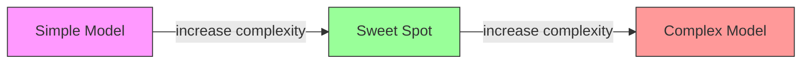
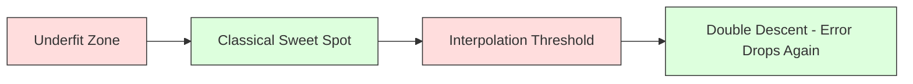
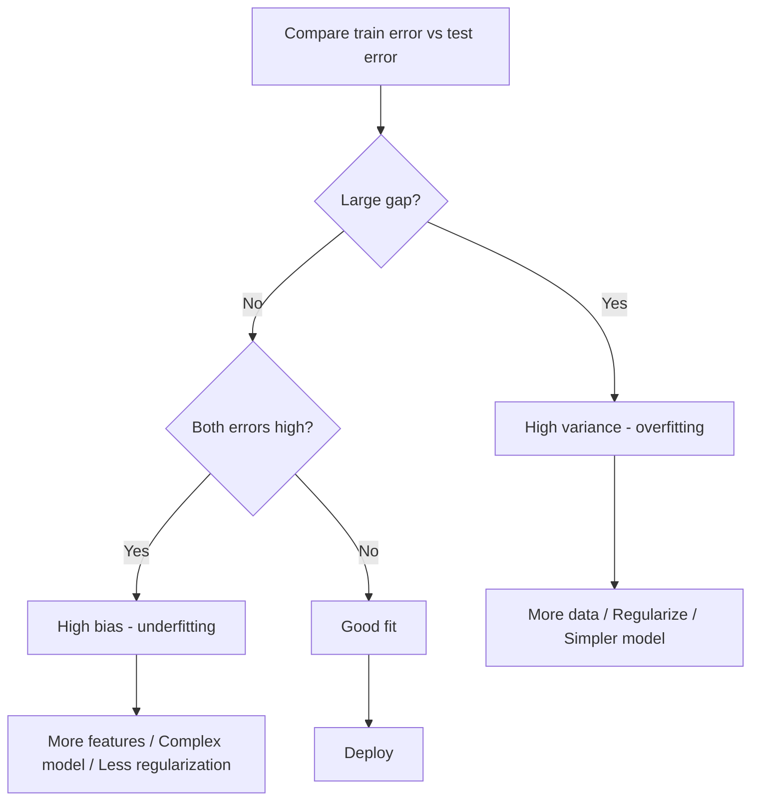
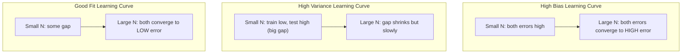
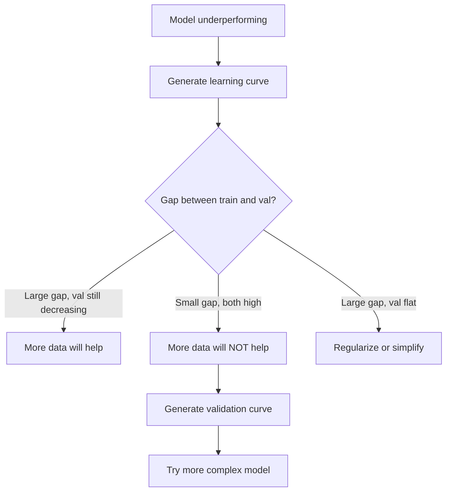

# Bias-Variance Tradeoff

> Mọi sai số của mô hình đều đến từ một trong ba nguồn: bias (độ chệch), variance (độ phương sai) hoặc noise (nhiễu). Bạn chỉ có thể kiểm soát hai yếu tố đầu tiên.

**Type:** Learn
**Language:** Python
**Prerequisites:** Phase 2, Lessons 01-09 (ML basics, regression, classification, evaluation)
**Time:** ~75 phút

## Mục tiêu học tập

- Suy luận ra công thức phân rã bias-variance của sai số dự đoán kỳ vọng và giải thích vai trò của nhiễu không thể loại bỏ (irreducible noise)
- Chẩn đoán xem mô hình đang bị bias cao hay variance cao dựa trên các mô hình sai số huấn luyện và kiểm thử
- Giải thích cách các kỹ thuật regularization (L1, L2, dropout, early stopping) đánh đổi bias lấy variance
- Thực hiện các thí nghiệm trực quan hóa sự đánh đổi bias-variance trên các mô hình có độ phức tạp tăng dần

## Vấn đề

Bạn đã huấn luyện một mô hình. Nó có sai số trên dữ liệu kiểm thử. Sai số đó đến từ đâu?

Nếu mô hình của bạn quá đơn giản (hồi quy tuyến tính trên tập dữ liệu có đường cong), nó sẽ liên tục bỏ lỡ quy luật thực sự. Đó là bias. Nếu mô hình của bạn quá phức tạp (đa thức bậc 20 trên 15 điểm dữ liệu), nó sẽ khớp hoàn hảo với dữ liệu huấn luyện nhưng đưa ra các dự đoán hoàn toàn khác biệt trên dữ liệu mới. Đó là variance.

Bạn không thể tối thiểu hóa cả hai cùng lúc với một dung lượng mô hình cố định. Giảm bias thì variance tăng. Giảm variance thì bias tăng. Hiểu được sự đánh đổi này là kỹ năng chẩn đoán hữu ích nhất trong machine learning. Nó cho bạn biết liệu có nên làm cho mô hình phức tạp hơn hay đơn giản hơn, liệu có nên thu thập thêm dữ liệu hay kỹ thuật đặc trưng (feature engineering) tốt hơn, liệu có nên tăng hay giảm regularization.

## Khái niệm

### Bias: Sai số hệ thống

Bias đo lường mức độ chênh lệch giữa dự đoán trung bình của mô hình và giá trị thực tế. Nếu bạn huấn luyện cùng một mô hình trên nhiều tập huấn luyện khác nhau được rút ra từ cùng một phân phối và lấy trung bình các dự đoán, bias chính là khoảng cách giữa giá trị trung bình đó và giá trị thực.

Bias cao nghĩa là mô hình quá cứng nhắc để nắm bắt quy luật thực tế. Một đường thẳng khớp với một parabol sẽ luôn bỏ lỡ đường cong, bất kể bạn cung cấp cho nó bao nhiêu dữ liệu. Đây là hiện tượng underfitting (thiếu khớp).

```
High bias (underfitting):
  Model always predicts roughly the same wrong thing.
  Training error: HIGH
  Test error: HIGH
  Gap between them: SMALL
```

### Variance: Độ nhạy với dữ liệu huấn luyện

Variance đo lường mức độ thay đổi của các dự đoán khi bạn huấn luyện trên các tập dữ liệu con khác nhau. Nếu những thay đổi nhỏ trong tập huấn luyện gây ra những thay đổi lớn trong mô hình, thì variance đang cao.

Variance cao nghĩa là mô hình đang khớp với nhiễu trong dữ liệu huấn luyện, chứ không phải tín hiệu thực sự. Một đa thức bậc 20 sẽ đi qua mọi điểm huấn luyện nhưng dao động mạnh giữa chúng. Đây là hiện tượng overfitting (quá khớp).

```
High variance (overfitting):
  Model fits training data perfectly but fails on new data.
  Training error: LOW
  Test error: HIGH
  Gap between them: LARGE
```

### Phân rã sai số

Đối với bất kỳ điểm x nào, sai số dự đoán kỳ vọng dưới hàm mất mát bình phương (squared loss) phân rã chính xác như sau:

```
Expected Error = Bias^2 + Variance + Irreducible Noise

where:
  Bias^2   = (E[f_hat(x)] - f(x))^2
  Variance = E[(f_hat(x) - E[f_hat(x)])^2]
  Noise    = E[(y - f(x))^2]             (sigma^2)
```

- `f(x)` là hàm thực tế
- `f_hat(x)` là dự đoán của mô hình
- `E[...]` là kỳ vọng trên các tập huấn luyện khác nhau
- `y` là nhãn quan sát được (hàm thực tế cộng với nhiễu)

Thành phần nhiễu là không thể loại bỏ. Không mô hình nào có thể làm tốt hơn sigma^2 trên dữ liệu nhiễu. Công việc của bạn là tìm sự cân bằng phù hợp giữa bias^2 và variance.

### Độ phức tạp của mô hình vs Sai số



Đường cong hình chữ U kinh điển:

| Độ phức tạp | Bias | Variance | Tổng sai số |
|-----------|------|----------|-------------|
| Quá thấp | CAO | THẤP | CAO (underfitting) |
| Vừa đủ | TRUNG BÌNH | TRUNG BÌNH | THẤP NHẤT |
| Quá cao | THẤP | CAO | CAO (overfitting) |

### Regularization như một công cụ kiểm soát Bias-Variance

Regularization cố tình làm tăng bias để giảm variance. Nó ràng buộc mô hình để mô hình không thể chạy theo nhiễu.

- **L2 (Ridge):** Thu nhỏ tất cả các trọng số về gần bằng 0. Giữ lại tất cả các đặc trưng nhưng giảm ảnh hưởng của chúng.
- **L1 (Lasso):** Đẩy một số trọng số về đúng bằng 0. Thực hiện chọn lọc đặc trưng.
- **Dropout:** Tắt ngẫu nhiên các neuron trong quá trình huấn luyện. Ép buộc các biểu diễn dư thừa.
- **Early stopping:** Dừng huấn luyện trước khi mô hình khớp hoàn toàn với dữ liệu huấn luyện.

Cường độ regularization (lambda, tỷ lệ dropout, số epoch) kiểm soát trực tiếp vị trí của bạn trên đường cong bias-variance. Regularization mạnh hơn nghĩa là bias cao hơn, variance thấp hơn.

### Double Descent: Góc nhìn hiện đại

Lý thuyết cổ điển cho rằng: sau điểm tối ưu, độ phức tạp tăng thêm luôn gây hại. Nhưng nghiên cứu từ năm 2019 đã cho thấy một điều bất ngờ. Nếu bạn tiếp tục tăng dung lượng mô hình vượt xa ngưỡng nội suy (interpolation threshold - nơi mô hình có đủ tham số để khớp hoàn hảo với dữ liệu huấn luyện), sai số kiểm thử có thể giảm trở lại.



Hiện tượng "double descent" này giải thích tại sao các mạng thần kinh có quá nhiều tham số (nhiều hơn đáng kể so với số lượng ví dụ huấn luyện) vẫn có khả năng tổng quát hóa tốt. Sự đánh đổi bias-variance cổ điển không sai, nhưng nó chưa đầy đủ cho chế độ hiện đại.

Các quan sát chính về double descent:
- Nó xảy ra trong các mô hình tuyến tính, cây quyết định và mạng thần kinh
- Nhiều dữ liệu hơn thực sự có thể gây hại trong vùng nội suy (double descent theo mẫu)
- Nhiều epoch huấn luyện hơn cũng có thể gây ra hiện tượng này (double descent theo epoch)
- Regularization làm phẳng đỉnh nhưng không loại bỏ nó

Tại sao điều này xảy ra? Tại ngưỡng nội suy, mô hình vừa đủ dung lượng để khớp tất cả các điểm huấn luyện. Nó bị ép vào một giải pháp rất cụ thể đi qua mọi điểm, và các nhiễu động nhỏ trong dữ liệu gây ra thay đổi lớn trong kết quả khớp. Đây là nơi variance đạt đỉnh. Vượt qua ngưỡng này, mô hình có nhiều giải pháp khả thi khớp hoàn hảo với dữ liệu. Thuật toán học (ví dụ: gradient descent với regularization ngầm định) có xu hướng chọn giải pháp đơn giản nhất trong số đó. Bias ngầm định hướng tới các giải pháp đơn giản này chính là lý do tại sao các mô hình có quá nhiều tham số lại có khả năng tổng quát hóa.

| Chế độ | Tham số vs Mẫu | Hành vi |
|--------|----------------------|----------|
| Underparameterized | p << n | Áp dụng đánh đổi cổ điển |
| Ngưỡng nội suy | p ~ n | Variance đạt đỉnh, sai số kiểm thử tăng vọt |
| Overparameterized | p >> n | Regularization ngầm định phát huy tác dụng, sai số kiểm thử giảm |

Về mặt thực tế: nếu bạn đang sử dụng mạng thần kinh hoặc các ensemble cây lớn, đừng dừng lại ở ngưỡng nội suy. Hãy giữ nó ở mức thấp hơn hẳn (với regularization tường minh) hoặc vượt xa nó. Vị trí tệ nhất là ngay tại ngưỡng.

### Chẩn đoán mô hình của bạn



| Triệu chứng | Chẩn đoán | Cách khắc phục |
|---------|-----------|-----|
| Sai số huấn luyện cao, sai số kiểm thử cao | Bias | Thêm đặc trưng, mô hình phức tạp hơn, giảm regularization |
| Sai số huấn luyện thấp, sai số kiểm thử cao | Variance | Thêm dữ liệu, regularization, mô hình đơn giản hơn, dropout |
| Sai số huấn luyện thấp, sai số kiểm thử thấp | Khớp tốt | Triển khai |
| Sai số huấn luyện giảm, sai số kiểm thử tăng | Đang bị overfitting | Early stopping |

### Chiến lược thực tế

**Khi bias là vấn đề:**
- Thêm các đặc trưng đa thức hoặc tương tác
- Sử dụng mô hình linh hoạt hơn (tree ensemble thay vì tuyến tính)
- Giảm cường độ regularization
- Huấn luyện lâu hơn (nếu chưa hội tụ)

**Khi variance là vấn đề:**
- Thu thập thêm dữ liệu huấn luyện
- Sử dụng bagging (random forests)
- Tăng regularization (lambda cao hơn, dropout nhiều hơn)
- Chọn lọc đặc trưng (loại bỏ các đặc trưng nhiễu)
- Sử dụng cross-validation để phát hiện sớm

### Các phương pháp Ensemble và giảm Variance

Các phương pháp ensemble là công cụ thực tế nhất để chống lại variance.

**Bagging (Bootstrap Aggregating)** huấn luyện nhiều mô hình trên các mẫu bootstrap khác nhau của dữ liệu huấn luyện, sau đó lấy trung bình các dự đoán của chúng. Mỗi mô hình riêng lẻ có variance cao, nhưng giá trị trung bình lại có variance thấp hơn nhiều. Random forests là bagging áp dụng cho cây quyết định.

Tại sao nó hoạt động về mặt toán học: nếu bạn lấy trung bình N dự đoán độc lập, mỗi dự đoán có variance sigma^2, thì variance của giá trị trung bình là sigma^2 / N. Các mô hình không thực sự độc lập (tất cả đều thấy dữ liệu tương tự nhau), vì vậy mức giảm ít hơn 1/N, nhưng vẫn rất đáng kể.

**Boosting** giảm bias bằng cách xây dựng các mô hình tuần tự, trong đó mỗi mô hình mới tập trung vào các sai số của ensemble hiện tại. Gradient boosting và AdaBoost là những ví dụ chính. Boosting có thể bị overfitting nếu bạn thêm quá nhiều mô hình, vì vậy bạn cần early stopping hoặc regularization.

| Phương pháp | Tác động chính | Thay đổi Bias | Thay đổi Variance |
|--------|---------------|-------------|-----------------|
| Bagging | Giảm variance | Không đổi | Giảm |
| Boosting | Giảm bias | Giảm | Có thể tăng |
| Stacking | Giảm cả hai | Phụ thuộc vào meta-learner | Phụ thuộc vào các mô hình cơ sở |
| Dropout | Bagging ngầm định | Tăng nhẹ | Giảm |

**Quy tắc thực tế:** nếu mô hình cơ sở của bạn có variance cao (cây sâu, đa thức bậc cao), hãy sử dụng bagging. Nếu mô hình cơ sở của bạn có bias cao (cây nông, mô hình tuyến tính đơn giản), hãy sử dụng boosting.

### Đường cong học tập (Learning Curves)

Đường cong học tập vẽ sai số huấn luyện và kiểm thử dưới dạng hàm số của kích thước tập huấn luyện. Chúng là công cụ chẩn đoán thực tế nhất mà bạn có. Không giống như so sánh train/test đơn lẻ, đường cong học tập cho bạn thấy quỹ đạo của mô hình và cho biết liệu có thêm dữ liệu thì có ích hay không.



Cách đọc chúng:

| Kịch bản | Sai số huấn luyện | Sai số kiểm thử | Khoảng cách | Ý nghĩa | Cần làm gì |
|----------|---------------|-----------------|-----|---------------|------------|
| Bias cao | Cao | Cao | Nhỏ | Mô hình không nắm bắt được quy luật | Thêm đặc trưng, mô hình phức tạp hơn, giảm regularization |
| Variance cao | Thấp | Cao | Lớn | Mô hình ghi nhớ dữ liệu huấn luyện | Thêm dữ liệu, regularization, mô hình đơn giản hơn |
| Khớp tốt | Trung bình | Trung bình | Nhỏ | Mô hình tổng quát hóa tốt | Triển khai |
| Variance cao, đang cải thiện | Thấp | Giảm khi thêm dữ liệu | Đang thu hẹp | Vấn đề variance mà dữ liệu có thể giải quyết | Thu thập thêm dữ liệu |
| Bias cao, phẳng | Cao | Cao và phẳng | Nhỏ và phẳng | Thêm dữ liệu KHÔNG giúp ích | Thay đổi kiến trúc mô hình |

Thông tin quan trọng: nếu cả hai đường cong đã đạt trạng thái bão hòa (plateau) và khoảng cách nhỏ nhưng cả hai sai số đều cao, thêm dữ liệu là vô ích. Bạn cần một mô hình tốt hơn. Nếu khoảng cách lớn và vẫn đang thu hẹp, thêm dữ liệu sẽ giúp ích.

### Cách tạo đường cong học tập

Có hai cách tiếp cận:

**Cách 1: Thay đổi kích thước tập huấn luyện, cố định mô hình.** Giữ nguyên mô hình và các siêu tham số. Huấn luyện trên các tập con ngày càng lớn của dữ liệu huấn luyện. Đo sai số huấn luyện và kiểm thử tại mỗi kích thước. Đây là đường cong học tập tiêu chuẩn.

**Cách 2: Thay đổi độ phức tạp mô hình, cố định dữ liệu.** Giữ nguyên dữ liệu. Quét qua một tham số độ phức tạp (bậc đa thức, độ sâu cây, số lớp). Đo sai số huấn luyện và kiểm thử tại mỗi độ phức tạp. Đây là đường cong kiểm thử (validation curve) và cho thấy sự đánh đổi bias-variance trực tiếp.

Cả hai cách tiếp cận đều bổ sung cho nhau. Cách thứ nhất cho bạn biết liệu thêm dữ liệu có giúp ích không. Cách thứ hai cho bạn biết liệu một mô hình khác có giúp ích không. Hãy chạy cả hai trước khi đưa ra quyết định cho bước tiếp theo.



```figure
bias-variance
```

## Xây dựng

Mã nguồn trong `code/bias_variance.py` chạy thí nghiệm phân rã bias-variance đầy đủ. Dưới đây là cách tiếp cận từng bước.

### Bước 1: Tạo dữ liệu tổng hợp từ một hàm đã biết

Chúng ta sử dụng `f(x) = sin(1.5x) + 0.5x` với nhiễu Gaussian. Biết hàm thực tế cho phép chúng ta tính toán chính xác bias và variance.

```python
def true_function(x):
    return np.sin(1.5 * x) + 0.5 * x

def generate_data(n_samples=30, noise_std=0.5, x_range=(-3, 3), seed=None):
    rng = np.random.RandomState(seed)
    x = rng.uniform(x_range[0], x_range[1], n_samples)
    y = true_function(x) + rng.normal(0, noise_std, n_samples)
    return x, y
```

### Bước 2: Lấy mẫu Bootstrap và khớp đa thức

Đối với mỗi bậc đa thức, chúng ta rút ra nhiều tập huấn luyện bootstrap, khớp đa thức và ghi lại các dự đoán trên một lưới kiểm thử cố định. Điều này cung cấp cho chúng ta một phân phối các dự đoán tại mỗi điểm kiểm thử.

```python
def fit_polynomial(x_train, y_train, degree, lam=0.0):
    X = np.column_stack([x_train ** d for d in range(degree + 1)])
    if lam > 0:
        penalty = lam * np.eye(X.shape[1])
        penalty[0, 0] = 0
        w = np.linalg.solve(X.T @ X + penalty, X.T @ y_train)
    else:
        w = np.linalg.lstsq(X, y_train, rcond=None)[0]
    return w
```

Chúng ta khớp trên 200 mẫu bootstrap khác nhau. Mỗi mẫu bootstrap được rút ra từ cùng một phân phối cơ sở nhưng chứa các điểm khác nhau.

### Bước 3: Tính toán phân rã Bias^2, Variance

Với 200 tập dự đoán tại mỗi điểm kiểm thử, chúng ta có thể tính toán sự phân rã trực tiếp từ định nghĩa:

```python
mean_pred = predictions.mean(axis=0)
bias_sq = np.mean((mean_pred - y_true) ** 2)
variance = np.mean(predictions.var(axis=0))
total_error = np.mean(np.mean((predictions - y_true) ** 2, axis=1))
```

- `mean_pred` là E[f_hat(x)] được ước tính từ các mẫu bootstrap
- `bias_sq` là khoảng cách bình phương giữa dự đoán trung bình và sự thật
- `variance` là độ lan tỏa trung bình của các dự đoán qua các mẫu bootstrap
- `total_error` sẽ xấp xỉ bằng bias^2 + variance + noise

### Bước 4: Đường cong học tập

Đường cong học tập quét kích thước tập huấn luyện trong khi giữ độ phức tạp mô hình cố định. Chúng cho thấy liệu mô hình của bạn bị giới hạn bởi dữ liệu hay giới hạn bởi dung lượng.

```python
def demo_learning_curves():
    sizes = [10, 15, 20, 30, 50, 75, 100, 150, 200, 300]
    degree = 5

    for n in sizes:
        train_errors = []
        test_errors = []
        for seed in range(50):
            x_train, y_train = generate_data(n_samples=n, seed=seed * 100)
            w = fit_polynomial(x_train, y_train, degree)
            train_pred = predict_polynomial(x_train, w)
            train_mse = np.mean((train_pred - y_train) ** 2)
            test_pred = predict_polynomial(x_test, w)
            test_mse = np.mean((test_pred - y_test) ** 2)
            train_errors.append(train_mse)
            test_errors.append(test_mse)
        # Average over runs gives the learning curve point
```

Đối với một mô hình có variance cao (bậc 5 với ít dữ liệu), bạn thấy:
- Sai số huấn luyện bắt đầu thấp và tăng lên khi nhiều dữ liệu hơn làm cho việc ghi nhớ trở nên khó khăn hơn
- Sai số kiểm thử bắt đầu cao và giảm xuống khi mô hình nhận được nhiều tín hiệu hơn
- Khoảng cách thu hẹp khi có nhiều dữ liệu hơn

Đối với một mô hình có bias cao (bậc 1), cả hai sai số hội tụ nhanh chóng về cùng một giá trị cao và thêm dữ liệu không giúp ích gì.

### Bước 5: Quét Regularization

Mã nguồn cũng bao gồm `demo_regularization_sweep()`, cố định một đa thức bậc cao (bậc 15) và quét cường độ regularization Ridge từ 0.001 đến 100. Điều này cho thấy sự đánh đổi bias-variance từ một góc độ khác: thay vì thay đổi độ phức tạp mô hình, chúng ta thay đổi cường độ ràng buộc.

```python
def demo_regularization_sweep():
    alphas = [0.001, 0.005, 0.01, 0.05, 0.1, 0.5, 1.0, 5.0, 10.0, 50.0, 100.0]
    for alpha in alphas:
        results = bias_variance_decomposition([15], lam=alpha)
        r = results[15]
        print(f"alpha={alpha:.3f}  bias={r['bias_sq']:.4f}  var={r['variance']:.4f}")
```

Tại alpha thấp, đa thức bậc 15 gần như không bị ràng buộc. Variance chiếm ưu thế vì mô hình chạy theo nhiễu trong mỗi mẫu bootstrap. Tại alpha cao, hình phạt quá mạnh khiến mô hình trở thành một hàm gần như hằng số. Bias chiếm ưu thế. Alpha tối ưu nằm giữa các thái cực này.

Đây là cùng một đường cong chữ U từ việc thay đổi bậc đa thức, nhưng được kiểm soát bởi một núm vặn liên tục thay vì rời rạc. Trong thực tế, regularization là cách ưu tiên để kiểm soát sự đánh đổi vì nó cho phép kiểm soát chi tiết mà không cần thay đổi tập đặc trưng.

## Sử dụng

sklearn cung cấp `learning_curve` và `validation_curve` để tự động hóa các chẩn đoán này mà không cần viết các vòng lặp bootstrap.

### Validation Curve: Quét độ phức tạp mô hình

```python
from sklearn.model_selection import validation_curve
from sklearn.pipeline import make_pipeline
from sklearn.preprocessing import PolynomialFeatures
from sklearn.linear_model import Ridge

degrees = list(range(1, 16))
train_scores_all = []
val_scores_all = []

for d in degrees:
    pipe = make_pipeline(PolynomialFeatures(d), Ridge(alpha=0.01))
    train_scores, val_scores = validation_curve(
        pipe, X, y, param_name="polynomialfeatures__degree",
        param_range=[d], cv=5, scoring="neg_mean_squared_error"
    )
    train_scores_all.append(-train_scores.mean())
    val_scores_all.append(-val_scores.mean())
```

Điều này cung cấp cho bạn đường cong đánh đổi bias-variance trực tiếp. Nơi điểm số kiểm thử tệ nhất so với điểm số huấn luyện, variance chiếm ưu thế. Nơi cả hai đều tệ, bias chiếm ưu thế.

### Learning Curve: Quét kích thước tập huấn luyện

```python
from sklearn.model_selection import learning_curve

pipe = make_pipeline(PolynomialFeatures(5), Ridge(alpha=0.01))
train_sizes, train_scores, val_scores = learning_curve(
    pipe, X, y, train_sizes=np.linspace(0.1, 1.0, 10),
    cv=5, scoring="neg_mean_squared_error"
)
train_mse = -train_scores.mean(axis=1)
val_mse = -val_scores.mean(axis=1)
```

Vẽ `train_mse` và `val_mse` so với `train_sizes`. Hình dạng của chúng cho bạn biết mọi thứ về mô hình của bạn.

### Cross-Validation với quét Regularization

```python
from sklearn.model_selection import cross_val_score

alphas = [0.001, 0.01, 0.1, 1.0, 10.0, 100.0]
for alpha in alphas:
    pipe = make_pipeline(PolynomialFeatures(10), Ridge(alpha=alpha))
    scores = cross_val_score(pipe, X, y, cv=5, scoring="neg_mean_squared_error")
    print(f"alpha={alpha:>7.3f}  MSE={-scores.mean():.4f} +/- {scores.std():.4f}")
```

Điều này quét cường độ regularization cho một độ phức tạp mô hình cố định. Bạn sẽ thấy cùng một sự đánh đổi bias-variance: alpha thấp nghĩa là variance cao, alpha cao nghĩa là bias cao.

### Tổng hợp lại: Quy trình chẩn đoán hoàn chỉnh

Trong thực tế, bạn chạy các chẩn đoán này theo trình tự:

1. Huấn luyện mô hình của bạn. Tính sai số huấn luyện và kiểm thử.
2. Nếu cả hai đều cao: bạn có vấn đề về bias. Chuyển sang bước 4.
3. Nếu huấn luyện thấp nhưng kiểm thử cao: bạn có vấn đề về variance. Tạo đường cong học tập để xem liệu thêm dữ liệu có giúp ích không. Nếu không, hãy regularize.
4. Tạo đường cong kiểm thử quét tham số độ phức tạp chính của bạn. Tìm điểm tối ưu.
5. Tại điểm tối ưu, tạo đường cong học tập. Nếu khoảng cách vẫn lớn, bạn cần thêm dữ liệu hoặc regularization.
6. Thử Ridge/Lasso với các giá trị alpha khác nhau bằng `cross_val_score`. Chọn alpha nơi sai số cross-validated thấp nhất.

Việc này mất 10-15 phút tính toán cho hầu hết các tập dữ liệu dạng bảng và tiết kiệm hàng giờ đoán mò.

## Triển khai

Bài học này tạo ra: `outputs/prompt-model-diagnostics.md`

## Bài tập

1. Chạy phân rã với `noise_std=0` (không nhiễu). Điều gì xảy ra với thành phần sai số không thể loại bỏ? Độ phức tạp tối ưu có thay đổi không?

2. Tăng kích thước tập huấn luyện từ 30 lên 300. Điều này ảnh hưởng thế nào đến thành phần variance? Bậc đa thức tối ưu có thay đổi không?

3. Thêm L2 regularization (Ridge regression) vào thí nghiệm. Đối với một đa thức bậc cao cố định (bậc 15), quét lambda từ 0 đến 100. Vẽ bias^2 và variance dưới dạng hàm số của lambda.

4. Thay đổi hàm thực tế từ đa thức sang `sin(x)`. Phân rã bias-variance thay đổi như thế nào? Liệu vẫn còn một bậc tối ưu rõ ràng không?

5. Triển khai một wrapper bootstrap aggregating (bagging) đơn giản: huấn luyện 10 mô hình trên các mẫu bootstrap và lấy trung bình các dự đoán. Chứng minh rằng điều này làm giảm variance mà không làm tăng nhiều bias.

## Thuật ngữ chính

| Thuật ngữ | Mọi người nói | Ý nghĩa thực sự |
|------|----------------|----------------------|
| Bias | "Mô hình quá đơn giản" | Sai số hệ thống từ các giả định sai. Khoảng cách giữa dự đoán trung bình của mô hình và sự thật. |
| Variance | "Mô hình đang overfitting" | Sai số từ độ nhạy với dữ liệu huấn luyện. Mức độ thay đổi của dự đoán qua các tập huấn luyện khác nhau. |
| Irreducible error | "Nhiễu trong dữ liệu" | Sai số từ tính ngẫu nhiên trong quá trình tạo dữ liệu thực. Không mô hình nào có thể loại bỏ nó. |
| Underfitting | "Chưa học đủ" | Mô hình có bias cao. Nó bỏ lỡ quy luật thực tế ngay cả trên dữ liệu huấn luyện. |
| Overfitting | "Ghi nhớ dữ liệu" | Mô hình có variance cao. Nó khớp với nhiễu trong dữ liệu huấn luyện mà không tổng quát hóa được. |
| Regularization | "Ràng buộc mô hình" | Thêm một hình phạt để giảm độ phức tạp mô hình, đánh đổi bias lấy variance thấp hơn. |
| Double descent | "Nhiều tham số hơn có thể giúp" | Sai số kiểm thử giảm trở lại khi dung lượng mô hình vượt xa ngưỡng nội suy. |
| Model complexity | "Mô hình linh hoạt đến mức nào" | Dung lượng của mô hình để khớp với các quy luật tùy ý. Được kiểm soát bởi kiến trúc, đặc trưng hoặc regularization. |

## Đọc thêm

- [Hastie, Tibshirani, Friedman: Elements of Statistical Learning, Ch. 7](https://hastie.su.domains/ElemStatLearn/) -- tài liệu chuyên sâu về phân rã bias-variance
- [Belkin et al., Reconciling modern machine learning practice and the bias-variance trade-off (2019)](https://arxiv.org/abs/1812.11118) -- bài báo về double descent
- [Nakkiran et al., Deep Double Descent (2019)](https://arxiv.org/abs/1912.02292) -- double descent theo epoch và theo mẫu
- [Scott Fortmann-Roe: Understanding the Bias-Variance Tradeoff](http://scott.fortmann-roe.com/docs/BiasVariance.html) -- giải thích trực quan rõ ràng