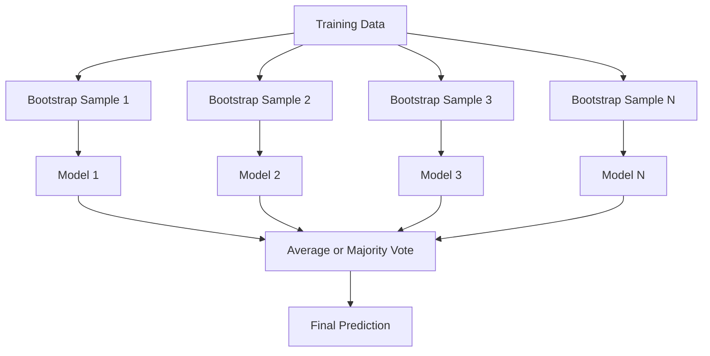
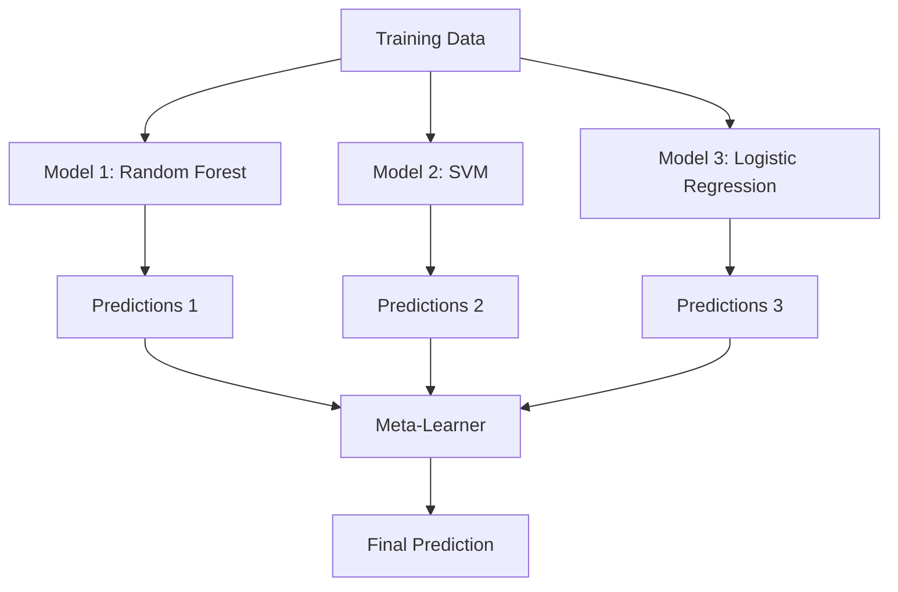

# Ensemble Methods

> Một nhóm các weak learner, khi được kết hợp đúng cách, sẽ trở thành một strong learner. Đây không phải là một phép ẩn dụ. Đây là một định lý.

**Type:** Build
**Language:** Python
**Prerequisites:** Phase 2, Lesson 10 (Bias-Variance Tradeoff)
**Time:** ~120 phút

## Mục tiêu học tập

- Triển khai AdaBoost và gradient boosting từ đầu và giải thích cách boosting giảm bias một cách tuần tự.
- Xây dựng một bagging ensemble và chứng minh cách việc lấy trung bình các mô hình không tương quan giúp giảm variance mà không làm tăng bias.
- So sánh bagging, boosting và stacking dựa trên thành phần lỗi mà mỗi phương pháp nhắm tới.
- Đánh giá sự đa dạng của ensemble và giải thích tại sao độ chính xác của đa số phiếu bầu (majority voting) lại cải thiện khi có nhiều weak learner độc lập hơn.

## Vấn đề

Một cây quyết định (decision tree) đơn lẻ thì huấn luyện nhanh và dễ diễn giải, nhưng nó lại dễ bị overfit. Một mô hình tuyến tính đơn lẻ lại bị underfit trên các ranh giới phức tạp. Bạn có thể mất nhiều ngày để thiết kế kiến trúc mô hình hoàn hảo, hoặc bạn có thể kết hợp một loạt các mô hình chưa hoàn hảo để đạt được kết quả tốt hơn bất kỳ mô hình đơn lẻ nào.

Các phương pháp ensemble thực hiện chính xác điều này. Đây là kỹ thuật đáng tin cậy nhất để giành chiến thắng trong các cuộc thi Kaggle trên dữ liệu dạng bảng, chúng vận hành hầu hết các hệ thống ML trong thực tế và minh họa rõ nét sự đánh đổi bias-variance. Bagging giúp giảm variance. Boosting giúp giảm bias. Stacking học cách tin tưởng vào mô hình nào trên các đầu vào cụ thể.

## Khái niệm

### Tại sao Ensembles hoạt động

Giả sử bạn có N bộ phân loại độc lập, mỗi bộ có độ chính xác p > 0.5. Đa số phiếu bầu (majority vote) có độ chính xác:

```
P(majority correct) = sum over k > N/2 of C(N,k) * p^k * (1-p)^(N-k)
```

Với 21 bộ phân loại, mỗi bộ có độ chính xác 60%, độ chính xác của đa số phiếu bầu là khoảng 74%. Với 101 bộ phân loại, con số này tăng lên 84%. Các lỗi sẽ triệt tiêu lẫn nhau khi các mô hình mắc những sai lầm khác nhau.

Yêu cầu then chốt là **sự đa dạng (diversity)**. Nếu tất cả các mô hình đều mắc cùng một lỗi, việc kết hợp chúng sẽ không mang lại lợi ích gì. Ensembles hoạt động vì chúng tạo ra các mô hình đa dạng thông qua:

- Các tập con huấn luyện khác nhau (bagging)
- Các tập con đặc trưng khác nhau (random forests)
- Sửa lỗi tuần tự (boosting)
- Các họ mô hình khác nhau (stacking)

### Bagging (Bootstrap Aggregating)

Bagging tạo ra sự đa dạng bằng cách huấn luyện mỗi mô hình trên một mẫu bootstrap khác nhau của dữ liệu huấn luyện.



Một mẫu bootstrap được lấy ra có hoàn lại từ dữ liệu gốc, với cùng kích thước với dữ liệu gốc. Khoảng 63.2% các mẫu duy nhất xuất hiện trong mỗi bootstrap. 36.8% còn lại (các mẫu out-of-bag) cung cấp một tập validation miễn phí.

Bagging giúp giảm variance mà không làm tăng đáng kể bias. Mỗi cây đơn lẻ bị overfit với mẫu bootstrap của nó, nhưng sự overfit này khác nhau ở mỗi cây, vì vậy việc lấy trung bình sẽ triệt tiêu nhiễu.

**Random Forests** là bagging với một điểm khác biệt: tại mỗi lần phân tách (split), chỉ một tập con ngẫu nhiên các đặc trưng được xem xét. Điều này buộc các cây phải đa dạng hơn nữa. Số lượng đặc trưng ứng viên điển hình là `sqrt(n_features)` cho phân loại và `n_features / 3` cho hồi quy.

### Boosting (Sửa lỗi tuần tự)

Boosting huấn luyện các mô hình một cách tuần tự. Mỗi mô hình mới tập trung vào các ví dụ mà các mô hình trước đó đã dự đoán sai.


Boosting giúp giảm bias. Mỗi mô hình mới sửa chữa các lỗi hệ thống của ensemble tính đến thời điểm đó. Dự đoán cuối cùng là tổng có trọng số của tất cả các mô hình, trong đó các mô hình tốt hơn sẽ nhận được trọng số cao hơn.

Sự đánh đổi: boosting có thể bị overfit nếu bạn chạy quá nhiều vòng, vì nó liên tục cố gắng khớp các ví dụ khó hơn, một số trong đó có thể là nhiễu.

### AdaBoost

AdaBoost (Adaptive Boosting) là thuật toán boosting thực tế đầu tiên. Nó hoạt động với bất kỳ base learner nào, thường là các decision stump (cây có độ sâu bằng 1).

Thuật toán:

```
1. Initialize sample weights: w_i = 1/N for all i

2. For t = 1 to T:
   a. Train weak learner h_t on weighted data
   b. Compute weighted error:
      err_t = sum(w_i * I(h_t(x_i) != y_i)) / sum(w_i)
   c. Compute model weight:
      alpha_t = 0.5 * ln((1 - err_t) / err_t)
   d. Update sample weights:
      w_i = w_i * exp(-alpha_t * y_i * h_t(x_i))
   e. Normalize weights to sum to 1

3. Final prediction: H(x) = sign(sum(alpha_t * h_t(x)))
```

Các mô hình có lỗi thấp hơn sẽ nhận được alpha cao hơn. Các mẫu bị phân loại sai sẽ nhận được trọng số cao hơn để mô hình tiếp theo tập trung vào chúng.

### Gradient Boosting

Gradient boosting tổng quát hóa boosting cho các hàm mất mát (loss function) tùy ý. Thay vì gán lại trọng số cho các mẫu, nó khớp mỗi mô hình mới với các phần dư (gradient âm của hàm mất mát) của ensemble hiện tại.

```
1. Initialize: F_0(x) = argmin_c sum(L(y_i, c))

2. For t = 1 to T:
   a. Compute pseudo-residuals:
      r_i = -dL(y_i, F_{t-1}(x_i)) / dF_{t-1}(x_i)
   b. Fit a tree h_t to the residuals r_i
   c. Find optimal step size:
      gamma_t = argmin_gamma sum(L(y_i, F_{t-1}(x_i) + gamma * h_t(x_i)))
   d. Update:
      F_t(x) = F_{t-1}(x) + learning_rate * gamma_t * h_t(x)

3. Final prediction: F_T(x)
```

Đối với hàm mất mát bình phương sai số, các pseudo-residual chính là các phần dư thực tế: `r_i = y_i - F_{t-1}(x_i)`. Mỗi cây thực sự khớp với các lỗi của ensemble trước đó.

Tốc độ học (learning rate hay shrinkage) kiểm soát mức độ đóng góp của mỗi cây. Tốc độ học nhỏ hơn đòi hỏi nhiều cây hơn nhưng khả năng tổng quát hóa tốt hơn. Các giá trị điển hình: 0.01 đến 0.3.

### XGBoost: Tại sao nó thống trị dữ liệu dạng bảng

XGBoost (eXtreme Gradient Boosting) là gradient boosting với các tối ưu hóa kỹ thuật giúp nó nhanh, chính xác và chống lại việc overfit:

- **Mục tiêu có điều chuẩn (Regularized objective):** Các hình phạt L1 và L2 trên trọng số của lá ngăn các cây đơn lẻ trở nên quá tự tin.
- **Xấp xỉ bậc hai:** Sử dụng cả đạo hàm bậc nhất và bậc hai của hàm mất mát, giúp đưa ra các quyết định phân tách tốt hơn.
- **Phân tách nhận biết độ thưa (Sparsity-aware splits):** Xử lý các giá trị thiếu một cách tự nhiên bằng cách học hướng tốt nhất cho dữ liệu thiếu tại mỗi lần phân tách.
- **Lấy mẫu cột (Column subsampling):** Giống như random forests, lấy mẫu các đặc trưng tại mỗi lần phân tách để tạo sự đa dạng.
- **Weighted quantile sketch:** Tìm các điểm phân tách cho các đặc trưng liên tục một cách hiệu quả trên dữ liệu phân tán.
- **Cấu trúc khối nhận biết bộ nhớ đệm (Cache-aware block structure):** Bố cục bộ nhớ được tối ưu hóa cho các dòng bộ nhớ đệm CPU.

Đối với dữ liệu dạng bảng, XGBoost (và người kế nhiệm LightGBM) luôn vượt trội hơn các mạng thần kinh. Điều này sẽ không sớm thay đổi. Nếu dữ liệu của bạn nằm trong một bảng với các hàng và cột, hãy bắt đầu với gradient boosting.

### Stacking (Meta-Learning)

Stacking sử dụng các dự đoán của nhiều base model làm đặc trưng cho một meta-learner.



Meta-learner học cách tin tưởng vào base model nào cho các đầu vào nào. Nếu random forest tốt hơn ở một số vùng nhất định và SVM tốt hơn ở những vùng khác, meta-learner sẽ học cách điều hướng phù hợp.

Để tránh rò rỉ dữ liệu (data leakage), các dự đoán của base model phải được tạo ra thông qua cross-validation trên tập huấn luyện. Bạn không bao giờ huấn luyện base model và tạo meta-feature trên cùng một tập dữ liệu.

### Voting

Ensemble đơn giản nhất. Chỉ cần kết hợp các dự đoán trực tiếp.

- **Hard voting:** Đa số phiếu bầu trên các nhãn lớp.
- **Soft voting:** Lấy trung bình các xác suất dự đoán, chọn lớp có xác suất trung bình cao nhất. Thường tốt hơn vì nó sử dụng thông tin về độ tin cậy.

```figure
f3-ensemble-average
```

## Build It

### Bước 1: Decision Stump (Base Learner)

Mã nguồn trong `code/ensembles.py` triển khai mọi thứ từ đầu. Chúng ta bắt đầu với một decision stump: một cây với một lần phân tách duy nhất.

```python
class DecisionStump:
    def __init__(self):
        self.feature_idx = None
        self.threshold = None
        self.polarity = 1
        self.alpha = None

    def fit(self, X, y, weights):
        n_samples, n_features = X.shape
        best_error = float("inf")

        for f in range(n_features):
            thresholds = np.unique(X[:, f])
            for thresh in thresholds:
                for polarity in [1, -1]:
                    pred = np.ones(n_samples)
                    pred[polarity * X[:, f] < polarity * thresh] = -1
                    error = np.sum(weights[pred != y])
                    if error < best_error:
                        best_error = error
                        self.feature_idx = f
                        self.threshold = thresh
                        self.polarity = polarity

    def predict(self, X):
        n = X.shape[0]
        pred = np.ones(n)
        idx = self.polarity * X[:, self.feature_idx] < self.polarity * self.threshold
        pred[idx] = -1
        return pred
```

### Bước 2: AdaBoost từ đầu

```python
class AdaBoostScratch:
    def __init__(self, n_estimators=50):
        self.n_estimators = n_estimators
        self.stumps = []
        self.alphas = []

    def fit(self, X, y):
        n = X.shape[0]
        weights = np.full(n, 1 / n)

        for _ in range(self.n_estimators):
            stump = DecisionStump()
            stump.fit(X, y, weights)
            pred = stump.predict(X)

            err = np.sum(weights[pred != y])
            err = np.clip(err, 1e-10, 1 - 1e-10)

            alpha = 0.5 * np.log((1 - err) / err)
            weights *= np.exp(-alpha * y * pred)
            weights /= weights.sum()

            stump.alpha = alpha
            self.stumps.append(stump)
            self.alphas.append(alpha)

    def predict(self, X):
        total = sum(a * s.predict(X) for a, s in zip(self.alphas, self.stumps))
        return np.sign(total)
```

### Bước 3: Gradient Boosting từ đầu

```python
class GradientBoostingScratch:
    def __init__(self, n_estimators=100, learning_rate=0.1, max_depth=3):
        self.n_estimators = n_estimators
        self.lr = learning_rate
        self.max_depth = max_depth
        self.trees = []
        self.initial_pred = None

    def fit(self, X, y):
        self.initial_pred = np.mean(y)
        current_pred = np.full(len(y), self.initial_pred)

        for _ in range(self.n_estimators):
            residuals = y - current_pred
            tree = SimpleRegressionTree(max_depth=self.max_depth)
            tree.fit(X, residuals)
            update = tree.predict(X)
            current_pred += self.lr * update
            self.trees.append(tree)

    def predict(self, X):
        pred = np.full(X.shape[0], self.initial_pred)
        for tree in self.trees:
            pred += self.lr * tree.predict(X)
        return pred
```

### Bước 4: So sánh với sklearn

Mã nguồn xác minh rằng các triển khai từ đầu của chúng ta tạo ra độ chính xác tương tự như `AdaBoostClassifier` và `GradientBoostingClassifier` của sklearn, đồng thời so sánh tất cả các phương pháp cạnh nhau.

## Use It

### Khi nào nên sử dụng phương pháp nào

| Phương pháp | Giảm | Tốt nhất cho | Cần lưu ý |
|--------|---------|----------|---------------|
| Bagging / Random Forest | Variance | Dữ liệu nhiễu, nhiều đặc trưng | Không giúp ích cho bias |
| AdaBoost | Bias | Dữ liệu sạch, base learner đơn giản | Nhạy cảm với nhiễu và ngoại lệ |
| Gradient Boosting | Bias | Dữ liệu dạng bảng, các cuộc thi | Huấn luyện chậm, dễ overfit nếu không tinh chỉnh |
| XGBoost / LightGBM | Cả hai | ML dạng bảng trong thực tế | Nhiều siêu tham số |
| Stacking | Cả hai | Đạt thêm 1-2% độ chính xác | Phức tạp, rủi ro overfit meta-learner |
| Voting | Variance | Kết hợp nhanh các mô hình đa dạng | Chỉ giúp ích nếu các mô hình đa dạng |

### Stack thực tế cho dữ liệu dạng bảng

Đối với hầu hết các bài toán dự đoán dạng bảng, đây là thứ tự nên thử:

1. **LightGBM hoặc XGBoost** với các tham số mặc định.
2. Tinh chỉnh n_estimators, learning_rate, max_depth, min_child_weight.
3. Nếu bạn cần thêm 0.5% cuối cùng, hãy xây dựng một stacking ensemble với 3-5 mô hình đa dạng.
4. Sử dụng cross-validation trong suốt quá trình.

Các mạng thần kinh trên dữ liệu dạng bảng hầu như luôn tệ hơn gradient boosting, bất chấp các nỗ lực nghiên cứu liên tục. TabNet, NODE và các kiến trúc tương tự đôi khi đạt kết quả ngang bằng nhưng hiếm khi đánh bại được một XGBoost được tinh chỉnh tốt.

## Ship It

Bài học này tạo ra `outputs/prompt-ensemble-selector.md` -- một prompt giúp bạn chọn phương pháp ensemble phù hợp cho một tập dữ liệu nhất định. Hãy mô tả dữ liệu của bạn (kích thước, loại đặc trưng, mức độ nhiễu, sự cân bằng lớp) và bài toán bạn đang giải quyết. Prompt sẽ đi qua một danh sách kiểm tra quyết định, đề xuất một phương pháp, gợi ý các siêu tham số bắt đầu và cảnh báo về các lỗi phổ biến cho phương pháp đó. Đồng thời tạo ra `outputs/skill-ensemble-builder.md` với hướng dẫn lựa chọn đầy đủ.

## Bài tập

1. Sửa đổi triển khai AdaBoost để theo dõi độ chính xác huấn luyện sau mỗi vòng. Vẽ biểu đồ độ chính xác so với số lượng estimator. Khi nào nó hội tụ?

2. Triển khai một random forest từ đầu bằng cách thêm lấy mẫu đặc trưng ngẫu nhiên vào cây hồi quy. Huấn luyện 100 cây với `max_features=sqrt(n_features)` và lấy trung bình các dự đoán. So sánh việc giảm variance với một cây đơn lẻ.

3. Trong triển khai gradient boosting, hãy thêm early stopping: theo dõi loss trên tập validation sau mỗi vòng và dừng lại khi nó không cải thiện trong 10 vòng liên tiếp. Nó thực sự cần bao nhiêu cây?

4. Xây dựng một stacking ensemble với ba base model (logistic regression, decision tree, k-nearest neighbors) và một meta-learner là logistic regression. Sử dụng 5-fold cross-validation để tạo meta-feature. So sánh với từng base model đơn lẻ.

5. Chạy XGBoost trên cùng tập dữ liệu với các tham số mặc định. So sánh độ chính xác của nó với gradient boosting tự triển khai của bạn. Đo thời gian cả hai. Sự khác biệt về tốc độ lớn đến mức nào?

## Thuật ngữ chính

| Thuật ngữ | Cách gọi thông thường | Ý nghĩa thực tế |
|------|----------------|----------------------|
| Bagging | "Huấn luyện trên các tập con ngẫu nhiên" | Bootstrap aggregating: huấn luyện các mô hình trên các mẫu bootstrap, lấy trung bình dự đoán để giảm variance |
| Boosting | "Tập trung vào các ví dụ khó" | Huấn luyện các mô hình tuần tự, mỗi mô hình sửa lỗi của ensemble trước đó, để giảm bias |
| AdaBoost | "Gán lại trọng số dữ liệu" | Boosting thông qua cập nhật trọng số mẫu; các điểm bị phân loại sai nhận trọng số cao hơn cho learner tiếp theo |
| Gradient boosting | "Khớp các phần dư" | Boosting thông qua việc khớp mỗi mô hình mới với gradient âm của hàm mất mát |
| XGBoost | "Vũ khí Kaggle" | Gradient boosting với điều chuẩn, tối ưu hóa bậc hai và các thủ thuật tốc độ cấp hệ thống |
| Stacking | "Mô hình chồng lên mô hình" | Sử dụng dự đoán của các base model làm đặc trưng đầu vào cho một meta-learner |
| Random forest | "Nhiều cây ngẫu nhiên" | Bagging với các cây quyết định, thêm lấy mẫu đặc trưng ngẫu nhiên tại mỗi lần phân tách để tạo sự đa dạng |
| Ensemble diversity | "Mắc các lỗi khác nhau" | Các mô hình phải không tương quan trong các lỗi của chúng để ensemble cải thiện hơn so với các mô hình đơn lẻ |
| Out-of-bag error | "Validation miễn phí" | Các mẫu không nằm trong mẫu bootstrap (~36.8%) đóng vai trò là tập validation mà không cần tập holdout |

## Đọc thêm

- [Schapire & Freund: Boosting: Foundations and Algorithms](https://mitpress.mit.edu/9780262526036/) -- cuốn sách của những người tạo ra AdaBoost
- [Friedman: Greedy Function Approximation: A Gradient Boosting Machine (2001)](https://statweb.stanford.edu/~jhf/ftp/trebst.pdf) -- bài báo gốc về gradient boosting
- [Chen & Guestrin: XGBoost (2016)](https://arxiv.org/abs/1603.02754) -- bài báo về XGBoost
- [Wolpert: Stacked Generalization (1992)](https://www.sciencedirect.com/science/article/abs/pii/S0893608005800231) -- bài báo gốc về stacking
- [scikit-learn Ensemble Methods](https://scikit-learn.org/stable/modules/ensemble.html) -- tài liệu tham khảo thực tế