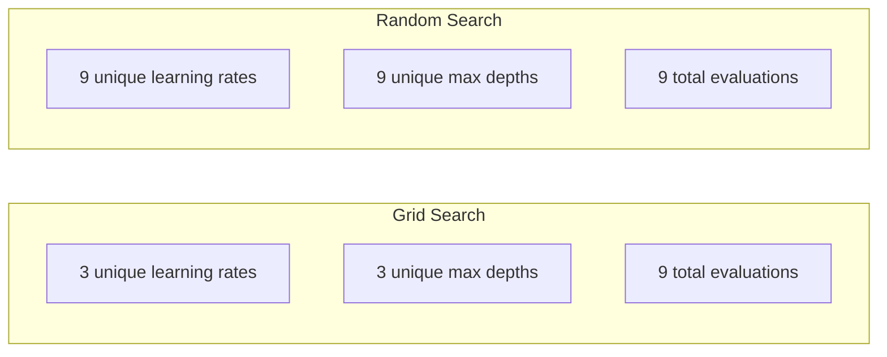
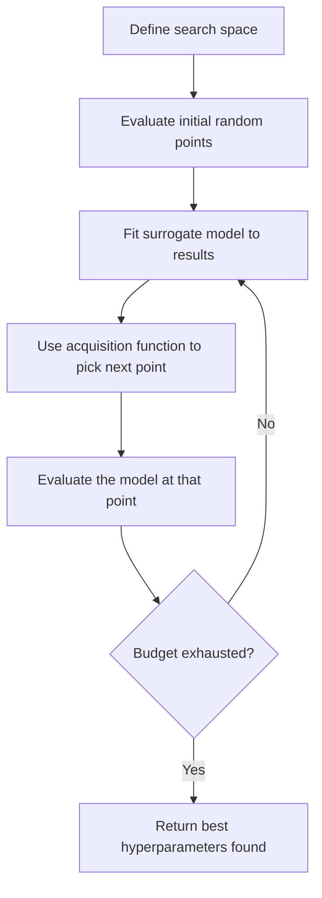
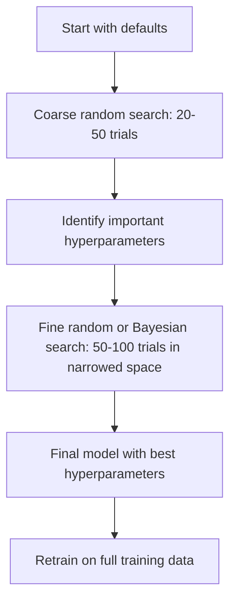
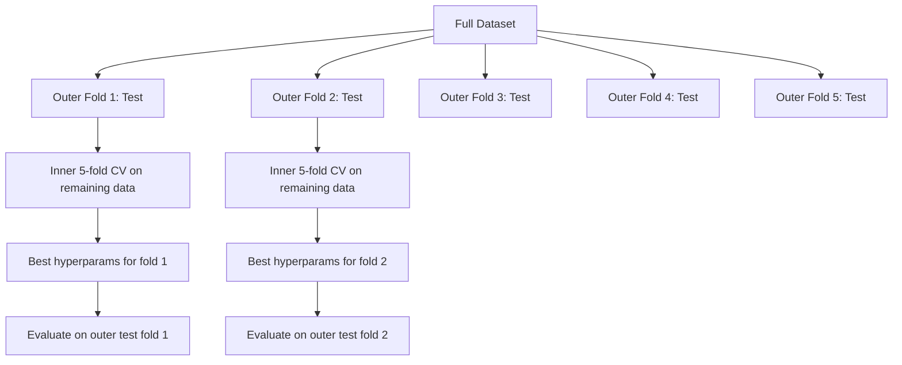

# Tinh chỉnh Hyperparameter

> Hyperparameter là các nút vặn mà bạn điều chỉnh trước khi quá trình huấn luyện bắt đầu. Việc điều chỉnh chúng tốt hay không chính là sự khác biệt giữa một mô hình tầm thường và một mô hình xuất sắc.

**Type:** Build
**Language:** Python
**Prerequisites:** Phase 2, Lesson 11 (Ensemble Methods)
**Time:** ~90 phút

## Mục tiêu học tập

- Triển khai grid search, random search và Bayesian optimization từ đầu, sau đó so sánh hiệu quả lấy mẫu của chúng.
- Giải thích lý do tại sao random search vượt trội hơn grid search khi hầu hết các hyperparameter có số chiều hiệu dụng thấp.
- Xây dựng vòng lặp Bayesian optimization sử dụng surrogate model và acquisition function để định hướng tìm kiếm.
- Thiết kế chiến lược tinh chỉnh hyperparameter giúp tránh overfitting tập validation thông qua cross-validation phù hợp.

## Vấn đề

Mô hình gradient boosting của bạn có learning rate, số lượng cây, độ sâu tối đa (max depth), số mẫu tối thiểu trên mỗi lá (min samples per leaf), tỷ lệ subsample và tỷ lệ lấy mẫu cột (column sample ratio). Đó là sáu hyperparameter. Nếu mỗi cái có 5 giá trị hợp lý, lưới tìm kiếm sẽ có 5^6 = 15.625 tổ hợp. Việc huấn luyện mỗi tổ hợp mất 10 giây. Tổng cộng mất 43 giờ tính toán để thử hết tất cả.

Grid search là phương pháp hiển nhiên nhất nhưng lại là phương pháp tệ nhất khi mở rộng quy mô. Random search làm tốt hơn với ít tài nguyên tính toán hơn. Bayesian optimization thậm chí còn làm tốt hơn bằng cách học hỏi từ các đánh giá trước đó. Biết được chiến lược nào nên dùng và hyperparameter nào thực sự quan trọng sẽ giúp bạn tiết kiệm hàng ngày trời lãng phí GPU.

## Khái niệm

### Tham số (Parameters) vs Hyperparameter

Tham số là những thứ được học trong quá trình huấn luyện (trọng số, bias, ngưỡng phân tách). Hyperparameter là những thứ được thiết lập trước khi huấn luyện bắt đầu và kiểm soát cách thức học diễn ra.

| Hyperparameter | Kiểm soát điều gì | Phạm vi điển hình |
|---------------|-----------------|---------------|
| Learning rate | Kích thước bước cập nhật | 0.001 đến 1.0 |
| Số lượng cây/epoch | Thời gian huấn luyện | 10 đến 10.000 |
| Max depth | Độ phức tạp mô hình | 1 đến 30 |
| Regularization (lambda) | Ngăn chặn overfitting | 0.0001 đến 100 |
| Batch size | Nhiễu ước lượng gradient | 16 đến 512 |
| Dropout rate | Tỷ lệ neuron bị loại bỏ | 0.0 đến 0.5 |

### Grid Search

Grid search đánh giá mọi tổ hợp của các giá trị được chỉ định. Nó mang tính vét cạn và dễ hiểu, nhưng quy mô tăng theo hàm mũ với số lượng hyperparameter.

```
Grid for 2 hyperparameters:

  learning_rate: [0.01, 0.1, 1.0]
  max_depth:     [3, 5, 7]

  Evaluations: 3 x 3 = 9 combinations

  (0.01, 3)  (0.01, 5)  (0.01, 7)
  (0.1,  3)  (0.1,  5)  (0.1,  7)
  (1.0,  3)  (1.0,  5)  (1.0,  7)
```

Grid search có một lỗ hổng cơ bản: nếu một hyperparameter quan trọng và cái khác thì không, hầu hết các đánh giá sẽ bị lãng phí. Bạn chỉ nhận được 3 giá trị duy nhất của tham số quan trọng từ 9 lần đánh giá.

### Random Search

Random search lấy mẫu hyperparameter từ các phân phối thay vì một lưới cố định. Với cùng ngân sách 9 lần đánh giá, bạn nhận được 9 giá trị duy nhất cho mỗi hyperparameter.



Tại sao random search đánh bại grid search (Bergstra & Bengio, 2012):

- Hầu hết các hyperparameter có số chiều hiệu dụng thấp. Thông thường chỉ 1-2 trong số 6 hyperparameter thực sự quan trọng đối với một bài toán cụ thể.
- Grid search lãng phí các đánh giá vào những chiều không quan trọng.
- Random search bao phủ các chiều quan trọng dày đặc hơn với cùng một ngân sách.
- Với 60 lần thử ngẫu nhiên, bạn có 95% cơ hội tìm thấy một điểm nằm trong phạm vi 5% so với giá trị tối ưu (nếu nó tồn tại trong không gian tìm kiếm).

### Bayesian Optimization

Random search bỏ qua các kết quả trước đó. Nó không học được rằng learning rate cao gây ra sự phân kỳ hoặc độ sâu 3 luôn vượt trội hơn độ sâu 10. Bayesian optimization sử dụng các đánh giá trong quá khứ để quyết định nơi tìm kiếm tiếp theo.



Hai thành phần chính:

**Surrogate model:** Một mô hình rẻ tiền để đánh giá (thường là Gaussian process) giúp xấp xỉ hàm mục tiêu đắt đỏ. Nó cung cấp cả dự đoán và ước tính độ không chắc chắn tại bất kỳ điểm nào trong không gian tìm kiếm.

**Acquisition function:** Quyết định nơi đánh giá tiếp theo bằng cách cân bằng giữa khai thác (tìm kiếm gần các điểm tốt đã biết) và khám phá (tìm kiếm nơi độ không chắc chắn cao). Các lựa chọn phổ biến:

- **Expected Improvement (EI):** Mức độ cải thiện kỳ vọng so với điểm tốt nhất hiện tại tại điểm này là bao nhiêu?
- **Upper Confidence Bound (UCB):** Dự đoán cộng với một bội số của độ không chắc chắn. UCB cao hơn có nghĩa là điểm đó hứa hẹn hoặc chưa được khám phá.
- **Probability of Improvement (PI):** Xác suất điểm này đánh bại điểm tốt nhất hiện tại là bao nhiêu?

Bayesian optimization thường tìm thấy hyperparameter tốt hơn random search với số lần đánh giá ít hơn từ 2-5 lần. Chi phí để huấn luyện surrogate model là không đáng kể so với việc huấn luyện mô hình thực tế.

### Early Stopping

Không phải mọi lần chạy huấn luyện đều cần phải hoàn thành. Nếu một cấu hình rõ ràng là tệ sau 10 epoch, hãy dừng nó lại và chuyển sang cấu hình khác. Đây là early stopping trong ngữ cảnh tìm kiếm hyperparameter.

Các chiến lược:
- **Dựa trên sự kiên nhẫn (Patience-based):** Dừng nếu validation loss không cải thiện trong N epoch liên tiếp.
- **Median pruning:** Dừng nếu kết quả trung gian của lần thử tệ hơn giá trị trung vị của các lần thử đã hoàn thành tại cùng một bước.
- **Hyperband:** Phân bổ ngân sách nhỏ cho nhiều cấu hình, sau đó tăng dần ngân sách cho những cấu hình tốt nhất.

Hyperband đặc biệt hiệu quả. Nó bắt đầu với 81 cấu hình, mỗi cấu hình chạy 1 epoch, giữ lại 1/3 tốt nhất, cho chúng chạy 3 epoch, giữ lại 1/3 tốt nhất, và cứ tiếp tục như vậy. Cách này tìm ra các cấu hình tốt nhanh hơn 10-50 lần so với việc đánh giá tất cả cấu hình với toàn bộ ngân sách.

### Learning Rate Schedulers

Learning rate gần như luôn là hyperparameter quan trọng nhất. Thay vì giữ cố định, các scheduler sẽ điều chỉnh nó trong quá trình huấn luyện.

| Scheduler | Công thức | Khi nào nên dùng |
|-----------|---------|-------------|
| Step decay | Nhân với 0.1 sau mỗi N epoch | Huấn luyện CNN cổ điển |
| Cosine annealing | lr * 0.5 * (1 + cos(pi * t / T)) | Mặc định hiện đại |
| Warmup + decay | Tăng tuyến tính rồi giảm theo cosine | Transformers |
| One-cycle | Tăng rồi giảm trong một chu kỳ | Hội tụ nhanh |
| Reduce on plateau | Giảm theo hệ số khi metric chững lại | Mặc định an toàn |

### Tầm quan trọng của Hyperparameter

Không phải tất cả hyperparameter đều quan trọng như nhau. Nghiên cứu về random forest (Probst et al., 2019) và gradient boosting cho thấy các mô hình nhất quán:

**Tầm quan trọng cao:**
- Learning rate (luôn tinh chỉnh đầu tiên)
- Số lượng estimator / epoch (sử dụng early stopping thay vì tinh chỉnh)
- Độ mạnh của regularization

**Tầm quan trọng trung bình:**
- Max depth / số lượng lớp
- Min samples per leaf / weight decay
- Tỷ lệ subsample

**Tầm quan trọng thấp:**
- Max features (cho random forest)
- Lựa chọn hàm kích hoạt cụ thể
- Batch size (trong phạm vi hợp lý)

Hãy tinh chỉnh những cái quan trọng trước, để những cái còn lại ở giá trị mặc định.

### Chiến lược thực tế



Quy trình cụ thể:

1. **Bắt đầu với các giá trị mặc định của thư viện.** Chúng được chọn bởi các chuyên gia và thường đã đạt được 80% hiệu suất tối ưu.
2. **Coarse random search.** Phạm vi rộng, 20-50 lần thử. Sử dụng early stopping để loại bỏ nhanh các lần chạy tệ.
3. **Phân tích kết quả.** Hyperparameter nào tương quan với hiệu suất? Thu hẹp không gian tìm kiếm.
4. **Fine search.** Bayesian optimization hoặc random search tập trung trong không gian đã thu hẹp. 50-100 lần thử.
5. **Huấn luyện lại trên toàn bộ dữ liệu huấn luyện** với các hyperparameter tốt nhất đã tìm thấy.

### Tích hợp Cross-Validation

Tinh chỉnh hyperparameter trên một tập validation duy nhất rất rủi ro. Các hyperparameter tốt nhất có thể bị overfitting vào fold validation cụ thể đó. Nested cross-validation giải quyết vấn đề này bằng cách sử dụng hai vòng lặp:

- **Vòng lặp ngoài** (đánh giá): chia dữ liệu thành train+val và test. Báo cáo hiệu suất không chệch.
- **Vòng lặp trong** (tinh chỉnh): chia train+val thành train và val. Tìm hyperparameter tốt nhất.



Mỗi fold ngoài tìm ra hyperparameter tốt nhất của riêng nó một cách độc lập. Các điểm số ở vòng ngoài là ước tính không chệch về hiệu suất tổng quát hóa.

Với sklearn:

```python
from sklearn.model_selection import cross_val_score, GridSearchCV
from sklearn.ensemble import GradientBoostingRegressor

inner_cv = GridSearchCV(
    GradientBoostingRegressor(),
    param_grid={
        "learning_rate": [0.01, 0.05, 0.1],
        "max_depth": [2, 3, 5],
        "n_estimators": [50, 100, 200],
    },
    cv=5,
    scoring="neg_mean_squared_error",
)

outer_scores = cross_val_score(
    inner_cv, X, y, cv=5, scoring="neg_mean_squared_error"
)

print(f"Nested CV MSE: {-outer_scores.mean():.4f} +/- {outer_scores.std():.4f}")
```

Cách này tốn kém (5 fold ngoài x 5 fold trong x 27 điểm lưới = 675 lần huấn luyện mô hình), nhưng nó cung cấp cho bạn một ước tính hiệu suất đáng tin cậy. Hãy sử dụng nó khi báo cáo kết quả cuối cùng trong các bài báo hoặc khi quyết định có tầm quan trọng cao.

### Mẹo thực tế

**Bắt đầu với learning rate.** Đây luôn là hyperparameter quan trọng nhất cho các phương pháp dựa trên gradient. Một learning rate tệ sẽ làm cho mọi thứ khác trở nên vô nghĩa. Hãy cố định các hyperparameter khác ở giá trị mặc định và quét learning rate trước.

**Sử dụng phân phối log-uniform cho learning rate và regularization.** Sự khác biệt giữa 0.001 và 0.01 quan trọng tương đương với sự khác biệt giữa 0.1 và 1.0. Tìm kiếm tuyến tính sẽ lãng phí ngân sách ở phía giá trị lớn.

**Sử dụng early stopping thay vì tinh chỉnh n_estimators.** Đối với boosting và neural network, hãy đặt n_estimators hoặc epoch ở mức cao và để early stopping quyết định khi nào dừng. Điều này loại bỏ một hyperparameter khỏi quá trình tìm kiếm.

**Phân bổ ngân sách.** Dành 60% ngân sách tinh chỉnh cho 2 hyperparameter quan trọng nhất. Dành 40% còn lại cho tất cả những thứ khác. 2 cái quan trọng nhất chiếm phần lớn sự biến thiên hiệu suất.

**Quy mô rất quan trọng.** Không bao giờ tìm kiếm batch size trên thang log (16, 32, 64 là ổn). Luôn tìm kiếm learning rate trên thang log. Hãy khớp phân phối tìm kiếm với cách mà hyperparameter ảnh hưởng đến mô hình.

| Loại mô hình | Hyperparameter hàng đầu | Tìm kiếm khuyến nghị | Ngân sách |
|-----------|--------------------|--------------------|--------|
| Random Forest | n_estimators, max_depth, min_samples_leaf | Random search, 50 lần thử | Thấp (huấn luyện nhanh) |
| Gradient Boosting | learning_rate, n_estimators, max_depth | Bayesian, 100 lần thử + early stopping | Trung bình |
| Neural Network | learning_rate, weight_decay, batch_size | Bayesian hoặc random, 100+ lần thử | Cao (huấn luyện chậm) |
| SVM | C, gamma (RBF kernel) | Grid trên thang log, 25-50 lần thử | Thấp (2 tham số) |
| Lasso/Ridge | alpha | Tìm kiếm 1D trên thang log, 20 lần thử | Rất thấp |
| XGBoost | learning_rate, max_depth, subsample, colsample | Bayesian, 100-200 lần thử + early stopping | Trung bình |

**Khi nghi ngờ:** hãy dùng random search với số lần thử gấp đôi số lượng hyperparameter (ví dụ: 6 hyperparameter = tối thiểu 12+ lần thử). Bạn sẽ ngạc nhiên khi thấy random search với 50 lần thử thường xuyên đánh bại cả grid search được thiết kế kỹ lưỡng.

```figure
k-fold-cv
```

## Xây dựng

### Bước 1: Grid Search từ đầu

Mã nguồn trong `code/tuning.py` triển khai grid search, random search và một bộ tối ưu hóa Bayesian đơn giản từ đầu.

```python
def grid_search(model_fn, param_grid, X_train, y_train, X_val, y_val):
    keys = list(param_grid.keys())
    values = list(param_grid.values())
    best_score = -float("inf")
    best_params = None
    n_evals = 0

    for combo in itertools.product(*values):
        params = dict(zip(keys, combo))
        model = model_fn(**params)
        model.fit(X_train, y_train)
        score = evaluate(model, X_val, y_val)
        n_evals += 1

        if score > best_score:
            best_score = score
            best_params = params

    return best_params, best_score, n_evals
```

### Bước 2: Random Search từ đầu

```python
def random_search(model_fn, param_distributions, X_train, y_train,
                  X_val, y_val, n_iter=50, seed=42):
    rng = np.random.RandomState(seed)
    best_score = -float("inf")
    best_params = None

    for _ in range(n_iter):
        params = {k: sample(v, rng) for k, v in param_distributions.items()}
        model = model_fn(**params)
        model.fit(X_train, y_train)
        score = evaluate(model, X_val, y_val)

        if score > best_score:
            best_score = score
            best_params = params

    return best_params, best_score, n_iter
```

### Bước 3: Bayesian Optimization (Đơn giản hóa)

Ý tưởng cốt lõi: khớp một Gaussian process vào các cặp (hyperparameter, điểm số) đã quan sát được, sau đó sử dụng acquisition function để quyết định nơi tìm kiếm tiếp theo.

```python
class SimpleBayesianOptimizer:
    def __init__(self, search_space, n_initial=5):
        self.search_space = search_space
        self.n_initial = n_initial
        self.X_observed = []
        self.y_observed = []

    def _kernel(self, x1, x2, length_scale=1.0):
        dists = np.sum((x1[:, None, :] - x2[None, :, :]) ** 2, axis=2)
        return np.exp(-0.5 * dists / length_scale ** 2)

    def _fit_gp(self, X_new):
        X_obs = np.array(self.X_observed)
        y_obs = np.array(self.y_observed)
        y_mean = y_obs.mean()
        y_centered = y_obs - y_mean

        K = self._kernel(X_obs, X_obs) + 1e-4 * np.eye(len(X_obs))
        K_star = self._kernel(X_new, X_obs)

        L = np.linalg.cholesky(K)
        alpha = np.linalg.solve(L.T, np.linalg.solve(L, y_centered))
        mu = K_star @ alpha + y_mean

        v = np.linalg.solve(L, K_star.T)
        var = 1.0 - np.sum(v ** 2, axis=0)
        var = np.maximum(var, 1e-6)

        return mu, var

    def _expected_improvement(self, mu, var, best_y):
        sigma = np.sqrt(var)
        z = (mu - best_y) / (sigma + 1e-10)
        ei = sigma * (z * norm_cdf(z) + norm_pdf(z))
        return ei

    def suggest(self):
        if len(self.X_observed) < self.n_initial:
            return sample_random(self.search_space)

        candidates = [sample_random(self.search_space) for _ in range(500)]
        X_cand = np.array([to_vector(c) for c in candidates])
        mu, var = self._fit_gp(X_cand)
        ei = self._expected_improvement(mu, var, max(self.y_observed))
        return candidates[np.argmax(ei)]

    def observe(self, params, score):
        self.X_observed.append(to_vector(params))
        self.y_observed.append(score)
```

Surrogate GP cung cấp hai thứ tại mỗi điểm ứng viên: điểm số dự đoán (mu) và độ không chắc chắn (var). Expected Improvement cân bằng hai yếu tố này: nó ưu tiên các điểm mà mô hình dự đoán điểm số cao HOẶC nơi độ không chắc chắn cao. Ban đầu, hầu hết các điểm đều có độ không chắc chắn cao nên bộ tối ưu hóa sẽ khám phá. Sau đó, nó tập trung vào vùng hứa hẹn nhất.

### Bước 4: So sánh tất cả các phương pháp

Chạy cả ba phương pháp trên cùng một hàm mục tiêu tổng hợp và so sánh. Phép so sánh này sử dụng một wrapper đơn giản gọi từng bộ tối ưu hóa với một hàm mục tiêu trực tiếp (không huấn luyện mô hình), vì vậy API khác với các triển khai dựa trên mô hình ở trên:

```python
def synthetic_objective(params):
    lr = params["learning_rate"]
    depth = params["max_depth"]
    return -(np.log10(lr) + 2) ** 2 - (depth - 4) ** 2 + 10

param_grid = {
    "learning_rate": [0.001, 0.01, 0.1, 1.0],
    "max_depth": [2, 3, 4, 5, 6, 7, 8],
}

grid_best = None
grid_score = -float("inf")
grid_history = []
for combo in itertools.product(*param_grid.values()):
    params = dict(zip(param_grid.keys(), combo))
    score = synthetic_objective(params)
    grid_history.append((params, score))
    if score > grid_score:
        grid_score = score
        grid_best = params

param_dist = {
    "learning_rate": ("log_float", 0.001, 1.0),
    "max_depth": ("int", 2, 8),
}

rand_best = None
rand_score = -float("inf")
rand_history = []
rng = np.random.RandomState(42)
for _ in range(28):
    params = {k: sample(v, rng) for k, v in param_dist.items()}
    score = synthetic_objective(params)
    rand_history.append((params, score))
    if score > rand_score:
        rand_score = score
        rand_best = params

optimizer = SimpleBayesianOptimizer(param_dist, n_initial=5)
bayes_history = []
for _ in range(28):
    params = optimizer.suggest()
    score = synthetic_objective(params)
    optimizer.observe(params, score)
    bayes_history.append((params, score))
bayes_score = max(s for _, s in bayes_history)

print(f"{'Method':<20} {'Best Score':>12} {'Evaluations':>12}")
print("-" * 50)
print(f"{'Grid Search':<20} {grid_score:>12.4f} {len(grid_history):>12}")
print(f"{'Random Search':<20} {rand_score:>12.4f} {len(rand_history):>12}")
print(f"{'Bayesian Opt':<20} {bayes_score:>12.4f} {len(bayes_history):>12}")
```

Với cùng một ngân sách, Bayesian optimization thường tìm thấy điểm số tốt nhất nhanh nhất vì nó không lãng phí các đánh giá vào những vùng rõ ràng là tệ. Random search bao phủ nhiều không gian hơn grid search. Grid search chỉ thắng khi bạn có rất ít hyperparameter và có thể chi trả cho việc vét cạn.

## Sử dụng

### Optuna trong thực tế

Optuna là thư viện được khuyến nghị cho việc tinh chỉnh hyperparameter chuyên nghiệp. Nó hỗ trợ pruning, tìm kiếm phân tán và trực quan hóa ngay lập tức.

```python
import optuna

def objective(trial):
    lr = trial.suggest_float("learning_rate", 1e-4, 1e-1, log=True)
    n_est = trial.suggest_int("n_estimators", 50, 500)
    max_depth = trial.suggest_int("max_depth", 2, 10)

    model = GradientBoostingRegressor(
        learning_rate=lr,
        n_estimators=n_est,
        max_depth=max_depth,
    )
    model.fit(X_train, y_train)
    return mean_squared_error(y_val, model.predict(X_val))

study = optuna.create_study(direction="minimize")
study.optimize(objective, n_trials=100)

print(f"Best params: {study.best_params}")
print(f"Best MSE: {study.best_value:.4f}")
```

Các tính năng chính của Optuna:
- `suggest_float(..., log=True)` cho các tham số nên tìm kiếm trên thang log (learning rate, regularization)
- `suggest_int` cho các tham số số nguyên
- `suggest_categorical` cho các lựa chọn rời rạc
- MedianPruner tích hợp sẵn để early stopping các lần thử tệ
- `study.trials_dataframe()` để phân tích

### Optuna với Pruning

Pruning dừng các lần thử không hứa hẹn sớm, tiết kiệm tài nguyên tính toán khổng lồ. Đây là mô hình:

```python
import optuna
from sklearn.model_selection import cross_val_score

def objective(trial):
    params = {
        "learning_rate": trial.suggest_float("lr", 1e-4, 0.5, log=True),
        "max_depth": trial.suggest_int("max_depth", 2, 10),
        "n_estimators": trial.suggest_int("n_estimators", 50, 500),
        "subsample": trial.suggest_float("subsample", 0.5, 1.0),
    }

    model = GradientBoostingRegressor(**params)
    scores = cross_val_score(model, X_train, y_train, cv=3,
                             scoring="neg_mean_squared_error")
    mean_score = -scores.mean()

    trial.report(mean_score, step=0)
    if trial.should_prune():
        raise optuna.TrialPruned()

    return mean_score

pruner = optuna.pruners.MedianPruner(n_startup_trials=10, n_warmup_steps=5)
study = optuna.create_study(direction="minimize", pruner=pruner)
study.optimize(objective, n_trials=200)
```

`MedianPruner` dừng một lần thử nếu giá trị trung gian của nó tệ hơn giá trị trung vị của tất cả các lần thử đã hoàn thành tại cùng một bước. Pruning yêu cầu gọi `trial.report()` để báo cáo các metric trung gian và `trial.should_prune()` để kiểm tra xem lần thử có nên dừng hay không. `n_startup_trials=10` đảm bảo ít nhất 10 lần thử hoàn thành đầy đủ trước khi pruning bắt đầu. Điều này thường tiết kiệm 40-60% tổng tài nguyên tính toán.

### Các bộ tinh chỉnh tích hợp của sklearn

Để thử nghiệm nhanh, sklearn cung cấp `GridSearchCV`, `RandomizedSearchCV` và `HalvingRandomSearchCV`:

```python
from sklearn.model_selection import RandomizedSearchCV
from scipy.stats import loguniform, randint

param_dist = {
    "learning_rate": loguniform(1e-4, 0.5),
    "max_depth": randint(2, 10),
    "n_estimators": randint(50, 500),
}

search = RandomizedSearchCV(
    GradientBoostingRegressor(),
    param_dist,
    n_iter=100,
    cv=5,
    scoring="neg_mean_squared_error",
    random_state=42,
    n_jobs=-1,
)
search.fit(X_train, y_train)
print(f"Best params: {search.best_params_}")
print(f"Best CV MSE: {-search.best_score_:.4f}")
```

Sử dụng `loguniform` từ scipy cho learning rate và regularization. Sử dụng `randint` cho các hyperparameter số nguyên. Cờ `n_jobs=-1` thực hiện song song trên tất cả các nhân CPU.

### Các sai lầm phổ biến trong tinh chỉnh Hyperparameter

**Rò rỉ dữ liệu qua tiền xử lý.** Nếu bạn fit một scaler trên toàn bộ tập dữ liệu trước khi cross-validation, thông tin từ fold validation sẽ rò rỉ vào quá trình huấn luyện. Luôn đặt tiền xử lý bên trong một `Pipeline` để nó chỉ được fit trên fold huấn luyện.

**Overfitting vào tập validation.** Chạy hàng ngàn lần thử thực chất là huấn luyện trên tập validation. Hãy sử dụng nested cross-validation để có ước tính hiệu suất cuối cùng, hoặc giữ lại một tập test riêng biệt mà bạn không bao giờ chạm vào trong quá trình tinh chỉnh.

**Tìm kiếm phạm vi quá hẹp.** Nếu giá trị tốt nhất của bạn nằm ở biên của không gian tìm kiếm, bạn đã không tìm kiếm đủ rộng. Giá trị tối ưu có thể nằm ngoài phạm vi của bạn. Luôn kiểm tra xem các tham số tốt nhất có nằm ở các cạnh hay không.

**Bỏ qua hiệu ứng tương tác.** Learning rate và số lượng estimator tương tác mạnh mẽ trong boosting. Một learning rate thấp cần nhiều estimator hơn. Tinh chỉnh chúng độc lập sẽ cho kết quả tệ hơn so với tinh chỉnh cùng nhau.

**Không sử dụng early stopping cho các mô hình lặp.** Đối với gradient boosting và neural network, hãy đặt n_estimators hoặc epoch ở giá trị cao và sử dụng early stopping. Cách này tốt hơn hẳn so với việc tinh chỉnh số lần lặp như một hyperparameter.

## Bài tập

1. Chạy grid search và random search với cùng tổng ngân sách (ví dụ: 50 lần đánh giá). So sánh các điểm số tốt nhất tìm được. Chạy thí nghiệm 10 lần với các seed khác nhau. Random search thắng bao nhiêu lần?

2. Triển khai Hyperband từ đầu. Bắt đầu với 81 cấu hình, mỗi cấu hình huấn luyện trong 1 epoch. Giữ lại 1/3 tốt nhất ở mỗi vòng và tăng gấp ba ngân sách của chúng. So sánh tổng tài nguyên tính toán (tổng số epoch trên tất cả cấu hình) với việc chạy 81 cấu hình với toàn bộ ngân sách.

3. Thêm một learning rate scheduler (cosine annealing) vào triển khai gradient boosting từ Bài 11. Nó có giúp ích gì so với learning rate cố định không?

4. Sử dụng Optuna để tinh chỉnh RandomForestClassifier trên một tập dữ liệu thực tế (ví dụ: tập dữ liệu ung thư vú của sklearn). Sử dụng `optuna.visualization.plot_param_importances(study)` để xem hyperparameter nào quan trọng nhất. Nó có khớp với bảng xếp hạng tầm quan trọng từ bài học này không?

5. Triển khai một acquisition function đơn giản (Expected Improvement) và minh họa sự khám phá vs khai thác. Vẽ biểu đồ trung bình và độ không chắc chắn của surrogate model, và chỉ ra nơi EI chọn đánh giá tiếp theo.

## Thuật ngữ chính

| Thuật ngữ | Cách gọi thông thường | Ý nghĩa thực tế |
|------|----------------|----------------------|
| Hyperparameter | "Một cài đặt bạn chọn" | Giá trị được thiết lập trước khi huấn luyện, kiểm soát quá trình học, không được học từ dữ liệu |
| Grid search | "Thử mọi tổ hợp" | Tìm kiếm vét cạn trên một lưới tham số xác định. Chi phí theo hàm mũ. |
| Random search | "Chỉ lấy mẫu ngẫu nhiên" | Lấy mẫu hyperparameter từ các phân phối. Bao phủ các chiều quan trọng tốt hơn grid search. |
| Bayesian optimization | "Tìm kiếm thông minh" | Sử dụng surrogate model của hàm mục tiêu để quyết định nơi đánh giá tiếp theo, cân bằng giữa khám phá và khai thác |
| Surrogate model | "Một xấp xỉ rẻ tiền" | Một mô hình (thường là Gaussian process) xấp xỉ hàm mục tiêu đắt đỏ từ các đánh giá đã quan sát |
| Acquisition function | "Nơi cần tìm tiếp theo" | Chấm điểm các điểm ứng viên bằng cách cân bằng giữa cải thiện kỳ vọng và độ không chắc chắn. EI và UCB là các lựa chọn phổ biến. |
| Early stopping | "Ngừng lãng phí thời gian" | Kết thúc huấn luyện sớm khi hiệu suất validation ngừng cải thiện |
| Hyperband | "Giải đấu cho các cấu hình" | Phân bổ tài nguyên thích ứng: bắt đầu nhiều cấu hình với ngân sách nhỏ, giữ lại những cái tốt nhất và tăng ngân sách cho chúng |
| Learning rate scheduler | "Thay đổi lr trong khi huấn luyện" | Một hàm điều chỉnh learning rate trong suốt quá trình huấn luyện để hội tụ tốt hơn |

## Đọc thêm

- [Bergstra & Bengio: Random Search for Hyper-Parameter Optimization (2012)](https://jmlr.org/papers/v13/bergstra12a.html) -- bài báo chứng minh random search đánh bại grid search
- [Snoek et al., Practical Bayesian Optimization of Machine Learning Algorithms (2012)](https://arxiv.org/abs/1206.2944) -- Bayesian optimization cho ML
- [Li et al., Hyperband: A Novel Bandit-Based Approach (2018)](https://jmlr.org/papers/v18/16-558.html) -- bài báo về Hyperband
- [Optuna: A Next-generation Hyperparameter Optimization Framework](https://arxiv.org/abs/1907.10902) -- bài báo về Optuna
- [Probst et al., Tunability: Importance of Hyperparameters (2019)](https://jmlr.org/papers/v20/18-444.html) -- hyperparameter nào thực sự quan trọng