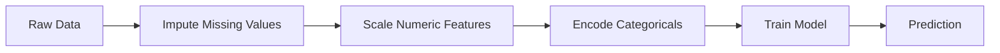
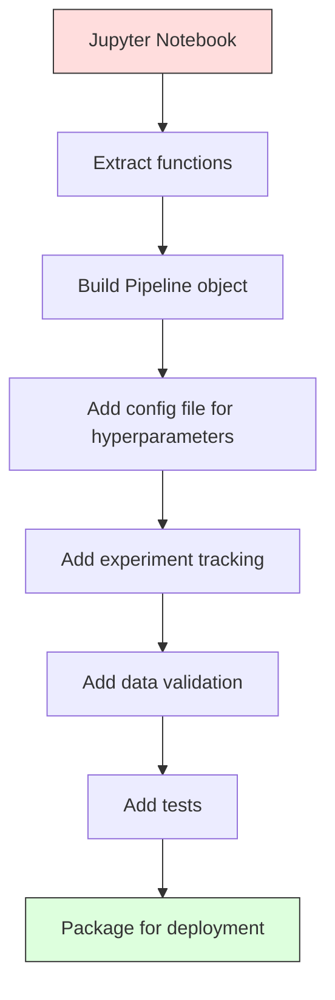

# ML Pipelines

> Một mô hình không phải là một sản phẩm. Một pipeline mới là sản phẩm. Pipeline bao gồm mọi thứ từ dữ liệu thô đến dự đoán được triển khai, và mọi bước đều phải có khả năng tái lập.

**Type:** Build
**Language:** Python
**Prerequisites:** Phase 2, Lesson 12 (Hyperparameter Tuning)
**Time:** ~120 minutes

## Mục tiêu học tập

- Xây dựng một ML pipeline từ đầu, kết hợp các bước xử lý dữ liệu thiếu (imputation), chuẩn hóa (scaling), mã hóa (encoding) và huấn luyện mô hình vào một đối tượng có khả năng tái lập duy nhất.
- Nhận diện các kịch bản rò rỉ dữ liệu (data leakage) và giải thích cách các pipeline ngăn chặn chúng bằng cách chỉ fit các transformer trên tập huấn luyện.
- Xây dựng một ColumnTransformer để áp dụng các tiền xử lý khác nhau cho các đặc trưng số và đặc trưng phân loại.
- Triển khai việc tuần tự hóa (serialization) pipeline và chứng minh rằng cùng một pipeline đã được fit sẽ tạo ra kết quả giống hệt nhau trong môi trường huấn luyện và môi trường production.

## Vấn đề

Bạn có một notebook tải dữ liệu, điền các giá trị thiếu bằng giá trị trung vị, chuẩn hóa các đặc trưng, huấn luyện mô hình và in ra độ chính xác. Nó hoạt động. Bạn triển khai nó.

Một tháng sau, ai đó huấn luyện lại mô hình và nhận được kết quả khác. Giá trị trung vị đã được tính trên toàn bộ tập dữ liệu bao gồm cả dữ liệu kiểm thử (rò rỉ dữ liệu). Các tham số chuẩn hóa không được lưu lại, vì vậy quá trình suy luận (inference) sử dụng các thống kê khác. Mã nguồn kỹ thuật đặc trưng (feature engineering) được sao chép giữa quá trình huấn luyện và phục vụ, và các bản sao này dần khác biệt. Một cột phân loại xuất hiện giá trị mới trong môi trường production mà bộ mã hóa chưa từng thấy.

Đây không phải là giả thuyết. Đây là những lý do phổ biến nhất khiến các hệ thống ML thất bại trong môi trường production. Các pipeline giải quyết tất cả những vấn đề này bằng cách đóng gói mọi bước chuyển đổi vào một đối tượng duy nhất, có thứ tự và có khả năng tái lập.

## Khái niệm

### Pipeline là gì?

Một pipeline là một chuỗi các bước chuyển đổi dữ liệu có thứ tự, theo sau là một mô hình. Mỗi bước lấy đầu ra của bước trước đó làm đầu vào. Toàn bộ pipeline được fit một lần trên dữ liệu huấn luyện. Tại thời điểm suy luận, cùng một pipeline đã được fit sẽ chuyển đổi dữ liệu mới và tạo ra các dự đoán.



Pipeline đảm bảo:
- Các phép chuyển đổi chỉ được fit trên dữ liệu huấn luyện (không có rò rỉ).
- Các phép chuyển đổi tương tự được áp dụng tại thời điểm suy luận.
- Toàn bộ đối tượng có thể được tuần tự hóa và triển khai như một artifact duy nhất.
- Cross-validation áp dụng pipeline cho từng fold, ngăn chặn rò rỉ dữ liệu tinh vi.

### Rò rỉ dữ liệu (Data Leakage): Kẻ sát nhân thầm lặng

Rò rỉ dữ liệu xảy ra khi thông tin từ tập kiểm thử hoặc dữ liệu tương lai xâm nhập vào quá trình huấn luyện. Các pipeline ngăn chặn các hình thức phổ biến nhất.

**Bị rò rỉ (sai):**
```python
X = df.drop("target", axis=1)
y = df["target"]

scaler = StandardScaler()
X_scaled = scaler.fit_transform(X)

X_train, X_test = X_scaled[:800], X_scaled[800:]
y_train, y_test = y[:800], y[800:]
```

Bộ scaler đã nhìn thấy dữ liệu kiểm thử. Giá trị trung bình và độ lệch chuẩn bao gồm cả các mẫu kiểm thử. Điều này làm thổi phồng các ước tính về độ chính xác.

**Đúng:**
```python
X_train, X_test = X[:800], X[800:]

scaler = StandardScaler()
X_train_scaled = scaler.fit_transform(X_train)
X_test_scaled = scaler.transform(X_test)
```

Với một pipeline, bạn không cần phải lo lắng về điều này. Pipeline tự động xử lý nó.

### sklearn Pipeline

`Pipeline` của sklearn liên kết các transformer và một estimator. Nó cung cấp `.fit()`, `.predict()` và `.score()` để áp dụng tất cả các bước theo thứ tự.

```python
from sklearn.pipeline import Pipeline
from sklearn.preprocessing import StandardScaler
from sklearn.linear_model import LogisticRegression

pipe = Pipeline([
    ("scaler", StandardScaler()),
    ("model", LogisticRegression()),
])

pipe.fit(X_train, y_train)
predictions = pipe.predict(X_test)
```

Khi bạn gọi `pipe.fit(X_train, y_train)`:
1. Scaler gọi `fit_transform` trên X_train.
2. Mô hình gọi `fit` trên X_train đã được chuẩn hóa.

Khi bạn gọi `pipe.predict(X_test)`:
1. Scaler gọi `transform` (không phải fit_transform) trên X_test.
2. Mô hình gọi `predict` trên X_test đã được chuẩn hóa.

Bộ scaler không bao giờ nhìn thấy dữ liệu kiểm thử trong quá trình fit. Đây chính là mục đích cốt lõi.

### ColumnTransformer: Các pipeline khác nhau cho các cột khác nhau

Các tập dữ liệu thực tế có các cột số và cột phân loại cần các tiền xử lý khác nhau. `ColumnTransformer` xử lý việc này.

```python
from sklearn.compose import ColumnTransformer
from sklearn.preprocessing import StandardScaler, OneHotEncoder
from sklearn.impute import SimpleImputer

numeric_pipe = Pipeline([
    ("impute", SimpleImputer(strategy="median")),
    ("scale", StandardScaler()),
])

categorical_pipe = Pipeline([
    ("impute", SimpleImputer(strategy="most_frequent")),
    ("encode", OneHotEncoder(handle_unknown="ignore")),
])

preprocessor = ColumnTransformer([
    ("num", numeric_pipe, ["age", "income", "score"]),
    ("cat", categorical_pipe, ["city", "gender", "plan"]),
])

full_pipeline = Pipeline([
    ("preprocess", preprocessor),
    ("model", GradientBoostingClassifier()),
])
```

Tham số `handle_unknown="ignore"` trong OneHotEncoder là rất quan trọng đối với môi trường production. Khi một danh mục mới xuất hiện (một thành phố mà mô hình chưa từng thấy), nó sẽ tạo ra một vector không thay vì gây lỗi chương trình.

### Theo dõi thử nghiệm (Experiment Tracking)

Một pipeline giúp việc huấn luyện có khả năng tái lập, nhưng bạn cũng cần theo dõi những gì đã xảy ra trong các thử nghiệm: siêu tham số nào đã được sử dụng, phiên bản tập dữ liệu nào, các chỉ số là gì, mã nguồn nào đang chạy.

**MLflow** là giải pháp mã nguồn mở phổ biến nhất:

```python
import mlflow

with mlflow.start_run():
    mlflow.log_param("max_depth", 5)
    mlflow.log_param("n_estimators", 100)
    mlflow.log_param("learning_rate", 0.1)

    pipe.fit(X_train, y_train)
    accuracy = pipe.score(X_test, y_test)

    mlflow.log_metric("accuracy", accuracy)
    mlflow.sklearn.log_model(pipe, "model")
```

Mỗi lần chạy được ghi lại với các tham số, chỉ số, artifact và toàn bộ mô hình. Bạn có thể so sánh các lần chạy, tái lập bất kỳ thử nghiệm nào và triển khai bất kỳ phiên bản mô hình nào.

**Weights & Biases (wandb)** cung cấp chức năng tương tự với bảng điều khiển được lưu trữ trên cloud:

```python
import wandb

wandb.init(project="my-pipeline")
wandb.config.update({"max_depth": 5, "n_estimators": 100})

pipe.fit(X_train, y_train)
accuracy = pipe.score(X_test, y_test)

wandb.log({"accuracy": accuracy})
```

### Quản lý phiên bản mô hình (Model Versioning)

Sau khi theo dõi thử nghiệm, bạn cần quản lý các phiên bản mô hình. Mô hình nào đang ở môi trường production? Cái nào đang ở staging? Cái nào là của tuần trước?

Model Registry của MLflow cung cấp:
- **Theo dõi phiên bản:** Mỗi mô hình được lưu đều có một số phiên bản.
- **Chuyển đổi giai đoạn:** "Staging", "Production", "Archived".
- **Quy trình phê duyệt:** Các mô hình phải được phê duyệt rõ ràng mới được đưa lên production.
- **Khôi phục (Rollback):** Chuyển đổi lại phiên bản trước đó ngay lập tức.

### Quản lý phiên bản dữ liệu với DVC

Mã nguồn được quản lý phiên bản bằng git. Dữ liệu cũng nên được quản lý phiên bản, nhưng git không thể xử lý các tệp lớn. DVC (Data Version Control) giải quyết vấn đề này.

```
dvc init
dvc add data/training.csv
git add data/training.csv.dvc data/.gitignore
git commit -m "Track training data"
dvc push
```

DVC lưu trữ dữ liệu thực tế trong bộ lưu trữ từ xa (S3, GCS, Azure) và giữ một tệp `.dvc` nhỏ trong git để ghi lại mã băm (hash). Khi bạn checkout một git commit, `dvc checkout` sẽ khôi phục chính xác dữ liệu đã được sử dụng.

Điều này có nghĩa là mỗi git commit sẽ ghim cả mã nguồn và dữ liệu. Khả năng tái lập hoàn toàn.

### Các thử nghiệm có khả năng tái lập

Một thử nghiệm có khả năng tái lập đòi hỏi bốn yếu tố:

1. **Cố định các hạt giống ngẫu nhiên (random seeds):** Thiết lập seed cho numpy, random và các framework (torch, sklearn).
2. **Ghim các phụ thuộc:** requirements.txt hoặc poetry.lock với các phiên bản chính xác.
3. **Dữ liệu có phiên bản:** DVC hoặc tương tự.
4. **Tệp cấu hình:** Tất cả các siêu tham số nằm trong tệp cấu hình, không được mã hóa cứng (hardcoded).

```python
import numpy as np
import random

def set_seed(seed=42):
    random.seed(seed)
    np.random.seed(seed)
    try:
        import torch
        torch.manual_seed(seed)
        torch.cuda.manual_seed_all(seed)
        torch.backends.cudnn.deterministic = True
    except ImportError:
        pass
```

### Từ Notebook đến Pipeline Production



Quy trình điển hình:

1. **Khám phá trên Notebook:** Thử nghiệm nhanh, trực quan hóa, ý tưởng đặc trưng.
2. **Trích xuất hàm:** Chuyển tiền xử lý, kỹ thuật đặc trưng, đánh giá vào các module.
3. **Xây dựng Pipeline:** Liên kết các phép chuyển đổi thành một sklearn Pipeline hoặc lớp tùy chỉnh.
4. **Quản lý cấu hình:** Chuyển tất cả siêu tham số vào cấu hình YAML/JSON.
5. **Theo dõi thử nghiệm:** Thêm ghi nhật ký MLflow hoặc wandb.
6. **Kiểm định dữ liệu:** Kiểm tra schema, phân phối và các mẫu giá trị thiếu trước khi huấn luyện.
7. **Kiểm thử:** Unit test cho các transformer, integration test cho toàn bộ pipeline.
8. **Triển khai:** Tuần tự hóa pipeline, bao bọc trong một API (FastAPI, Flask), đóng gói container.

### Các lỗi pipeline phổ biến

| Lỗi | Tại sao nó tệ | Cách khắc phục |
|-----|-------------|-----|
| Fit trên toàn bộ dữ liệu trước khi chia | Rò rỉ dữ liệu | Sử dụng Pipeline với cross_val_score |
| Kỹ thuật đặc trưng nằm ngoài pipeline | Phép chuyển đổi khác nhau giữa train và serve | Đưa tất cả các phép chuyển đổi vào Pipeline |
| Không xử lý các danh mục chưa biết | Lỗi production khi gặp giá trị mới | OneHotEncoder(handle_unknown="ignore") |
| Tên cột mã hóa cứng | Lỗi khi schema thay đổi | Sử dụng danh sách tên cột từ cấu hình |
| Không kiểm định dữ liệu | Dự đoán sai thầm lặng trên dữ liệu xấu | Thêm kiểm tra schema trước khi dự đoán |
| Sai lệch huấn luyện/phục vụ | Mô hình thấy các đặc trưng khác nhau trong prod | Một đối tượng Pipeline cho cả hai |

```figure
f3-pipeline-flow
```

## Xây dựng

Mã nguồn trong `code/pipeline.py` xây dựng một ML pipeline hoàn chỉnh từ đầu:

### Bước 1: Custom Transformer

```python
class CustomTransformer:
    def __init__(self):
        self.means = None
        self.stds = None

    def fit(self, X):
        self.means = np.mean(X, axis=0)
        self.stds = np.std(X, axis=0)
        self.stds[self.stds == 0] = 1.0
        return self

    def transform(self, X):
        return (X - self.means) / self.stds

    def fit_transform(self, X):
        return self.fit(X).transform(X)
```

### Bước 2: Pipeline từ đầu

```python
class PipelineFromScratch:
    def __init__(self, steps):
        self.steps = steps

    def fit(self, X, y=None):
        X_current = X.copy()
        for name, step in self.steps[:-1]:
            X_current = step.fit_transform(X_current)
        name, model = self.steps[-1]
        model.fit(X_current, y)
        return self

    def predict(self, X):
        X_current = X.copy()
        for name, step in self.steps[:-1]:
            X_current = step.transform(X_current)
        name, model = self.steps[-1]
        return model.predict(X_current)
```

### Bước 3: Cross-Validation với Pipeline

Mã nguồn minh họa cách cross-validation với pipeline ngăn chặn rò rỉ dữ liệu: bộ scaler được fit riêng biệt trên dữ liệu huấn luyện của từng fold.

### Bước 4: Pipeline Production hoàn chỉnh với sklearn

Một pipeline hoàn chỉnh với `ColumnTransformer`, nhiều đường dẫn tiền xử lý và một mô hình, được huấn luyện với cross-validation và ghi nhật ký thử nghiệm phù hợp.

## Triển khai

Bài học này tạo ra:
- `outputs/prompt-ml-pipeline.md` -- kỹ năng xây dựng và gỡ lỗi ML pipeline.
- `code/pipeline.py` -- một pipeline hoàn chỉnh từ đầu thông qua sklearn.

## Bài tập

1. Xây dựng một pipeline xử lý tập dữ liệu có 3 cột số và 2 cột phân loại. Sử dụng `ColumnTransformer` để áp dụng điền giá trị trung vị + chuẩn hóa cho các cột số và điền giá trị xuất hiện nhiều nhất + one-hot encoding cho các cột phân loại. Huấn luyện với 5-fold cross-validation.

2. Cố tình tạo ra rò rỉ dữ liệu: fit bộ scaler trên toàn bộ tập dữ liệu trước khi chia. So sánh điểm cross-validation (bị rò rỉ) với điểm cross-validation của pipeline (sạch). Sự khác biệt lớn đến mức nào?

3. Tuần tự hóa pipeline của bạn với `joblib.dump`. Tải nó trong một script riêng biệt và chạy dự đoán. Xác minh rằng các dự đoán là giống hệt nhau.

4. Thêm một custom transformer vào pipeline để tạo các đặc trưng đa thức (bậc 2) cho hai cột số quan trọng nhất. Nó nên nằm ở đâu trong pipeline?

5. Thiết lập theo dõi MLflow cho pipeline. Chạy 5 thử nghiệm với các siêu tham số khác nhau. Sử dụng giao diện MLflow (`mlflow ui`) để so sánh các lần chạy và chọn mô hình tốt nhất.

## Thuật ngữ chính

| Thuật ngữ | Cách gọi thông thường | Ý nghĩa thực tế |
|------|----------------|----------------------|
| Pipeline | "Chuỗi chuyển đổi + mô hình" | Một chuỗi các transformer đã fit và một mô hình, được áp dụng như một đơn vị để ngăn rò rỉ |
| Data leakage | "Thông tin test rò vào train" | Sử dụng thông tin từ bên ngoài tập huấn luyện để xây dựng mô hình, làm thổi phồng hiệu suất |
| ColumnTransformer | "Tiền xử lý khác nhau mỗi cột" | Áp dụng các pipeline khác nhau cho các tập con cột khác nhau, kết hợp kết quả |
| Experiment tracking | "Ghi nhật ký các lần chạy" | Ghi lại tham số, chỉ số, artifact và phiên bản mã nguồn cho mỗi lần huấn luyện |
| MLflow | "Theo dõi và triển khai mô hình" | Nền tảng mã nguồn mở để theo dõi thử nghiệm, quản lý mô hình và triển khai |
| DVC | "Git cho dữ liệu" | Hệ thống quản lý phiên bản cho các tệp dữ liệu lớn, lưu mã băm trong git và dữ liệu trong bộ lưu trữ từ xa |
| Model registry | "Danh mục phiên bản mô hình" | Hệ thống theo dõi các phiên bản mô hình với nhãn giai đoạn (staging, production, archived) |
| Training/serving skew | "Nó hoạt động trong notebook" | Sự khác biệt giữa cách dữ liệu được xử lý trong huấn luyện so với suy luận, gây ra lỗi thầm lặng |
| Reproducibility | "Cùng mã, cùng kết quả" | Khả năng đạt được kết quả giống hệt nhau từ cùng một mã nguồn, dữ liệu và cấu hình |

## Đọc thêm

- [Tài liệu scikit-learn Pipeline](https://scikit-learn.org/stable/modules/compose.html) -- tài liệu tham khảo chính thức về pipeline
- [Tài liệu MLflow](https://mlflow.org/docs/latest/index.html) -- theo dõi thử nghiệm và quản lý mô hình
- [Tài liệu DVC](https://dvc.org/doc) -- quản lý phiên bản dữ liệu
- [Sculley và cộng sự, Nợ kỹ thuật ẩn trong các hệ thống ML (2015)](https://papers.nips.cc/paper/2015/hash/86df7dcfd896fcaf2674f757a2463eba-Abstract.html) -- bài báo nền tảng về độ phức tạp của hệ thống ML
- [Google ML Best Practices: Các quy tắc của ML](https://developers.google.com/machine-learning/guides/rules-of-ml) -- lời khuyên thực tế về ML trong môi trường production