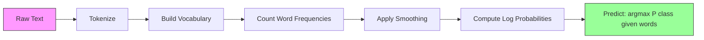

# Naive Bayes

> Giả định "ngây thơ" (naive) là sai, nhưng nó vẫn hoạt động hiệu quả. Đó chính là vẻ đẹp của nó.

**Type:** Build
**Language:** Python
**Prerequisites:** Phase 2, Lessons 01-07 (phân loại, định lý Bayes)
**Time:** ~75 phút

## Mục tiêu học tập

- Triển khai Multinomial Naive Bayes từ đầu với Laplace smoothing cho phân loại văn bản.
- Giải thích tại sao giả định độc lập "ngây thơ" về mặt toán học là sai nhưng lại tạo ra thứ tự xếp hạng lớp chính xác trong thực tế.
- So sánh các biến thể Multinomial, Bernoulli và Gaussian Naive Bayes và chọn biến thể phù hợp cho từng loại đặc trưng.
- Đánh giá Naive Bayes so với logistic regression trên dữ liệu thưa thớt (sparse) có số chiều cao và giải thích sự đánh đổi bias-variance (độ chệch-phương sai) đang diễn ra.

## Vấn đề

Bạn cần phân loại văn bản. Email thành spam hoặc không spam. Đánh giá của khách hàng thành tích cực hoặc tiêu cực. Phiếu hỗ trợ thành các danh mục. Bạn có hàng ngàn đặc trưng (mỗi từ là một đặc trưng) và dữ liệu huấn luyện hạn chế.

Hầu hết các bộ phân loại đều gặp khó khăn ở đây. Logistic regression cần đủ mẫu để ước tính hàng ngàn trọng số một cách đáng tin cậy. Decision trees phân tách dựa trên từng từ một và dễ bị overfitting nghiêm trọng. KNN trong 10.000 chiều là vô nghĩa vì mọi điểm đều cách đều nhau.

Naive Bayes xử lý vấn đề này. Nó đưa ra một giả định sai về mặt toán học (rằng mọi đặc trưng đều độc lập với nhau khi biết trước lớp), nhưng nó vẫn vượt trội hơn các mô hình "thông minh hơn" trong phân loại văn bản, đặc biệt là với các tập huấn luyện nhỏ. Nó huấn luyện chỉ trong một lần duyệt qua dữ liệu. Nó mở rộng quy mô lên hàng triệu đặc trưng. Nó tạo ra các ước tính xác suất (mặc dù thường được hiệu chuẩn kém do giả định độc lập).

Hiểu tại sao một giả định sai lại dẫn đến các dự đoán tốt sẽ dạy bạn một điều cơ bản về machine learning: mô hình tốt nhất không phải là mô hình đúng nhất, mà là mô hình có sự đánh đổi bias-variance tốt nhất cho dữ liệu của bạn.

## Khái niệm

### Định lý Bayes (Ôn tập nhanh)

Định lý Bayes đảo ngược các xác suất có điều kiện:

```
P(class | features) = P(features | class) * P(class) / P(features)
```

Chúng ta muốn `P(class | features)` -- xác suất một tài liệu thuộc về một lớp khi biết các từ trong đó. Chúng ta có thể tính toán điều này từ:
- `P(features | class)` -- khả năng (likelihood) nhìn thấy những từ này trong các tài liệu của lớp đó.
- `P(class)` -- xác suất tiên nghiệm (prior) của lớp (spam phổ biến đến mức nào?).
- `P(features)` -- bằng chứng (evidence), giống nhau cho tất cả các lớp, vì vậy chúng ta có thể bỏ qua nó khi so sánh.

Lớp có `P(class | features)` cao nhất sẽ thắng.

### Giả định độc lập "ngây thơ"

Việc tính toán `P(features | class)` một cách chính xác đòi hỏi phải ước tính xác suất đồng thời của tất cả các đặc trưng cùng nhau. Với từ vựng 10.000 từ, bạn sẽ cần ước tính phân phối trên 2^10.000 tổ hợp có thể. Điều này là bất khả thi.

Giả định ngây thơ: mọi đặc trưng đều độc lập có điều kiện khi biết trước lớp.

```
P(w1, w2, ..., wn | class) = P(w1 | class) * P(w2 | class) * ... * P(wn | class)
```

Thay vì một phân phối đồng thời bất khả thi, bạn ước tính n phân phối đơn giản cho từng đặc trưng. Mỗi phân phối chỉ cần một số đếm.

Giả định này rõ ràng là sai. Các từ "machine" và "learning" không độc lập trong bất kỳ tài liệu nào. Nhưng bộ phân loại không cần các ước tính xác suất chính xác. Nó cần thứ tự xếp hạng chính xác -- lớp nào có xác suất cao nhất. Giả định độc lập đưa ra các lỗi hệ thống, nhưng những lỗi đó ảnh hưởng đến tất cả các lớp tương tự nhau, vì vậy thứ tự xếp hạng vẫn chính xác.

### Tại sao nó vẫn hoạt động

Ba lý do:

1. **Xếp hạng quan trọng hơn hiệu chuẩn.** Phân loại chỉ cần lớp được xếp hạng cao nhất là đúng. Ngay cả khi P(spam) = 0.99999 trong khi xác suất thực là 0.7, bộ phân loại vẫn chọn đúng spam. Chúng ta không cần xác suất chính xác. Chúng ta cần người chiến thắng chính xác.

2. **Bias cao, phương sai thấp.** Giả định độc lập là một tiên nghiệm mạnh. Nó hạn chế mô hình rất nhiều, giúp ngăn chặn overfitting. Với dữ liệu huấn luyện hạn chế, một mô hình hơi sai nhưng ổn định sẽ đánh bại một mô hình đúng về lý thuyết nhưng cực kỳ không ổn định. Đây là sự đánh đổi bias-variance trong thực tế.

3. **Sự dư thừa đặc trưng triệt tiêu lẫn nhau.** Các đặc trưng tương quan cung cấp bằng chứng dư thừa. Bộ phân loại đếm gấp đôi bằng chứng này, nhưng nó cũng đếm gấp đôi cho đúng lớp đó. Nếu "machine" và "learning" luôn xuất hiện cùng nhau, cả hai đều cung cấp bằng chứng cho lớp "tech". NB đếm chúng hai lần, nhưng nó đếm chúng hai lần cho đúng lớp.

Lý do thực tế thứ tư: Naive Bayes cực kỳ nhanh. Huấn luyện là một lần duyệt qua dữ liệu để đếm tần suất. Dự đoán là một phép nhân ma trận. Bạn có thể huấn luyện trên một triệu tài liệu trong vài giây. Tốc độ này có nghĩa là bạn có thể lặp lại nhanh hơn, thử nhiều tập đặc trưng hơn và chạy nhiều thí nghiệm hơn so với các mô hình chậm hơn.

### Các bước toán học

Hãy theo dõi một ví dụ cụ thể. Giả sử chúng ta có hai lớp: spam và không spam. Từ vựng của chúng ta có ba từ: "free", "money", "meeting".

Dữ liệu huấn luyện:
- Email spam nhắc đến "free" 80 lần, "money" 60 lần, "meeting" 10 lần (tổng 150 từ)
- Email không spam nhắc đến "free" 5 lần, "money" 10 lần, "meeting" 100 lần (tổng 115 từ)
- 40% email là spam, 60% là không spam

Với Laplace smoothing (alpha=1):

```
P(free | spam)    = (80 + 1) / (150 + 3) = 81/153 = 0.529
P(money | spam)   = (60 + 1) / (150 + 3) = 61/153 = 0.399
P(meeting | spam) = (10 + 1) / (150 + 3) = 11/153 = 0.072

P(free | not-spam)    = (5 + 1) / (115 + 3) = 6/118 = 0.051
P(money | not-spam)   = (10 + 1) / (115 + 3) = 11/118 = 0.093
P(meeting | not-spam) = (100 + 1) / (115 + 3) = 101/118 = 0.856
```

Email mới chứa: "free" (2 lần), "money" (1 lần), "meeting" (0 lần).

```
log P(spam | email) = log(0.4) + 2*log(0.529) + 1*log(0.399) + 0*log(0.072)
                    = -0.916 + 2*(-0.637) + (-0.919) + 0
                    = -3.109

log P(not-spam | email) = log(0.6) + 2*log(0.051) + 1*log(0.093) + 0*log(0.856)
                        = -0.511 + 2*(-2.976) + (-2.375) + 0
                        = -8.838
```

Spam thắng với cách biệt lớn. Từ "free" xuất hiện hai lần là bằng chứng mạnh mẽ cho spam. Lưu ý rằng việc "meeting" không xuất hiện đóng góp bằng không vào cả hai tổng log (0 * log(P)) -- trong Multinomial NB, các từ vắng mặt không có tác dụng. Chính Bernoulli NB mới là mô hình mô hình hóa sự vắng mặt của từ một cách rõ ràng.

### Ba biến thể

Naive Bayes có ba loại. Mỗi loại mô hình hóa `P(feature | class)` theo cách khác nhau.

#### Multinomial Naive Bayes

Mô hình hóa mỗi đặc trưng dưới dạng số đếm. Tốt nhất cho dữ liệu văn bản nơi các đặc trưng là tần suất từ hoặc giá trị TF-IDF.

```
P(word_i | class) = (count of word_i in class + alpha) / (total words in class + alpha * vocab_size)
```

`alpha` là Laplace smoothing (giải thích bên dưới). Biến thể này là "ngựa thồ" cho phân loại văn bản.

#### Gaussian Naive Bayes

Mô hình hóa mỗi đặc trưng dưới dạng phân phối chuẩn. Tốt nhất cho các đặc trưng liên tục.

```
P(x_i | class) = (1 / sqrt(2 * pi * var)) * exp(-(x_i - mean)^2 / (2 * var))
```

Mỗi lớp có giá trị trung bình và phương sai riêng cho mỗi đặc trưng. Điều này hoạt động tốt khi các đặc trưng thực sự tuân theo đường cong hình chuông trong mỗi lớp.

#### Bernoulli Naive Bayes

Mô hình hóa mỗi đặc trưng dưới dạng nhị phân (có hoặc không). Tốt nhất cho văn bản ngắn hoặc vectơ đặc trưng nhị phân.

```
P(word_i | class) = (docs in class containing word_i + alpha) / (total docs in class + 2 * alpha)
```

Không giống như Multinomial, Bernoulli trừng phạt rõ ràng sự vắng mặt của một từ. Nếu "free" thường xuất hiện trong spam nhưng vắng mặt trong email này, Bernoulli tính đó là bằng chứng chống lại spam.

### Khi nào sử dụng từng biến thể

| Biến thể | Loại đặc trưng | Tốt nhất cho | Ví dụ |
|---------|-------------|----------|---------|
| Multinomial | Số đếm hoặc tần suất | Phân loại văn bản, bag-of-words | Spam email, phân loại chủ đề |
| Gaussian | Giá trị liên tục | Dữ liệu bảng với đặc trưng dạng chuẩn | Phân loại Iris, dữ liệu cảm biến |
| Bernoulli | Nhị phân (0/1) | Văn bản ngắn, vectơ đặc trưng nhị phân | Spam SMS, đặc trưng có/không |

### Laplace Smoothing

Điều gì xảy ra khi một từ xuất hiện trong dữ liệu kiểm tra nhưng chưa bao giờ xuất hiện trong dữ liệu huấn luyện cho một lớp cụ thể?

Không có smoothing: `P(word | class) = 0/N = 0`. Một số 0 nhân qua toàn bộ tích làm cho `P(class | features) = 0`, bất kể tất cả các bằng chứng khác. Một từ chưa từng thấy sẽ phá hủy toàn bộ dự đoán, bất kể bao nhiêu bằng chứng khác hỗ trợ nó.

Laplace smoothing thêm một số đếm nhỏ `alpha` (thường là 1) vào mỗi số đếm đặc trưng:

```
P(word_i | class) = (count(word_i, class) + alpha) / (total_words_in_class + alpha * vocab_size)
```

Với alpha=1, mỗi từ có ít nhất một xác suất nhỏ. Từ "discombobulate" xuất hiện trong email kiểm tra không còn làm hỏng xác suất spam nữa. Smoothing có một cách giải thích theo kiểu Bayes: nó tương đương với việc đặt một tiên nghiệm Dirichlet đồng nhất trên các phân phối từ.

Alpha cao hơn có nghĩa là smoothing mạnh hơn (phân phối đồng nhất hơn). Alpha thấp hơn có nghĩa là mô hình tin tưởng dữ liệu nhiều hơn. Alpha là một siêu tham số bạn cần điều chỉnh.

Tác dụng của alpha:

| Alpha | Tác dụng | Khi nào sử dụng |
|-------|--------|-------------|
| 0.001 | Hầu như không smoothing, tin vào dữ liệu | Tập huấn luyện rất lớn, không mong đợi đặc trưng mới |
| 0.1 | Smoothing nhẹ | Tập huấn luyện lớn |
| 1.0 | Laplace smoothing tiêu chuẩn | Điểm bắt đầu mặc định |
| 10.0 | Smoothing mạnh, làm phẳng phân phối | Tập huấn luyện rất nhỏ, mong đợi nhiều đặc trưng mới |

### Tính toán trong không gian Log

Việc nhân hàng trăm xác suất (mỗi xác suất nhỏ hơn 1) gây ra hiện tượng tràn số dấu phẩy động (floating-point underflow). Tích trở thành 0 trong dấu phẩy động mặc dù giá trị thực là một số dương rất nhỏ.

Giải pháp: làm việc trong không gian log. Thay vì nhân các xác suất, hãy cộng các logarit của chúng:

```
log P(class | x1, x2, ..., xn) = log P(class) + sum_i log P(xi | class)
```

Điều này biến dự đoán thành một tích vô hướng:

```
log_scores = X @ log_feature_probs.T + log_class_priors
prediction = argmax(log_scores)
```

Phép nhân ma trận. Đó là lý do tại sao dự đoán Naive Bayes rất nhanh -- nó là cùng một thao tác với mô hình tuyến tính một lớp.

### Naive Bayes vs Logistic Regression

Cả hai đều là bộ phân loại tuyến tính cho văn bản. Sự khác biệt nằm ở những gì chúng mô hình hóa.

| Khía cạnh | Naive Bayes | Logistic Regression |
|--------|------------|-------------------|
| Loại | Generative (mô hình hóa P(X\|Y)) | Discriminative (mô hình hóa P(Y\|X)) |
| Huấn luyện | Đếm tần suất | Tối ưu hóa hàm mất mát |
| Dữ liệu nhỏ | Tốt hơn (tiên nghiệm mạnh giúp ích) | Tệ hơn (không đủ để ước tính trọng số) |
| Dữ liệu lớn | Tệ hơn (giả định sai gây hại) | Tốt hơn (biên quyết định linh hoạt) |
| Đặc trưng | Giả định độc lập | Xử lý các tương quan |
| Tốc độ | Một lần duyệt, rất nhanh | Tối ưu hóa lặp lại |
| Hiệu chuẩn | Xác suất kém | Xác suất tốt hơn |

Quy tắc ngón tay cái: bắt đầu với Naive Bayes. Nếu bạn có đủ dữ liệu và NB đạt đến ngưỡng, hãy chuyển sang logistic regression.

### Quy trình phân loại



Trong thực tế, chúng ta làm việc trong không gian log để tránh tràn số dấu phẩy động. Thay vì nhân nhiều xác suất nhỏ, chúng ta cộng các logarit của chúng:

```
log P(class | features) = log P(class) + sum_i log P(feature_i | class)
```

```figure
naive-bayes
```

## Xây dựng nó

Mã trong `code/naive_bayes.py` triển khai cả MultinomialNB và GaussianNB từ đầu.

### MultinomialNB

Triển khai từ đầu:

1. **fit(X, y)**: Với mỗi lớp, đếm tần suất của mỗi đặc trưng. Thêm Laplace smoothing. Tính xác suất log. Lưu trữ các tiên nghiệm lớp (log của tần suất lớp).

2. **predict_log_proba(X)**: Với mỗi mẫu, tính log P(lớp) + tổng log P(đặc trưng_i | lớp) cho tất cả các lớp. Đây là một phép nhân ma trận: X @ log_probs.T + log_priors.

3. **predict(X)**: Trả về lớp có xác suất log cao nhất.

```python
class MultinomialNB:
    def __init__(self, alpha=1.0):
        self.alpha = alpha

    def fit(self, X, y):
        classes = np.unique(y)
        n_classes = len(classes)
        n_features = X.shape[1]

        self.classes_ = classes
        self.class_log_prior_ = np.zeros(n_classes)
        self.feature_log_prob_ = np.zeros((n_classes, n_features))

        for i, c in enumerate(classes):
            X_c = X[y == c]
            self.class_log_prior_[i] = np.log(X_c.shape[0] / X.shape[0])
            counts = X_c.sum(axis=0) + self.alpha
            self.feature_log_prob_[i] = np.log(counts / counts.sum())

        return self
```

Điểm mấu chốt: sau khi fit, dự đoán chỉ là phép nhân ma trận cộng với một bias. Đây là lý do tại sao Naive Bayes rất nhanh.

### GaussianNB

Đối với các đặc trưng liên tục, chúng ta ước tính trung bình và phương sai cho mỗi lớp cho mỗi đặc trưng:

```python
class GaussianNB:
    def __init__(self):
        pass

    def fit(self, X, y):
        classes = np.unique(y)
        self.classes_ = classes
        self.means_ = np.zeros((len(classes), X.shape[1]))
        self.vars_ = np.zeros((len(classes), X.shape[1]))
        self.priors_ = np.zeros(len(classes))

        for i, c in enumerate(classes):
            X_c = X[y == c]
            self.means_[i] = X_c.mean(axis=0)
            self.vars_[i] = X_c.var(axis=0) + 1e-9
            self.priors_[i] = X_c.shape[0] / X.shape[0]

        return self
```

Dự đoán sử dụng Gaussian PDF cho mỗi đặc trưng, nhân qua các đặc trưng (cộng trong không gian log).

### Demo: Phân loại văn bản

Mã tạo ra dữ liệu bag-of-words tổng hợp mô phỏng hai lớp (bài báo công nghệ vs bài báo thể thao). Mỗi lớp có một phân phối tần suất từ khác nhau. MultinomialNB phân loại chúng bằng cách sử dụng số đếm từ.

Dữ liệu tổng hợp hoạt động như sau: chúng ta tạo 200 "từ" (cột đặc trưng). Các từ 0-39 có tần suất cao trong các bài báo công nghệ và thấp trong thể thao. Các từ 80-119 có tần suất cao trong thể thao và thấp trong công nghệ. Các từ 40-79 có tần suất trung bình ở cả hai. Điều này tạo ra một kịch bản thực tế nơi một số từ là chỉ báo lớp mạnh và những từ khác là nhiễu.

### Demo: Đặc trưng liên tục

Mã tạo ra dữ liệu giống Iris (3 lớp, 4 đặc trưng, các cụm Gaussian). GaussianNB phân loại bằng cách sử dụng trung bình và phương sai theo lớp. Mỗi lớp có một tâm khác nhau (vectơ trung bình) và độ lan tỏa khác nhau (phương sai), bắt chước dữ liệu thực tế nơi các phép đo khác nhau một cách hệ thống giữa các danh mục.

Mã cũng minh họa:
- **So sánh smoothing:** Huấn luyện MultinomialNB với các giá trị alpha khác nhau để cho thấy tác dụng của độ mạnh smoothing đối với độ chính xác.
- **Thí nghiệm kích thước huấn luyện:** Độ chính xác của NB cải thiện như thế nào khi dữ liệu huấn luyện tăng từ 20 lên 1600 mẫu. NB đạt được độ chính xác khá ngay cả với rất ít mẫu -- đây là ưu điểm chính của nó.
- **Ma trận nhầm lẫn (Confusion matrix):** Precision, recall và F1 score theo lớp để cho thấy NB mắc lỗi ở đâu.

### Tốc độ dự đoán

Dự đoán Naive Bayes là một phép nhân ma trận. Đối với n mẫu với d đặc trưng và k lớp:
- MultinomialNB: một phép nhân ma trận (n x d) @ (d x k) = O(n * d * k)
- GaussianNB: n * k đánh giá Gaussian PDF, mỗi đánh giá trên d đặc trưng = O(n * d * k)

Cả hai đều là tuyến tính trong mọi chiều. Hãy so sánh điều này với KNN (đòi hỏi tính toán khoảng cách đến tất cả các điểm huấn luyện) hoặc SVM với nhân RBF (đòi hỏi đánh giá nhân so với tất cả các vectơ hỗ trợ). NB nhanh hơn theo cấp số nhân tại thời điểm dự đoán.

## Sử dụng nó

Với sklearn, cả hai biến thể đều là một dòng lệnh:

```python
from sklearn.naive_bayes import GaussianNB, MultinomialNB

gnb = GaussianNB()
gnb.fit(X_train, y_train)
print(f"GaussianNB accuracy: {gnb.score(X_test, y_test):.3f}")

mnb = MultinomialNB(alpha=1.0)
mnb.fit(X_train_counts, y_train)
print(f"MultinomialNB accuracy: {mnb.score(X_test_counts, y_test):.3f}")
```

Đối với phân loại văn bản với sklearn:

```python
from sklearn.feature_extraction.text import CountVectorizer
from sklearn.naive_bayes import MultinomialNB
from sklearn.pipeline import Pipeline

text_clf = Pipeline([
    ("vectorizer", CountVectorizer()),
    ("classifier", MultinomialNB(alpha=1.0)),
])

text_clf.fit(train_texts, train_labels)
accuracy = text_clf.score(test_texts, test_labels)
```

Mã trong `naive_bayes.py` so sánh các triển khai từ đầu với sklearn trên cùng một dữ liệu để xác minh tính chính xác.

### TF-IDF với Naive Bayes

Số đếm từ thô cho mỗi từ trọng số bằng nhau trên mỗi lần xuất hiện. Nhưng các từ phổ biến như "the" và "is" xuất hiện thường xuyên trong mọi lớp -- chúng không mang thông tin. TF-IDF (Term Frequency - Inverse Document Frequency) giảm trọng số các từ phổ biến và tăng trọng số các từ hiếm, có tính phân biệt.

```python
from sklearn.feature_extraction.text import TfidfVectorizer
from sklearn.naive_bayes import MultinomialNB
from sklearn.pipeline import Pipeline

text_clf = Pipeline([
    ("tfidf", TfidfVectorizer()),
    ("classifier", MultinomialNB(alpha=0.1)),
])
```

Các giá trị TF-IDF không âm, vì vậy chúng hoạt động với MultinomialNB. Sự kết hợp của TF-IDF + MultinomialNB là một trong những đường cơ sở (baseline) mạnh nhất cho phân loại văn bản. Nó thường đánh bại các mô hình phức tạp hơn trên các tập dữ liệu có ít hơn 10.000 mẫu huấn luyện.

### BernoulliNB cho văn bản ngắn

Đối với văn bản ngắn (tweet, SMS, tin nhắn chat), BernoulliNB có thể vượt trội hơn MultinomialNB. Các văn bản ngắn có số đếm từ thấp, vì vậy thông tin tần suất mà MultinomialNB dựa vào là nhiễu. BernoulliNB chỉ quan tâm đến sự hiện diện hoặc vắng mặt, điều này đáng tin cậy hơn với văn bản ngắn.

```python
from sklearn.naive_bayes import BernoulliNB
from sklearn.feature_extraction.text import CountVectorizer

text_clf = Pipeline([
    ("vectorizer", CountVectorizer(binary=True)),
    ("classifier", BernoulliNB(alpha=1.0)),
])
```

Cờ `binary=True` trong CountVectorizer chuyển đổi tất cả các số đếm thành 0/1. Nếu không có nó, BernoulliNB vẫn hoạt động nhưng đang nhìn thấy các số đếm mà nó không được thiết kế để xử lý.

### Hiệu chuẩn xác suất NB

Xác suất NB được hiệu chuẩn kém. Khi NB nói P(spam) = 0.95, xác suất thực có thể là 0.7. Nếu bạn cần các ước tính xác suất đáng tin cậy (ví dụ: để đặt ngưỡng hoặc kết hợp với các mô hình khác), hãy sử dụng CalibratedClassifierCV của sklearn:

```python
from sklearn.calibration import CalibratedClassifierCV

calibrated_nb = CalibratedClassifierCV(MultinomialNB(), cv=5, method="sigmoid")
calibrated_nb.fit(X_train, y_train)
proba = calibrated_nb.predict_proba(X_test)
```

Điều này fit một logistic regression trên các điểm số thô của NB bằng cách sử dụng cross-validation. Các xác suất thu được gần hơn nhiều với tần suất lớp thực tế.

### Các lỗi thường gặp

1. **Giá trị đặc trưng âm.** MultinomialNB yêu cầu các đặc trưng không âm. Nếu bạn có các giá trị âm (như TF-IDF với một số cài đặt hoặc các đặc trưng đã chuẩn hóa), hãy sử dụng GaussianNB thay thế, hoặc dịch chuyển các đặc trưng để chúng dương.

2. **Đặc trưng có phương sai bằng 0.** GaussianNB chia cho phương sai. Nếu một đặc trưng có phương sai bằng 0 cho một lớp (tất cả các giá trị giống hệt nhau), việc tính toán xác suất sẽ bị hỏng. Mã thêm một số smoothing nhỏ (1e-9) vào tất cả các phương sai để ngăn chặn điều này.

3. **Mất cân bằng lớp.** Nếu 99% email là không spam, tiên nghiệm P(không spam) = 0.99 mạnh đến mức nó lấn át bằng chứng khả năng. Bạn có thể đặt các tiên nghiệm lớp theo cách thủ công hoặc sử dụng tham số class_prior trong sklearn.

4. **Chuẩn hóa đặc trưng.** MultinomialNB không cần chuẩn hóa (nó hoạt động trên số đếm). GaussianNB cũng không cần chuẩn hóa (nó ước tính thống kê theo đặc trưng). Đây là một ưu điểm so với logistic regression và SVM, vốn nhạy cảm với quy mô đặc trưng.

## Ship nó

Bài học này tạo ra:
- `outputs/skill-naive-bayes-chooser.md` -- một kỹ năng ra quyết định để chọn biến thể NB phù hợp
- `code/naive_bayes.py` -- MultinomialNB và GaussianNB từ đầu, với sự so sánh với sklearn

### Khi nào Naive Bayes thất bại

NB thất bại khi giả định độc lập gây ra thứ tự xếp hạng không chính xác (không chỉ xác suất không chính xác). Điều này xảy ra khi:

1. **Tương tác đặc trưng mạnh.** Nếu lớp phụ thuộc vào sự kết hợp của hai đặc trưng nhưng không phụ thuộc vào từng đặc trưng riêng lẻ (các mẫu giống XOR), NB sẽ bỏ lỡ hoàn toàn. Mỗi đặc trưng riêng lẻ không cung cấp bằng chứng, và NB không thể kết hợp chúng một cách phi tuyến tính.

2. **Các đặc trưng tương quan cao với bằng chứng đối lập.** Nếu đặc trưng A nói "spam" và đặc trưng B nói "không spam", nhưng A và B tương quan hoàn hảo (chúng luôn đồng ý trong thực tế), NB sẽ thấy bằng chứng mâu thuẫn trong khi thực tế không có.

3. **Tập huấn luyện rất lớn.** Với đủ dữ liệu, các mô hình phân biệt (discriminative) như logistic regression học được biên quyết định thực sự và vượt trội hơn NB. Giả định độc lập từng giúp ích với dữ liệu nhỏ giờ đây lại kìm hãm mô hình.

Trong thực tế, các chế độ thất bại này hiếm gặp đối với phân loại văn bản. Các đặc trưng văn bản rất nhiều, yếu riêng lẻ, và các lỗi của giả định độc lập có xu hướng triệt tiêu lẫn nhau. Đối với dữ liệu bảng với ít đặc trưng tương quan mạnh, hãy cân nhắc logistic regression hoặc các mô hình dựa trên cây trước.

## Bài tập

1. **Thí nghiệm smoothing.** Huấn luyện MultinomialNB trên dữ liệu văn bản với các giá trị alpha là 0.01, 0.1, 1.0, 10.0 và 100.0. Vẽ biểu đồ độ chính xác so với alpha. Hiệu suất đạt đỉnh ở đâu? Tại sao alpha rất cao lại gây hại?

2. **Kiểm tra tính độc lập của đặc trưng.** Lấy một tập dữ liệu văn bản thực. Chọn hai từ rõ ràng có tương quan ("machine" và "learning"). Tính P(từ1 | lớp) * P(từ2 | lớp) và so sánh với P(từ1 VÀ từ2 | lớp). Giả định độc lập sai đến mức nào? Nó có ảnh hưởng đến độ chính xác phân loại không?

3. **Triển khai Bernoulli.** Mở rộng mã với một lớp BernoulliNB. Chuyển đổi bag-of-words thành nhị phân (có/không) và so sánh độ chính xác với MultinomialNB trên dữ liệu văn bản. Khi nào Bernoulli thắng?

4. **NB vs Logistic Regression.** Huấn luyện cả hai trên dữ liệu văn bản. Bắt đầu với 100 mẫu huấn luyện và tăng lên 10.000. Vẽ biểu đồ độ chính xác so với kích thước tập huấn luyện cho cả hai. Tại thời điểm nào Logistic Regression vượt qua Naive Bayes?

5. **Bộ lọc spam.** Xây dựng một bộ phân loại spam hoàn chỉnh: tokenize văn bản email thô, xây dựng từ vựng, tạo đặc trưng bag-of-words, huấn luyện MultinomialNB, đánh giá bằng precision và recall (không chỉ độ chính xác -- tại sao?).

## Thuật ngữ chính

| Thuật ngữ | Mọi người nói | Ý nghĩa thực sự |
|------|----------------|----------------------|
| Naive Bayes | "Bộ phân loại xác suất đơn giản" | Một bộ phân loại áp dụng định lý Bayes với giả định rằng các đặc trưng độc lập có điều kiện khi biết trước lớp |
| Độc lập có điều kiện | "Các đặc trưng không ảnh hưởng lẫn nhau" | P(A, B \| C) = P(A \| C) * P(B \| C) -- biết B không cho bạn biết gì mới về A khi bạn đã biết C |
| Laplace smoothing | "Add-one smoothing" | Thêm một số đếm nhỏ vào mỗi đặc trưng để ngăn các xác suất bằng 0 thống trị dự đoán |
| Prior | "Những gì bạn tin trước khi thấy dữ liệu" | P(lớp) -- xác suất của mỗi lớp trước khi quan sát bất kỳ đặc trưng nào |
| Likelihood | "Dữ liệu khớp tốt như thế nào" | P(đặc trưng \| lớp) -- xác suất quan sát các đặc trưng này nếu biết lớp |
| Posterior | "Những gì bạn tin sau khi thấy dữ liệu" | P(lớp \| đặc trưng) -- xác suất cập nhật của lớp sau khi quan sát các đặc trưng |
| Generative model | "Mô hình hóa cách dữ liệu được tạo ra" | Một mô hình học P(X \| Y) và P(Y), sau đó sử dụng định lý Bayes để có được P(Y \| X) |
| Discriminative model | "Mô hình hóa biên quyết định" | Một mô hình học trực tiếp P(Y \| X) mà không mô hình hóa cách X được tạo ra |
| Log probability | "Tránh tràn số" | Làm việc với log P thay vì P để ngăn tích của nhiều số nhỏ trở thành 0 trong dấu phẩy động |

## Đọc thêm

- [Tài liệu scikit-learn Naive Bayes](https://scikit-learn.org/stable/modules/naive_bayes.html) -- tất cả ba biến thể với chi tiết toán học
- [McCallum và Nigam, A Comparison of Event Models for Naive Bayes Text Classification (1998)](https://www.cs.cmu.edu/~knigam/papers/multinomial-aaaiws98.pdf) -- so sánh kinh điển giữa Multinomial và Bernoulli cho văn bản
- [Rennie và cộng sự, Tackling the Poor Assumptions of Naive Bayes Text Classifiers (2003)](https://people.csail.mit.edu/jrennie/papers/icml03-nb.pdf) -- các cải tiến cho NB cho văn bản
- [Ng và Jordan, On Discriminative vs. Generative Classifiers (2001)](https://ai.stanford.edu/~ang/papers/nips01-discriminativegenerative.pdf) -- chứng minh NB hội tụ nhanh hơn LR với ít dữ liệu hơn