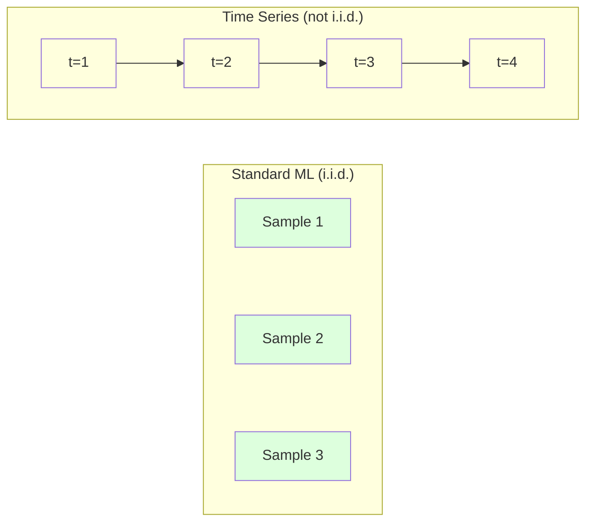
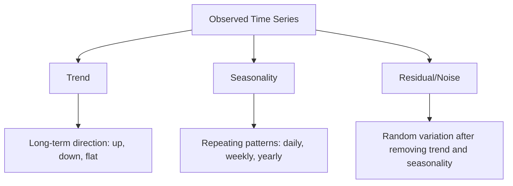
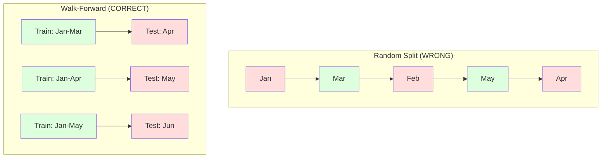

# Các nguyên lý cơ bản về Chuỗi thời gian (Time Series)

> Hiệu suất trong quá khứ có dự đoán được kết quả tương lai -- nếu bạn kiểm tra tính dừng (stationarity) trước.

**Type:** Build
**Language:** Python
**Prerequisites:** Giai đoạn 2, Bài 01-09
**Time:** ~90 phút

## Mục tiêu học tập

- Phân rã một chuỗi thời gian thành các thành phần xu hướng (trend), tính mùa vụ (seasonality) và phần dư (residual), đồng thời kiểm tra tính dừng.
- Triển khai các đặc trưng trễ (lag features) và thống kê trượt (rolling statistics) để chuyển đổi chuỗi thời gian thành bài toán học có giám sát.
- Xây dựng khung kiểm chứng walk-forward để ngăn chặn dữ liệu tương lai rò rỉ vào quá trình huấn luyện.
- Giải thích lý do tại sao việc chia train/test ngẫu nhiên không hợp lệ đối với chuỗi thời gian và chứng minh sự chênh lệch hiệu suất so với việc chia theo thời gian đúng cách.

## Vấn đề

Bạn có dữ liệu được sắp xếp theo thời gian. Doanh số hàng ngày, nhiệt độ hàng giờ, mức sử dụng CPU theo phút, giá cổ phiếu hàng tuần. Bạn muốn dự đoán giá trị tiếp theo, tuần tiếp theo, quý tiếp theo.

Bạn tìm đến bộ công cụ ML tiêu chuẩn của mình: chia train/test ngẫu nhiên, cross-validation, đưa ma trận đặc trưng vào, nhận dự đoán ra. Mọi bước đều sai.

Chuỗi thời gian phá vỡ các giả định mà ML tiêu chuẩn dựa vào. Các mẫu không độc lập -- nhiệt độ hôm nay phụ thuộc vào hôm qua. Việc chia ngẫu nhiên làm rò rỉ thông tin tương lai vào quá khứ. Các đặc trưng trông có vẻ tốt trong kiểm thử ngược (backtest) lại thất bại trong thực tế vì chúng dựa vào các mô hình thay đổi theo thời gian.

Một mô hình đạt độ chính xác 95% với cross-validation ngẫu nhiên có thể chỉ đạt 55% với đánh giá dựa trên thời gian đúng cách. Sự khác biệt này không phải là vấn đề kỹ thuật nhỏ. Đó là sự khác biệt giữa một mô hình hoạt động trên lý thuyết và một mô hình hoạt động trong thực tế.

Bài học này bao gồm các nguyên lý cơ bản: điều gì làm cho dữ liệu thời gian trở nên khác biệt, cách đánh giá mô hình một cách trung thực và cách biến chuỗi thời gian thành các đặc trưng mà các mô hình ML tiêu chuẩn có thể sử dụng.

## Khái niệm

### Điều gì làm cho Chuỗi thời gian trở nên khác biệt

ML tiêu chuẩn giả định i.i.d. -- độc lập và phân phối đồng nhất (independent and identically distributed). Mỗi mẫu được rút ra từ cùng một phân phối, độc lập với các mẫu khác. Chuỗi thời gian vi phạm cả hai:

- **Không độc lập.** Giá cổ phiếu hôm nay phụ thuộc vào hôm qua. Doanh số tuần này tương quan với tuần trước.
- **Không phân phối đồng nhất.** Phân phối thay đổi theo thời gian. Doanh số tháng 12 trông khác với doanh số tháng 3.

Những vi phạm này không hề nhỏ. Chúng thay đổi cách bạn xây dựng đặc trưng, cách bạn đánh giá mô hình và thuật toán nào hoạt động hiệu quả.



Trong ML tiêu chuẩn, các mẫu có thể thay thế cho nhau. Việc xáo trộn chúng không thay đổi gì cả. Trong chuỗi thời gian, thứ tự là tất cả. Việc xáo trộn sẽ phá hủy tín hiệu.

### Các thành phần của Chuỗi thời gian

Mỗi chuỗi thời gian là sự kết hợp của:



- **Trend (Xu hướng):** Hướng đi dài hạn. Doanh thu tăng 10% mỗi năm. Nhiệt độ toàn cầu tăng lên.
- **Seasonality (Tính mùa vụ):** Các mô hình lặp lại ở những khoảng thời gian cố định. Doanh số bán lẻ tăng vọt vào tháng 12. Mức sử dụng điều hòa đạt đỉnh vào tháng 7.
- **Residual (Phần dư):** Bất cứ thứ gì còn lại sau khi loại bỏ xu hướng và tính mùa vụ. Nếu phần dư trông giống như nhiễu trắng (white noise), việc phân rã đã nắm bắt được tín hiệu.

### Tính dừng (Stationarity)

Một chuỗi thời gian là dừng nếu các đặc tính thống kê của nó (trung bình, phương sai, tự tương quan) không thay đổi theo thời gian. Hầu hết các phương pháp dự báo đều giả định tính dừng.

**Tại sao nó quan trọng:** Một chuỗi không dừng có giá trị trung bình bị trôi (drift). Một mô hình được huấn luyện trên dữ liệu từ tháng 1 đã học một giá trị trung bình khác với những gì tháng 2 sẽ thể hiện. Nó sẽ sai lệch một cách hệ thống.

**Cách kiểm tra:** Tính trung bình trượt và độ lệch chuẩn trượt qua các cửa sổ thời gian. Nếu chúng bị trôi, chuỗi đó không dừng.

**Cách khắc phục:** Lấy sai phân (differencing). Thay vì mô hình hóa các giá trị thô, hãy mô hình hóa sự thay đổi giữa các giá trị liên tiếp:

```
diff[t] = value[t] - value[t-1]
```

Nếu một vòng lấy sai phân không làm cho chuỗi trở nên dừng, hãy áp dụng lại (sai phân bậc hai). Hầu hết các chuỗi trong thế giới thực chỉ cần tối đa hai vòng.

**Ví dụ:**

Chuỗi gốc: [100, 102, 106, 112, 120]
Sai phân bậc 1: [2, 4, 6, 8] (vẫn có xu hướng tăng)
Sai phân bậc 2: [2, 2, 2] (hằng số -- dừng)

Chuỗi gốc có xu hướng bậc hai. Sai phân bậc 1 biến nó thành xu hướng tuyến tính. Sai phân bậc 2 làm cho nó phẳng. Trong thực tế, bạn hiếm khi cần nhiều hơn hai vòng.

**Kiểm tra chính thức:** Kiểm định Augmented Dickey-Fuller (ADF) là kiểm định thống kê tiêu chuẩn cho tính dừng. Giả thuyết không (null hypothesis) là "chuỗi không dừng". Giá trị p dưới 0.05 có nghĩa là bạn có thể bác bỏ giả thuyết không và kết luận chuỗi là dừng. Chúng ta không triển khai ADF từ đầu (nó yêu cầu các bảng phân phối tiệm cận), nhưng phương pháp thống kê trượt trong mã của chúng ta cung cấp một cách kiểm tra trực quan thực tế.

### Tự tương quan (Autocorrelation)

Tự tương quan đo lường mức độ tương quan của một giá trị tại thời điểm t với giá trị tại thời điểm t-k (k bước trong quá khứ). Hàm tự tương quan (ACF) vẽ biểu đồ tương quan này cho mỗi độ trễ k.

**ACF cho bạn biết:**
- Chuỗi "nhớ" được bao xa. Nếu ACF giảm xuống 0 sau độ trễ 5, các giá trị cách đây hơn 5 bước là không liên quan.
- Liệu có tính mùa vụ hay không. Nếu ACF tăng vọt tại độ trễ 12 (dữ liệu hàng tháng), thì có tính mùa vụ hàng năm.
- Cần tạo bao nhiêu đặc trưng trễ. Sử dụng các độ trễ cho đến khi ACF trở nên không đáng kể.

**PACF (Hàm tự tương quan riêng phần)** loại bỏ các tương quan gián tiếp. Nếu hôm nay tương quan với 3 ngày trước chỉ vì cả hai đều tương quan với ngày hôm qua, thì PACF tại độ trễ 3 sẽ bằng 0 trong khi ACF tại độ trễ 3 thì không.

### Đặc trưng trễ: Chuyển đổi Chuỗi thời gian thành Học có giám sát

Các mô hình ML tiêu chuẩn cần ma trận đặc trưng X và mục tiêu y. Chuỗi thời gian cung cấp cho bạn một cột giá trị duy nhất. Cầu nối chính là các đặc trưng trễ.

Lấy chuỗi [10, 12, 14, 13, 15] và tạo các đặc trưng trễ 1 và trễ 2:

| lag_2 | lag_1 | target |
|-------|-------|--------|
| 10    | 12    | 14     |
| 12    | 14    | 13     |
| 14    | 13    | 15     |

Bây giờ bạn có một bài toán hồi quy tiêu chuẩn. Bất kỳ mô hình ML nào (hồi quy tuyến tính, random forest, gradient boosting) đều có thể dự đoán mục tiêu từ các độ trễ.

Các đặc trưng bổ sung bạn có thể kỹ thuật hóa:
- **Thống kê trượt:** trung bình, std, min, max qua k giá trị gần nhất
- **Đặc trưng lịch:** ngày trong tuần, tháng, là ngày lễ, là cuối tuần
- **Giá trị sai phân:** thay đổi so với bước trước đó
- **Thống kê mở rộng:** trung bình tích lũy, tổng tích lũy
- **Đặc trưng tỷ lệ:** giá trị hiện tại / trung bình trượt (cách xa mức trung bình gần đây bao nhiêu)
- **Đặc trưng tương tác:** lag_1 * ngày_trong_tuần (ảnh hưởng của ngày trong tuần đến động lượng)

**Cần bao nhiêu độ trễ?** Sử dụng hàm tự tương quan. Nếu ACF có ý nghĩa lên đến độ trễ 10, hãy sử dụng ít nhất 10 độ trễ. Nếu có tính mùa vụ hàng tuần, hãy bao gồm độ trễ 7 (và có thể là 14). Nhiều độ trễ hơn cung cấp cho mô hình nhiều lịch sử hơn nhưng cũng có nhiều đặc trưng hơn để khớp, làm tăng nguy cơ quá khớp (overfitting).

**Bẫy căn chỉnh mục tiêu.** Khi tạo các đặc trưng trễ, mục tiêu phải là giá trị tại thời điểm t, và tất cả các đặc trưng phải sử dụng các giá trị tại thời điểm t-1 hoặc sớm hơn. Nếu bạn vô tình bao gồm giá trị tại thời điểm t như một đặc trưng, bạn sẽ có một bộ dự đoán hoàn hảo -- và một mô hình hoàn toàn vô dụng. Đây là lỗi phổ biến nhất trong kỹ thuật đặc trưng chuỗi thời gian.

### Kiểm chứng Walk-Forward

Đây là khái niệm quan trọng nhất trong bài học này. Cross-validation k-fold tiêu chuẩn gán ngẫu nhiên các mẫu vào tập huấn luyện và kiểm tra. Đối với chuỗi thời gian, điều này làm rò rỉ thông tin tương lai.



Kiểm chứng walk-forward:
1. Huấn luyện trên dữ liệu đến thời điểm t
2. Dự đoán tại thời điểm t+1 (hoặc t+1 đến t+k cho đa bước)
3. Trượt cửa sổ về phía trước
4. Lặp lại

Mỗi fold kiểm tra chỉ chứa dữ liệu xuất hiện sau tất cả dữ liệu huấn luyện. Không có rò rỉ tương lai. Điều này cung cấp cho bạn một ước tính trung thực về cách mô hình sẽ hoạt động khi được triển khai.

**Cửa sổ mở rộng (Expanding window)** sử dụng tất cả dữ liệu lịch sử để huấn luyện (cửa sổ lớn dần). **Cửa sổ trượt (Sliding window)** sử dụng một cửa sổ huấn luyện có kích thước cố định (cửa sổ trượt đi). Sử dụng cửa sổ mở rộng khi bạn tin rằng dữ liệu cũ vẫn còn liên quan. Sử dụng cửa sổ trượt khi thế giới thay đổi và dữ liệu cũ gây hại.

### Trực giác về ARIMA

ARIMA là mô hình chuỗi thời gian cổ điển. Nó có ba thành phần:

- **AR (Autoregressive):** Dự đoán từ các giá trị quá khứ. AR(p) sử dụng p giá trị gần nhất.
- **I (Integrated):** Lấy sai phân để đạt được tính dừng. I(d) áp dụng d vòng lấy sai phân.
- **MA (Moving Average):** Dự đoán từ các sai số dự báo quá khứ. MA(q) sử dụng q sai số gần nhất.

ARIMA(p, d, q) kết hợp cả ba. Bạn chọn p, d, q dựa trên phân tích ACF/PACF hoặc tìm kiếm tự động (auto-ARIMA).

Chúng ta sẽ không triển khai ARIMA từ đầu -- nó đòi hỏi tối ưu hóa số học nằm ngoài phạm vi của bài học này. Điểm mấu chốt là hiểu mỗi thành phần làm gì để bạn có thể diễn giải kết quả ARIMA và biết khi nào nên sử dụng nó.

### Khi nào sử dụng cái gì

| Phương pháp | Tốt nhất cho | Xử lý tính mùa vụ | Xử lý đặc trưng bên ngoài |
|----------|---------|-------------------|------------------------|
| Đặc trưng trễ + ML | Dữ liệu bảng với nhiều đặc trưng ngoài | Với đặc trưng lịch | Có |
| ARIMA | Chuỗi đơn biến, ngắn hạn | Biến thể SARIMA | Không (ARIMAX cho hạn chế) |
| Làm trơn mũ (Exponential smoothing) | Xu hướng đơn giản + tính mùa vụ | Có (Holt-Winters) | Không |
| Prophet | Dự báo kinh doanh, ngày lễ | Có (các số hạng Fourier) | Hạn chế |
| Mạng thần kinh (LSTM, Transformer) | Chuỗi dài, nhiều chuỗi | Đã học | Có |

Đối với hầu hết các vấn đề thực tế, đặc trưng trễ + gradient boosting là điểm khởi đầu mạnh mẽ nhất. Nó xử lý các đặc trưng bên ngoài một cách tự nhiên, không yêu cầu tính dừng và dễ gỡ lỗi.

### Chiến lược và Tầm nhìn dự báo

Dự báo đơn bước (single-step) dự đoán một bước thời gian phía trước. Dự báo đa bước (multi-step) dự đoán nhiều bước. Có ba chiến lược:

**Đệ quy (Recursive):** Dự đoán một bước phía trước, sử dụng dự đoán đó làm đầu vào cho bước tiếp theo. Đơn giản nhưng sai số tích lũy -- mỗi dự đoán sử dụng dự đoán trước đó, vì vậy các sai lầm sẽ cộng dồn.

**Trực tiếp (Direct):** Huấn luyện một mô hình riêng biệt cho mỗi tầm nhìn. Model-1 dự đoán t+1, Model-5 dự đoán t+5. Không tích lũy sai số, nhưng mỗi mô hình có ít mẫu huấn luyện hơn và chúng không chia sẻ thông tin.

**Đa đầu ra (Multi-output):** Huấn luyện một mô hình xuất ra tất cả các tầm nhìn cùng một lúc. Chia sẻ thông tin giữa các tầm nhìn nhưng yêu cầu một mô hình hỗ trợ nhiều đầu ra (hoặc một hàm mất mát tùy chỉnh).

Đối với hầu hết các vấn đề thực tế, hãy bắt đầu với đệ quy cho các tầm nhìn ngắn (1-5 bước) và trực tiếp cho các tầm nhìn dài hơn.

### Các lỗi phổ biến trong Chuỗi thời gian

| Lỗi | Tại sao xảy ra | Cách khắc phục |
|---------|---------------|-----------|
| Chia train/test ngẫu nhiên | Thói quen từ ML tiêu chuẩn | Sử dụng walk-forward hoặc chia theo thời gian |
| Sử dụng đặc trưng tương lai | Đặc trưng tại thời điểm t bị bao gồm nhầm | Kiểm tra mọi đặc trưng về sự căn chỉnh thời gian |
| Quá khớp với tính mùa vụ | Mô hình ghi nhớ các mô hình lịch | Giữ lại một chu kỳ mùa vụ đầy đủ trong tập kiểm tra |
| Bỏ qua thay đổi quy mô | Doanh thu tăng gấp đôi nhưng mô hình vẫn giữ nguyên | Mô hình hóa phần trăm thay đổi thay vì giá trị tuyệt đối |
| Quá nhiều đặc trưng trễ | "Càng nhiều lịch sử càng tốt" | Sử dụng ACF để xác định các độ trễ liên quan |
| Không lấy sai phân | "Mô hình sẽ tự tìm ra" | Các mô hình cây xử lý được xu hướng; mô hình tuyến tính cần tính dừng |

```figure
f3-series-decompose
```

## Xây dựng

Mã trong `code/time_series.py` triển khai các khối xây dựng cốt lõi từ đầu.

### Trình tạo đặc trưng trễ

```python
def make_lag_features(series, n_lags):
    n = len(series)
    X = np.full((n, n_lags), np.nan)
    for lag in range(1, n_lags + 1):
        X[lag:, lag - 1] = series[:-lag]
    valid = ~np.isnan(X).any(axis=1)
    return X[valid], series[valid]
```

Điều này chuyển đổi một chuỗi 1D thành một ma trận đặc trưng nơi mỗi hàng có `n_lags` giá trị gần nhất làm đặc trưng, và giá trị hiện tại làm mục tiêu.

### Kiểm chứng chéo Walk-Forward

```python
def walk_forward_split(n_samples, n_splits=5, min_train=50):
    assert min_train < n_samples, "min_train must be less than n_samples"
    step = max(1, (n_samples - min_train) // n_splits)
    for i in range(n_splits):
        train_end = min_train + i * step
        test_end = min(train_end + step, n_samples)
        if train_end >= n_samples:
            break
        yield slice(0, train_end), slice(train_end, test_end)
```

Mỗi lần chia đảm bảo dữ liệu huấn luyện đến trước dữ liệu kiểm tra một cách nghiêm ngặt. Cửa sổ huấn luyện mở rộng theo từng fold.

### Mô hình tự hồi quy đơn giản

Một mô hình AR thuần túy chỉ là hồi quy tuyến tính trên các đặc trưng trễ:

```python
class SimpleAR:
    def __init__(self, n_lags=5):
        self.n_lags = n_lags
        self.weights = None
        self.bias = None

    def fit(self, series):
        X, y = make_lag_features(series, self.n_lags)
        # Solve via normal equations
        X_b = np.column_stack([np.ones(len(X)), X])
        theta = np.linalg.lstsq(X_b, y, rcond=None)[0]
        self.bias = theta[0]
        self.weights = theta[1:]
        return self
```

Điều này về mặt khái niệm giống hệt với hồi quy tuyến tính từ Bài 02, nhưng được áp dụng cho các phiên bản trễ thời gian của cùng một biến.

### Kiểm tra tính dừng

Mã tính toán các thống kê trượt để đánh giá tính dừng một cách trực quan và bằng số:

```python
def check_stationarity(series, window=50):
    rolling_mean = np.array([
        series[max(0, i - window):i].mean()
        for i in range(1, len(series) + 1)
    ])
    rolling_std = np.array([
        series[max(0, i - window):i].std()
        for i in range(1, len(series) + 1)
    ])
    return rolling_mean, rolling_std
```

Nếu trung bình trượt bị trôi hoặc độ lệch chuẩn trượt thay đổi, chuỗi không dừng. Hãy áp dụng lấy sai phân và kiểm tra lại.

Mã cũng kiểm tra tính dừng bằng cách so sánh nửa đầu và nửa sau của chuỗi. Nếu giá trị trung bình chênh lệch quá nửa độ lệch chuẩn hoặc tỷ lệ phương sai vượt quá 2 lần, chuỗi được gắn cờ là không dừng.

### Tự tương quan

```python
def autocorrelation(series, max_lag=20):
    n = len(series)
    mean = series.mean()
    var = series.var()
    acf = np.zeros(max_lag + 1)
    for k in range(max_lag + 1):
        cov = np.mean((series[:n-k] - mean) * (series[k:] - mean))
        acf[k] = cov / var if var > 0 else 0
    return acf
```

## Sử dụng

Với sklearn, bạn sử dụng các đặc trưng trễ trực tiếp với bất kỳ bộ hồi quy nào:

```python
from sklearn.linear_model import Ridge
from sklearn.ensemble import GradientBoostingRegressor

X, y = make_lag_features(series, n_lags=10)

for train_idx, test_idx in walk_forward_split(len(X)):
    model = Ridge(alpha=1.0)
    model.fit(X[train_idx], y[train_idx])
    predictions = model.predict(X[test_idx])
```

Đối với ARIMA, hãy sử dụng statsmodels:

```python
from statsmodels.tsa.arima.model import ARIMA

model = ARIMA(train_series, order=(5, 1, 2))
fitted = model.fit()
forecast = fitted.forecast(steps=30)
```

Mã trong `time_series.py` minh họa cả hai phương pháp và so sánh chúng bằng cách sử dụng kiểm chứng walk-forward.

### sklearn TimeSeriesSplit

sklearn cung cấp `TimeSeriesSplit` để triển khai kiểm chứng walk-forward:

```python
from sklearn.model_selection import TimeSeriesSplit

tscv = TimeSeriesSplit(n_splits=5)
for train_index, test_index in tscv.split(X):
    X_train, X_test = X[train_index], X[test_index]
    y_train, y_test = y[train_index], y[test_index]
    model.fit(X_train, y_train)
    score = model.score(X_test, y_test)
```

Điều này tương đương với `walk_forward_split` tự viết của chúng ta nhưng được tích hợp vào khung kiểm chứng chéo của sklearn. Bạn có thể sử dụng nó với `cross_val_score`:

```python
from sklearn.model_selection import cross_val_score

scores = cross_val_score(model, X, y, cv=TimeSeriesSplit(n_splits=5))
print(f"Mean score: {scores.mean():.4f} +/- {scores.std():.4f}")
```

### Các chỉ số đánh giá

Dự báo chuỗi thời gian sử dụng các chỉ số hồi quy, nhưng với ngữ cảnh nhận thức thời gian:

- **MAE (Mean Absolute Error):** Trung bình của |y_true - y_pred|. Dễ diễn giải theo đơn vị gốc. "Trung bình, các dự đoán sai lệch 3.2 độ."
- **RMSE (Root Mean Squared Error):** Căn bậc hai của sai số bình phương trung bình. Phạt các sai số lớn nặng hơn MAE. Sử dụng khi sai số lớn tệ hơn nhiều sai số nhỏ.
- **MAPE (Mean Absolute Percentage Error):** Trung bình của |sai số / giá trị_thực| * 100. Không phụ thuộc vào quy mô, hữu ích để so sánh giữa các chuỗi khác nhau. Nhưng không xác định được khi giá trị thực bằng 0.
- **So sánh với baseline ngây thơ (Naive):** Luôn so sánh với các baseline đơn giản. Baseline ngây thơ theo mùa vụ dự đoán giá trị từ một chu kỳ trước (hôm qua, tuần trước). Nếu mô hình của bạn không thể đánh bại baseline ngây thơ, có điều gì đó không ổn.

### Đặc trưng trượt (Rolling Features)

Mã minh họa việc thêm các thống kê trượt (trung bình, std, min, max qua các cửa sổ 7 và 14 ngày) vào các đặc trưng trễ. Những điều này cung cấp cho mô hình thông tin về các xu hướng gần đây và sự biến động mà chỉ riêng các đặc trưng trễ không nắm bắt được.

Ví dụ, nếu trung bình trượt đang tăng, nó gợi ý một xu hướng tăng. Nếu std trượt đang tăng, nó gợi ý sự biến động ngày càng tăng. Đây là những loại mô hình mà các mô hình dựa trên cây có thể học được nhưng mô hình tuyến tính thì không.

## Triển khai

Bài học này tạo ra:
- `outputs/prompt-time-series-advisor.md` -- một lời nhắc để định hình các vấn đề chuỗi thời gian
- `code/time_series.py` -- các đặc trưng trễ, kiểm chứng walk-forward, mô hình AR, kiểm tra tính dừng

### Các Baseline bạn phải đánh bại

Trước khi xây dựng bất kỳ mô hình nào, hãy thiết lập các baseline:

1. **Giá trị cuối cùng (persistence).** Dự đoán rằng ngày mai sẽ giống như hôm nay. Đối với nhiều chuỗi, điều này rất khó để đánh bại.
2. **Seasonal naive.** Dự đoán rằng hôm nay sẽ giống như cùng ngày tuần trước (hoặc năm trước). Nếu mô hình của bạn không thể đánh bại điều này, nó chưa học được bất kỳ mô hình hữu ích nào ngoài tính mùa vụ.
3. **Moving average.** Dự đoán trung bình của k giá trị gần nhất. Làm mượt nhiễu nhưng không thể nắm bắt được những thay đổi đột ngột.

Nếu mô hình ML ưa thích của bạn thua baseline seasonal naive, bạn có lỗi. Phổ biến nhất là: rò rỉ tương lai trong các đặc trưng, phương pháp đánh giá sai, hoặc chuỗi thực sự ngẫu nhiên và không thể dự đoán.

### Mẹo thực tế

1. **Bắt đầu bằng việc vẽ biểu đồ.** Trước bất kỳ mô hình nào, hãy vẽ biểu đồ chuỗi thô. Tìm kiếm xu hướng, tính mùa vụ, các giá trị ngoại lai, các điểm gãy cấu trúc (thay đổi đột ngột trong hành vi). Một cái nhìn trực quan 30 giây thường cho bạn biết nhiều hơn một giờ phân tích tự động.

2. **Lấy sai phân trước, mô hình hóa sau.** Nếu chuỗi có xu hướng rõ ràng, hãy lấy sai phân trước khi tạo các đặc trưng trễ. Các mô hình dựa trên cây có thể xử lý xu hướng, nhưng mô hình tuyến tính thì không, và việc lấy sai phân không bao giờ gây hại.

3. **Giữ lại ít nhất một chu kỳ mùa vụ đầy đủ.** Nếu bạn có tính mùa vụ hàng tuần, tập kiểm tra của bạn cần ít nhất một tuần đầy đủ. Nếu hàng tháng, ít nhất một tháng đầy đủ. Nếu không, bạn không thể đánh giá liệu mô hình có nắm bắt được mô hình mùa vụ hay không.

4. **Giám sát trong sản xuất.** Các mô hình chuỗi thời gian suy giảm theo thời gian khi thế giới thay đổi. Theo dõi các sai số dự báo trên cơ sở trượt. Khi sai số bắt đầu tăng, hãy huấn luyện lại mô hình trên dữ liệu gần đây.

5. **Cẩn thận với những thay đổi chế độ (regime changes).** Một mô hình được huấn luyện trên dữ liệu trước đại dịch sẽ không dự đoán được hành vi sau đại dịch. Bao gồm các chỉ số về những thay đổi chế độ đã biết như các đặc trưng, hoặc sử dụng cửa sổ trượt để quên đi dữ liệu cũ.

6. **Log-transform các chuỗi bị lệch.** Doanh thu, giá cả và số lượng thường bị lệch phải. Việc lấy log giúp ổn định phương sai và làm cho các mô hình nhân trở thành cộng, điều mà các mô hình tuyến tính có thể xử lý. Dự báo trong không gian log, sau đó lấy lũy thừa để quay lại đơn vị gốc.

## Bài tập

1. **Thí nghiệm tính dừng.** Tạo một chuỗi có xu hướng tuyến tính. Kiểm tra tính dừng với thống kê trượt. Áp dụng sai phân bậc 1. Kiểm tra lại. Cần bao nhiêu vòng lấy sai phân cho một xu hướng bậc hai?

2. **Chọn độ trễ.** Tính ACF trên một chuỗi có tính mùa vụ (chu kỳ=7). Những độ trễ nào có tự tương quan cao nhất? Tạo các đặc trưng trễ chỉ sử dụng những độ trễ đó (không phải các độ trễ liên tiếp). Độ chính xác có cải thiện so với việc sử dụng độ trễ từ 1 đến 7 không?

3. **Walk-forward vs chia ngẫu nhiên.** Huấn luyện hồi quy Ridge trên các đặc trưng trễ. Đánh giá với chia ngẫu nhiên 80/20 và với kiểm chứng walk-forward. Việc chia ngẫu nhiên đánh giá quá cao hiệu suất bao nhiêu?

4. **Kỹ thuật đặc trưng.** Thêm trung bình trượt (cửa sổ=7), std trượt (cửa sổ=7) và các đặc trưng ngày trong tuần vào các đặc trưng trễ. So sánh độ chính xác có và không có các phần bổ sung này bằng kiểm chứng walk-forward.

5. **Dự báo đa bước.** Sửa đổi mô hình AR để dự đoán 5 bước phía trước thay vì 1. So sánh hai chiến lược: (a) dự đoán một bước, sử dụng dự đoán làm đầu vào cho bước tiếp theo (đệ quy), và (b) huấn luyện các mô hình riêng biệt cho mỗi tầm nhìn (trực tiếp). Cái nào chính xác hơn?

## Thuật ngữ chính

| Thuật ngữ | Cách mọi người nói | Ý nghĩa thực sự |
|------|----------------|----------------------|
| Stationarity | "Các thống kê không thay đổi theo thời gian" | Một chuỗi có trung bình, phương sai và cấu trúc tự tương quan không đổi theo thời gian |
| Differencing | "Trừ các giá trị liên tiếp" | Tính y[t] - y[t-1] để loại bỏ xu hướng và đạt được tính dừng |
| Autocorrelation (ACF) | "Cách một chuỗi tương quan với chính nó" | Sự tương quan giữa một chuỗi thời gian và một bản sao trễ của chính nó, như một hàm của độ trễ |
| Partial autocorrelation (PACF) | "Chỉ tương quan trực tiếp" | Tự tương quan tại độ trễ k sau khi loại bỏ ảnh hưởng của tất cả các độ trễ ngắn hơn |
| Lag features | "Các giá trị quá khứ làm đầu vào" | Sử dụng y[t-1], y[t-2], ..., y[t-k] làm đặc trưng để dự đoán y[t] |
| Walk-forward validation | "Kiểm chứng chéo tôn trọng thời gian" | Đánh giá nơi dữ liệu huấn luyện luôn đi trước dữ liệu kiểm tra theo trình tự thời gian |
| ARIMA | "Mô hình chuỗi thời gian cổ điển" | AutoRegressive Integrated Moving Average: kết hợp các giá trị quá khứ (AR), lấy sai phân (I) và các sai số quá khứ (MA) |
| Seasonality | "Các mô hình lịch lặp lại" | Các chu kỳ đều đặn, có thể dự đoán được trong một chuỗi thời gian gắn liền với các khoảng thời gian lịch (hàng ngày, hàng tuần, hàng năm) |
| Trend | "Hướng đi dài hạn" | Sự tăng hoặc giảm liên tục trong mức độ của chuỗi theo thời gian |
| Expanding window | "Sử dụng tất cả lịch sử" | Kiểm chứng walk-forward nơi tập huấn luyện lớn dần theo từng fold |
| Sliding window | "Lịch sử kích thước cố định" | Kiểm chứng walk-forward nơi tập huấn luyện là một cửa sổ có độ dài cố định trượt về phía trước |

## Đọc thêm

- [Hyndman and Athanasopoulos, Forecasting: Principles and Practice (3rd ed.)](https://otexts.com/fpp3/) -- giáo trình miễn phí tốt nhất về dự báo chuỗi thời gian
- [scikit-learn Time Series Split](https://scikit-learn.org/stable/modules/generated/sklearn.model_selection.TimeSeriesSplit.html) -- bộ chia walk-forward của sklearn
- [statsmodels ARIMA docs](https://www.statsmodels.org/stable/generated/statsmodels.tsa.arima.model.ARIMA.html) -- triển khai ARIMA với chẩn đoán
- [Makridakis et al., The M5 Competition (2022)](https://www.sciencedirect.com/science/article/pii/S0169207021001874) -- cuộc thi dự báo quy mô lớn cho thấy các phương pháp ML so với các phương pháp thống kê