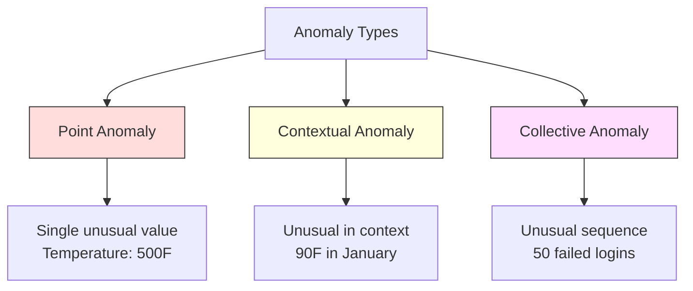
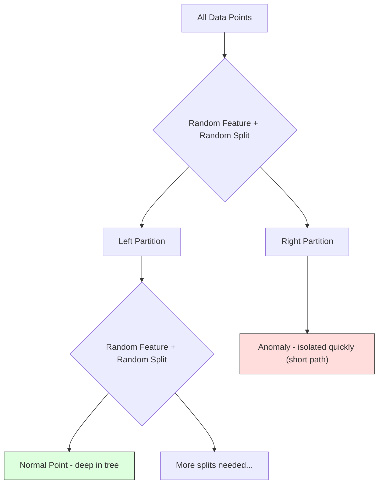
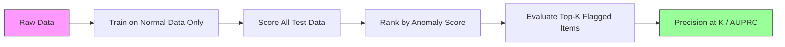

# Anomaly Detection

> Normal is easy to define. Abnormal is whatever doesn't fit.

**Type:** Build
**Language:** Python
**Prerequisites:** Phase 2, Lessons 01-09
**Time:** ~75 minutes

## Learning Objectives

- Triển khai các phương pháp phát hiện bất thường Z-score, IQR và Isolation Forest từ đầu (from scratch)
- Phân biệt giữa các loại bất thường điểm (point), ngữ cảnh (contextual) và tập thể (collective), đồng thời chọn phương pháp phát hiện phù hợp cho từng loại
- Giải thích lý do tại sao phát hiện bất thường được định hình là mô hình hóa dữ liệu bình thường thay vì phân loại các điểm bất thường
- So sánh phát hiện bất thường không giám sát (unsupervised) với phân loại có giám sát (supervised) và đánh giá sự đánh đổi giữa phạm vi bao phủ các bất thường mới và độ chính xác (precision)

## The Problem

Một thẻ tín dụng được sử dụng ở New York lúc 2 giờ chiều, sau đó ở Tokyo lúc 2 giờ 05 phút chiều. Một cảm biến nhà máy đọc 150 độ khi phạm vi bình thường là 80-120. Một máy chủ gửi 50.000 yêu cầu mỗi giây khi mức trung bình hàng ngày là 200.

Đây là những điểm bất thường. Việc tìm ra chúng rất quan trọng. Gian lận gây thiệt hại hàng tỷ đô la. Hỏng hóc thiết bị gây ra thời gian ngừng hoạt động. Xâm nhập mạng gây mất dữ liệu.

Thách thức: bạn hiếm khi có các ví dụ được gán nhãn về các điểm bất thường. Gian lận chỉ chiếm 0,1% các giao dịch. Hỏng hóc thiết bị chỉ xảy ra vài lần mỗi năm. Bạn không thể huấn luyện một bộ phân loại tiêu chuẩn vì hầu như không có gì trong lớp "bất thường" để học. Ngay cả khi bạn có một số nhãn, những bất thường bạn đã thấy không phải là loại duy nhất bạn sẽ gặp phải. Kế hoạch gian lận của ngày mai trông sẽ khác với ngày hôm nay.

Phát hiện bất thường đảo ngược vấn đề. Thay vì học những gì là bất thường, hãy học những gì là bình thường. Bất cứ điều gì lệch khỏi mức bình thường đều đáng ngờ. Cách tiếp cận này hoạt động mà không cần nhãn, thích ứng với các loại bất thường mới và mở rộng quy mô cho các tập dữ liệu khổng lồ.

## The Concept

### Types of Anomalies

Không phải tất cả các bất thường đều giống nhau:

- **Point anomalies (Bất thường điểm).** Một điểm dữ liệu đơn lẻ bất thường bất kể ngữ cảnh. Chỉ số nhiệt độ 500 độ. Một giao dịch trị giá $50,000 from an account that normally spends $50.
- **Contextual anomalies (Bất thường ngữ cảnh).** Một điểm dữ liệu bất thường dựa trên ngữ cảnh của nó. Nhiệt độ 90 độ là bình thường vào mùa hè, nhưng là bất thường vào mùa đông. Cùng một giá trị, ngữ cảnh khác nhau.
- **Collective anomalies (Bất thường tập thể).** Một chuỗi các điểm dữ liệu bất thường khi xét theo nhóm, mặc dù mỗi điểm riêng lẻ có thể là bình thường. Năm lần đăng nhập thất bại là bình thường. Năm mươi lần liên tiếp là một cuộc tấn công brute-force.

Hầu hết các phương pháp đều phát hiện bất thường điểm. Bất thường ngữ cảnh cần các đặc trưng về thời gian hoặc vị trí. Bất thường tập thể cần các phương pháp nhận biết chuỗi.



### The Unsupervised Framing

Trong phân loại tiêu chuẩn, bạn có nhãn cho cả hai lớp. Trong phát hiện bất thường, bạn thường gặp một trong ba tình huống:

1. **Fully unsupervised (Hoàn toàn không giám sát).** Không có nhãn nào cả. Bạn khớp bộ phát hiện trên tất cả dữ liệu và hy vọng các điểm bất thường đủ hiếm để không làm hỏng mô hình "bình thường".
2. **Semi-supervised (Bán giám sát).** Bạn có một tập dữ liệu sạch chỉ chứa dữ liệu bình thường. Bạn khớp trên tập sạch này và chấm điểm mọi thứ khác. Đây là thiết lập mạnh mẽ nhất khi có thể thực hiện.
3. **Weakly supervised (Giám sát yếu).** Bạn có một vài điểm bất thường được gán nhãn. Sử dụng chúng để đánh giá, không phải để huấn luyện. Huấn luyện không giám sát, sau đó đo độ chính xác/thu hồi (precision/recall) trên tập con được gán nhãn.

Thông tin quan trọng: phát hiện bất thường về cơ bản khác với phân loại. Bạn đang mô hình hóa phân phối của dữ liệu bình thường, không phải ranh giới quyết định giữa hai lớp.

### Supervised vs Unsupervised: The Tradeoff

Nếu bạn có các điểm bất thường được gán nhãn, bạn nên sử dụng chúng để huấn luyện (phân loại có giám sát) hay chỉ để đánh giá (phát hiện không giám sát)?

**Supervised (xem như phân loại):**
- Bắt được chính xác các loại bất thường bạn đã thấy trước đây
- Độ chính xác cao hơn trên các loại bất thường đã biết
- Bỏ lỡ hoàn toàn các loại bất thường mới
- Yêu cầu huấn luyện lại khi các loại bất thường mới xuất hiện
- Cần đủ các ví dụ về bất thường (thường là quá ít)

**Unsupervised (mô hình hóa bình thường, gắn cờ các sai lệch):**
- Bắt được bất kỳ sai lệch nào so với bình thường, bao gồm cả các loại mới
- Không yêu cầu các điểm bất thường được gán nhãn
- Tỷ lệ dương tính giả cao hơn (không phải mọi thứ bất thường đều xấu)
- Mạnh mẽ hơn trước sự thay đổi phân phối

Trong thực tế, các hệ thống tốt nhất kết hợp cả hai: phát hiện không giám sát để bao phủ rộng, các mô hình có giám sát cho các loại bất thường ưu tiên cao đã biết, và sự xem xét của con người cho các trường hợp mơ hồ.

### Z-Score Method

Cách tiếp cận đơn giản nhất. Tính trung bình và độ lệch chuẩn của từng đặc trưng. Gắn cờ bất kỳ điểm nào cách trung bình hơn k độ lệch chuẩn.

```text
z_score = (x - mean) / std
anomaly if |z_score| > threshold
```

Ngưỡng mặc định là 3.0 (99,7% dữ liệu bình thường nằm trong phạm vi 3 độ lệch chuẩn đối với phân phối Gaussian).

**Điểm mạnh:** Đơn giản. Nhanh. Có thể giải thích ("giá trị này cách mức bình thường 4,5 độ lệch chuẩn").

**Điểm yếu:** Giả định dữ liệu được phân phối chuẩn. Nhạy cảm với các giá trị ngoại lai (outliers) trong dữ liệu huấn luyện (các giá trị ngoại lai làm thay đổi giá trị trung bình và làm tăng độ lệch chuẩn, khiến chúng khó phát hiện hơn). Thất bại trên các phân phối đa phương thức (multimodal).

**Khi nào hoạt động tốt:** Giám sát đơn đặc trưng nơi dữ liệu có hình dạng gần giống hình chuông. Thời gian phản hồi máy chủ, dung sai sản xuất, chỉ số cảm biến với đường cơ sở ổn định.

**Khi nào thất bại:** Dữ liệu đa cụm (hai địa điểm văn phòng với nhiệt độ cơ sở khác nhau), dữ liệu bị lệch (số tiền giao dịch nơi 1000 đô la là hiếm nhưng không phải bất thường), dữ liệu có giá trị ngoại lai trong tập huấn luyện.

### IQR Method

Mạnh mẽ hơn Z-score. Sử dụng khoảng tứ phân vị (interquartile range) thay vì trung bình và độ lệch chuẩn.

```
Q1 = 25th percentile
Q3 = 75th percentile
IQR = Q3 - Q1
lower_bound = Q1 - factor * IQR
upper_bound = Q3 + factor * IQR
anomaly if x < lower_bound or x > upper_bound
```

Hệ số mặc định là 1,5.

**Điểm mạnh:** Mạnh mẽ với các giá trị ngoại lai (các phân vị không bị ảnh hưởng bởi các giá trị cực đoan). Hoạt động trên các phân phối bị lệch. Không có giả định về phân phối chuẩn.

**Điểm yếu:** Chỉ đơn biến (áp dụng cho từng đặc trưng một cách độc lập). Không thể phát hiện các bất thường chỉ bất thường khi xem xét các đặc trưng cùng nhau (một điểm có thể bình thường ở từng đặc trưng riêng lẻ nhưng bất thường trong không gian chung).

**Lưu ý thực tế:** Hệ số 1,5 trong IQR tương ứng với các râu trong biểu đồ hộp (box plot). Các điểm nằm ngoài râu là các giá trị ngoại lai tiềm năng. Sử dụng 3,0 thay vì 1,5 làm cho bộ phát hiện bảo thủ hơn (ít cờ hơn, ít dương tính giả hơn). Hệ số phù hợp phụ thuộc vào khả năng chịu đựng của bạn đối với các báo động giả.

### Isolation Forest

Thông tin quan trọng: các điểm bất thường rất ít và khác biệt. Trong một phân vùng ngẫu nhiên của dữ liệu, các điểm bất thường dễ bị cô lập hơn - chúng cần ít lần chia ngẫu nhiên hơn để tách biệt khỏi phần còn lại.



**Cách hoạt động:**
1. Xây dựng nhiều cây ngẫu nhiên (một Isolation Forest)
2. Tại mỗi nút, chọn một đặc trưng ngẫu nhiên và một giá trị chia ngẫu nhiên giữa giá trị nhỏ nhất và lớn nhất của đặc trưng đó
3. Tiếp tục chia cho đến khi mọi điểm được cô lập (trong lá riêng của nó)
4. Các điểm bất thường có độ dài đường dẫn trung bình ngắn hơn trên tất cả các cây

**Tại sao nó hoạt động:** Các điểm bình thường sống trong các vùng dày đặc. Cần nhiều lần chia ngẫu nhiên để cô lập một điểm khỏi các hàng xóm của nó. Các điểm bất thường sống trong các vùng thưa thớt. Một hoặc hai lần chia ngẫu nhiên là đủ để cô lập chúng.

Điểm bất thường dựa trên độ dài đường dẫn trung bình trên tất cả các cây, được chuẩn hóa bởi độ dài đường dẫn kỳ vọng của một cây tìm kiếm nhị phân ngẫu nhiên:

```
score(x) = 2^(-average_path_length(x) / c(n))
```

Trong đó `c(n)` là độ dài đường dẫn kỳ vọng cho n mẫu. Điểm gần 1 nghĩa là bất thường. Điểm gần 0,5 nghĩa là bình thường. Điểm gần 0 nghĩa là rất bình thường (nằm sâu trong các cụm dày đặc).

**Điểm mạnh:** Không có giả định về phân phối. Hoạt động trong không gian nhiều chiều. Mở rộng tốt (dưới tuyến tính theo kích thước mẫu vì mỗi cây sử dụng một mẫu con). Xử lý các loại đặc trưng hỗn hợp.

**Điểm yếu:** Gặp khó khăn với các bất thường trong các vùng dày đặc (hiệu ứng che khuất). Chia ngẫu nhiên kém hiệu quả khi nhiều đặc trưng không liên quan.

**Các siêu tham số chính:**
- `n_estimators`: Số lượng cây. 100 thường là đủ. Nhiều cây hơn cho điểm số ổn định hơn nhưng tính toán chậm hơn.
- `max_samples`: Số lượng mẫu mỗi cây. 256 là mặc định trong bài báo gốc. Các giá trị nhỏ hơn làm cho các cây riêng lẻ kém chính xác hơn nhưng tăng tính đa dạng. Việc lấy mẫu con là điều làm cho Isolation Forest nhanh chóng - mỗi cây chỉ thấy một phần nhỏ dữ liệu.
- `contamination`: Tỷ lệ bất thường kỳ vọng. Chỉ được sử dụng để thiết lập ngưỡng. Không ảnh hưởng đến chính các điểm số.

### Local Outlier Factor (LOF)

LOF so sánh mật độ cục bộ xung quanh một điểm với mật độ xung quanh các hàng xóm của nó. Một điểm trong vùng thưa thớt được bao quanh bởi các vùng dày đặc là bất thường.

**Cách hoạt động:**
1. Đối với mỗi điểm, tìm k hàng xóm gần nhất của nó
2. Tính mật độ tiếp cận cục bộ (mật độ của vùng lân cận là bao nhiêu)
3. So sánh mật độ của từng điểm với mật độ của các hàng xóm của nó
4. Nếu một điểm có mật độ thấp hơn nhiều so với các hàng xóm của nó, đó là một giá trị ngoại lai

**Điểm LOF:**
- LOF gần 1,0 nghĩa là mật độ tương tự như các hàng xóm (bình thường)
- LOF lớn hơn 1,0 nghĩa là mật độ thấp hơn các hàng xóm (có khả năng bất thường)
- LOF lớn hơn nhiều so với 1,0 (ví dụ: 2,0+) nghĩa là mật độ thấp hơn đáng kể (có khả năng là bất thường)

Phần "cục bộ" là rất quan trọng. Hãy xem xét một tập dữ liệu với hai cụm: một cụm dày đặc gồm 1000 điểm và một cụm thưa thớt gồm 50 điểm. Một điểm ở rìa của cụm thưa thớt không phải là bất thường toàn cục - nó có 50 hàng xóm. Nhưng nó bất thường cục bộ nếu các hàng xóm ngay lập tức của nó dày đặc hơn nó. LOF nắm bắt được sắc thái này mà các phương pháp toàn cục bỏ lỡ.

**Điểm mạnh:** Phát hiện các bất thường cục bộ (các điểm bất thường trong vùng lân cận của chúng, ngay cả khi chúng không bất thường toàn cục). Hoạt động trên các cụm có mật độ khác nhau.

**Điểm yếu:** Chậm trên các tập dữ liệu lớn (O(n^2) cho triển khai ngây thơ). Nhạy cảm với việc chọn k. Không hoạt động tốt trong không gian rất nhiều chiều (lời nguyền chiều dữ liệu ảnh hưởng đến các tính toán khoảng cách).

### Comparison

| Phương pháp | Giả định | Tốc độ | Xử lý nhiều chiều | Phát hiện bất thường cục bộ |
|--------|------------|-------|-------------------|------------------------|
| Z-score | Phân phối chuẩn | Rất nhanh | Có (theo đặc trưng) | Không |
| IQR | Không (theo đặc trưng) | Rất nhanh | Có (theo đặc trưng) | Không |
| Isolation Forest | Không | Nhanh | Có | Một phần |
| LOF | Khoảng cách có ý nghĩa | Chậm | Kém | Có |

### Evaluation Challenges

Đánh giá các bộ phát hiện bất thường khó hơn đánh giá các bộ phân loại:

- **Mất cân bằng lớp cực đoan.** Với 0,1% bất thường, việc dự đoán "bình thường" cho mọi thứ mang lại độ chính xác 99,9%. Độ chính xác là vô dụng.
- **AUROC gây hiểu lầm.** Với sự mất cân bằng nặng, AUROC có thể trông tốt ngay cả khi mô hình bỏ lỡ hầu hết các bất thường ở các ngưỡng thực tế.
- **Các chỉ số tốt hơn:** Precision@k (trong số k mục được gắn cờ hàng đầu, bao nhiêu là bất thường thực sự), AUPRC (diện tích dưới đường cong precision-recall), và recall ở một tỷ lệ dương tính giả cố định.



### Anomaly Detection Pipeline

Trong thực tế, phát hiện bất thường tuân theo quy trình làm việc này:

1. **Thu thập dữ liệu cơ sở.** Lý tưởng nhất là một khoảng thời gian mà bạn biết không có (hoặc rất ít) bất thường.
2. **Kỹ thuật đặc trưng.** Các đặc trưng thô cộng với các đặc trưng dẫn xuất (thống kê cuộn, đặc trưng thời gian, tỷ lệ).
3. **Huấn luyện bộ phát hiện.** Khớp trên dữ liệu cơ sở. Mô hình học được "bình thường" trông như thế nào.
4. **Chấm điểm dữ liệu mới.** Mỗi quan sát mới nhận được một điểm bất thường.
5. **Chọn ngưỡng.** Chọn điểm cắt điểm số. Đây là một quyết định kinh doanh: ngưỡng cao hơn nghĩa là ít báo động giả hơn nhưng bỏ lỡ nhiều bất thường hơn.
6. **Cảnh báo và điều tra.** Các điểm được gắn cờ sẽ được con người xem xét hoặc phản hồi tự động.
7. **Thu thập phản hồi.** Ghi lại xem các mục được gắn cờ là bất thường thực sự hay báo động giả. Sử dụng dữ liệu này để đánh giá bộ phát hiện và điều chỉnh ngưỡng theo thời gian.

Quy trình này không bao giờ "xong". Phân phối dữ liệu thay đổi, các loại bất thường mới xuất hiện và các ngưỡng cần điều chỉnh. Hãy coi phát hiện bất thường là một hệ thống sống, không phải là một mô hình một lần.

```figure
f3-anomaly-fence
```

## Build It

Mã trong `code/anomaly_detection.py` triển khai Z-score, IQR và Isolation Forest từ đầu.

### Z-Score Detector

```python
def zscore_detect(X, threshold=3.0):
    mean = X.mean(axis=0)
    std = X.std(axis=0)
    std[std == 0] = 1.0
    z = np.abs((X - mean) / std)
    return z.max(axis=1) > threshold
```

Đơn giản và được vector hóa. Gắn cờ một điểm nếu bất kỳ đặc trưng nào vượt quá ngưỡng.

### IQR Detector

```python
def iqr_detect(X, factor=1.5):
    q1 = np.percentile(X, 25, axis=0)
    q3 = np.percentile(X, 75, axis=0)
    iqr = q3 - q1
    iqr[iqr == 0] = 1.0
    lower = q1 - factor * iqr
    upper = q3 + factor * iqr
    outside = (X < lower) | (X > upper)
    return outside.any(axis=1)
```

### Isolation Forest from Scratch

Triển khai từ đầu xây dựng các cây cô lập phân vùng không gian đặc trưng một cách ngẫu nhiên:

```python
class IsolationTree:
    def __init__(self, max_depth):
        self.max_depth = max_depth

    def fit(self, X, depth=0):
        n, p = X.shape
        if depth >= self.max_depth or n <= 1:
            self.is_leaf = True
            self.size = n
            return self
        self.is_leaf = False
        self.feature = np.random.randint(p)
        x_min = X[:, self.feature].min()
        x_max = X[:, self.feature].max()
        if x_min == x_max:
            self.is_leaf = True
            self.size = n
            return self
        self.threshold = np.random.uniform(x_min, x_max)
        left_mask = X[:, self.feature] < self.threshold
        self.left = IsolationTree(self.max_depth).fit(X[left_mask], depth + 1)
        self.right = IsolationTree(self.max_depth).fit(X[~left_mask], depth + 1)
        return self
```

Độ dài đường dẫn để cô lập một điểm xác định điểm bất thường của nó. Đường dẫn ngắn hơn nghĩa là bất thường hơn.

Lớp `IsolationForest` bao bọc nhiều cây:

```python
class IsolationForest:
    def __init__(self, n_estimators=100, max_samples=256, seed=42):
        self.n_estimators = n_estimators
        self.max_samples = max_samples

    def fit(self, X):
        sample_size = min(self.max_samples, X.shape[0])
        max_depth = int(np.ceil(np.log2(sample_size)))
        for _ in range(self.n_estimators):
            idx = rng.choice(X.shape[0], size=sample_size, replace=False)
            tree = IsolationTree(max_depth=max_depth)
            tree.fit(X[idx])
            self.trees.append(tree)

    def anomaly_score(self, X):
        avg_path = average path length across all trees
        scores = 2.0 ** (-avg_path / c(max_samples))
        return scores
```

Hệ số chuẩn hóa `c(n)` là độ dài đường dẫn kỳ vọng của một tìm kiếm không thành công trong cây tìm kiếm nhị phân với n phần tử. Nó bằng `2 * H(n-1) - 2*(n-1)/n` trong đó `H` là số điều hòa. Sự chuẩn hóa này đảm bảo các điểm số có thể so sánh được trên các tập dữ liệu có kích thước khác nhau.

### Demo Scenarios

Mã tạo ra nhiều kịch bản kiểm tra:

1. **Cụm đơn với các giá trị ngoại lai.** Một cụm Gaussian 2D với các bất thường được tiêm vào xa trung tâm. Tất cả các phương pháp sẽ hoạt động ở đây.
2. **Dữ liệu đa phương thức.** Ba cụm có kích thước và mật độ khác nhau. Các điểm giữa các cụm là bất thường. Z-score gặp khó khăn vì phạm vi theo đặc trưng rộng.
3. **Dữ liệu nhiều chiều.** 50 đặc trưng, nhưng các bất thường chỉ khác biệt ở 5 trong số đó. Kiểm tra xem các phương pháp có thể tìm thấy các bất thường trong một tập con các đặc trưng hay không.

Mỗi bản demo so sánh tất cả các phương pháp bằng cách sử dụng precision, recall, F1 và Precision@k.

## Use It

Với sklearn (sử dụng các triển khai thư viện, không phải từ đầu):

```python
from sklearn.ensemble import IsolationForest
from sklearn.neighbors import LocalOutlierFactor

iso = IsolationForest(n_estimators=100, contamination=0.05, random_state=42)
iso.fit(X_train)
predictions = iso.predict(X_test)

lof = LocalOutlierFactor(n_neighbors=20, contamination=0.05, novelty=True)
lof.fit(X_train)
predictions = lof.predict(X_test)
```

Lưu ý `contamination` thiết lập tỷ lệ bất thường kỳ vọng. Thiết lập nó chính xác là rất quan trọng - quá thấp sẽ bỏ lỡ các bất thường, quá cao sẽ tạo ra các báo động giả.

Mã trong `anomaly_detection.py` so sánh các triển khai từ đầu với sklearn trên cùng một dữ liệu.

### sklearn Contamination Parameter

Tham số `contamination` trong sklearn xác định ngưỡng để chuyển đổi các điểm bất thường liên tục thành các dự đoán nhị phân. Nó không thay đổi các điểm số cơ bản.

```python
iso_5 = IsolationForest(contamination=0.05)
iso_10 = IsolationForest(contamination=0.10)
```

Cả hai đều tạo ra cùng một điểm bất thường. Nhưng `iso_5` gắn cờ 5% hàng đầu trong khi `iso_10` gắn cờ 10% hàng đầu. Nếu bạn không biết tỷ lệ bất thường thực sự (bạn thường không biết), hãy đặt contamination thành "auto" và làm việc trực tiếp với các điểm số thô. Thiết lập ngưỡng của riêng bạn dựa trên sự đánh đổi chi phí giữa dương tính giả và âm tính giả.

### One-Class SVM

Một bộ phát hiện bất thường không giám sát khác đáng biết. One-Class SVM khớp một ranh giới xung quanh dữ liệu bình thường trong không gian đặc trưng nhiều chiều (sử dụng thủ thuật kernel).

```python
from sklearn.svm import OneClassSVM

oc_svm = OneClassSVM(kernel="rbf", gamma="auto", nu=0.05)
oc_svm.fit(X_train)
predictions = oc_svm.predict(X_test)
```

Tham số `nu` xấp xỉ tỷ lệ bất thường. One-Class SVM hoạt động tốt trên các tập dữ liệu nhỏ đến trung bình nhưng không mở rộng quy mô cho dữ liệu rất lớn (ma trận kernel tăng theo bậc hai).

### Autoencoder Approach (Preview)

Autoencoder là các mạng thần kinh học cách nén và tái tạo dữ liệu. Huấn luyện trên dữ liệu bình thường. Tại thời điểm kiểm tra, các bất thường có sai số tái tạo cao vì mạng chỉ học cách tái tạo các mẫu bình thường.

Điều này được đề cập trong Giai đoạn 3 (Deep Learning), nhưng nguyên tắc vẫn giống nhau: mô hình hóa những gì là bình thường, gắn cờ những gì lệch khỏi nó.

### Ensemble Anomaly Detection

Cũng giống như các phương pháp ensemble cải thiện phân loại (Bài 11), việc kết hợp nhiều bộ phát hiện bất thường giúp cải thiện khả năng phát hiện. Cách tiếp cận đơn giản nhất:

1. Chạy nhiều bộ phát hiện (Z-score, IQR, Isolation Forest, LOF)
2. Chuẩn hóa điểm số của mỗi bộ phát hiện về [0, 1]
3. Lấy trung bình các điểm số đã chuẩn hóa
4. Gắn cờ các điểm trên ngưỡng dựa trên điểm trung bình

Điều này làm giảm dương tính giả vì các phương pháp khác nhau có các chế độ thất bại khác nhau. Một điểm được gắn cờ bởi cả bốn phương pháp gần như chắc chắn là bất thường. Một điểm chỉ được gắn cờ bởi một phương pháp có thể là một đặc điểm kỳ quặc của phương pháp đó.

Các ensemble phức tạp hơn sẽ trọng số mỗi bộ phát hiện theo độ tin cậy ước tính của nó (được đo trên tập xác thực với các bất thường đã biết, nếu có).

### Production Considerations

1. **Threshold drift (Trôi ngưỡng).** Khi phân phối dữ liệu thay đổi, một ngưỡng cố định trở nên lỗi thời. Giám sát phân phối các điểm bất thường và điều chỉnh định kỳ.
2. **Alert fatigue (Mệt mỏi vì cảnh báo).** Quá nhiều báo động giả và người vận hành ngừng chú ý. Bắt đầu với ngưỡng cao (ít cảnh báo hơn, đáng tin cậy hơn) và hạ thấp nó khi niềm tin được xây dựng.
3. **Ensemble approach.** Trong sản xuất, kết hợp nhiều bộ phát hiện. Chỉ gắn cờ một điểm nếu nhiều phương pháp đồng ý rằng nó bất thường. Điều này làm giảm đáng kể dương tính giả.
4. **Feature engineering.** Các đặc trưng thô hiếm khi là đủ. Thêm thống kê cuộn, tỷ lệ, thời gian kể từ sự kiện cuối cùng và các đặc trưng cụ thể của miền. Một tập đặc trưng tốt quan trọng hơn việc chọn bộ phát hiện.
5. **Feedback loop.** Khi người vận hành điều tra các mục được gắn cờ và xác nhận hoặc bác bỏ chúng, hãy đưa phản hồi này trở lại hệ thống. Tích lũy dữ liệu được gán nhãn theo thời gian để đánh giá và cải thiện bộ phát hiện.

## Ship It

Bài học này tạo ra:
- `outputs/skill-anomaly-detector.md` -- một kỹ năng quyết định để chọn bộ phát hiện phù hợp
- `code/anomaly_detection.py` -- Z-score, IQR và Isolation Forest từ đầu, với sự so sánh với sklearn

### Choosing a Threshold

Điểm bất thường là liên tục. Bạn cần một ngưỡng để đưa ra các quyết định nhị phân. Đây là một quyết định kinh doanh, không phải kỹ thuật.

Xem xét hai kịch bản:
- **Phát hiện gian lận.** Bỏ lỡ gian lận rất tốn kém (hoàn tiền, niềm tin của khách hàng). Báo động giả khiến một nhà phân tích con người mất 5 phút để điều tra. Thiết lập ngưỡng thấp để bắt được nhiều gian lận hơn, chấp nhận nhiều báo động giả hơn.
- **Bảo trì thiết bị.** Một báo động giả nghĩa là một lần tắt máy không cần thiết gây thiệt hại $50,000. A missed failure means a $500.000 tiền sửa chữa. Thiết lập ngưỡng để cân bằng các chi phí này.

Trong cả hai trường hợp, ngưỡng tối ưu phụ thuộc vào tỷ lệ chi phí giữa dương tính giả và âm tính giả. Vẽ precision và recall ở các ngưỡng khác nhau, phủ hàm chi phí lên và chọn điểm chi phí tối thiểu.

### Scaling to Production

Để phát hiện bất thường thời gian thực trong sản xuất:

1. **Huấn luyện theo lô, chấm điểm trực tuyến.** Huấn luyện mô hình định kỳ (hàng ngày, hàng tuần) trên dữ liệu bình thường gần đây. Chấm điểm mỗi quan sát mới khi nó đến.
2. **Tính toán đặc trưng phải khớp.** Nếu bạn đã huấn luyện với thống kê cuộn trong 30 ngày, bạn cần 30 ngày lịch sử để tính toán các đặc trưng cho một quan sát mới. Đệm lịch sử cần thiết.
3. **Giám sát phân phối điểm số.** Theo dõi phân phối các điểm bất thường theo thời gian. Nếu điểm trung vị trôi lên trên, hoặc là dữ liệu đang thay đổi hoặc mô hình đã cũ.
4. **Explainability (Khả năng giải thích).** Khi bạn gắn cờ một bất thường, hãy nói lý do. Z-score: "Đặc trưng X cao hơn mức bình thường 4,2 độ lệch chuẩn." Isolation Forest: "Điểm này được cô lập trong trung bình 3,1 lần chia (các điểm bình thường mất 8,5)."

## Exercises

1. **Threshold tuning.** Chạy bộ phát hiện Z-score với các ngưỡng từ 1,0 đến 5,0 với bước nhảy 0,5. Vẽ precision và recall tại mỗi ngưỡng. Đâu là điểm ngọt (sweet spot) cho dữ liệu của bạn?

2. **Multivariate anomalies.** Tạo dữ liệu 2D nơi mỗi đặc trưng riêng lẻ trông bình thường, nhưng sự kết hợp là bất thường (ví dụ: các điểm xa đường chéo cụm chính). Cho thấy rằng Z-score theo đặc trưng bỏ lỡ những điểm này nhưng Isolation Forest bắt được chúng.

3. **LOF from scratch.** Triển khai Local Outlier Factor sử dụng k-hàng xóm gần nhất. So sánh với LocalOutlierFactor của sklearn trên cùng một dữ liệu. Sử dụng k=10 và k=50 -- việc chọn k ảnh hưởng đến kết quả như thế nào?

4. **Streaming anomaly detection.** Sửa đổi bộ phát hiện Z-score để hoạt động trong môi trường phát trực tuyến: cập nhật trung bình và phương sai chạy khi các điểm mới đến (thuật toán trực tuyến của Welford). So sánh với Z-score theo lô trên cùng một dữ liệu.

5. **Real-world evaluation.** Lấy một tập dữ liệu với các bất thường đã biết (ví dụ: gian lận thẻ tín dụng từ Kaggle). Đánh giá tất cả bốn phương pháp bằng cách sử dụng precision@100, precision@500 và AUPRC. Phương pháp nào hoạt động tốt nhất? Tại sao?

## Key Terms

| Thuật ngữ | Mọi người nói | Ý nghĩa thực sự |
|------|----------------|----------------------|
| Anomaly | "Giá trị ngoại lai, điểm bất thường" | Một điểm dữ liệu lệch đáng kể so với mẫu mong đợi của dữ liệu bình thường |
| Point anomaly | "Một giá trị kỳ lạ đơn lẻ" | Một quan sát cá nhân bất thường bất kể ngữ cảnh |
| Contextual anomaly | "Giá trị bình thường, sai ngữ cảnh" | Một quan sát bất thường dựa trên ngữ cảnh của nó (thời gian, vị trí, v.v.) nhưng có thể bình thường trong ngữ cảnh khác |
| Isolation Forest | "Chia ngẫu nhiên để tìm giá trị ngoại lai" | Một ensemble các cây ngẫu nhiên cô lập các bất thường với ít lần chia hơn các điểm bình thường |
| Local Outlier Factor | "So sánh mật độ với hàng xóm" | Một phương pháp gắn cờ các điểm có mật độ cục bộ thấp hơn nhiều so với mật độ của hàng xóm |
| Z-score | "Độ lệch chuẩn từ trung bình" | (x - trung bình) / độ lệch chuẩn, đo lường khoảng cách của một điểm từ trung tâm theo đơn vị độ lệch chuẩn |
| IQR | "Khoảng tứ phân vị" | Q3 - Q1, đo lường sự lan rộng của 50% dữ liệu ở giữa, được sử dụng để phát hiện giá trị ngoại lai mạnh mẽ |
| Contamination | "Tỷ lệ bất thường kỳ vọng" | Một siêu tham số cho bộ phát hiện biết tỷ lệ dữ liệu nào nó nên gắn cờ là bất thường |
| Precision@k | "Trong số k cờ hàng đầu, bao nhiêu là thực" | Precision được tính chỉ trên k điểm đáng ngờ nhất, hữu ích cho phát hiện bất thường mất cân bằng |
| AUPRC | "Diện tích dưới đường cong precision-recall" | Một chỉ số tóm tắt hiệu suất precision-recall trên tất cả các ngưỡng, tốt hơn AUROC cho dữ liệu mất cân bằng |

## Further Reading

- [Liu et al., Isolation Forest (2008)](https://cs.nju.edu.cn/zhouzh/zhouzh.files/publication/icdm08b.pdf) -- bài báo gốc về Isolation Forest
- [Breunig et al., LOF: Identifying Density-Based Local Outliers (2000)](https://dl.acm.org/doi/10.1145/342009.335388) -- bài báo gốc về LOF
- [scikit-learn Outlier Detection docs](https://scikit-learn.org/stable/modules/outlier_detection.html) -- tổng quan về tất cả các bộ phát hiện bất thường của sklearn
- [Chandola et al., Anomaly Detection: A Survey (2009)](https://dl.acm.org/doi/10.1145/1541880.1541882) -- khảo sát toàn diện về các phương pháp phát hiện bất thường
- [Goldstein and Uchida, A Comparative Evaluation of Unsupervised Anomaly Detection Algorithms (2016)](https://journals.plos.org/plosone/article?id=10.1371/journal.pone.0152173) -- so sánh thực nghiệm 10 phương pháp trên các tập dữ liệu thực tế