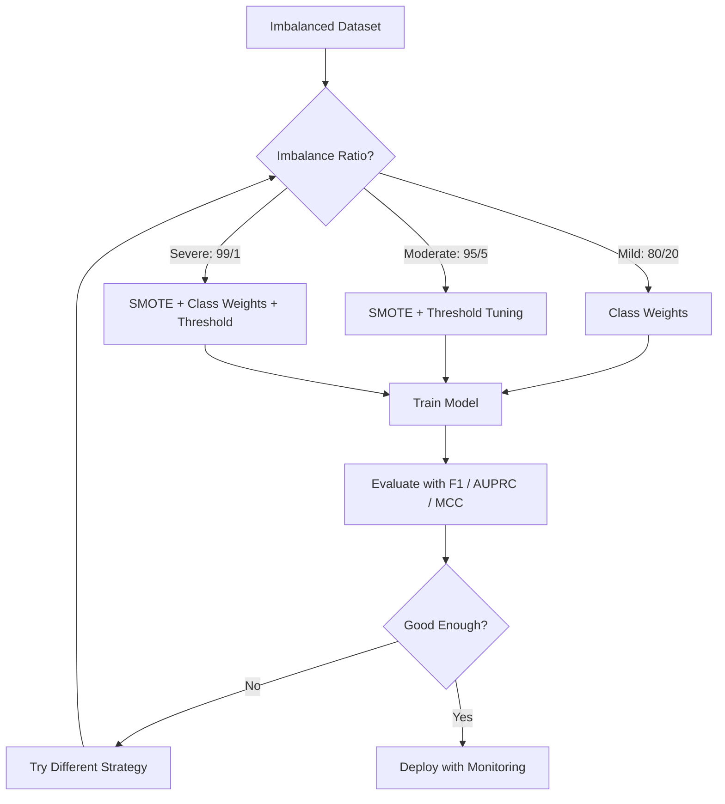
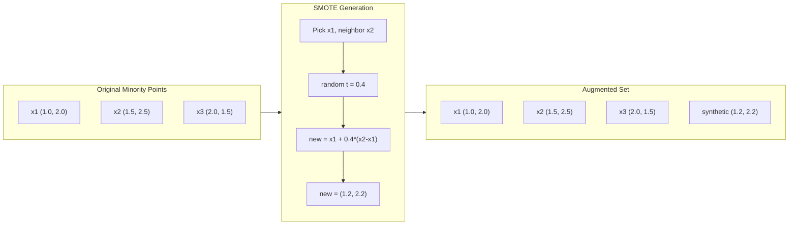
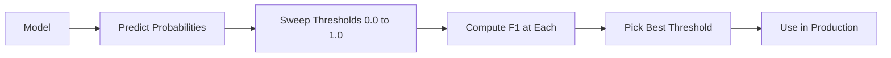
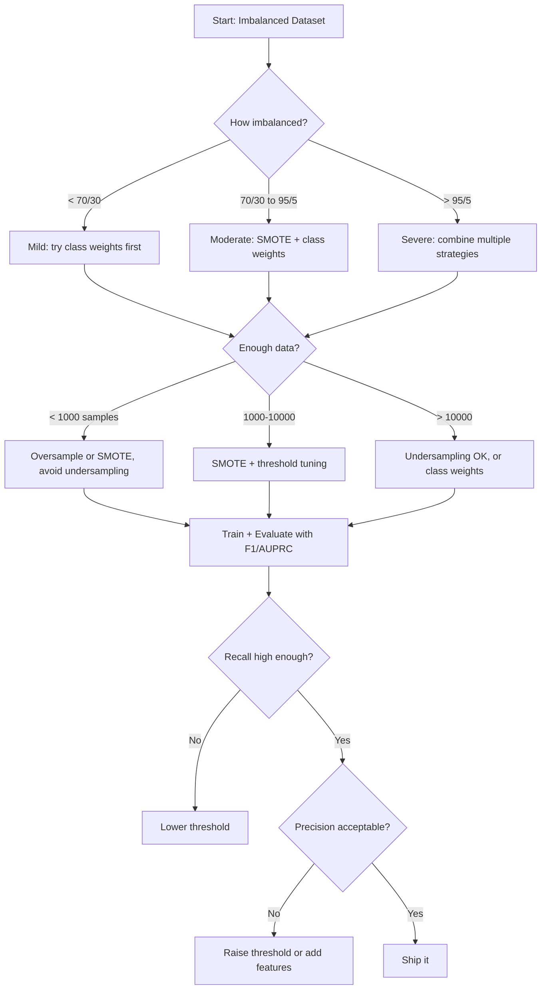

# Xử lý dữ liệu mất cân bằng (Imbalanced Data)

> Khi 99% dữ liệu của bạn là "bình thường", độ chính xác (accuracy) chỉ là một lời nói dối.

**Type:** Build
**Language:** Python
**Prerequisites:** Phase 2, Lessons 01-09 (đặc biệt là các chỉ số đánh giá)
**Time:** ~90 phút

## Mục tiêu học tập

- Triển khai SMOTE từ đầu và giải thích sự khác biệt giữa lấy mẫu quá mức tổng hợp (synthetic oversampling) và sao chép ngẫu nhiên
- Đánh giá các bộ phân loại mất cân bằng bằng F1, AUPRC và Matthews Correlation Coefficient thay vì accuracy
- So sánh trọng số lớp (class weighting), điều chỉnh ngưỡng (threshold tuning) và các chiến lược lấy mẫu lại, từ đó chọn phương pháp phù hợp cho một tỷ lệ mất cân bằng nhất định
- Xây dựng một pipeline dữ liệu mất cân bằng hoàn chỉnh kết hợp SMOTE, trọng số lớp và tối ưu hóa ngưỡng

## Vấn đề

Bạn xây dựng một mô hình phát hiện gian lận. Nó đạt độ chính xác 99,9%. Bạn ăn mừng. Sau đó, bạn nhận ra nó dự đoán "không gian lận" cho mọi giao dịch.

Đây không phải là lỗi. Đó là điều hợp lý cần làm khi chỉ có 0,1% giao dịch là gian lận. Mô hình học được rằng việc luôn đoán lớp đa số sẽ giảm thiểu sai số tổng thể. Nó đúng về mặt kỹ thuật nhưng hoàn toàn vô dụng.

Điều này xảy ra ở khắp mọi nơi trong các bài toán phân loại thực tế. Chẩn đoán bệnh: tỷ lệ dương tính 1%. Xâm nhập mạng: 0,01% là tấn công. Lỗi sản xuất: 0,5% sản phẩm lỗi. Lọc thư rác: 20% là spam. Dự đoán rời bỏ khách hàng: 5% khách hàng rời bỏ. Lớp thiểu số càng quan trọng thì nó càng có xu hướng hiếm gặp.

Accuracy thất bại vì nó coi mọi dự đoán đúng đều như nhau. Gán nhãn đúng một giao dịch hợp lệ và phát hiện đúng một vụ gian lận đều được tính là một điểm accuracy. Nhưng việc phát hiện gian lận mới là lý do tồn tại của mô hình. Chúng ta cần các chỉ số, kỹ thuật và chiến lược huấn luyện buộc mô hình phải chú ý đến lớp hiếm nhưng quan trọng.

## Khái niệm

### Tại sao Accuracy thất bại

Xét một tập dữ liệu có 1000 mẫu: 990 âm tính, 10 dương tính. Một mô hình luôn dự đoán âm tính:

| | Dự đoán Dương tính | Dự đoán Âm tính |
|--|---|---|
| Thực tế Dương tính | 0 (TP) | 10 (FN) |
| Thực tế Âm tính | 0 (FP) | 990 (TN) |

Accuracy = (0 + 990) / 1000 = 99,0%

Mô hình phát hiện được 0 vụ gian lận. 0 ca bệnh. 0 lỗi sản phẩm. Nhưng accuracy lại báo 99%. Đây là lý do tại sao accuracy nguy hiểm đối với các bài toán mất cân bằng.

### Các chỉ số tốt hơn

**Precision** = TP / (TP + FP). Trong tất cả những gì được gắn cờ là dương tính, bao nhiêu là thực sự dương tính? Precision cao nghĩa là ít báo động giả.

**Recall** = TP / (TP + FN). Trong tất cả những gì thực sự dương tính, chúng ta đã bắt được bao nhiêu? Recall cao nghĩa là ít bỏ sót các trường hợp dương tính.

**F1 Score** = 2 * precision * recall / (precision + recall). Trung bình điều hòa. Phạt sự mất cân bằng cực đoan giữa precision và recall nặng hơn so với trung bình cộng.

**F-beta Score** = (1 + beta^2) * precision * recall / (beta^2 * precision + recall). Khi beta > 1, recall quan trọng hơn. Khi beta < 1, precision quan trọng hơn. F2 thường được dùng trong phát hiện gian lận (bỏ sót gian lận tệ hơn là báo động giả).

**AUPRC** (Diện tích dưới đường cong Precision-Recall). Giống AUC-ROC nhưng cung cấp nhiều thông tin hơn cho dữ liệu mất cân bằng. Một bộ phân loại ngẫu nhiên có AUPRC bằng với tỷ lệ lớp dương tính (không phải 0,5 như ROC). Điều này giúp dễ dàng nhận thấy các cải tiến hơn.

**Matthews Correlation Coefficient** = (TP * TN - FP * FN) / sqrt((TP+FP)(TP+FN)(TN+FP)(TN+FN)). Phạm vi từ -1 đến +1. Chỉ cho điểm cao khi mô hình thực hiện tốt trên cả hai lớp. Cân bằng ngay cả khi các lớp có kích thước rất khác nhau.

Đối với mô hình "luôn dự đoán âm tính" ở trên: precision = 0/0 (không xác định, thường đặt là 0), recall = 0/10 = 0, F1 = 0, MCC = 0. Các chỉ số này xác định chính xác mô hình là vô giá trị.

### Pipeline dữ liệu mất cân bằng



### SMOTE: Kỹ thuật lấy mẫu quá mức thiểu số tổng hợp

Lấy mẫu quá mức ngẫu nhiên (Random oversampling) sao chép các mẫu thiểu số hiện có. Cách này hiệu quả nhưng có nguy cơ overfitting vì mô hình nhìn thấy các điểm giống hệt nhau lặp đi lặp lại.

SMOTE tạo ra các mẫu thiểu số tổng hợp mới, hợp lý nhưng không phải là bản sao. Thuật toán:

1. Với mỗi mẫu thiểu số x, tìm k láng giềng gần nhất của nó trong số các mẫu thiểu số khác
2. Chọn ngẫu nhiên một láng giềng
3. Tạo một mẫu mới trên đoạn thẳng nối giữa x và láng giềng đó

Công thức: `new_sample = x + random(0, 1) * (neighbor - x)`

Cách này nội suy giữa các điểm thiểu số thực, tạo ra các mẫu trong cùng vùng không gian đặc trưng mà không chỉ đơn thuần sao chép dữ liệu hiện có.



### So sánh các chiến lược lấy mẫu

**Random Oversampling**: sao chép các mẫu thiểu số để khớp với số lượng lớp đa số.
- Ưu điểm: đơn giản, không mất thông tin
- Nhược điểm: các bản sao chính xác gây overfitting, tăng thời gian huấn luyện

**Random Undersampling**: loại bỏ các mẫu đa số để khớp với số lượng lớp thiểu số.
- Ưu điểm: huấn luyện nhanh, đơn giản
- Nhược điểm: loại bỏ dữ liệu đa số có khả năng hữu ích, phương sai cao hơn

**SMOTE**: tạo các mẫu thiểu số tổng hợp thông qua nội suy.
- Ưu điểm: tạo ra các điểm dữ liệu mới, giảm overfitting so với random oversampling
- Nhược điểm: có thể tạo ra các mẫu nhiễu gần ranh giới quyết định, không tính đến phân phối của lớp đa số

| Chiến lược | Dữ liệu thay đổi | Rủi ro | Khi nào nên dùng |
|----------|-------------|------|-------------|
| Oversample | Sao chép thiểu số | Overfitting | Tập dữ liệu nhỏ, mất cân bằng vừa phải |
| Undersample | Loại bỏ đa số | Mất thông tin | Tập dữ liệu lớn, muốn huấn luyện nhanh |
| SMOTE | Thêm thiểu số tổng hợp | Nhiễu ranh giới | Mất cân bằng vừa phải, đủ mẫu thiểu số cho k-NN |

### Trọng số lớp (Class Weights)

Thay vì thay đổi dữ liệu, hãy thay đổi cách mô hình xử lý sai số. Gán trọng số cao hơn cho việc phân loại sai lớp thiểu số.

Đối với bài toán nhị phân với 950 mẫu âm tính và 50 mẫu dương tính:
- Trọng số cho lớp âm tính = n_samples / (2 * n_negative) = 1000 / (2 * 950) = 0,526
- Trọng số cho lớp dương tính = n_samples / (2 * n_positive) = 1000 / (2 * 50) = 10,0

Lớp dương tính nhận trọng số gấp 19 lần. Phân loại sai một mẫu dương tính có chi phí bằng phân loại sai 19 mẫu âm tính. Mô hình buộc phải chú ý đến lớp thiểu số.

Trong logistic regression, điều này sửa đổi hàm mất mát:

```
weighted_loss = -sum(w_i * [y_i * log(p_i) + (1-y_i) * log(1-p_i)])
```

trong đó w_i phụ thuộc vào lớp của mẫu i.

Trọng số lớp về mặt toán học tương đương với oversampling trong kỳ vọng, nhưng không tạo ra các điểm dữ liệu mới. Điều này làm cho chúng nhanh hơn và tránh được rủi ro overfitting của các mẫu bị sao chép.

### Điều chỉnh ngưỡng (Threshold Tuning)

Hầu hết các bộ phân loại xuất ra xác suất. Ngưỡng mặc định là 0,5: nếu P(dương tính) >= 0,5, dự đoán là dương tính. Nhưng 0,5 là tùy ý. Khi các lớp mất cân bằng, ngưỡng tối ưu thường thấp hơn nhiều.

Quy trình:
1. Huấn luyện mô hình
2. Lấy xác suất dự đoán trên tập validation
3. Quét các ngưỡng từ 0,0 đến 1,0
4. Tính F1 (hoặc chỉ số bạn chọn) tại mỗi ngưỡng
5. Chọn ngưỡng tối đa hóa chỉ số của bạn



Một mô hình có thể xuất ra P(gian lận) = 0,15 cho một giao dịch gian lận. Tại ngưỡng 0,5, nó được phân loại là không gian lận. Tại ngưỡng 0,10, nó được phát hiện chính xác. Việc hiệu chuẩn xác suất (probability calibration) ít quan trọng hơn việc xếp hạng -- miễn là gian lận có xác suất cao hơn không gian lận, thì tồn tại một ngưỡng phân tách chúng.

### Học tập nhạy cảm với chi phí (Cost-Sensitive Learning)

Sự tổng quát hóa của trọng số lớp. Thay vì chi phí đồng nhất, hãy gán chi phí phân loại sai cụ thể:

| | Dự đoán Dương tính | Dự đoán Âm tính |
|--|---|---|
| Thực tế Dương tính | 0 (đúng) | C_FN = 100 |
| Thực tế Âm tính | C_FP = 1 | 0 (đúng) |

Bỏ sót một giao dịch gian lận (FN) tốn kém gấp 100 lần so với một báo động giả (FP). Mô hình tối ưu hóa cho tổng chi phí, không phải tổng số lỗi.

Đây là phương pháp có nguyên tắc nhất khi bạn có thể ước tính chi phí thực tế. Một chẩn đoán ung thư bị bỏ sót có chi phí rất khác so với một báo động giả dẫn đến một lần sinh thiết thừa. Việc làm rõ các chi phí này buộc phải thực hiện các đánh đổi đúng đắn.

### Lưu đồ quyết định



```figure
class-imbalance
```

## Xây dựng

### Bước 1: Tạo tập dữ liệu mất cân bằng

```python
import numpy as np


def make_imbalanced_data(n_majority=950, n_minority=50, seed=42):
    rng = np.random.RandomState(seed)

    X_maj = rng.randn(n_majority, 2) * 1.0 + np.array([0.0, 0.0])
    X_min = rng.randn(n_minority, 2) * 0.8 + np.array([2.5, 2.5])

    X = np.vstack([X_maj, X_min])
    y = np.concatenate([np.zeros(n_majority), np.ones(n_minority)])

    shuffle_idx = rng.permutation(len(y))
    return X[shuffle_idx], y[shuffle_idx]
```

### Bước 2: SMOTE từ đầu

```python
def euclidean_distance(a, b):
    return np.sqrt(np.sum((a - b) ** 2))


def find_k_neighbors(X, idx, k):
    distances = []
    for i in range(len(X)):
        if i == idx:
            continue
        d = euclidean_distance(X[idx], X[i])
        distances.append((i, d))
    distances.sort(key=lambda x: x[1])
    return [d[0] for d in distances[:k]]


def smote(X_minority, k=5, n_synthetic=100, seed=42):
    rng = np.random.RandomState(seed)
    n_samples = len(X_minority)
    k = min(k, n_samples - 1)
    synthetic = []

    for _ in range(n_synthetic):
        idx = rng.randint(0, n_samples)
        neighbors = find_k_neighbors(X_minority, idx, k)
        neighbor_idx = neighbors[rng.randint(0, len(neighbors))]
        t = rng.random()
        new_point = X_minority[idx] + t * (X_minority[neighbor_idx] - X_minority[idx])
        synthetic.append(new_point)

    return np.array(synthetic)
```

### Bước 3: Random oversampling và undersampling

```python
def random_oversample(X, y, seed=42):
    rng = np.random.RandomState(seed)
    classes, counts = np.unique(y, return_counts=True)
    max_count = counts.max()

    X_resampled = list(X)
    y_resampled = list(y)

    for cls, count in zip(classes, counts):
        if count < max_count:
            cls_indices = np.where(y == cls)[0]
            n_needed = max_count - count
            chosen = rng.choice(cls_indices, size=n_needed, replace=True)
            X_resampled.extend(X[chosen])
            y_resampled.extend(y[chosen])

    X_out = np.array(X_resampled)
    y_out = np.array(y_resampled)
    shuffle = rng.permutation(len(y_out))
    return X_out[shuffle], y_out[shuffle]


def random_undersample(X, y, seed=42):
    rng = np.random.RandomState(seed)
    classes, counts = np.unique(y, return_counts=True)
    min_count = counts.min()

    X_resampled = []
    y_resampled = []

    for cls in classes:
        cls_indices = np.where(y == cls)[0]
        chosen = rng.choice(cls_indices, size=min_count, replace=False)
        X_resampled.extend(X[chosen])
        y_resampled.extend(y[chosen])

    X_out = np.array(X_resampled)
    y_out = np.array(y_resampled)
    shuffle = rng.permutation(len(y_out))
    return X_out[shuffle], y_out[shuffle]
```

### Bước 4: Logistic regression với trọng số lớp

```python
def sigmoid(z):
    return 1.0 / (1.0 + np.exp(-np.clip(z, -500, 500)))


def logistic_regression_weighted(X, y, weights, lr=0.01, epochs=200):
    n_samples, n_features = X.shape
    w = np.zeros(n_features)
    b = 0.0

    for _ in range(epochs):
        z = X @ w + b
        pred = sigmoid(z)
        error = pred - y
        weighted_error = error * weights

        gradient_w = (X.T @ weighted_error) / n_samples
        gradient_b = np.mean(weighted_error)

        w -= lr * gradient_w
        b -= lr * gradient_b

    return w, b


def compute_class_weights(y):
    classes, counts = np.unique(y, return_counts=True)
    n_samples = len(y)
    n_classes = len(classes)
    weight_map = {}
    for cls, count in zip(classes, counts):
        weight_map[cls] = n_samples / (n_classes * count)
    return np.array([weight_map[yi] for yi in y])
```

### Bước 5: Điều chỉnh ngưỡng

```python
def find_optimal_threshold(y_true, y_probs, metric="f1"):
    best_threshold = 0.5
    best_score = -1.0

    for threshold in np.arange(0.05, 0.96, 0.01):
        y_pred = (y_probs >= threshold).astype(int)
        tp = np.sum((y_pred == 1) & (y_true == 1))
        fp = np.sum((y_pred == 1) & (y_true == 0))
        fn = np.sum((y_pred == 0) & (y_true == 1))

        if metric == "f1":
            precision = tp / (tp + fp) if (tp + fp) > 0 else 0.0
            recall = tp / (tp + fn) if (tp + fn) > 0 else 0.0
            score = 2 * precision * recall / (precision + recall) if (precision + recall) > 0 else 0.0
        elif metric == "recall":
            score = tp / (tp + fn) if (tp + fn) > 0 else 0.0
        elif metric == "precision":
            score = tp / (tp + fp) if (tp + fp) > 0 else 0.0

        if score > best_score:
            best_score = score
            best_threshold = threshold

    return best_threshold, best_score
```

### Bước 6: Các hàm đánh giá

```python
def confusion_matrix_values(y_true, y_pred):
    tp = np.sum((y_pred == 1) & (y_true == 1))
    tn = np.sum((y_pred == 0) & (y_true == 0))
    fp = np.sum((y_pred == 1) & (y_true == 0))
    fn = np.sum((y_pred == 0) & (y_true == 1))
    return tp, tn, fp, fn


def compute_metrics(y_true, y_pred):
    tp, tn, fp, fn = confusion_matrix_values(y_true, y_pred)
    accuracy = (tp + tn) / (tp + tn + fp + fn)
    precision = tp / (tp + fp) if (tp + fp) > 0 else 0.0
    recall = tp / (tp + fn) if (tp + fn) > 0 else 0.0
    f1 = 2 * precision * recall / (precision + recall) if (precision + recall) > 0 else 0.0

    denom = np.sqrt(float((tp + fp) * (tp + fn) * (tn + fp) * (tn + fn)))
    mcc = (tp * tn - fp * fn) / denom if denom > 0 else 0.0

    return {
        "accuracy": accuracy,
        "precision": precision,
        "recall": recall,
        "f1": f1,
        "mcc": mcc,
    }
```

### Bước 7: So sánh tất cả các phương pháp

```python
X, y = make_imbalanced_data(950, 50, seed=42)
split = int(0.8 * len(y))
X_train, X_test = X[:split], X[split:]
y_train, y_test = y[:split], y[split:]

# Baseline: no treatment
w_base, b_base = logistic_regression_weighted(
    X_train, y_train, np.ones(len(y_train)), lr=0.1, epochs=300
)
probs_base = sigmoid(X_test @ w_base + b_base)
preds_base = (probs_base >= 0.5).astype(int)

# Oversampled
X_over, y_over = random_oversample(X_train, y_train)
w_over, b_over = logistic_regression_weighted(
    X_over, y_over, np.ones(len(y_over)), lr=0.1, epochs=300
)
preds_over = (sigmoid(X_test @ w_over + b_over) >= 0.5).astype(int)

# SMOTE
minority_mask = y_train == 1
X_minority = X_train[minority_mask]
synthetic = smote(X_minority, k=5, n_synthetic=len(y_train) - 2 * int(minority_mask.sum()))
X_smote = np.vstack([X_train, synthetic])
y_smote = np.concatenate([y_train, np.ones(len(synthetic))])
w_sm, b_sm = logistic_regression_weighted(
    X_smote, y_smote, np.ones(len(y_smote)), lr=0.1, epochs=300
)
preds_smote = (sigmoid(X_test @ w_sm + b_sm) >= 0.5).astype(int)

# Class weights
sample_weights = compute_class_weights(y_train)
w_cw, b_cw = logistic_regression_weighted(
    X_train, y_train, sample_weights, lr=0.1, epochs=300
)
probs_cw = sigmoid(X_test @ w_cw + b_cw)
preds_cw = (probs_cw >= 0.5).astype(int)

# Threshold tuning (tune on held-out validation set, not test set)
probs_val = sigmoid(X_val @ w_cw + b_cw)
best_thresh, best_f1 = find_optimal_threshold(y_val, probs_val, metric="f1")
preds_thresh = (probs_cw >= best_thresh).astype(int)
```

Tệp mã chạy tất cả những điều này trong một tập lệnh duy nhất và in kết quả.

## Sử dụng

Với scikit-learn và imbalanced-learn, các kỹ thuật này chỉ là một dòng mã:

```python
from sklearn.linear_model import LogisticRegression
from sklearn.metrics import classification_report, f1_score
from sklearn.model_selection import train_test_split
from imblearn.over_sampling import SMOTE
from imblearn.under_sampling import RandomUnderSampler
from imblearn.pipeline import Pipeline

X_train, X_test, y_train, y_test = train_test_split(X, y, stratify=y)

model_weighted = LogisticRegression(class_weight="balanced")
model_weighted.fit(X_train, y_train)
print(classification_report(y_test, model_weighted.predict(X_test)))

smote = SMOTE(random_state=42)
X_resampled, y_resampled = smote.fit_resample(X_train, y_train)
model_smote = LogisticRegression()
model_smote.fit(X_resampled, y_resampled)
print(classification_report(y_test, model_smote.predict(X_test)))

pipeline = Pipeline([
    ("smote", SMOTE()),
    ("model", LogisticRegression(class_weight="balanced")),
])
pipeline.fit(X_train, y_train)
print(classification_report(y_test, pipeline.predict(X_test)))
```

Các triển khai từ đầu cho thấy chính xác những gì mỗi kỹ thuật thực hiện. SMOTE chỉ là nội suy k-NN trên lớp thiểu số. Trọng số lớp nhân với hàm mất mát. Điều chỉnh ngưỡng là một vòng lặp for qua các điểm cắt. Không có phép thuật nào ở đây cả.

## Triển khai

Bài học này tạo ra:
- `outputs/skill-imbalanced-data.md` -- một danh sách kiểm tra quyết định để xử lý các bài toán phân loại mất cân bằng

## Bài tập

1. **Borderline-SMOTE**: sửa đổi triển khai SMOTE để chỉ tạo các mẫu tổng hợp cho các điểm thiểu số gần ranh giới quyết định (những điểm có k-láng giềng gần nhất bao gồm các mẫu lớp đa số). So sánh kết quả với SMOTE tiêu chuẩn trên tập dữ liệu có các lớp chồng lấp.

2. **Tối ưu hóa ma trận chi phí**: triển khai học tập nhạy cảm với chi phí trong đó ma trận chi phí là một tham số. Tạo một hàm nhận ma trận chi phí và trả về các dự đoán tối ưu giúp giảm thiểu chi phí kỳ vọng. Kiểm tra với các tỷ lệ chi phí khác nhau (1:10, 1:100, 1:1000) và vẽ biểu đồ sự thay đổi của đánh đổi precision-recall.

3. **Hiệu chuẩn ngưỡng**: triển khai Platt scaling (khớp một logistic regression trên đầu ra thô của mô hình để tạo ra xác suất đã hiệu chuẩn). So sánh đường cong precision-recall trước và sau khi hiệu chuẩn. Chứng minh rằng hiệu chuẩn không làm thay đổi thứ hạng (AUC vẫn giữ nguyên) nhưng làm cho xác suất có ý nghĩa hơn.

4. **Ensemble với balanced bagging**: huấn luyện nhiều mô hình, mỗi mô hình trên một mẫu bootstrap cân bằng (tất cả thiểu số + tập con ngẫu nhiên của đa số). Lấy trung bình các dự đoán của chúng. So sánh phương pháp này với một mô hình duy nhất sử dụng SMOTE. Đo lường cả hiệu suất và phương sai giữa các lần chạy.

5. **Thí nghiệm tỷ lệ mất cân bằng**: lấy một tập dữ liệu cân bằng và tăng dần tỷ lệ mất cân bằng (50/50, 70/30, 90/10, 95/5, 99/1). Với mỗi tỷ lệ, huấn luyện có và không có SMOTE. Vẽ biểu đồ F1 so với tỷ lệ mất cân bằng cho cả hai phương pháp. Tại tỷ lệ nào SMOTE bắt đầu tạo ra sự khác biệt đáng kể?

## Thuật ngữ chính

| Thuật ngữ | Cách gọi thông thường | Ý nghĩa thực tế |
|------|----------------|----------------------|
| Class imbalance | "Một lớp có nhiều mẫu hơn hẳn" | Phân phối các lớp trong tập dữ liệu bị lệch đáng kể, khiến mô hình ưu tiên lớp đa số |
| SMOTE | "Lấy mẫu quá mức tổng hợp" | Tạo các mẫu thiểu số mới bằng cách nội suy giữa các mẫu thiểu số hiện có và k-láng giềng gần nhất của chúng |
| Class weights | "Làm cho lỗi trên lớp hiếm đắt đỏ hơn" | Nhân hàm mất mát với các trọng số cụ thể theo lớp để mô hình phạt nặng hơn việc phân loại sai lớp thiểu số |
| Threshold tuning | "Di chuyển ranh giới quyết định" | Thay đổi điểm cắt xác suất để phân loại từ mặc định 0,5 sang giá trị tối ưu hóa chỉ số mong muốn |
| Precision-recall tradeoff | "Bạn không thể có cả hai" | Hạ thấp ngưỡng giúp bắt được nhiều dương tính hơn (recall cao hơn) nhưng cũng gắn cờ nhiều dương tính giả hơn (precision thấp hơn), và ngược lại |
| AUPRC | "Diện tích dưới đường cong PR" | Tóm tắt đường cong precision-recall thành một số duy nhất; nhiều thông tin hơn AUC-ROC khi các lớp mất cân bằng nặng |
| Matthews Correlation Coefficient | "Chỉ số cân bằng" | Mối tương quan giữa nhãn dự đoán và thực tế, chỉ cho điểm cao khi mô hình thực hiện tốt trên cả hai lớp |
| Cost-sensitive learning | "Các sai lầm khác nhau có chi phí khác nhau" | Kết hợp chi phí phân loại sai thực tế vào mục tiêu huấn luyện để mô hình tối ưu hóa cho tổng chi phí, không phải số lượng lỗi |
| Random oversampling | "Sao chép lớp thiểu số" | Lặp lại các mẫu lớp thiểu số để cân bằng số lượng lớp; đơn giản nhưng có nguy cơ overfitting vào các điểm bị sao chép |

## Đọc thêm

- [SMOTE: Synthetic Minority Over-sampling Technique (Chawla et al., 2002)](https://arxiv.org/abs/1106.1813) -- bài báo gốc về SMOTE, vẫn là công trình được trích dẫn nhiều nhất về học tập mất cân bằng
- [Learning from Imbalanced Data (He & Garcia, 2009)](https://ieeexplore.ieee.org/document/5128907) -- khảo sát toàn diện bao gồm các phương pháp lấy mẫu, nhạy cảm với chi phí và thuật toán
- [imbalanced-learn documentation](https://imbalanced-learn.org/stable/) -- thư viện Python với các biến thể SMOTE, chiến lược undersampling và tích hợp pipeline
- [The Precision-Recall Plot Is More Informative than the ROC Plot (Saito & Rehmsmeier, 2015)](https://journals.plos.org/plosone/article?id=10.1371/journal.pone.0118432) -- khi nào và tại sao nên ưu tiên đường cong PR hơn đường cong ROC cho các bài toán mất cân bằng