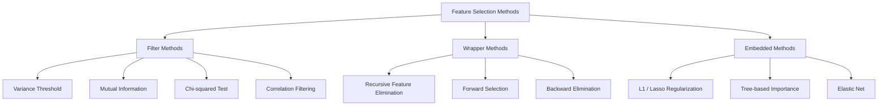
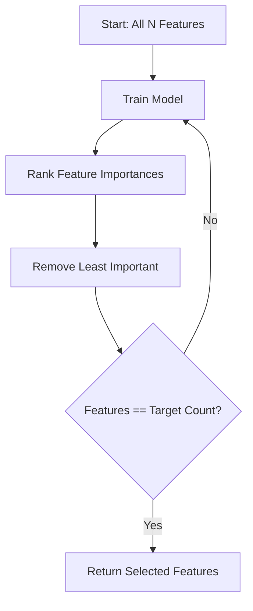
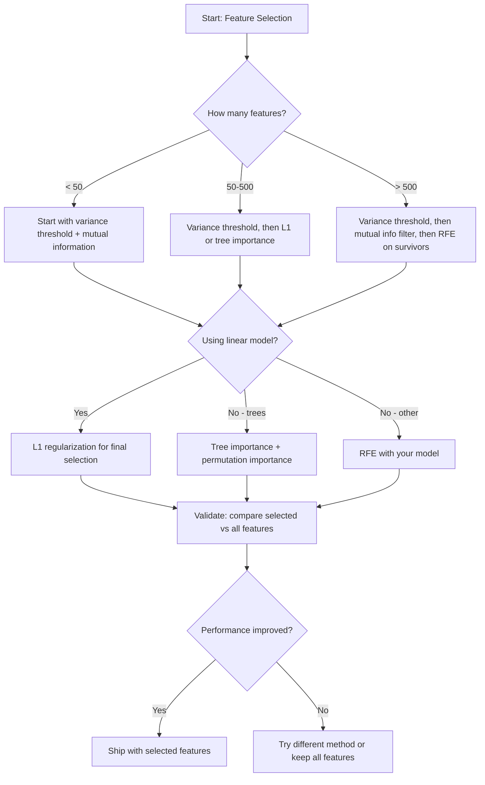

# Feature Selection

> Nhiều tính năng hơn không có nghĩa là tốt hơn. Tính năng phù hợp mới là tốt nhất.

**Type:** Build
**Language:** Python
**Prerequisites:** Phase 2, Lessons 01-09, 08 (feature engineering)
**Time:** ~75 minutes

## Mục tiêu học tập

- Triển khai các phương pháp filter (variance threshold, mutual information, chi-squared) và wrapper (RFE, forward selection) từ đầu (from scratch)
- Giải thích lý do tại sao mutual information nắm bắt được các mối quan hệ phi tuyến tính giữa tính năng và mục tiêu mà tương quan (correlation) bỏ lỡ
- So sánh L1 regularization (embedded selection) với RFE (wrapper selection) và đánh giá sự đánh đổi về mặt tính toán
- Xây dựng một pipeline lựa chọn tính năng kết hợp nhiều phương pháp và chứng minh khả năng tổng quát hóa tốt hơn trên dữ liệu kiểm thử (held-out data)

## Vấn đề

Bạn có 500 tính năng. Mô hình của bạn huấn luyện chậm, liên tục bị overfitting và không ai có thể giải thích được nó đã học những gì. Bạn thêm nhiều tính năng hơn với hy vọng cải thiện hiệu suất. Kết quả lại tệ hơn.

Đây chính là "lời nguyền đa chiều" (curse of dimensionality). Khi số lượng tính năng tăng lên, thể tích của không gian tính năng bùng nổ. Các điểm dữ liệu trở nên thưa thớt. Khoảng cách giữa các điểm hội tụ. Mô hình cần lượng dữ liệu lớn hơn theo cấp số nhân để tìm ra các quy luật thực sự. Các tính năng nhiễu lấn át các tính năng tín hiệu. Overfitting trở thành mặc định.

Lựa chọn tính năng là liều thuốc giải. Loại bỏ nhiễu. Loại bỏ sự dư thừa. Giữ lại các tính năng mang thông tin thực sự về mục tiêu. Kết quả: huấn luyện nhanh hơn, tổng quát hóa tốt hơn và các mô hình mà bạn thực sự có thể giải thích.

Mục tiêu không phải là sử dụng tất cả thông tin có sẵn. Mục tiêu là sử dụng thông tin phù hợp.

## Khái niệm

### Ba loại lựa chọn tính năng

Mỗi phương pháp lựa chọn tính năng đều thuộc một trong ba loại sau:



**Phương pháp Filter** chấm điểm từng tính năng một cách độc lập bằng cách sử dụng một thước đo thống kê. Chúng không sử dụng mô hình. Nhanh, nhưng bỏ lỡ các tương tác giữa các tính năng.

**Phương pháp Wrapper** huấn luyện một mô hình để đánh giá các tập con tính năng. Chúng sử dụng hiệu suất của mô hình làm điểm số. Kết quả tốt hơn, nhưng tốn kém vì phải huấn luyện lại mô hình nhiều lần.

**Phương pháp Embedded** chọn tính năng như một phần của quá trình huấn luyện mô hình. L1 regularization đẩy các trọng số về 0. Các cây quyết định (decision trees) phân tách dựa trên các tính năng hữu ích nhất. Việc lựa chọn diễn ra trong quá trình fitting, không phải là một bước riêng biệt.

### Variance Threshold

Phương pháp filter đơn giản nhất. Nếu một tính năng hầu như không thay đổi giữa các mẫu, nó hầu như không mang thông tin gì.

Hãy xem xét một tính năng có giá trị 0.0 cho 999 trên 1000 mẫu. Phương sai của nó gần bằng 0. Không mô hình nào có thể sử dụng nó để phân biệt giữa các lớp. Hãy loại bỏ nó.

```
variance(x) = mean((x - mean(x))^2)
```

Đặt một ngưỡng (ví dụ: 0.01). Loại bỏ mọi tính năng có phương sai thấp hơn ngưỡng đó. Điều này loại bỏ các tính năng hằng số hoặc gần như hằng số mà không cần xem xét biến mục tiêu.

Khi nào nên sử dụng: như một bước tiền xử lý trước các phương pháp khác. Nó loại bỏ các tính năng vô dụng một cách rõ ràng với chi phí gần bằng 0.

Hạn chế: một tính năng có thể có phương sai cao nhưng vẫn chỉ là nhiễu. Variance threshold là cần thiết nhưng chưa đủ.

### Mutual Information

Mutual information đo lường mức độ giảm bớt sự không chắc chắn về mục tiêu Y khi biết giá trị của tính năng X.

```
I(X; Y) = sum_x sum_y p(x, y) * log(p(x, y) / (p(x) * p(y)))
```

Nếu X và Y độc lập, p(x, y) = p(x) * p(y), thì số hạng log bằng 0 và I(X; Y) = 0. X càng cho bạn biết nhiều về Y, thì mutual information càng cao.

Ưu điểm chính so với tương quan: mutual information nắm bắt được các mối quan hệ phi tuyến tính. Một tính năng có thể có tương quan bằng 0 với mục tiêu nhưng lại có mutual information cao vì mối quan hệ đó là bậc hai hoặc tuần hoàn.

Đối với các tính năng liên tục, trước tiên hãy rời rạc hóa thành các bin (ước tính dựa trên biểu đồ). Số lượng bin ảnh hưởng đến ước tính -- quá ít bin sẽ mất thông tin, quá nhiều bin sẽ thêm nhiễu. Một lựa chọn phổ biến: sqrt(n) bin hoặc quy tắc Sturges (1 + log2(n)).


### Recursive Feature Elimination (RFE)

RFE là một phương pháp wrapper. Nó sử dụng tầm quan trọng của tính năng (feature importance) của chính mô hình để cắt tỉa lặp đi lặp lại:

1. Huấn luyện mô hình với tất cả các tính năng
2. Xếp hạng các tính năng theo tầm quan trọng (hệ số đối với mô hình tuyến tính, mức độ giảm tạp chất đối với cây)
3. Loại bỏ (các) tính năng ít quan trọng nhất
4. Lặp lại cho đến khi còn lại số lượng tính năng mong muốn



RFE xem xét các tương tác giữa các tính năng vì mô hình nhìn thấy tất cả các tính năng còn lại cùng nhau. Việc loại bỏ một tính năng sẽ làm thay đổi tầm quan trọng của các tính năng khác. Điều này làm cho nó kỹ lưỡng hơn các phương pháp filter.

Chi phí: bạn huấn luyện mô hình N - target lần. Với 500 tính năng và mục tiêu là 10, đó là 490 lần chạy huấn luyện. Đối với các mô hình đắt đỏ, điều này rất chậm. Bạn có thể tăng tốc bằng cách loại bỏ nhiều tính năng mỗi bước (ví dụ: loại bỏ 10% thấp nhất mỗi vòng).

### L1 (Lasso) Regularization

L1 regularization thêm giá trị tuyệt đối của các trọng số vào hàm mất mát (loss function):

```
loss = prediction_error + alpha * sum(|w_i|)
```

Tham số alpha kiểm soát mức độ cắt tỉa tính năng. Alpha càng cao thì càng nhiều trọng số tiến về đúng bằng 0.

Tại sao lại đúng bằng 0? Hình phạt L1 tạo ra một vùng ràng buộc hình kim cương trong không gian trọng số. Giải pháp tối ưu có xu hướng rơi vào một góc của hình kim cương này, nơi một hoặc nhiều trọng số bằng 0. L2 regularization (ridge) tạo ra một ràng buộc hình tròn nơi các trọng số co lại nhưng hiếm khi chạm 0.

Đây là lựa chọn tính năng embedded: mô hình học trong quá trình huấn luyện những tính năng nào cần bỏ qua. Các tính năng có trọng số bằng 0 thực sự bị loại bỏ.

Ưu điểm: chỉ cần một lần huấn luyện, xử lý được các tính năng tương quan (chọn một và đưa các tính năng khác về 0), được tích hợp sẵn trong hầu hết các triển khai mô hình tuyến tính.

Hạn chế: chỉ hoạt động với các mô hình tuyến tính. Không thể nắm bắt tầm quan trọng của tính năng phi tuyến tính.

### Tree-Based Feature Importance

Các cây quyết định và các mô hình ensemble của chúng (random forests, gradient boosting) xếp hạng các tính năng một cách tự nhiên. Mỗi lần phân tách đều làm giảm tạp chất (Gini hoặc entropy cho phân loại, phương sai cho hồi quy). Các tính năng tạo ra mức giảm tạp chất lớn hơn sẽ quan trọng hơn.

Đối với một random forest với T cây:

```
importance(feature_j) = (1/T) * sum over all trees of
    sum over all nodes splitting on feature_j of
        (n_samples * impurity_decrease)
```

Điều này cung cấp một điểm số tầm quan trọng chuẩn hóa cho mỗi tính năng. Nó tự động xử lý các mối quan hệ phi tuyến tính và tương tác giữa các tính năng.

Lưu ý: tầm quan trọng dựa trên cây có xu hướng thiên vị các tính năng có nhiều giá trị duy nhất (độ đa dạng cao - high cardinality). Một cột ID ngẫu nhiên sẽ xuất hiện quan trọng vì nó phân tách hoàn hảo mọi mẫu. Hãy sử dụng permutation importance như một bước kiểm tra tính hợp lý.

### Permutation Importance

Một phương pháp không phụ thuộc vào mô hình (model-agnostic):

1. Huấn luyện mô hình và ghi lại hiệu suất cơ sở trên dữ liệu validation
2. Đối với mỗi tính năng: xáo trộn ngẫu nhiên các giá trị của nó, đo lường mức giảm hiệu suất
3. Mức giảm càng lớn, tính năng càng quan trọng

Nếu việc xáo trộn một tính năng không làm giảm hiệu suất, mô hình không phụ thuộc vào nó. Nếu hiệu suất sụp đổ, tính năng đó là rất quan trọng.

Permutation importance tránh được sự thiên vị về độ đa dạng của tầm quan trọng dựa trên cây. Nhưng nó chậm: một lần đánh giá đầy đủ cho mỗi tính năng, lặp lại nhiều lần để đảm bảo tính ổn định.

### Bảng so sánh

| Phương pháp | Loại | Tốc độ | Phi tuyến tính | Tương tác tính năng |
|--------|------|-------|-----------|---------------------|
| Variance threshold | Filter | Rất nhanh | Không | Không |
| Mutual information | Filter | Nhanh | Có | Không |
| Correlation filter | Filter | Nhanh | Không | Không |
| RFE | Wrapper | Chậm | Tùy mô hình | Có |
| L1 / Lasso | Embedded | Nhanh | Không (tuyến tính) | Không |
| Tree importance | Embedded | Trung bình | Có | Có |
| Permutation importance | Model-agnostic | Chậm | Có | Có |

### Lưu đồ quyết định



```figure
f3-feature-prune
```

## Xây dựng

### Bước 1: Tạo dữ liệu tổng hợp với cấu trúc tính năng đã biết

```python
import numpy as np


def make_feature_selection_data(n_samples=500, seed=42):
    rng = np.random.RandomState(seed)

    x1 = rng.randn(n_samples)
    x2 = rng.randn(n_samples)
    x3 = rng.randn(n_samples)
    x4 = x1 + 0.1 * rng.randn(n_samples)
    x5 = x2 + 0.1 * rng.randn(n_samples)

    informative = np.column_stack([x1, x2, x3, x4, x5])

    correlated = np.column_stack([
        x1 * 0.9 + 0.1 * rng.randn(n_samples),
        x2 * 0.8 + 0.2 * rng.randn(n_samples),
        x3 * 0.7 + 0.3 * rng.randn(n_samples),
        x1 * 0.5 + x2 * 0.5 + 0.1 * rng.randn(n_samples),
        x2 * 0.6 + x3 * 0.4 + 0.1 * rng.randn(n_samples),
    ])

    noise = rng.randn(n_samples, 10) * 0.5

    X = np.hstack([informative, correlated, noise])
    y = (2 * x1 - 1.5 * x2 + x3 + 0.5 * rng.randn(n_samples) > 0).astype(int)

    feature_names = (
        [f"info_{i}" for i in range(5)]
        + [f"corr_{i}" for i in range(5)]
        + [f"noise_{i}" for i in range(10)]
    )

    return X, y, feature_names
```

Chúng ta biết sự thật cơ bản: các tính năng 0-4 là có thông tin (cộng thêm 3 và 4 là các bản sao tương quan của 0 và 1), các tính năng 5-9 tương quan với các tính năng có thông tin, các tính năng 10-19 là nhiễu thuần túy. Một phương pháp lựa chọn tốt nên xếp hạng 0-4 cao nhất và 10-19 thấp nhất.

### Bước 2: Variance threshold

```python
def variance_threshold(X, threshold=0.01):
    variances = np.var(X, axis=0)
    mask = variances > threshold
    return mask, variances
```

### Bước 3: Mutual information (rời rạc)

```python
def discretize(x, n_bins=10):
    min_val, max_val = x.min(), x.max()
    if max_val == min_val:
        return np.zeros_like(x, dtype=int)
    bin_edges = np.linspace(min_val, max_val, n_bins + 1)
    binned = np.digitize(x, bin_edges[1:-1])
    return binned


def mutual_information(X, y, n_bins=10):
    n_samples, n_features = X.shape
    mi_scores = np.zeros(n_features)

    y_vals, y_counts = np.unique(y, return_counts=True)
    p_y = y_counts / n_samples

    for f in range(n_features):
        x_binned = discretize(X[:, f], n_bins)
        x_vals, x_counts = np.unique(x_binned, return_counts=True)
        p_x = dict(zip(x_vals, x_counts / n_samples))

        mi = 0.0
        for xv in x_vals:
            for yi, yv in enumerate(y_vals):
                joint_mask = (x_binned == xv) & (y == yv)
                p_xy = np.sum(joint_mask) / n_samples
                if p_xy > 0:
                    mi += p_xy * np.log(p_xy / (p_x[xv] * p_y[yi]))
        mi_scores[f] = mi

    return mi_scores
```

### Bước 4: Recursive Feature Elimination

```python
def simple_logistic_importance(X, y, lr=0.1, epochs=100):
    n_samples, n_features = X.shape
    w = np.zeros(n_features)
    b = 0.0

    for _ in range(epochs):
        z = X @ w + b
        pred = 1.0 / (1.0 + np.exp(-np.clip(z, -500, 500)))
        error = pred - y
        w -= lr * (X.T @ error) / n_samples
        b -= lr * np.mean(error)

    return w, b


def rfe(X, y, n_features_to_select=5, lr=0.1, epochs=100):
    n_total = X.shape[1]
    remaining = list(range(n_total))
    rankings = np.ones(n_total, dtype=int)
    rank = n_total

    while len(remaining) > n_features_to_select:
        X_subset = X[:, remaining]
        w, _ = simple_logistic_importance(X_subset, y, lr, epochs)
        importances = np.abs(w)

        least_idx = np.argmin(importances)
        original_idx = remaining[least_idx]
        rankings[original_idx] = rank
        rank -= 1
        remaining.pop(least_idx)

    for idx in remaining:
        rankings[idx] = 1

    selected_mask = rankings == 1
    return selected_mask, rankings
```

### Bước 5: L1 feature selection

```python
def soft_threshold(w, alpha):
    return np.sign(w) * np.maximum(np.abs(w) - alpha, 0)


def l1_feature_selection(X, y, alpha=0.1, lr=0.01, epochs=500):
    n_samples, n_features = X.shape
    w = np.zeros(n_features)
    b = 0.0

    for _ in range(epochs):
        z = X @ w + b
        pred = 1.0 / (1.0 + np.exp(-np.clip(z, -500, 500)))
        error = pred - y

        gradient_w = (X.T @ error) / n_samples
        gradient_b = np.mean(error)

        w -= lr * gradient_w
        w = soft_threshold(w, lr * alpha)
        b -= lr * gradient_b

    selected_mask = np.abs(w) > 1e-6
    return selected_mask, w
```

### Bước 6: Tree-based importance (cây quyết định đơn giản)

```python
def gini_impurity(y):
    if len(y) == 0:
        return 0.0
    classes, counts = np.unique(y, return_counts=True)
    probs = counts / len(y)
    return 1.0 - np.sum(probs ** 2)


def best_split(X, y, feature_idx):
    values = np.unique(X[:, feature_idx])
    if len(values) <= 1:
        return None, -1.0

    best_threshold = None
    best_gain = -1.0
    parent_gini = gini_impurity(y)
    n = len(y)

    for i in range(len(values) - 1):
        threshold = (values[i] + values[i + 1]) / 2.0
        left_mask = X[:, feature_idx] <= threshold
        right_mask = ~left_mask

        n_left = np.sum(left_mask)
        n_right = np.sum(right_mask)

        if n_left == 0 or n_right == 0:
            continue

        gain = parent_gini - (n_left / n) * gini_impurity(y[left_mask]) - (n_right / n) * gini_impurity(y[right_mask])

        if gain > best_gain:
            best_gain = gain
            best_threshold = threshold

    return best_threshold, best_gain


def tree_importance(X, y, n_trees=50, max_depth=5, seed=42):
    rng = np.random.RandomState(seed)
    n_samples, n_features = X.shape
    importances = np.zeros(n_features)

    for _ in range(n_trees):
        sample_idx = rng.choice(n_samples, size=n_samples, replace=True)
        feature_subset = rng.choice(n_features, size=max(1, int(np.sqrt(n_features))), replace=False)

        X_boot = X[sample_idx]
        y_boot = y[sample_idx]

        tree_imp = _build_tree_importance(X_boot, y_boot, feature_subset, max_depth)
        importances += tree_imp

    total = importances.sum()
    if total > 0:
        importances /= total

    return importances


def _build_tree_importance(X, y, feature_subset, max_depth, depth=0):
    n_features = X.shape[1]
    importances = np.zeros(n_features)

    if depth >= max_depth or len(np.unique(y)) <= 1 or len(y) < 4:
        return importances

    best_feature = None
    best_threshold = None
    best_gain = -1.0

    for f in feature_subset:
        threshold, gain = best_split(X, y, f)
        if gain > best_gain:
            best_gain = gain
            best_feature = f
            best_threshold = threshold

    if best_feature is None or best_gain <= 0:
        return importances

    importances[best_feature] += best_gain * len(y)

    left_mask = X[:, best_feature] <= best_threshold
    right_mask = ~left_mask

    importances += _build_tree_importance(X[left_mask], y[left_mask], feature_subset, max_depth, depth + 1)
    importances += _build_tree_importance(X[right_mask], y[right_mask], feature_subset, max_depth, depth + 1)

    return importances
```

### Bước 7: Chạy tất cả các phương pháp và so sánh

Tệp mã chạy tất cả năm phương pháp trên cùng một tập dữ liệu tổng hợp và in ra bảng so sánh cho thấy mỗi phương pháp chọn những tính năng nào.

## Sử dụng

Với scikit-learn, lựa chọn tính năng được tích hợp sẵn trong pipeline:

```python
from sklearn.feature_selection import (
    VarianceThreshold,
    mutual_info_classif,
    RFE,
    SelectFromModel,
)
from sklearn.linear_model import Lasso, LogisticRegression
from sklearn.ensemble import RandomForestClassifier

vt = VarianceThreshold(threshold=0.01)
X_filtered = vt.fit_transform(X)

mi_scores = mutual_info_classif(X, y)
top_k = np.argsort(mi_scores)[-10:]

rfe_selector = RFE(LogisticRegression(), n_features_to_select=10)
rfe_selector.fit(X, y)
X_rfe = rfe_selector.transform(X)

lasso_selector = SelectFromModel(Lasso(alpha=0.01))
lasso_selector.fit(X, y)
X_lasso = lasso_selector.transform(X)

rf = RandomForestClassifier(n_estimators=100)
rf.fit(X, y)
importances = rf.feature_importances_
```

Các triển khai từ đầu cho thấy chính xác những gì xảy ra bên trong mỗi phương pháp. Variance threshold chỉ là tính toán `var(X, axis=0)` và áp dụng một mặt nạ (mask). Mutual information là đếm tần suất chung và biên trong bảng ngẫu nhiên. RFE là một vòng lặp huấn luyện, xếp hạng và cắt tỉa. L1 là gradient descent với một bước soft-thresholding. Tree importance tích lũy các mức giảm tạp chất qua các lần phân tách. Không có phép thuật nào cả -- chỉ là thống kê và vòng lặp.

Các phiên bản sklearn bổ sung tính mạnh mẽ (ví dụ: mutual_info_classif sử dụng ước tính mật độ k-NN thay vì binning), tốc độ (triển khai bằng C) và tích hợp pipeline.

## Triển khai

Bài học này tạo ra:
- `outputs/skill-feature-selector.md` -- một cây quyết định tham khảo nhanh để chọn phương pháp lựa chọn tính năng phù hợp

## Bài tập

1. **Forward selection**: triển khai ngược lại với RFE. Bắt đầu với 0 tính năng. Ở mỗi bước, thêm tính năng giúp cải thiện hiệu suất mô hình nhiều nhất. Dừng lại khi việc thêm tính năng không còn giúp ích. So sánh các tính năng được chọn với kết quả RFE. Cái nào nhanh hơn? Cái nào cho kết quả tốt hơn?

2. **Stability selection**: chạy L1 feature selection 50 lần, mỗi lần trên một tập con ngẫu nhiên 80% dữ liệu, với các giá trị alpha hơi khác nhau. Đếm xem mỗi tính năng được chọn bao nhiêu lần. Các tính năng được chọn trong > 80% số lần chạy là "ổn định". So sánh các tính năng ổn định với lựa chọn L1 một lần chạy. Cái nào đáng tin cậy hơn?

3. **Phát hiện đa cộng tuyến (Multicollinearity)**: tính toán ma trận tương quan cho tất cả các tính năng. Triển khai một hàm, với một ngưỡng tương quan (ví dụ: 0.9), loại bỏ một tính năng từ mỗi cặp có tương quan cao (giữ lại tính năng có mutual information cao hơn với mục tiêu). Kiểm tra trên tập dữ liệu tổng hợp và xác minh rằng nó loại bỏ các tính năng tương quan dư thừa.

4. **Pipeline lựa chọn tính năng**: kết hợp variance threshold, mutual information filter và RFE thành một pipeline duy nhất. Đầu tiên loại bỏ các tính năng có phương sai gần bằng 0, sau đó giữ lại 50% hàng đầu theo mutual information, sau đó chạy RFE trên các tính năng còn lại. So sánh pipeline này với việc chỉ chạy RFE trên tất cả các tính năng. Pipeline có nhanh hơn không? Nó có chính xác tương đương không?

5. **Permutation importance từ đầu**: triển khai permutation importance. Đối với mỗi tính năng, xáo trộn giá trị của nó 10 lần, đo mức giảm trung bình của điểm F1. So sánh xếp hạng với tầm quan trọng dựa trên cây. Tìm các trường hợp chúng không đồng ý và giải thích tại sao (gợi ý: các tính năng tương quan).

## Thuật ngữ chính

| Thuật ngữ | Cách gọi thông thường | Ý nghĩa thực tế |
|------|----------------|----------------------|
| Filter method | "Chấm điểm tính năng độc lập" | Phương pháp lựa chọn tính năng xếp hạng bằng thước đo thống kê mà không cần huấn luyện mô hình |
| Wrapper method | "Dùng mô hình để chọn tính năng" | Phương pháp lựa chọn tính năng đánh giá tập con bằng cách huấn luyện mô hình và dùng hiệu suất làm tiêu chí |
| Embedded method | "Mô hình tự chọn tính năng khi huấn luyện" | Lựa chọn tính năng diễn ra trong quá trình fitting, ví dụ L1 regularization đẩy trọng số về 0 |
| Mutual information | "Biến này cho biết gì về biến kia" | Đo lường mức độ giảm sự không chắc chắn về Y khi biết X, nắm bắt cả phụ thuộc tuyến tính và phi tuyến tính |
| Recursive Feature Elimination | "Huấn luyện, xếp hạng, cắt tỉa, lặp lại" | Phương pháp wrapper lặp đi lặp lại việc huấn luyện, loại bỏ tính năng ít quan trọng nhất cho đến khi đạt số lượng mục tiêu |
| L1 / Lasso regularization | "Hình phạt tiêu diệt tính năng" | Thêm tổng giá trị tuyệt đối của trọng số vào hàm mất mát, đẩy trọng số của tính năng không quan trọng về đúng bằng 0 |
| Variance threshold | "Loại bỏ tính năng hằng số" | Loại bỏ các tính năng có phương sai thấp hơn ngưỡng, lọc bỏ các tính năng không mang thông tin |
| Feature importance | "Tính năng nào quan trọng nhất" | Điểm số cho biết mức độ đóng góp của tính năng vào dự đoán, tính từ mức tăng phân tách (cây) hoặc độ lớn hệ số (tuyến tính) |
| Permutation importance | "Xáo trộn và đo thiệt hại" | Đánh giá tầm quan trọng bằng cách xáo trộn ngẫu nhiên giá trị tính năng và đo mức giảm hiệu suất mô hình |
| Curse of dimensionality | "Quá nhiều tính năng, không đủ dữ liệu" | Hiện tượng thêm tính năng làm tăng thể tích không gian theo cấp số nhân, khiến dữ liệu thưa thớt và khoảng cách trở nên vô nghĩa |

## Đọc thêm

- [An Introduction to Variable and Feature Selection (Guyon & Elisseeff, 2003)](https://jmlr.org/papers/v3/guyon03a.html) -- khảo sát nền tảng về các phương pháp lựa chọn tính năng, vẫn được tham khảo rộng rãi
- [scikit-learn Feature Selection Guide](https://scikit-learn.org/stable/modules/feature_selection.html) -- tài liệu tham khảo thực tế cho các phương pháp filter, wrapper và embedded với ví dụ mã
- [Stability Selection (Meinshausen & Buhlmann, 2010)](https://arxiv.org/abs/0809.2932) -- kết hợp lấy mẫu con với lựa chọn tính năng để có kết quả mạnh mẽ, có thể tái lập
- [Beware Default Random Forest Importances (Strobl et al., 2007)](https://bmcbioinformatics.biomedcentral.com/articles/10.1186/1471-2105-8-25) -- chứng minh sự thiên vị về độ đa dạng trong tầm quan trọng dựa trên cây và đề xuất tầm quan trọng có điều kiện như một giải pháp thay thế