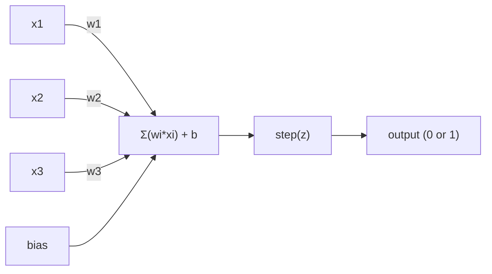
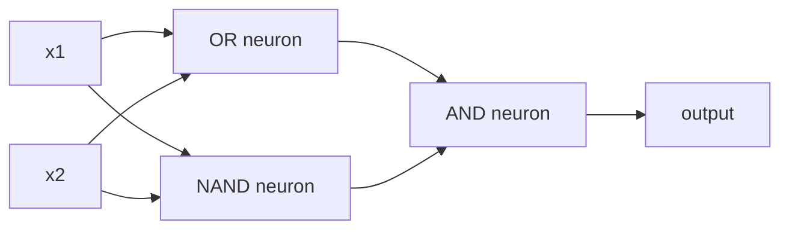

# The Perceptron

> Perceptron là nguyên tử của mạng thần kinh. Hãy mổ xẻ nó và bạn sẽ tìm thấy các trọng số (weights), một bias, và một quyết định.

**Type:** Build
**Languages:** Python
**Prerequisites:** Phase 1 (Linear Algebra Intuition)
**Time:** ~60 minutes

## Mục tiêu học tập

- Triển khai một perceptron từ đầu bằng Python, bao gồm quy tắc cập nhật trọng số và hàm kích hoạt step function.
- Giải thích lý do tại sao một perceptron đơn lẻ chỉ có thể giải quyết các bài toán phân tách tuyến tính (linearly separable) và chứng minh trường hợp thất bại với XOR.
- Xây dựng một multi-layer perceptron bằng cách kết hợp các cổng OR, NAND và AND để giải quyết XOR.
- Huấn luyện một mạng hai lớp với hàm kích hoạt sigmoid và backpropagation để học XOR một cách tự động.

## Vấn đề

Bạn đã biết về vector và tích vô hướng (dot product). Bạn biết rằng một ma trận biến đổi đầu vào thành đầu ra. Nhưng làm thế nào để một cỗ máy *học* được phép biến đổi nào cần sử dụng?

Perceptron trả lời câu hỏi này. Nó là cỗ máy học đơn giản nhất có thể: lấy một số đầu vào, nhân với trọng số, cộng thêm bias, và đưa ra quyết định nhị phân. Sau đó điều chỉnh. Chỉ vậy thôi. Mọi mạng thần kinh từng được xây dựng đều là các lớp của ý tưởng này xếp chồng lên nhau.

Hiểu về perceptron nghĩa là hiểu "học" thực sự có nghĩa là gì trong mã nguồn: điều chỉnh các con số cho đến khi đầu ra khớp với thực tế.

## Khái niệm

### Một Neuron, Một Quyết định

Một perceptron nhận n đầu vào, nhân mỗi đầu vào với một trọng số, cộng chúng lại, thêm một bias, và truyền kết quả qua một hàm kích hoạt.



Hàm step function rất khắc nghiệt: nếu tổng có trọng số cộng với bias >= 0, đầu ra là 1. Ngược lại, đầu ra là 0.

```
step(z) = 1  if z >= 0
           0  if z < 0
```

Đây là một bộ phân loại tuyến tính (linear classifier). Các trọng số và bias xác định một đường thẳng (hoặc siêu phẳng trong không gian nhiều chiều hơn) chia không gian đầu vào thành hai vùng.

### Biên quyết định (Decision Boundary)

Với hai đầu vào, perceptron vẽ một đường thẳng qua không gian 2D:

```
  x2
  ┤
  │  Class 1        /
  │    (0)          /
  │                /
  │               / w1·x1 + w2·x2 + b = 0
  │              /
  │             /     Class 2
  │            /        (1)
  ┼───────────/──────────── x1
```

Mọi thứ ở một phía của đường thẳng cho đầu ra 0. Mọi thứ ở phía còn lại cho đầu ra 1. Quá trình huấn luyện sẽ di chuyển đường thẳng này cho đến khi nó phân tách chính xác các lớp.

### Quy tắc học (Learning Rule)

Quy tắc học của perceptron rất đơn giản:

```
For each training example (x, y_true):
    y_pred = predict(x)
    error = y_true - y_pred

    For each weight:
        w_i = w_i + learning_rate * error * x_i
    bias = bias + learning_rate * error
```

Nếu dự đoán đúng, sai số (error) = 0, không có gì thay đổi. Nếu nó dự đoán 0 nhưng đáng lẽ phải là 1, các trọng số sẽ tăng lên. Nếu nó dự đoán 1 nhưng đáng lẽ phải là 0, các trọng số sẽ giảm xuống. Tốc độ học (learning rate) kiểm soát mức độ điều chỉnh lớn hay nhỏ.

### Vấn đề XOR

Đây là nơi nó thất bại. Hãy nhìn vào các cổng logic này:

```
AND gate:           OR gate:            XOR gate:
x1  x2  out         x1  x2  out         x1  x2  out
0   0   0           0   0   0           0   0   0
0   1   0           0   1   1           0   1   1
1   0   0           1   0   1           1   0   1
1   1   1           1   1   1           1   1   0
```

AND và OR có thể phân tách tuyến tính: bạn có thể vẽ một đường thẳng duy nhất để tách các số 0 khỏi các số 1. XOR thì không. Không có đường thẳng đơn lẻ nào có thể tách [0,1] và [1,0] khỏi [0,0] và [1,1].

```
AND (separable):        XOR (not separable):

  x2                      x2
  1 ┤  0     1            1 ┤  1     0
    │     /                 │
  0 ┤  0 / 0              0 ┤  0     1
    ┼──/──────── x1         ┼──────────── x1
       line works!          no single line works!
```

Đây là một giới hạn cơ bản. Một perceptron đơn lẻ chỉ có thể giải quyết các bài toán phân tách tuyến tính. Minsky và Papert đã chứng minh điều này vào năm 1969 và nó gần như đã đặt dấu chấm hết cho nghiên cứu mạng thần kinh trong một thập kỷ.

Giải pháp: xếp chồng các perceptron thành các lớp. Một multi-layer perceptron có thể giải quyết XOR bằng cách kết hợp hai quyết định tuyến tính thành một quyết định phi tuyến tính.

```figure
perceptron-boundary
```

## Xây dựng

### Bước 1: Lớp Perceptron

```python
class Perceptron:
    def __init__(self, n_inputs, learning_rate=0.1):
        self.weights = [0.0] * n_inputs
        self.bias = 0.0
        self.lr = learning_rate

    def predict(self, inputs):
        total = sum(w * x for w, x in zip(self.weights, inputs))
        total += self.bias
        return 1 if total >= 0 else 0

    def train(self, training_data, epochs=100):
        for epoch in range(epochs):
            errors = 0
            for inputs, target in training_data:
                prediction = self.predict(inputs)
                error = target - prediction
                if error != 0:
                    errors += 1
                    for i in range(len(self.weights)):
                        self.weights[i] += self.lr * error * inputs[i]
                    self.bias += self.lr * error
            if errors == 0:
                print(f"Converged at epoch {epoch + 1}")
                return
        print(f"Did not converge after {epochs} epochs")
```

### Bước 2: Huấn luyện trên các cổng logic

```python
and_data = [
    ([0, 0], 0),
    ([0, 1], 0),
    ([1, 0], 0),
    ([1, 1], 1),
]

or_data = [
    ([0, 0], 0),
    ([0, 1], 1),
    ([1, 0], 1),
    ([1, 1], 1),
]

not_data = [
    ([0], 1),
    ([1], 0),
]

print("=== AND Gate ===")
p_and = Perceptron(2)
p_and.train(and_data)
for inputs, _ in and_data:
    print(f"  {inputs} -> {p_and.predict(inputs)}")

print("\n=== OR Gate ===")
p_or = Perceptron(2)
p_or.train(or_data)
for inputs, _ in or_data:
    print(f"  {inputs} -> {p_or.predict(inputs)}")

print("\n=== NOT Gate ===")
p_not = Perceptron(1)
p_not.train(not_data)
for inputs, _ in not_data:
    print(f"  {inputs} -> {p_not.predict(inputs)}")
```

### Bước 3: Chứng kiến sự thất bại của XOR

```python
xor_data = [
    ([0, 0], 0),
    ([0, 1], 1),
    ([1, 0], 1),
    ([1, 1], 0),
]

print("\n=== XOR Gate (single perceptron) ===")
p_xor = Perceptron(2)
p_xor.train(xor_data, epochs=1000)
for inputs, expected in xor_data:
    result = p_xor.predict(inputs)
    status = "OK" if result == expected else "WRONG"
    print(f"  {inputs} -> {result} (expected {expected}) {status}")
```

Nó sẽ không bao giờ hội tụ. Đây là bằng chứng thép cho thấy một perceptron đơn lẻ không thể học được XOR.

### Bước 4: Giải quyết XOR với hai lớp

Mẹo: XOR = (x1 OR x2) AND NOT (x1 AND x2). Kết hợp ba perceptron:



```python
def xor_network(x1, x2):
    or_neuron = Perceptron(2)
    or_neuron.weights = [1.0, 1.0]
    or_neuron.bias = -0.5

    nand_neuron = Perceptron(2)
    nand_neuron.weights = [-1.0, -1.0]
    nand_neuron.bias = 1.5

    and_neuron = Perceptron(2)
    and_neuron.weights = [1.0, 1.0]
    and_neuron.bias = -1.5

    hidden1 = or_neuron.predict([x1, x2])
    hidden2 = nand_neuron.predict([x1, x2])
    output = and_neuron.predict([hidden1, hidden2])
    return output


print("\n=== XOR Gate (multi-layer network) ===")
for inputs, expected in xor_data:
    result = xor_network(inputs[0], inputs[1])
    print(f"  {inputs} -> {result} (expected {expected})")
```

Cả bốn trường hợp đều đúng. Việc xếp chồng các perceptron thành các lớp tạo ra các biên quyết định mà không một perceptron đơn lẻ nào có thể tạo ra được.

### Bước 5: Huấn luyện mạng hai lớp

Bước 4 đã thiết lập trọng số thủ công. Điều đó hiệu quả với XOR, nhưng không hiệu quả với các bài toán thực tế nơi bạn không biết trước trọng số đúng. Giải pháp: thay thế hàm step function bằng sigmoid và học trọng số tự động thông qua backpropagation.

```python
class TwoLayerNetwork:
    def __init__(self, learning_rate=0.5):
        import random
        random.seed(0)
        self.w_hidden = [[random.uniform(-1, 1), random.uniform(-1, 1)] for _ in range(2)]
        self.b_hidden = [random.uniform(-1, 1), random.uniform(-1, 1)]
        self.w_output = [random.uniform(-1, 1), random.uniform(-1, 1)]
        self.b_output = random.uniform(-1, 1)
        self.lr = learning_rate

    def sigmoid(self, x):
        import math
        x = max(-500, min(500, x))
        return 1.0 / (1.0 + math.exp(-x))

    def forward(self, inputs):
        self.inputs = inputs
        self.hidden_outputs = []
        for i in range(2):
            z = sum(w * x for w, x in zip(self.w_hidden[i], inputs)) + self.b_hidden[i]
            self.hidden_outputs.append(self.sigmoid(z))
        z_out = sum(w * h for w, h in zip(self.w_output, self.hidden_outputs)) + self.b_output
        self.output = self.sigmoid(z_out)
        return self.output

    def train(self, training_data, epochs=10000):
        for epoch in range(epochs):
            total_error = 0
            for inputs, target in training_data:
                output = self.forward(inputs)
                error = target - output
                total_error += error ** 2

                d_output = error * output * (1 - output)

                saved_w_output = self.w_output[:]
                hidden_deltas = []
                for i in range(2):
                    h = self.hidden_outputs[i]
                    hd = d_output * saved_w_output[i] * h * (1 - h)
                    hidden_deltas.append(hd)

                for i in range(2):
                    self.w_output[i] += self.lr * d_output * self.hidden_outputs[i]
                self.b_output += self.lr * d_output

                for i in range(2):
                    for j in range(len(inputs)):
                        self.w_hidden[i][j] += self.lr * hidden_deltas[i] * inputs[j]
                    self.b_hidden[i] += self.lr * hidden_deltas[i]
```

```python
net = TwoLayerNetwork(learning_rate=2.0)
net.train(xor_data, epochs=10000)
for inputs, expected in xor_data:
    result = net.forward(inputs)
    predicted = 1 if result >= 0.5 else 0
    print(f"  {inputs} -> {result:.4f} (rounded: {predicted}, expected {expected})")
```

Hai khác biệt chính so với Bước 4. Thứ nhất, sigmoid thay thế hàm step function -- nó trơn (smooth), vì vậy đạo hàm tồn tại. Thứ hai, phương thức `train` lan truyền sai số ngược từ đầu ra về lớp ẩn, điều chỉnh từng trọng số tỷ lệ thuận với đóng góp của nó vào sai số. Đó chính là backpropagation trong 20 dòng mã.

Đây là cầu nối đến Bài 03. Toán học đằng sau `d_output` và `hidden_deltas` chính là quy tắc chuỗi (chain rule) áp dụng cho đồ thị mạng. Chúng ta sẽ dẫn xuất nó một cách đầy đủ ở đó.

## Sử dụng

Mọi thứ bạn vừa xây dựng từ đầu đều tồn tại trong một thư viện:

```python
from sklearn.linear_model import Perceptron as SkPerceptron
import numpy as np

X = np.array([[0,0],[0,1],[1,0],[1,1]])
y = np.array([0, 0, 0, 1])

clf = SkPerceptron(max_iter=100, tol=1e-3)
clf.fit(X, y)
print([clf.predict([x])[0] for x in X])
```

Năm dòng mã. Lớp `Perceptron` dài 30 dòng của bạn cũng thực hiện điều tương tự. Phiên bản của sklearn bổ sung thêm các kiểm tra hội tụ, nhiều hàm mất mát (loss functions) và hỗ trợ đầu vào thưa (sparse input) -- nhưng vòng lặp cốt lõi vẫn giống hệt: tổng có trọng số, hàm kích hoạt, cập nhật trọng số dựa trên sai số.

Khoảng cách thực sự xuất hiện ở quy mô lớn. Những gì thay đổi trong các mạng sản xuất:

- Hàm step function trở thành sigmoid, ReLU hoặc các hàm kích hoạt trơn khác.
- Trọng số được học tự động thông qua backpropagation (Bài 03).
- Các lớp trở nên sâu hơn: 3, 10, 100+ lớp.
- Nguyên lý tương tự vẫn giữ nguyên: mỗi lớp tạo ra các đặc trưng mới từ đầu ra của lớp trước đó.

Một perceptron đơn lẻ chỉ có thể vẽ các đường thẳng. Hãy xếp chồng chúng, và bạn có thể vẽ bất kỳ hình dạng nào.

## Triển khai

Bài học này tạo ra:
- `outputs/skill-perceptron.md` - một kỹ năng bao quát khi nào cần kiến trúc đơn lớp so với đa lớp.

## Bài tập

1. Huấn luyện một perceptron trên cổng NAND (cổng vạn năng - bất kỳ mạch logic nào cũng có thể được xây dựng từ NAND). Xác minh xem trọng số và bias của nó có tạo thành một biên quyết định hợp lệ hay không.
2. Sửa đổi lớp Perceptron để theo dõi biên quyết định (w1*x1 + w2*x2 + b = 0) tại mỗi epoch. In ra cách đường thẳng dịch chuyển trong quá trình huấn luyện trên cổng AND.
3. Xây dựng một perceptron 3 đầu vào cho đầu ra 1 chỉ khi ít nhất 2 trong 3 đầu vào là 1 (hàm bỏ phiếu đa số). Điều này có phân tách tuyến tính được không? Tại sao?

## Thuật ngữ chính

| Thuật ngữ | Cách gọi thông thường | Ý nghĩa thực sự |
|------|----------------|----------------------|
| Perceptron | "Một neuron giả" | Một bộ phân loại tuyến tính: tích vô hướng của đầu vào và trọng số, cộng bias, qua hàm step function |
| Weight | "Độ quan trọng của đầu vào" | Một hệ số nhân điều chỉnh đóng góp của mỗi đầu vào vào quyết định |
| Bias | "Ngưỡng" | Một hằng số dịch chuyển biên quyết định, cho phép perceptron kích hoạt ngay cả khi đầu vào bằng 0 |
| Activation function | "Thứ làm biến dạng giá trị" | Một hàm áp dụng sau tổng có trọng số - step function cho perceptron, sigmoid/ReLU cho mạng hiện đại |
| Linearly separable | "Bạn có thể vẽ một đường thẳng giữa chúng" | Một tập dữ liệu mà một siêu phẳng đơn lẻ có thể phân tách hoàn hảo các lớp |
| XOR problem | "Thứ mà perceptron không làm được" | Bằng chứng cho thấy mạng đơn lớp không thể học các hàm không phân tách tuyến tính |
| Decision boundary | "Nơi bộ phân loại chuyển đổi" | Siêu phẳng w*x + b = 0 chia không gian đầu vào thành hai lớp |
| Multi-layer perceptron | "Một mạng thần kinh thực sự" | Các perceptron xếp chồng thành các lớp, nơi đầu ra của mỗi lớp cung cấp đầu vào cho lớp tiếp theo |

## Đọc thêm

- Frank Rosenblatt, "The Perceptron: A Probabilistic Model for Information Storage and Organization in the Brain" (1958) -- bài báo gốc khởi đầu cho tất cả.
- Minsky & Papert, "Perceptrons" (1969) -- cuốn sách chứng minh XOR không thể giải được bởi mạng đơn lớp và đã làm gián đoạn nghiên cứu perceptron trong một thập kỷ.
- Michael Nielsen, "Neural Networks and Deep Learning", Chương 1 (http://neuralnetworksanddeeplearning.com/) -- miễn phí trực tuyến, giải thích trực quan nhất về cách các perceptron kết hợp thành mạng.