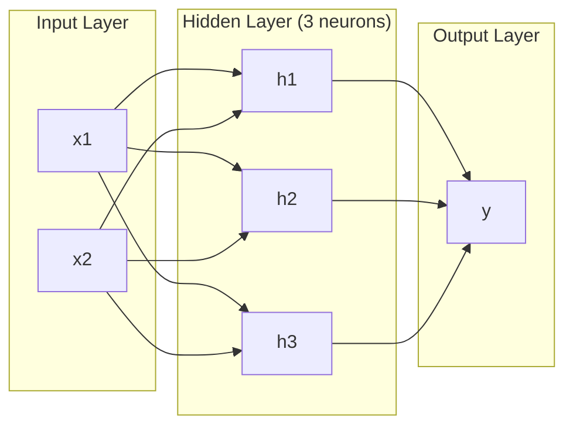
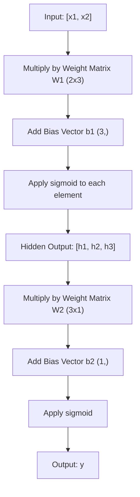
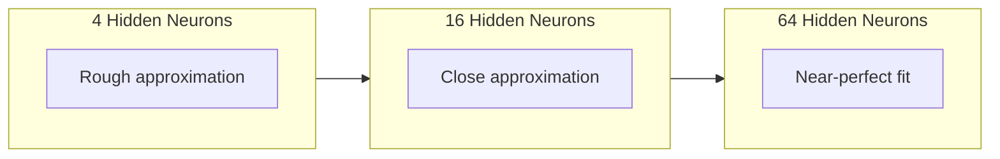

# Mạng đa lớp và Lan truyền tiến (Forward Pass)

> Một neuron vẽ một đường thẳng. Xếp chồng chúng lên nhau, bạn có thể vẽ bất cứ thứ gì.

**Type:** Build
**Languages:** Python
**Prerequisites:** Phase 01 (Math Foundations), Lesson 03.01 (The Perceptron)
**Time:** ~90 phút

## Mục tiêu học tập

- Xây dựng mạng đa lớp từ đầu với các lớp `Layer` và `Network` thực hiện hoàn chỉnh một lượt lan truyền tiến (forward pass)
- Theo dõi kích thước ma trận qua từng lớp của mạng và xác định các lỗi sai lệch về hình dạng (shape mismatch)
- Giải thích cách việc xếp chồng các hàm kích hoạt phi tuyến tính cho phép mạng học được các ranh giới quyết định (decision boundary) dạng đường cong
- Giải quyết bài toán XOR bằng kiến trúc 2-2-1 với các trọng số sigmoid được tinh chỉnh thủ công

## Vấn đề

Một neuron đơn lẻ chỉ là một công cụ vẽ đường thẳng. Chỉ vậy thôi. Một đường thẳng xuyên qua dữ liệu của bạn. Mọi vấn đề thực tế trong AI -- nhận diện hình ảnh, hiểu ngôn ngữ, chơi cờ vây -- đều đòi hỏi các đường cong. Xếp chồng các neuron thành các lớp chính là cách bạn tạo ra các đường cong đó.

Năm 1969, Minsky và Papert đã chứng minh hạn chế này là chí mạng: một mạng đơn lớp không thể học được XOR. Không phải là "gặp khó khăn khi học" -- mà là về mặt toán học là không thể. Bảng chân trị XOR đặt [0,1] và [1,0] ở một phía, [0,0] và [1,1] ở phía còn lại. Không có đường thẳng nào có thể chia tách chúng.

Điều này đã khiến nguồn tài trợ cho mạng thần kinh bị cắt giảm trong hơn một thập kỷ. Giải pháp thực ra rất hiển nhiên khi nhìn lại: đừng chỉ dùng một lớp. Hãy xếp chồng các neuron thành nhiều lớp. Hãy để lớp đầu tiên phân tách không gian đầu vào thành các đặc trưng mới, và để lớp thứ hai kết hợp các đặc trưng đó thành các quyết định mà không một đường thẳng đơn lẻ nào có thể tạo ra.

Cấu trúc xếp chồng đó chính là mạng đa lớp. Nó là nền tảng của mọi mô hình deep learning đang được sử dụng hiện nay. Lan truyền tiến -- dữ liệu chảy từ đầu vào qua các lớp ẩn đến đầu ra -- là thứ đầu tiên bạn cần xây dựng trước khi bất cứ thứ gì khác hoạt động.

## Khái niệm

### Các lớp: Đầu vào, Ẩn, Đầu ra

Một mạng đa lớp có ba loại lớp:

**Lớp đầu vào (Input layer)** -- thực tế không hẳn là một lớp. Nó chứa dữ liệu thô của bạn. Hai đặc trưng nghĩa là hai nút đầu vào. Không có tính toán nào xảy ra ở đây.

**Các lớp ẩn (Hidden layers)** -- nơi công việc thực sự diễn ra. Mỗi neuron lấy mọi đầu ra từ lớp trước đó, áp dụng trọng số và độ chệch (bias), sau đó truyền kết quả qua một hàm kích hoạt. Được gọi là "ẩn" vì bạn không bao giờ nhìn thấy trực tiếp các giá trị này trong dữ liệu huấn luyện.

**Lớp đầu ra (Output layer)** -- câu trả lời cuối cùng. Đối với phân loại nhị phân, dùng một neuron với hàm sigmoid. Đối với phân loại đa lớp, dùng một neuron cho mỗi lớp.



Đây là mạng 2-3-1. Hai đầu vào, ba neuron ẩn, một đầu ra. Mỗi kết nối mang một trọng số. Mỗi neuron (trừ đầu vào) mang một độ chệch.

Mỗi lớp tạo ra một vector các con số gọi là trạng thái ẩn (hidden state). Đối với văn bản, các trạng thái ẩn làm tăng số chiều -- mã hóa một từ thành 768 con số để nắm bắt ý nghĩa ngữ nghĩa. Đối với hình ảnh, chúng làm giảm số chiều -- nén hàng triệu pixel thành một biểu diễn có thể quản lý được. Trạng thái ẩn là nơi chứa đựng tri thức học được.

### Neuron và Hàm kích hoạt

Mỗi neuron thực hiện ba việc:

1. Nhân mọi đầu vào với trọng số tương ứng của nó
2. Cộng tất cả các tích và thêm một độ chệch
3. Truyền tổng đó qua một hàm kích hoạt

Hiện tại, hàm kích hoạt là sigmoid:

```
sigmoid(z) = 1 / (1 + e^(-z))
```

Sigmoid ép bất kỳ con số nào vào phạm vi (0, 1). Các đầu vào dương lớn đẩy về phía 1. Các đầu vào âm lớn đẩy về phía 0. Số 0 ánh xạ thành 0.5. Đường cong mượt mà này là thứ giúp việc học trở nên khả thi -- không giống như bước nhảy cứng nhắc của perceptron, sigmoid có đạo hàm ở mọi nơi.

### Lan truyền tiến: Dữ liệu chảy như thế nào

Lan truyền tiến đẩy dữ liệu đầu vào qua mạng, từng lớp một, cho đến khi nó đến đầu ra. Không có việc học nào xảy ra trong quá trình lan truyền tiến. Đó là tính toán thuần túy: nhân, cộng, kích hoạt, lặp lại.



Tại mỗi lớp, ba thao tác xảy ra theo trình tự:

```
z = W * input + b       (linear transformation)
a = sigmoid(z)           (activation)
```

Đầu ra của một lớp trở thành đầu vào của lớp tiếp theo. Đó là toàn bộ quá trình lan truyền tiến.

### Kích thước ma trận

Theo dõi kích thước là kỹ năng gỡ lỗi quan trọng nhất trong deep learning. Đây là mạng 2-3-1:

| Bước | Thao tác | Kích thước | Hình dạng kết quả |
|------|-----------|------------|-------------|
| Đầu vào | x | -- | (2,) |
| Tuyến tính ẩn | W1 * x + b1 | W1: (3, 2), b1: (3,) | (3,) |
| Kích hoạt ẩn | sigmoid(z1) | -- | (3,) |
| Tuyến tính đầu ra | W2 * h + b2 | W2: (1, 3), b2: (1,) | (1,) |
| Kích hoạt đầu ra | sigmoid(z2) | -- | (1,) |

Quy tắc: ma trận trọng số W tại lớp k có hình dạng (số_neuron_lớp_k, số_neuron_lớp_k_trừ_1). Số hàng khớp với lớp hiện tại. Số cột khớp với lớp trước đó. Nếu các hình dạng không khớp, bạn có lỗi.

### Định lý xấp xỉ phổ quát (Universal Approximation Theorem)

Năm 1989, George Cybenko đã chứng minh một điều đáng kinh ngạc: một mạng thần kinh với một lớp ẩn duy nhất và đủ số lượng neuron có thể xấp xỉ bất kỳ hàm liên tục nào với độ chính xác mong muốn.

Điều này không có nghĩa là một lớp ẩn luôn là tốt nhất. Nó có nghĩa là kiến trúc này về mặt lý thuyết là có khả năng. Trong thực tế, các mạng sâu hơn (nhiều lớp hơn, ít neuron hơn trên mỗi lớp) học cùng các hàm đó với tổng số tham số ít hơn nhiều so với các mạng nông và rộng. Đó là lý do tại sao deep learning hiệu quả.

Trực giác: mỗi neuron trong lớp ẩn học một "bướu" hoặc một đặc trưng. Đủ số lượng bướu đặt ở đúng vị trí có thể xấp xỉ bất kỳ đường cong mượt mà nào. Càng nhiều neuron, càng nhiều bướu, xấp xỉ càng tốt.



### Tính khả hợp (Composability)

Các mạng thần kinh có tính khả hợp. Bạn có thể xếp chồng chúng, xâu chuỗi chúng, chạy chúng song song. Mô hình Whisper sử dụng mạng encoder để xử lý âm thanh và mạng decoder riêng biệt để tạo văn bản. Các LLM hiện đại là decoder-only. BERT là encoder-only. T5 là encoder-decoder. Việc lựa chọn kiến trúc xác định những gì mô hình có thể làm.

```figure
mlp-forward
```

## Xây dựng

Python thuần. Không dùng numpy. Mọi thao tác ma trận đều được viết từ đầu.

### Bước 1: Hàm kích hoạt Sigmoid

```python
import math

def sigmoid(x):
    x = max(-500.0, min(500.0, x))
    return 1.0 / (1.0 + math.exp(-x))
```

Việc giới hạn trong khoảng [-500, 500] ngăn chặn tràn số. `math.exp(500)` là số lớn nhưng hữu hạn. `math.exp(1000)` là vô cùng.

### Bước 2: Lớp Layer

Thao tác quan trọng nhất trong toàn bộ deep learning là nhân ma trận. Mọi lớp, mọi attention head, mọi lượt lan truyền tiến -- tất cả đều là nhân ma trận. Một lớp tuyến tính lấy một vector đầu vào, nhân nó với một ma trận trọng số và cộng thêm một vector độ chệch: y = Wx + b. Phương trình đơn lẻ đó chiếm 90% khối lượng tính toán trong một mạng thần kinh.

Một lớp chứa một ma trận trọng số và một vector độ chệch. Phương thức `forward` của nó lấy một vector đầu vào và trả về đầu ra đã qua kích hoạt.

```python
class Layer:
    def __init__(self, n_inputs, n_neurons, weights=None, biases=None):
        if weights is not None:
            self.weights = weights
        else:
            import random
            self.weights = [
                [random.uniform(-1, 1) for _ in range(n_inputs)]
                for _ in range(n_neurons)
            ]
        if biases is not None:
            self.biases = biases
        else:
            self.biases = [0.0] * n_neurons

    def forward(self, inputs):
        self.last_input = inputs
        self.last_output = []
        for neuron_idx in range(len(self.weights)):
            z = sum(
                w * x for w, x in zip(self.weights[neuron_idx], inputs)
            )
            z += self.biases[neuron_idx]
            self.last_output.append(sigmoid(z))
        return self.last_output
```

Ma trận trọng số có hình dạng (n_neurons, n_inputs). Mỗi hàng là trọng số của một neuron trên tất cả các đầu vào. Phương thức `forward` lặp qua các neuron, tính tổng có trọng số cộng với độ chệch, áp dụng sigmoid và thu thập kết quả.

### Bước 3: Lớp Network

Một mạng là một danh sách các lớp. Lan truyền tiến xâu chuỗi chúng lại: đầu ra của lớp k truyền vào lớp k+1.

```python
class Network:
    def __init__(self, layers):
        self.layers = layers

    def forward(self, inputs):
        current = inputs
        for layer in self.layers:
            current = layer.forward(current)
        return current
```

Đó là toàn bộ quá trình lan truyền tiến. Bốn dòng logic. Dữ liệu đi vào, chảy qua mọi lớp, đi ra ở phía bên kia.

### Bước 4: XOR với trọng số tinh chỉnh thủ công

Trong Bài 01, chúng ta đã giải XOR bằng cách kết hợp các perceptron OR, NAND và AND. Bây giờ hãy làm điều tương tự với các lớp `Layer` và `Network` của chúng ta. Kiến trúc 2-2-1: hai đầu vào, hai neuron ẩn, một đầu ra.

```python
hidden = Layer(
    n_inputs=2,
    n_neurons=2,
    weights=[[20.0, 20.0], [-20.0, -20.0]],
    biases=[-10.0, 30.0],
)

output = Layer(
    n_inputs=2,
    n_neurons=1,
    weights=[[20.0, 20.0]],
    biases=[-30.0],
)

xor_net = Network([hidden, output])

xor_data = [
    ([0, 0], 0),
    ([0, 1], 1),
    ([1, 0], 1),
    ([1, 1], 0),
]

for inputs, expected in xor_data:
    result = xor_net.forward(inputs)
    predicted = 1 if result[0] >= 0.5 else 0
    print(f"  {inputs} -> {result[0]:.6f} (rounded: {predicted}, expected: {expected})")
```

Các trọng số lớn (20, -20) làm cho sigmoid hoạt động giống như một hàm bước (step function). Neuron ẩn đầu tiên xấp xỉ OR. Neuron thứ hai xấp xỉ NAND. Neuron đầu ra kết hợp chúng thành AND, chính là XOR.

### Bước 5: Phân loại hình tròn

Một bài toán khó hơn: phân loại các điểm 2D là nằm trong hay ngoài hình tròn bán kính 0.5 có tâm tại gốc tọa độ. Điều này đòi hỏi một ranh giới quyết định dạng đường cong -- điều không thể đối với một perceptron đơn lẻ.

```python
import random
import math

random.seed(42)

data = []
for _ in range(200):
    x = random.uniform(-1, 1)
    y = random.uniform(-1, 1)
    label = 1 if (x * x + y * y) < 0.25 else 0
    data.append(([x, y], label))

circle_net = Network([
    Layer(n_inputs=2, n_neurons=8),
    Layer(n_inputs=8, n_neurons=1),
])
```

Với các trọng số ngẫu nhiên, mạng sẽ không phân loại tốt. Nhưng quá trình lan truyền tiến vẫn chạy. Đây chính là điểm mấu chốt -- lan truyền tiến chỉ là tính toán. Việc học các trọng số đúng là lan truyền ngược (backpropagation), sẽ có trong Bài 03.

```python
correct = 0
for inputs, expected in data:
    result = circle_net.forward(inputs)
    predicted = 1 if result[0] >= 0.5 else 0
    if predicted == expected:
        correct += 1

print(f"Accuracy with random weights: {correct}/{len(data)} ({100*correct/len(data):.1f}%)")
```

Trọng số ngẫu nhiên cho độ chính xác kém -- thường tệ hơn cả việc đoán lớp chiếm đa số. Sau khi huấn luyện (Bài 03), cùng kiến trúc này với 8 neuron ẩn sẽ vẽ ra một ranh giới cong phân tách bên trong và bên ngoài.

## Sử dụng

PyTorch thực hiện mọi thứ ở trên chỉ trong bốn dòng:

```python
import torch
import torch.nn as nn

model = nn.Sequential(
    nn.Linear(2, 8),
    nn.Sigmoid(),
    nn.Linear(8, 1),
    nn.Sigmoid(),
)

x = torch.tensor([[0.0, 0.0], [0.0, 1.0], [1.0, 0.0], [1.0, 1.0]])
output = model(x)
print(output)
```

`nn.Linear(2, 8)` là lớp `Layer` của bạn: ma trận trọng số hình dạng (8, 2), vector độ chệch hình dạng (8,). `nn.Sigmoid()` là hàm sigmoid của bạn được áp dụng theo từng phần tử. `nn.Sequential` là lớp `Network` của bạn: xâu chuỗi các lớp theo thứ tự.

Sự khác biệt nằm ở tốc độ và quy mô. PyTorch chạy trên GPU, xử lý các lô (batch) hàng triệu mẫu và tự động tính toán gradient cho lan truyền ngược. Nhưng logic lan truyền tiến thì giống hệt với những gì bạn vừa xây dựng từ đầu.

## Triển khai

Bài học này tạo ra một gợi ý có thể tái sử dụng để thiết kế kiến trúc mạng:

- `outputs/prompt-network-architect.md`

Hãy sử dụng nó khi bạn cần quyết định số lượng lớp, số lượng neuron mỗi lớp và hàm kích hoạt nào để sử dụng cho một bài toán cụ thể.

## Bài tập

1. Xây dựng mạng 2-4-2-1 (hai lớp ẩn) và chạy lan truyền tiến trên dữ liệu XOR với trọng số ngẫu nhiên. In ra đầu ra của lớp ẩn trung gian để xem cách biểu diễn biến đổi tại mỗi lớp.

2. Thay đổi kích thước lớp ẩn trong bộ phân loại hình tròn từ 8 thành 2, sau đó thành 32. Chạy lan truyền tiến với trọng số ngẫu nhiên mỗi lần. Số lượng neuron ẩn có làm thay đổi phạm vi hoặc phân phối đầu ra không? Tại sao?

3. Triển khai phương thức `count_parameters` trên lớp `Network` trả về tổng số trọng số và độ chệch có thể huấn luyện. Kiểm tra nó trên mạng 784-256-128-10 (kiến trúc MNIST kinh điển). Nó có bao nhiêu tham số?

4. Xây dựng lan truyền tiến cho mạng 3-4-4-2. Cấp cho nó các giá trị màu RGB (được chuẩn hóa về 0-1) và quan sát hai đầu ra. Đây là kiến trúc cho một bộ phân loại màu đơn giản với hai lớp.

5. Thay thế sigmoid bằng hàm "leaky step": trả về 0.01 * z nếu z < 0, ngược lại trả về 1.0. Chạy lan truyền tiến trên XOR với cùng các trọng số tinh chỉnh thủ công từ Bước 4. Nó có còn hoạt động không? Tại sao sigmoid mượt mà lại được ưu tiên hơn các điểm cắt cứng?

## Thuật ngữ chính

| Thuật ngữ | Cách gọi thông thường | Ý nghĩa thực tế |
|------|----------------|----------------------|
| Forward pass | "Chạy mô hình" | Đẩy đầu vào qua mọi lớp -- nhân với trọng số, cộng độ chệch, kích hoạt -- để tạo ra đầu ra |
| Hidden layer | "Phần ở giữa" | Bất kỳ lớp nào giữa đầu vào và đầu ra mà giá trị của nó không được quan sát trực tiếp trong dữ liệu |
| Multi-layer network | "Mạng thần kinh sâu" | Các lớp neuron xếp chồng tuần tự, nơi đầu ra của lớp này cung cấp cho đầu vào của lớp tiếp theo |
| Activation function | "Tính phi tuyến" | Một hàm được áp dụng sau biến đổi tuyến tính để đưa các đường cong vào ranh giới quyết định |
| Sigmoid | "Đường cong chữ S" | sigma(z) = 1/(1+e^(-z)), ép bất kỳ số thực nào về (0,1), mượt mà và có đạo hàm ở mọi nơi |
| Weight matrix | "Các tham số" | Ma trận W có hình dạng (số_neuron_lớp_hiện_tại, số_neuron_lớp_trước) chứa sức mạnh kết nối có thể học được |
| Bias vector | "Độ lệch" | Một vector được cộng sau khi nhân ma trận, cho phép các neuron kích hoạt ngay cả khi tất cả đầu vào bằng 0 |
| Universal approximation | "Mạng thần kinh học được mọi thứ" | Một lớp ẩn duy nhất với đủ neuron có thể xấp xỉ bất kỳ hàm liên tục nào -- nhưng "đủ" có thể nghĩa là hàng tỷ |
| Linear transformation | "Bước nhân ma trận" | z = W * x + b, phép tính trước khi kích hoạt, ánh xạ đầu vào sang một không gian mới |
| Decision boundary | "Nơi bộ phân loại chuyển đổi" | Bề mặt trong không gian đầu vào nơi đầu ra của mạng vượt qua ngưỡng phân loại |

## Đọc thêm

- Michael Nielsen, "Neural Networks and Deep Learning", Chương 1-2 (http://neuralnetworksanddeeplearning.com/) -- giải thích miễn phí rõ ràng nhất về lan truyền tiến và cấu trúc mạng, với các hình ảnh trực quan tương tác
- Cybenko, "Approximation by Superpositions of a Sigmoidal Function" (1989) -- bài báo gốc về định lý xấp xỉ phổ quát, khá dễ đọc
- 3Blue1Brown, "But what is a neural network?" (https://www.youtube.com/watch?v=aircAruvnKk) -- video 20 phút trực quan về các lớp, trọng số và lan truyền tiến giúp xây dựng mô hình tư duy đúng đắn
- Goodfellow, Bengio, Courville, "Deep Learning", Chương 6 (https://www.deeplearningbook.org/) -- tài liệu tham khảo tiêu chuẩn cho mạng đa lớp, miễn phí trực tuyến