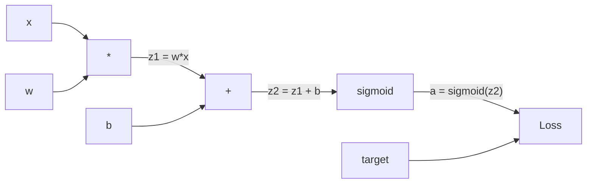
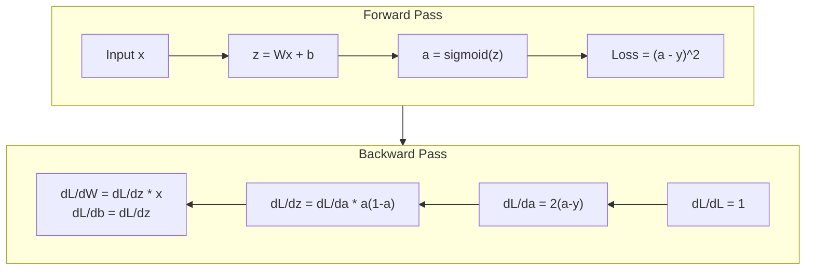
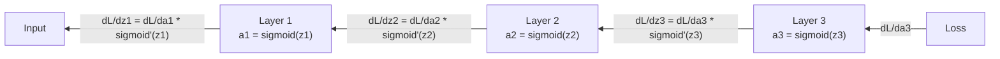

# Backpropagation từ đầu (Backpropagation from Scratch)

> Backpropagation là thuật toán giúp việc học trở nên khả thi. Nếu không có nó, các mạng thần kinh chỉ là những bộ tạo số ngẫu nhiên đắt đỏ.

**Type:** Build
**Languages:** Python
**Prerequisites:** Bài 03.02 (Mạng đa lớp - Multi-Layer Networks)
**Time:** ~120 phút

## Mục tiêu học tập

- Triển khai một engine autograd dựa trên Value, xây dựng đồ thị tính toán và tính toán gradient thông qua sắp xếp topo (topological sort)
- Suy luận backward pass cho phép cộng, phép nhân và sigmoid bằng quy tắc chuỗi (chain rule)
- Huấn luyện mạng đa lớp trên bài toán XOR và phân loại hình tròn chỉ bằng engine backpropagation tự xây dựng
- Nhận diện vấn đề vanishing gradient trong các mạng sigmoid sâu và giải thích tại sao gradient lại giảm theo cấp số nhân

## Vấn đề

Mạng của bạn có một lớp ẩn với 768 đầu vào và 3072 đầu ra. Đó là 2.359.296 trọng số. Nó đưa ra dự đoán sai. Trọng số nào gây ra lỗi? Kiểm tra từng trọng số riêng lẻ đồng nghĩa với 2,3 triệu lần forward pass. Backpropagation tính toán tất cả 2,3 triệu gradient trong một lần backward pass duy nhất. Đó không phải là tối ưu hóa. Đó là sự khác biệt giữa việc có thể huấn luyện được và không thể.

Cách tiếp cận ngây thơ: lấy một trọng số, thay đổi nó một lượng nhỏ, chạy lại forward pass, đo lường xem loss tăng hay giảm. Điều đó cho bạn gradient của trọng số đó. Bây giờ hãy làm điều đó cho mọi trọng số trong mạng. Nhân với hàng ngàn bước huấn luyện và hàng triệu điểm dữ liệu. Bạn sẽ cần thời gian địa chất để huấn luyện bất cứ thứ gì hữu ích.

Backpropagation giải quyết vấn đề này. Một lần forward pass, một lần backward pass, tất cả gradient được tính toán. Bí quyết là quy tắc chuỗi từ giải tích, được áp dụng một cách có hệ thống vào đồ thị tính toán. Đây là thuật toán làm cho deep learning trở nên thực tế. Nếu không có nó, chúng ta vẫn sẽ mắc kẹt với các bài toán đồ chơi.

## Khái niệm

### Quy tắc chuỗi (Chain Rule), áp dụng cho mạng

Bạn đã thấy quy tắc chuỗi trong Giai đoạn 01, Bài 05. Tóm tắt nhanh: nếu y = f(g(x)), thì dy/dx = f'(g(x)) * g'(x). Bạn nhân các đạo hàm dọc theo chuỗi.

Trong một mạng thần kinh, "chuỗi" là trình tự các thao tác từ đầu vào đến loss. Mỗi lớp áp dụng trọng số, cộng bias, đi qua một hàm kích hoạt. Hàm loss so sánh đầu ra cuối cùng với mục tiêu. Backpropagation truy vết chuỗi này ngược lại, tính toán xem mỗi thao tác đã đóng góp như thế nào vào lỗi.

### Đồ thị tính toán (Computational Graphs)

Mỗi forward pass xây dựng một đồ thị. Mỗi nút là một thao tác (nhân, cộng, sigmoid). Mỗi cạnh mang một giá trị về phía trước và một gradient về phía sau.



Forward pass: các giá trị chảy từ trái sang phải. x và w tạo ra z1 = w*x. Cộng b để có z2. Sigmoid cho ra kích hoạt a. So sánh a với mục tiêu y bằng hàm loss.

Backward pass: các gradient chảy từ phải sang trái. Bắt đầu với dL/da (cách loss thay đổi theo kích hoạt). Nhân với da/dz2 (đạo hàm sigmoid). Điều đó cho ra dL/dz2. Tách thành dL/db (bằng dL/dz2, vì z2 = z1 + b) và dL/dz1. Sau đó dL/dw = dL/dz1 * x và dL/dx = dL/dz1 * w.

Mỗi nút trong đồ thị có một công việc trong quá trình backward pass: lấy gradient từ phía trên truyền xuống, nhân với đạo hàm cục bộ của nó, và truyền tiếp xuống dưới.

### Forward vs Backward



Forward pass lưu trữ mọi giá trị trung gian: z, a, các đầu vào cho mỗi lớp. Backward pass cần các giá trị đã lưu này để tính toán gradient. Đây là sự đánh đổi giữa bộ nhớ và tính toán cốt lõi của backprop. Bạn đánh đổi bộ nhớ (lưu trữ các kích hoạt) để lấy tốc độ (một lần truyền thay vì hàng triệu lần).

### Dòng chảy Gradient qua mạng

Đối với mạng 3 lớp, các gradient liên kết qua từng lớp:



Tại mỗi lớp, gradient được nhân với đạo hàm sigmoid. Đạo hàm sigmoid là a * (1 - a), đạt cực đại tại 0.25 (khi a = 0.5). Sâu ba lớp, gradient đã bị nhân với tối đa 0.25^3 = 0.0156. Mười lớp: 0.25^10 = 0.000001.

### Vanishing Gradients

Đây là vấn đề vanishing gradient. Sigmoid nén đầu ra của nó trong khoảng từ 0 đến 1. Đạo hàm của nó luôn nhỏ hơn 0.25. Chồng đủ các lớp sigmoid và gradient sẽ co lại thành không. Các lớp đầu tiên hầu như không học được gì vì chúng nhận được gradient gần bằng không.

```
sigmoid(z):     Output range [0, 1]
sigmoid'(z):    Max value 0.25 (at z = 0)

After 5 layers:   gradient * 0.25^5 = 0.001x original
After 10 layers:  gradient * 0.25^10 = 0.000001x original
```

Đây là lý do tại sao các mạng sigmoid sâu gần như không thể huấn luyện được. Giải pháp -- ReLU và các biến thể của nó -- là chủ đề của Bài 04. Hiện tại, hãy hiểu rằng backprop hoạt động hoàn hảo. Vấn đề nằm ở những gì nó đang xử lý.

### Suy luận Gradient cho mạng 2 lớp

Toán học cụ thể cho một mạng với đầu vào x, lớp ẩn với sigmoid, lớp đầu ra với sigmoid, và MSE loss.

Forward pass:
```
z1 = W1 * x + b1
a1 = sigmoid(z1)
z2 = W2 * a1 + b2
a2 = sigmoid(z2)
L = (a2 - y)^2
```

Backward pass (áp dụng quy tắc chuỗi từng bước):
```
dL/da2 = 2(a2 - y)
da2/dz2 = a2 * (1 - a2)
dL/dz2 = dL/da2 * da2/dz2 = 2(a2 - y) * a2 * (1 - a2)

dL/dW2 = dL/dz2 * a1
dL/db2 = dL/dz2

dL/da1 = dL/dz2 * W2
da1/dz1 = a1 * (1 - a1)
dL/dz1 = dL/da1 * da1/dz1

dL/dW1 = dL/dz1 * x
dL/db1 = dL/dz1
```

Mỗi gradient là một tích của các đạo hàm cục bộ được truy vết ngược từ loss. Đó là tất cả những gì backpropagation thực hiện.

```figure
backprop-vanishing
```

## Xây dựng

### Bước 1: Nút Value

Mỗi con số trong tính toán của chúng ta trở thành một Value. Nó lưu trữ dữ liệu, gradient của nó, và cách nó được tạo ra (để nó biết cách tính gradient ngược lại).

```python
class Value:
    def __init__(self, data, children=(), op=''):
        self.data = data
        self.grad = 0.0
        self._backward = lambda: None
        self._children = set(children)
        self._op = op

    def __repr__(self):
        return f"Value(data={self.data:.4f}, grad={self.grad:.4f})"
```

Chưa có gradient (0.0). Chưa có hàm backward (no-op). `_children` theo dõi các Value nào đã tạo ra giá trị này, để chúng ta có thể sắp xếp topo đồ thị sau đó.

### Bước 2: Các thao tác với hàm Backward

Mỗi thao tác tạo ra một Value mới và xác định cách gradient chảy ngược qua nó.

```python
def __add__(self, other):
    other = other if isinstance(other, Value) else Value(other)
    out = Value(self.data + other.data, (self, other), '+')

    def _backward():
        self.grad += out.grad
        other.grad += out.grad

    out._backward = _backward
    return out

def __mul__(self, other):
    other = other if isinstance(other, Value) else Value(other)
    out = Value(self.data * other.data, (self, other), '*')

    def _backward():
        self.grad += other.data * out.grad
        other.grad += self.data * out.grad

    out._backward = _backward
    return out
```

Đối với phép cộng: d(a+b)/da = 1, d(a+b)/db = 1. Vì vậy, cả hai đầu vào đều nhận trực tiếp gradient của đầu ra.

Đối với phép nhân: d(a*b)/da = b, d(a*b)/db = a. Mỗi đầu vào nhận giá trị của đầu vào kia nhân với gradient đầu ra.

`+=` là rất quan trọng. Một Value có thể được sử dụng trong nhiều thao tác. Gradient của nó là tổng các gradient từ tất cả các đường dẫn.

### Bước 3: Sigmoid và Loss

```python
import math

def sigmoid(self):
    x = self.data
    x = max(-500, min(500, x))
    s = 1.0 / (1.0 + math.exp(-x))
    out = Value(s, (self,), 'sigmoid')

    def _backward():
        self.grad += (s * (1 - s)) * out.grad

    out._backward = _backward
    return out
```

Đạo hàm Sigmoid: sigmoid(x) * (1 - sigmoid(x)). Chúng ta đã tính sigmoid(x) = s trong quá trình forward pass. Hãy tái sử dụng nó. Không cần làm thêm việc.

```python
def mse_loss(predicted, target):
    diff = predicted + Value(-target)
    return diff * diff
```

MSE cho một đầu ra duy nhất: (predicted - target)^2. Chúng ta biểu diễn phép trừ dưới dạng phép cộng với một Value đã bị phủ định.

### Bước 4: Backward Pass

Sắp xếp topo đảm bảo chúng ta xử lý các nút theo đúng thứ tự -- gradient của một nút được tích lũy đầy đủ trước khi chúng ta truyền qua nó.

```python
def backward(self):
    topo = []
    visited = set()

    def build_topo(v):
        if v not in visited:
            visited.add(v)
            for child in v._children:
                build_topo(child)
            topo.append(v)

    build_topo(self)
    self.grad = 1.0
    for v in reversed(topo):
        v._backward()
```

Bắt đầu tại loss (gradient = 1.0, vì dL/dL = 1). Đi ngược qua đồ thị đã sắp xếp. `_backward` của mỗi nút đẩy gradient đến các nút con của nó.

### Bước 5: Lớp và Mạng

```python
import random

class Neuron:
    def __init__(self, n_inputs):
        scale = (2.0 / n_inputs) ** 0.5
        self.weights = [Value(random.uniform(-scale, scale)) for _ in range(n_inputs)]
        self.bias = Value(0.0)

    def __call__(self, x):
        act = sum((wi * xi for wi, xi in zip(self.weights, x)), self.bias)
        return act.sigmoid()

    def parameters(self):
        return self.weights + [self.bias]


class Layer:
    def __init__(self, n_inputs, n_outputs):
        self.neurons = [Neuron(n_inputs) for _ in range(n_outputs)]

    def __call__(self, x):
        out = [n(x) for n in self.neurons]
        return out[0] if len(out) == 1 else out

    def parameters(self):
        params = []
        for n in self.neurons:
            params.extend(n.parameters())
        return params


class Network:
    def __init__(self, sizes):
        self.layers = []
        for i in range(len(sizes) - 1):
            self.layers.append(Layer(sizes[i], sizes[i + 1]))

    def __call__(self, x):
        for layer in self.layers:
            x = layer(x)
            if not isinstance(x, list):
                x = [x]
        return x[0] if len(x) == 1 else x

    def parameters(self):
        params = []
        for layer in self.layers:
            params.extend(layer.parameters())
        return params

    def zero_grad(self):
        for p in self.parameters():
            p.grad = 0.0
```

Một Neuron nhận đầu vào, tính tổng có trọng số + bias, và áp dụng sigmoid. Khởi tạo trọng số được chia tỷ lệ theo sqrt(2/n_inputs) để ngăn chặn bão hòa sigmoid trong các mạng sâu hơn. Một Layer là một danh sách các Neuron. Một Network là một danh sách các Layer. Phương thức `parameters()` thu thập tất cả các Value có thể học được để chúng ta có thể cập nhật chúng.

### Bước 6: Huấn luyện trên XOR

```python
random.seed(42)
net = Network([2, 4, 1])

xor_data = [
    ([0.0, 0.0], 0.0),
    ([0.0, 1.0], 1.0),
    ([1.0, 0.0], 1.0),
    ([1.0, 1.0], 0.0),
]

learning_rate = 1.0

for epoch in range(1000):
    total_loss = Value(0.0)
    for inputs, target in xor_data:
        x = [Value(i) for i in inputs]
        pred = net(x)
        loss = mse_loss(pred, target)
        total_loss = total_loss + loss

    net.zero_grad()
    total_loss.backward()

    for p in net.parameters():
        p.data -= learning_rate * p.grad

    if epoch % 100 == 0:
        print(f"Epoch {epoch:4d} | Loss: {total_loss.data:.6f}")

print("\nXOR Results:")
for inputs, target in xor_data:
    x = [Value(i) for i in inputs]
    pred = net(x)
    print(f"  {inputs} -> {pred.data:.4f} (expected {target})")
```

Xem loss giảm dần. Từ các dự đoán ngẫu nhiên đến các đầu ra XOR chính xác, được thúc đẩy hoàn toàn bởi backpropagation tính toán gradient và điều chỉnh trọng số theo đúng hướng.

### Bước 7: Phân loại hình tròn

Trong Bài 02, bạn đã tự điều chỉnh trọng số cho việc phân loại hình tròn. Bây giờ hãy để mạng tự học chúng.

```python
random.seed(7)

def generate_circle_data(n=100):
    data = []
    for _ in range(n):
        x1 = random.uniform(-1.5, 1.5)
        x2 = random.uniform(-1.5, 1.5)
        label = 1.0 if x1 * x1 + x2 * x2 < 1.0 else 0.0
        data.append(([x1, x2], label))
    return data

circle_data = generate_circle_data(80)

circle_net = Network([2, 8, 1])
learning_rate = 0.5

for epoch in range(2000):
    random.shuffle(circle_data)
    total_loss_val = 0.0
    for inputs, target in circle_data:
        x = [Value(i) for i in inputs]
        pred = circle_net(x)
        loss = mse_loss(pred, target)
        circle_net.zero_grad()
        loss.backward()
        for p in circle_net.parameters():
            p.data -= learning_rate * p.grad
        total_loss_val += loss.data

    if epoch % 200 == 0:
        correct = 0
        for inputs, target in circle_data:
            x = [Value(i) for i in inputs]
            pred = circle_net(x)
            predicted_class = 1.0 if pred.data > 0.5 else 0.0
            if predicted_class == target:
                correct += 1
        accuracy = correct / len(circle_data) * 100
        print(f"Epoch {epoch:4d} | Loss: {total_loss_val:.4f} | Accuracy: {accuracy:.1f}%")
```

Chúng ta sử dụng online SGD ở đây -- cập nhật trọng số sau mỗi mẫu thay vì tích lũy toàn bộ batch. Điều này phá vỡ sự đối xứng nhanh hơn và tránh bão hòa sigmoid trên toàn bộ cảnh quan loss. Xáo trộn dữ liệu mỗi epoch ngăn mạng ghi nhớ thứ tự.

Không cần điều chỉnh thủ công. Mạng tự khám phá ranh giới quyết định hình tròn. Đó là sức mạnh của backpropagation: bạn xác định kiến trúc, hàm loss và dữ liệu. Thuật toán tự tìm ra các trọng số.

## Sử dụng

PyTorch thực hiện mọi thứ ở trên chỉ trong vài dòng. Ý tưởng cốt lõi là giống hệt nhau -- autograd xây dựng đồ thị tính toán trong quá trình forward pass và truy vết ngược lại để tính toán gradient.

```python
import torch
import torch.nn as nn

model = nn.Sequential(
    nn.Linear(2, 4),
    nn.Sigmoid(),
    nn.Linear(4, 1),
    nn.Sigmoid(),
)
optimizer = torch.optim.SGD(model.parameters(), lr=1.0)
criterion = nn.MSELoss()

X = torch.tensor([[0,0],[0,1],[1,0],[1,1]], dtype=torch.float32)
y = torch.tensor([[0],[1],[1],[0]], dtype=torch.float32)

for epoch in range(1000):
    pred = model(X)
    loss = criterion(pred, y)
    optimizer.zero_grad()
    loss.backward()
    optimizer.step()

print("PyTorch XOR Results:")
with torch.no_grad():
    for i in range(4):
        pred = model(X[i])
        print(f"  {X[i].tolist()} -> {pred.item():.4f} (expected {y[i].item()})")
```

`loss.backward()` chính là `total_loss.backward()` của bạn. `optimizer.step()` là `p.data -= lr * p.grad` thủ công của bạn. `optimizer.zero_grad()` là `net.zero_grad()` của bạn. Cùng một thuật toán, triển khai ở cấp độ công nghiệp. PyTorch xử lý tăng tốc GPU, mixed precision, gradient checkpointing và hàng trăm loại lớp. Nhưng backward pass vẫn là cùng một quy tắc chuỗi áp dụng cho cùng một đồ thị tính toán.

Huấn luyện chạy forward pass, sau đó là backward pass, rồi cập nhật trọng số. Inference chỉ chạy forward pass. Không có gradient, không có cập nhật. Sự khác biệt này rất quan trọng vì inference là những gì xảy ra trong môi trường production. Khi bạn gọi một API như Claude hoặc GPT, bạn đang chạy inference -- prompt của bạn chảy về phía trước qua mạng, và các token xuất hiện ở đầu kia. Không có trọng số nào thay đổi. Hiểu về backprop rất quan trọng vì nó đã định hình mọi trọng số trong mạng đó.

## Ship It

Bài học này tạo ra:
- `outputs/prompt-gradient-debugger.md` -- một prompt có thể tái sử dụng để chẩn đoán các vấn đề về gradient (vanishing, exploding, NaN) trong bất kỳ mạng thần kinh nào

## Bài tập

1. Thêm phương thức `__sub__` vào lớp Value (a - b = a + (-1 * b)). Sau đó triển khai phương thức `__neg__`. Xác minh rằng các gradient là chính xác bằng cách so sánh với tính toán thủ công cho một biểu thức đơn giản như (a - b)^2.

2. Thêm phương thức `relu` vào Value (đầu ra max(0, x), đạo hàm là 1 nếu x > 0, ngược lại là 0). Thay thế sigmoid bằng relu trong các lớp ẩn và huấn luyện lại trên XOR. So sánh tốc độ hội tụ. Bạn sẽ thấy việc huấn luyện nhanh hơn -- đây là phần xem trước của Bài 04.

3. Triển khai phương thức `__pow__` trên Value cho các lũy thừa số nguyên. Sử dụng nó để thay thế `mse_loss` bằng biểu thức `(predicted - target) ** 2` thích hợp. Xác minh gradient khớp với triển khai ban đầu.

4. Thêm gradient clipping vào vòng lặp huấn luyện: sau khi gọi `backward()`, hãy cắt tất cả gradient về [-1, 1]. Huấn luyện một mạng sâu hơn (4+ lớp với sigmoid) và so sánh các đường cong loss có và không có clipping. Đây là biện pháp phòng thủ đầu tiên của bạn chống lại exploding gradients.

5. Xây dựng một hình ảnh trực quan: sau khi huấn luyện trên XOR, in gradient của mọi tham số trong mạng. Xác định lớp nào có gradient nhỏ nhất. Điều này minh họa vấn đề vanishing gradient mà bạn đã đọc trong phần Khái niệm.

## Thuật ngữ chính

| Thuật ngữ | Mọi người nói | Ý nghĩa thực sự |
|------|----------------|----------------------|
| Backpropagation | "Mạng đang học" | Một thuật toán tính toán dL/dw cho mọi trọng số bằng cách áp dụng quy tắc chuỗi ngược qua đồ thị tính toán |
| Computational graph | "Cấu trúc mạng" | Một đồ thị có hướng không chu trình (DAG) nơi các nút là các thao tác và các cạnh mang giá trị (forward) và gradient (backward) |
| Chain rule | "Nhân các đạo hàm" | Nếu y = f(g(x)), thì dy/dx = f'(g(x)) * g'(x) -- nền tảng toán học của backpropagation |
| Gradient | "Hướng tăng dốc nhất" | Đạo hàm riêng của loss đối với một tham số -- cho bạn biết cách thay đổi tham số đó để giảm loss |
| Vanishing gradient | "Mạng sâu không học được" | Gradient co lại theo cấp số nhân khi chúng truyền qua các lớp với các hàm kích hoạt bão hòa như sigmoid |
| Forward pass | "Chạy mạng" | Tính toán đầu ra từ đầu vào bằng cách tuần tự áp dụng các thao tác của từng lớp và lưu trữ các giá trị trung gian |
| Backward pass | "Tính toán gradient" | Duyệt đồ thị tính toán theo hướng ngược lại, tích lũy gradient tại mỗi nút bằng quy tắc chuỗi |
| Learning rate | "Tốc độ học" | Một đại lượng vô hướng kiểm soát kích thước bước khi cập nhật trọng số: w_new = w_old - lr * gradient |
| Topological sort | "Thứ tự đúng" | Một cách sắp xếp các nút đồ thị trong đó mỗi nút xuất hiện sau tất cả các nút mà nó phụ thuộc vào -- đảm bảo gradient được tích lũy đầy đủ trước khi truyền |
| Autograd | "Vi phân tự động" | Một hệ thống xây dựng đồ thị tính toán trong quá trình tính toán forward và tự động tính toán gradient -- những gì engine của PyTorch thực hiện |

## Đọc thêm

- Rumelhart, Hinton & Williams, "Learning representations by back-propagating errors" (1986) -- bài báo đưa backpropagation trở thành xu hướng chính và mở khóa việc huấn luyện mạng đa lớp
- 3Blue1Brown, chuỗi "Neural Networks" (https://www.youtube.com/playlist?list=PLZHQObOWTQDNU6R1_67000Dx_ZCJB-3pi) -- lời giải thích trực quan nhất về backpropagation và dòng chảy gradient qua các mạng