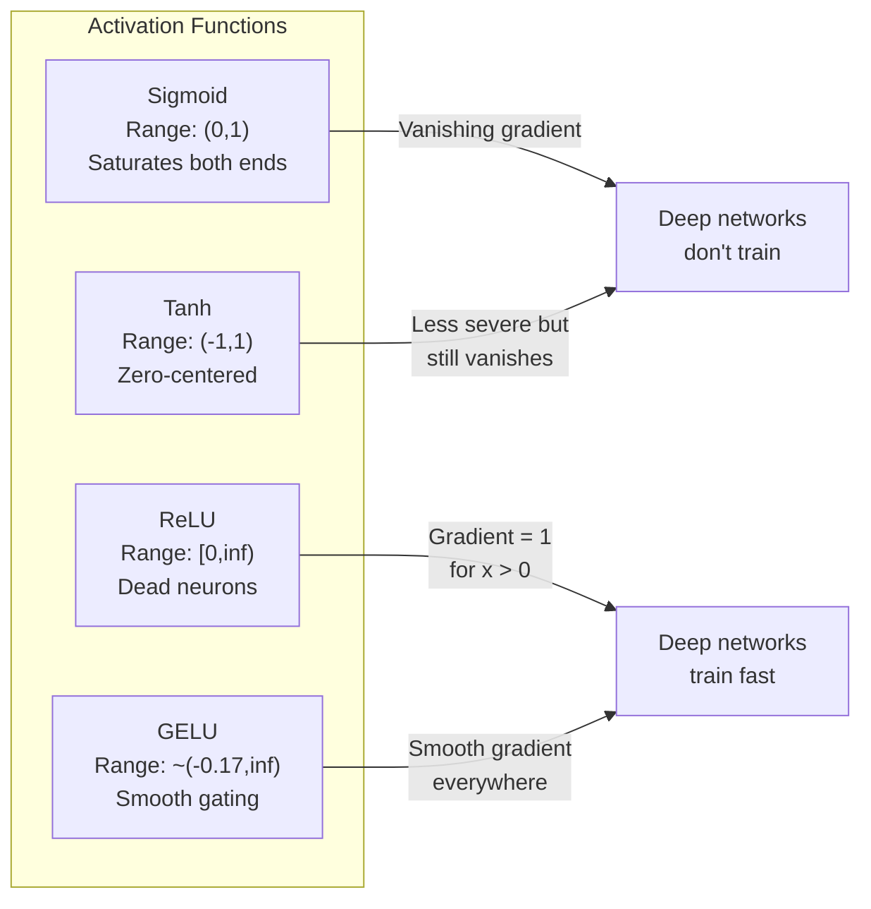
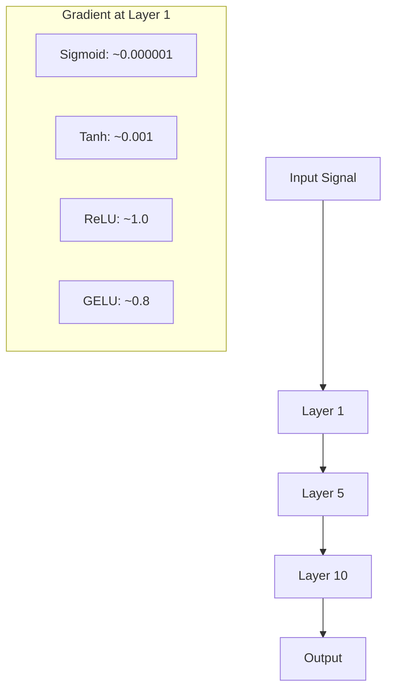
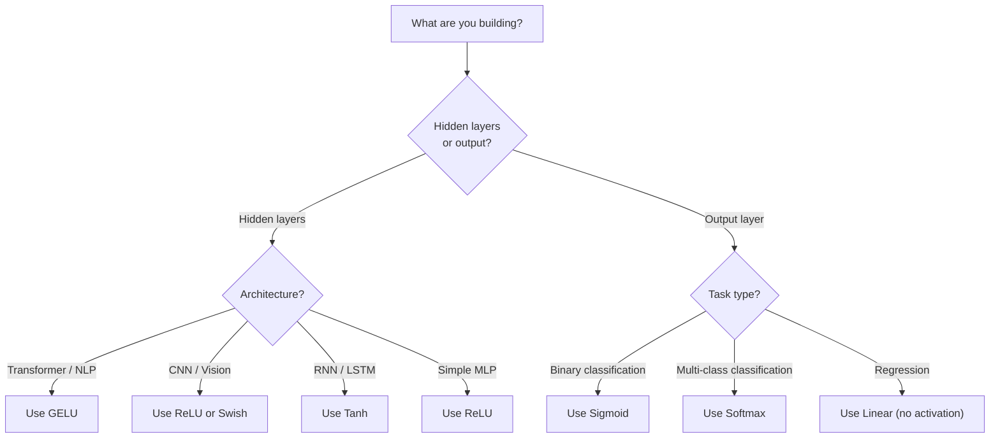

# Các hàm kích hoạt (Activation Functions)

> Nếu không có tính phi tuyến, mạng 100 lớp của bạn chỉ là một phép nhân ma trận phức tạp. Các hàm kích hoạt là những "cánh cổng" cho phép mạng thần kinh tư duy theo các đường cong.

**Type:** Build
**Languages:** Python
**Prerequisites:** Bài 03.03 (Lan truyền ngược - Backpropagation)
**Time:** ~75 phút

## Mục tiêu học tập

- Tự triển khai từ đầu các hàm sigmoid, tanh, ReLU, Leaky ReLU, GELU, Swish và softmax cùng với đạo hàm của chúng.
- Chẩn đoán vấn đề triệt tiêu gradient (vanishing gradient) bằng cách đo độ lớn của các giá trị kích hoạt qua hơn 10 lớp với các hàm kích hoạt khác nhau.
- Phát hiện các neuron "chết" trong mạng ReLU và giải thích tại sao GELU tránh được lỗi này.
- Lựa chọn hàm kích hoạt chính xác cho từng kiến trúc cụ thể (transformer, CNN, RNN, lớp đầu ra).

## Vấn đề

Hãy xếp chồng hai phép biến đổi tuyến tính: y = W2(W1x + b1) + b2. Khai triển nó ra: y = W2W1x + W2b1 + b2. Đó chỉ đơn giản là y = Ax + c -- một phép biến đổi tuyến tính duy nhất. Dù bạn có xếp chồng bao nhiêu lớp tuyến tính đi chăng nữa, kết quả vẫn sẽ suy giảm về một phép nhân ma trận. Mạng 100 lớp của bạn cũng chỉ có khả năng biểu diễn tương đương với một lớp duy nhất.

Đây không phải là một sự tò mò lý thuyết. Điều này có nghĩa là một mạng tuyến tính sâu thực sự không thể học được XOR, không thể phân loại tập dữ liệu hình xoắn ốc, không thể nhận diện khuôn mặt. Nếu không có các hàm kích hoạt, độ sâu chỉ là một ảo ảnh.

Các hàm kích hoạt phá vỡ tính tuyến tính. Chúng bẻ cong đầu ra của mỗi lớp thông qua một hàm phi tuyến, mang lại cho mạng khả năng uốn cong các ranh giới quyết định, xấp xỉ các hàm tùy ý và thực sự học hỏi. Nhưng nếu chọn sai hàm kích hoạt, gradient của bạn sẽ triệt tiêu về 0 (sigmoid trong mạng sâu), bùng nổ đến vô cùng (các hàm kích hoạt không bị chặn nếu không khởi tạo cẩn thận), hoặc các neuron của bạn sẽ chết vĩnh viễn (ReLU với các bias âm lớn). Việc lựa chọn hàm kích hoạt quyết định trực tiếp liệu mạng của bạn có học được hay không.

## Khái niệm

### Tại sao tính phi tuyến là cần thiết

Phép nhân ma trận có tính chất kết hợp. Nhân một vector với ma trận A rồi đến ma trận B cũng giống hệt như nhân với AB. Điều này có nghĩa là xếp chồng mười lớp tuyến tính về mặt toán học tương đương với một lớp tuyến tính với một ma trận lớn. Tất cả các tham số đó, tất cả độ sâu đó -- đều lãng phí. Bạn cần thứ gì đó để phá vỡ chuỗi này. Đó chính là công dụng của các hàm kích hoạt.

Đây là bằng chứng. Một lớp tuyến tính tính toán f(x) = Wx + b. Xếp chồng hai lớp:

```
Layer 1: h = W1 * x + b1
Layer 2: y = W2 * h + b2
```

Thay thế:

```
y = W2 * (W1 * x + b1) + b2
y = (W2 * W1) * x + (W2 * b1 + b2)
y = A * x + c
```

Vẫn là một lớp. Hãy chèn một hàm kích hoạt phi tuyến g() vào giữa các lớp:

```
h = g(W1 * x + b1)
y = W2 * h + b2
```

Bây giờ phép thay thế không còn rút gọn được nữa. W2 * g(W1 * x + b1) + b2 không thể quy về một phép biến đổi tuyến tính duy nhất. Mạng có thể biểu diễn các hàm phi tuyến. Mỗi lớp bổ sung kèm theo một hàm kích hoạt sẽ làm tăng khả năng biểu diễn của mạng.

### Sigmoid

Hàm kích hoạt nguyên bản cho mạng thần kinh.

```
sigmoid(x) = 1 / (1 + e^(-x))
```

Phạm vi đầu ra: (0, 1). Mượt mà, có đạo hàm, ánh xạ bất kỳ số thực nào thành một giá trị giống xác suất.

Đạo hàm:

```
sigmoid'(x) = sigmoid(x) * (1 - sigmoid(x))
```

Giá trị lớn nhất của đạo hàm này là 0.25, xảy ra tại x = 0. Trong lan truyền ngược, các gradient được nhân qua các lớp. Mười lớp sigmoid có nghĩa là gradient bị nhân với tối đa 0.25 mười lần:

```
0.25^10 = 0.000000953674
```

Nhỏ hơn một phần triệu so với tín hiệu ban đầu. Đây chính là vấn đề triệt tiêu gradient. Gradient ở các lớp đầu trở nên quá nhỏ khiến trọng số hầu như không cập nhật. Mạng có vẻ như đang học -- loss giảm ở các lớp sau -- nhưng các lớp đầu tiên đã bị đóng băng. Các mạng sigmoid sâu đơn giản là không thể huấn luyện được.

Vấn đề bổ sung: đầu ra của sigmoid luôn dương (0 đến 1), nghĩa là gradient trên các trọng số luôn cùng dấu. Điều này gây ra hiện tượng "zig-zag" trong quá trình gradient descent.

### Tanh

Phiên bản đã được căn giữa của sigmoid.

```
tanh(x) = (e^x - e^(-x)) / (e^x + e^(-x))
```

Phạm vi đầu ra: (-1, 1). Được căn giữa tại 0, giúp loại bỏ vấn đề zig-zag.

Đạo hàm:

```
tanh'(x) = 1 - tanh(x)^2
```

Đạo hàm lớn nhất là 1.0 tại x = 0 -- tốt gấp bốn lần sigmoid. Nhưng vấn đề triệt tiêu gradient vẫn tồn tại. Với các đầu vào dương hoặc âm lớn, đạo hàm tiến dần về 0. Mười lớp vẫn sẽ làm triệt tiêu gradient, chỉ là ít quyết liệt hơn.

### ReLU: Bước đột phá

Rectified Linear Unit. Được phổ biến cho deep learning bởi Nair và Hinton vào năm 2010 (bản thân hàm này có từ công trình của Fukushima năm 1969), nó đã thay đổi mọi thứ.

```
relu(x) = max(0, x)
```

Phạm vi đầu ra: [0, vô cùng). Đạo hàm cực kỳ đơn giản:

```
relu'(x) = 1  if x > 0
            0  if x <= 0
```

Không có hiện tượng triệt tiêu gradient đối với các đầu vào dương. Gradient chính xác bằng 1, được truyền thẳng qua. Đây là lý do tại sao các mạng sâu trở nên có thể huấn luyện được -- ReLU bảo toàn độ lớn gradient qua các lớp.

Tuy nhiên, có một chế độ lỗi: vấn đề neuron chết (dead neuron). Nếu đầu vào có trọng số của một neuron luôn âm (do bias âm lớn hoặc khởi tạo trọng số không may mắn), đầu ra của nó luôn bằng 0, gradient của nó luôn bằng 0, và nó không bao giờ cập nhật. Nó chết vĩnh viễn. Trong thực tế, 10-40% neuron trong mạng ReLU có thể chết trong quá trình huấn luyện.

### Leaky ReLU

Cách sửa lỗi đơn giản nhất cho neuron chết.

```
leaky_relu(x) = x        if x > 0
                alpha * x if x <= 0
```

Trong đó alpha là một hằng số nhỏ, thường là 0.01. Phía âm có một độ dốc nhỏ thay vì bằng 0, vì vậy các neuron chết vẫn nhận được tín hiệu gradient và có thể phục hồi.

### GELU: Mặc định hiện đại

Gaussian Error Linear Unit. Được giới thiệu bởi Hendrycks và Gimpel vào năm 2016. Đây là hàm kích hoạt mặc định trong BERT, GPT và hầu hết các transformer hiện đại.

```
gelu(x) = x * Phi(x)
```

Trong đó Phi(x) là hàm phân phối tích lũy của phân phối chuẩn tắc. Công thức xấp xỉ được sử dụng trong thực tế:

```
gelu(x) ~= 0.5 * x * (1 + tanh(sqrt(2/pi) * (x + 0.044715 * x^3)))
```

GELU mượt mà ở mọi nơi, cho phép các giá trị âm nhỏ (không giống như ReLU cắt cứng về 0), và có cách giải thích xác suất: nó trọng số hóa mỗi đầu vào dựa trên khả năng nó dương theo phân phối Gaussian. Cơ chế gating mượt mà này vượt trội hơn ReLU trong các kiến trúc transformer vì nó cung cấp luồng gradient tốt hơn và tránh hoàn toàn vấn đề neuron chết.

### Swish / SiLU

Hàm kích hoạt tự gating (self-gated) được phát hiện bởi Ramachandran và cộng sự vào năm 2017 thông qua tìm kiếm tự động.

```
swish(x) = x * sigmoid(x)
```

Swish chính thức là x * sigmoid(x). Google đã phát hiện ra nó thông qua tìm kiếm tự động trên không gian hàm kích hoạt -- một mạng thần kinh thiết kế các phần của mạng thần kinh.

Giống như GELU, nó mượt mà, không đơn điệu và cho phép các giá trị âm nhỏ. Sự khác biệt rất tinh tế: Swish sử dụng sigmoid để gating trong khi GELU sử dụng hàm phân phối tích lũy Gaussian. Trong thực tế, hiệu suất gần như giống hệt nhau. Swish được sử dụng trong EfficientNet và một số mô hình thị giác máy tính. GELU chiếm ưu thế trong các mô hình ngôn ngữ.

### Softmax: Hàm kích hoạt đầu ra

Không được sử dụng trong các lớp ẩn. Softmax chuyển đổi một vector các điểm số thô (logits) thành một phân phối xác suất.

```
softmax(x_i) = e^(x_i) / sum(e^(x_j) for all j)
```

Mỗi đầu ra nằm trong khoảng từ 0 đến 1. Tổng tất cả các đầu ra bằng 1. Điều này làm cho nó trở thành hàm kích hoạt cuối cùng tiêu chuẩn cho phân loại đa lớp. Logit lớn nhất nhận được xác suất cao nhất, nhưng không giống như argmax, softmax có đạo hàm và bảo toàn thông tin về độ tự tin tương đối.

### So sánh hình dạng



### So sánh luồng Gradient



### Khi nào dùng hàm kích hoạt nào



```figure
softmax-temperature
```

## Xây dựng

### Bước 1: Triển khai tất cả các hàm kích hoạt cùng đạo hàm

Mỗi hàm nhận vào một số thực và trả về một số thực. Mỗi hàm đạo hàm nhận đầu vào tương tự và trả về gradient.

```python
import math

def sigmoid(x):
    x = max(-500, min(500, x))
    return 1.0 / (1.0 + math.exp(-x))

def sigmoid_derivative(x):
    s = sigmoid(x)
    return s * (1 - s)

def tanh_act(x):
    return math.tanh(x)

def tanh_derivative(x):
    t = math.tanh(x)
    return 1 - t * t

def relu(x):
    return max(0.0, x)

def relu_derivative(x):
    return 1.0 if x > 0 else 0.0

def leaky_relu(x, alpha=0.01):
    return x if x > 0 else alpha * x

def leaky_relu_derivative(x, alpha=0.01):
    return 1.0 if x > 0 else alpha

def gelu(x):
    return 0.5 * x * (1 + math.tanh(math.sqrt(2 / math.pi) * (x + 0.044715 * x ** 3)))

def gelu_derivative(x):
    phi = 0.5 * (1 + math.erf(x / math.sqrt(2)))
    pdf = math.exp(-0.5 * x * x) / math.sqrt(2 * math.pi)
    return phi + x * pdf

def swish(x):
    return x * sigmoid(x)

def swish_derivative(x):
    s = sigmoid(x)
    return s + x * s * (1 - s)

def softmax(xs):
    max_x = max(xs)
    exps = [math.exp(x - max_x) for x in xs]
    total = sum(exps)
    return [e / total for e in exps]
```

### Bước 2: Trực quan hóa nơi gradient bị triệt tiêu

Tính gradient tại 100 điểm cách đều nhau từ -5 đến 5. In ra biểu đồ histogram dạng văn bản cho thấy nơi gradient của mỗi hàm kích hoạt gần bằng 0.

```python
def gradient_scan(name, derivative_fn, start=-5, end=5, n=100):
    step = (end - start) / n
    near_zero = 0
    healthy = 0
    for i in range(n):
        x = start + i * step
        g = derivative_fn(x)
        if abs(g) < 0.01:
            near_zero += 1
        else:
            healthy += 1
    pct_dead = near_zero / n * 100
    print(f"{name:15s}: {healthy:3d} healthy, {near_zero:3d} near-zero ({pct_dead:.0f}% dead zone)")

gradient_scan("Sigmoid", sigmoid_derivative)
gradient_scan("Tanh", tanh_derivative)
gradient_scan("ReLU", relu_derivative)
gradient_scan("Leaky ReLU", leaky_relu_derivative)
gradient_scan("GELU", gelu_derivative)
gradient_scan("Swish", swish_derivative)
```

### Bước 3: Thí nghiệm triệt tiêu gradient

Thực hiện lan truyền tiến (forward-pass) một tín hiệu qua N lớp sử dụng sigmoid so với ReLU. Đo lường cách độ lớn của giá trị kích hoạt thay đổi.

```python
import random

def vanishing_gradient_experiment(activation_fn, name, n_layers=10, n_inputs=5):
    random.seed(42)
    values = [random.gauss(0, 1) for _ in range(n_inputs)]

    print(f"\n{name} through {n_layers} layers:")
    for layer in range(n_layers):
        weights = [random.gauss(0, 1) for _ in range(n_inputs)]
        z = sum(w * v for w, v in zip(weights, values))
        activated = activation_fn(z)
        magnitude = abs(activated)
        bar = "#" * int(magnitude * 20)
        print(f"  Layer {layer+1:2d}: magnitude = {magnitude:.6f} {bar}")
        values = [activated] * n_inputs

vanishing_gradient_experiment(sigmoid, "Sigmoid")
vanishing_gradient_experiment(relu, "ReLU")
vanishing_gradient_experiment(gelu, "GELU")
```

### Bước 4: Bộ phát hiện neuron chết

Tạo một mạng ReLU, truyền các đầu vào ngẫu nhiên qua nó, đếm xem có bao nhiêu neuron không bao giờ kích hoạt.

```python
def dead_neuron_detector(n_inputs=5, hidden_size=20, n_samples=1000):
    random.seed(0)
    weights = [[random.gauss(0, 1) for _ in range(n_inputs)] for _ in range(hidden_size)]
    biases = [random.gauss(0, 1) for _ in range(hidden_size)]

    fire_counts = [0] * hidden_size

    for _ in range(n_samples):
        inputs = [random.gauss(0, 1) for _ in range(n_inputs)]
        for neuron_idx in range(hidden_size):
            z = sum(w * x for w, x in zip(weights[neuron_idx], inputs)) + biases[neuron_idx]
            if relu(z) > 0:
                fire_counts[neuron_idx] += 1

    dead = sum(1 for c in fire_counts if c == 0)
    rarely_fire = sum(1 for c in fire_counts if 0 < c < n_samples * 0.05)
    healthy = hidden_size - dead - rarely_fire

    print(f"\nDead Neuron Report ({hidden_size} neurons, {n_samples} samples):")
    print(f"  Dead (never fired):     {dead}")
    print(f"  Barely alive (<5%):     {rarely_fire}")
    print(f"  Healthy:                {healthy}")
    print(f"  Dead neuron rate:       {dead/hidden_size*100:.1f}%")

    for i, c in enumerate(fire_counts):
        status = "DEAD" if c == 0 else "WEAK" if c < n_samples * 0.05 else "OK"
        bar = "#" * (c * 40 // n_samples)
        print(f"  Neuron {i:2d}: {c:4d}/{n_samples} fires [{status:4s}] {bar}")

dead_neuron_detector()
```

### Bước 5: So sánh huấn luyện -- Sigmoid vs ReLU vs GELU

Huấn luyện cùng một mạng hai lớp trên tập dữ liệu hình tròn (các điểm bên trong hình tròn = lớp 1, bên ngoài = lớp 0) với ba hàm kích hoạt khác nhau. So sánh tốc độ hội tụ.

```python
def make_circle_data(n=200, seed=42):
    random.seed(seed)
    data = []
    for _ in range(n):
        x = random.uniform(-2, 2)
        y = random.uniform(-2, 2)
        label = 1.0 if x * x + y * y < 1.5 else 0.0
        data.append(([x, y], label))
    return data


class ActivationNetwork:
    def __init__(self, activation_fn, activation_deriv, hidden_size=8, lr=0.1):
        random.seed(0)
        self.act = activation_fn
        self.act_d = activation_deriv
        self.lr = lr
        self.hidden_size = hidden_size

        self.w1 = [[random.gauss(0, 0.5) for _ in range(2)] for _ in range(hidden_size)]
        self.b1 = [0.0] * hidden_size
        self.w2 = [random.gauss(0, 0.5) for _ in range(hidden_size)]
        self.b2 = 0.0

    def forward(self, x):
        self.x = x
        self.z1 = []
        self.h = []
        for i in range(self.hidden_size):
            z = self.w1[i][0] * x[0] + self.w1[i][1] * x[1] + self.b1[i]
            self.z1.append(z)
            self.h.append(self.act(z))

        self.z2 = sum(self.w2[i] * self.h[i] for i in range(self.hidden_size)) + self.b2
        self.out = sigmoid(self.z2)
        return self.out

    def backward(self, target):
        error = self.out - target
        d_out = error * self.out * (1 - self.out)

        for i in range(self.hidden_size):
            d_h = d_out * self.w2[i] * self.act_d(self.z1[i])
            self.w2[i] -= self.lr * d_out * self.h[i]
            for j in range(2):
                self.w1[i][j] -= self.lr * d_h * self.x[j]
            self.b1[i] -= self.lr * d_h
        self.b2 -= self.lr * d_out

    def train(self, data, epochs=200):
        losses = []
        for epoch in range(epochs):
            total_loss = 0
            correct = 0
            for x, y in data:
                pred = self.forward(x)
                self.backward(y)
                total_loss += (pred - y) ** 2
                if (pred >= 0.5) == (y >= 0.5):
                    correct += 1
            avg_loss = total_loss / len(data)
            accuracy = correct / len(data) * 100
            losses.append(avg_loss)
            if epoch % 50 == 0 or epoch == epochs - 1:
                print(f"    Epoch {epoch:3d}: loss={avg_loss:.4f}, accuracy={accuracy:.1f}%")
        return losses


data = make_circle_data()

configs = [
    ("Sigmoid", sigmoid, sigmoid_derivative),
    ("ReLU", relu, relu_derivative),
    ("GELU", gelu, gelu_derivative),
]

results = {}
for name, act_fn, act_d_fn in configs:
    print(f"\n=== Training with {name} ===")
    net = ActivationNetwork(act_fn, act_d_fn, hidden_size=8, lr=0.1)
    losses = net.train(data, epochs=200)
    results[name] = losses

print("\n=== Final Loss Comparison ===")
for name, losses in results.items():
    print(f"  {name:10s}: start={losses[0]:.4f} -> end={losses[-1]:.4f} (improvement: {(1 - losses[-1]/losses[0])*100:.1f}%)")
```

## Sử dụng

PyTorch cung cấp tất cả các hàm này dưới dạng hàm chức năng (functional) và dạng module:

```python
import torch
import torch.nn as nn
import torch.nn.functional as F

x = torch.randn(4, 10)

relu_out = F.relu(x)
gelu_out = F.gelu(x)
sigmoid_out = torch.sigmoid(x)
swish_out = F.silu(x)

logits = torch.randn(4, 5)
probs = F.softmax(logits, dim=1)

model = nn.Sequential(
    nn.Linear(10, 64),
    nn.GELU(),
    nn.Linear(64, 32),
    nn.GELU(),
    nn.Linear(32, 5),
)
```

Các lớp ẩn trong transformer: GELU. Các lớp ẩn trong CNN: ReLU. Lớp đầu ra cho phân loại: softmax. Lớp đầu ra cho hồi quy: không có (tuyến tính). Lớp đầu ra cho xác suất: sigmoid. Chỉ vậy thôi. Hãy bắt đầu với các mặc định này. Chỉ thay đổi chúng khi bạn có bằng chứng.

RNN và LSTM sử dụng tanh cho trạng thái ẩn và sigmoid cho các cổng, nhưng nếu bạn đang xây dựng từ đầu ngày nay, có lẽ bạn không sử dụng RNN. Nếu các neuron đang chết trong mạng ReLU của bạn, hãy chuyển sang GELU. Đừng vội dùng Leaky ReLU trừ khi bạn có lý do cụ thể -- GELU giải quyết vấn đề neuron chết và mang lại luồng gradient tốt hơn.

## Triển khai

Bài học này tạo ra:
- `outputs/prompt-activation-selector.md` -- một prompt có thể tái sử dụng giúp bạn chọn hàm kích hoạt phù hợp cho bất kỳ kiến trúc nào.

## Bài tập

1. Triển khai Parametric ReLU (PReLU) trong đó độ dốc âm alpha là một tham số có thể học được. Huấn luyện nó trên tập dữ liệu hình tròn và so sánh với Leaky ReLU cố định.

2. Chạy thí nghiệm triệt tiêu gradient với 50 lớp thay vì 10. Vẽ biểu đồ độ lớn tại mỗi lớp cho sigmoid, tanh, ReLU và GELU. Tại lớp nào tín hiệu của mỗi hàm kích hoạt thực sự chạm mức 0?

3. Triển khai ELU (Exponential Linear Unit): elu(x) = x nếu x > 0, alpha * (e^x - 1) nếu x <= 0. So sánh tỷ lệ neuron chết của nó với ReLU trên cùng một mạng.

4. Xây dựng một "bộ theo dõi sức khỏe gradient" chạy trong quá trình huấn luyện: tại mỗi epoch, tính độ lớn gradient trung bình tại mỗi lớp. In cảnh báo khi gradient của bất kỳ lớp nào giảm xuống dưới 0.001 hoặc vượt quá 100.

5. Sửa đổi phần so sánh huấn luyện để sử dụng tập dữ liệu XOR từ Bài 01 thay vì hình tròn. Hàm kích hoạt nào hội tụ nhanh nhất trên XOR? Tại sao điều này khác với kết quả hình tròn?

## Thuật ngữ chính

| Thuật ngữ | Cách gọi thông thường | Ý nghĩa thực tế |
|------|----------------|----------------------|
| Activation function | "Phần phi tuyến" | Một hàm áp dụng cho đầu ra của mỗi neuron giúp phá vỡ tính tuyến tính, cho phép mạng học các ánh xạ phi tuyến |
| Vanishing gradient | "Gradient biến mất trong mạng sâu" | Gradient co lại theo cấp số nhân qua các lớp khi đạo hàm của hàm kích hoạt nhỏ hơn 1, khiến các lớp đầu không thể huấn luyện |
| Exploding gradient | "Gradient bùng nổ" | Gradient tăng theo cấp số nhân qua các lớp khi hệ số nhân hiệu dụng vượt quá 1, gây ra huấn luyện không ổn định |
| Dead neuron | "Neuron ngừng học" | Một neuron ReLU có đầu vào luôn âm, tạo ra đầu ra bằng 0 và gradient bằng 0 |
| Sigmoid | "Nén giá trị về 0-1" | Hàm logistic 1/(1+e^-x), quan trọng trong lịch sử nhưng gây triệt tiêu gradient trong mạng sâu |
| ReLU | "Cắt giá trị âm về 0" | max(0, x) -- hàm kích hoạt giúp deep learning trở nên thực tế bằng cách bảo toàn độ lớn gradient |
| GELU | "Hàm kích hoạt của transformer" | Gaussian Error Linear Unit, một hàm kích hoạt mượt mà trọng số hóa đầu vào theo xác suất chúng dương |
| Swish/SiLU | "ReLU tự gating" | x * sigmoid(x), được phát hiện qua tìm kiếm tự động, sử dụng trong EfficientNet |
| Softmax | "Biến điểm số thành xác suất" | Chuẩn hóa một vector logits thành phân phối xác suất trong đó tất cả giá trị nằm trong (0,1) và tổng bằng 1 |
| Leaky ReLU | "ReLU không bị chết" | max(alpha*x, x) với alpha nhỏ (0.01), ngăn chặn neuron chết bằng cách cho phép các gradient âm nhỏ |
| Saturation | "Phần phẳng của sigmoid" | Các vùng mà đạo hàm của hàm kích hoạt tiến về 0, chặn luồng gradient |
| Logit | "Điểm số thô trước softmax" | Đầu ra chưa chuẩn hóa của lớp cuối cùng trước khi áp dụng softmax hoặc sigmoid |

## Đọc thêm

- Nair & Hinton, "Rectified Linear Units Improve Restricted Boltzmann Machines" (2010) -- bài báo giới thiệu ReLU và cho phép huấn luyện các mạng sâu.
- Hendrycks & Gimpel, "Gaussian Error Linear Units (GELUs)" (2016) -- giới thiệu hàm kích hoạt trở thành mặc định cho các transformer.
- Ramachandran và cộng sự, "Searching for Activation Functions" (2017) -- sử dụng tìm kiếm tự động để khám phá Swish, cho thấy thiết kế hàm kích hoạt có thể được tự động hóa.
- Glorot & Bengio, "Understanding the difficulty of training deep feedforward neural networks" (2010) -- bài báo chẩn đoán vấn đề triệt tiêu/bùng nổ gradient và đề xuất khởi tạo Xavier.
- Goodfellow, Bengio, Courville, "Deep Learning" Chương 6.3 (https://www.deeplearningbook.org/) -- xử lý nghiêm ngặt về các đơn vị ẩn và hàm kích hoạt.