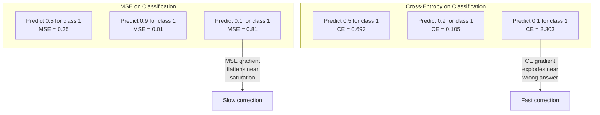
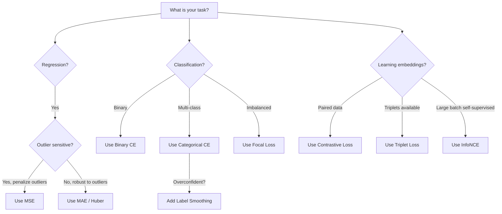

# Các hàm mất mát (Loss Functions)

> Mạng của bạn đưa ra dự đoán. Sự thật cơ bản (ground truth) lại nói điều ngược lại. Nó sai đến mức nào? Con số đó chính là loss. Nếu chọn sai hàm mất mát, mô hình của bạn sẽ tối ưu hóa cho một mục tiêu hoàn toàn sai lệch.

**Type:** Build
**Languages:** Python
**Prerequisites:** Bài 03.04 (Các hàm kích hoạt - Activation Functions)
**Time:** ~75 phút

## Mục tiêu học tập

- Triển khai MSE, binary cross-entropy, categorical cross-entropy và contrastive loss (InfoNCE) từ đầu cùng với các gradient của chúng.
- Giải thích lý do tại sao MSE thất bại trong bài toán phân loại bằng cách chứng minh chế độ lỗi "dự đoán 0.5 cho mọi thứ".
- Áp dụng label smoothing cho cross-entropy và mô tả cách nó ngăn chặn các dự đoán quá tự tin (overconfident).
- Chọn đúng hàm mất mát cho các bài toán hồi quy, phân loại nhị phân, phân loại đa lớp và học nhúng (embedding learning).

## Vấn đề

Một mô hình giảm thiểu MSE trên bài toán phân loại sẽ dự đoán một cách tự tin là 0.5 cho mọi đầu vào. Nó đang giảm thiểu loss, nhưng nó cũng hoàn toàn vô dụng.

Hàm mất mát là thứ duy nhất mà mô hình của bạn thực sự tối ưu hóa. Không phải độ chính xác (accuracy). Không phải F1 score. Không phải bất kỳ chỉ số nào bạn báo cáo cho quản lý. Bộ tối ưu hóa (optimizer) lấy gradient của hàm mất mát và điều chỉnh các trọng số để làm cho con số đó nhỏ hơn. Nếu hàm mất mát không nắm bắt được điều bạn quan tâm, mô hình sẽ tìm cách rẻ nhất về mặt toán học để thỏa mãn nó, và cách đó hầu như không bao giờ là điều bạn muốn.

Dưới đây là một ví dụ cụ thể. Bạn có một bài toán phân loại nhị phân. Hai lớp, tỷ lệ 50/50. Bạn sử dụng MSE làm hàm mất mát. Mô hình dự đoán 0.5 cho mọi đầu vào. MSE trung bình là 0.25, đây là mức tối thiểu có thể đạt được mà không cần thực sự học bất cứ điều gì. Mô hình không có khả năng phân biệt nhưng về mặt kỹ thuật đã giảm thiểu hàm mất mát của bạn. Hãy chuyển sang cross-entropy, mô hình tương tự sẽ bị buộc phải đẩy các dự đoán về phía 0 hoặc 1, bởi vì -log(0.5) = 0.693 là một mức loss tồi tệ, trong khi -log(0.99) = 0.01 sẽ thưởng cho các dự đoán đúng và tự tin. Việc lựa chọn hàm mất mát chính là sự khác biệt giữa một mô hình biết học và một mô hình chỉ biết "lách" chỉ số.

Tệ hơn nữa, trong học tự giám sát (self-supervised learning), bạn thậm chí không có nhãn. Contrastive loss xác định hoàn toàn tín hiệu học tập: cái gì được coi là giống nhau, cái gì được coi là khác nhau và mô hình nên đẩy chúng ra xa nhau như thế nào. Nếu làm sai contrastive loss, các embedding của bạn sẽ sụp đổ về một điểm duy nhất -- mọi đầu vào đều ánh xạ tới cùng một vector. Về mặt kỹ thuật là zero loss, nhưng hoàn toàn vô giá trị.

## Khái niệm

### Mean Squared Error (MSE)

Mặc định cho bài toán hồi quy. Tính bình phương sai số giữa dự đoán và mục tiêu, lấy trung bình trên tất cả các mẫu.

```
MSE = (1/n) * sum((y_pred - y_true)^2)
```

Tại sao việc bình phương lại quan trọng: nó phạt các sai số lớn theo hàm bậc hai. Một sai số bằng 2 sẽ tốn kém gấp 4 lần sai số bằng 1. Một sai số bằng 10 sẽ tốn kém gấp 100 lần. Điều này làm cho MSE nhạy cảm với các giá trị ngoại lai (outliers) -- một dự đoán sai lệch lớn duy nhất sẽ chi phối toàn bộ hàm mất mát.

Ví dụ thực tế: nếu mô hình của bạn dự đoán giá nhà và sai lệch $10,000 on most houses but off by $200,000 trên một căn biệt thự, MSE sẽ cố gắng sửa chữa căn biệt thự đó một cách quyết liệt, có khả năng làm giảm hiệu suất trên 99 căn nhà còn lại.

Gradient của MSE đối với một dự đoán là:

```
dMSE/dy_pred = (2/n) * (y_pred - y_true)
```

Tuyến tính theo sai số. Sai số càng lớn thì gradient càng lớn. Đây là một tính năng cho hồi quy (sai số lớn cần điều chỉnh lớn) và là một lỗi cho phân loại (bạn muốn phạt các câu trả lời sai một cách tự tin theo hàm mũ, chứ không phải tuyến tính).

### Cross-Entropy Loss

Hàm mất mát cho phân loại. Bắt nguồn từ lý thuyết thông tin -- nó đo lường sự phân kỳ giữa phân phối xác suất dự đoán và phân phối thực tế.

**Binary Cross-Entropy (BCE):**

```
BCE = -(y * log(p) + (1 - y) * log(1 - p))
```

Trong đó y là nhãn thực (0 hoặc 1) và p là xác suất dự đoán.

Tại sao -log(p) hoạt động: khi nhãn thực là 1 và bạn dự đoán p = 0.99, loss là -log(0.99) = 0.01. Khi bạn dự đoán p = 0.01, loss là -log(0.01) = 4.6. Sự khác biệt gấp 460 lần đó chính là lý do tại sao cross-entropy hiệu quả. Nó trừng phạt tàn nhẫn các dự đoán sai một cách tự tin trong khi hầu như không phạt các dự đoán đúng và tự tin.

Gradient cũng cho thấy điều tương tự:

```
dBCE/dp = -(y/p) + (1-y)/(1-p)
```

Khi y = 1 và p gần bằng 0, gradient là -1/p, tiến tới âm vô cùng. Mô hình nhận được tín hiệu khổng lồ để sửa lỗi. Khi p gần bằng 1, gradient rất nhỏ. Đã đúng rồi, không cần sửa gì cả.

**Categorical Cross-Entropy:**

Dành cho phân loại đa lớp với các mục tiêu được mã hóa one-hot.

```
CCE = -sum(y_i * log(p_i))
```

Chỉ lớp đúng mới đóng góp vào loss (vì tất cả các y_i khác đều bằng 0). Nếu có 10 lớp và lớp đúng nhận xác suất 0.1 (đoán ngẫu nhiên), loss là -log(0.1) = 2.3. Nếu lớp đúng nhận xác suất 0.9, loss là -log(0.9) = 0.105. Mô hình học cách tập trung khối lượng xác suất vào câu trả lời đúng.

### Tại sao MSE thất bại trong phân loại



Gradient của MSE bị phẳng khi các dự đoán gần 0 hoặc 1 (do bão hòa sigmoid). Gradient của cross-entropy bù đắp cho điều này -- hàm -log triệt tiêu các vùng phẳng của sigmoid, tạo ra gradient mạnh mẽ chính xác ở nơi cần thiết nhất.

### Label Smoothing

Các nhãn one-hot tiêu chuẩn nói rằng "đây là 100% lớp 3 và 0% mọi thứ khác". Đó là một khẳng định mạnh mẽ. Label smoothing làm mềm nó:

```
smooth_label = (1 - alpha) * one_hot + alpha / num_classes
```

Với alpha = 0.1 và 10 lớp: thay vì [0, 0, 1, 0, ...], mục tiêu trở thành [0.01, 0.01, 0.91, 0.01, ...]. Mô hình nhắm tới 0.91 thay vì 1.0.

Tại sao cách này hiệu quả: một mô hình cố gắng xuất ra chính xác 1.0 thông qua softmax cần đẩy các logit tới vô cùng. Điều này gây ra sự tự tin thái quá, làm tổn hại đến khả năng tổng quát hóa và làm cho mô hình trở nên mong manh trước sự thay đổi phân phối. Label smoothing giới hạn mục tiêu ở mức 0.9 (với alpha=0.1), giữ cho các logit nằm trong phạm vi hợp lý. GPT và hầu hết các mô hình hiện đại đều sử dụng label smoothing hoặc các kỹ thuật tương đương.

### Contrastive Loss

Không nhãn. Không lớp. Chỉ có các cặp đầu vào và câu hỏi: chúng giống nhau hay khác nhau?

**Contrastive loss kiểu SimCLR (NT-Xent / InfoNCE):**

Lấy một hình ảnh. Tạo hai góc nhìn tăng cường (augmented views) của nó (cắt, xoay, thay đổi màu sắc). Đây là "cặp dương" (positive pair) -- chúng nên có các embedding tương tự nhau. Mọi hình ảnh khác trong batch tạo thành "cặp âm" (negative pair) -- chúng nên có các embedding khác nhau.

```
L = -log(exp(sim(z_i, z_j) / tau) / sum(exp(sim(z_i, z_k) / tau)))
```

Trong đó sim() là độ tương đồng cosine, z_i và z_j là cặp dương, tổng được tính trên tất cả các cặp âm, và tau (nhiệt độ) kiểm soát độ sắc nét của phân phối. Nhiệt độ thấp hơn = các cặp âm khó hơn = sự phân tách quyết liệt hơn.

Ví dụ thực tế: batch size 256 nghĩa là có 255 cặp âm cho mỗi cặp dương. Nhiệt độ tau = 0.07 (mặc định của SimCLR). Loss trông giống như một softmax trên các độ tương đồng -- nó muốn độ tương đồng của cặp dương là cao nhất trong số tất cả 256 tùy chọn.

**Triplet Loss:**

Lấy ba đầu vào: anchor, positive (cùng lớp), negative (khác lớp).

```
L = max(0, d(anchor, positive) - d(anchor, negative) + margin)
```

Biên độ (thường là 0.2-1.0) thực thi một khoảng cách tối thiểu giữa các khoảng cách dương và âm. Nếu cặp âm đã đủ xa, loss sẽ bằng 0 -- không có gradient, không có cập nhật. Điều này làm cho việc huấn luyện hiệu quả nhưng đòi hỏi phải khai thác triplet cẩn thận (chọn các cặp âm khó nằm gần anchor).

### Focal Loss

Dành cho các tập dữ liệu mất cân bằng. Cross-entropy tiêu chuẩn đối xử bình đẳng với tất cả các ví dụ được phân loại đúng. Focal loss giảm trọng số của các ví dụ dễ:

```
FL = -alpha * (1 - p_t)^gamma * log(p_t)
```

Trong đó p_t là xác suất dự đoán của lớp đúng và gamma kiểm soát độ tập trung. Với gamma = 0, đây là cross-entropy tiêu chuẩn. Với gamma = 2 (mặc định):

- Ví dụ dễ (p_t = 0.9): trọng số = (0.1)^2 = 0.01. Thực tế bị bỏ qua.
- Ví dụ khó (p_t = 0.1): trọng số = (0.9)^2 = 0.81. Tín hiệu gradient đầy đủ.

Focal loss được giới thiệu bởi Lin và cộng sự cho bài toán phát hiện đối tượng, nơi 99% các vùng ứng viên là nền (các ví dụ âm dễ). Nếu không có focal loss, mô hình sẽ bị nhấn chìm trong các ví dụ nền dễ và không bao giờ học được cách phát hiện đối tượng. Với nó, mô hình tập trung năng lực vào các trường hợp khó, mơ hồ mới là điều quan trọng.

### Cây quyết định hàm mất mát



### Cảnh quan hàm mất mát (Loss Landscape)

```mermaid
graph LR
    subgraph "Loss Surface Shape"
        MSE_S["MSE<br/>Smooth parabola<br/>Single minimum<br/>Easy to optimize"]
        CE_S["Cross-Entropy<br/>Steep near wrong answers<br/>Flat near correct answers<br/>Strong gradients where needed"]
        CL_S["Contrastive<br/>Many local minima<br/>Depends on batch composition<br/>Temperature controls sharpness"]
    end
    MSE_S -->|"Best for"| Reg2["Regression"]
    CE_S -->|"Best for"| Cls2["Classification"]
    CL_S -->|"Best for"| Emb2["Representation learning"]
```



```figure
cross-entropy-loss
```

## Xây dựng

### Bước 1: MSE và Gradient của nó

```python
def mse(predictions, targets):
    n = len(predictions)
    total = 0.0
    for p, t in zip(predictions, targets):
        total += (p - t) ** 2
    return total / n

def mse_gradient(predictions, targets):
    n = len(predictions)
    grads = []
    for p, t in zip(predictions, targets):
        grads.append(2.0 * (p - t) / n)
    return grads
```

### Bước 2: Binary Cross-Entropy

Vấn đề log(0) là có thật. Nếu mô hình dự đoán chính xác 0 cho một ví dụ dương, log(0) = âm vô cùng. Việc cắt (clipping) sẽ ngăn chặn điều này.

```python
import math

def binary_cross_entropy(predictions, targets, eps=1e-15):
    n = len(predictions)
    total = 0.0
    for p, t in zip(predictions, targets):
        p_clipped = max(eps, min(1 - eps, p))
        total += -(t * math.log(p_clipped) + (1 - t) * math.log(1 - p_clipped))
    return total / n

def bce_gradient(predictions, targets, eps=1e-15):
    grads = []
    for p, t in zip(predictions, targets):
        p_clipped = max(eps, min(1 - eps, p))
        grads.append(-(t / p_clipped) + (1 - t) / (1 - p_clipped))
    return grads
```

### Bước 3: Categorical Cross-Entropy với Softmax

Softmax chuyển đổi các logit thô thành xác suất. Sau đó, chúng ta tính cross-entropy so với các mục tiêu one-hot.

```python
def softmax(logits):
    max_val = max(logits)
    exps = [math.exp(x - max_val) for x in logits]
    total = sum(exps)
    return [e / total for e in exps]

def categorical_cross_entropy(logits, target_index, eps=1e-15):
    probs = softmax(logits)
    p = max(eps, probs[target_index])
    return -math.log(p)

def cce_gradient(logits, target_index):
    probs = softmax(logits)
    grads = list(probs)
    grads[target_index] -= 1.0
    return grads
```

Gradient của softmax + cross-entropy đơn giản hóa một cách tuyệt vời: nó chỉ là (xác suất dự đoán - 1) cho lớp đúng, và (xác suất dự đoán) cho tất cả các lớp khác. Sự đơn giản hóa thanh lịch này không phải là ngẫu nhiên -- đó là lý do tại sao softmax và cross-entropy luôn đi cùng nhau.

### Bước 4: Label Smoothing

```python
def label_smoothed_cce(logits, target_index, num_classes, alpha=0.1, eps=1e-15):
    probs = softmax(logits)
    loss = 0.0
    for i in range(num_classes):
        if i == target_index:
            smooth_target = 1.0 - alpha + alpha / num_classes
        else:
            smooth_target = alpha / num_classes
        p = max(eps, probs[i])
        loss += -smooth_target * math.log(p)
    return loss
```

### Bước 5: Contrastive Loss (InfoNCE đơn giản hóa)

```python
def cosine_similarity(a, b):
    dot = sum(x * y for x, y in zip(a, b))
    norm_a = math.sqrt(sum(x * x for x in a))
    norm_b = math.sqrt(sum(x * x for x in b))
    if norm_a < 1e-10 or norm_b < 1e-10:
        return 0.0
    return dot / (norm_a * norm_b)

def contrastive_loss(anchor, positive, negatives, temperature=0.07):
    sim_pos = cosine_similarity(anchor, positive) / temperature
    sim_negs = [cosine_similarity(anchor, neg) / temperature for neg in negatives]

    max_sim = max(sim_pos, max(sim_negs)) if sim_negs else sim_pos
    exp_pos = math.exp(sim_pos - max_sim)
    exp_negs = [math.exp(s - max_sim) for s in sim_negs]
    total_exp = exp_pos + sum(exp_negs)

    return -math.log(max(1e-15, exp_pos / total_exp))
```

### Bước 6: So sánh MSE và Cross-Entropy trên phân loại

Huấn luyện cùng một mạng từ bài 04 (tập dữ liệu hình tròn) với cả hai hàm mất mát. Quan sát cross-entropy hội tụ nhanh hơn.

```python
import random

def sigmoid(x):
    x = max(-500, min(500, x))
    return 1.0 / (1.0 + math.exp(-x))

def make_circle_data(n=200, seed=42):
    random.seed(seed)
    data = []
    for _ in range(n):
        x = random.uniform(-2, 2)
        y = random.uniform(-2, 2)
        label = 1.0 if x * x + y * y < 1.5 else 0.0
        data.append(([x, y], label))
    return data


class LossComparisonNetwork:
    def __init__(self, loss_type="bce", hidden_size=8, lr=0.1):
        random.seed(0)
        self.loss_type = loss_type
        self.lr = lr
        self.hidden_size = hidden_size

        self.w1 = [[random.gauss(0, 0.5) for _ in range(2)] for _ in range(hidden_size)]
        self.b1 = [0.0] * hidden_size
        self.w2 = [random.gauss(0, 0.5) for _ in range(hidden_size)]
        self.b2 = 0.0

    def forward(self, x):
        self.x = x
        self.z1 = []
        self.h = []
        for i in range(self.hidden_size):
            z = self.w1[i][0] * x[0] + self.w1[i][1] * x[1] + self.b1[i]
            self.z1.append(z)
            self.h.append(max(0.0, z))

        self.z2 = sum(self.w2[i] * self.h[i] for i in range(self.hidden_size)) + self.b2
        self.out = sigmoid(self.z2)
        return self.out

    def backward(self, target):
        if self.loss_type == "mse":
            d_loss = 2.0 * (self.out - target)
        else:
            eps = 1e-15
            p = max(eps, min(1 - eps, self.out))
            d_loss = -(target / p) + (1 - target) / (1 - p)

        d_sigmoid = self.out * (1 - self.out)
        d_out = d_loss * d_sigmoid

        for i in range(self.hidden_size):
            d_relu = 1.0 if self.z1[i] > 0 else 0.0
            d_h = d_out * self.w2[i] * d_relu
            self.w2[i] -= self.lr * d_out * self.h[i]
            for j in range(2):
                self.w1[i][j] -= self.lr * d_h * self.x[j]
            self.b1[i] -= self.lr * d_h
        self.b2 -= self.lr * d_out

    def compute_loss(self, pred, target):
        if self.loss_type == "mse":
            return (pred - target) ** 2
        else:
            eps = 1e-15
            p = max(eps, min(1 - eps, pred))
            return -(target * math.log(p) + (1 - target) * math.log(1 - p))

    def train(self, data, epochs=200):
        losses = []
        for epoch in range(epochs):
            total_loss = 0.0
            correct = 0
            for x, y in data:
                pred = self.forward(x)
                self.backward(y)
                total_loss += self.compute_loss(pred, y)
                if (pred >= 0.5) == (y >= 0.5):
                    correct += 1
            avg_loss = total_loss / len(data)
            accuracy = correct / len(data) * 100
            losses.append((avg_loss, accuracy))
            if epoch % 50 == 0 or epoch == epochs - 1:
                print(f"    Epoch {epoch:3d}: loss={avg_loss:.4f}, accuracy={accuracy:.1f}%")
        return losses
```

## Sử dụng

PyTorch cung cấp tất cả các hàm mất mát tiêu chuẩn với độ ổn định số học được tích hợp sẵn:

```python
import torch
import torch.nn as nn
import torch.nn.functional as F

predictions = torch.tensor([0.9, 0.1, 0.7], requires_grad=True)
targets = torch.tensor([1.0, 0.0, 1.0])

mse_loss = F.mse_loss(predictions, targets)
bce_loss = F.binary_cross_entropy(predictions, targets)

logits = torch.randn(4, 10)
labels = torch.tensor([3, 7, 1, 9])
ce_loss = F.cross_entropy(logits, labels)
ce_smooth = F.cross_entropy(logits, labels, label_smoothing=0.1)
```

Hãy sử dụng `F.cross_entropy` (không phải `F.nll_loss` cộng với softmax thủ công). Nó kết hợp log-softmax và negative log-likelihood trong một thao tác ổn định về mặt số học. Việc áp dụng softmax riêng biệt rồi lấy log sẽ kém ổn định hơn -- bạn sẽ mất độ chính xác khi trừ các số mũ lớn.

Đối với học tương phản (contrastive learning), hầu hết các nhóm sử dụng các triển khai tùy chỉnh hoặc các thư viện như `lightly` hoặc `pytorch-metric-learning`. Vòng lặp cốt lõi luôn giống nhau: tính toán độ tương đồng theo cặp, tạo softmax trên các cặp dương và âm, lan truyền ngược (backpropagate).

## Triển khai

Bài học này tạo ra:
- `outputs/prompt-loss-function-selector.md` -- một prompt có thể tái sử dụng để chọn hàm mất mát phù hợp
- `outputs/prompt-loss-debugger.md` -- một prompt chẩn đoán khi đường cong loss của bạn trông có vẻ sai

## Bài tập

1. Triển khai Huber loss (smooth L1 loss), là MSE cho các sai số nhỏ và MAE cho các sai số lớn. Huấn luyện một mạng hồi quy dự đoán y = sin(x) với MSE so với Huber khi 5% mục tiêu huấn luyện bị thêm nhiễu ngẫu nhiên (outliers). So sánh sai số kiểm tra cuối cùng.

2. Thêm focal loss vào vòng lặp huấn luyện phân loại nhị phân. Tạo một tập dữ liệu mất cân bằng (90% lớp 0, 10% lớp 1). So sánh BCE tiêu chuẩn với focal loss (gamma=2) về khả năng recall của lớp thiểu số sau 200 epoch.

3. Triển khai triplet loss với khai thác cặp âm bán khó (semi-hard negative mining). Tạo dữ liệu embedding 2D cho 5 lớp. Với mỗi anchor, hãy tìm cặp âm khó nhất mà vẫn xa hơn cặp dương (semi-hard). So sánh sự hội tụ với việc chọn triplet ngẫu nhiên.

4. Chạy so sánh MSE và cross-entropy nhưng theo dõi độ lớn gradient tại mỗi lớp trong quá trình huấn luyện. Vẽ biểu đồ chuẩn gradient trung bình mỗi epoch. Xác minh rằng cross-entropy tạo ra gradient lớn hơn trong các epoch đầu khi mô hình còn mơ hồ nhất.

5. Triển khai KL divergence loss và xác minh rằng việc giảm thiểu KL(thực || dự đoán) cho cùng gradient như cross-entropy khi phân phối thực là one-hot. Sau đó thử với các mục tiêu mềm (như knowledge distillation) nơi phân phối "thực" đến từ đầu ra softmax của một mô hình giáo viên.

## Thuật ngữ chính

| Thuật ngữ | Cách gọi thông thường | Ý nghĩa thực tế |
|------|----------------|----------------------|
| Loss function | "Mô hình sai đến mức nào" | Một hàm khả vi ánh xạ dự đoán và mục tiêu thành một vô hướng mà bộ tối ưu hóa sẽ giảm thiểu |
| MSE | "Sai số bình phương trung bình" | Trung bình của bình phương sai số giữa dự đoán và mục tiêu; phạt các sai số lớn theo hàm bậc hai |
| Cross-entropy | "Hàm mất mát phân loại" | Đo lường sự phân kỳ giữa phân phối xác suất dự đoán và phân phối thực tế bằng -log(p) |
| Binary cross-entropy | "BCE" | Cross-entropy cho hai lớp: -(y*log(p) + (1-y)*log(1-p)) |
| Label smoothing | "Làm mềm mục tiêu" | Thay thế các mục tiêu 0/1 cứng nhắc bằng các giá trị mềm (ví dụ: 0.1/0.9) để ngăn chặn sự tự tin thái quá và cải thiện khả năng tổng quát hóa |
| Contrastive loss | "Kéo lại gần, đẩy ra xa" | Một hàm mất mát học các biểu diễn bằng cách làm cho các cặp tương tự gần nhau và các cặp không tương tự xa nhau trong không gian embedding |
| InfoNCE | "Loss của CLIP/SimCLR" | Cross-entropy chuẩn hóa theo nhiệt độ trên các điểm số tương đồng; coi học tương phản là bài toán phân loại |
| Focal loss | "Giải pháp cho dữ liệu mất cân bằng" | Cross-entropy được trọng số bởi (1-p_t)^gamma để giảm trọng số các ví dụ dễ và tập trung vào các ví dụ khó |
| Triplet loss | "Anchor-positive-negative" | Đẩy anchor lại gần positive hơn negative ít nhất một biên độ trong không gian embedding |
| Temperature | "Núm xoay độ sắc nét" | Một số vô hướng chia cho các logit/độ tương đồng để kiểm soát độ nhọn của phân phối kết quả; thấp hơn = sắc nét hơn |

## Đọc thêm

- Lin và cộng sự, "Focal Loss for Dense Object Detection" (2017) -- giới thiệu focal loss để xử lý mất cân bằng lớp cực đoan trong phát hiện đối tượng (RetinaNet)
- Chen và cộng sự, "A Simple Framework for Contrastive Learning of Visual Representations" (SimCLR, 2020) -- xác định quy trình học tương phản hiện đại với NT-Xent loss
- Szegedy và cộng sự, "Rethinking the Inception Architecture" (2016) -- giới thiệu label smoothing như một kỹ thuật chính quy hóa, hiện là tiêu chuẩn trong hầu hết các mô hình lớn
- Hinton và cộng sự, "Distilling the Knowledge in a Neural Network" (2015) -- chưng cất tri thức (knowledge distillation) sử dụng các mục tiêu mềm và KL divergence, nền tảng cho việc nén mô hình