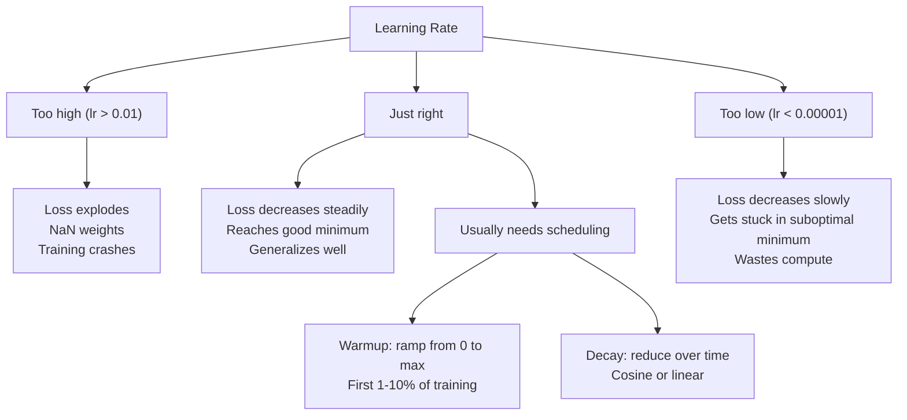
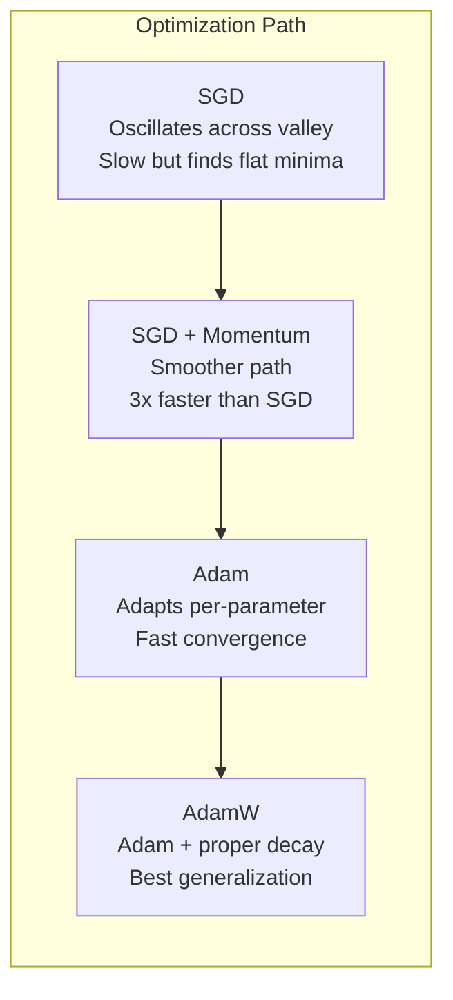
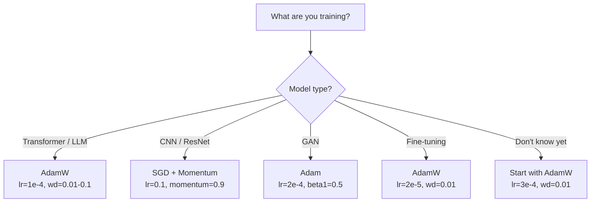

# Các bộ tối ưu hóa (Optimizers)

> Gradient descent cho bạn biết hướng cần di chuyển, nhưng không nói gì về khoảng cách hay tốc độ. SGD giống như một chiếc la bàn, còn Adam giống như GPS có kèm dữ liệu giao thông.

**Type:** Build
**Languages:** Python
**Prerequisites:** Bài 03.05 (Các hàm mất mát - Loss Functions)
**Time:** ~75 phút

## Mục tiêu học tập

- Triển khai các bộ tối ưu hóa SGD, SGD với momentum, Adam và AdamW từ đầu bằng Python.
- Giải thích cách hiệu chỉnh độ chệch (bias correction) của Adam bù đắp cho các ước tính moment được khởi tạo bằng 0 trong những bước huấn luyện đầu tiên.
- Chứng minh tại sao AdamW tạo ra khả năng tổng quát hóa tốt hơn Adam khi sử dụng L2 regularization trên cùng một tác vụ.
- Lựa chọn bộ tối ưu hóa và các siêu tham số mặc định phù hợp cho Transformer, CNN, GAN và quá trình fine-tuning.

## Vấn đề

Bạn đã tính toán xong các gradient. Bạn biết rằng trọng số #4,721 cần giảm 0.003 để giảm hàm mất mát. Nhưng 0.003 theo đơn vị nào? Được điều chỉnh bởi cái gì? Và liệu bạn có nên di chuyển cùng một khoảng cách ở bước thứ 1 như ở bước thứ 1,000 không?

Vanilla gradient descent áp dụng cùng một learning rate cho mọi tham số ở mọi bước: w = w - lr * gradient. Điều này tạo ra ba vấn đề khiến việc huấn luyện mạng thần kinh trở nên khó khăn trong thực tế.

Thứ nhất, sự dao động (oscillation). Bề mặt hàm mất mát hiếm khi có hình dạng như một cái bát trơn tru. Nó giống một thung lũng dài và hẹp hơn. Gradient chỉ hướng ngang qua thung lũng (hướng dốc nhất), chứ không phải dọc theo nó (hướng thoải). Gradient descent nảy qua nảy lại trên chiều hẹp trong khi chỉ tiến triển rất ít theo chiều hữu ích. Bạn đã từng thấy điều này: loss giảm nhanh rồi đi ngang, không phải vì mô hình đã hội tụ mà vì nó đang dao động.

Thứ hai, một learning rate cho tất cả tham số là sai lầm. Một số trọng số cần cập nhật lớn (chúng đang ở giai đoạn đầu, underfitting). Những trọng số khác cần cập nhật nhỏ (chúng đã gần giá trị tối ưu). Một learning rate phù hợp cho cái trước sẽ phá hủy cái sau, và ngược lại.

Thứ ba, các điểm yên ngựa (saddle points). Trong không gian nhiều chiều, bề mặt hàm mất mát có những vùng phẳng rộng lớn nơi gradient gần bằng 0. Vanilla SGD bò qua những vùng này với tốc độ của gradient, vốn gần như bằng 0. Mô hình trông như bị kẹt. Thực tế nó không kẹt — nó đang ở một vùng phẳng với hướng xuống dốc hữu ích ở phía bên kia. Nhưng SGD không có cơ chế để vượt qua.

Adam giải quyết cả ba vấn đề trên. Nó duy trì hai giá trị trung bình trượt cho mỗi tham số — trung bình gradient (momentum, xử lý dao động) và trung bình bình phương gradient (tốc độ thích nghi, xử lý các thang đo khác nhau). Kết hợp với hiệu chỉnh độ chệch cho vài bước đầu tiên, nó cung cấp cho bạn một bộ tối ưu hóa duy nhất hoạt động hiệu quả trên 80% các bài toán với các siêu tham số mặc định. Bài học này sẽ xây dựng nó từ đầu để bạn hiểu chính xác khi nào và tại sao nó thất bại trên 20% còn lại.

## Khái niệm

### Stochastic Gradient Descent (SGD)

Bộ tối ưu hóa đơn giản nhất. Tính gradient trên một mini-batch và bước theo hướng ngược lại.

```
w = w - lr * gradient
```

"Stochastic" (ngẫu nhiên) có nghĩa là bạn sử dụng một tập con ngẫu nhiên (mini-batch) của dữ liệu để ước tính gradient, thay vì toàn bộ tập dữ liệu. Độ nhiễu này thực sự hữu ích — nó giúp thoát khỏi các điểm cực tiểu địa phương (local minima) sắc nhọn. Nhưng độ nhiễu cũng gây ra sự dao động.

Learning rate là núm điều chỉnh duy nhất. Quá cao: loss phân kỳ. Quá thấp: huấn luyện mất quá nhiều thời gian. Giá trị tối ưu phụ thuộc vào kiến trúc, dữ liệu, kích thước batch và giai đoạn huấn luyện hiện tại. Đối với vanilla SGD trên các mạng hiện đại, các giá trị điển hình nằm trong khoảng từ 0.01 đến 0.1. Nhưng ngay cả trong một lần huấn luyện, learning rate lý tưởng cũng thay đổi.

### Momentum

Phép ẩn dụ về quả bóng lăn xuống dốc đã quá quen thuộc nhưng rất chính xác. Thay vì chỉ bước theo gradient, bạn duy trì một vận tốc tích lũy các gradient trước đó.

```
m_t = beta * m_{t-1} + gradient
w = w - lr * m_t
```

Beta (thường là 0.9) kiểm soát lượng lịch sử cần giữ lại. Với beta = 0.9, momentum xấp xỉ trung bình của 10 gradient gần nhất (1 / (1 - 0.9) = 10).

Tại sao điều này khắc phục được dao động: các gradient chỉ cùng một hướng sẽ tích lũy. Các gradient đổi hướng sẽ triệt tiêu lẫn nhau. Trong thung lũng hẹp đó, thành phần "ngang" đổi dấu mỗi bước và bị giảm chấn. Thành phần "dọc" giữ nguyên và được khuếch đại. Kết quả là sự tăng tốc mượt mà theo hướng hữu ích.

Số liệu thực tế: SGD đơn thuần trên một bề mặt hàm mất mát xấu có thể mất 10,000 bước. SGD với momentum (beta=0.9) thường mất 3,000-5,000 bước cho cùng một bài toán. Sự tăng tốc này không hề nhỏ.

### RMSProp

Phương pháp learning rate thích nghi theo từng tham số đầu tiên thực sự hiệu quả. Được Hinton đề xuất trong một bài giảng trên Coursera (chưa bao giờ được công bố chính thức).

```
s_t = beta * s_{t-1} + (1 - beta) * gradient^2
w = w - lr * gradient / (sqrt(s_t) + epsilon)
```

s_t theo dõi trung bình trượt của bình phương gradient. Các tham số có gradient lớn liên tục sẽ bị chia cho một số lớn (learning rate hiệu dụng nhỏ hơn). Các tham số có gradient nhỏ sẽ bị chia cho một số nhỏ (learning rate hiệu dụng lớn hơn).

Điều này giải quyết vấn đề "một learning rate cho tất cả tham số". Một trọng số đã nhận các cập nhật lớn có lẽ đã gần mục tiêu — hãy làm chậm nó lại. Một trọng số nhận các cập nhật nhỏ có thể chưa được huấn luyện đủ — hãy tăng tốc nó lên.

Epsilon (thường là 1e-8) ngăn chặn việc chia cho 0 khi một tham số chưa được cập nhật.

### Adam: Momentum + RMSProp

Adam kết hợp cả hai ý tưởng. Nó duy trì hai trung bình trượt hàm mũ cho mỗi tham số:

```
m_t = beta1 * m_{t-1} + (1 - beta1) * gradient        (first moment: mean)
v_t = beta2 * v_{t-1} + (1 - beta2) * gradient^2       (second moment: variance)
```

**Hiệu chỉnh độ chệch (Bias correction)** là chi tiết quan trọng mà hầu hết các giải thích đều bỏ qua. Ở bước 1, m_1 = (1 - beta1) * gradient. Với beta1 = 0.9, giá trị đó là 0.1 * gradient — nhỏ hơn 10 lần so với thực tế. Trung bình trượt chưa kịp "làm nóng". Hiệu chỉnh độ chệch sẽ bù đắp:

```
m_hat = m_t / (1 - beta1^t)
v_hat = v_t / (1 - beta2^t)
```

Ở bước 1 với beta1 = 0.9: m_hat = m_1 / (1 - 0.9) = m_1 / 0.1 = gradient thực tế. Ở bước 100: (1 - 0.9^100) xấp xỉ 1.0, vì vậy hiệu chỉnh sẽ biến mất. Hiệu chỉnh độ chệch quan trọng trong khoảng ~10 bước đầu tiên và không còn ý nghĩa sau ~50 bước.

Cập nhật:

```
w = w - lr * m_hat / (sqrt(v_hat) + epsilon)
```

Các giá trị mặc định của Adam: lr = 0.001, beta1 = 0.9, beta2 = 0.999, epsilon = 1e-8. Các giá trị mặc định này hoạt động tốt cho 80% các bài toán. Khi chúng không hiệu quả, hãy thay đổi lr trước. Sau đó đến beta2. Hầu như không bao giờ thay đổi beta1 hoặc epsilon.

### AdamW: Weight Decay đúng cách

L2 regularization thêm lambda * w^2 vào hàm mất mát. Trong vanilla SGD, điều này tương đương với weight decay (trừ lambda * w khỏi trọng số ở mỗi bước). Trong Adam, sự tương đương này bị phá vỡ.

Góc nhìn của Loshchilov & Hutter: khi bạn thêm L2 vào hàm mất mát và sau đó Adam xử lý gradient, learning rate thích nghi cũng làm thay đổi số hạng regularization. Các tham số có phương sai gradient lớn sẽ nhận được ít regularization hơn. Các tham số có phương sai nhỏ sẽ nhận được nhiều hơn. Đây không phải là điều bạn muốn — bạn muốn regularization đồng nhất bất kể thống kê gradient.

AdamW khắc phục điều này bằng cách áp dụng weight decay trực tiếp vào các trọng số, sau bước cập nhật của Adam:

```
w = w - lr * m_hat / (sqrt(v_hat) + epsilon) - lr * lambda * w
```

Số hạng weight decay (lr * lambda * w) không bị thay đổi bởi hệ số thích nghi của Adam. Mỗi tham số nhận được sự co lại tỷ lệ thuận như nhau.

Điều này có vẻ là một chi tiết nhỏ. Nhưng không phải vậy. AdamW hội tụ đến các nghiệm tốt hơn Adam + L2 regularization trên hầu hết mọi tác vụ. Đây là bộ tối ưu hóa mặc định trong PyTorch để huấn luyện Transformer, mô hình khuếch tán (diffusion models) và hầu hết các kiến trúc hiện đại. BERT, GPT, LLaMA, Stable Diffusion — tất cả đều được huấn luyện với AdamW.

### Learning Rate: Siêu tham số quan trọng nhất



Nếu bạn chỉ có thể tinh chỉnh một siêu tham số, hãy chọn learning rate. Thay đổi learning rate 10 lần quan trọng hơn bất kỳ quyết định kiến trúc nào bạn sẽ thực hiện. Các giá trị mặc định phổ biến:

- SGD: lr = 0.01 đến 0.1
- Adam/AdamW: lr = 1e-4 đến 3e-4
- Fine-tuning các mô hình đã huấn luyện trước: lr = 1e-5 đến 5e-5
- Learning rate warmup: tăng tuyến tính trong 1-10% số bước đầu tiên

### So sánh các bộ tối ưu hóa



### Khi nào mỗi bộ tối ưu hóa giành chiến thắng



```figure
optimizer-trajectory
```

## Xây dựng (Build It)

### Bước 1: Vanilla SGD

```python
class SGD:
    def __init__(self, lr=0.01):
        self.lr = lr

    def step(self, params, grads):
        for i in range(len(params)):
            params[i] -= self.lr * grads[i]
```

### Bước 2: SGD với Momentum

```python
class SGDMomentum:
    def __init__(self, lr=0.01, beta=0.9):
        self.lr = lr
        self.beta = beta
        self.velocities = None

    def step(self, params, grads):
        if self.velocities is None:
            self.velocities = [0.0] * len(params)
        for i in range(len(params)):
            self.velocities[i] = self.beta * self.velocities[i] + grads[i]
            params[i] -= self.lr * self.velocities[i]
```

### Bước 3: Adam

```python
import math

class Adam:
    def __init__(self, lr=0.001, beta1=0.9, beta2=0.999, epsilon=1e-8):
        self.lr = lr
        self.beta1 = beta1
        self.beta2 = beta2
        self.epsilon = epsilon
        self.m = None
        self.v = None
        self.t = 0

    def step(self, params, grads):
        if self.m is None:
            self.m = [0.0] * len(params)
            self.v = [0.0] * len(params)

        self.t += 1

        for i in range(len(params)):
            self.m[i] = self.beta1 * self.m[i] + (1 - self.beta1) * grads[i]
            self.v[i] = self.beta2 * self.v[i] + (1 - self.beta2) * grads[i] ** 2

            m_hat = self.m[i] / (1 - self.beta1 ** self.t)
            v_hat = self.v[i] / (1 - self.beta2 ** self.t)

            params[i] -= self.lr * m_hat / (math.sqrt(v_hat) + self.epsilon)
```

### Bước 4: AdamW

```python
class AdamW:
    def __init__(self, lr=0.001, beta1=0.9, beta2=0.999, epsilon=1e-8, weight_decay=0.01):
        self.lr = lr
        self.beta1 = beta1
        self.beta2 = beta2
        self.epsilon = epsilon
        self.weight_decay = weight_decay
        self.m = None
        self.v = None
        self.t = 0

    def step(self, params, grads):
        if self.m is None:
            self.m = [0.0] * len(params)
            self.v = [0.0] * len(params)

        self.t += 1

        for i in range(len(params)):
            self.m[i] = self.beta1 * self.m[i] + (1 - self.beta1) * grads[i]
            self.v[i] = self.beta2 * self.v[i] + (1 - self.beta2) * grads[i] ** 2

            m_hat = self.m[i] / (1 - self.beta1 ** self.t)
            v_hat = self.v[i] / (1 - self.beta2 ** self.t)

            params[i] -= self.lr * m_hat / (math.sqrt(v_hat) + self.epsilon)
            params[i] -= self.lr * self.weight_decay * params[i]
```

### Bước 5: So sánh huấn luyện

Huấn luyện cùng một mạng hai lớp trên tập dữ liệu hình tròn từ bài 05 với cả bốn bộ tối ưu hóa. So sánh sự hội tụ.

```python
import random

def sigmoid(x):
    x = max(-500, min(500, x))
    return 1.0 / (1.0 + math.exp(-x))

def make_circle_data(n=200, seed=42):
    random.seed(seed)
    data = []
    for _ in range(n):
        x = random.uniform(-2, 2)
        y = random.uniform(-2, 2)
        label = 1.0 if x * x + y * y < 1.5 else 0.0
        data.append(([x, y], label))
    return data


class OptimizerTestNetwork:
    def __init__(self, optimizer, hidden_size=8):
        random.seed(0)
        self.hidden_size = hidden_size
        self.optimizer = optimizer

        self.w1 = [[random.gauss(0, 0.5) for _ in range(2)] for _ in range(hidden_size)]
        self.b1 = [0.0] * hidden_size
        self.w2 = [random.gauss(0, 0.5) for _ in range(hidden_size)]
        self.b2 = 0.0

    def get_params(self):
        params = []
        for row in self.w1:
            params.extend(row)
        params.extend(self.b1)
        params.extend(self.w2)
        params.append(self.b2)
        return params

    def set_params(self, params):
        idx = 0
        for i in range(self.hidden_size):
            for j in range(2):
                self.w1[i][j] = params[idx]
                idx += 1
        for i in range(self.hidden_size):
            self.b1[i] = params[idx]
            idx += 1
        for i in range(self.hidden_size):
            self.w2[i] = params[idx]
            idx += 1
        self.b2 = params[idx]

    def forward(self, x):
        self.x = x
        self.z1 = []
        self.h = []
        for i in range(self.hidden_size):
            z = self.w1[i][0] * x[0] + self.w1[i][1] * x[1] + self.b1[i]
            self.z1.append(z)
            self.h.append(max(0.0, z))

        self.z2 = sum(self.w2[i] * self.h[i] for i in range(self.hidden_size)) + self.b2
        self.out = sigmoid(self.z2)
        return self.out

    def compute_grads(self, target):
        eps = 1e-15
        p = max(eps, min(1 - eps, self.out))
        d_loss = -(target / p) + (1 - target) / (1 - p)
        d_sigmoid = self.out * (1 - self.out)
        d_out = d_loss * d_sigmoid

        grads = [0.0] * (self.hidden_size * 2 + self.hidden_size + self.hidden_size + 1)
        idx = 0
        for i in range(self.hidden_size):
            d_relu = 1.0 if self.z1[i] > 0 else 0.0
            d_h = d_out * self.w2[i] * d_relu
            grads[idx] = d_h * self.x[0]
            grads[idx + 1] = d_h * self.x[1]
            idx += 2

        for i in range(self.hidden_size):
            d_relu = 1.0 if self.z1[i] > 0 else 0.0
            grads[idx] = d_out * self.w2[i] * d_relu
            idx += 1

        for i in range(self.hidden_size):
            grads[idx] = d_out * self.h[i]
            idx += 1

        grads[idx] = d_out
        return grads

    def train(self, data, epochs=300):
        losses = []
        for epoch in range(epochs):
            total_loss = 0.0
            correct = 0
            for x, y in data:
                pred = self.forward(x)
                grads = self.compute_grads(y)
                params = self.get_params()
                self.optimizer.step(params, grads)
                self.set_params(params)

                eps = 1e-15
                p = max(eps, min(1 - eps, pred))
                total_loss += -(y * math.log(p) + (1 - y) * math.log(1 - p))
                if (pred >= 0.5) == (y >= 0.5):
                    correct += 1
            avg_loss = total_loss / len(data)
            accuracy = correct / len(data) * 100
            losses.append((avg_loss, accuracy))
            if epoch % 75 == 0 or epoch == epochs - 1:
                print(f"    Epoch {epoch:3d}: loss={avg_loss:.4f}, accuracy={accuracy:.1f}%")
        return losses
```

## Sử dụng (Use It)

Các bộ tối ưu hóa trong PyTorch xử lý các nhóm tham số, gradient clipping và lập lịch learning rate:

```python
import torch
import torch.optim as optim

model = torch.nn.Sequential(
    torch.nn.Linear(784, 256),
    torch.nn.ReLU(),
    torch.nn.Linear(256, 10),
)

optimizer = optim.AdamW(model.parameters(), lr=3e-4, weight_decay=0.01)

scheduler = optim.lr_scheduler.CosineAnnealingLR(optimizer, T_max=100)

for epoch in range(100):
    optimizer.zero_grad()
    output = model(torch.randn(32, 784))
    loss = torch.nn.functional.cross_entropy(output, torch.randint(0, 10, (32,)))
    loss.backward()
    torch.nn.utils.clip_grad_norm_(model.parameters(), max_norm=1.0)
    optimizer.step()
    scheduler.step()
```

Quy trình luôn là: zero_grad, forward, loss, backward, (clip), step, (schedule). Hãy ghi nhớ thứ tự này. Làm sai (ví dụ: gọi scheduler.step() trước optimizer.step()) là nguồn gốc phổ biến của các lỗi tinh vi.

Đối với CNN, nhiều chuyên gia vẫn ưu tiên SGD + momentum (lr=0.1, momentum=0.9, weight_decay=1e-4) với lịch trình step hoặc cosine. SGD tìm thấy các điểm cực tiểu phẳng hơn, thường tổng quát hóa tốt hơn. Đối với Transformer và LLM, AdamW với warmup + cosine decay là mặc định phổ biến. Đừng chống lại sự đồng thuận này trừ khi bạn có lý do xác đáng.

## Triển khai (Ship It)

Bài học này tạo ra:
- `outputs/prompt-optimizer-selector.md` — một prompt quyết định để chọn bộ tối ưu hóa và learning rate phù hợp cho bất kỳ kiến trúc nào.

## Bài tập

1. Triển khai Nesterov momentum, nơi bạn tính gradient tại vị trí "nhìn trước" (w - lr * beta * v) thay vì vị trí hiện tại. So sánh sự hội tụ với momentum tiêu chuẩn trên tập dữ liệu hình tròn.

2. Triển khai lịch trình learning rate warmup: tăng tuyến tính từ 0 đến max_lr trong 10% số bước huấn luyện đầu tiên, sau đó giảm dần theo hàm cosine về 0. Huấn luyện với Adam + warmup so với Adam không có warmup. Đo lường số epoch cần thiết để đạt độ chính xác 90% trên tập dữ liệu hình tròn.

3. Theo dõi learning rate hiệu dụng cho từng tham số trong quá trình huấn luyện Adam. Tốc độ hiệu dụng là lr * m_hat / (sqrt(v_hat) + eps). Vẽ biểu đồ phân phối các tốc độ hiệu dụng sau 10, 50 và 200 bước. Có phải tất cả các tham số đều đang được cập nhật với cùng tốc độ không?

4. Triển khai gradient clipping (cắt theo chuẩn toàn cục). Đặt chuẩn gradient tối đa là 1.0. Huấn luyện có và không có clipping với learning rate cao (lr=0.01 cho Adam). Đếm số lần chạy bị phân kỳ (loss trở thành NaN) với và không có clipping qua 10 hạt giống ngẫu nhiên.

5. So sánh Adam và AdamW trên một mạng có trọng số lớn. Khởi tạo tất cả trọng số bằng các giá trị ngẫu nhiên trong [-5, 5] (lớn hơn bình thường nhiều). Huấn luyện trong 200 epoch với weight_decay=0.1. Vẽ biểu đồ chuẩn L2 của các trọng số trong quá trình huấn luyện cho cả hai bộ tối ưu hóa. AdamW sẽ cho thấy sự co lại trọng số nhanh hơn.

## Thuật ngữ chính

| Thuật ngữ | Cách gọi thông thường | Ý nghĩa thực tế |
|------|----------------|----------------------|
| Learning rate | "Kích thước bước" | Hệ số nhân vô hướng trên cập nhật gradient; siêu tham số có tác động lớn nhất trong huấn luyện |
| SGD | "Gradient descent cơ bản" | Stochastic gradient descent: cập nhật trọng số bằng cách trừ đi lr * gradient, tính trên một mini-batch |
| Momentum | "Phép ẩn dụ quả bóng lăn" | Trung bình trượt hàm mũ của các gradient quá khứ; giảm dao động và tăng tốc các hướng nhất quán |
| RMSProp | "Learning rate thích nghi" | Chia gradient của mỗi tham số cho RMS trượt của các gradient gần đây; cân bằng các learning rate |
| Adam | "Bộ tối ưu hóa mặc định" | Kết hợp momentum (moment bậc 1) và RMSProp (moment bậc 2) với hiệu chỉnh độ chệch cho các bước đầu |
| AdamW | "Adam đúng cách" | Adam với weight decay tách biệt; áp dụng regularization trực tiếp vào trọng số thay vì thông qua gradient |
| Bias correction | "Warmup cho trung bình trượt" | Chia cho (1 - beta^t) để bù đắp cho việc khởi tạo bằng 0 các ước tính moment của Adam |
| Weight decay | "Làm nhỏ trọng số" | Trừ một phần giá trị trọng số ở mỗi bước; một bộ điều chuẩn phạt các trọng số lớn |
| Learning rate schedule | "Thay đổi lr theo thời gian" | Một hàm điều chỉnh learning rate trong quá trình huấn luyện; warmup + cosine decay là mặc định hiện đại |
| Gradient clipping | "Giới hạn chuẩn gradient" | Thu nhỏ vector gradient khi chuẩn của nó vượt quá ngưỡng; ngăn chặn các cập nhật gradient bùng nổ |

## Đọc thêm

- Kingma & Ba, "Adam: A Method for Stochastic Optimization" (2014) — bài báo gốc về Adam với phân tích hội tụ và dẫn xuất hiệu chỉnh độ chệch.
- Loshchilov & Hutter, "Decoupled Weight Decay Regularization" (2017) — chứng minh rằng L2 regularization và weight decay không tương đương trong Adam, và đề xuất AdamW.
- Smith, "Cyclical Learning Rates for Training Neural Networks" (2017) — giới thiệu kiểm tra phạm vi LR và các lịch trình tuần hoàn giúp loại bỏ nhu cầu tinh chỉnh learning rate cố định.
- Ruder, "An Overview of Gradient Descent Optimization Algorithms" (2016) — bài khảo sát tốt nhất về tất cả các biến thể bộ tối ưu hóa, với các so sánh và trực giác rõ ràng.